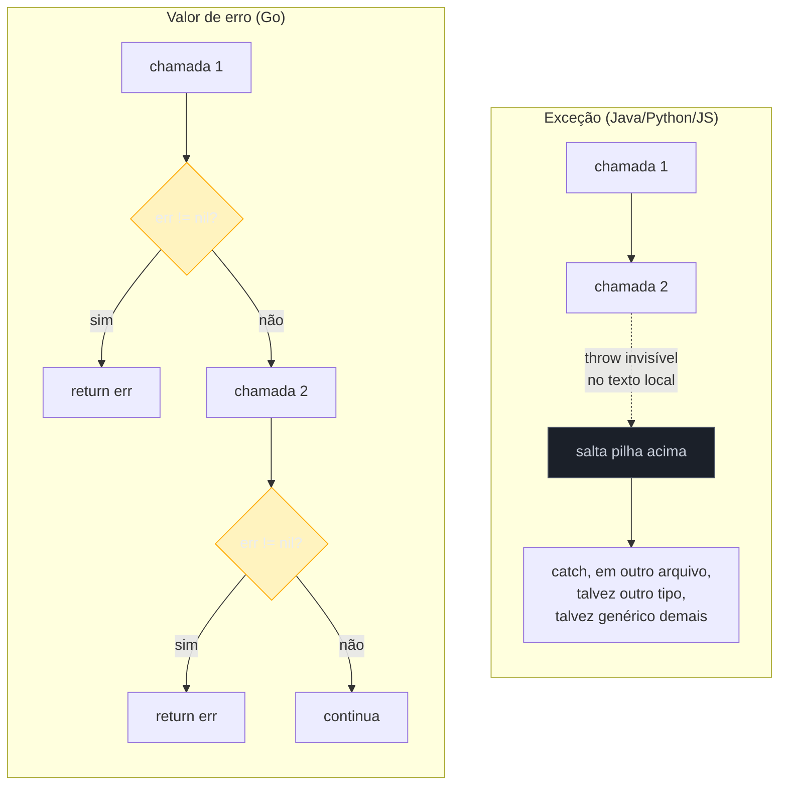
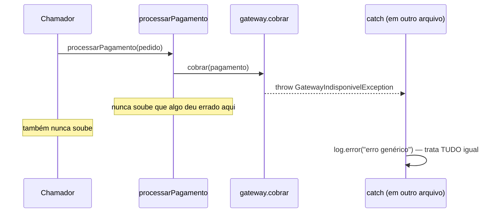
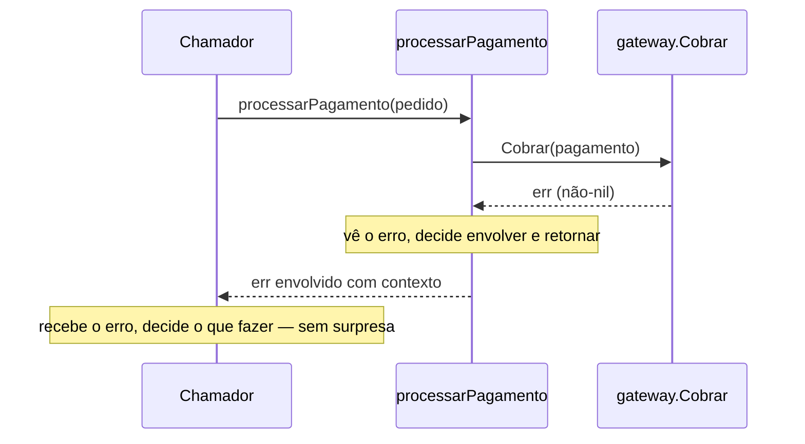

# Erros vs exceções

> [!abstract] TL;DR
> Go não tem `try`/`catch`/`throw`. Um erro é um **valor de retorno** como qualquer outro — você o recebe, checa com `if err != nil`, e decide o que fazer. Isso custa **verbosidade**: o mesmo fluxo que em Java ou Python cabe num bloco `try` único vira, em Go, um `if err != nil { return err }` repetido a cada chamada que pode falhar. Em troca, você ganha **explicitude total**: todo ponto do código onde algo pode dar errado está marcado no próprio texto da função, visível no `go vet`, no diff do code review, na leitura linear de cima para baixo — nada de fluxo de controle invisível subindo pela pilha de chamadas até encontrar um handler distante. A escolha de Go não é ausência de recurso — é a aposta deliberada de que erro é **resultado esperado**, não evento excepcional, e que o custo de digitar `if err != nil` mil vezes vale a pena pela ausência de handlers escondidos e caminhos de execução que o compilador não consegue te mostrar.

## O bug que só aparece em produção

Imagine este método Java, num serviço que processa pagamentos:

```java
public void processarPagamento(Pedido pedido) {
    validar(pedido);
    Pagamento pagamento = criarPagamento(pedido);
    gateway.cobrar(pagamento);
    notificar(pedido, pagamento);
}
```

Quatro chamadas, zero `try`/`catch` à vista. O código parece limpo — mas essa limpeza é uma ilusão de leitura. Cada uma dessas quatro funções pode lançar uma exceção: `validar` pode lançar `PedidoInvalidoException`, `criarPagamento` pode lançar `SaldoInsuficienteException`, `gateway.cobrar` pode lançar `GatewayIndisponivelException` (checked ou unchecked — depende de como o time decidiu modelar), e `notificar` pode lançar qualquer coisa relacionada a rede. Nenhuma dessas possibilidades aparece na assinatura de `processarPagamento`, a menos que sejam *checked exceptions* — e mesmo aí, só até onde a cadeia de `throws` for mantida de forma disciplinada por todo mundo, sempre.

O bug real de produção nasce assim: alguém adiciona um `catch (Exception e)` genérico três chamadas acima na pilha, achando que está tratando "erros de rede". Meses depois, `criarPagamento` passa a lançar `SaldoInsuficienteException` — e esse `catch` genérico engole ela também, sem ninguém perceber, porque a hierarquia de exceções em Java permite isso silenciosamente. O pagamento falha, o log registra "erro genérico", e o pedido do cliente simplesmente... não avança. Ninguém no code review viu isso, porque o `catch` estava em outro arquivo, capturando um tipo amplo demais, longe de onde a exceção nasceu.

Esse é o problema estrutural que Go ataca na raiz: exceções fazem o controle de fluxo **saltar** — de onde o erro nasce até onde alguém, em algum lugar da pilha, decidiu capturá-lo — e esse salto é **invisível na leitura local do código**. Go recusa esse salto por design.

## O mesmo problema, versão Go

```go
func processarPagamento(pedido Pedido) error {
    if err := validar(pedido); err != nil {
        return fmt.Errorf("validar pedido: %w", err)
    }

    pagamento, err := criarPagamento(pedido)
    if err != nil {
        return fmt.Errorf("criar pagamento: %w", err)
    }

    if err := gateway.Cobrar(pagamento); err != nil {
        return fmt.Errorf("cobrar via gateway: %w", err)
    }

    if err := notificar(pedido, pagamento); err != nil {
        return fmt.Errorf("notificar pedido: %w", err)
    }

    return nil
}
```

Quatro chamadas, quatro checagens de `err`. É visivelmente mais texto — e é exatamente esse texto extra que gera a reclamação mais comum de quem chega em Go vindo de linguagens com exceção: "por que eu tenho que escrever `if err != nil` de novo?" A resposta curta é: porque cada ocorrência é o preço, pago à vista, de uma garantia que exceções não dão de graça — **você não pode ignorar um erro por acidente sem que isso apareça no texto do código**. Se `criarPagamento` retorna `(Pagamento, error)` e você escreve `pagamento, _ := criarPagamento(pedido)`, o `_` é uma decisão explícita de descartar o erro — visível, buscável com grep, sinalizável por linter. Em Java, esquecer um `catch` não deixa rastro nenhum no texto — a exceção simplesmente sobe, silenciosamente, até achar (ou não achar) um handler.

## O fluxo de controle, lado a lado



O diagrama mostra a diferença estrutural: no caminho de exceção, existe uma aresta pontilhada — o `throw` — que **sai do fluxo visível** e reaparece em algum lugar não determinado pelo texto local. No caminho Go, toda aresta é **local e sólida**: cada decisão (`err != nil?`) acontece exatamente onde o erro poderia nascer, e a única forma de o erro "desaparecer" é alguém escrever, explicitamente, código que o descarta. Não há aresta pontilhada em Go — porque não há mecanismo de salto embutido na linguagem para erros.

O diagrama de sequência abaixo torna concreto o "salta a pilha" do exemplo de pagamento: a exceção lançada por `gateway.cobrar` nunca é vista por `processarPagamento` nem por quem chamou `processarPagamento` — ela atravessa os dois direto, e só para no primeiro `catch` compatível, esteja ele onde estiver.



Compare com a versão Go do mesmo fluxo, onde cada participante da cadeia efetivamente **vê** o erro passar pela própria mão:



## Por que Go escolheu isso — o argumento dos criadores

Rob Pike, um dos criadores de Go, resumiu o raciocínio de forma direta no [Go Blog](https://go.dev/blog/errors-are-values): "erros são valores" (*errors are values*), e valores — como qualquer outro dado do programa — podem ser programados, transformados, compostos. Uma exceção não é um valor: é um evento de controle de fluxo que interrompe a execução normal. Ao tratar erro como valor comum, Go recusa dar a erros um "modo especial" de propagação — eles seguem exatamente as mesmas regras de qualquer outro dado que passa entre funções: parâmetros de entrada, valores de retorno.

Essa escolha reflete uma tese específica sobre **o que é um erro**, não um acidente histórico da linguagem. A tese: a maioria dos erros que uma função encontra — arquivo não existe, conexão caiu, entrada inválida — não é excepcional no sentido estatístico da palavra. São **resultados esperados e frequentes** de operações que interagem com o mundo exterior (disco, rede, entrada do usuário). Tratar algo frequente como "exceção" — um mecanismo desenhado, historicamente, para casos raros e verdadeiramente excepcionais — é um desalinhamento semântico que o design de Go evita de propósito.

Vale reforçar um detalhe que costuma passar despercebido em discussões sobre exceções em sistemas modernos: a alegada vantagem do stack trace automático de exceções **não atravessa fronteira de processo**. Numa arquitetura de microsserviços — o habitat natural de boa parte do código Go escrito hoje — uma falha que se origina no serviço A e é reportada pelo serviço B não carrega o stack trace da JVM de A dentro da resposta HTTP ou gRPC que B recebeu; o máximo que sobrevive é uma mensagem de erro serializada, exatamente como um `error.Error()` de Go. Nesse cenário, a vantagem prática de exceções — "o runtime me dá o caminho exato até a origem, de graça" — só existe **dentro** de um processo único; entre serviços, tanto Java quanto Go dependem do mesmo mecanismo manual: cada camada precisa anexar contexto explicitamente antes de propagar (em Go, isso é literalmente o que `fmt.Errorf("...: %w", err)` faz; em sistemas Java distribuídos, times acabam reinventando algo parecido via campos de contexto customizados na exceção, porque o stack trace nativo simplesmente não sobrevive à rede). Isso enfraquece um dos argumentos mais comuns a favor de exceções — "elas me dizem onde o erro nasceu, de graça" — justamente no tipo de sistema onde Go mais é usado.

> [!info] `panic`/`recover` existem, mas não são "exceções disfarçadas"
> A [[05 - panic e recover|nota 05]] já cobriu o mecanismo de `panic`/`recover` em detalhe. Vale reforçar aqui, no contraste com exceções: `panic` é reservado para estados **realmente irrecuperáveis** — índice fora dos limites, invariante interna quebrada, bug de programação — não para o fluxo normal de "arquivo não encontrado" ou "usuário digitou algo inválido". Usar `panic` como substituto de `throw` para erros de negócio é o antipadrão mais comum de quem tenta recriar exceções dentro de Go; a comunidade trata isso como sinal de código mal migrado de outra linguagem, não como estilo Go legítimo.

## O custo real: quanto texto a mais?

Vale medir o custo, não só descrevê-lo em abstrato. Numa cadeia de N chamadas que podem falhar, sequenciais, sem lógica de tratamento diferenciada (só propagar), a diferença de linhas é aproximadamente:

| | Java (checked exceptions) | Python/JS (unchecked) | Go |
|---|---|---|---|
| Linhas por chamada que propaga erro | 1 (`throws` na assinatura, uma vez) | 0 | 2-3 (`if err != nil { return ... }`) |
| Onde aparece o "isso pode falhar" | assinatura da função (se checked) ou nada (se unchecked) | nada — descoberto em runtime ou na doc | no corpo, a cada chamada |
| Custo de esquecer o tratamento | erro de compilação (checked) ou nada (unchecked) | nada — só estoura em runtime | nada de automático — mas `_` é buscável e `errcheck`/linters pegam |

A linha "0" para Python/JS não é vantagem gratuita — é o próprio problema que Go recusa: zero texto no ponto de chamada significa zero sinal visual de que ali pode dar errado. O custo não desapareceu, só migrou de "linhas visíveis no código" para "conhecimento tácito que o dev precisa ter sobre o que cada função pode lançar" — conhecimento que normalmente só vive na documentação (se existir e estiver atualizada) ou na cabeça de quem escreveu o código originalmente.

Go faz a troca oposta: paga em linhas visíveis, cobra em runtime praticamente nada além do que o programa já pagaria de qualquer forma (checar uma condição é barato). E o ganho de ferramental é real — `go vet`, `errcheck`, e a própria leitura humana conseguem apontar exatamente onde um erro está sendo descartado, porque descartar é sempre uma linha explícita (`_ = f()` ou similar), nunca ausência silenciosa de handler.

> [!warning] Verbosidade não é sinônimo de robustez — só de visibilidade
> Escrever `if err != nil { return err }` quatro vezes não torna o código automaticamente mais correto — só torna os pontos de falha **visíveis**. É perfeitamente possível escrever Go descuidado que ignora `err` sistematicamente (`resultado, _ := chamada()`), do mesmo jeito que é possível escrever Java com um `catch (Exception e) {}` vazio que engole tudo silenciosamente. A vantagem de Go não é impedir o erro de programação — é tornar esse erro de programação **grep-ável e lint-ável**, porque ele sempre deixa uma marca textual (`_`) em vez de ausência de texto.

## Verbosidade em escala: o que acontece numa base de código grande

A objeção mais comum contra o modelo de Go não é sobre uma função isolada — é sobre o que acontece quando você multiplica `if err != nil` por milhares de pontos de chamada num serviço real. Vale examinar essa objeção com honestidade, porque ela é legítima e não desaparece só porque a filosofia por trás da escolha é sólida.

Times que mantêm bases de código Go grandes desenvolvem, com o tempo, hábitos para conter a repetição sem reintroduzir um mecanismo de salto:

- **Funções "must" para inicialização** — em código de setup (não em lógica de negócio), é comum ver `regexp.MustCompile(padrao)` em vez de checar `err` manualmente: a função interna faz `panic` se a compilação da regex falhar, porque um erro nesse ponto específico (uma constante de regex escrita errada no código-fonte) é, de fato, um bug de programação, não uma condição de runtime — exatamente o caso em que `panic` é apropriado, como a [[05 - panic e recover|nota 05]] já cobriu.
- **Extração de padrões repetidos em helpers locais** — quando a mesma sequência "chamar, envolver erro com o mesmo prefixo, retornar" aparece várias vezes numa função, é comum fatorar isso numa função auxiliar pequena, ainda que o `if err != nil` continue existindo dentro dela.
- **Aceitar a repetição como característica, não como bug** — a postura mais comum e mais alinhada ao idioma da linguagem é simplesmente aceitar que `if err != nil` vai aparecer com frequência, e tratar isso como o preço já orçado, desde a escolha da linguagem, por explicitude. Times que tentam "resolver" isso com metaprogramação ou geração de código pesada geralmente descobrem que o ganho de legibilidade não compensa a complexidade adicional — e voltam para o padrão simples.

O ferramental de análise estática de Go também assume que esse padrão é a norma, não uma falha a ser escondida: `go vet` sinaliza formatos de `Printf` incompatíveis com o tipo do argumento, e linters de terceiros amplamente adotados — `errcheck` (que falha o build se um retorno `error` for descartado sem `_` explícito) e `staticcheck` (que detecta, entre outras coisas, comparações de erro incorretas) — são parte padrão de qualquer pipeline de CI maduro em Go. A postura da comunidade, resumida: o compilador não força tratamento de erro (ao contrário de checked exceptions em Java), mas o **ecossistema de ferramentas** cobre essa lacuna sem reintroduzir a burocracia sintática que checked exceptions impunham.

## Caso prático: a mesma lógica de negócio nas duas famílias

Para tornar o contraste concreto, um exemplo com lógica real — ler um arquivo de configuração, decodificar JSON, e validar um campo obrigatório.

**Java, com checked exception:**

```java
public Config carregarConfig(String caminho) throws ConfigException {
    try {
        String conteudo = Files.readString(Path.of(caminho));
        Config cfg = new ObjectMapper().readValue(conteudo, Config.class);
        if (cfg.getNome() == null || cfg.getNome().isBlank()) {
            throw new ConfigException("campo 'nome' obrigatório ausente");
        }
        return cfg;
    } catch (IOException e) {
        throw new ConfigException("falha ao ler ou decodificar config", e);
    }
}
```

**Go, equivalente:**

```go
func CarregarConfig(caminho string) (Config, error) {
    conteudo, err := os.ReadFile(caminho)
    if err != nil {
        return Config{}, fmt.Errorf("ler arquivo de config: %w", err)
    }

    var cfg Config
    if err := json.Unmarshal(conteudo, &cfg); err != nil {
        return Config{}, fmt.Errorf("decodificar config: %w", err)
    }

    if strings.TrimSpace(cfg.Nome) == "" {
        return Config{}, errors.New("campo 'nome' obrigatório ausente")
    }

    return cfg, nil
}
```

As duas versões fazem o mesmo trabalho, com volume de código comparável — a diferença não é "Go é sempre mais verboso em termos absolutos", é **onde** a verbosidade aparece. Em Java, o `try`/`catch` envolve o bloco inteiro de uma vez — um único ponto de captura para múltiplas fontes de erro, que depois precisa ser desmembrado (`instanceof` ou múltiplos `catch`) se você quiser tratar `IOException` diferente de um erro de parsing. Em Go, cada fonte de erro já chega separada, no ponto exato onde nasce, com o [[03 - Error wrapping e a cadeia de erros|wrapping]] (`%w`) anexando contexto imediatamente, sem precisar de um bloco de captura à parte.

**Python, para completar o trio** — a mesma função, com `try`/`except` envolvendo o corpo inteiro:

```python
def carregar_config(caminho: str) -> Config:
    try:
        with open(caminho) as f:
            dados = json.load(f)
    except (OSError, json.JSONDecodeError) as e:
        raise ConfigError(f"falha ao ler ou decodificar config: {e}") from e

    nome = dados.get("nome", "").strip()
    if not nome:
        raise ConfigError("campo 'nome' obrigatório ausente")

    return Config(**dados)
```

Repare que `open()` pode lançar `OSError` e `json.load()` pode lançar `json.JSONDecodeError` — duas exceções de famílias diferentes, capturadas no mesmo `except`, porque Python permite listar múltiplos tipos numa tupla. É conciso, mas esconde uma pergunta que o código Go força a responder linha a linha: **se `open()` falhar, eu já sei que não faz sentido tentar `json.load()`** — e é exatamente essa sequência de decisões que os `if err != nil` tornam explícita, um a um, em vez de agrupada num bloco só.

## Tratamento diferenciado: onde a exceção brilha e onde ela cobra o preço

Nem tudo é vantagem para Go neste contraste — vale reconhecer onde exceções genuinamente economizam código. Quando uma cadeia de chamadas é **funda** (dez, vinte níveis) e o tratamento real só precisa acontecer **uma vez**, no topo — por exemplo, um handler HTTP que só quer responder 500 para qualquer falha interna, sem se importar com o tipo — um único `try`/`catch` no ponto de entrada resolve isso em Java ou Python sem tocar nenhuma das camadas intermediárias:

```java
@ExceptionHandler(Exception.class)
public ResponseEntity<String> handleAny(Exception e) {
    log.error("erro não tratado", e);
    return ResponseEntity.status(500).body("erro interno");
}
```

Esse handler captura qualquer exceção lançada em qualquer camada abaixo dele, sem que nenhuma camada intermediária precise saber que ele existe. Em Go, o equivalente não desaparece — mas exige que **cada camada intermediária propague o erro explicitamente** até o handler HTTP, porque não há salto automático de pilha:

```go
func handler(w http.ResponseWriter, r *http.Request) {
    if err := processarPedido(r); err != nil {
        log.Error("erro não tratado", "err", err)
        http.Error(w, "erro interno", http.StatusInternalServerError)
        return
    }
    w.WriteHeader(http.StatusOK)
}
```

`processarPedido` só chega até aqui com um `error` não-nil se **cada função no meio do caminho** também propagou o próprio erro corretamente — o que volta ao mesmo argumento de sempre: mais texto em troca de nunca haver um ponto cego onde alguém esqueceu de repassar. Times que migram de Java para Go relatam essa troca como a maior mudança de hábito: não existe mais "vou colocar um catch genérico lá em cima e não preciso mais pensar nisso aqui embaixo" — cada camada carrega sua própria responsabilidade de propagar.

## Node/JS: o problema extra do assíncrono

JavaScript e Node adicionam uma camada de complexidade que Java e Python não têm: erro precisa atravessar fronteira **assíncrona**. Antes de `async`/`await` virar padrão, isso significava callbacks com `(err, resultado)` como primeiro e segundo argumento — convenção do próprio Node, coincidentemente parecida com o `(resultado, err)` de Go, só que sem tipo forçando ninguém a checar `err`:

```js
fs.readFile(caminho, (err, dados) => {
    if (err) {
        console.error("falha ao ler:", err);
        return;
    }
    // usa dados
});
```

Com `async`/`await`, o código volta a parecer síncrono, e `try`/`catch` volta a funcionar através da fronteira assíncrona — desde que você lembre de usar `await`:

```js
async function carregarConfig(caminho) {
    try {
        const conteudo = await fs.promises.readFile(caminho, "utf8");
        const cfg = JSON.parse(conteudo);
        if (!cfg.nome?.trim()) {
            throw new ConfigError("campo 'nome' obrigatório ausente");
        }
        return cfg;
    } catch (e) {
        throw new ConfigError(`falha ao ler ou decodificar config: ${e.message}`);
    }
}
```

O detalhe traiçoeiro do JS: se alguém esquecer o `await` numa chamada que retorna uma `Promise`, o `try`/`catch` ao redor **não captura nada** — a promise rejeitada segue seu próprio caminho, silenciosamente, até virar um `UnhandledPromiseRejection` (que em versões recentes do Node derruba o processo, mas por muito tempo apenas logava um aviso e seguia em frente). É um erro sutil o suficiente para escapar de code review, porque o código *parece* estar dentro de um bloco protegido. Go não tem esse problema porque não tem uma segunda categoria de "chamada que pode falhar de um jeito que o `if err != nil` normal não pega" — toda chamada, síncrona ou não (goroutines à parte, que têm seu próprio mecanismo de comunicação via channel), retorna erro do mesmo jeito.

> [!question]- E se eu quiser tratar tipos de erro diferentes de forma diferente, sem virar um `catch` genérico?
> Go tem resposta pra isso sem precisar de exceção: `errors.Is` e `errors.As`, cobertos na [[02 - Criando e comparando erros|nota 02]], permitem checar "este erro é (ou contém, na cadeia de wrapping) um `ErrSaldoInsuficiente`?" — o equivalente funcional de `catch (SaldoInsuficienteException e)`, só que como uma chamada de função explícita em vez de um mecanismo de linguagem separado. A diferença de fundo continua a mesma: em Go, você **pergunta** ao valor de erro o que ele é; em Java, o runtime **decide por você**, via despacho de exceção, qual bloco `catch` compatível executa.

## O ângulo de desempenho: stack trace tem custo

Existe uma diferença mensurável, não só filosófica, entre lançar uma exceção e retornar um valor de erro: **exceções em Java, Python e JS capturam automaticamente um stack trace no momento em que são criadas** — a JVM, por exemplo, percorre a pilha de chamadas inteira e monta um objeto com cada frame, mesmo que ninguém nunca vá imprimir esse stack trace. Esse trabalho acontece **toda vez que uma exceção é instanciada**, antes mesmo do `throw`.

Isso raramente importa em código que lança exceções esporadicamente — um erro por requisição HTTP, digamos, não pesa em nada. Mas vira problema real em dois cenários que aparecem com frequência em sistemas grandes:

1. **Exceções usadas como controle de fluxo em loop quente** — por exemplo, `NumberFormatException` para testar se uma string é numérica, dentro de um laço que roda milhões de vezes. Cada exceção lançada paga o custo de montar o stack trace, mesmo descartado logo em seguida.
2. **Bibliotecas que lançam exceções para sinalizar condições comuns**, não excepcionais — parsers que lançam para "fim do arquivo", validadores que lançam para "campo ausente" num formulário com muitos campos opcionais.

Um valor `error` em Go não carrega esse custo: `errors.New("algo")` aloca uma struct pequena com uma string — sem caminhar pilha nenhuma, sem montar frame algum, a menos que você peça explicitamente (por exemplo, com `runtime.Callers` para debugging). Retornar `error` de uma função chamada em loop apertado é, em termos de alocação e trabalho de CPU, comparável a retornar qualquer outro valor pequeno — porque é exatamente isso que é.

> [!info] Isso não significa que exceções são "lentas" para todo uso
> Frameworks Java modernos como a JVM otimizam bastante o caso comum, e algumas implementações permitem desabilitar a captura de stack trace (`fillInStackTrace()` sobrescrito para não fazer nada) quando o custo importa. O ponto não é "exceção é sempre lenta" — é que o **modelo de erro-como-valor não paga esse custo por padrão**, porque nunca teve a obrigação de capturar contexto de pilha para começar. A tese de Go, de novo, é filosófica antes de ser sobre performance: erro comum não devia custar mais do que qualquer outro valor de retorno.

## Armadilhas comuns

> [!warning] Recriar `try`/`catch` com goto e labels
> Devs vindos de C ou de linguagens com exceção às vezes tentam simular um bloco `try` único usando `goto` e uma label `cleanup:` no fim da função, para "capturar" todos os erros num só lugar. Isso é possível sintaticamente em Go, mas é o oposto do idioma da linguagem — o padrão idiomático é justamente `if err != nil { return ... }` linha a linha, sem tentar recentralizar o tratamento.

> [!warning] Ignorar erro achando que "não vai acontecer aqui"
> `resultado, _ := estrategia.Executar()` compila sem aviso do compilador — só ferramentas externas (`go vet` com certas checagens, `errcheck`, `staticcheck`) pegam isso. Quem vem de Java, onde uma checked exception não tratada é erro de **compilação**, estranha que Go permita esse silêncio. A defesa de Go é ferramental (linters no CI), não o compilador — vale configurar `errcheck` ou equivalente no pipeline de qualquer projeto sério.

> [!warning] Empilhar `if err != nil` sem nenhum contexto adicional
> `if err != nil { return err }`, repetido sem `fmt.Errorf("...: %w", err)`, propaga o erro mas perde a chance de anexar onde, na cadeia de chamadas, ele foi visto. É o mesmo problema de um `catch (Exception e) { throw e; }` em Java — tecnicamente propaga, mas desperdiça a oportunidade de enriquecer o erro com contexto local, tema já coberto na [[03 - Error wrapping e a cadeia de erros|nota 03]].

## O debate histórico: checked exceptions e a rejeição explícita de Go

A decisão de Go não nasceu no vácuo — nasceu depois de duas décadas de debate real na comunidade Java sobre se *checked exceptions* (aquelas que a assinatura declara com `throws` e o compilador obriga a tratar ou repassar) foram um bom design. A promessa original era boa: o compilador força você a lidar com toda falha possível, então nada escapa. Na prática, o resultado mais comum em bases de código grandes foi outro — desenvolvedores sob pressão de prazo escrevendo `catch (Exception e) { /* nunca deveria acontecer */ }` só para fazer o compilador parar de reclamar, ou métodos com `throws Exception` genérico que devolvem a obrigação pra quem chama, sem informação nenhuma sobre o que de fato pode falhar. O próprio ecossistema Java girou contra a ideia com o tempo: bibliotecas populares (Spring, Hibernate) migraram para exceções *unchecked* nas versões mais recentes, precisamente para escapar da burocracia que checked exceptions impunham sem entregar a garantia prometida.

A [FAQ oficial de Go](https://go.dev/doc/faq#exceptions) endereça essa história diretamente, ao explicar por que a linguagem não adotou `try`/`catch`/`throw`: o argumento dos criadores é que mecanismos de exceção tendem a encorajar programadores a rotular erros comuns demais — como um arquivo não conseguir abrir — como "excepcionais", quando na maior parte do software esse tipo de falha é **rotina esperada**, não anomalia. A resposta idiomática de Go se conecta direto a isso: ao usar `error` como valor de retorno normal, e reservar `panic` só para situações genuinamente irrecuperáveis, a linguagem recusa dar aos devs a tentação de "empurrar o erro pra cima e não pensar mais nisso agora" — tentação que checked exceptions criaram, apesar da boa intenção original, e que unchecked exceptions abraçam sem nem tentar resistir.

Vale registrar que essa não é uma posição sem contestação dentro da própria comunidade Go — é comum ver discussões sobre fadiga de `if err != nil` repetitivo, e ferramentas como `errors.Join` (Go 1.20) e propostas de sintaxe mais enxuta (`try` embutido, rejeitada oficialmente em 2019 após feedback negativo da comunidade) mostram que o trade-off é sentido, discutido e ativamente calibrado — não uma escolha estática e incontestável. Mas o consenso que prevaleceu, e que se mantém até a versão atual da linguagem, é que a visibilidade vale mais que a concisão.

> [!info] `errors.Join` (Go 1.20+) — combinar múltiplos erros num só valor
> Quando mais de uma operação independente pode falhar (por exemplo, fechar vários recursos num `defer`) e você quer reportar todas as falhas, não só a primeira, `errors.Join(err1, err2, ...)` produz um único `error` que envolve todos, navegável depois com `errors.Is`/`errors.As` em cada um. É um recurso que só faz sentido dentro do modelo de erro-como-valor — não existe equivalente direto e nativo em `try`/`catch`, onde normalmente só a primeira exceção lançada é capturada e as demais (se o `finally` também falhar) ficam suprimidas ou perdidas, a menos que a linguagem tenha um recurso específico pra isso (Java 7+ tem *suppressed exceptions* justamente para cobrir esse buraco).

## Caso prático adicional: retry com backoff, os dois estilos

Uma situação comum em produção — tentar de novo uma chamada de rede algumas vezes antes de desistir — deixa claro como o modelo de erro-como-valor se encaixa naturalmente em lógica de controle que, com exceção, exige mais cerimônia.

**Go**, usando o `error` retornado como condição de laço, sem nada especial:

```go
func chamarComRetry(ctx context.Context, max int) (Resposta, error) {
    var ultimoErr error

    for tentativa := 1; tentativa <= max; tentativa++ {
        resp, err := chamarServico(ctx)
        if err == nil {
            return resp, nil
        }
        ultimoErr = err
        time.Sleep(time.Duration(tentativa) * 100 * time.Millisecond)
    }

    return Resposta{}, fmt.Errorf("todas as %d tentativas falharam: %w", max, ultimoErr)
}
```

**Java**, precisando de `try`/`catch` dentro do próprio laço — porque a exceção, por definição, interrompe o fluxo, e o laço só sobrevive se você a intercepta a cada volta:

```java
public Resposta chamarComRetry(int max) throws ServicoException {
    ServicoException ultimaExcecao = null;

    for (int tentativa = 1; tentativa <= max; tentativa++) {
        try {
            return chamarServico();
        } catch (ServicoException e) {
            ultimaExcecao = e;
            sleep(tentativa * 100L);
        }
    }

    throw new ServicoException("todas as " + max + " tentativas falharam", ultimaExcecao);
}
```

As duas versões acabam com estrutura parecida — mas repare que a versão Java precisa do `try`/`catch` **dentro** do laço só para que uma falha não aborte a tentativa seguinte; sem esse bloco, a primeira exceção lançada sairia direto do método, pulando o resto das iterações. Em Go, isso é automático: `err != nil` não interrompe nada por conta própria — só interrompe se o código explicitamente disser `return`. É outra face do mesmo argumento central desta nota: o controle de fluxo em Go nunca sai das mãos de quem escreveu a função, porque não existe um mecanismo de linguagem que o faça por conta própria.

## Vindo de Java, Python ou Node: o que muda de verdade

| Conceito | Java | Python | Node/JS | Go |
|---|---|---|---|---|
| Mecanismo | `throw`/`try`/`catch`, checked e unchecked | `raise`/`try`/`except` | `throw`/`try`/`catch`, promises rejeitadas | `error` como valor de retorno |
| Onde o erro é visível | assinatura (`throws`, só se checked) | nenhum lugar fixo — via doc ou convenção | nenhum lugar fixo — via doc ou `.d.ts` opcional | assinatura da função sempre (`(T, error)`) |
| Custo de "esquecer" o tratamento | erro de compilação (checked) / crash em runtime (unchecked) | crash em runtime | crash em runtime (síncrono) ou promise rejeitada silenciosa | nenhum automático — mas descartar é textual e lint-ável |
| Fluxo de controle na falha | salta a pilha até o `catch` mais próximo compatível | idem | idem | segue o fluxo normal de `return`, sem salto |
| Filosofia | erro raro = exceção; controle normal ≠ erro | idem | idem | erro é resultado comum de operações com o mundo externo |

A linha mais importante da tabela é a última: a diferença entre Go e as outras três não é sintaxe — é **filosofia sobre a frequência esperada de erro**. Linguagens com exceção partem da premissa de que erro é raro o suficiente para justificar um mecanismo de controle separado do fluxo normal. Go parte da premissa oposta: erro, especialmente em sistemas que tocam disco, rede ou entrada externa, é rotina — e rotina merece o mesmo tratamento sintático de qualquer outro valor, sem categoria especial.

## Como explicar em inglês

> Go has no `try`/`catch`/`throw` — an error is just a value, returned alongside the normal result and checked with `if err != nil`. This trades verbosity (every fallible call needs its own check) for explicitness: every point where something can fail is visible in the function's own text, not hidden behind an invisible stack unwind that surfaces at some distant `catch` block. Rob Pike's framing — "errors are values" — captures the design bet: most errors, especially ones from I/O, are expected outcomes of interacting with the outside world, not truly exceptional events, so they deserve the same treatment as any other return value rather than a separate control-flow mechanism. The cost is real (more lines, no compiler-enforced handling), but it's paid in a form that's grep-able and lint-able — discarding an error always leaves a textual mark (`_`), unlike a silently swallowed exception three stack frames away.

| Termo PT | Termo EN |
|---|---|
| erro como valor | error as a value |
| exceção | exception |
| lançar uma exceção | throw an exception |
| capturar uma exceção | catch an exception |
| desenrolar a pilha | stack unwind |
| fluxo de controle | control flow |
| erro esperado / comum | expected / routine error |
| erro excepcional | exceptional error |
| verbosidade | verbosity |
| explicitude | explicitness |

## O que vem a seguir

Entender por que Go recusa exceções explica a filosofia — mas não diz, sozinho, como organizar tratamento de erro num serviço real de produção: quando envolver, quando comparar com `errors.Is`/`errors.As`, quando logar e seguir, quando abortar. A [[08 - Padrões de erro em produção|nota 08]] fecha o galho reunindo esses padrões num cenário prático, de ponta a ponta.

## Veja também

- [[01 - Erros são valores — o tipo error|01 — Erros são valores — o tipo error]] — a base do mecanismo que esta nota contrasta com exceções
- [[03 - Error wrapping e a cadeia de erros|03 — Error wrapping e a cadeia de erros]] — `%w` como substituto do contexto que um `catch` acumularia
- [[05 - panic e recover|05 — panic e recover]] — o mecanismo de Go para estados realmente irrecuperáveis, não confundir com exceções de negócio
- [[06 - Estratégias de tratamento de erro|06 — Estratégias de tratamento de erro]] — quando propagar, envolver, logar ou abortar
- [[08 - Padrões de erro em produção|08 — Padrões de erro em produção]] — próxima nota do galho
- [[03-Dominios/Tecnologia/Go/index|Trilha Go]]

## O que essa escolha custa fora do código: cultura de time

Um último ângulo, menos técnico e mais organizacional, vale registrar antes de fechar: a ausência de exceções muda a forma como times revisam código. Em linguagens com exceção, um code review frequentemente precisa perguntar "essa exceção é capturada em algum lugar acima? Onde?" — pergunta que exige rastrear a árvore de chamadas, muitas vezes através de múltiplos arquivos ou até módulos, porque o `catch` pode estar arbitrariamente longe. Em Go, a pergunta equivalente — "esse erro está sendo tratado?" — se responde **olhando só para a função em questão**: ou tem um `if err != nil`, ou tem um `_` explícito descartando, ou o erro sobe no `return` para quem chamou. Não há necessidade de rastrear nada fora do escopo visível.

Essa localidade tem um efeito prático em revisão de código que vale nomear: revisar uma função Go para "todo erro está sendo tratado corretamente?" é uma tarefa **fechada** — dá pra responder com certeza olhando só aquele trecho. A mesma pergunta sobre uma função Java exige, em geral, conhecimento de todo o resto do sistema — ou, na prática, confiança de que alguém, em algum lugar, cuidou disso. É esse tipo de garantia local, mais do que qualquer preferência estética por chaves ou por `if`, que sustenta a afirmação recorrente da comunidade Go de que o código, apesar de mais longo, é **mais fácil de auditar** exatamente onde mais importa: no ponto onde o erro nasce.

## Fontes

- Pike, Rob. *Errors are values*. The Go Blog, go.dev. https://go.dev/blog/errors-are-values (acessado em 2026-07-18)
- The Go Authors. *Error handling and Go*. The Go Blog, go.dev. https://go.dev/blog/error-handling-and-go (acessado em 2026-07-18)
- The Go Authors. *Effective Go — Errors*. go.dev. https://go.dev/doc/effective_go#errors (acessado em 2026-07-18)
- The Go Authors. *Working with Errors in Go 1.13*. The Go Blog, go.dev. https://go.dev/blog/go1.13-errors (acessado em 2026-07-18)
- The Go Authors. *Go FAQ — Why does Go not have exceptions?*. go.dev. https://go.dev/doc/faq#exceptions (acessado em 2026-07-18)
- Go by Example. *Errors*. gobyexample.com. https://gobyexample.com/errors (acessado em 2026-07-18)
