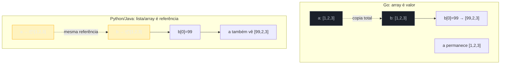

# Arrays e o modelo de valor

> [!abstract] TL;DR
> Um **array** em Go — `[5]int` — tem tamanho **fixo**, gravado no próprio tipo: `[5]int` e `[10]int` são tipos diferentes, incompatíveis entre si, do mesmo jeito que `int` e `string` são. E, ao contrário de quase toda linguagem popular (Java, Python, JS, C#), um array em Go é um **valor**: atribuir `b := a` ou passar `a` para uma função **copia todos os elementos**, não copia uma referência. Essa combinação — tamanho no tipo + semântica de cópia total — é exatamente por isso que arrays quase não aparecem em código Go do dia a dia. O tipo que você vai usar 95% do tempo é o **slice**, construído por cima de array, que resolve os dois problemas. Esta nota existe para você entender o alicerce antes de conhecer a solução.

## Um tamanho de time que não muda

Imagine que você está modelando um time de futebol de salão: exatamente 5 jogadores em quadra, nem mais nem menos. Não é uma lista que cresce e encolhe — é uma escalação fixa, com um lugar reservado para cada posição. Go tem um tipo desenhado exatamente para essa forma: o **array**.

```go
var titulares [5]string
titulares[0] = "Goleiro"
titulares[1] = "Fixo"
titulares[2] = "Ala 1"
titulares[3] = "Ala 2"
titulares[4] = "Pivô"

fmt.Println(titulares) // [Goleiro Fixo Ala 1 Ala 2 Pivô]
fmt.Println(len(titulares)) // 5
```

`[5]string` é o tipo inteiro — não "um array de strings de tamanho arbitrário que por acaso tem 5 elementos agora". O `5` faz parte da assinatura do tipo, do mesmo jeito que `string` faz. Isso já separa Go da maioria das linguagens que você conhece: em Java, `String[] titulares = new String[5]` tem o tamanho como um detalhe de *instância*, não de *tipo* — o tipo declarado é só `String[]`. Em Go, `[5]string` e `[10]string` são **tipos distintos**, tão incompatíveis entre si quanto `int` e `bool`:

```go
var cinco [5]int
var dez [10]int

// cinco = dez // não compila: mismatched types [5]int and [10]int
```

O compilador recusa essa atribuição na hora — nem chega a rodar. Não existe conversão implícita de tamanho, porque não existe "array" como conceito solto em Go: existe `[5]int`, existe `[10]int`, cada um seu próprio tipo, do jeito que a [especificação da linguagem](https://go.dev/ref/spec#Array_types) formaliza: "the length is part of the array's type".

## O array é o valor inteiro — não um ponteiro para ele

Aqui está a segunda surpresa, e a mais importante desta nota. Em Java, Python, JavaScript, C# — praticamente qualquer linguagem com coleções embutidas — um array (ou lista) por trás das cenas é uma referência: a variável guarda um ponteiro para um bloco de memória em outro lugar, e copiar a variável copia o ponteiro, não os dados.

Go faz a escolha oposta. Um array **é** seus elementos, lado a lado, sem indireção nenhuma. Atribuir uma variável de array a outra, ou passá-la para uma função, **copia todo o conteúdo**:

```go
a := [3]int{1, 2, 3}
b := a        // copia os 3 inteiros — b é um array independente
b[0] = 99

fmt.Println(a) // [1 2 3]  — a não mudou
fmt.Println(b) // [99 2 3] — só b mudou
```

Compare com o que Python faria com uma lista, ou Java com um array de verdade:

```python
a = [1, 2, 3]
b = a          # b aponta pro MESMO objeto lista
b[0] = 99
print(a)       # [99, 2, 3] — a também mudou!
```

Em Python, `b = a` copia a *referência*; as duas variáveis apontam para a mesma lista na memória, e mudar uma afeta a outra. Em Go, `b := a` copia os *bytes*; `a` e `b` são dois arrays completamente separados a partir do momento da atribuição. Não há coincidência de memória nenhuma entre eles depois da cópia.



O mesmo vale para passar um array como argumento de função — Go passa tudo por valor, e array não é exceção:

```go
func zera(arr [3]int) {
    for i := range arr {
        arr[i] = 0
    }
}

func main() {
    nums := [3]int{1, 2, 3}
    zera(nums)
    fmt.Println(nums) // [1 2 3] — a função só zerou sua PRÓPRIA cópia
}
```

`zera` recebe uma cópia inteira de `nums` — os três inteiros são duplicados na pilha da função. Zerar `arr` dentro de `zera` não tem efeito nenhum fora dela, porque `arr` e `nums` já não são o mesmo array a partir da chamada. Se a intenção fosse mutar o array original, seria preciso um ponteiro explícito — `func zera(arr *[3]int)` — assunto que a nota [[01 - Fundamentos e sintaxe/07 - Ponteiros e o modelo de memória|07 do Galho 1]] já preparou o terreno para entender.

> [!warning] Copiar um array grande por valor tem custo real
> Um array de 1000 `int64` são 8000 bytes. Cada atribuição, cada passagem de função, cada `return` de um array desse tamanho **copia os 8000 bytes inteiros** — não é uma operação O(1) como copiar um ponteiro. Esse custo, silencioso e fácil de não perceber num code review superficial, é uma das razões práticas pelas quais arrays são raros: o Go idiomático evita passar coleções grandes por valor.

## Por que arrays quase não aparecem em código Go real

Junte as duas peças — tamanho fixo no tipo, e cópia total a cada atribuição — e a razão pela qual você vai escrever `[5]int` raramente fica óbvia:

1. **Tamanho fixo no tipo é rígido demais para a maioria dos problemas.** Uma lista de itens de pedido, um conjunto de linhas lidas de um arquivo, os resultados de uma query — nenhum desses tem tamanho conhecido em tempo de compilação. Um array não serve; você precisaria saber `[N]T` de antemão, para todo `N` possível, o que é impossível.
2. **Cópia total é surpreendente e cara** se você não está pensando ativamente nela. Vindo de qualquer linguagem com coleções por referência, o reflexo natural é tratar uma coleção como algo que se compartilha ao passar adiante — e um array quebra esse reflexo sem avisar, silenciosamente, produzindo bugs sutis ("por que minha mudança não apareceu do outro lado?") ou custo de performance inesperado.

A resposta de Go para os dois problemas é o **slice** — um tipo construído *sobre* um array (por baixo dos panos, todo slice referencia um array em algum lugar da memória), mas com tamanho dinâmico e semântica de referência parcial: copiar um slice copia uma "janela" leve (ponteiro + tamanho + capacidade), não os dados inteiros. É por isso que praticamente todo código Go que você vai ler usa `[]int`, `[]string`, `[]Pedido` — colchetes vazios, sem número — e quase nunca `[5]int`.

> [!info] Onde array ainda aparece
> Arrays não desapareceram do vocabulário Go. Eles aparecem quando o tamanho fixo é exatamente a garantia que você quer: um hash SHA-256 é sempre `[32]byte`, nunca mais nem menos; uma cor RGB é `[3]uint8`. Nesses casos, o tamanho fixo no tipo é uma feature — o compilador recusa, em tempo de compilação, um hash com bytes a mais ou a menos. Fora desses casos de tamanho estruturalmente fixo, o slice ganha.

## Casos práticos

**1. Declaração, tamanho inferido com `...` e comparação:**

```go
package main

import "fmt"

func main() {
    // Tamanho explícito
    var pares [3]int
    pares[0], pares[1], pares[2] = 2, 4, 6

    // Tamanho inferido a partir do literal — [...]int conta os elementos
    impares := [...]int{1, 3, 5, 7}
    fmt.Println(len(impares)) // 4

    // Arrays são comparáveis com == quando o tipo do elemento também é
    a := [3]int{1, 2, 3}
    b := [3]int{1, 2, 3}
    fmt.Println(a == b) // true — compara elemento a elemento, não identidade
}
```

> [!info] Arrays são comparáveis, slices não
> `a == b` compila e funciona para arrays (desde que o tipo do elemento seja comparável), mas o mesmo código com `[]int` no lugar de `[3]int` **não compila**: `invalid operation: slice can only be compared to nil`. Comparabilidade é mais uma consequência do array ser um valor puro — dois arrays são "iguais" se todo elemento correspondente é igual, exatamente como comparar dois structs campo a campo.

**2. Array multidimensional — um tabuleiro fixo:**

```go
var tabuleiro [3][3]string // tabuleiro de jogo da velha, 3x3, tamanho fixo pra sempre

func main() {
    tabuleiro[1][1] = "X" // centro
    for _, linha := range tabuleiro {
        fmt.Println(linha)
    }
}
```

`[3][3]string` é um array de 3 arrays `[3]string` — cada dimensão também é parte fixa do tipo. Serve bem para algo genuinamente fixo, como um tabuleiro de jogo da velha; para uma matriz de tamanho variável, a resposta de novo é slice de slices, ou uma struct dedicada.

**3. Provando a cópia com um `struct` dentro do array:**

```go
type Ponto struct{ X, Y int }

func mover(pontos [2]Ponto) {
    pontos[0].X = 999 // muda só a cópia local
}

func main() {
    original := [2]Ponto{{1, 1}, {2, 2}}
    mover(original)
    fmt.Println(original) // [{1 1} {2 2}] — intacto
}
```

Mesmo com structs dentro, a regra não muda: `mover` recebe um array inteiro copiado, `struct` e tudo. Nenhuma mutação dentro da função escapa para `original`.

## Armadilhas comuns

> [!warning] `[5]int` e `[10]int` não são "o mesmo array com tamanhos diferentes" — são tipos diferentes
> Funções genéricas sobre "qualquer array de int, qualquer tamanho" não existem sem generics (Galho 6). Uma função `func Soma(a [5]int) int` só aceita `[5]int` — passar um `[10]int` é erro de compilação, não um `IndexOutOfBounds` em runtime como em Java.

> [!warning] `range` sobre array copia o array inteiro se você não usar índice/ponteiro
> `for _, v := range arr` itera sobre uma cópia de `arr` feita no início do loop (para arrays — não para slices, que são leves de copiar). Mudar `arr` dentro do próprio loop, por exemplo, não afeta os valores que o `range` já capturou. Isso raramente importa na prática porque array grande com `range` já é raro, mas explica comportamento aparentemente inconsistente para quem tenta.

> [!warning] Confundir array com slice na assinatura de função
> `func f(s []int)` e `func f(a [5]int)` são assinaturas totalmente diferentes — a primeira aceita slices de qualquer tamanho passados por referência leve, a segunda só aceita exatamente `[5]int` copiado por inteiro. Ao ler `[N]T` num código Go, sempre confira se o `N` está lá — a ausência dele (`[]T`) é o slice, o caso comum.

## Lente cross-stack

| Vindo de... | Em Go |
|---|---|
| Java `int[5]` (tamanho de instância, tipo é só `int[]`) | `[5]int` (tamanho **é** o tipo — `[5]int` ≠ `[10]int`) |
| Python `list` (referência, cresce dinamicamente) | array Go não cresce; quem cresce é o **slice**, próxima nota |
| JS `Array` (referência, tamanho dinâmico) | mesmo caso — o análogo funcional de `Array` é slice, não array |
| C `int arr[5]` (também valor, também cópia total) | comportamento quase idêntico — Go herdou essa semântica de linguagens de sistema |

A comparação mais honesta não é com Java/Python/JS — é com C. Quem já programou em C reconhece a semântica de array-como-valor na hora; é o resto do mundo (linguagens gerenciadas com coleções por referência) que precisa recalibrar a intuição aqui.

## Como explicar em inglês

> A Go **array** has a fixed length that's part of its type — `[5]int` and `[10]int` are distinct, incompatible types, not the same type with different runtime sizes. More surprising to anyone coming from Java, Python, or JavaScript: a Go array **is a value**. Assigning one array variable to another, or passing an array to a function, copies every element — there's no shared reference underneath, unlike Python lists or Java arrays, which are reference types by default. That combination — fixed size baked into the type, plus full-value copy semantics — is exactly why arrays are rare in idiomatic Go code. The type you'll actually reach for almost every time is the **slice**, built on top of an array but with dynamic length and lightweight reference-like copying.

| Termo PT | Termo EN |
|---|---|
| array | array |
| tamanho fixo | fixed length / fixed size |
| cópia total / cópia por valor | full copy / copy by value |
| tipo do array | array type |
| comparável | comparable |
| array multidimensional | multidimensional array |
| tipo subjacente | underlying type |

## O que vem a seguir

Array estabeleceu o alicerce — bloco contíguo de memória, tamanho fixo, semântica de valor — mas na prática você vai escrever `[]int`, não `[5]int`, quase o tempo todo. A [[02 - Slices — o cavalo de batalha|próxima nota]] apresenta o **slice**: como ele se constrói por cima do array que acabamos de ver, por que resolve os dois problemas que tornam array raro (tamanho rígido e custo de cópia), e por que é, sem exagero, a estrutura de dados mais usada em qualquer código Go de produção.

## Veja também

- [[02 - Slices — o cavalo de batalha|02 — Slices — o cavalo de batalha]] — próxima nota do galho
- [[05 - O modelo de memória de slices — len, cap e aliasing|05 — O modelo de memória de slices]] — aprofunda a relação array/slice por trás dos bastidores
- [[03-Dominios/Tecnologia/Go/01 - Fundamentos e sintaxe/07 - Ponteiros e o modelo de memória|Galho 1, nota 07]] — modelo de valor e ponteiros, pré-requisito direto desta nota
- [[03-Dominios/Tecnologia/Go/index|Trilha Go]]

## Fontes

- The Go Authors. *The Go Programming Language Specification — Array types*. go.dev. https://go.dev/ref/spec#Array_types (acessado em 2026-07-18)
- The Go Authors. *A Tour of Go — Arrays*. go.dev. https://go.dev/tour/moretypes/6 (acessado em 2026-07-18)
- The Go Authors. *Effective Go — Arrays*. go.dev. https://go.dev/doc/effective_go#arrays (acessado em 2026-07-18)
- Go by Example. *Arrays*. gobyexample.com. https://gobyexample.com/arrays (acessado em 2026-07-18)
- The Go Blog. *Arrays, slices (and strings): The mechanics of 'append'*. go.dev. https://go.dev/blog/slices (acessado em 2026-07-18)
