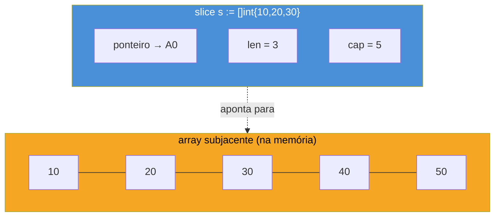
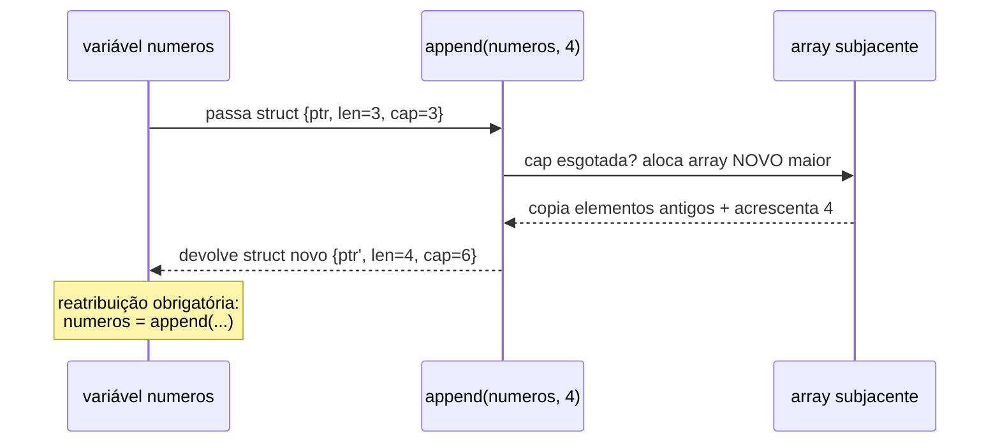

# Slices — o cavalo de batalha

> [!abstract] TL;DR
> Um **slice** é uma janela redimensionável sobre um array subjacente: um struct de três campos invisíveis (ponteiro, tamanho, capacidade) que Go passa para você como se fosse "a lista dinâmica" da linguagem. Você cria com `[]T{...}` (literal) ou `make([]T, tamanho)` (tamanho conhecido), indexa com `s[i]` igual a qualquer array, e cresce com `s = append(s, valor)` — sempre reatribuindo o retorno, porque `append` pode ou não trocar o array de baixo. Para percorrer, `range` entrega índice e valor a cada volta. Slice é, de longe, a estrutura mais usada em Go idiomático: onde Java usaria `List<T>` e Python usaria `list`, Go usa `[]T` quase sempre — e as poucas armadilhas de `append`/capacidade (aprofundadas na próxima nota) são o preço de entrada para dominar a linguagem de verdade.

## O problema que array não resolve

A nota anterior deste galho mostrou o array: `[5]int`, tamanho fixo, gravado no próprio tipo. `[5]int` e `[10]int` são tipos **diferentes** — incompatíveis entre si, e péssimos para o caso mais comum do dia a dia de programação: uma lista cujo tamanho você só sabe em tempo de execução.

Pense num cenário banal — ler linhas de um arquivo e guardar cada uma numa lista, sem saber de antemão quantas linhas existem:

```go
// Com array, isso é impossível de declarar direito:
var linhas [???]string // ??? não é um tamanho, é a pergunta que falta responder
```

Não dá. Array exige o tamanho na declaração do tipo. Toda linguagem com array de tamanho fixo — C, e o próprio Go no nível mais baixo — precisa de uma segunda estrutura para o caso comum: uma lista que cresce. Java tem `ArrayList`, Python tem `list`, JavaScript tem `Array` (que já nasce dinâmico). Go tem o **slice**.

## Slice é uma janela, não uma cópia

A metáfora que vale gravar antes de qualquer código: um slice não *é* os dados — é uma **janela** sobre um array que existe em algum lugar da memória. "Slice" em inglês significa fatia, e é exatamente isso: uma fatia de um array, com início, comprimento e um limite de até onde essa fatia pode crescer sem precisar de um array novo.



Por baixo, um slice é um struct de três campos que o runtime de Go gerencia por você:

- **ponteiro** — para o primeiro elemento visível do array subjacente;
- **len** (*length*) — quantos elementos o slice enxerga agora;
- **cap** (*capacity*) — até onde o slice pode crescer *sem* precisar de um array novo, contando do ponteiro em diante.

Essa nota fica no nível de uso — criar, indexar, `append`, `range`. O mecanismo interno de `len`/`cap`/aliasing (por que dois slices às vezes compartilham o mesmo array, e as armadilhas que isso causa) é assunto inteiro da [[05 - O modelo de memória de slices — len, cap e aliasing|próxima-mas-uma nota]]. Por ora, o que importa é: slice é referência a dados, não os dados em si — diferente de array, que a nota anterior mostrou ser copiado por valor.

## Criando um slice

Duas formas cobrem quase todo código Go do dia a dia.

**Slice literal** — quando você já sabe os valores:

```go
nomes := []string{"Ana", "Bruno", "Caio"}
fmt.Println(nomes)    // [Ana Bruno Caio]
fmt.Println(len(nomes)) // 3
```

Repare na sintaxe: `[]string{...}` — sem número entre colchetes. É essa ausência de número que diferencia um slice literal (`[]T{...}`) de um array literal (`[3]T{...}`, com tamanho fixo). A mesma sintaxe de chaves, o mesmo aspecto visual — mas tipos completamente diferentes por baixo.

**`make`** — quando você sabe o tamanho, mas não os valores ainda (o caso comum de "vou preencher isso num laço depois"):

```go
notas := make([]float64, 5) // slice de 5 float64, todos zero-valued (0.0)
fmt.Println(notas)          // [0 0 0 0 0]
fmt.Println(len(notas))     // 5
```

`make([]T, tamanho)` cria o array subjacente com `tamanho` elementos, já zerados (zero value do tipo `T`, conceito que o Galho 1 já apresentou), e devolve um slice com `len == cap == tamanho`. Existe uma terceira forma de `make`, com um segundo argumento de capacidade separado — `make([]T, len, cap)` — mas essa variação é ferramenta de otimização de performance, não de uso básico; ela pertence de corpo inteiro à nota sobre `len`/`cap` mais adiante no galho.

Um slice vazio (não `nil`, mas com zero elementos) também é legítimo: `[]int{}` ou `make([]int, 0)`. E um slice **não inicializado** — só `var s []int`, sem literal nem `make` — vale `nil`, mas ainda assim é seguro chamar `len(s)` (retorna `0`) e até `append(s, ...)` nele. Isso contrasta com Java, onde uma `List` `null` explode em `NullPointerException` na primeira chamada de método.

## Indexando um slice

Indexação usa exatamente a sintaxe de array — colchetes, índice baseado em zero:

```go
nomes := []string{"Ana", "Bruno", "Caio"}
fmt.Println(nomes[0]) // Ana
fmt.Println(nomes[2]) // Caio

nomes[1] = "Beatriz"
fmt.Println(nomes) // [Ana Beatriz Caio]
```

`nomes[i]` lê ou escreve o elemento na posição `i` — sem cópia envolvida, porque você está mexendo direto no array subjacente através da janela do slice. Índice fora de `[0, len(s))` — negativo ou `>= len(s)` — não é erro de compilação (o compilador não sabe o tamanho em tempo estático, diferente de array), é **pânico em tempo de execução**:

```go
nomes := []string{"Ana", "Bruno"}
fmt.Println(nomes[5]) // panic: runtime error: index out of range [5] with length 2
```

## `append`: crescendo um slice

Aqui está o mecanismo que faz do slice "a lista dinâmica" de Go. `append` recebe um slice e um ou mais valores, e devolve um **slice novo** com esses valores acrescentados ao final:

```go
numeros := []int{1, 2, 3}
numeros = append(numeros, 4)
fmt.Println(numeros) // [1 2 3 4]

numeros = append(numeros, 5, 6, 7) // vários valores de uma vez
fmt.Println(numeros) // [1 2 3 4 5 6 7]
```

Repare no padrão `numeros = append(numeros, ...)` — reatribuir o retorno à mesma variável. Isso não é estilo, é **obrigatório**. `append` é uma função comum, sem acesso mágico à variável que você passou; ela recebe o slice por valor (cópia do struct de três campos: ponteiro, len, cap) e devolve um slice — possivelmente com ponteiro, len e cap diferentes do original. Se você ignorar o retorno, o slice antigo na sua variável continua exatamente como estava.



O detalhe crucial — motivo pelo qual `append` às vezes é barato e às vezes realoca tudo — é a `cap` (capacidade) que sobrou no array subjacente. Se ainda há espaço livre depois do último elemento visível, `append` escreve ali mesmo, sem alocar nada novo. Se a capacidade se esgotou, `append` aloca um array **novo**, maior, copia todo o conteúdo antigo para ele, e só então acrescenta o valor novo — devolvendo um slice que aponta para esse array novo, desconectado do antigo. Esse comportamento de "às vezes realoca, às vezes não" é justamente a fonte das armadilhas de aliasing que a próxima-mas-uma nota do galho disseca em detalhe; aqui, o que importa memorizar é a regra de ouro: **sempre reatribua o retorno de `append`**.

> [!warning] Esquecer de reatribuir o retorno de `append` é o erro nº 1 de quem começa em Go
> `append(numeros, 4)` sem `numeros = ` na frente **compila sem erro nenhum** — e não faz nada útil. O valor de retorno é descartado silenciosamente, e a variável `numeros` continua exatamente como estava antes. O compilador não avisa porque `append` é uma função comum como qualquer outra: ignorar o retorno de uma função é permitido em Go (ao contrário de, digamos, `Result` em Rust). É o tipo de bug que passa despercebido em código não testado.

Também é possível concatenar dois slices inteiros com o operador de espalhamento `...`:

```go
a := []int{1, 2, 3}
b := []int{4, 5, 6}
c := append(a, b...) // b... espalha os elementos de b como argumentos variádicos
fmt.Println(c)       // [1 2 3 4 5 6]
```

> [!info] Pacote `slices` (Go 1.21+)
> Desde Go 1.21, a biblioteca padrão ganhou o pacote [`slices`](https://pkg.go.dev/slices), com funções genéricas prontas — `slices.Contains`, `slices.Sort`, `slices.Reverse`, `slices.Equal` — que evitam reescrever laços manuais para operações comuns. Esta nota cobre o núcleo da linguagem (`append`, indexação, `range`); ordenação e busca com o pacote `slices`/`sort` ganham nota própria mais adiante neste galho.

## Iterando com `range`

`range` percorre um slice entregando, a cada volta, o índice e uma **cópia** do valor naquela posição:

```go
frutas := []string{"maçã", "banana", "uva"}

for i, fruta := range frutas {
    fmt.Printf("%d: %s\n", i, fruta)
}
// 0: maçã
// 1: banana
// 2: uva
```

Se só o valor interessa, descarte o índice com `_`; se só o índice interessa, omita a segunda variável:

```go
for _, fruta := range frutas {
    fmt.Println(fruta)
}

for i := range frutas {
    fmt.Println(i) // 0, 1, 2
}
```

> [!info] Loop variable per-iteração (Go 1.22+)
> Até Go 1.21, a variável de `range` era **reutilizada** entre iterações — um erro clássico era capturar `fruta` numa goroutine ou closure dentro do laço e ver todas elas imprimirem o último valor, porque compartilhavam a mesma variável. A partir de **Go 1.22**, cada iteração do `for`/`range` ganha sua **própria** cópia da variável — o comportamento que a maioria dos devs já esperava intuitivamente. Se seu `go.mod` declara `go 1.22` ou mais recente, esse problema simplesmente não existe mais; código legado compilado com uma diretiva de versão anterior mantém o comportamento antigo.

Assim como na indexação por `s[i]`, o valor entregue por `range` é uma **cópia**. Mutar `fruta` dentro do laço não altera `frutas[i]`:

```go
numeros := []int{1, 2, 3}
for _, n := range numeros {
    n = n * 10 // não afeta numeros — n é cópia
}
fmt.Println(numeros) // [1 2 3], inalterado

// Para mutar de fato, use o índice:
for i := range numeros {
    numeros[i] = numeros[i] * 10
}
fmt.Println(numeros) // [10 20 30]
```

## Casos práticos

**1. Construindo um slice incrementalmente**, o padrão mais comum de todos — começar vazio (ou com capacidade estimada) e crescer num laço:

```go
func numerosPares(max int) []int {
    var pares []int // slice nil, mas pronto para append
    for i := 0; i <= max; i++ {
        if i%2 == 0 {
            pares = append(pares, i)
        }
    }
    return pares
}

func main() {
    fmt.Println(numerosPares(10)) // [0 2 4 6 8 10]
}
```

**2. Slicing — extraindo uma sub-janela de um slice existente**, com a sintaxe `s[inicio:fim]` (fim exclusivo):

```go
letras := []string{"a", "b", "c", "d", "e"}

meio := letras[1:4]
fmt.Println(meio) // [b c d] — índices 1, 2, 3

inicio := letras[:2]
fmt.Println(inicio) // [a b]

fim := letras[3:]
fmt.Println(fim) // [d e]
```

> [!warning] Slicing não copia — o sub-slice compartilha o array com o original
> `meio := letras[1:4]` não cria dados novos: `meio` aponta para o **mesmo** array subjacente que `letras`. Escrever em `meio[0]` altera `letras[1]`, porque são a mesma memória vista por duas janelas diferentes. Essa é exatamente a superfície de aliasing que a nota sobre `len`/`cap` aprofunda — aqui fica só o aviso de que existe.

**3. Slice de structs**, combinando com o que o Galho 2 já ensinou sobre structs:

```go
type Produto struct {
    Nome  string
    Preco float64
}

func main() {
    carrinho := []Produto{
        {Nome: "Teclado", Preco: 250.0},
        {Nome: "Mouse", Preco: 80.0},
    }

    carrinho = append(carrinho, Produto{Nome: "Monitor", Preco: 900.0})

    total := 0.0
    for _, p := range carrinho {
        total += p.Preco
    }
    fmt.Printf("Total: R$%.2f\n", total) // Total: R$1230.00
}
```

**4. Removendo um elemento** — Go não tem `remove` nativo; o idioma padrão combina slicing com `append`:

```go
func remover(s []int, indice int) []int {
    return append(s[:indice], s[indice+1:]...)
}

func main() {
    numeros := []int{10, 20, 30, 40, 50}
    numeros = remover(numeros, 2) // remove o valor no índice 2 (30)
    fmt.Println(numeros)          // [10 20 40 50]
}
```

`s[:indice]` pega tudo antes do elemento a remover; `s[indice+1:]...` espalha tudo depois dele como argumentos de `append`. O resultado é o slice original menos um elemento — e, de novo, o retorno precisa ser reatribuído.

## Armadilhas comuns

> [!warning] `append` sem reatribuição é bug silencioso
> Já coberto acima, mas vale repetir por ser o erro mais comum de iniciante: `append(s, x)` sozinho, sem `s = `, compila e não faz nada visível. Sempre `s = append(s, x)`.

> [!warning] Índice fora do intervalo é pânico, não `nil`/exceção capturável de leve
> Diferente de Python (`IndexError`, capturável com `try/except`) ou JavaScript (`undefined`, sem erro nenhum), acessar `s[i]` com `i >= len(s)` em Go é `panic` — encerra o programa a menos que haja `recover` explícito em algum lugar da pilha de chamadas. Sempre valide `i < len(s)` antes de indexar quando o índice vem de fonte não confiável (entrada de usuário, cálculo).

> [!warning] `len(s)` e `cap(s)` não são a mesma coisa
> `len` é quanto o slice enxerga agora; `cap` é até onde ele pode crescer sem realocar. Um slice recém-criado por literal costuma ter `len == cap`, mas depois de operações de slicing (`s[:2]`) ou `make` com capacidade extra, os dois divergem — e esse detalhe muda o comportamento de `append`. Mecanismo completo na próxima-mas-uma nota do galho.

## Vindo de outra linguagem

| Conceito | Java | Python | Go |
|---|---|---|---|
| Lista dinâmica | `ArrayList<T>` / `List<T>` | `list` | `[]T` (slice) |
| Criar vazio | `new ArrayList<>()` | `[]` | `var s []T` ou `[]T{}` |
| Criar com tamanho | `new ArrayList<>(n)` (só reserva capacidade) | `[None] * n` | `make([]T, n)` |
| Adicionar ao fim | `list.add(x)` | `list.append(x)` | `s = append(s, x)` |
| Acessar por índice | `list.get(i)` | `list[i]` | `s[i]` |
| Índice inválido | `IndexOutOfBoundsException` | `IndexError` | `panic` |
| Percorrer | `for (T x : list)` | `for x in list` | `for i, x := range s` |
| Sub-lista | `list.subList(a, b)` (view) | `list[a:b]` (cópia) | `s[a:b]` (view — compartilha array) |

O ponto de maior atrito para quem vem de Python: `list[a:b]` em Python **copia** os dados para uma lista nova; `s[a:b]` em Go **não copia** — devolve uma janela sobre o mesmo array. Java tem algo mais próximo do comportamento de Go em `List.subList`, que também é uma *view*, mas é bem menos usado no dia a dia Java do que slicing é em Go.

## Como explicar em inglês

> A **slice** is Go's dynamic-array-like structure — a lightweight, three-field struct (pointer, length, capacity) that acts as a resizable window over an underlying array. You build one with a slice literal (`[]T{...}`, no size between the brackets — that absence of a number is what distinguishes it from an array literal) or with `make([]T, size)` when you know the count but not the values yet. Indexing (`s[i]`) works exactly like arrays, and an out-of-range index panics at runtime rather than failing to compile, since the compiler has no static knowledge of a slice's length. Growth happens through `append(s, value)`, which returns a — possibly new — slice: if the underlying array still has spare capacity, `append` writes in place; once capacity runs out, it allocates a bigger array, copies everything over, and returns a slice pointing at that new array. That's why reassigning the result (`s = append(s, value)`) is mandatory, not stylistic — forgetting it silently discards the growth. Iterating uses `range`, which yields the index and a **copy** of each value; as of Go 1.22, each loop iteration gets its own fresh copy of the range variables, closing a long-standing gotcha with closures capturing the loop variable.

| Termo PT | Termo EN |
|---|---|
| fatia | slice |
| array subjacente | underlying array |
| capacidade | capacity (cap) |
| comprimento | length (len) |
| janela sobre o array | window over the array |
| acrescentar / anexar | append |
| percorrer | iterate / range over |
| fatiar (extrair sub-slice) | slicing |
| realocar | reallocate |
| compartilhamento de memória | aliasing |

## O que vem a seguir

Slice resolveu o problema de tamanho dinâmico, mas abriu outro: como comparar chave e valor sem depender de posição numérica? A [[03 - Maps|próxima nota]] entra na segunda coleção fundamental de Go — o `map`, a estrutura chave-valor da linguagem — com a mesma dinâmica de criação, indexação e `range` que esta nota já estabeleceu, mas com um conjunto próprio de armadilhas (chave inexistente, comparação de existência com `ok`, iteração sem ordem garantida).

## Veja também

- [[01 - Arrays e o modelo de valor|01 — Arrays e o modelo de valor]] — o array de tamanho fixo que o slice envolve por baixo
- [[03 - Maps|03 — Maps]] — próxima nota do galho
- [[05 - O modelo de memória de slices — len, cap e aliasing|05 — O modelo de memória de slices]] — aprofunda `len`, `cap` e o compartilhamento de array que esta nota só sinalizou
- [[06 - make, new e alocação|06 — make, new e alocação]] — `make` em detalhe, incluindo a forma de três argumentos
- [[03-Dominios/Tecnologia/Go/index|Trilha Go]]

## Fontes

- The Go Authors. *The Go Programming Language Specification — Slice types*. go.dev. https://go.dev/ref/spec#Slice_types (acessado em 2026-07-18)
- The Go Authors. *A Tour of Go — Slices*. go.dev. https://go.dev/tour/moretypes/7 (acessado em 2026-07-18)
- The Go Authors. *Effective Go — Slices*. go.dev. https://go.dev/doc/effective_go#slices (acessado em 2026-07-18)
- The Go Blog. *Go Slices: usage and internals*. go.dev. https://go.dev/blog/slices-intro (acessado em 2026-07-18)
- The Go Blog. *Loopvar preview*. go.dev. https://go.dev/blog/loopvar-preview (acessado em 2026-07-18)
- Go by Example. *Slices*. gobyexample.com. https://gobyexample.com/slices (acessado em 2026-07-18)
