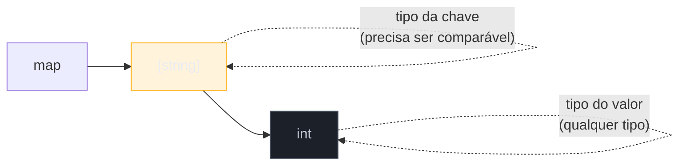
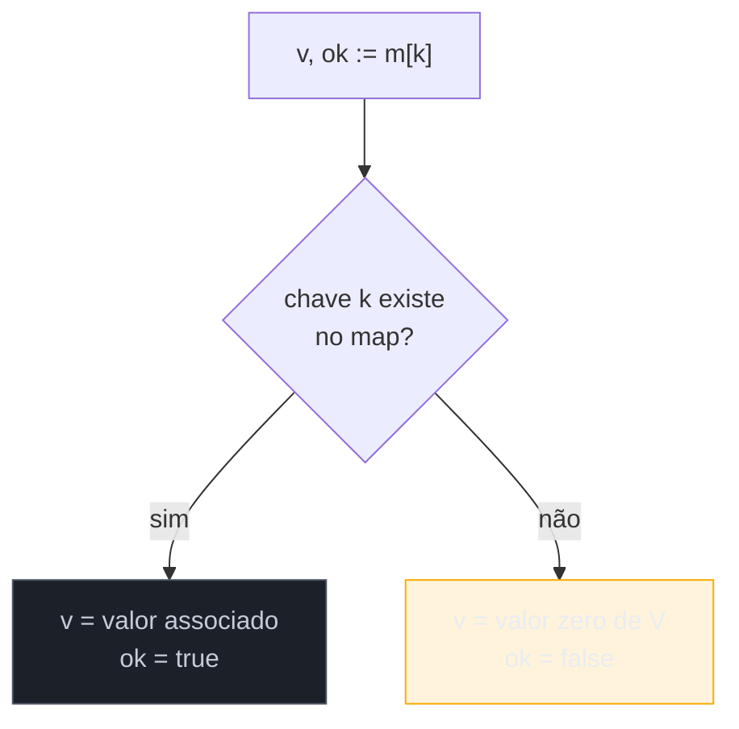
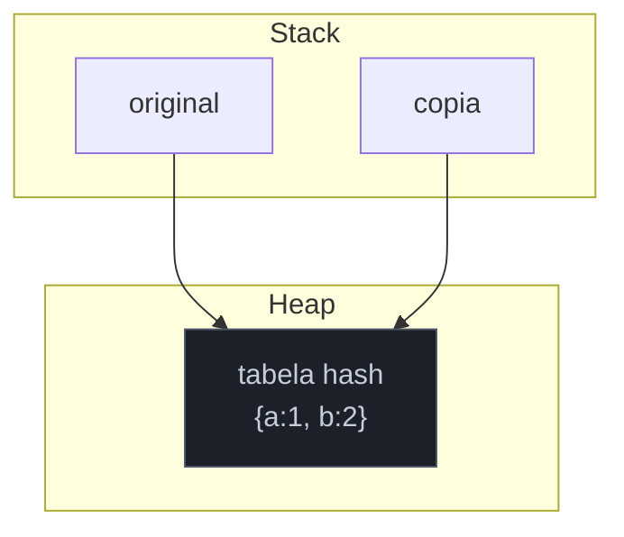

# Maps

> [!abstract] TL;DR
> Um **map** em Go é uma tabela hash embutida na linguagem: `map[K]V` associa chaves a valores, com criação via `make(map[K]V)` ou literal `map[K]V{...}`, leitura `v := m[k]`, leitura segura via **comma-ok** `v, ok := m[k]` (distingue "chave ausente" de "valor zero"), e remoção com `delete(m, k)`. A chave precisa ser **comparável** (`==`/`!=` funcionam nela) — `int`, `string`, structs de campos comparáveis servem; `slice`, `map` e `func` não servem. Iterar com `for k, v := range m` percorre em **ordem aleatória**, de propósito, a cada execução. E, como slices, um map é um valor de referência: passá-lo para uma função ou copiá-lo para outra variável não duplica a tabela — as duas variáveis apontam para a mesma estrutura interna.

## O problema que o map resolve

Imagine que você precisa contar quantas vezes cada palavra aparece num texto. Com o que o Galho anterior já deu — arrays e slices — você teria que indexar por posição numérica. Mas "quantas vezes a palavra `'gato'` aparece" não tem posição nenhuma: é uma pergunta sobre uma **chave** (a palavra), não sobre um índice sequencial.

Dá para simular isso com um slice de pares e busca linear:

```go
type Par struct {
    Palavra string
    Contagem int
}

pares := []Par{}
// para cada palavra nova, percorrer o slice inteiro procurando se já existe...
```

Funciona, mas cada busca é O(n) — para achar se `"gato"` já foi vista, você percorre o slice todo, palavra por palavra. Com um texto de 10 mil palavras distintas, isso vira lento rápido.

É exatamente o problema que uma tabela hash resolve: em vez de buscar linearmente, ela calcula um "endereço" a partir da chave (um hash) e vai direto ao balde certo — busca e escrita em tempo médio O(1), independente do tamanho da coleção. Go embute esse mecanismo na linguagem como tipo de primeira classe, sem precisar importar biblioteca nenhuma: o **map**.

```go
contagem := map[string]int{}
contagem["gato"]++
contagem["cachorro"]++
contagem["gato"]++

fmt.Println(contagem) // map[cachorro:1 gato:2]
```

`contagem["gato"]++` já resolve, numa linha, o que levaria um laço de busca inteiro na versão com slice.

## Anatomia do tipo map



`map[K]V` declara um tipo map: `K` é o tipo da chave, `V` é o tipo do valor. Ao contrário do array (`[N]T`, tamanho fixo no tipo) e do slice (`[]T`, tamanho variável mas indexado só por posição), o map não carrega tamanho no tipo — cresce e encolhe dinamicamente conforme chaves são inseridas e removidas, exatamente como um slice.

Duas formas de criar um map, com efeitos diferentes:

```go
var m1 map[string]int          // nil map — declarado, não inicializado
m2 := make(map[string]int)     // map vazio, pronto para uso
m3 := map[string]int{          // literal, com valores iniciais
    "um":  1,
    "dois": 2,
}
```

`var m1 map[string]int` produz um **nil map** — a variável existe, mas não aponta para nenhuma tabela hash alocada. Ler de um nil map é seguro (`m1["qualquer"]` retorna o valor zero de `int`, `0`, sem pânico); **escrever** num nil map causa pânico em tempo de execução: `panic: assignment to entry in nil map`. `make(map[string]int)` já entrega uma tabela alocada, pronta para leitura e escrita — é a forma padrão de começar um map vazio que você pretende popular.

> [!warning] `var m map[K]V` não é o mesmo que `m := make(map[K]V)`
> Essa é a armadilha mais comum de quem chega em Go vindo de linguagens onde declarar uma variável já entrega uma coleção vazia utilizável (Python `d = {}`, Java `new HashMap<>()`). Em Go, `var m map[string]int` declara um map **nil** — útil só para leitura ou para receber um map de outro lugar depois — mas qualquer escrita direta nele derruba o programa. Se a intenção é popular o map, use `make` ou um literal.

## Ler com comma-ok: distinguindo "zero" de "ausente"

Aqui mora a peculiaridade mais importante de maps em Go. Ler uma chave ausente **não** dá erro nem pânico — devolve o **valor zero** do tipo:

```go
contagem := map[string]int{"gato": 2}
fmt.Println(contagem["cachorro"]) // 0 — chave ausente, valor zero de int
```

O problema: se `0` for um valor legítimo que uma chave *presente* também poderia ter, essa leitura simples não distingue "a chave não existe" de "a chave existe e vale zero". A forma **comma-ok** resolve isso devolvendo um segundo valor booleano:

```go
v, ok := contagem["cachorro"]
fmt.Println(v, ok) // 0 false — chave realmente ausente

contagem["peixe"] = 0
v, ok = contagem["peixe"]
fmt.Println(v, ok) // 0 true — chave presente, valor zero legítimo
```

`ok` é `true` se a chave existe no map (independente do valor associado), `false` caso contrário. É o mesmo padrão sintático usado em type assertions (`v, ok := i.(T)`) e em leitura de canal (`v, ok := <-ch`) — Go reaproveita a forma "valor, booleano de sucesso" em vários lugares da linguagem para evitar exceções onde uma checagem simples resolve.



> [!warning] Esquecer o comma-ok quando zero é ambíguo
> `if contagem["cachorro"] == 0 { ... }` não diz "cachorro nunca apareceu" — diz "cachorro tem contagem zero **ou** nunca foi visto", porque as duas situações produzem o mesmo `0`. Sempre que o valor zero do tipo (`0`, `""`, `false`, `nil`) for um resultado válido e distinto de "chave ausente", use `v, ok := m[k]` e teste `ok`, não o valor.

## delete: removendo uma chave

`delete(m, k)` remove a chave `k` do map `m`, sem retorno e sem pânico mesmo se a chave não existir:

```go
contagem := map[string]int{"gato": 2, "cachorro": 1}
delete(contagem, "cachorro")
fmt.Println(contagem) // map[gato:2]

delete(contagem, "peixe") // chave inexistente — no-op, sem erro
```

`delete` é uma função embutida (*built-in*), como `make` e `len` — não um método do map. Isso segue o mesmo padrão de `len(slice)` visto na nota anterior: operações fundamentais sobre tipos de coleção em Go tendem a ser funções da linguagem, não métodos do tipo.

## Iteração: ordem aleatória de propósito

`for k, v := range m` percorre todas as chaves e valores de um map — mas, diferente de slice ou array, **a ordem não é garantida, e Go embaralha a ordem deliberadamente a cada execução**:

```go
m := map[string]int{"a": 1, "b": 2, "c": 3}
for k, v := range m {
    fmt.Println(k, v)
}
// ordem imprevisível — pode ser a,b,c numa execução e c,a,b na próxima
```

```go
for chave, valor := range m {
    fmt.Println(chave, valor)
}

for chave := range m { // só as chaves
    fmt.Println(chave)
}
```

> [!info] Randomização de iteração, especificação desde o início — não é bug
> A [especificação da linguagem](https://go.dev/ref/spec#For_statements) é explícita: "The iteration order over maps is not specified and is not guaranteed to be the same from one iteration to the next." O runtime do Go **randomiza ativamente** o ponto de partida da iteração a cada `range` — não é só "não garantido", é garantidamente instável. A decisão de design existe para impedir que código dependa acidentalmente de uma ordem que só era estável por implementação, e quebrasse ao trocar de versão do Go. Se a saída precisa de ordem determinística (para exibir ao usuário, gerar relatório reproduzível, ou comparar em teste), colete as chaves num slice e ordene explicitamente — é o assunto da [[07 - Ordenação e busca com slices e sort|nota 07]].

```go
chaves := make([]string, 0, len(contagem))
for k := range contagem {
    chaves = append(chaves, k)
}
sort.Strings(chaves) // ordem determinística, aplicada depois da coleta

for _, k := range chaves {
    fmt.Println(k, contagem[k])
}
```

## Chaves precisam ser comparáveis

O tipo `K` em `map[K]V` só pode ser um tipo **comparável** — um tipo para o qual `==` e `!=` são operações válidas. Segundo a [especificação](https://go.dev/ref/spec#Comparison_operators), isso inclui tipos booleanos, numéricos, string, ponteiro, canal, interface, e structs/arrays cujos campos/elementos sejam todos comparáveis. **Não** inclui slice, map e func — esses três tipos não são comparáveis entre si (só contra `nil`), e por isso não podem ser chave de map:

```go
// Não compila:
// m := map[[]int]string{} // invalid map key type []int

type Coordenada struct {
    X, Y int
}

m := map[Coordenada]string{
    {X: 0, Y: 0}: "origem",
    {X: 1, Y: 1}: "diagonal",
}
fmt.Println(m[Coordenada{X: 0, Y: 0}]) // origem
```

`Coordenada` é um struct de dois `int` — comparável, porque cada campo é comparável — então serve como chave sem problema. Isso é uma técnica idiomática comum: usar um struct pequeno como chave composta, em vez de concatenar campos numa string artificial (`fmt.Sprintf("%d,%d", x, y)`) só para ter algo "comparável".

> [!warning] `cannot use ... as map key` — a mensagem de erro típica
> Tentar `map[[]string]int{}` ou `map[map[string]int]bool{}` produz erro de compilação: `invalid map key type`. A causa raiz é sempre a mesma — o tipo escolhido não suporta `==`. A saída, quando a "chave natural" é um slice (por exemplo, uma lista de tags), costuma ser converter para algo comparável primeiro: uma string concatenada, ou um array de tamanho fixo (`[3]string`, que **é** comparável, diferente de `[]string`).

## Map é referência: cuidado ao passar e copiar

Assim como slices (nota 02 deste galho), um map é internamente um ponteiro para uma estrutura de dados no heap. Copiar a variável, ou passá-la para uma função, **não duplica a tabela** — as duas variáveis compartilham a mesma tabela hash por baixo:

```go
func adicionar(m map[string]int, chave string, valor int) {
    m[chave] = valor // muda a tabela compartilhada
}

func main() {
    original := map[string]int{"a": 1}
    copia := original // "copia" ainda aponta pra mesma tabela

    adicionar(original, "b", 2)

    fmt.Println(original) // map[a:1 b:2]
    fmt.Println(copia)    // map[a:1 b:2] — viu a mudança também!
}
```



Não existe `original :=` versus `original :=` — `original` e `copia` são duas variáveis distintas, mas ambas guardam o mesmo ponteiro interno para a mesma tabela. Mudar o conteúdo através de uma é visível através da outra. Isso é útil (evita cópia cara de tabelas grandes a cada chamada de função) mas surpreende quem espera semântica de valor — o mesmo alerta que já apareceu para slices, agora repetido para maps porque o mecanismo interno é análogo.

> [!warning] "Copiar" um map não isola as duas cópias
> Se a intenção é ter uma tabela independente — mudanças numa não afetam a outra — é preciso copiar chave por chave manualmente (um laço `for k, v := range original { copia[k] = v }`) ou, em Go 1.21+, usar `maps.Clone` do pacote `maps` da biblioteca padrão.

> [!info] Pacote `maps` da biblioteca padrão — Go 1.21+
> Desde a versão 1.21, a biblioteca padrão ganhou o pacote [`maps`](https://pkg.go.dev/maps), com funções utilitárias como `maps.Clone` (cópia rasa independente), `maps.Equal` (compara dois maps por conteúdo) e `maps.Keys`/`maps.Values` (iteradores sobre chaves/valores, integrados com `range` a partir do suporte a *range-over-func* também estabilizado na 1.23). Antes da 1.21, esses utilitários precisavam ser escritos à mão, laço por laço — o padrão `for k, v := range m { copia[k] = v }` continua funcionando em qualquer versão, `maps.Clone` só poupa a repetição.

## Casos práticos

**1. Contador de frequência**, o exemplo canônico de map:

```go
func contarPalavras(texto []string) map[string]int {
    contagem := make(map[string]int)
    for _, palavra := range texto {
        contagem[palavra]++
    }
    return contagem
}

func main() {
    texto := []string{"gato", "cachorro", "gato", "peixe", "gato"}
    fmt.Println(contarPalavras(texto)) // map[cachorro:1 gato:3 peixe:1]
}
```

`contagem[palavra]++` funciona mesmo na primeira ocorrência de cada palavra, porque ler uma chave ausente devolve `0` — `0++` vira `1`, sem precisar checar existência antes.

**2. Map como conjunto (set)**, usando `map[T]bool` ou `map[T]struct{}`:

```go
func temDuplicata(nums []int) bool {
    visto := make(map[int]bool)
    for _, n := range nums {
        if visto[n] {
            return true // já vimos esse número — comma simples basta aqui
        }
        visto[n] = true
    }
    return false
}

func main() {
    fmt.Println(temDuplicata([]int{1, 2, 3, 2}))    // true
    fmt.Println(temDuplicata([]int{1, 2, 3}))       // false
}
```

Go não tem um tipo `Set` embutido, como Python (`set()`) ou Java (`HashSet`). O idioma da comunidade é usar um map cujo valor não carrega informação real: `map[T]bool` (mais legível) ou `map[T]struct{}` (zero bytes por valor, mais eficiente em memória para conjuntos grandes, porque `struct{}` — o struct vazio — não ocupa espaço).

**3. comma-ok evitando ambiguidade de zero**, num cenário de cache:

```go
type Cache struct {
    dados map[string]int
}

func NovoCache() *Cache {
    return &Cache{dados: make(map[string]int)}
}

func (c *Cache) Buscar(chave string) (int, bool) {
    valor, ok := c.dados[chave]
    return valor, ok
}

func main() {
    c := NovoCache()
    c.dados["contador"] = 0 // valor legítimo zero

    v, ok := c.Buscar("contador")
    fmt.Println(v, ok) // 0 true — presente, vale zero

    v, ok = c.Buscar("ausente")
    fmt.Println(v, ok) // 0 false — nunca foi cacheado
}
```

Sem `ok`, o chamador de `Buscar` não teria como saber se `0` significa "valor cacheado é zero" ou "nunca foi cacheado" — exatamente o cenário em que comma-ok deixa de ser detalhe estilístico e vira necessidade.

**4. Iteração com ordem determinística**, coletando e ordenando as chaves antes de imprimir:

```go
import "sort"

func imprimirOrdenado(m map[string]int) {
    chaves := make([]string, 0, len(m))
    for k := range m {
        chaves = append(chaves, k)
    }
    sort.Strings(chaves)

    for _, k := range chaves {
        fmt.Printf("%s: %d\n", k, m[k])
    }
}

func main() {
    contagem := map[string]int{"gato": 3, "ave": 1, "cachorro": 2}
    imprimirOrdenado(contagem)
    // ave: 1
    // cachorro: 2
    // gato: 3
    // (sempre nessa ordem, apesar do map internamente não ter ordem)
}
```

## Vindo de Java, Python ou Node — o mesmo conceito, sintaxe e garantias diferentes

| | Java | Python | Node/JS | Go |
|---|---|---|---|---|
| Tipo | `HashMap<K,V>` | `dict` | `Object` / `Map` | `map[K]V` |
| Criar vazio | `new HashMap<>()` | `{}` | `{}` / `new Map()` | `make(map[K]V)` |
| Ler ausente | `null` (ou exceção com `Map.of`) | `KeyError` | `undefined` | valor zero, sem erro |
| Checar existência | `containsKey(k)` | `k in d` | `k in obj` / `.has(k)` | `v, ok := m[k]` |
| Ordem de iteração | insertion-order em `LinkedHashMap`; não garantida em `HashMap` | insertion-order (Python 3.7+) | insertion-order em `Map`; quase-insertion em objeto | **sempre aleatória** |
| Cópia por valor? | referência (é objeto) | referência | referência | referência (como slice) |

A diferença mais perigosa para quem migra de Python 3.7+ (onde `dict` preserva ordem de inserção por garantia da linguagem desde então) é a iteração: código Python que depende — mesmo sem perceber — de "a ordem em que inseri é a ordem que recebo de volta" simplesmente não tem equivalente direto em Go. É preciso ordenar explicitamente sempre que a ordem importar.

## Como explicar em inglês

> A Go **map** is the language's built-in hash table: `map[K]V` associates keys of type `K` with values of type `V`. You create one with `make(map[K]V)` or a literal `map[K]V{...}` — a zero-valued (`var m map[K]V`) map is `nil` and safe to read but panics on write. Reading a missing key never errors; it returns the value type's zero value, which is why the **comma-ok** idiom, `v, ok := m[k]`, exists — `ok` tells you whether the key was actually present, disambiguating "present with a zero value" from "absent." `delete(m, k)` removes a key, silently no-op'ing if it isn't there. The one guarantee Go deliberately withholds is iteration order: `for k, v := range m` visits entries in **randomized** order, by specification, to stop code from accidentally depending on an order that was never promised. Map keys must be comparable — booleans, numbers, strings, pointers, and structs of comparable fields qualify; slices, maps, and funcs don't. And like slices, a map value is a reference to an underlying hash table: copying the variable or passing it to a function shares the same table, so mutations through one are visible through the other.

| Termo PT | Termo EN |
|---|---|
| mapa | map |
| chave | key |
| valor | value |
| comma-ok | comma-ok (idiom) |
| valor zero | zero value |
| map nulo | nil map |
| comparável | comparable |
| tabela hash | hash table |
| ordem de iteração aleatória | randomized iteration order |
| conjunto (via map) | set |

## O que vem a seguir

Maps guardam valores associados a chaves — mas as próprias chaves e valores, no dia a dia de Go, quase sempre passam por texto: strings. E texto em Go tem uma armadilha de codificação que ainda não apareceu neste galho — a diferença entre **byte**, **rune** e **caractere visível**, essencial para não quebrar acentos e emojis ao indexar ou fatiar uma string. A [[04 - Strings, runes e bytes|nota 04]] entra nisso.

## Veja também

- [[01 - Arrays e o modelo de valor|01 — Arrays e o modelo de valor]] — ponto de partida do galho, tipo de tamanho fixo que o map não é
- [[02 - Slices — o cavalo de batalha|02 — Slices — o cavalo de batalha]] — outra coleção de referência; o alerta sobre cópia rasa aqui espelha o mesmo mecanismo
- [[04 - Strings, runes e bytes|04 — Strings, runes e bytes]] — próxima nota do galho
- [[07 - Ordenação e busca com slices e sort|07 — Ordenação e busca com slices e sort]] — como ordenar as chaves coletadas de um map
- [[03-Dominios/Tecnologia/Go/index|Trilha Go]]

## Fontes

- The Go Authors. *The Go Programming Language Specification — Map types*. go.dev. https://go.dev/ref/spec#Map_types (acessado em 2026-07-18)
- The Go Authors. *The Go Programming Language Specification — For statements*. go.dev. https://go.dev/ref/spec#For_statements (acessado em 2026-07-18)
- The Go Authors. *A Tour of Go — Maps*. go.dev. https://go.dev/tour/moretypes/19 (acessado em 2026-07-18)
- The Go Authors. *Effective Go — Maps*. go.dev. https://go.dev/doc/effective_go#maps (acessado em 2026-07-18)
- The Go Authors. *maps package documentation*. pkg.go.dev. https://pkg.go.dev/maps (acessado em 2026-07-18)
- Go by Example. *Maps*. gobyexample.com. https://gobyexample.com/maps (acessado em 2026-07-18)
