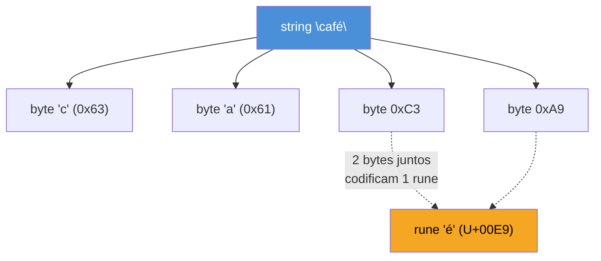
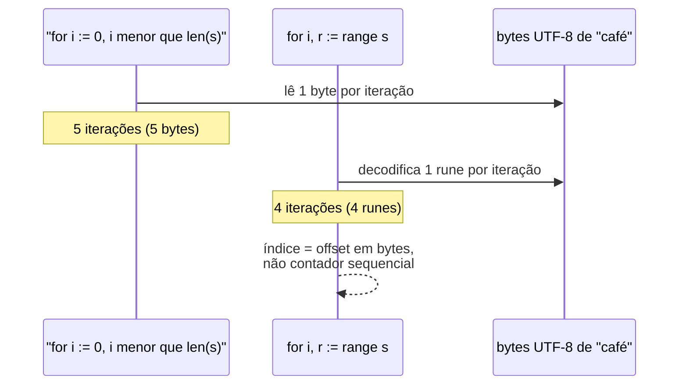
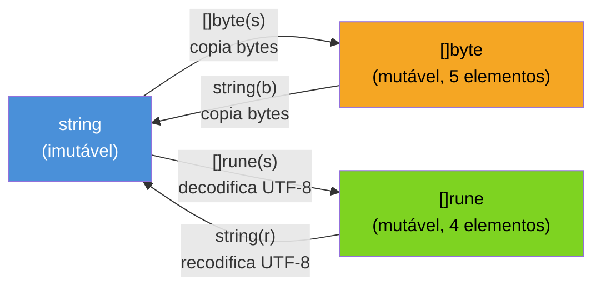

# Strings, runes e bytes

> [!abstract] TL;DR
> Uma `string` em Go é uma sequência **imutável** de **bytes** — não de caracteres. Por convenção (não obrigação do compilador), esses bytes codificam texto em **UTF-8**. Indexar uma string com `s[i]` devolve um `byte` (um pedaço de um caractere multi-byte, se o caractere não for ASCII); percorrer com `for range s` devolve **runes** (`int32`, um code point Unicode completo por iteração) já decodificados. `len(s)` conta bytes, não caracteres visíveis — para contar runes, use `utf8.RuneCountInString`. Converter `string ↔ []byte` copia o buffer; converter `string ↔ []rune` decodifica/recodifica UTF-8 inteiro. Confundir byte com caractere é a fonte nº 1 de bugs de string em Go para quem vem de linguagens com string indexável por caractere.

## O bug que aparece na primeira string com acento

Todo mundo que aprende Go escreve, cedo ou tarde, uma versão disto:

```go
s := "Olá, café!"
primeiro := s[0]
fmt.Println(primeiro) // 79 — não é 'O', é o número 79
```

Tudo bem até aqui — `79` é o código ASCII de `'O'`, então `s[0]` "funciona". O problema aparece quando alguém pede o comprimento da string para, digamos, alocar um buffer de exibição:

```go
fmt.Println(len(s)) // 11 — mas "Olá, café!" tem 10 caracteres visíveis
```

Onze, não dez. Dois caracteres da string — `á` e `é` — cada um ocupa **dois bytes** em UTF-8, não um. `len(s)` não mentiu: ele conta bytes, com honestidade total. O erro está na expectativa de quem vem de Python (`len("café")` dá 4, porque Python 3 indexa por code point) ou de Java (`"café".length()` dá 4, porque Java usa UTF-16 e esses caracteres cabem numa `char`). Go não esconde a codificação por trás de uma ilusão de "caractere" — expõe o byte cru, e cabe a você escolher quando quer o code point de verdade.

Essa é a pergunta que este capítulo resolve: o que exatamente é uma string em Go, o que `s[i]` devolve de fato, e como pedir "me dê os caracteres" quando é isso que você realmente quer.

## String é bytes: a definição literal

A [especificação da linguagem](https://go.dev/ref/spec#String_types) é direta: "A string type represents the set of string values. A string value is a (possibly empty) sequence of bytes." Nada sobre caracteres, nada sobre codificação — uma `string` é, na sua essência, um `[]byte` imutável com um método de indexação que devolve `byte`.



`c` e `a` são ASCII — cabem num byte cada. `é` não é ASCII: em UTF-8, code points acima de `U+007F` são codificados em 2, 3 ou 4 bytes. `s[2]` e `s[3]` não são "meio caractere" corrompido — são exatamente os dois bytes que, juntos, formam o code point `é` (`U+00E9`). Isolado, `s[2]` (`0xC3`) não é um caractere válido nenhum — é só o primeiro byte de uma sequência UTF-8 multi-byte.

Go escolheu UTF-8 como a codificação-padrão do ecossistema (código-fonte `.go`, literais de string, a biblioteca padrão inteira) porque UTF-8 tem uma propriedade rara: é **compatível com ASCII byte a byte** e **auto-sincronizável** — dado um byte qualquer no meio de uma sequência UTF-8, dá para saber se ele é o início de um code point, uma continuação, ou um caractere ASCII solto, só olhando os bits mais altos. Isso é o que torna possível `strings.Contains`, `strings.Index` e até busca ingênua de substring funcionarem corretamente sobre bytes crus, sem decodificar nada — desde que a busca em si não corte um code point ao meio.

> [!info] Go 1.21+: pacote `unicode/utf8` é estável há anos, mas vale mencionar `strings.Builder` e o pacote `slices` (1.21) como companheiros modernos ao trabalhar com texto — retomados adiante.

## Rune: o nome Go para "code point Unicode"

Se `byte` é a unidade crua da string, **rune** é a unidade de significado. `rune` é um alias de tipo para `int32` — grande o bastante para representar qualquer code point Unicode válido (o intervalo vai até `U+10FFFF`, e `int32` cobre isso com folga).

```go
var r rune = 'é'
fmt.Println(r)          // 233 — o code point, como número
fmt.Printf("%c\n", r)   // é — formatado como caractere
fmt.Printf("%U\n", r)   // U+00E9 — notação Unicode padrão
```

Um literal entre aspas simples, como `'é'` ou `'A'`, é sempre uma **constante rune** em Go — nunca um `char` de um byte só, diferente de C ou Java. Isso já é uma pista de que Go trata "caractere" como conceito Unicode desde o design da linguagem, não como acréscimo tardio.

## Indexação dá byte, `range` dá rune

Aqui está o mecanismo central deste capítulo, e a fonte do bug de abertura:

```go
s := "café"

// Indexação: byte a byte, posição = offset em bytes
for i := 0; i < len(s); i++ {
    fmt.Printf("s[%d] = %v\n", i, s[i])
}
// s[0] = 99  ('c')
// s[1] = 97  ('a')
// s[2] = 102 ('f')
// s[3] = 195 (primeiro byte de 'é')
// s[4] = 169 (segundo byte de 'é')

// range: rune a rune, decodificando UTF-8 automaticamente
for i, r := range s {
    fmt.Printf("posição %d: rune %c (%U)\n", i, r, r)
}
// posição 0: rune c (U+0063)
// posição 1: rune a (U+0061)
// posição 2: rune f (U+0066)
// posição 3: rune é (U+00E9)   <- pula direto para 5 na próxima iteração
```

Repare no índice: `range` sobre uma string devolve o **offset em bytes** de onde cada rune começa — não um contador sequencial de 0, 1, 2, 3. Depois da rune `é` (que ocupa os bytes 3 e 4), a próxima iteração pularia para o índice 5, porque é ali que o próximo caractere realmente começa no buffer de bytes. Essa é a diferença de fundo entre os dois laços:



`for range` chama, por baixo, a mesma lógica de decodificação que `utf8.DecodeRuneInString` expõe explicitamente — ele lê os bytes, reconhece quantos formam o próximo code point, decodifica, e avança o índice pelo tamanho real em bytes daquele code point (1 a 4). Indexação com `s[i]`, ao contrário, nunca decodifica nada — é acesso bruto de byte, tão barato quanto indexar um `[]byte`, e é exatamente isso que ela é por baixo.

> [!warning] `s[i]` nunca decodifica UTF-8 — e pode devolver um byte "no meio" de um caractere
> Se você usa `s[i]` com um `i` que cai no meio de um code point multi-byte (como `s[3]` na string `"café"`, que devolve só a metade de `é`), o resultado é um `byte` isolado sem significado próprio como caractere — não é erro de runtime, o valor só está "quebrado" semanticamente. `s[i]` é seguro e correto para strings 100% ASCII; para texto com acentos, emoji ou qualquer caractere fora do intervalo ASCII, é quase sempre o operador errado.

## `len()`: bytes, não caracteres visíveis

```go
s := "café"
fmt.Println(len(s))                       // 5 — bytes
fmt.Println(utf8.RuneCountInString(s))    // 4 — runes (caracteres Unicode)
```

`len()` sobre uma string é **O(1)** — o comprimento em bytes já está armazenado no header interno da string (junto com o ponteiro para o buffer), não precisa varrer nada. `utf8.RuneCountInString`, em contraste, é **O(n)**: precisa decodificar a string inteira, byte a byte, para contar quantos code points ela contém, porque não existe atalho — cada rune pode ocupar de 1 a 4 bytes, e só decodificando dá para saber onde uma termina e a próxima começa.

> [!warning] Emoji e outros caracteres "grandes" complicam ainda mais o que conta como 1 caractere
> `len("👍")` dá `4` (o polegar-para-cima ocupa 4 bytes em UTF-8), e `utf8.RuneCountInString("👍")` dá `1` (é um code point só). Mas alguns emojis compostos — como uma família 👨‍👩‍👧‍👦 — são **múltiplas runes** unidas por caracteres de junção invisíveis (*zero-width joiner*), então nem `RuneCountInString` corresponde ao que um humano chamaria de "1 caractere visível" nesses casos. Isso já não é mais assunto de byte vs. rune — é o conceito de *grapheme cluster*, fora do escopo deste capítulo e da biblioteca padrão (exige um pacote como `golang.org/x/text/unicode/norm` para tratar direito).

## Conversões: `string`, `[]byte` e `[]rune`

Três formas de olhar para o mesmo texto, cada uma com um custo diferente:

```go
s := "café"

b := []byte(s)   // copia os bytes crus: len(b) == 5
r := []rune(s)   // decodifica UTF-8 inteiro: len(r) == 4

s2 := string(b)  // copia de volta: bytes -> string
s3 := string(r)  // recodifica UTF-8: runes -> string
```



Toda conversão nessa figura **copia** — não existe conversão "de graça" entre esses três tipos, porque `string` é imutável e `[]byte`/`[]rune` não são: se a conversão reaproveitasse o buffer, mutar o slice resultante corromperia a string original, quebrando a garantia de imutabilidade que todo código Go assume ao passar strings por valor sem medo. `string(b)` e `[]byte(s)` são as conversões mais baratas (cópia byte a byte, sem decodificação); `[]rune(s)` e `string(r)` são mais caras, porque envolvem decodificar ou recodificar UTF-8 inteiro.

Quando usar cada forma:

- **`[]byte`** — quando você vai manipular o texto como dados binários crus (E/S, hashing, protocolos), ou quando uma API pede `[]byte` (como `io.Writer`).
- **`[]rune`** — quando você precisa indexar ou fatiar por **caractere**, não por byte. É a forma correta de pegar "os 3 primeiros caracteres" de uma string com acentos: `string([]rune(s)[:3])`.
- **`string`** — para passar texto entre funções, comparar, ou qualquer uso que não exige mutação.

> [!info] `strings.Builder` (estável desde Go 1.10, mas vale o lembrete): concatenar strings em laço com `+=` recria um buffer novo a cada iteração. Para montar texto incrementalmente, `strings.Builder` acumula num buffer mutável e só materializa a `string` final uma vez, evitando cópias repetidas.

## O pacote `unicode/utf8`: as ferramentas certas para o trabalho certo

Toda a mecânica de UTF-8 que `range` executa por baixo dos panos está exposta, publicamente, no pacote [`unicode/utf8`](https://pkg.go.dev/unicode/utf8) — para os casos em que você precisa de mais controle do que um `for range` simples oferece:

```go
package main

import (
    "fmt"
    "unicode/utf8"
)

func main() {
    s := "café"

    fmt.Println(utf8.RuneCountInString(s)) // 4
    fmt.Println(utf8.ValidString(s))        // true — bytes formam UTF-8 válido

    r, tamanho := utf8.DecodeRuneInString(s[3:])
    fmt.Printf("rune: %c, ocupou %d bytes\n", r, tamanho) // é, 2

    fmt.Println(utf8.RuneLen('é')) // 2 — quantos bytes 'é' ocupa em UTF-8
    fmt.Println(utf8.RuneLen('A')) // 1
    fmt.Println(utf8.RuneLen('👍')) // 4
}
```

- `utf8.RuneCountInString(s)` — conta runes, o(n), já visto acima.
- `utf8.ValidString(s)` — verifica se a sequência de bytes é UTF-8 válida (útil ao receber texto de fontes não confiáveis — rede, arquivo, entrada de usuário — onde bytes arbitrários podem não formar UTF-8 correto).
- `utf8.DecodeRuneInString(s)` — decodifica a primeira rune de uma string, devolvendo a rune e quantos bytes ela ocupou. É exatamente o primitivo que `for range` chama internamente a cada iteração.
- `utf8.RuneLen(r)` — dado um code point, devolve quantos bytes ele ocupa quando codificado em UTF-8 (1 a 4).

> [!question]- Por que `string` em Go não garante UTF-8 válido, se a linguagem "usa" UTF-8?
> Porque a garantia é de **convenção**, não de **tipo**. `string` é definida como "sequência de bytes" — ponto. Nada no compilador impede `string([]byte{0xFF, 0xFE})`, uma sequência que não corresponde a UTF-8 válido nenhum. Literais de string no código-fonte `.go` são sempre UTF-8 válido (o compilador garante isso na hora de compilar), e a biblioteca padrão trata bytes inválidos de forma previsível — `range` sobre bytes inválidos produz a rune especial `utf8.RuneError` (`U+FFFD`, o "losango com interrogação") para cada byte problemático. Mas nada impede que uma `string` construída em runtime, a partir de rede ou arquivo, carregue lixo binário. `utf8.ValidString` existe exatamente para checar essa garantia quando ela importa.

## Casos práticos

**1. Contar caracteres corretamente** (não bytes):

```go
package main

import (
    "fmt"
    "unicode/utf8"
)

func main() {
    frases := []string{"olá mundo", "café com açúcar", "hello world"}

    for _, f := range frases {
        fmt.Printf("%-20q bytes=%d runes=%d\n", f, len(f), utf8.RuneCountInString(f))
    }
}
// "olá mundo"          bytes=10 runes=9
// "café com açúcar"    bytes=17 runes=15
// "hello world"        bytes=11 runes=11
```

Só a frase 100% ASCII (`"hello world"`) tem `len` e contagem de runes iguais — sinal claro de que `len()` sozinho nunca é confiável para "quantos caracteres" fora de contextos garantidamente ASCII.

**2. Truncar texto por caractere, não por byte**, um erro clássico ao gerar previews/resumos:

```go
package main

import "fmt"

func truncar(s string, maxRunes int) string {
    r := []rune(s)
    if len(r) <= maxRunes {
        return s
    }
    return string(r[:maxRunes]) + "..."
}

func main() {
    fmt.Println(truncar("café com açúcar", 4)) // café...
    // truncar("café com açúcar", 4) usando s[:4] direto quebraria 'é' ao meio:
    // s[:4] = "caf" + metade de um byte de 'é' -> string corrompida
}
```

Fatiar `[]rune(s)[:4]` garante corte em fronteira de caractere. Fatiar `s[:4]` direto na string cortaria no meio dos bytes de `é`, produzindo uma sequência UTF-8 inválida no meio do resultado.

**3. Verificar se uma string é válida antes de processá-la**, útil ao receber dados externos:

```go
package main

import (
    "fmt"
    "unicode/utf8"
)

func processarEntrada(dados []byte) error {
    if !utf8.Valid(dados) {
        return fmt.Errorf("entrada não é UTF-8 válido")
    }
    s := string(dados)
    fmt.Println("processando:", s)
    return nil
}

func main() {
    _ = processarEntrada([]byte("café")) // ok
    err := processarEntrada([]byte{0xFF, 0xFE, 0x00})
    fmt.Println(err) // entrada não é UTF-8 válido
}
```

**4. Decodificar rune a rune manualmente**, quando o overhead do `range` (que sempre percorre a string inteira) não serve — por exemplo, para parar de decodificar assim que uma condição é satisfeita, sem alocar um `[]rune` inteiro:

```go
package main

import (
    "fmt"
    "unicode/utf8"
)

func primeiraRuneNaoAscii(s string) (rune, bool) {
    for i := 0; i < len(s); {
        r, tamanho := utf8.DecodeRuneInString(s[i:])
        if r > 127 {
            return r, true
        }
        i += tamanho
    }
    return 0, false
}

func main() {
    r, achou := primeiraRuneNaoAscii("hello café")
    fmt.Printf("%c %v\n", r, achou) // é true
}
```

## Armadilhas comuns

> [!warning] `len(s)` não é "número de caracteres" — é bytes
> A armadilha de abertura deste capítulo. Sempre que o resultado de `len()` alimenta uma decisão sobre "quantos caracteres cabem na tela" ou "posição do N-ésimo caractere", a pergunta certa é se a string pode conter algo fora de ASCII. Se puder, `len()` é a ferramenta errada — use `utf8.RuneCountInString` ou `[]rune`.

> [!warning] Fatiar string por índice de byte pode cortar um caractere ao meio
> `s[:n]` corta exatamente no byte `n`, sem checar se isso cai no meio de uma sequência UTF-8 multi-byte. O resultado compila e roda sem panic — mas produz uma string com bytes UTF-8 inválidos na borda, que vai imprimir como `�` (o `RuneError`) ou corromper silenciosamente qualquer processamento posterior. Prefira fatiar sobre `[]rune(s)` quando a posição de corte vem de contagem de caracteres, não de um índice de byte já conhecido como seguro (como o resultado de `strings.Index`, que sempre devolve fronteiras de rune válidas).

> [!warning] Comparar `string` com `==` compara bytes, não "aparência" visual
> Unicode permite representar o mesmo caractere visual de mais de uma forma — `é` pode ser um único code point (`U+00E9`, forma NFC) ou `e` + acento combinante separado (`U+0065 U+0301`, forma NFD). As duas sequências de bytes são diferentes, então `"é" == "é"` pode dar `false` se uma veio de um sistema que normaliza diferente do outro (é comum em texto vindo do macOS, que tende a NFD). Resolver isso exige normalização Unicode explícita via `golang.org/x/text/unicode/norm`, fora do escopo deste capítulo — mas vale saber que `==` nunca normaliza por conta própria.

## Vindo de outras linguagens

| Vindo de... | Expectativa | Realidade em Go |
|---|---|---|
| Python 3 | `len(s)` conta code points; `s[i]` devolve 1 caractere | `len(s)` conta bytes; `s[i]` devolve 1 byte — use `[]rune(s)` ou `range` para code points |
| Java / JS | strings são UTF-16; `.length()`/`.length` conta unidades UTF-16 (quase sempre = caracteres do BMP) | Go usa UTF-8; não existe unidade "de 2 bytes fixos" — cada rune ocupa de 1 a 4 bytes |
| C | strings são `char*` terminado em `\0`, sem noção de codificação embutida | Go guarda o comprimento no header da string (sem terminador), e trata bytes como UTF-8 por convenção da toolchain, não por imposição do runtime |

A lição comum: linguagens que escondem a codificação (Python, Java) fazem você pagar esse custo de decodificação em toda operação de indexação, mesmo quando não precisa dela. Go faz a escolha oposta — expõe bytes por padrão, porque é o caminho mais barato e mais comum (comparação, busca de substring, E/S) — e só paga o custo de decodificar UTF-8 quando você pede explicitamente, via `range` ou `[]rune`.

## Como explicar em inglês

> A Go `string` is an immutable sequence of **bytes**, not characters — by convention, those bytes encode text as UTF-8, but the compiler enforces nothing about the encoding itself. Indexing with `s[i]` returns a raw `byte`, which for non-ASCII text is only a fragment of a multi-byte code point; iterating with `for range s` decodes UTF-8 automatically and yields **runes** (Go's name for Unicode code points, aliased to `int32`), with the loop index landing on each rune's byte offset rather than a sequential counter. `len(s)` is O(1) and counts bytes; counting characters requires `utf8.RuneCountInString`, which is O(n) because it has to decode the whole string. Converting between `string`, `[]byte`, and `[]rune` always copies — there's no free lunch, because strings are immutable and the other two aren't. The practical rule: use `[]byte` for binary I/O, `[]rune` whenever you need to index or slice by character, and reach for the `unicode/utf8` package (`DecodeRuneInString`, `ValidString`, `RuneLen`) when you need finer control than a plain `range` loop offers.

| Termo PT | Termo EN |
|---|---|
| rune | rune |
| byte | byte |
| code point | code point |
| caractere visível | grapheme / visible character |
| codificação | encoding |
| decodificar | decode |
| recodificar | re-encode |
| fronteira de caractere | character boundary / rune boundary |
| sequência de bytes | byte sequence |
| imutável | immutable |

## O que vem a seguir

Este capítulo tratou strings como um caso especial de sequência de bytes imutável — mas o modelo de memória por trás de `[]byte` e `[]rune` é o mesmo que rege **qualquer** slice em Go, com as mesmas regras de `len`, `cap` e aliasing que a nota anterior só tocou de leve. A [[05 - O modelo de memória de slices — len, cap e aliasing|próxima nota]] mergulha nesse modelo — por que dois slices podem compartilhar o mesmo array subjacente, o que isso significa para mutação silenciosa, e como `cap` explica comportamentos de `append` que parecem mágicos até você ver o array por baixo.

## Veja também

- [[02 - Slices — o cavalo de batalha|02 — Slices — o cavalo de batalha]] — `[]byte` e `[]rune` são slices comuns; as regras de slice se aplicam a eles também
- [[05 - O modelo de memória de slices — len, cap e aliasing|05 — O modelo de memória de slices — len, cap e aliasing]] — próxima nota, aprofunda o modelo de memória que sustenta `[]byte`/`[]rune`
- [[03-Dominios/Tecnologia/Go/index|Trilha Go]]

## Fontes

- The Go Authors. *The Go Programming Language Specification — String types*. go.dev. https://go.dev/ref/spec#String_types (acessado em 2026-07-18)
- The Go Authors. *Package unicode/utf8*. pkg.go.dev. https://pkg.go.dev/unicode/utf8 (acessado em 2026-07-18)
- The Go Authors. *Package strings*. pkg.go.dev. https://pkg.go.dev/strings (acessado em 2026-07-18)
- Rob Pike. *Strings, bytes, runes and characters in Go*. The Go Blog. https://go.dev/blog/strings (acessado em 2026-07-18)
- The Go Authors. *A Tour of Go — Strings and runes*. go.dev. https://go.dev/tour/strings/1 (acessado em 2026-07-18)
- Go by Example. *Strings and Runes*. gobyexample.com. https://gobyexample.com/strings-and-runes (acessado em 2026-07-18)
