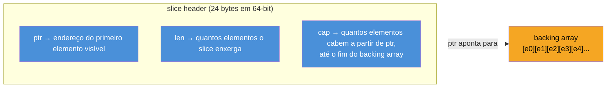
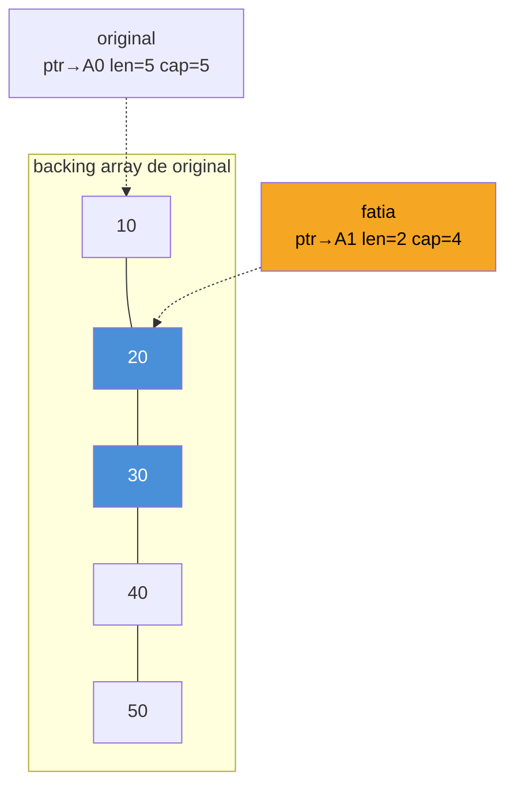
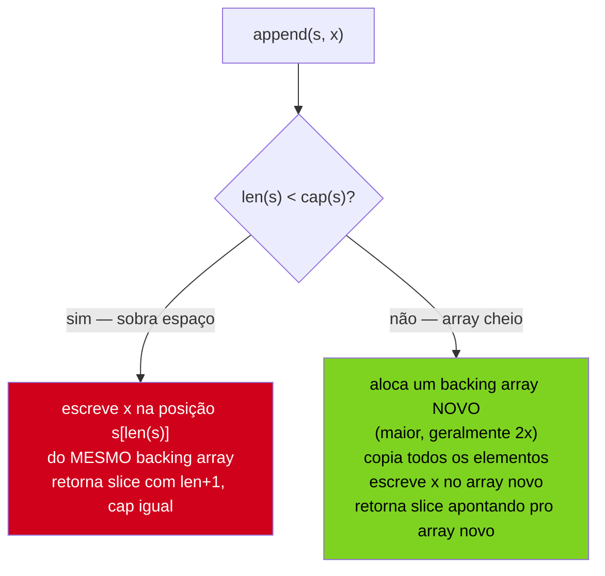
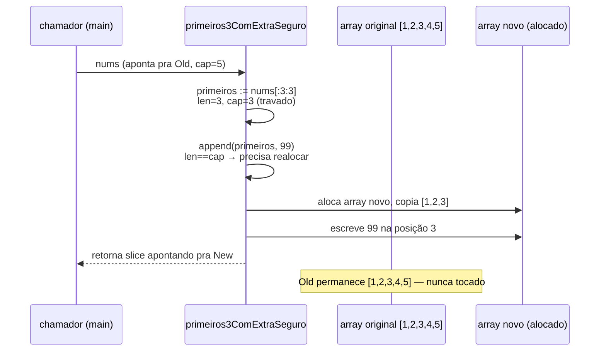

# O modelo de memória de slices — len, cap e aliasing

> [!abstract] TL;DR
> Um slice em Go não é a coleção — é um **header** de três palavras (`ptr`, `len`, `cap`) que aponta para um **backing array** em outro lugar da memória. Fatiar (`s[1:3]`) não copia dados: cria um segundo header apontando para o *mesmo* array. Isso significa que dois slices podem ser **aliases** — mudar um elemento por um deles muda o que o outro enxerga. O gotcha mais traiçoeiro do dia a dia: `append` a um slice que ainda tem `cap` sobrando **escreve por cima** do array compartilhado, sem alocar nada novo — e sem avisar. `copy` faz cópia real, elemento a elemento. A *full slice expression* `s[a:b:c]` trava a capacidade emprestada, forçando `append` a alocar em vez de vazar para o vizinho.

## O bug que não devia existir

Imagine esta função, escrita por alguém que jurava conhecer slices:

```go
func primeiros3ComExtra(nums []int, extra int) []int {
    primeiros := nums[:3]
    primeiros = append(primeiros, extra)
    return primeiros
}

func main() {
    original := []int{1, 2, 3, 4, 5}
    resultado := primeiros3ComExtra(original, 99)

    fmt.Println(resultado) // [1 2 3 99]
    fmt.Println(original)  // [1 2 3 99 5] — !!!
}
```

`original` não devia ter mudado. Ninguém escreveu `original[3] = 99`. E ainda assim, o quarto elemento virou `99`. Não é bug de compilador, não é ponteiro solto — é o comportamento **documentado** e **esperado** de slices, uma vez que se entende o que um slice realmente é por baixo. A nota anterior já apresentou slices como "o cavalo de batalha" de Go; esta nota abre o capô e mostra a peça que explica o gotcha acima: o slice não é os dados, é uma *janela* sobre dados que moram em outro lugar.

## O slice header: três palavras, nenhum dado

Um slice em Go é uma struct pequena e fixa — a especificação e o runtime chamam isso de *slice header*. Três campos:



- **`ptr`** — o endereço do primeiro elemento que o slice enxerga. Não precisa ser o início do array de verdade — pode ser o meio.
- **`len`** — quantos elementos, a partir de `ptr`, o slice reporta como "seus". É o que `len(s)` devolve, e o que limita `for range s`, `s[i]` para `i < len(s)`, etc.
- **`cap`** — quantos elementos cabem, a partir de `ptr`, **até o fim do backing array** — não até o fim do que o slice "vê" hoje, mas até o fim físico do array subjacente. `cap(s) >= len(s)` sempre.

O ponto crítico: **o slice header não contém os elementos**. Ele é leve — três palavras de máquina, ~24 bytes em 64-bit (um `int` de tamanho de palavra para cada campo, [conforme documenta o pacote `unsafe`/`reflect.SliceHeader`](https://pkg.go.dev/reflect#SliceHeader)). Os dados de verdade vivem num **array**, alocado à parte, para o qual o `ptr` aponta. Passar um slice por valor para uma função — o que Go faz sempre, já que não existe passagem por referência explícita — copia o header (três palavras), não o array inteiro. É rápido mesmo para slices com milhões de elementos. Mas tem uma consequência: a cópia do header ainda aponta para o **mesmo** array.

> [!info] `reflect.SliceHeader` está deprecated desde Go 1.20
> A struct `reflect.SliceHeader` era usada como referência didática (e às vezes até em código real, via `unsafe.Pointer`) para visualizar os três campos. Desde o Go 1.20, o pacote `reflect` recomenda usar `unsafe.Slice` e `unsafe.SliceData` em vez de manipular o header diretamente — a struct continua existindo, mas seu uso direto é desencorajado. Para os fins desta nota, o modelo mental de "três campos" continua válido; é assim que o compilador e o runtime pensam sobre slices por dentro.

## Fatiar não copia — reaponta

Quando você escreve `s2 := s1[1:3]`, o runtime não aloca um array novo nem copia elemento nenhum. Ele calcula um novo header:

- `ptr` de `s2` = `ptr` de `s1` deslocado em 1 elemento
- `len` de `s2` = `3 - 1 = 2`
- `cap` de `s2` = `cap` de `s1` menos o deslocamento — ou seja, tudo que sobra do array original a partir da nova posição

```go
original := []int{10, 20, 30, 40, 50}
fatia := original[1:3]

fmt.Println(fatia)           // [20 30]
fmt.Println(len(fatia))      // 2
fmt.Println(cap(fatia))      // 4 — sobrou espaço até o fim do array (índices 1..4)
```



`cap(fatia)` é `4`, não `2` — porque a capacidade conta até o **fim do array**, não até onde o `len` do próprio slice para de enxergar. Essa diferença entre `len` (o que o slice mostra) e `cap` (o que ainda está disponível, escondido, à direita) é exatamente o espaço onde `append` pode escrever sem pedir mais memória ao sistema operacional — e é exatamente o espaço onde o aliasing se torna perigoso.

## Aliasing: dois slices, um array

Como `fatia` e `original` compartilham o mesmo backing array, escrever em um se reflete no outro — desde que os índices se sobreponham:

```go
original := []int{10, 20, 30, 40, 50}
fatia := original[1:3] // [20 30]

fatia[0] = 999

fmt.Println(fatia)    // [999 30]
fmt.Println(original) // [10 999 30 40 50] — mudou!
```

Isso não é um bug — é a definição do que um slice *é*. `fatia[0]` e `original[1]` são, literalmente, o mesmo endereço de memória. Dois slices que compartilham (parte de) um backing array são chamados de **aliases** um do outro. É um comportamento poderoso — permite passar "janelas" sobre dados grandes sem copiar nada — e é também a fonte da maioria dos bugs sutis envolvendo slices em Go.

## O gotcha do `append`: quando cap sobra, o vizinho apanha

Aqui mora a armadilha que abriu esta nota. `append(s, x)` tem dois comportamentos completamente diferentes, dependendo de uma única condição:



- **Se `cap(s) > len(s)`** — ainda há espaço reservado no backing array — `append` escreve o novo elemento *na mesma memória*, sem alocar nada. Qualquer outro slice que compartilhe esse array e "enxergue" aquela posição vê o valor mudar.
- **Se `cap(s) == len(s)`** — não há mais espaço — `append` aloca um array **novo**, maior, copia tudo, e devolve um slice apontando para esse array novo. A partir daí, o slice resultante **não compartilha mais** o array com o original.

É exatamente isso que quebrou `primeiros3ComExtra`: `nums[:3]` tinha `len == 3` mas `cap == 5` (o array original tinha 5 elementos). `append(primeiros, extra)` encontrou espaço sobrando (`cap > len`) e escreveu `99` direto na posição 3 do array — que é a mesma posição que `original[3]` enxerga. Nenhuma alocação nova aconteceu; o "vizinho" apanhou.

> [!warning] `append` pode ou não realocar — e você não sabe qual, olhando só o código
> A mesma linha `s = append(s, x)` realoca hoje e não realoca amanhã, dependendo só do estado de `cap` no momento da chamada — algo que muda conforme o histórico de operações anteriores sobre aquele slice. Por isso a regra de ouro é: **sempre reatribua o retorno de `append`** (`s = append(s, x)`, nunca `append(s, x)` solto ignorando o retorno) — porque só o slice retornado tem o `len`/`cap`/`ptr` corretos pós-operação, e o slice antigo pode ter ficado obsoleto (apontando pro array velho) se houve realocação.

> [!warning] `append` em sub-slices de uma função compartilhada é a receita clássica do bug
> Sempre que uma função recebe um slice e faz `append` nele sem controlar `cap` explicitamente (via full slice expression, próxima seção), ela corre o risco de escrever silenciosamente na memória do chamador. Isso é particularmente perigoso em código que faz *sharding* de um slice grande em pedaços (`chunks := data[i:j]`) para processamento paralelo — se cada goroutine faz `append` no seu chunk, e os chunks compartilham `cap` sobrando do array original, uma goroutine pode sobrescrever dados que outra goroutine ainda está lendo. É condição de corrida por cima de aliasing — dois problemas empilhados.

## `copy`: fazer uma cópia de verdade

Quando o objetivo é desacoplar dois slices — garantir que mexer num não afeta o outro — a ferramenta é `copy`, não fatiar:

```go
func copy(dst, src []T) int
```

`copy` copia `min(len(dst), len(src))` elementos de `src` para `dst`, elemento a elemento, e devolve quantos elementos foram efetivamente copiados. Ao contrário de `append`, `copy` **nunca aloca** — ela só escreve na memória que `dst` já possui. Isso significa que `dst` precisa já ter tamanho suficiente antes da chamada:

```go
original := []int{10, 20, 30, 40, 50}

// clonar de verdade — sem aliasing:
clone := make([]int, len(original))
n := copy(clone, original)

fmt.Println(n)       // 5
clone[0] = 999
fmt.Println(clone)    // [999 20 30 40 50]
fmt.Println(original) // [10 20 30 40 50] — intocado
```

Esse é o idioma canônico para clonar um slice em Go — não existe `.clone()` embutido; `make` + `copy` é a forma explícita e a mais comum antes do Go 1.21. A partir do Go 1.21, o pacote `slices` oferece `slices.Clone`, que faz exatamente esse `make`+`copy` por baixo, com uma linha:

```go
import "slices"

clone := slices.Clone(original) // Go 1.21+
```

> [!info] `slices.Clone` e o pacote `slices` — Go 1.21
> O pacote genérico `slices` da biblioteca padrão (`slices.Clone`, `slices.Contains`, `slices.Sort`, etc.) chegou no Go 1.21, junto com o pacote `maps` equivalente para mapas. A nota 07 deste galho volta a esse pacote em profundidade, para ordenação e busca. Aqui, o que importa é: `slices.Clone(s)` devolve um slice novo, com backing array próprio — zero aliasing com o original — mesmo comportamento de `make`+`copy`, só mais idiomático.

`copy` também serve para deslocar elementos **dentro** do mesmo slice — um padrão comum ao remover um elemento do meio:

```go
s := []int{1, 2, 3, 4, 5}
// remover o índice 2 (valor 3), preservando ordem:
s = append(s[:2], s[3:]...)
fmt.Println(s) // [1 2 4 5]
```

Por baixo, `append(s[:2], s[3:]...)` usa a mesma mecânica de cópia — desloca `[4 5]` duas posições para a esquerda, sobrescrevendo `[3 4]`, e devolve um slice com `len` reduzido. Funciona porque `s[:2]` e `s[3:]` são aliases do mesmo array — a operação é intencionalmente feita *in place*.

## Full slice expression: travando a capacidade emprestada

A forma de dois índices `s[a:b]` sempre carrega para o novo slice **toda** a capacidade restante do array original a partir de `a`. Isso é exatamente o que causou o bug do início da nota. A **full slice expression** — sintaxe de três índices, `s[a:b:c]` — resolve isso ao permitir declarar explicitamente até onde a capacidade pode ir:

```go
s := s[a:b:c]
// len(s) == b - a
// cap(s) == c - a
```

O terceiro índice, `c`, define o limite máximo de capacidade — nunca pode passar de `cap` do slice original, mas pode ser **menor**. Reescrevendo a função do início com full slice expression:

```go
func primeiros3ComExtraSeguro(nums []int, extra int) []int {
    primeiros := nums[:3:3] // len=3, cap=3 — trava a capacidade em 3
    primeiros = append(primeiros, extra)
    return primeiros
}

func main() {
    original := []int{1, 2, 3, 4, 5}
    resultado := primeiros3ComExtraSeguro(original, 99)

    fmt.Println(resultado) // [1 2 3 99]
    fmt.Println(original)  // [1 2 3 4 5] — intocado!
}
```

Com `nums[:3:3]`, `cap(primeiros)` fica igual a `3`, mesmo que o array por trás tenha espaço para 5. Quando `append` roda e vê `len == cap`, ele é **forçado** a alocar um array novo — não sobra espaço emprestado do array de `nums` para escrever por cima. O resultado: `append` sempre gera um slice desacoplado, sem risco de vazar escrita para o chamador.



`s[a:b:c]` é útil sempre que uma função recebe um slice de fora e vai fazer `append` nele — travar a capacidade em `len` (`s[:len(s):len(s)]`) é o idioma padrão para garantir que aquele `append` nunca escreva na memória de quem chamou. Vale notar: a full slice expression não copia nada — ainda é o mesmo backing array, só que com um teto de capacidade artificialmente baixo. Ler `primeiros[0]` antes do `append` ainda mostraria o valor `1` original, compartilhado com `nums`.

## Casos práticos

**1. `cap` crescendo por realocação — observando o padrão de crescimento do `append`:**

```go
s := make([]int, 0)
capAnterior := cap(s)
for i := 0; i < 10; i++ {
    s = append(s, i)
    if cap(s) != capAnterior {
        fmt.Printf("len=%d cap mudou de %d para %d (realocou)\n", len(s), capAnterior, cap(s))
        capAnterior = cap(s)
    }
}
```

Rodar isso tipicamente imprime algo como `cap 0→1→2→4→8→16` — o runtime dobra a capacidade (para slices pequenos; a taxa de crescimento diminui para slices grandes) cada vez que o espaço acaba. O algoritmo exato de crescimento não é parte da especificação da linguagem — é detalhe de implementação do runtime, e já mudou entre versões do Go — então nunca dependa do padrão exato, só do fato de que `append` amortiza o custo de realocação ao crescer geometricamente.

**2. Aliasing usado de propósito — uma janela sobre um buffer, sem copiar:**

```go
func somaJanela(dados []int, inicio, tamanho int) int {
    janela := dados[inicio : inicio+tamanho] // sem cópia — só um header novo
    total := 0
    for _, v := range janela {
        total += v
    }
    return total
}

func main() {
    dados := make([]int, 1_000_000)
    for i := range dados {
        dados[i] = 1
    }
    fmt.Println(somaJanela(dados, 100, 50)) // 50 — sem copiar 1 milhão de ints
}
```

Aqui o compartilhamento de memória é a *feature*, não o bug: processar uma fatia de um array grande sem pagar o custo de copiá-lo é exatamente o motivo de slices existirem como "janela" em vez de coleção que sempre copia.

**3. Removendo aliasing intencionalmente antes de guardar num cache ou map de longa duração:**

```go
type Cache struct {
    dados map[string][]byte
}

func (c *Cache) Guardar(chave string, valor []byte) {
    // sem slices.Clone/copy, `valor` continuaria apontando pro buffer
    // do chamador — se o chamador reusar esse buffer depois, o cache
    // "muda sozinho" por baixo.
    copia := make([]byte, len(valor))
    copy(copia, valor)
    c.dados[chave] = copia
}
```

Esse padrão é comum em código que recebe `[]byte` de um `bufio.Reader` ou de um parser que reutiliza o mesmo buffer entre chamadas — guardar o slice recebido sem copiar é uma fonte clássica de bug "os dados do cache mudaram sozinhos", porque na verdade o buffer de origem foi reescrito por uma chamada seguinte, e o cache só tinha um alias apontando pra ele.

## Armadilhas comuns

> [!warning] `s[a:b]` de dois índices sempre herda toda a `cap` restante — não só até `b`
> É o erro mais comum: assumir que `s[:3]` tem `cap == 3` só porque `len == 3`. `cap` conta até o fim do array físico, não até onde o slice resultante "para de mostrar". Sempre que a intenção é limitar o quanto um `append` subsequente pode escrever, use a full slice expression `s[a:b:b]`.

> [!warning] Comparar dois slices com `==` não compila (exceto contra `nil`)
> Diferente de arrays (`[5]int`), que são comparáveis com `==` porque têm tamanho fixo em tempo de compilação, slices **não são comparáveis** entre si — só contra `nil` (`s == nil`). `s1 == s2` para dois slices produz erro de compilação: `invalid operation: s1 == s2 (slice can only be compared to nil)`. Para comparar conteúdo, use `slices.Equal(s1, s2)` (pacote `slices`, Go 1.21+) ou um laço manual.

> [!warning] `len(s) == 0` não é o mesmo teste que `s == nil`
> Um slice `nil` sempre tem `len == 0`, mas um slice `[]int{}` (vazio, não-nil) também tem `len == 0`. Para checar "está vazio", prefira `len(s) == 0` — funciona para os dois casos. Para checar "é especificamente nil" (relevante em serialização JSON, por exemplo, onde `nil` vira `null` e `[]int{}` vira `[]`), use `s == nil` explicitamente.

## Vindo de Java/Python/Node, em Go é assim

| Linguagem | Fatiar uma coleção | Consequência |
|---|---|---|
| Java | `list.subList(1, 3)` | também é uma *view* — muda o original! Surpresa análoga à de Go, mas pouca gente sabe |
| Python | `lista[1:3]` | sempre cria uma **cópia nova** — nunca há aliasing |
| JavaScript | `arr.slice(1, 3)` | cópia nova (raso); `arr.subarray()` em `TypedArray` é view, como Go |
| Go | `s[1:3]` | **view** — aliasing é o padrão, cópia é o que exige esforço extra (`copy`/`slices.Clone`) |

O detalhe que mais pega devs vindos de Python é justamente essa inversão de padrão: em Python, "fatiar é seguro, sempre copia" é hábito profundo. Em Go, é o oposto — fatiar é barato exatamente *porque* não copia, e a segurança contra aliasing indesejado é algo que o programador constrói deliberadamente, com `copy` ou full slice expression, quando o caso pede.

## Como explicar em inglês

> A Go slice is not the data — it's a three-word **header** (`ptr`, `len`, `cap`) pointing into a **backing array** allocated elsewhere. Slicing (`s[1:3]`) never copies; it produces a new header aliasing the same array, so writes through one slice can become visible through another. The classic gotcha is `append`: when `cap(s) > len(s)`, `append` writes into the *existing* backing array — silently overwriting whatever else shares that space — and only allocates a new array once `cap` is exhausted. `copy` is the explicit, allocation-free way to duplicate elements between two slices; `slices.Clone` (Go 1.21+) wraps the common `make`+`copy` pattern in one call. The three-index **full slice expression**, `s[a:b:c]`, caps the borrowed capacity at `c`, forcing any subsequent `append` to reallocate instead of leaking writes back into the original array — the standard defense whenever a function takes a slice and appends to it.

| Termo PT | Termo EN |
|---|---|
| header do slice | slice header |
| array subjacente / de apoio | backing array |
| aliasing / compartilhamento de memória | aliasing |
| capacidade | capacity (`cap`) |
| realocar | reallocate |
| expressão de fatia completa | full slice expression |
| desacoplar / clonar | detach / clone |
| escrever por cima | overwrite |

## O que vem a seguir

Esta nota tratou `make` como um detalhe já resolvido — `make([]int, 0)`, `make([]byte, len(valor))` — sem parar para explicar o que `make` faz de fato, como ele decide quanto alocar, ou como ele se compara a `new`. A [[06 - make, new e alocação|nota 06]] entra nesse mecanismo: a diferença entre `make` (que inicializa slices, maps e channels prontos para uso) e `new` (que só zera memória e devolve um ponteiro), e como escolher a capacidade inicial certa evita boa parte das realocações que esta nota descreveu.

## Veja também

- [[02 - Slices — o cavalo de batalha|02 — Slices — o cavalo de batalha]] — introdução a slices, `append` e a sintaxe básica de fatiamento retomada aqui em profundidade
- [[01 - Arrays e o modelo de valor|01 — Arrays e o modelo de valor]] — o array de tamanho fixo que todo slice tem por trás
- [[06 - make, new e alocação|06 — make, new e alocação]] — próxima nota do galho
- [[07 - Ordenação e busca com slices e sort|07 — Ordenação e busca com slices e sort]] — usa o modelo de aliasing desta nota: `sort.Slice` ordena in place, sobre o mesmo backing array
- [[03-Dominios/Tecnologia/Go/01 - Fundamentos e sintaxe/07 - Ponteiros e o modelo de memória|Galho 1, nota 07]] — modelo de memória e ponteiros, pré-requisito para entender por que slices compartilham estado
- [[03-Dominios/Tecnologia/Go/index|Trilha Go]]

## Fontes

- The Go Authors. *The Go Programming Language Specification — Slice types, Slice expressions*. go.dev. https://go.dev/ref/spec#Slice_types (acessado em 2026-07-18)
- The Go Authors. *Go Slices: usage and internals*. go.dev/blog. https://go.dev/blog/slices-intro (acessado em 2026-07-18)
- The Go Authors. *Arrays, slices (and strings): The mechanics of 'append'*. go.dev/blog. https://go.dev/blog/slices (acessado em 2026-07-18)
- The Go Authors. *Package reflect — SliceHeader*. pkg.go.dev. https://pkg.go.dev/reflect#SliceHeader (acessado em 2026-07-18)
- The Go Authors. *Package slices*. pkg.go.dev. https://pkg.go.dev/slices (acessado em 2026-07-18)
- Go by Example. *Slices*. gobyexample.com. https://gobyexample.com/slices (acessado em 2026-07-18)
