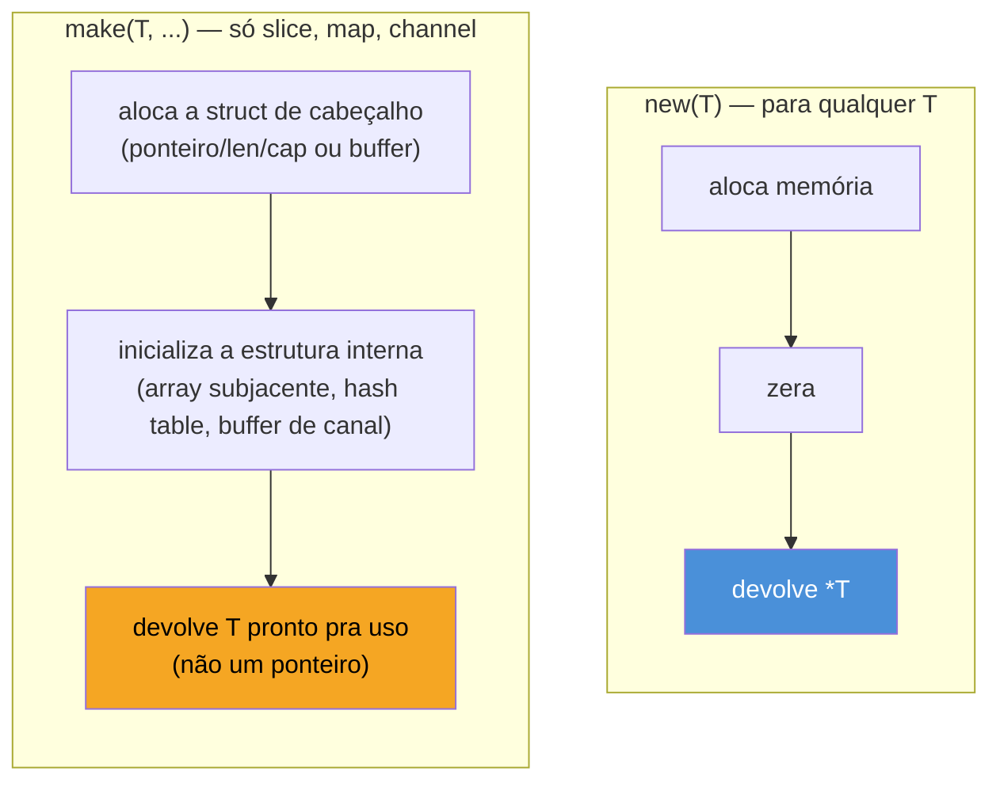

# make, new e alocação

> [!abstract] TL;DR
> Go tem **duas** funções embutidas para criar valores, e confundi-las é um erro clássico de quem chega de outra linguagem. `new(T)` aloca memória zerada para um `T` e devolve um `*T` — funciona para **qualquer** tipo, mas quase ninguém usa na prática. `make(T, ...)` só existe para **slice, map e channel** — os três tipos que carregam estruturas internas que precisam ser inicializadas antes de funcionar, não só zeradas — e devolve o próprio `T`, já pronto pra uso, nunca um ponteiro. Um `map` criado com `new` é um ponteiro pra um map `nil`: compila, mas `panic: assignment to entry in nil map` na primeira escrita. A nota anterior mostrou `len` e `cap`; aqui usamos os dois para uma coisa concreta — pré-alocar `make([]T, 0, cap)` evita realocações e cópias em loops que crescem um slice, e isso é diferença mensurável de performance, não só estilo.

## O problema que `new` e `make` resolvem

Toda variável em Go, ao ser declarada, já nasce com um valor — o *zero value* que o Galho 1 apresentou. `var i int` já é `0`. `var p Point` já é `Point{0, 0}`. Não existe "variável não inicializada" que aponte pra lixo de memória, como em C.

Mas e quando você não quer uma variável nomeada — quer um **ponteiro** direto pra um zero value recém-criado, sem passar pelo passo intermediário de declarar, dar nome, e tirar o endereço com `&`?

```go
var i int
p := &i // funciona, mas precisou de duas linhas e um nome descartável
```

`new` resolve exatamente isso — é açúcar para "aloque um zero value e me dê o ponteiro", numa linha só:

```go
p := new(int) // *int, apontando para um int zerado (0)
*p = 42
```

Só que `new` para por aí: aloca, zera, devolve ponteiro. Para a maioria dos tipos (`int`, `struct`, arrays), zerar é suficiente para o valor estar pronto — um `struct` zerado já tem todos os campos em seus próprios zero values, prontinho pra usar. Mas slice, map e channel são diferentes: por baixo, cada um deles é uma **struct pequena que aponta para uma estrutura de dados maior** (Go by Example e a nota anterior já mostraram isso para slice — `ponteiro`, `len`, `cap`). Zerar essa struct pequena não cria a estrutura maior; só deixa o ponteiro interno em `nil`. É aqui que `make` entra: em vez de só zerar, `make` **constrói** a estrutura interna e devolve o tipo já funcional — não um ponteiro pra ele.



## Por que só slice, map e channel precisam de `make`

A pergunta que fica no ar é: por que esses três tipos, especificamente, e nenhum outro? A resposta está no que cada um **é** por baixo, não em regra arbitrária da linguagem.

- **Slice** — a nota anterior já detalhou: é uma struct de três campos (ponteiro para array subjacente, `len`, `cap`). Zero value é `nil` — ponteiro nulo, `len` e `cap` zero. É um slice **utilizável**: `append` funciona nele (aloca o array na primeira escrita), `len`/`range` funcionam, retornam zero/nada. O que falta com `nil` não é funcionalidade — é o array subjacente já alocado com um `cap` conhecido de antemão.
- **Map** — internamente, uma tabela hash. Zero value é `nil` — sem tabela nenhuma alocada. Ler de um map `nil` funciona (devolve zero value, como se a chave não existisse). **Escrever** não: não há tabela pra inserir a entrada, e o runtime dá `panic` em vez de alocar silenciosamente — decisão deliberada do time do Go, para não mascarar o bug de esquecer o `make`.
- **Channel** — internamente, uma estrutura com buffer (possivelmente de tamanho zero, para channel unbuffered) e a maquinaria de sincronização entre goroutines. Zero value é `nil` — um channel `nil` nunca está pronto: enviar ou receber nele **bloqueia para sempre** (uso real disso: desligar um `case` de `select` na mão, mas é avançado — ver [[03-Dominios/Tecnologia/Go/09 - Sincronização e context/index|galho de concorrência]] adiante na trilha).

Todos os três têm em comum: o zero value (`nil`) é um estado válido e observável, mas incompleto — falta a estrutura de dados que faz o tipo funcionar de verdade. `make` constrói essa estrutura; `new` só zera bytes.

> [!info] `make` é sintaxe especial, não uma função genérica
> `make` não é uma função Go comum — não tem assinatura fixa porque aceita argumentos diferentes por tipo (`make([]T, len, cap)`, `make(map[K]V, hint)`, `make(chan T, buf)`). É tratada pelo compilador como *built-in* com regras próprias, junto de `len`, `cap`, `append`, `new` — ver a lista completa na [especificação da linguagem](https://go.dev/ref/spec#Built-in_functions).

## `new` na prática — raro, mas existe

```go
type Config struct {
    Timeout int
    Retries int
}

c := new(Config) // *Config, todos os campos zerados
c.Timeout = 30
fmt.Println(*c) // {30 0}
```

Isso é **exatamente equivalente** a:

```go
c := &Config{} // idiomático — é assim que devs Go escrevem na prática
```

Na comunidade Go, `&T{}` é preferido a `new(T)` na esmagadora maioria dos casos, porque `&T{...}` também permite popular campos já na criação (`&Config{Timeout: 30}`), enquanto `new(T)` só entrega o zero value puro — você sempre teria que atribuir campo a campo depois. `new` aparece hoje quase só em código genérico ou quando o zero value já é exatamente o que se quer e a assinatura de `new(T)` fica mais direta que `&T{}` — para tipos primitivos (`new(int)`, `new(bool)`), por exemplo.

> [!warning] `new(T)` não inicializa slice/map/channel dentro de um struct
> `new(Config)` zera `Config` inteiro — mas se `Config` tiver um campo `Items []string` ou `Cache map[string]int`, esses campos nascem `nil`, não prontos pra uso. `new` zera recursivamente; não chama `make` implicitamente em campo nenhum. Se o struct precisa desses campos já utilizáveis, é preciso um construtor (`func NewConfig() *Config { return &Config{Items: make([]string, 0), Cache: make(map[string]int)} }` — o padrão de construtor que o Galho 2 já apresentou).

## `make` na prática — slice, map, channel

**Slice** — três formas de `make`, cada uma com um propósito:

```go
a := make([]int, 5)     // len=5, cap=5 — 5 zeros prontos: [0 0 0 0 0]
b := make([]int, 0, 10) // len=0, cap=10 — vazio, mas com espaço reservado
c := make([]int, 3, 10) // len=3, cap=10 — 3 zeros, espaço para mais 7 sem realocar

fmt.Println(len(a), cap(a)) // 5 5
fmt.Println(len(b), cap(b)) // 0 10
fmt.Println(len(c), cap(c)) // 3 10
```

**Map** — um argumento opcional de *size hint*, não um limite rígido:

```go
m1 := make(map[string]int)        // pronto, sem hint de tamanho
m2 := make(map[string]int, 100)   // pronto, com hint de ~100 entradas esperadas

m1["a"] = 1 // funciona — m1 não é nil
```

**Channel** — o segundo argumento define a capacidade do buffer (`0` ou omitido = unbuffered):

```go
unbuffered := make(chan int)     // capacidade 0 — send bloqueia até haver receive
buffered := make(chan int, 5)    // capacidade 5 — send só bloqueia com buffer cheio
```

(Channels e o comportamento de bloqueio ganham nota própria mais à frente na trilha — aqui o que importa é que, sem `make`, um `chan int` é `nil` e trava qualquer envio/recebimento para sempre.)

## Pré-alocar com `cap` — quando isso importa de verdade

A nota anterior explicou o mecanismo de `append`: quando `len` alcança `cap`, o runtime aloca um array subjacente **novo** (maior), copia todo o conteúdo antigo, e só então adiciona o elemento novo. Cada realocação é um `malloc` mais uma cópia O(n). Um slice que cresce elemento a elemento, sem `cap` reservado de antemão, paga esse custo repetidas vezes — o crescimento é geométrico (a estratégia de *growth* do runtime dobra a capacidade em slices pequenos, crescendo por um fator menor conforme o slice fica grande), então o número de realocações é logarítmico, não linear — mas cada realocação individual ainda custa uma cópia inteira do conteúdo atual.

```mermaid
sequenceDiagram
    participant Loop as for i := 0; i < 10000; i++
    participant Sem as append sem pré-alocação
    participant Com as append com make(..., 0, 10000)

    Sem->>Sem: cap esgota ~14 vezes
    Sem->>Sem: 14 realocações + cópias
    Note over Sem: cada realocação copia\ntudo que já existia

    Com->>Com: cap já é 10000
    Com->>Com: 0 realocações
    Note over Com: append só escreve\nna posição seguinte
```

O código concreto: sem pré-alocação, o compilador nem sabe quantos elementos vêm — cada `append` pode ser o que estoura o `cap` atual.

```go
// Sem pré-alocação — cap cresce sozinho, com realocações no caminho
var resultado []int
for i := 0; i < 10000; i++ {
    resultado = append(resultado, i*i)
}
```

```go
// Com pré-alocação — quando o tamanho final é conhecido (ou estimável) de antemão
resultado := make([]int, 0, 10000)
for i := 0; i < 10000; i++ {
    resultado = append(resultado, i*i)
}
```

As duas versões produzem o mesmo slice final. A diferença é só quantas vezes o runtime teve que alocar e copiar pelo caminho — zero vezes na segunda, uma dúzia de vezes na primeira, para 10.000 elementos. Em loops pequenos (dezenas de elementos), essa diferença é irrelevante — não vale a complexidade de calcular `cap` de antemão. Ela passa a importar em três cenários reais: **loops muito grandes** (milhares a milhões de elementos, como processar linhas de um arquivo ou registros de uma query), **caminho quente** (código chamado com frequência alta, tipo dentro de um handler HTTP sob carga, onde cada alocação some no *profiler*), e **pressão de GC** (cada realocação descartada é lixo que o coletor de Go vai precisar varrer depois — menos alocações, menos trabalho pro GC).

Map segue a mesma lógica, com a mesma ressalva: `make(map[K]V, n)` é um **hint**, não uma garantia — o runtime pode crescer a tabela hash de qualquer forma se `n` estiver errado, mas o hint evita realocações da tabela interna quando o tamanho aproximado é conhecido.

```go
// Se você sabe, de antemão, que vai inserir ~5000 chaves:
cache := make(map[string]int, 5000)
```

> [!warning] Pré-alocação é otimização, não correção — não force sem medir
> `make([]T, 0, cap)` errado (`cap` grande demais para o uso real) desperdiça memória sem ganho nenhum; `cap` pequeno demais some quase todo o benefício, porque o slice ainda vai realocar depois de esgotar aquele espaço. A prática correta é: escrever o código simples primeiro (`var s []T` + `append` solto), medir com `go test -bench` e `pprof` se alocação de slice aparece como *hot path*, e só então trocar por `make` com `cap` calculado. Otimizar `cap` de um loop que roda 10 vezes por dia é o tipo de microotimização que a comunidade Go — historicamente cética a otimização prematura — trata como perda de tempo.

## Medindo a diferença com benchmark

"Isso importa de verdade" não é afirmação para aceitar de graça — Go tem ferramenta embutida para provar (ou refutar) a alegação: `testing.B`. Um benchmark comparando as duas versões do loop acima:

```go
func BenchmarkSemPreAlocacao(b *testing.B) {
    for i := 0; i < b.N; i++ {
        var resultado []int
        for j := 0; j < 10000; j++ {
            resultado = append(resultado, j*j)
        }
    }
}

func BenchmarkComPreAlocacao(b *testing.B) {
    for i := 0; i < b.N; i++ {
        resultado := make([]int, 0, 10000)
        for j := 0; j < 10000; j++ {
            resultado = append(resultado, j*j)
        }
    }
}
```

Rodando com `go test -bench=. -benchmem`, a flag `-benchmem` acrescenta duas colunas cruciais que o benchmark padrão omite: `B/op` (bytes alocados por operação) e `allocs/op` (número de alocações por operação). É nessas duas colunas — não no tempo bruto — que a pré-alocação mostra a diferença mais clara: a versão sem `make` reporta uma dúzia ou mais de `allocs/op` (uma por realocação do array subjacente); a versão com `make` reporta **uma única** alocação — a do próprio `make([]int, 0, 10000)`. O tempo (`ns/op`) segue proporcional, mas é o número de alocações que explica a causa raiz, e é essa métrica que também aparece em `pprof` quando alocação de memória é o gargalo investigado.

> [!info] `-benchmem` desde as primeiras versões modernas do toolchain
> A flag `-benchmem` do `go test` já existe há muitas versões do Go — não é novidade — mas vale mencionar porque nem todo tutorial antigo a inclui por padrão nos exemplos. Sem ela, um benchmark só mostra tempo; com ela, mostra também o custo de alocação, que é frequentemente o fator dominante em código que mexe com slice e map.

## Armadilhas comuns

> [!warning] `new(map[K]V)` não é o mesmo que `make(map[K]V)`
> `new` num tipo map devolve um `*map[K]V` — ponteiro pra um map `nil`. Isso raramente é o que você quer: você precisaria desreferenciar (`(*m)["chave"] = valor`) e ainda assim daria panic, porque o map apontado continua `nil`. A confusão nasce de achar que `new` "cria" o valor pronto pra uso, do jeito que faz para `int` ou `struct` — para map, ele só cria um ponteiro pra um valor que ainda não existe de verdade.

> [!warning] `make([]T, N)` cria N elementos, não capacidade para N
> `make([]int, 5)` já tem `len(5)` — cinco zeros reais, acessíveis por índice. Quem quer um slice **vazio** mas com espaço reservado precisa do terceiro argumento: `make([]int, 0, 5)`. Confundir os dois é comum: `s := make([]int, 5); s = append(s, 10)` produz `[0 0 0 0 0 10]` — seis elementos, não os cinco esperados — porque `append` sempre adiciona **depois** do `len` atual.

> [!warning] `map` `nil` lê como vazio, mas `panic` ao escrever
> `var m map[string]int; fmt.Println(m["qualquer"])` devolve `0` silenciosamente — leitura em map `nil` é segura. `m["chave"] = 1` na mesma variável dá `panic: assignment to entry in nil map`. É fácil escrever código que funciona nos testes (só leitura) e quebra em produção na primeira escrita, se o map nunca passou por `make`.

## Vindo de outras linguagens

| Origem | O equivalente mental | Onde a analogia quebra |
|---|---|---|
| Java | `new Point()` sempre aloca **e** inicializa o objeto inteiro | Go separa os dois: `new(T)` só zera; `make` inicializa a estrutura interna de slice/map/channel — não existe "construtor" embutido em nenhum dos dois |
| Python | `list()`, `dict()` já vêm prontos, sem escolha de capacidade | `make([]T, 0, cap)` expõe a pré-alocação que CPython esconde atrás de `list.append`'s *overallocation* automático |
| JavaScript | `new Array(10)` e `{}` já "funcionam" na hora | Um `map[K]V` `nil` em Go **parece** pronto (lê sem erro) mas quebra ao escrever — JS não tem esse estado intermediário traiçoeiro |

## Como explicar em inglês

> Go has two allocation built-ins, and mixing them up is a classic newcomer mistake. `new(T)` allocates zeroed memory for any type `T` and returns a `*T` — it's rarely used in idiomatic Go because `&T{}` does the same thing while also letting you set fields inline. `make(T, ...)` only works on **slices, maps, and channels** — the three types whose zero value (`nil`) is valid but incomplete, missing the internal data structure (backing array, hash table, or channel buffer) that makes the type actually usable. `make` builds that structure and returns the type itself, never a pointer. Writing to a `nil` map panics; sending on a `nil` channel blocks forever; a `nil` slice at least tolerates `append` (it allocates on first write). Beyond correctness, `make([]T, 0, cap)` matters for performance: pre-allocating capacity when the final size is known or estimable avoids the repeated allocate-and-copy cycle that `append` triggers every time capacity runs out — worth doing in hot paths and large loops, not worth doing everywhere.

| Termo PT | Termo EN |
|---|---|
| alocação | allocation |
| valor zero | zero value |
| capacidade | capacity |
| pré-alocar | pre-allocate |
| realocação | reallocation |
| array subjacente | backing array |
| dica de tamanho | size hint |
| caminho quente | hot path |
| pressão sobre o coletor de lixo | GC pressure |

## O que vem a seguir

`make` e `cap` resolvem o problema de *criar* a coleção certa desde o início. Mas coleção pronta não é coleção **organizada** — um slice de structs não vem ordenado por nenhum critério, e buscar um elemento específico nele é, por padrão, varredura linear. A [[07 - Ordenação e busca com slices e sort|nota 07]] fecha esse gap: como ordenar slices com o pacote `sort` (e o `slices` mais moderno), e como isso desbloqueia busca binária — de O(n) para O(log n) — quando o volume de dados justifica.

## Veja também

- [[02 - Slices — o cavalo de batalha|02 — Slices — o cavalo de batalha]] — introduz slice como struct de ponteiro/len/cap, base para entender por que `make` existe
- [[03 - Maps|03 — Maps]] — map como zero value `nil`, retomado aqui com a mecânica completa de `make`
- [[05 - O modelo de memória de slices — len, cap e aliasing|05 — O modelo de memória de slices — len, cap e aliasing]] — o mecanismo de crescimento de `append` que a pré-alocação evita
- [[07 - Ordenação e busca com slices e sort|07 — Ordenação e busca com slices e sort]] — próxima nota do galho
- [[03-Dominios/Tecnologia/Go/index|Trilha Go]]

## Fontes

- The Go Authors. *The Go Programming Language Specification — Built-in functions*. go.dev. https://go.dev/ref/spec#Built-in_functions (acessado em 2026-07-18)
- The Go Authors. *A Tour of Go — Slices*. go.dev. https://go.dev/tour/moretypes/13 (acessado em 2026-07-18)
- The Go Authors. *Effective Go — Allocation with new and make*. go.dev. https://go.dev/doc/effective_go#allocation_new (acessado em 2026-07-18)
- Go by Example. *Maps*. gobyexample.com. https://gobyexample.com/maps (acessado em 2026-07-18)
- Go by Example. *Slices*. gobyexample.com. https://gobyexample.com/slices (acessado em 2026-07-18)
