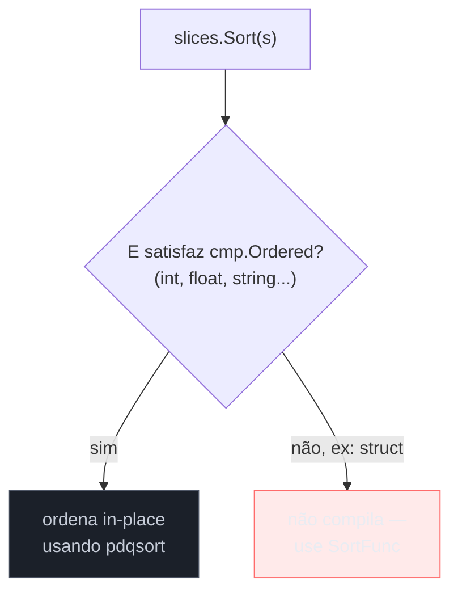
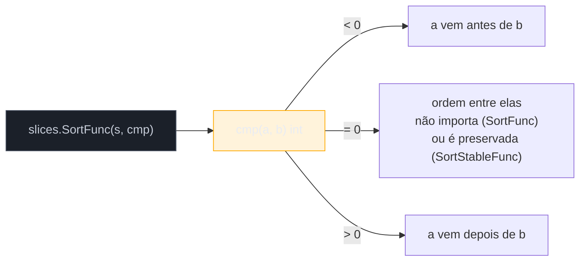
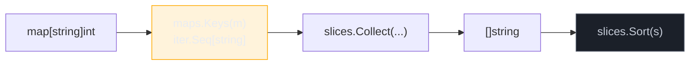

# Ordenação e busca com slices e sort

> [!abstract] TL;DR
> Até 2023, ordenar um `[]int` em Go exigia escrever três métodos (`Len`, `Less`, `Swap`) só para satisfazer `sort.Interface` — ou recorrer a `sort.Slice`, que funciona mas perde tipagem em tempo de compilação. O Go 1.21 trouxe o pacote **`slices`**, genérico sobre `cmp.Ordered`: `slices.Sort(s)` ordena em uma linha, `slices.Contains`/`slices.Index` buscam sem laço manual, `slices.SortFunc` aceita um comparador para tipos sem ordem natural. O pacote irmão **`maps`** oferece o equivalente para mapas — `maps.Keys`, `maps.Values`, `maps.Clone` — sempre lembrando que a ordem de iteração de um map continua não determinística. `sort.Slice` e `sort.Interface` não morreram: código legado ainda os usa, e certos casos (ordenação estável, slices de tipos privados a outro pacote) ainda pedem `sort.Sort`/`sort.Stable`. Esta nota mapeia quando usar cada ferramenta.

## O problema: ordenar sem repetir boilerplate

Imagine que você tem uma lista de notas de prova e precisa ordená-la para exibir do maior para o menor:

```go
notas := []int{72, 95, 61, 88, 40}
```

Antes do Go 1.21, a forma canônica de resolver isso — sem escrever seu próprio *bubble sort* — era `sort.Ints(notas)`, uma função auxiliar para o caso comum de `[]int`. Funcionava, mas era um paliativo: `sort` também oferecia `sort.Strings` e `sort.Float64s`, e parava por aí. Precisava ordenar um `[]int32` ou um `[]byte`? Não havia atalho — a saída era implementar `sort.Interface` do zero:

```go
type porNota []int

func (p porNota) Len() int           { return len(p) }
func (p porNota) Less(i, j int) bool { return p[i] < p[j] }
func (p porNota) Swap(i, j int)      { p[i], p[j] = p[j], p[i] }

sort.Sort(porNota(notas))
```

Três métodos, um tipo novo, só para dizer "compare por `<`". É o tipo de repetição que generics — chegados em Go 1.18 (veja a introdução no [[03-Dominios/Tecnologia/Go/03 - Interfaces e composição/index|galho 3]] sobre interfaces, e o aprofundamento fica para o galho 6) — foram feitos para eliminar. O Go 1.21 aproveitou essa capacidade nova da linguagem e lançou o pacote `slices`: uma única função genérica, `slices.Sort`, substitui `sort.Ints`, `sort.Strings`, `sort.Float64s` e qualquer `sort.Interface` escrito à mão para um tipo com ordem natural.

> [!info] Pacotes `slices` e `maps` — Go 1.21 (2023)
> Os pacotes [`slices`](https://pkg.go.dev/slices) e [`maps`](https://pkg.go.dev/maps) da biblioteca padrão foram introduzidos no Go 1.21, junto com o pacote `cmp`. Antes disso, funções equivalentes existiam apenas no módulo experimental `golang.org/x/exp/slices` — se você vir esse import em código mais antigo, é o precursor do que hoje é padrão.

## `slices.Sort`: ordenação genérica

```go
notas := []int{72, 95, 61, 88, 40}
slices.Sort(notas)
fmt.Println(notas) // [40 61 72 88 95]
```

`slices.Sort` tem a assinatura `func Sort[S ~[]E, E cmp.Ordered](x S)`. O detalhe que importa: `E cmp.Ordered` é uma **constraint de tipo** — só aceita elementos cuja ordem é definida pelos operadores nativos `<`, `<=`, `>`, `>=`. O pacote [`cmp`](https://pkg.go.dev/cmp) define essa constraint como a união de todos os tipos inteiros, todos os tipos de ponto flutuante e `string`. Um `[]int`, `[]float64` ou `[]string` compila direto; um `[]Point` (struct) não compila, porque não existe `<` nativo entre structs — para esses, a resposta é `slices.SortFunc`, mais adiante.



A ordenação é **in-place** — `slices.Sort` recebe o slice e reordena os elementos no array subjacente, sem alocar um novo slice. Se dois slices compartilham o mesmo array (aliasing, [[05 - O modelo de memória de slices — len, cap e aliasing|nota 05]]), ordenar um afeta a visão do outro. Internamente, o algoritmo é uma variante de *pattern-defeating quicksort* (pdqsort), **não estável**: elementos "iguais" segundo a comparação podem trocar de posição relativa entre si.

> [!warning] `slices.Sort` não é estável
> Se você tem uma lista de pedidos já ordenada por data e quer reordenar por valor **preservando** a ordem de data entre pedidos de mesmo valor, `slices.Sort`/`slices.SortFunc` não garantem isso. Para ordenação estável, use `slices.SortStableFunc` (equivalente genérico de `sort.Stable`) — mais lento, mas preserva a ordem relativa de elementos equivalentes.

## Busca: `Contains` e `Index`

Antes do pacote `slices`, procurar um elemento em um slice era sempre um laço manual:

```go
// Como se fazia antes
func contem(s []int, alvo int) bool {
    for _, v := range s {
        if v == alvo {
            return true
        }
    }
    return false
}
```

`slices.Contains` e `slices.Index` embutem exatamente esse laço, genericamente:

```go
notas := []int{72, 95, 61, 88, 40}

fmt.Println(slices.Contains(notas, 88)) // true
fmt.Println(slices.Index(notas, 88))    // 3
fmt.Println(slices.Index(notas, 100))   // -1, convenção igual a strings.Index
```

`Contains` exige `comparable` (funciona com qualquer tipo que aceite `==`, incluindo structs sem campos incomparáveis como slices ou maps); `Index` tem a mesma exigência e retorna `-1` quando não encontra — a mesma convenção de `strings.Index`, que você já viu na [[04 - Strings, runes e bytes|nota 04]]. Ambas são **buscas lineares**, O(n): percorrem o slice do início ao fim até achar (ou não achar) o alvo. Para um slice de milhares de elementos consultado repetidamente, isso é um sinal de que talvez a estrutura certa seja outra — assunto da próxima nota, [[08 - Escolhendo a estrutura de dados certa|08]].

Quando o slice já está **ordenado**, `slices.BinarySearch` troca O(n) por O(log n):

```go
notas := []int{40, 61, 72, 88, 95} // precisa estar ordenado
idx, achou := slices.BinarySearch(notas, 72)
fmt.Println(idx, achou) // 2 true

idx, achou = slices.BinarySearch(notas, 70)
fmt.Println(idx, achou) // 2 false — posição onde 70 entraria, mantendo a ordem
```

`BinarySearch` sempre devolve dois valores: o índice e um `bool` dizendo se o valor foi encontrado exatamente. Quando não encontra, o índice retornado é a posição de inserção que preserva a ordenação — útil para implementar `slices.Insert` de forma ordenada sem duas passadas pelo slice.

## Comparadores: `SortFunc` e o pacote `cmp`

`Point` não tem ordem natural — não existe resposta óbvia para "`Point{1,2} < Point{3,0}`?". Para ordenar um `[]Point` por alguma regra (por exemplo, distância à origem), `slices.SortFunc` recebe um **comparador**: uma função que recebe dois elementos e devolve um `int` negativo, zero, ou positivo — a mesma convenção de `strings.Compare` e do `Comparator<T>` de Java.

```go
type Point struct {
    X, Y float64
}

func dist(p Point) float64 {
    return math.Sqrt(p.X*p.X + p.Y*p.Y)
}

pontos := []Point{{3, 4}, {0, 1}, {1, 1}}

slices.SortFunc(pontos, func(a, b Point) int {
    return cmp.Compare(dist(a), dist(b))
})

fmt.Println(pontos) // [{0 1} {1 1} {3 4}]
```

`cmp.Compare(a, b)` é o utilitário do pacote `cmp` que faz exatamente o que `strings.Compare` faz para strings, mas genérico sobre qualquer tipo `cmp.Ordered`: devolve `-1` se `a < b`, `0` se iguais, `1` se `a > b`. Escrever `cmp.Compare(dist(a), dist(b))` em vez de um `if`/`else if`/`else` manual é o idiomatismo que se consolidou depois do 1.21 — mais curto e sem risco de inverter a lógica por engano.



Um segundo caso comum: ordenar por múltiplos critérios, com desempate. `cmp.Or` (também do pacote `cmp`) encadeia comparações, retornando a primeira que não for zero — útil para "ordene por sobrenome, e em caso de empate, por nome":

```go
type Pessoa struct {
    Sobrenome, Nome string
}

pessoas := []Pessoa{
    {"Silva", "Bruno"},
    {"Costa", "Ana"},
    {"Silva", "Ana"},
}

slices.SortFunc(pessoas, func(a, b Pessoa) int {
    return cmp.Or(
        cmp.Compare(a.Sobrenome, b.Sobrenome),
        cmp.Compare(a.Nome, b.Nome),
    )
})
// [{Costa Ana} {Silva Ana} {Silva Bruno}]
```

> [!info] `cmp.Or` — Go 1.22
> `cmp.Or` chegou um ciclo depois de `cmp.Compare`, no Go 1.22. Recebe qualquer quantidade de valores comparáveis e devolve o primeiro que for diferente do zero-value do seu tipo — o mesmo padrão de "coalescência" que `??` faz em JavaScript ou `COALESCE` faz em SQL, aplicado a critérios de ordenação em cadeia.

## Busca e filtragem por predicado: as variantes `Func`

Nem toda busca é por igualdade exata. Se você precisa achar o primeiro produto cujo preço passa de um limite, `Contains`/`Index` não servem — eles comparam com `==`. Para isso, `slices` oferece a família `Func`, que recebe um **predicado** em vez de um valor:

```go
produtos := []Produto{{"Bebida", 3.0, "Água"}, {"Snack", 7.5, "Chips"}, {"Bebida", 5.0, "Suco"}}

idx := slices.IndexFunc(produtos, func(p Produto) bool {
    return p.Preco > 5.0
})
fmt.Println(idx) // 1 — "Chips", primeiro com preço > 5.0

achou := slices.ContainsFunc(produtos, func(p Produto) bool {
    return p.Categoria == "Snack"
})
fmt.Println(achou) // true
```

O mesmo padrão aparece em `slices.DeleteFunc` (remove todos os elementos que satisfazem o predicado, in-place) — útil para filtrar sem alocar um slice paralelo:

```go
produtos = slices.DeleteFunc(produtos, func(p Produto) bool {
    return p.Preco < 4.0 // remove os "baratos"
})
```

Para busca binária com comparador customizado (o análogo de `BinarySearch` para tipos sem `cmp.Ordered`), existe `slices.BinarySearchFunc` — mesma exigência de slice pré-ordenado, mas com um comparador `func(elem E, alvo T) int` no lugar do `<` nativo. E do lado antigo, `sort.Search` faz busca binária genérica sobre qualquer predicado monotônico (`func(i int) bool`), sendo o ancestral direto de `slices.BinarySearchFunc` — ainda aparece em código pré-1.21 fazendo o mesmo trabalho de forma mais verbosa.

## `sort.Slice`: a ponte legada

Antes de `slices.SortFunc` existir, a forma idiomática de ordenar por um critério customizado era `sort.Slice`, do pacote `sort` original (pré-generics):

```go
sort.Slice(pontos, func(i, j int) bool {
    return dist(pontos[i]) < dist(pontos[j])
})
```

A diferença de assinatura é reveladora do quanto generics mudaram o idiomatismo: `sort.Slice` recebe uma função `func(i, j int) bool` que compara **índices**, não valores — e precisa fechar sobre o slice original (`pontos[i]`, `pontos[j]`) via *closure*. `slices.SortFunc` recebe os **valores** diretamente como parâmetros. É mais legível, mais difícil de errar (não há risco de trocar `pontos[i]` por `outroSlice[i]` por engano dentro do closure) e type-safe: o compilador garante que os dois parâmetros do comparador têm o tipo do elemento do slice.

`sort.Slice` **não desapareceu** e não está deprecated — continua funcionando, e a biblioteca padrão não vai removê-lo (a [compatibilidade do Go 1](https://go.dev/doc/go1compat) garante isso). Mas em código novo, com Go 1.21+ disponível, `slices.SortFunc` é a escolha padrão: mais segura e, segundo os benchmarks do próprio design doc do pacote, competitiva em performance ou melhor, por evitar a indireção de reflection que `sort.Interface` historicamente carregava internamente.

| | `sort.Slice` | `slices.SortFunc` |
|---|---|---|
| Comparador | `func(i, j int) bool` | `func(a, b E) int` |
| Acessa elementos por | índice, via closure sobre o slice | valor, direto como parâmetro |
| Checagem de tipo | em runtime (usa `reflect` internamente) | em tempo de compilação (generics) |
| Estável? | não (use `sort.SliceStable`) | não (use `slices.SortStableFunc`) |
| Desde | Go 1.8 | Go 1.21 |

## `sort.Interface`: quando ainda aparece

`sort.Interface` — o trio `Len`/`Less`/`Swap` visto na abertura — é a peça mais antiga do pacote `sort`, desde antes de Go ter reflection confortável o bastante para `sort.Slice` existir (Go 1.0). Hoje, para ordenar um slice comum, não há razão para escrevê-lo à mão. Mas ele continua relevante em dois cenários:

1. **Você está lendo código legado.** Bases de código anteriores a 2015 (quando `sort.Slice` chegou no Go 1.8) e muita infraestrutura interna de empresas grandes ainda usam o padrão `type porX []T; func (p porX) Len()...`. Reconhecer o padrão é necessário para não se perder numa revisão de código.
2. **Você precisa de um tipo que se comporte como "ordenável" em múltiplos lugares da API**, não só numa chamada pontual de `Sort`. Implementar `sort.Interface` uma vez no tipo permite passá-lo para qualquer função que espere essa interface — inclusive `sort.Reverse`, que inverte a ordem sem reescrever o `Less`.

```go
type porNota []int

func (p porNota) Len() int           { return len(p) }
func (p porNota) Less(i, j int) bool { return p[i] < p[j] }
func (p porNota) Swap(i, j int)      { p[i], p[j] = p[j], p[i] }

sort.Sort(sort.Reverse(porNota(notas))) // decrescente, sem reescrever Less
```

`sort.Reverse` é um truque elegante que vale entender: ele devolve um `sort.Interface` cujo `Less(i, j)` chama o `Less(j, i)` original — inverte a comparação sem tocar no `Swap` nem no `Len`. O equivalente com `slices.SortFunc` é mais direto — basta inverter a subtração no comparador:

```go
slices.SortFunc(notas, func(a, b int) int {
    return cmp.Compare(b, a) // b, a invertidos: ordem decrescente
})
```

## O pacote `maps`: chaves, valores e clonagem

O pacote irmão `maps` resolve, para mapas, o mesmo tipo de repetição que `slices` resolveu para slices — extrair chaves ou valores para um slice, por exemplo, não pedia mais um laço manual:

```go
inventario := map[string]int{"maçã": 10, "pera": 5, "uva": 20}

chaves := slices.Collect(maps.Keys(inventario))
fmt.Println(chaves) // ordem NÃO determinística — ex: [pera maçã uva]
```

> [!info] `maps.Keys`/`maps.Values` retornam iteradores — Go 1.23
> A partir do Go 1.23, `maps.Keys(m)` e `maps.Values(m)` não retornam mais `[]K`/`[]V` diretamente — retornam um `iter.Seq[K]`/`iter.Seq[V]`, o tipo de **função iteradora** introduzido junto com `range-over-func` no Go 1.23. Para obter um slice de volta, é preciso passar por `slices.Collect`, como no exemplo acima. Em versões 1.21/1.22, `maps.Keys` retornava `[]K` diretamente — se você vir código sem o `slices.Collect`, é provável que tenha sido escrito para essas versões.



O padrão "extrair chaves, ordenar, iterar em ordem" é tão comum — porque a ordem de iteração de um `map` é deliberadamente [randomizada](https://go.dev/blog/maps#iteration-order) desde o Go 1 — que vale fixar como idioma:

```go
inventario := map[string]int{"maçã": 10, "pera": 5, "uva": 20}

chaves := slices.Collect(maps.Keys(inventario))
slices.Sort(chaves)

for _, k := range chaves {
    fmt.Printf("%s: %d\n", k, inventario[k])
}
// maçã: 10
// pera: 5
// uva: 20
```

`maps.Clone` merece menção rápida: faz uma cópia rasa (*shallow copy*) de um map, útil quando você precisa modificar uma versão sem afetar o original — mapas em Go, como slices, são tipos de referência, e uma atribuição simples (`m2 := m1`) apenas copia o *header* que aponta para os mesmos dados internos.

```go
original := map[string]int{"a": 1, "b": 2}
copia := maps.Clone(original)
copia["a"] = 99

fmt.Println(original["a"]) // 1 — original intacto
fmt.Println(copia["a"])    // 99
```

`maps.Equal` compara dois mapas por conteúdo (chave a chave, valor a valor) — algo que `==` não faz para mapas em Go, já que mapas não são comparáveis com `==` (só contra `nil`).

## Casos práticos

**1. Ordenar uma lista de structs por múltiplos critérios**, combinando `SortFunc` com `cmp.Or`:

```go
type Produto struct {
    Categoria string
    Preco     float64
    Nome      string
}

produtos := []Produto{
    {"Bebida", 5.0, "Suco"},
    {"Bebida", 3.0, "Água"},
    {"Snack", 3.0, "Chips"},
}

slices.SortFunc(produtos, func(a, b Produto) int {
    return cmp.Or(
        cmp.Compare(a.Categoria, b.Categoria),
        cmp.Compare(a.Preco, b.Preco),
    )
})
// Bebida/Água(3.0), Bebida/Suco(5.0), Snack/Chips(3.0)
```

**2. Deduplicação depois de ordenar**, combinando `slices.Sort` com `slices.Compact` (que remove elementos consecutivos iguais — por isso a ordenação prévia é obrigatória):

```go
ids := []int{5, 3, 5, 1, 3, 3, 2}
slices.Sort(ids)             // [1 2 3 3 3 5 5]
ids = slices.Compact(ids)    // [1 2 3 5]
```

**3. Chaves de um map ordenadas, para saída determinística** (útil em logs, testes ou serialização onde a ordem de `map` randomizada quebraria um `diff`):

```go
config := map[string]string{"timeout": "30s", "host": "localhost", "port": "8080"}

chaves := slices.Collect(maps.Keys(config))
slices.Sort(chaves)

for _, k := range chaves {
    fmt.Printf("%s=%s\n", k, config[k])
}
// host=localhost
// port=8080
// timeout=30s
```

## Armadilhas comuns

> [!warning] `slices.Sort` muta o slice original — não devolve uma cópia ordenada
> Diferente de métodos como `sorted()` do Python (que devolve uma nova lista), `slices.Sort(s)` ordena `s` **in-place** e não retorna nada (`func Sort[...](x S)`, sem valor de retorno). Se você precisa preservar a ordem original, clone o slice antes: `copia := slices.Clone(s); slices.Sort(copia)`.

> [!warning] Comparador de `SortFunc` invertido gera bug silencioso
> Trocar `cmp.Compare(a, b)` por `cmp.Compare(b, a)` não gera erro de compilação nem de runtime — só inverte a ordem silenciosamente, para decrescente. É um erro fácil de cometer e fácil de não notar em teste manual rápido; vale testar explicitamente o extremo (primeiro e último elemento) depois de escrever um comparador.

> [!warning] `slices.BinarySearch` em slice não ordenado devolve resultado indefinido
> Busca binária assume que o slice já está ordenado segundo o mesmo critério de comparação. Rodar `slices.BinarySearch` num slice fora de ordem não gera erro — devolve um índice e um `bool` que podem estar completamente errados, sem aviso nenhum.

> [!warning] `maps.Keys`/`Values` sem `slices.Collect` não compila como slice (Go 1.23+)
> Quem escreveu `chaves := maps.Keys(m)` esperando um `[]string` em Go 1.23+ recebe um erro de tipo — `maps.Keys` devolve `iter.Seq[string]`, não `[]string`. É preciso `slices.Collect(maps.Keys(m))`, ou iterar diretamente com `for k := range maps.Keys(m)`, aproveitando o range-over-func do Go 1.23.

## Vindo de outra linguagem

| Linguagem | Ordenar coleção | Comparador customizado |
|---|---|---|
| Java | `Collections.sort(list)` (requer `Comparable`) | `list.sort(Comparator.comparing(...))` |
| Python | `sorted(lista)` (devolve cópia) ou `lista.sort()` (in-place) | `sorted(lista, key=...)` |
| JavaScript | `array.sort()` (in-place, compara como string por padrão!) | `array.sort((a, b) => a - b)` |
| Go | `slices.Sort(s)` (in-place, requer `cmp.Ordered`) | `slices.SortFunc(s, func(a, b E) int {...})` |

O detalhe que mais surpreende quem vem de JavaScript: `Array.prototype.sort()` sem comparador ordena convertendo os elementos para string — `[10, 2, 1].sort()` dá `[1, 10, 2]`, não `[1, 2, 10]`. Go nunca faz esse tipo de coerção implícita: `slices.Sort` exige um tipo com ordem numérica/lexicográfica nativa (`cmp.Ordered`), ou recusa compilar.

## Como explicar em inglês

> Go 1.21 introduced the `slices` and `maps` packages, bringing generic, type-safe collection operations that replace most hand-written `sort.Interface` implementations. `slices.Sort` sorts in place for any type satisfying `cmp.Ordered` (numbers and strings); `slices.SortFunc` takes a comparator function — `func(a, b E) int`, following the same `-1`/`0`/`1` convention as `strings.Compare` — for types without a natural order, like structs. The `cmp` package's `cmp.Compare` and `cmp.Or` (1.22) make writing multi-criteria comparators concise. The older `sort.Slice` (index-based closure, reflection under the hood) and `sort.Interface` (the classic `Len`/`Less`/`Swap` trio) still work and aren't deprecated, but new code should default to the generic `slices` functions for compile-time type safety. Since Go 1.23, `maps.Keys`/`maps.Values` return iterators (`iter.Seq[K]`) rather than slices, so extracting a sorted key list now goes through `slices.Collect(maps.Keys(m))`.

| Termo PT | Termo EN |
|---|---|
| ordenação in-place | in-place sort |
| ordenação estável | stable sort |
| comparador | comparator |
| busca binária | binary search |
| iterador | iterator |
| cópia rasa | shallow copy |
| desempate | tie-break |
| ordem determinística | deterministic order |

## O que vem a seguir

Ter `slices.Sort`, `slices.Contains` e `maps.Keys` na caixa de ferramentas resolve o "como manipular" — mas não responde "qual estrutura usar" quando o problema começa do zero. Um slice ordenado com busca binária é ótimo para leitura, péssimo para inserção no meio; um map é O(1) para busca por chave, mas não preserva ordem nem serializa de forma determinística sem o tipo de passo extra visto aqui. A [[08 - Escolhendo a estrutura de dados certa|nota 08]], que fecha este galho, organiza esse julgamento: quando um slice basta, quando um map é a resposta certa, e quando nenhum dos dois é — e uma struct com índices auxiliares entra em cena.

## Veja também

- [[02 - Slices — o cavalo de batalha|02 — Slices — o cavalo de batalha]] — fundamentos de slice retomados aqui em contexto de ordenação
- [[03 - Maps|03 — Maps]] — o tipo `map` cuja iteração randomizada motiva boa parte desta nota
- [[05 - O modelo de memória de slices — len, cap e aliasing|05 — O modelo de memória de slices]] — por que `slices.Sort` in-place pode afetar slices que compartilham array
- [[08 - Escolhendo a estrutura de dados certa|08 — Escolhendo a estrutura de dados certa]] — próxima nota do galho
- [[03-Dominios/Tecnologia/Go/index|Trilha Go]]

## Fontes

- The Go Authors. *Package slices*. pkg.go.dev. https://pkg.go.dev/slices (acessado em 2026-07-18)
- The Go Authors. *Package maps*. pkg.go.dev. https://pkg.go.dev/maps (acessado em 2026-07-18)
- The Go Authors. *Package cmp*. pkg.go.dev. https://pkg.go.dev/cmp (acessado em 2026-07-18)
- The Go Authors. *Package sort*. pkg.go.dev. https://pkg.go.dev/sort (acessado em 2026-07-18)
- The Go Authors. *Go 1.21 Release Notes*. go.dev. https://go.dev/doc/go1.21 (acessado em 2026-07-18)
- The Go Authors. *Go maps in action — iteration order*. go.dev/blog. https://go.dev/blog/maps#iteration-order (acessado em 2026-07-18)
