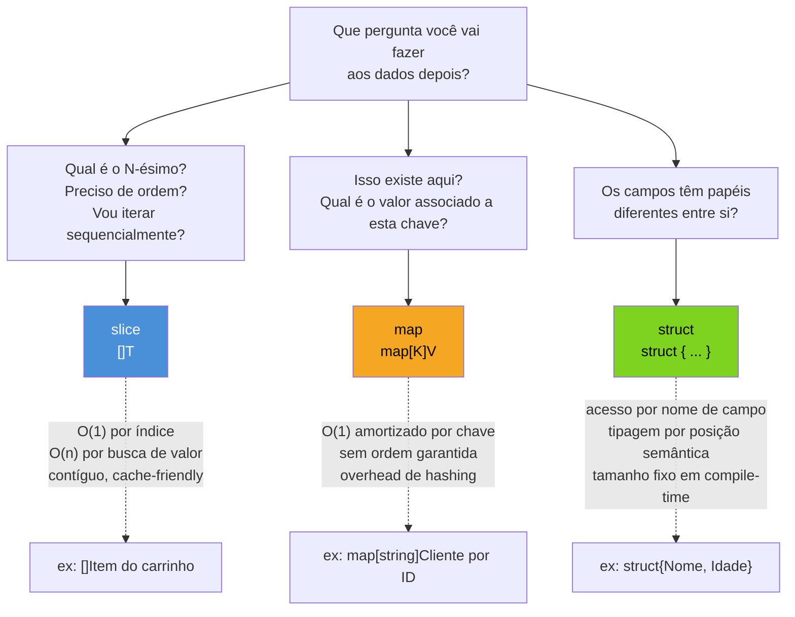
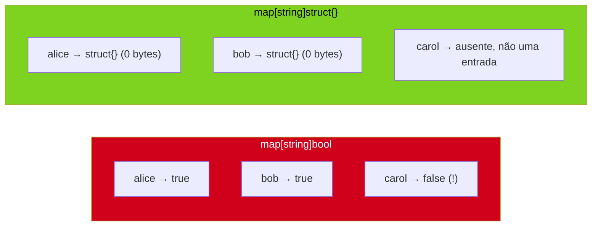

# Escolhendo a estrutura de dados certa

> [!abstract] TL;DR
> Go não tem `List`, `Set`, `Map`, `LinkedList` como no Java Collections Framework — tem três primitivas compostas (`slice`, `map`, `struct`) e você monta o resto combinando-as. Não existe tipo `Set` embutido: o idioma é `map[T]struct{}`, onde `struct{}` (zero bytes) marca presença sem desperdiçar memória com um `bool`. A escolha entre slice e map não é estética — é sobre a pergunta que você vai fazer aos dados depois: "qual é o N-ésimo?" pede slice (O(1) por índice, cache-friendly); "isso existe aqui?" pede map (O(1) amortizado por hash, sem ordem). Struct entra quando os campos têm papéis *diferentes* (não são intercambiáveis) — é isso que separa `struct{X, Y float64}` de `[2]float64`. Esta nota fecha o Galho 5 comparando as três, com uma régua prática pra decidir sem hesitar da próxima vez.

## O problema: você já sabe usar as três, mas ainda hesita

Chegando até aqui, você já viu arrays e o modelo de valor, slices como cavalo de batalha, maps, o trio `len`/`cap`/aliasing, `make`/`new`, e como ordenar e buscar num slice. Cada peça isolada, dominada. O que ainda falta é o reflexo — aquele meio segundo de hesitação quando você começa uma função nova e não sabe se `var x []Produto` ou `x := map[string]Produto{}` é o ponto de partida certo.

Esse reflexo importa porque, ao contrário de linguagens com um framework de coleções unificado, em Go a escolha errada não é "trocar depois com find-and-replace" — ela molda a API inteira: se um `[]Produto` devia ter sido `map[string]Produto`, toda função que faz busca linear nesse slice precisa ser reescrita, e todo chamador que iterava por índice também.

Um cenário concreto ilustra os três ao mesmo tempo. Você está construindo um sistema de pedidos:

```go
type Pedido struct {
    ID       string
    Cliente  string
    Itens    []string
    Status   string
}
```

Três decisões de estrutura de dados já aconteceram nessa declaração, mesmo sem você ter percebido:

1. `Pedido` é um **struct** — `ID`, `Cliente`, `Itens` e `Status` são papéis diferentes, não instâncias intercambiáveis do mesmo tipo.
2. `Itens` é um **slice** — a ordem em que os itens foram adicionados importa (o cliente pediu X antes de Y), e você vai iterar por todos eles pra montar a nota fiscal.
3. Em algum lugar do sistema, alguém vai precisar responder "esse `ID` de pedido já existe?" — e a estrutura certa pra essa pergunta ainda não apareceu no código acima. É exatamente essa lacuna que o resto da nota resolve.

## As três primitivas e a pergunta que cada uma responde



A pergunta "qual é o N-ésimo?" e a pergunta "isso existe aqui?" parecem parecidas — ambas são "busca" no sentido genérico — mas pedem estruturas fisicamente diferentes por baixo. Um slice é um bloco contíguo de memória: acessar `s[42]` é aritmética de ponteiro, `O(1)` sem exceção, e percorrer `s[0]`, `s[1]`, `s[2]`... sequencialmente é o padrão de acesso que a CPU mais gosta — prefetch de cache line funciona de graça (a nota 05 já cobriu esse modelo de memória contíguo). Já um map não guarda nada contíguo por chave: internamente é uma tabela hash — buckets espalhados, sem relação de vizinhança entre `m["a"]` e `m["b"]`. Isso dá `O(1)` amortizado pra "essa chave existe?" — mas troca a localidade de cache por essa flexibilidade, e não garante nenhuma ordem de iteração (a nota 03 já mostrou isso: `for k := range m` embaralha a cada rodada, de propósito, desde Go 1).

## Por que não existe `List<T>`, `Set<T>`, `Map<K,V>` como interface unificada

Quem vem de Java monta o hábito de pensar em termos da hierarquia `Collection` — `List`, `Set`, `Map`, `Queue`, todos implementando interfaces comuns, todos trocáveis por injeção de dependência. Python tem `list`, `set`, `dict`, `tuple` como parte do próprio léxico da linguagem. Go não tem nada disso: tem `array`, `slice`, `map` como tipos embutidos na especificação da linguagem, e ponto final. Não existe um tipo `Set` — nem embutido, nem na standard library.

Isso não é uma lacuna a ser preenchida por um framework externo, é uma escolha deliberada de design: Go prefere **poucas primitivas ortogonais que você compõe** a uma hierarquia grande de tipos especializados prontos. O efeito colateral é que "eu preciso de um set" vira, em Go, "eu preciso de um map onde só a chave importa" — e a comunidade convergiu para um idioma específico pra expressar exatamente isso.

## O idioma do set: `map[T]struct{}`

```go
presentes := make(map[string]struct{})

presentes["alice"] = struct{}{}
presentes["bob"] = struct{}{}

_, existe := presentes["alice"]
fmt.Println(existe) // true

_, existe = presentes["carol"]
fmt.Println(existe) // false
```

A pergunta óbvia é: por que `struct{}` e não `bool`? Um map `map[string]bool` também resolveria "essa chave existe?" — bastaria checar se o valor é `true`. A resposta está no tamanho: `struct{}` é o **tipo vazio** de Go — zero campos, e a especificação garante que seu tamanho em memória é zero bytes. `bool` ocupa 1 byte por entrada (mais o padding de alinhamento, que na prática muitas vezes arredonda pra mais). Multiplicado por milhões de entradas num set grande, a diferença deixa de ser cosmética.



Tem uma segunda razão, mais sutil que economia de bytes: `map[string]bool` permite um estado ambíguo — `presentes["carol"] = false` é uma entrada real no map, com "carol" ocupando espaço, mas que significa "carol não está no set". Isso convida ao bug clássico: código que checa só `if presentes["carol"]` (sem o segundo valor de retorno) lê `false` tanto para "carol não existe" quanto para "carol existe e foi explicitamente marcada como false" — duas situações que deveriam ser distinguíveis, mas colapsam na mesma leitura. Com `map[T]struct{}`, não existe "valor falso" pra confundir: ou a chave está no map (pertence ao set), ou não está — a checagem correta e idiomática usa sempre a forma de dois retornos:

```go
_, ok := presentes[chave]
if ok {
    // pertence ao set
}
```

> [!info] `maps` e `slices` da standard library (Go 1.21+)
> Desde Go 1.21, os pacotes [`slices`](https://pkg.go.dev/slices) e [`maps`](https://pkg.go.dev/maps) trazem funções genéricas prontas — `slices.Contains`, `slices.Index`, `maps.Keys`, `maps.Values` — que cobrem boa parte do que antes exigia laço manual. Eles não mudam a escolha entre slice/map/struct que esta nota discute, só tornam a operação sobre a estrutura escolhida mais curta de escrever. A nota anterior (07) já usou `slices.Sort` e `sort.Search`; o Galho 6 (Generics) explica o mecanismo por trás dessas funções genéricas.

## Trade-offs de memória e lookup, lado a lado

| | slice `[]T` | map `map[K]V` | struct `struct{...}` |
|---|---|---|---|
| Acesso por posição/índice | O(1) | não aplicável | não aplicável (por nome, não índice) |
| Acesso por chave/existência | O(n), busca linear | O(1) amortizado | não aplicável |
| Ordem de iteração | preservada (ordem de inserção) | **não garantida**, randomizada a cada `range` | ordem dos campos é fixa (definida na declaração) |
| Memória por elemento | compacta, contígua | overhead de hashing (buckets, load factor) | tamanho fixo, conhecido em compile-time |
| Cache locality | excelente (contíguo) | ruim (buckets espalhados) | excelente dentro do struct |
| Cresce dinamicamente | sim (`append`, realoca) | sim (`m[k] = v`, realoca) | não — campos são fixos na declaração |
| Zero value útil? | `nil` slice já é iterável e tem `len == 0` | `nil` map é legível, mas `panic` ao escrever | zero value é um struct válido, campo a campo |

A linha "acesso por chave/existência" no slice é a que mais gente subestima: procurar "esse valor está no slice?" é sempre `O(n)` — um laço, ou `slices.Contains`, que por baixo também é um laço. Se essa pergunta ("está aqui?") é o caso de uso dominante da estrutura, manter os dados num slice e fazer busca linear a cada checagem é o antipadrão mais comum de quem aprendeu Go vindo de uma linguagem onde "lista" e "aparecer duas vezes na tabela hash automaticamente" andavam juntos por baixo dos panos (nenhuma linguagem faz isso de graça, mas a familiaridade com `in` do Python sobre listas pequenas engana).

## Casos práticos

**1. Deduplicar um slice preservando a ordem original** — combina as três estruturas na mesma função:

```go
func Deduplicar(itens []string) []string {
    vistos := make(map[string]struct{}, len(itens))
    resultado := make([]string, 0, len(itens))

    for _, item := range itens {
        if _, ok := vistos[item]; ok {
            continue
        }
        vistos[item] = struct{}{}
        resultado = append(resultado, item)
    }

    return resultado
}

func main() {
    entrada := []string{"go", "python", "go", "java", "python", "go"}
    fmt.Println(Deduplicar(entrada)) // [go python java]
}
```

O `map[string]struct{}` resolve "já vi isso?" em O(1); o slice de saída preserva a ordem de primeira aparição, algo que um set puro (mesmo que existisse como tipo em Go) jamais garantiria sozinho — é por isso que as duas estruturas trabalham juntas aqui, cada uma fazendo o que faz melhor.

**2. Interseção de dois sets** — comparar dois grupos sem laço aninhado O(n²):

```go
func Intersecao(a, b []string) []string {
    setA := make(map[string]struct{}, len(a))
    for _, v := range a {
        setA[v] = struct{}{}
    }

    var resultado []string
    for _, v := range b {
        if _, ok := setA[v]; ok {
            resultado = append(resultado, v)
        }
    }
    return resultado
}

func main() {
    timeA := []string{"alice", "bob", "carol"}
    timeB := []string{"bob", "carol", "dave"}
    fmt.Println(Intersecao(timeA, timeB)) // [bob carol]
}
```

Sem o map intermediário, comparar dois slices exigiria um laço dentro de outro — O(n×m). Transformar um dos lados em set derruba isso pra O(n+m): a essência de por que "isso existe aqui?" pede map, não busca linear repetida.

**3. Quando o struct é a peça que falta** — voltando ao `Pedido` da abertura, o índice por `ID` que ficou pendente:

```go
type Pedido struct {
    ID      string
    Cliente string
    Itens   []string
    Status  string
}

type Catalogo struct {
    porID map[string]Pedido
}

func NovoCatalogo() *Catalogo {
    return &Catalogo{porID: make(map[string]Pedido)}
}

func (c *Catalogo) Adicionar(p Pedido) {
    c.porID[p.ID] = p
}

func (c *Catalogo) Buscar(id string) (Pedido, bool) {
    p, ok := c.porID[id]
    return p, ok
}
```

`Pedido` é struct porque `ID`, `Cliente`, `Itens` e `Status` não são a "mesma coisa" repetida — cada campo responde uma pergunta diferente sobre o pedido. `Itens` dentro dele é slice porque a ordem de inserção dos itens é informação real do domínio. E `Catalogo.porID` é map porque a pergunta que o sistema faz o tempo todo é "existe um pedido com este ID?" — não "qual é o terceiro pedido cadastrado?".

> [!warning] Trocar `[]T` por `map[int]T` só porque "parece mais rápido" costuma piorar
> Um erro comum de quem acabou de aprender sobre O(1) de maps é substituir todo slice indexado por posição sequencial (`0, 1, 2, ...`) por um `map[int]T`. Isso quase sempre piora: o slice já dava O(1) por índice de graça, sem overhead de hashing, e ainda preservava ordem e cache locality. Map só vale a troca quando a chave **não é** um índice sequencial denso — é um ID arbitrário, uma string, ou algo que faria sentido "furar" (nem todo índice de 0 a N vai existir).

> [!warning] `struct{}{}` tem chaves duplas por um motivo — não confundir com `struct{}`
> `struct{}` é o **tipo** (struct vazio, zero campos). `struct{}{}` é um **valor** desse tipo — a chamada ao construtor implícito de struct literal, análoga a `Point{}` pra um struct com campos. Escrever só `presentes[chave] = struct{}` (sem o segundo par de chaves) não compila: está faltando instanciar o valor, só o tipo foi mencionado.

> [!warning] Map não garante ordem — nem `map[int]T` com chaves sequenciais
> Mesmo que as chaves de um `map[int]V` sejam `0, 1, 2, 3`, iterar com `for k, v := range m` **não** devolve essa ordem. A nota 03 já cravou isso, mas o erro reaparece aqui: se ordem importa (e no `Deduplicar` acima, importava), a estrutura de saída tem que ser slice, nunca map — não existe "map ordenado" embutido em Go.

## Vindo de outra linguagem, pensando em Go

| Vindo de | Reflexo antigo | Reflexo em Go |
|---|---|---|
| Java | `new HashSet<>()` | `make(map[T]struct{})` |
| Java | `ArrayList<T>` genérico pra tudo | `[]T` quando ordem/índice importa, `map[K]T` quando é busca por chave |
| Python | `set(lista)` | laço construindo `map[T]struct{}` (ou `slices.Contains` se o volume for pequeno e não vale o overhead do map) |
| Python | `dict` como "objeto solto" com campos arbitrários | `struct` com campos nomeados e tipados em compile-time |
| JavaScript | `new Set(array)` | `map[T]struct{}` |
| JavaScript | objeto `{}` como bag de propriedades | `struct` (campos fixos) ou `map[string]any` (chaves dinâmicas, mais raro e menos idiomático) |

A tabela acima é recurso didático, não regra: o ponto central não é "traduzir a API que eu já conhecia", é internalizar que Go pede a mesma pergunta que qualquer profiling sério pediria em qualquer linguagem — "que operação eu faço mais, e com que frequência?" — só que em Go essa pergunta precisa ser respondida **antes** de escrever a declaração do tipo, porque não tem framework nenhum escondendo a resposta atrás de uma interface `Collection` genérica.

## Como explicar em inglês

> Go has no unified collections framework — no `List`, `Set`, or `Map` interface hierarchy like Java's. Instead there are three composite primitives — `slice`, `map`, and `struct` — and you compose them to express whatever shape you need. There is no built-in set type; the idiom is `map[T]struct{}`, where `struct{}` (the empty struct, zero bytes in size) marks presence without wasting memory on a `bool`. The choice between slice and map isn't stylistic: it follows from the dominant query you'll run against the data. "What's the Nth element?" or "does order matter?" points to a slice — O(1) indexed access, contiguous memory, cache-friendly. "Does this exist?" or "what value is associated with this key?" points to a map — O(1) amortized lookup by hash, at the cost of any guaranteed iteration order. A struct enters the picture when fields play genuinely different roles rather than being interchangeable instances of the same type. None of these choices are permanent commitments enforced by a type hierarchy — they're just the shape that best matches how the data will actually be queried.

| Termo PT | Termo EN |
|---|---|
| estrutura de dados | data structure |
| struct vazio | empty struct |
| idioma de set | set idiom |
| busca linear | linear search |
| localidade de cache | cache locality |
| amortizado | amortized |
| tabela hash | hash table |
| overhead de hashing | hashing overhead |
| bag de propriedades | property bag |

## O que vem a seguir

O Galho 5 termina aqui — você agora tem as três primitivas de dados de Go (array/slice, map, struct) e o julgamento pra escolher entre elas sem hesitar. Mas repare no que ficou faltando nos exemplos deste capítulo: `Deduplicar` e `Intersecao` só funcionam para `string`. Se você precisar da mesma função para `int`, ou para um tipo próprio, a saída até aqui seria copiar e colar trocando o tipo — exatamente o problema que o **Galho 6 — Generics** resolve. Funções e tipos parametrizados por tipo, chegados em Go 1.18, permitem escrever `Deduplicar[T comparable](itens []T) []T` uma única vez e reaproveitar para qualquer tipo comparável — incluindo as mesmas estruturas de dados que este galho acabou de fechar.

## Veja também

- [[02 - Slices — o cavalo de batalha]] — slice como estrutura primária, retomado aqui na comparação com map
- [[03 - Maps]] — semântica de map, zero value e a ausência de ordem garantida
- [[05 - O modelo de memória de slices — len, cap e aliasing]] — por que slices são cache-friendly (contiguidade)
- [[06 - make, new e alocação]] — `make(map[T]struct{}, n)` com capacidade pré-alocada
- [[07 - Ordenação e busca com slices e sort]] — `slices.Contains`/busca linear O(n) num slice, contraponto ao O(1) do map
- [[03-Dominios/Tecnologia/Go/index|Trilha Go]]

## Fontes

- The Go Authors. *The Go Programming Language Specification — Struct types*. go.dev. https://go.dev/ref/spec#Struct_types (acessado em 2026-07-18)
- The Go Authors. *Package maps*. pkg.go.dev. https://pkg.go.dev/maps (acessado em 2026-07-18)
- The Go Authors. *Package slices*. pkg.go.dev. https://pkg.go.dev/slices (acessado em 2026-07-18)
- The Go Authors. *A Tour of Go — Maps*. go.dev. https://go.dev/tour/moretypes/19 (acessado em 2026-07-18)
- The Go Authors. *Effective Go — Data*. go.dev. https://go.dev/doc/effective_go#data (acessado em 2026-07-18)
- Go by Example. *Maps*. gobyexample.com. https://gobyexample.com/maps (acessado em 2026-07-18)
