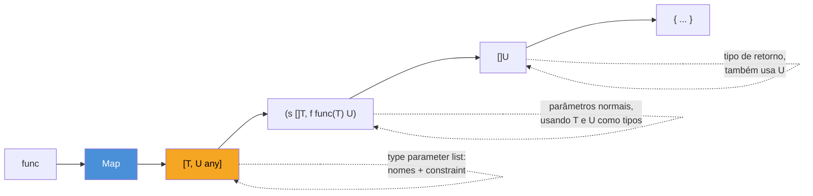
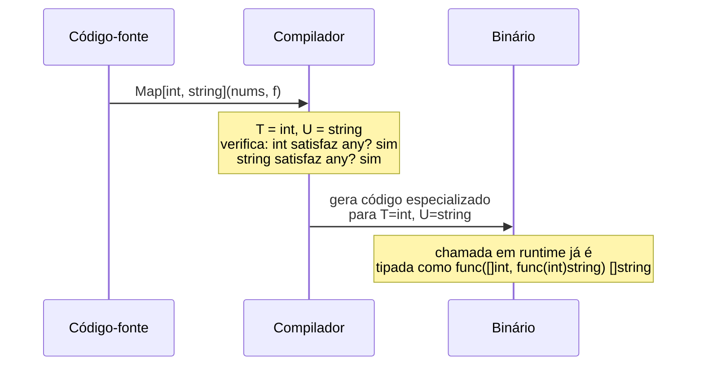

# Type parameters — a sintaxe

> [!abstract] TL;DR
> Uma função genérica em Go ganha uma **lista de type parameters** entre colchetes, logo após o nome: `func Map[T, U any](s []T, f func(T) U) []U`. Cada type parameter (`T`, `U`) tem um nome e uma **constraint** — aqui, `any`, o apelido de `interface{}` que aceita literalmente qualquer tipo. Dentro do corpo da função, `T` e `U` se comportam como tipos concretos comuns: você declara variáveis, faz slices, passa como argumento. Ao chamar `Map[int, string](nums, converter)`, o compilador **instancia** a função — gera, conceitualmente, uma versão especializada para aqueles tipos exatos, tipada e verificada em tempo de compilação, sem `interface{}` nem type assertion escondidos por trás.

## O problema que a sintaxe resolve, num exemplo concreto

A nota anterior mostrou por que, antes do Go 1.18, transformar um `[]int` em `[]string` — ou qualquer `[]T` em `[]U` — exigia ou copiar a função para cada par de tipos, ou recuar para `interface{}` e perder a checagem de tipos em tempo de compilação. `Map` é o exemplo canônico desse problema: a operação "aplique uma função a cada elemento e colete os resultados" é **idêntica** para `[]int → []string`, `[]Pedido → []float64`, `[]string → []bool` — só os tipos mudam.

```go
func MapInts(s []int, f func(int) string) []string {
    r := make([]string, len(s))
    for i, v := range s {
        r[i] = f(v)
    }
    return r
}

func MapPedidos(s []Pedido, f func(Pedido) float64) []float64 {
    r := make([]float64, len(s))
    for i, v := range s {
        r[i] = f(v)
    }
    return r
}
```

Duas funções, corpo idêntico letra por letra, só a assinatura muda. É exatamente o tipo de duplicação que generics existe para eliminar — e a pergunta desta nota é: qual é a sintaxe exata que permite escrever isso **uma vez só**?

## Anatomia da lista de type parameters

```go
func Map[T, U any](s []T, f func(T) U) []U {
    r := make([]U, len(s))
    for i, v := range s {
        r[i] = f(v)
    }
    return r
}
```



Comparado a uma declaração de função comum, existe exatamente uma peça nova: o colchete `[T, U any]` entre o nome da função e a lista de parâmetros normais. Vale nomear cada parte com precisão — é a terminologia que a [especificação da linguagem](https://go.dev/ref/spec#Type_parameter_declarations) usa e que reaparece nas próximas notas do galho:

- **Type parameter list** — `[T, U any]`: a lista inteira entre colchetes, sempre logo após o nome da função (ou do tipo, para generics de tipo — assunto da nota 04).
- **Type parameter** — `T`, `U`: um nome que você escolhe, com a mesma liberdade de nomear uma variável. Por convenção — não regra do compilador — nomes de type parameter costumam ser curtos e maiúsculos: `T` para "type" genérico, `K`/`V` para chaves e valores de mapas, `E` para elemento. `T, U any` declara dois type parameters de uma vez, ambos com a mesma constraint — igual à sintaxe `func f(x, y int)` para dois parâmetros normais do mesmo tipo.
- **Constraint** — `any`: o que vem depois do(s) nome(s) na lista, definindo quais tipos concretos podem ocupar aquele type parameter numa chamada real. `any` é a constraint mais permissiva possível — um alias de `interface{}` introduzido junto com generics no Go 1.18, aceitando qualquer tipo. A próxima nota (03) mergulha em constraints mais restritivas; por ora, `any` basta para deixar a sintaxe clara sem a complexidade extra.

> [!info] Sintaxe nova no Go 1.18
> Generics — a lista `[T any]`, a palavra `any` como alias de `interface{}`, e a instanciação explícita `Map[int, string](...)` — chegaram todas juntas no [Go 1.18](https://go.dev/blog/intro-generics), lançado em março de 2022. Qualquer código anterior a essa versão simplesmente não tem essa sintaxe disponível; `go.mod` do projeto precisa declarar `go 1.18` ou superior.

Dentro do corpo de `Map`, `T` e `U` se comportam como qualquer tipo concreto declarado: `make([]U, len(s))` cria um slice de `U`, `s []T` é indexável e percorrível com `range` como qualquer slice, `f func(T) U` é uma função comum recebendo `T` e devolvendo `U`. Não há sintaxe especial dentro do corpo — a mágica inteira está concentrada na lista de type parameters, no topo da declaração.

## Instanciando: de genérico a concreto

`Map` sozinha não roda nada — é um molde. Para usá-la, você **instancia**: fornece tipos concretos para cada type parameter, e o compilador gera (conceitualmente) uma versão especializada da função para aquele par de tipos.

```go
package main

import "fmt"

func Map[T, U any](s []T, f func(T) U) []U {
    r := make([]U, len(s))
    for i, v := range s {
        r[i] = f(v)
    }
    return r
}

func main() {
    nums := []int{1, 2, 3, 4}

    // instanciação explícita: os tipos entre colchetes
    dobrados := Map[int, int](nums, func(n int) int { return n * 2 })
    fmt.Println(dobrados) // [2 4 6 8]

    // T e U não precisam ser o mesmo tipo
    textos := Map[int, string](nums, func(n int) string {
        return fmt.Sprintf("#%d", n)
    })
    fmt.Println(textos) // [#1 #2 #3 #4]
}
```

`Map[int, int](nums, ...)` e `Map[int, string](nums, ...)` são duas instanciações **distintas** da mesma função genérica — o compilador as trata como se fossem duas funções concretas separadas, cada uma checada e (na prática) compilada para seus tipos específicos. Não existe, em tempo de execução, um `Map` único operando sobre valores "genéricos" com type assertion escondida; a checagem de tipo acontece inteira em tempo de compilação, contra a constraint declarada.



> [!question]- Preciso escrever `Map[int, string](...)` toda vez, com os colchetes?
> Nem sempre — na maioria dos casos, não. O compilador consegue **inferir** `T` e `U` a partir dos argumentos passados (`nums` já é `[]int`, então `T` só pode ser `int`), dispensando a instanciação explícita: `Map(nums, func(n int) string {...})` funciona sem colchetes, na prática. Esta nota usa a forma explícita de propósito, para deixar a sintaxe da instanciação visível sem esconder nada atrás de inferência — a mecânica completa de type inference, incluindo os casos em que ela falha e você precisa voltar aos colchetes, é o assunto da nota 05.

## Type parameters não são só para slices

O exemplo com `[]T` é o mais comum, mas a lista `[T any]` funciona em qualquer assinatura de função — o type parameter é só mais um tipo disponível para usar em parâmetros, retorno, e variáveis locais:

```go
func Primeiro[T any](s []T) (T, bool) {
    var zero T
    if len(s) == 0 {
        return zero, false
    }
    return s[0], true
}

func Par[K, V any](k K, v V) struct {
    Chave K
    Valor V
} {
    return struct {
        Chave K
        Valor V
    }{Chave: k, Valor: v}
}
```

`var zero T` merece atenção: é a **zero value** do tipo que `T` acabar sendo em cada instanciação — `0` se `T` for `int`, `""` se `T` for `string`, `nil` se `T` for um ponteiro ou slice. Go permite declarar uma variável de um type parameter exatamente como declararia de qualquer tipo concreto, porque, para o compilador, dentro do corpo da função genérica, `T` **é** um tipo — só que um tipo que ainda será decidido na instanciação.

## Casos práticos

**1. Um segundo type parameter usado só como retorno**, para deixar claro que nada obriga `T` e `U` a aparecerem nos dois lados — `Reduzir` usa `T` no slice de entrada e `U` só no acumulador e no retorno:

```go
func Reduzir[T, U any](s []T, inicial U, f func(U, T) U) U {
    acc := inicial
    for _, v := range s {
        acc = f(acc, v)
    }
    return acc
}

func main() {
    nums := []int{1, 2, 3, 4}

    soma := Reduzir(nums, 0, func(acc, n int) int { return acc + n })
    fmt.Println(soma) // 10

    concatenado := Reduzir(nums, "", func(acc string, n int) string {
        return acc + fmt.Sprintf("%d,", n)
    })
    fmt.Println(concatenado) // "1,2,3,4,"
}
```

Repare que `T` e `U` aqui são tipos completamente diferentes na segunda chamada — `T = int`, `U = string` — e o compilador aceita porque nenhuma constraint exige que sejam iguais. `[T, U any]` só declara *quantos* tipos existem e *quão permissivos* eles são; a relação entre eles (se existe alguma) é decidida pela própria assinatura da função, não pela lista de type parameters.

**2. Um único type parameter reaparecendo em parâmetro e retorno**, o padrão mais comum de todos — um `Filtrar` que preserva o tipo do slice:

```go
func Filtrar[T any](s []T, teste func(T) bool) []T {
    var r []T
    for _, v := range s {
        if teste(v) {
            r = append(r, v)
        }
    }
    return r
}

func main() {
    nums := []int{1, 2, 3, 4, 5, 6}

    pares := Filtrar(nums, func(n int) bool { return n%2 == 0 })
    fmt.Println(pares) // [2 4 6]
}
```

Aqui só existe um type parameter — `T` — porque entrada e saída têm o mesmo tipo de elemento; `Filtrar` nunca *transforma* o tipo, só seleciona um subconjunto. É o sinal sintático de quando um segundo type parameter é necessário (como em `Map`, que muda `T` para `U`) versus quando um só basta (como aqui): pergunte se a operação muda o tipo do elemento ou só filtra/reordena os mesmos valores.

## Armadilhas comuns

> [!warning] `T` sem constraint nenhuma não compila
> `func Map[T](s []T) []T {...}` — sem `any` ou outra constraint depois de `T` — é erro de sintaxe: `missing constraint`. Todo type parameter **precisa** de uma constraint explícita; `any` é a mais permissiva, mas alguma constraint sempre tem que aparecer. Não existe "type parameter livre" em Go, ao contrário do `<T>` do Java ou do `TypeVar` "solto" do Python (que aceitam qualquer tipo por padrão, sem anotação extra).

> [!warning] Confundir a lista de type parameters com a lista de parâmetros normais
> `func Map[T, U any](s []T, f func(T) U) []U` tem **duas** listas entre parênteses/colchetes, com papéis diferentes: `[T, U any]` declara os *tipos* que a função vai usar; `(s []T, f func(T) U)` declara os *valores* que a função recebe, usando os tipos já declarados. Inverter a ordem (`func Map(s []T, f func(T) U)[T, U any]`) não compila — a lista de type parameters sempre vem primeiro, imediatamente após o nome da função.

> [!warning] `T` dentro do corpo não é `interface{}` disfarçado
> Ao contrário de uma função escrita com `interface{}` — onde qualquer operação além de atribuição exige type assertion ou reflection —, dentro de `func Map[T any](...)`, `T` continua sendo um tipo concreto do ponto de vista do compilador, só que desconhecido até a instanciação. Isso significa que **você não pode fazer com `T` mais do que `any` permite**: `t + t` não compila para um `T any` genérico, porque nem todo tipo suporta `+` (um `struct{}` não suporta). Restringir o que dá para fazer com `T` — permitir `+`, comparação, ou outras operações — é exatamente o papel de constraints mais específicas do que `any`, assunto da próxima nota.

## Vindo de outra linguagem

| Vindo de | Sintaxe equivalente | Diferença que importa |
|---|---|---|
| Java | `static <T, U> List<U> map(List<T> s, Function<T, U> f)` | Java coloca a lista de type parameters *antes* do tipo de retorno, não depois do nome; e usa erasure — em runtime, `T` vira `Object`. Go mantém `T` real até a instanciação, gerando código especializado. |
| Python | `def map_(s: list[T], f: Callable[[T], U]) -> list[U]:` com `T = TypeVar("T")` | Python não checa nada disso em runtime nem, na prática, sem uma ferramenta externa (mypy/pyright) — as anotações são só metadados; Go recusa a compilação se os tipos não baterem. |
| TypeScript | `function map<T, U>(s: T[], f: (t: T) => U): U[]` | Sintaticamente é a mais próxima de Go — `<T, U>` em vez de `[T, U any]` — mas TypeScript também apaga os tipos em runtime (compila para JS puro); Go preserva a instanciação até o binário final. |

A lente cross-stack mais útil aqui não é a sintaxe em si — é lembrar que, diferente de Java e TypeScript, Go **não apaga** o tipo em runtime: cada instanciação gera código próprio, o que tem implicações de performance (sem boxing de tipos primitivos) e de binário (mais código gerado por instanciação usada) que a nota 07 retoma.

## Como explicar em inglês

> A generic function in Go gets a **type parameter list** in square brackets, right after the function name: `func Map[T, U any](s []T, f func(T) U) []U`. Each type parameter — `T`, `U` — needs an explicit **constraint**; `any` (an alias for `interface{}` introduced alongside generics in Go 1.18) is the most permissive one, accepting literally any type. Inside the function body, `T` and `U` behave like ordinary concrete types — you can declare variables of type `T`, build slices of `T`, pass them as arguments — the compiler just doesn't know which concrete type they'll be until the function is **instantiated**, either explicitly (`Map[int, string](...)`) or, more commonly, through type inference from the arguments. Unlike Java or TypeScript, Go doesn't erase type parameters at runtime — each instantiation compiles to specialized, fully typed code.

| Termo PT | Termo EN |
|---|---|
| type parameter | type parameter |
| lista de type parameters | type parameter list |
| constraint | constraint |
| instanciar / instanciação | instantiate / instantiation |
| valor zero | zero value |
| inferência de tipo | type inference |
| função genérica | generic function |

## O que vem a seguir

`any` resolve o problema de duplicação, mas é permissivo demais para boa parte dos casos reais — uma função `Soma[T any](a, b T) T { return a + b }` não compila, porque `any` não garante que `T` suporte `+`. A [[03 - Constraints|nota 03]] entra no mecanismo que resolve isso: constraints mais específicas, escritas como interfaces com listas de tipos permitidos, que dizem ao compilador exatamente quais operações `T` pode suportar dentro do corpo da função.

## Veja também

- [[01 - Por que generics — o problema antes de 1.18|01 — Por que generics — o problema antes de 1.18]] — o problema de duplicação que esta sintaxe resolve
- [[03 - Constraints|03 — Constraints]] — próxima nota: restringindo `T` além de `any`
- [[04 - Tipos genéricos|04 — Tipos genéricos]] — a mesma sintaxe `[T any]` aplicada a `type`, não só a `func`
- [[05 - Type inference|05 — Type inference]] — quando dá pra omitir `Map[int, string]` e escrever só `Map(...)`
- [[03-Dominios/Tecnologia/Go/index|Trilha Go]]

## Fontes

- The Go Authors. *The Go Programming Language Specification — Type parameter declarations*. go.dev. https://go.dev/ref/spec#Type_parameter_declarations (acessado em 2026-07-18)
- The Go Authors. *An Introduction To Generics*. go.dev/blog. https://go.dev/blog/intro-generics (acessado em 2026-07-18)
- The Go Authors. *A Tour of Go — Generics*. go.dev. https://go.dev/tour/generics/1 (acessado em 2026-07-18)
- The Go Authors. *Tutorial: Getting started with generics*. go.dev. https://go.dev/doc/tutorial/generics (acessado em 2026-07-18)
- Go by Example. *Generics*. gobyexample.com. https://gobyexample.com/generics (acessado em 2026-07-18)
