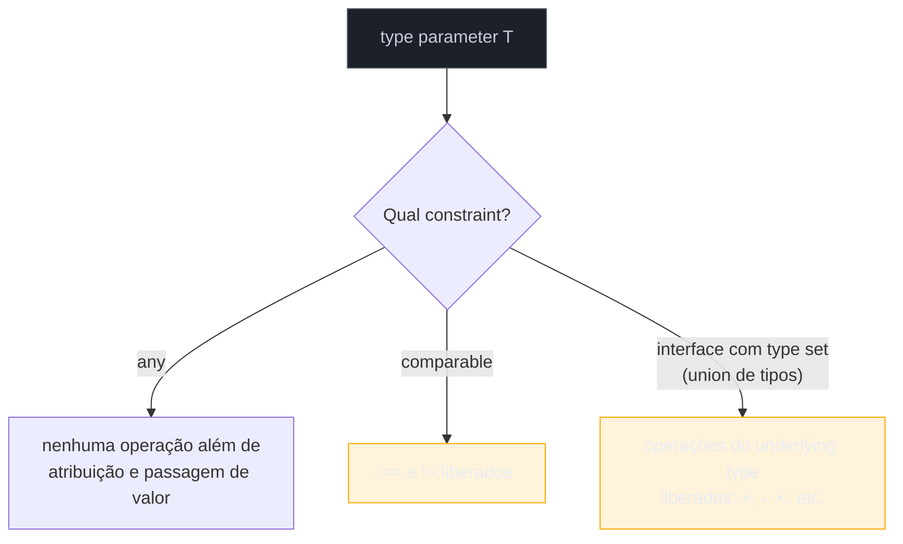
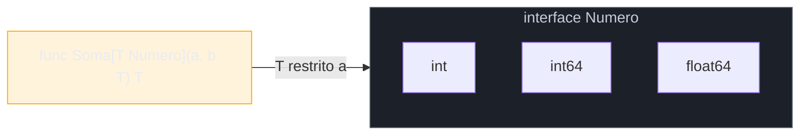
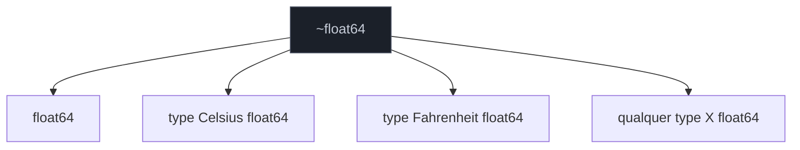

# Constraints

> [!abstract] TL;DR
> Um **constraint** é a interface que restringe quais tipos concretos podem preencher um type parameter — a nota anterior usou `any` sem explicar de onde ele vem, e este capítulo fecha essa lacuna. `any` é só um alias para `interface{}` — qualquer tipo serve, mas por consequência nenhuma operação além de atribuição e comparação de identidade fica liberada. `comparable` é a constraint embutida que garante `==`/`!=`. Para liberar aritmética (`+`, `-`, `<`) você precisa de uma **interface de type set**: uma lista de tipos permitidos, unidos por `|`, como `interface { ~int | ~int64 | ~float64 }`. O `~` inclui não só o tipo listado, mas qualquer tipo *definido* com aquele underlying type — sem ele, um `type Celsius float64` seu fica de fora da constraint mesmo satisfazendo a aritmética na prática. O pacote `golang.org/x/exp/constraints` empacota essas uniões prontas (`constraints.Ordered`, `constraints.Integer`) para você não reescrever a lista toda vez.

## O problema que `any` não resolve

A nota anterior escreveu isto sem comentar:

```go
func Primeiro[T any](s []T) T {
    return s[0]
}
```

`Primeiro` funciona para qualquer slice — `[]int`, `[]string`, `[]Pedido` — porque `any` não exige nada do tipo além de existir. Mas troque a função por uma que soma dois valores:

```go
func Soma[T any](a, b T) T {
    return a + b // não compila
}
```

O compilador recusa com `invalid operation: operator + not defined on a (variable of type T)`. Faz sentido: `T` pode ser instanciado com `T = struct{}{}`, ou `T = chan int`, ou qualquer tipo sem `+` definido. `any` diz "aceito qualquer coisa", e "qualquer coisa" inclui tipos onde `+` simplesmente não existe. O compilador não pode liberar uma operação que só é válida para *alguns* dos tipos que `any` permite — ele checa a função genérica **uma vez**, contra o pior caso possível de `T`, não contra cada instanciação separadamente.

É aqui que a pergunta muda de "que tipo é `T`?" para "o que eu *preciso poder fazer* com `T`?". Constraint é a resposta formalizada: em vez de aceitar qualquer tipo, você declara exatamente o subconjunto de tipos que sustenta as operações que o corpo da função usa.



## `comparable`: a constraint para `==`

Go tem uma constraint embutida, pronta desde 1.18, para o caso mais comum depois de "qualquer tipo": comparar por igualdade.

```go
func Existe[T comparable](s []T, alvo T) bool {
    for _, v := range s {
        if v == alvo {
            return true
        }
    }
    return false
}

fmt.Println(Existe([]int{1, 2, 3}, 2))          // true
fmt.Println(Existe([]string{"a", "b"}, "c"))    // false
```

`comparable` não é uma interface com métodos — é uma constraint especial reconhecida pelo compilador, satisfeita por qualquer tipo cujos valores suportam `==` e `!=` sem entrar em pânico em tempo de execução: tipos básicos (`int`, `string`, `bool`, ...), ponteiros, canais, arrays de tipos comparáveis, e structs cujos campos são todos comparáveis. Slices, maps e funções **não** satisfazem `comparable` — não têm `==` definido (comparar dois slices com `==` é erro de compilação em Go, generics ou não).

> [!info] `comparable` também é usado, sem generics, como constraint de chave de map
> Desde sempre em Go, a chave de um `map[K]V` precisa ser comparável — essa regra é anterior a generics. O que 1.18 trouxe foi dar **nome** a essa noção e expô-la como constraint reutilizável em funções genéricas, não uma capacidade nova do tipo.

`comparable` sozinho não libera `<`, `+`, nem qualquer aritmética — só `==`/`!=`. Para ordenação ou soma, é preciso ir além de uma palavra reservada e escrever a própria interface.

## Interfaces de type set: constraints com união de tipos

Antes de 1.18, uma interface em Go só listava **métodos**. Generics estenderam a sintaxe de interface para também listar **tipos** — o chamado *type set* — usando `|` para união:

```go
type Numero interface {
    int | int64 | float64
}

func Soma[T Numero](a, b T) T {
    return a + b
}

fmt.Println(Soma(3, 4))       // 7 (int)
fmt.Println(Soma(1.5, 2.5))   // 4.0 (float64)
```

`Numero` não declara nenhum método — declara um **conjunto de tipos permitidos**. `T Numero` significa "T precisa ser um desses três tipos, exatamente". O compilador, ao ver `a + b` dentro de `Soma`, verifica que `+` é válido para **todos** os tipos do type set de `Numero` — e é, porque `int`, `int64` e `float64` suportam `+` nativamente.



Repare que uma interface de type set ainda **pode** misturar métodos e tipos — `interface { int | string; String() string }` seria válida, exigindo tipo dentro do union **e** presença do método. Mas o caso comum, para restringir tipos numéricos ou ordenáveis, usa só o union de tipos, sem método algum.

## O operador `~`: incluindo tipos definidos

`Numero`, como escrito acima, tem um furo. Retome `Celsius`, da nota 02 de "Tipos, structs e métodos":

```go
type Celsius float64

func Media(temps []Celsius) Celsius {
    var soma Celsius
    for _, t := range temps {
        soma = Soma(soma, t) // não compila
    }
    return soma / Celsius(len(temps))
}
```

`Soma(soma, t)` falha com `Celsius does not satisfy Numero (possibly missing ~ for float64 in constraint Numero)`. A mensagem de erro já entrega a resposta. `Celsius` **tem** `float64` como underlying type — suporta `+` na prática, exatamente como qualquer `float64` — mas `Celsius` e `float64` são tipos **distintos** para o sistema de tipos (é a mesma regra da nota 02: tipos nomeados diferentes não são intercambiáveis mesmo com o mesmo underlying type). O type set `int | int64 | float64` lista literalmente esses três tipos — `Celsius` não é nenhum deles, então fica fora.

A solução é o operador `~` (til), colocado antes de cada tipo do union:

```go
type Numero interface {
    ~int | ~int64 | ~float64
}
```

`~float64` significa "`float64`, **ou qualquer tipo cujo underlying type seja `float64`**". Com esse ajuste, `Celsius` — que é `type Celsius float64` — passa a satisfazer `Numero`, e `Soma(soma, t)` compila.



> [!warning] `~` só funciona se o tipo aprovar ser underlying type de outro
> A [especificação da linguagem](https://go.dev/ref/spec#Interface_types) exige que `~T` só seja válido se `T` for ele mesmo um tipo cujo underlying type é `T` — ou seja, você não pode escrever `~[]int` esperando incluir `type Lista = []int` (um **alias**, não um tipo definido) porque alias não cria tipo novo, já é `[]int`. Onde `~` realmente importa é para tipos **definidos** (`type X Underlying`), como `Celsius`.

A regra prática que fica: **use `~` por padrão** em constraints numéricas ou de string, a menos que você tenha um motivo concreto para excluir tipos definidos com aquele underlying type. Sem `~`, qualquer código que renomeie um tipo básico (prática comum e idiomática em Go, como visto com `Celsius`) fica automaticamente incompatível com sua função genérica — surpresa desagradável para quem consome o pacote.

## `golang.org/x/exp/constraints`: as uniões já prontas

Escrever `interface { ~int | ~int8 | ~int16 | ~int32 | ~int64 | ~uint | ~uint8 | ~uint16 | ~uint32 | ~uint64 | ~uintptr | ~float32 | ~float64 }` toda vez que uma função precisa de "qualquer número ordenável" é tedioso e propenso a esquecer um tipo. O pacote `golang.org/x/exp/constraints`, mantido pelo próprio time Go como parte do módulo de experimentação `golang.org/x/exp`, empacota essas uniões comuns:

```go
import "golang.org/x/exp/constraints"

func Maior[T constraints.Ordered](a, b T) T {
    if a > b {
        return a
    }
    return b
}

fmt.Println(Maior(3, 7))        // 7
fmt.Println(Maior("abc", "ab")) // "abc"
```

As constraints mais usadas do pacote:

| Constraint | O que cobre |
|---|---|
| `constraints.Ordered` | todos os tipos numéricos + `string` (suportam `<`, `<=`, `>`, `>=`) |
| `constraints.Integer` | todos os tipos inteiros (com e sem sinal) |
| `constraints.Float` | `~float32 \| ~float64` |
| `constraints.Signed` | inteiros com sinal |
| `constraints.Unsigned` | inteiros sem sinal |
| `constraints.Complex` | `~complex64 \| ~complex128` |

> [!info] `x/exp` é experimental — e parte dele já migrou para a stdlib
> O pacote vive fora da biblioteca padrão, no módulo `golang.org/x/exp`, sem garantia de compatibilidade entre versões (é o espaço onde o time Go testa ideias antes de promovê-las). Boa parte do que `x/exp/slices` e `x/exp/maps` ofereciam já migrou para os pacotes `slices` e `maps` da stdlib no Go 1.21 (assunto do Galho 5) — mas `constraints.Ordered` **não** migrou; não existe um `cmp.Ordered` na stdlib até este ponto do texto além do que o pacote `cmp` (1.21+) já reaproveita internamente. Na prática, para constraints numéricas genéricas, `x/exp/constraints` continua sendo a fonte usada pela comunidade — e é comum encontrar pacotes que preferem declarar sua própria constraint local, idêntica, só para não depender de um módulo experimental em produção.

Vale notar: `constraints.Ordered` é definido lá dentro exatamente como `Numero` foi definido aqui — uma interface de type set com `~`. Não há mágica nova, só um union maior e já testado.

## Casos práticos

**1. Função `Min` genérica usando `constraints.Ordered`:**

```go
package main

import (
    "fmt"

    "golang.org/x/exp/constraints"
)

func Min[T constraints.Ordered](valores ...T) T {
    menor := valores[0]
    for _, v := range valores[1:] {
        if v < menor {
            menor = v
        }
    }
    return menor
}

func main() {
    fmt.Println(Min(5, 2, 8, 1))          // 1
    fmt.Println(Min("banana", "abacate")) // "abacate"
}
```

**2. Constraint local com `~`, cobrindo tipos definidos como `Celsius`:**

```go
type Celsius float64
type Fahrenheit float64

type Temperatura interface {
    ~float64
}

func Media[T Temperatura](valores []T) T {
    var soma T
    for _, v := range valores {
        soma += v
    }
    return soma / T(len(valores))
}

func main() {
    temps := []Celsius{20.0, 22.5, 19.0}
    fmt.Println(Media(temps)) // 20.5
}
```

**3. Constraint que combina union de tipos e método**, o caso menos comum mas válido:

```go
type Numerico interface {
    ~int | ~float64
}

type ComString interface {
    String() string
}

type NumericoFormatavel interface {
    Numerico
    ComString
}
```

`NumericoFormatavel` exige as duas coisas ao mesmo tempo: `T` precisa ter underlying type `int` ou `float64`, **e** precisar ter um método `String() string` no method set. Interfaces de constraint podem embedar outras interfaces de constraint — o mesmo mecanismo de embedding de interfaces que já existia antes de generics, agora também usado para compor type sets.

## Armadilhas comuns

> [!warning] Esquecer o `~` é o erro mais comum de quem escreve a primeira constraint numérica
> A mensagem de erro (`possibly missing ~ for float64 in constraint`) é boa o bastante para apontar o problema direto, mas só aparece **depois** que você já escreveu a função e tentou usá-la com um tipo definido. O hábito que evita a surpresa: ao escrever qualquer constraint numérica pensando em reuso, comece com `~` por padrão, e remova só se houver razão explícita para restringir aos tipos exatos listados.

> [!warning] `comparable` não é a mesma coisa que "tem método `Equals`"
> Quem vem de Java associa igualdade a `.equals()`; em Go, `comparable` é sobre o operador `==` embutido, não sobre convenção de método. Um tipo pode ter um método `Equals(outro T) bool` customizado e mesmo assim não satisfazer `comparable`, se sua struct tiver um campo slice ou map (que não suportam `==`). `comparable` é puramente estrutural — olha os campos do tipo, não os métodos que ele declara.

> [!warning] `any` como constraint não é "sem restrição nenhuma" — é a restrição mais fraca possível
> É tentador achar que `any` é "modo livre" e qualquer constraint mais específica é uma limitação chata. Na prática é o oposto: `any` **impede** qualquer operação que dependa da estrutura do tipo (`+`, `<`, `==` em alguns casos). Constraints mais específicas *liberam* operações — não restringem o que você pode fazer, restringem quais tipos concretos podem entrar, para poder liberar mais operações dentro da função.

## Lente cross-stack

| Vindo de... | Em Go, é assim |
|---|---|
| Java `<T extends Comparable<T>>` | `[T constraints.Ordered]` — bound por type set em vez de bound por interface com método |
| TypeScript `<T extends { id: number }>` (structural) | Interface de constraint com métodos, não com type set — mais parecido de fato |
| Python `Protocol` + `TypeVar(bound=...)` | Interface de constraint (com métodos) é o equivalente direto; type set (`~int \| ~float64`) não tem análogo direto no `typing` do Python |
| C++ *concepts* (`requires`) | Comparável em espírito — ambos checam, em tempo de compilação, que o tipo satisfaz um conjunto de operações antes de instanciar o template/generic |

A comparação mais precisa, para quem já usou generics em Java ou C#: bound por **interface de método** (`Comparable<T>`, `IComparable<T>`) tem equivalente direto em Go — uma interface de constraint com métodos. Bound por **type set** (união literal de tipos concretos, com `~`) não tem equivalente direto em nenhuma dessas linguagens — é a peça original de Go, motivada por operadores aritméticos (`+`, `<`) que Go não trata como métodos de interface, ao contrário de `Comparable.compareTo()`.

## Como explicar em inglês

> A **constraint** in Go is the interface that restricts which concrete types can fill a type parameter. `any` places no restriction, which means no operation beyond assignment is allowed. `comparable` is the built-in constraint for `==`/`!=`. To unlock arithmetic like `+` or `<`, you write a **type set interface** — a union of allowed types joined with `|`, such as `interface { ~int | ~float64 }`. The `~` prefix is the detail that trips people up: `~float64` means "`float64`, or any type whose underlying type is `float64`" — without it, a defined type like `type Celsius float64` is excluded even though it supports the same arithmetic at runtime. The package `golang.org/x/exp/constraints` ships common unions like `Ordered` and `Integer` pre-built, so you don't hand-write the full list of numeric types every time.

| Termo PT | Termo EN |
|---|---|
| restrição / constraint | constraint |
| conjunto de tipos | type set |
| tipo comparável | comparable type |
| operador til | tilde operator (`~`) |
| tipo definido | defined type |
| tipo subjacente | underlying type |
| união de tipos | type union |
| interface de restrição | constraint interface |

## O que vem a seguir

Constraints restringem *que tipo* pode preencher um type parameter — mas até aqui todo exemplo usou generics em **funções**. A [[04 - Tipos genéricos|próxima nota]] estende o mesmo mecanismo a **tipos**: structs e outras declarações de tipo que carregam seu próprio type parameter, como `type Stack[T any] struct {...}` — a peça que faltava para escrever estruturas de dados genéricas reutilizáveis, não só funções.

## Veja também

- [[02 - Type parameters — a sintaxe|02 — Type parameters — a sintaxe]] — introduziu `any` sem explicar a mecânica de constraint, fechada aqui
- [[04 - Tipos genéricos|04 — Tipos genéricos]] — próxima nota do galho
- [[05 - Type inference|05 — Type inference]] — como o compilador infere `T` sem anotação explícita, incluindo o papel da constraint nesse processo
- [[03-Dominios/Tecnologia/Go/02 - Tipos, structs e métodos/02 - Tipos nomeados e definições de tipo|Galho 2, nota 02]] — `type Celsius float64` e underlying type, pré-requisito direto para entender `~`
- [[03-Dominios/Tecnologia/Go/index|Trilha Go]]

## Fontes

- The Go Authors. *The Go Programming Language Specification — Interface types*. go.dev. https://go.dev/ref/spec#Interface_types (acessado em 2026-07-18)
- The Go Authors. *A Tutorial on Generics*. go.dev/doc. https://go.dev/doc/tutorial/generics (acessado em 2026-07-18)
- The Go Authors. *Type Parameters Proposal — Constraints*. go.dev. https://go.dev/blog/intro-generics (acessado em 2026-07-18)
- pkg.go.dev. *Package constraints — golang.org/x/exp/constraints*. https://pkg.go.dev/golang.org/x/exp/constraints (acessado em 2026-07-18)
- Go by Example. *Generics*. gobyexample.com. https://gobyexample.com/generics (acessado em 2026-07-18)
