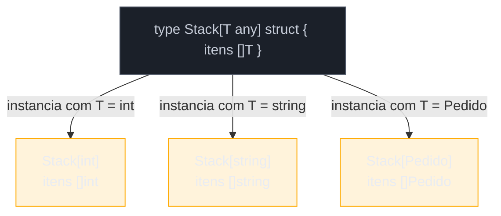
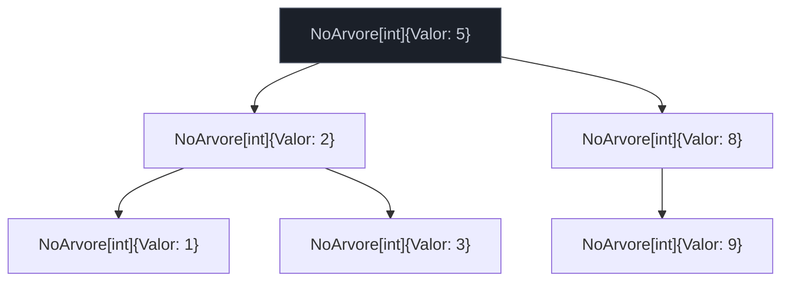

# Tipos genéricos

> [!abstract] TL;DR
> Um **tipo genérico** é um `type` declarado com parâmetros de tipo entre colchetes — `type Stack[T any] struct { itens []T }` — igual a uma função genérica, mas para dados em vez de comportamento. Uma vez declarado, `T` fica disponível dentro do corpo do struct inteiro, e qualquer método desse tipo repete a lista de parâmetros no receiver (`func (s *Stack[T]) Push(v T)`), sem poder introduzir parâmetro de tipo **próprio** — só o método `main`... perdão, só a função de pacote tem esse privilégio. Para *usar* o tipo, você instancia com um tipo concreto (`Stack[int]`, `Stack[string]`) — cada instanciação é um tipo distinto em tempo de compilação, não uma classe genérica em tempo de execução como em Java. Esta nota constrói três estruturas de dados reais — `Stack[T]`, `Set[T]` e uma árvore binária — para fixar o padrão.

## O problema que ainda sobrava depois da nota 02

A nota anterior mostrou como escrever uma função genérica: `func Max[T constraints.Ordered](a, b T) T`. Isso resolve comportamento genérico — uma função que opera sobre qualquer tipo compatível. Mas e uma **pilha**? Uma pilha não é uma operação isolada — é uma estrutura de dados com estado: uma lista interna que cresce e encolhe, e um conjunto de métodos (`Push`, `Pop`, `Peek`) que operam sobre esse estado.

Antes de 1.18, a única forma honesta de fazer uma pilha reutilizável em Go era ou (a) escrever uma `StackInt`, uma `StackString`, uma `StackPedido` — uma por tipo, código duplicado — ou (b) usar `interface{}` e perder a checagem de tipo em tempo de compilação, como a nota 01 já mostrou com o container de `any`. Nenhuma das duas é satisfatória para uma estrutura de dados que, por natureza, é indiferente ao tipo que guarda: o mecanismo de empilhar e desempilhar é sempre o mesmo, seja `int`, `string` ou `Pedido`.

Generics em tipos resolve exatamente essa lacuna: parametrizar a **declaração do tipo**, não só a função isolada.

## A sintaxe: parâmetro de tipo no `type`

A extensão é direta — a mesma lista `[T constraints]` que apareceu em `func Max[T ...]` aparece agora logo depois do nome do tipo:

```go
type Stack[T any] struct {
    itens []T
}
```

`Stack` sozinho não é mais um tipo utilizável — é um **tipo genérico** (às vezes chamado de *generic type* ou, informalmente, de "template" de tipo, embora a comunidade Go evite esse termo por sua bagagem em C++). Para obter um tipo de verdade, você **instancia** com um argumento de tipo concreto:

```go
var pilhaDeInteiros Stack[int]
var pilhaDeNomes Stack[string]
```

`Stack[int]` e `Stack[string]` são dois tipos **completamente distintos** para o compilador — tão distintos quanto `Point` e `Celsius` eram na nota 02 do galho 2. Não há herança, não há "a mesma classe com tipo variável" como em Java (onde `Stack<Integer>` e `Stack<String>` compartilham a mesma classe `.class` em *runtime*, por causa de *type erasure*). Em Go, o compilador **monomorfiza**: para cada instanciação usada no programa, ele gera (conceitualmente) um tipo concreto separado, com layout de memória próprio para aquele `T`. Isso já apareceu na nota 01 como parte da explicação de por que generics em Go são checados em tempo de compilação — aqui o mesmo mecanismo se aplica a `struct`, não só a função.



Dentro do corpo do struct, `T` se comporta como qualquer tipo nomeado normal — pode ser o tipo de um campo, de um slice de campos, de um mapa. A constraint (`any`, aqui, a mais permissiva possível — a nota 03 detalha as outras) só limita o que você pode **fazer** com valores de `T`; não limita onde `T` pode aparecer na declaração.

## Métodos em tipo genérico: repita a lista, não invente outra

Um tipo genérico sem métodos é só um struct decorado — a força real aparece quando ele ganha comportamento. A sintaxe do método muda de forma sutil, mas importante, em relação à nota 03 do galho 2:

```go
func (s *Stack[T]) Push(v T) {
    s.itens = append(s.itens, v)
}

func (s *Stack[T]) Pop() (T, bool) {
    var zero T
    if len(s.itens) == 0 {
        return zero, false
    }
    ultimo := s.itens[len(s.itens)-1]
    s.itens = s.itens[:len(s.itens)-1]
    return ultimo, true
}
```

Repare no receiver: `(s *Stack[T])`, não `(s *Stack)`. O tipo receiver de um método de tipo genérico **precisa** repetir a lista de parâmetros de tipo — sem constraint de novo (a constraint já foi fixada na declaração do `type`), só os nomes. É a forma de dizer ao compilador "este método pertence ao `Stack` genérico, parametrizado por `T`, e dentro do corpo `T` significa o mesmo `T` da declaração do struct".

> [!warning] Métodos não podem ter parâmetros de tipo próprios
> Esta é a limitação mais citada — e mais mal-entendida — sobre generics em Go: **um método não pode introduzir um novo parâmetro de tipo além dos que o tipo receiver já declara**. Isto não compila:
> ```go
> func (s *Stack[T]) Map[U any](f func(T) U) *Stack[U] {
>     // erro: methods cannot have type parameters
> }
> ```
> A [especificação da linguagem](https://go.dev/ref/spec#Method_declarations) é explícita: o receiver de um método pode ter parâmetros de tipo (para nomear os do tipo genérico), mas o método em si não pode declarar parâmetros de tipo **adicionais**. Se você precisa de uma operação `Map` que transforma `Stack[T]` em `Stack[U]` com `U` diferente de `T`, a saída é uma **função de pacote solta**, genérica em `T` e `U`, que recebe o `*Stack[T]` como argumento comum — não um método:
> ```go
> func MapStack[T, U any](s *Stack[T], f func(T) U) *Stack[U] {
>     novo := &Stack[U]{itens: make([]U, len(s.itens))}
>     for i, v := range s.itens {
>         novo.itens[i] = f(v)
>     }
>     return novo
> }
> ```
> Não é uma limitação de implementação corrigível em versão futura — é uma decisão deliberada de design, documentada na [proposta original de generics](https://go.dev/blog/why-generics), para manter o *method set* de um tipo previsível e finito: se métodos pudessem introduzir tipos próprios, o conjunto de "todos os métodos que `Stack[int]` tem" deixaria de ser uma lista fechada, e passaria a depender de quais instanciações de `Map` alguém decidiu chamar em algum lugar do programa.

## Casos práticos

**1. `Stack[T]` completa**, juntando declaração e métodos:

```go
package main

import "fmt"

type Stack[T any] struct {
    itens []T
}

func NovaStack[T any]() *Stack[T] {
    return &Stack[T]{itens: make([]T, 0)}
}

func (s *Stack[T]) Push(v T) {
    s.itens = append(s.itens, v)
}

func (s *Stack[T]) Pop() (T, bool) {
    var zero T
    if len(s.itens) == 0 {
        return zero, false
    }
    ultimo := s.itens[len(s.itens)-1]
    s.itens = s.itens[:len(s.itens)-1]
    return ultimo, true
}

func (s *Stack[T]) Len() int {
    return len(s.itens)
}

func main() {
    pilha := NovaStack[int]()
    pilha.Push(1)
    pilha.Push(2)
    pilha.Push(3)

    for pilha.Len() > 0 {
        v, _ := pilha.Pop()
        fmt.Println(v) // 3, 2, 1
    }
}
```

`NovaStack[T any]() *Stack[T]` é uma **função** genérica (construtor), separada do tipo — o mesmo padrão de construtor explícito que a nota 06 do galho 2 já defendia para structs comuns, agora com parâmetro de tipo a mais. `zero` em `Pop` usa o **zero value** do tipo `T` genérico — `var zero T` funciona porque toda constraint em Go (mesmo `any`) garante que `T` é instanciado com algum tipo concreto, e todo tipo concreto em Go tem zero value definido, do jeito que a nota 07 do galho 1 já explorou para tipos comuns.

**2. `Set[T]` usando mapa por baixo**, ilustrando uma constraint mais restrita que `any`:

```go
type Set[T comparable] struct {
    itens map[T]struct{}
}

func NovoSet[T comparable]() *Set[T] {
    return &Set[T]{itens: make(map[T]struct{})}
}

func (s *Set[T]) Add(v T) {
    s.itens[v] = struct{}{}
}

func (s *Set[T]) Contem(v T) bool {
    _, ok := s.itens[v]
    return ok
}

func (s *Set[T]) Remove(v T) {
    delete(s.itens, v)
}

func (s *Set[T]) Len() int {
    return len(s.itens)
}
```

`Set[T]` **precisa** da constraint `comparable`, não `any` — porque `T` vira chave de `map[T]struct{}`, e Go só permite tipos comparáveis como chave de mapa (a mesma regra que já vale para mapas não genéricos). Isso conecta direto com o assunto da nota 03: a constraint que você escolhe no `type` não é estética — ela precisa ser forte o bastante para sustentar as operações que o corpo do tipo genérico exige. Tentar `type Set[T any] struct { itens map[T]struct{} }` não compila: `invalid map key type T (missing comparable constraint)`.

```go
func main() {
    vistos := NovoSet[string]()
    vistos.Add("a")
    vistos.Add("b")
    vistos.Add("a") // duplicata, ignorada pelo mapa

    fmt.Println(vistos.Len())        // 2
    fmt.Println(vistos.Contem("b"))  // true
    fmt.Println(vistos.Contem("z"))  // false
}
```

**3. Mais de um parâmetro de tipo**, quando um único `T` não basta — um par chave-valor genérico:

```go
type Par[K comparable, V any] struct {
    Chave K
    Valor V
}

func NovoPar[K comparable, V any](k K, v V) Par[K, V] {
    return Par[K, V]{Chave: k, Valor: v}
}

func (p Par[K, V]) String() string {
    return fmt.Sprintf("%v: %v", p.Chave, p.Valor)
}
```

A lista `[K comparable, V any]` funciona exatamente como uma lista de parâmetros de função comum — cada parâmetro de tipo com sua própria constraint, separados por vírgula. `Par[string, int]{Chave: "idade", Valor: 30}` instancia os dois de uma vez; não há como instanciar só um e deixar o outro "genérico pela metade". Esse padrão de dois parâmetros aparece com frequência em qualquer estrutura no estilo mapa ordenado ou de resultado emparelhado — inclusive é a base conceitual de como o pacote `maps` da biblioteca padrão (nota 05 do galho 5) itera pares chave-valor de forma tipada.

**4. Árvore binária genérica**, o caso onde o tipo genérico referencia a si mesmo — struct recursivo com parâmetro de tipo:

```go
type NoArvore[T constraints.Ordered] struct {
    Valor       T
    Esquerda    *NoArvore[T]
    Direita     *NoArvore[T]
}

func (n *NoArvore[T]) Inserir(v T) *NoArvore[T] {
    if n == nil {
        return &NoArvore[T]{Valor: v}
    }
    if v < n.Valor {
        n.Esquerda = n.Esquerda.Inserir(v)
    } else if v > n.Valor {
        n.Direita = n.Direita.Inserir(v)
    }
    return n
}

func (n *NoArvore[T]) EmOrdem() []T {
    if n == nil {
        return nil
    }
    resultado := n.Esquerda.EmOrdem()
    resultado = append(resultado, n.Valor)
    resultado = append(resultado, n.Direita.EmOrdem()...)
    return resultado
}
```

> [!info] `constraints.Ordered` veio do pacote experimental `golang.org/x/exp/constraints`; desde Go 1.21, prefira `cmp.Ordered` da biblioteca padrão (`cmp` — pacote novo de 1.21, junto com `slices`/`maps` mencionados na nota 05 do galho 5).

```go
func main() {
    var raiz *NoArvore[int]
    for _, v := range []int{5, 2, 8, 1, 9, 3} {
        raiz = raiz.Inserir(v)
    }
    fmt.Println(raiz.EmOrdem()) // [1 2 3 5 8 9]
}
```

`*NoArvore[T]` aparecendo **dentro** da própria declaração de `NoArvore[T]` (nos campos `Esquerda` e `Direita`) é permitido sem cerimônia especial — o mesmo jeito que um struct recursivo comum (`type No struct { Prox *No }`) já funcionava antes de generics existirem. `Inserir` chamado num `nil` receiver também não é acidente: métodos com pointer receiver em Go toleram `nil`, desde que o corpo do método trate esse caso — aqui, `if n == nil` cobre exatamente o caso-base da recursão, sem precisar de um `NoArvore` sentinela vazio.



## Armadilhas comuns

> [!warning] Esquecer de repetir `[T]` no receiver
> `func (s *Stack) Push(v T) {...}` (sem `[T]` no receiver) não compila: `undefined: T`. O compilador não "herda" o parâmetro de tipo automaticamente — cada método precisa declará-lo de novo no receiver, mesmo que o nome seja idêntico ao da declaração do `type`.

> [!warning] Nome do parâmetro no método não precisa bater com o do `type`, mas mudar é confuso
> `type Stack[T any] struct {...}` seguido de `func (s *Stack[Elem]) Push(v Elem)` **compila** — o compilador vincula pela posição, não pelo nome do identificador. Mas usar `Elem` num método e `T` em outro do mesmo tipo é puro ruído para quem lê o código depois. Convenção: escolha um nome de parâmetro de tipo por tipo genérico (`T`, ou algo descritivo como `V` para "valor" num `Set`) e repita-o de forma consistente em todos os métodos.

> [!warning] `Stack[int]{}` funciona, mas `new(Stack)[int]` não existe
> Instanciação de tipo genérico se faz no **nome do tipo**, não depois de já ter um valor: `Stack[int]{itens: nil}` é válido; tentar aplicar `[int]` depois de `new(Stack)` ou de qualquer expressão de valor não é sintaxe válida em Go. O argumento de tipo é parte da identidade do tipo, resolvido em tempo de compilação — não um parâmetro passável em tempo de execução.

## Vindo de outra linguagem

| Conceito | Java | Python (typing) | Go |
|---|---|---|---|
| Declaração | `class Stack<T> { ... métodos dentro ... }` | `class Stack(Generic[T]): ...` | `type Stack[T any] struct {...}` + métodos **fora**, com receiver repetindo `[T]` |
| Representação em runtime | *type erasure* — `Stack<Integer>` e `Stack<String>` são a mesma `.class` | tipos são só *hints*, apagados em runtime (CPython não monomorfiza) | monomorfização — `Stack[int]` e `Stack[string]` são tipos concretos distintos gerados pelo compilador |
| Método com tipo próprio (`<U> Stack<U> map(...)`) | permitido — método genérico dentro de classe genérica | permitido, tipagem é convenção, não imposta | **proibido** — vira função de pacote solta, genérica em `T` e `U` |
| Wildcard / variância (`Stack<? extends Number>`) | existe (`? extends`, `? super`) | `TypeVar` com `bound=`, sem wildcard dedicado | não existe — Go não tem variância de generics; cada instanciação é um tipo próprio, sem relação de subtipo entre `Stack[int]` e `Stack[Number-like]` |

A linha mais importante da tabela é a segunda: quem vem de Java tende a assumir que "genérico" implica "apagado em runtime, tudo `Object` por baixo" — e aí se surpreende ao descobrir que, em Go, `reflect.TypeOf(pilha).String()` de fato retorna algo como `main.Stack[int]`, um tipo concreto e nomeado, não uma caixa cega.

## Como explicar em inglês

> A generic type in Go is a `type` declaration carrying its own type parameter list — `type Stack[T any] struct { items []T }` — parameterizing data the same way a generic function parameterizes behavior. Once declared, `T` is available throughout the struct body, and any method on that type must repeat the type parameter list on its receiver: `func (s *Stack[T]) Push(v T)`. The one hard limitation, baked into the language spec, is that a **method cannot introduce type parameters of its own** beyond what the receiver already declares — if you need an operation like `Map` that turns a `Stack[T]` into a `Stack[U]`, it has to be a free function, not a method. Unlike Java, where generics are erased at runtime and `Stack<Integer>`/`Stack<String>` share one class file, Go monomorphizes: each instantiation — `Stack[int]`, `Stack[string]` — is a genuinely distinct concrete type produced by the compiler.

| Termo PT | Termo EN |
|---|---|
| tipo genérico | generic type |
| instanciar (um tipo genérico) | instantiate |
| monomorfização | monomorphization |
| receiver de tipo genérico | generic type receiver |
| parâmetro de tipo do método | method type parameter |
| struct recursivo | recursive struct |
| valor zero | zero value |

## O que vem a seguir

`Stack[int]` e `NovaStack[int]()` apareceram nesta nota sempre com o argumento de tipo escrito explicitamente entre colchetes. Mas boa parte do código Go idiomático com generics **omite** esse argumento — `NovaStack()` sozinho, deixando o compilador descobrir `T` a partir do contexto. A [[05 - Type inference|nota 05]] entra nesse mecanismo: quando a inferência funciona sem ajuda, quando ela falha e exige anotação explícita, e por que a inferência de Go é mais limitada que a de linguagens como Kotlin ou TypeScript.

## Veja também

- [[02 - Type parameters — a sintaxe|02 — Type parameters — a sintaxe]] — sintaxe base de `[T constraint]`, aqui estendida de função para `type`
- [[03 - Constraints|03 — Constraints]] — `any` vs `comparable` vs `constraints.Ordered`, decisivo para o que um tipo genérico pode fazer com `T`
- [[05 - Type inference|05 — Type inference]] — próxima nota do galho
- [[06 - Generics vs interfaces — quando usar cada um|06 — Generics vs interfaces — quando usar cada um]] — quando `Stack[T]` é a escolha certa e quando uma interface resolveria melhor
- [[03-Dominios/Tecnologia/Go/02 - Tipos, structs e métodos/03 - Métodos|Galho 2, nota 03 — Métodos]] — sintaxe de receiver não genérico, pré-requisito direto desta nota
- [[03-Dominios/Tecnologia/Go/02 - Tipos, structs e métodos/06 - O idioma do construtor|Galho 2, nota 06 — Construtores idiomáticos]] — padrão `NovoX()` retomado aqui como `NovaStack[T]()`
- [[03-Dominios/Tecnologia/Go/index|Trilha Go]]

## Fontes

- The Go Authors. *The Go Programming Language Specification — Type parameter declarations*. go.dev. https://go.dev/ref/spec#Type_parameter_declarations (acessado em 2026-07-18)
- The Go Authors. *The Go Programming Language Specification — Method declarations*. go.dev. https://go.dev/ref/spec#Method_declarations (acessado em 2026-07-18)
- The Go Authors. *An Introduction to Generics*. go.dev/blog. https://go.dev/blog/intro-generics (acessado em 2026-07-18)
- The Go Authors. *Why Generics?*. go.dev/blog. https://go.dev/blog/why-generics (acessado em 2026-07-18)
- The Go Authors. *Type Parameters Proposal*. go.dev. https://go.dev/design/43651-type-parameters (acessado em 2026-07-18)
- Go by Example. *Generics*. gobyexample.com. https://gobyexample.com/generics (acessado em 2026-07-18)
