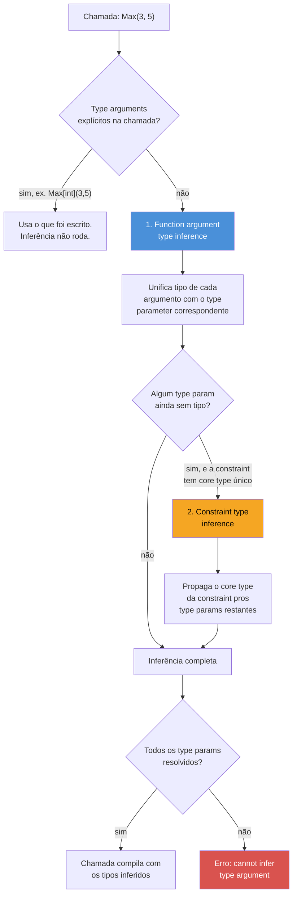

# Type inference

> [!abstract] TL;DR
> Ao chamar uma função genérica, Go quase sempre deixa você omitir os **type arguments** — `Max(3, 5)` em vez de `Max[int](3, 5)` — porque o compilador **infere** o tipo a partir dos argumentos passados, num processo chamado *function argument type inference*. Existe uma segunda forma, *constraint type inference*, que propaga tipo entre parâmetros de tipo ligados por uma constraint (ex.: o tipo do elemento de um slice a partir do tipo do próprio slice). Mas a inferência tem limites reais: não enxerga o tipo de retorno, não resolve quando a única pista é uma constante sem tipo definido (`untyped constant`) que aceita mais de um tipo, e não funciona quando não há argumento nenhum de onde partir (típico em "construtores" genéricos). Nesses casos, `[int]` explícito na chamada deixa de ser opcional e vira a única saída.

## O cenário: por que `Max(3, 5)` só compila às vezes

Retome a função genérica da nota anterior — um `Max` que funciona para qualquer tipo ordenável:

```go
type Ordenavel interface {
    ~int | ~int64 | ~float64 | ~string
}

func Max[T Ordenavel](a, b T) T {
    if a > b {
        return a
    }
    return b
}
```

A assinatura tem um type parameter, `T`. Toda chamada precisa, em teoria, dizer quem é `T`. E no entanto isto compila sem reclamar:

```go
resultado := Max(3, 5) // T = int, sem você escrever nada
```

Nenhum `[int]` em lugar nenhum. Se você vem de Java com generics — onde o compilador também costuma inferir, mas às vezes exige o diamante explícito (`List<Integer> lista = new ArrayList<>()`) — a sensação é familiar: o compilador "adivinha" olhando para os argumentos. `3` e `5` são `int`; logo `T` só pode ser `int`. Go formaliza isso como **type inference**: um algoritmo que roda *antes* da checagem de tipos da chamada, tentando preencher os type arguments que você deixou de fora.

Mas troque os argumentos por algo que não dê pista nenhuma, e a mágica acaba:

```go
var zero T // não compila fora de uma função genérica — T não existe aqui

func Zero[T Ordenavel]() T {
    var z T
    return z
}

x := Zero() // erro: cannot infer T (nenhum argumento de onde inferir)
y := Zero[int]() // compila — type argument explícito
```

`Zero` não recebe nenhum parâmetro do tipo `T` — não há de onde a inferência puxar informação. O compilador não olha o tipo de retorno esperado (`x` não tem tipo declarado ainda, e mesmo que tivesse, Go não infere a partir de contexto de atribuição como o `var x Foo = GenericFunc()` do C# ou do Rust). Esse é o primeiro limite real da inferência, e a nota inteira gira em torno de mapear onde ela funciona e onde não.

## Duas inferências, não uma

A especificação da linguagem descreve **dois mecanismos** distintos, que rodam em sequência dentro do mesmo processo de inferência de uma chamada — a confusão mais comum é tratar os dois como se fossem a mesma coisa:



1. **Function argument type inference** — olha os argumentos *de valor* passados na chamada (`3` e `5`) e tenta casar o tipo de cada um com o type parameter que aparece naquela posição da assinatura. É o mecanismo que resolveu `Max(3, 5)` acima.
2. **Constraint type inference** — depois que a primeira passada termina, se ainda sobrar type parameter sem tipo resolvido, o compilador olha a *constraint* desse parâmetro: se ela tiver um **core type** único (todos os termos da union compartilham o mesmo tipo subjacente), esse core type vira candidato a completar a inferência. Isso é o que permite, por exemplo, que uma função genérica sobre `map[K]V` infira `V` a partir de `K` (ou vice-versa) quando a constraint amarra os dois.

As duas rodam **juntas, automaticamente**, numa única chamada sem type arguments — você não escolhe qual delas roda. O que importa saber é que existem dois motivos distintos pelos quais a inferência pode falhar: falta de argumento de valor (função argument) ou constraint sem core type único (constraint inference).

## Function argument inference na prática

O caso mais comum, de longe. O compilador percorre os parâmetros da função da esquerda para a direita, e para cada tipo genérico que aparece na assinatura, tenta **unificar** com o tipo do argumento real:

```go
func Primeiro[T any](s []T) T {
    return s[0]
}

nomes := []string{"Ana", "Bruno"}
n := Primeiro(nomes) // T = string, inferido de []string

numeros := []int{10, 20}
m := Primeiro(numeros) // T = int, inferido de []int
```

`s []T` casado com `[]string` diz "T = string" de forma direta — é literalmente resolver uma equação de unificação de tipos, o mesmo mecanismo por trás de inferência de tipos em Haskell ou TypeScript, só que restrito a esse caso mais simples de "casar a forma do parâmetro com a forma do argumento".

Funciona igual com múltiplos type parameters, desde que cada um apareça em algum argumento:

```go
func Par[K comparable, V any](chave K, valor V) map[K]V {
    return map[K]V{chave: valor}
}

m := Par("idade", 30) // K = string, V = int — os dois inferidos
```

> [!info] Melhorias de inferência no Go 1.21
> Antes do Go 1.21, a inferência tinha buracos conhecidos — em particular, não conseguia inferir a partir de argumentos que fossem eles mesmos funções genéricas parcialmente aplicadas, nem lidar bem com certos casos envolvendo type parameters usados só dentro de outros type parameters. O [release notes do Go 1.21](https://go.dev/doc/go1.21) documenta uma reescrita do algoritmo de inferência que fechou boa parte desses casos — código que exigia `[T]` explícito em versões anteriores passou a compilar sem anotação. Se você mantém código Go anterior a 1.21 com instanciações explícitas "desnecessárias" à primeira vista, é plausível que elas existam por causa dessas limitações antigas.

## Quando o compilador NÃO tem pista suficiente

Três situações concretas em que a inferência falha e `[Tipo]` explícito deixa de ser estilo — vira obrigação.

**1. Nenhum argumento carrega o type parameter** (o caso `Zero` da abertura):

```go
func NovoSlice[T any](tamanho int) []T {
    return make([]T, tamanho)
}

s := NovoSlice[string](5) // [int] não dá pra inferir de "5" — 5 é o tamanho, não uma pista de T
```

`tamanho int` não tem relação nenhuma com `T` — é só um `int` comum. Não existe argumento de onde `T` possa ser deduzido, então o compilador nem tenta: exige explicitação.

**2. A única pista é uma constante sem tipo (untyped constant) e a constraint aceita mais de um tipo**:

```go
type Numero interface {
    ~int | ~float64
}

func Dobro[T Numero](x T) T {
    return x * 2
}

Dobro(5)      // T = int — constante sem tipo, mas Go escolhe o "tipo default" (int)
Dobro(5.0)    // T = float64 — idem, default de literal com ponto decimal
Dobro[float64](5) // explícito — força T = float64 mesmo com "5" parecendo int
```

Aqui a inferência *não falha* tecnicamente — `5` sem tipo declarado tem um **tipo default** (`int`, segundo as regras de [constantes não tipadas](https://go.dev/ref/spec#Constants) da especificação), e é esse default que a inferência usa. A armadilha é justamente achar que `Dobro(5)` sempre dá `int`: se a intenção era `float64`, o `[float64]` explícito é necessário, porque `5` sozinho nunca vai inferir `float64` — só `5.0` faria isso naturalmente.

**3. Type parameter aparece só no tipo de retorno, sem eco em nenhum argumento**:

```go
func Converter[T, U any](entrada T, conversor func(T) U) U {
    return conversor(entrada)
}

resultado := Converter(42, func(n int) string {
    return fmt.Sprintf("%d", n)
}) // T = int (do argumento 42) e U = string (inferido da FUNÇÃO conversor, não do retorno)
```

Repare que `U` aqui **é** inferido — mas não porque o compilador olhou o tipo de retorno da chamada externa; foi inferido do tipo de retorno da função `conversor` passada como argumento, que por sua vez é um argumento de valor comum. A regra geral se mantém: a inferência sempre parte de argumentos de valor reais na chamada, nunca do lado esquerdo de uma atribuição.

## Constraint type inference: o segundo estágio

O caso mais didático de constraint type inference aparece quando um type parameter é definido **em função de outro**, via constraint:

```go
type Contador[E comparable] map[E]int

func NovoContador[M ~map[K]int, K comparable](m M) M {
    return m
}
```

Situação mais realista: uma constraint com core type único guiando um parâmetro que não tem argumento próprio de onde inferir diretamente:

```go
type Numerico interface {
    ~int | ~int32 | ~int64 | ~float32 | ~float64
}

func Soma[S ~[]E, E Numerico](s S) E {
    var total E
    for _, v := range s {
        total += v
    }
    return total
}

precos := []float64{9.9, 19.9}
total := Soma(precos) // S = []float64 (function arg inference) → E = float64 (constraint inference)
```

`S` é resolvido primeiro por function argument inference, casando `s S` com `[]float64`. Mas `E` não aparece em parâmetro nenhum diretamente — só dentro da constraint `~[]E` de `S`. É a *constraint type inference* que entra aí: como `S` já é `[]float64`, e a constraint de `S` diz que seu core type é `[]E`, o compilador deduz `E = float64` **a partir da relação estrutural na constraint**, não de um argumento de valor.

> [!info] Este é o mecanismo por trás de boa parte de `slices` e `maps` (Go 1.21)
> Funções como `slices.Max[S ~[]E, E cmp.Ordered](x S) E` (pacote `slices`, Go 1.21+) dependem exatamente desse padrão — um type parameter `E` que só existe dentro da constraint de `S`. É por isso que `slices.Max(precos)` compila sem nenhuma anotação: as duas fases de inferência, argument e constraint, resolvem `S` e `E` em sequência. Os detalhes de `slices`/`maps` como pacote pertencem ao Galho 5 — aqui o interesse é só o mecanismo de inferência que os torna ergonômicos.

## Explicitando com `[Tipo]`: quando e como

A sintaxe de instanciação explícita sempre existe como escape hatch, mesmo quando a inferência funcionaria sozinha:

```go
Max[int](3, 5)       // redundante — inferência já resolveria T = int
Max[float64](3, 5)   // força T = float64, mesmo com 3 e 5 "parecendo" int
```

Instanciação parcial também é permitida quando há múltiplos type parameters: você pode explicitar só os primeiros e deixar o resto para a inferência completar, mas **nunca pular um do meio** — a ordem é posicional, da esquerda para a direita:

```go
func Mapear[T, U any](s []T, f func(T) U) []U {
    resultado := make([]U, len(s))
    for i, v := range s {
        resultado[i] = f(v)
    }
    return resultado
}

nomes := []string{"ana", "bruno"}

// forma 1: inferência total
tamanhos := Mapear(nomes, func(s string) int { return len(s) })

// forma 2: só T explícito, U ainda inferido do segundo argumento
tamanhos2 := Mapear[string](nomes, func(s string) int { return len(s) })

// NÃO existe forma de pular T e explicitar só U — instanciação é posicional
```

Na prática, `[Tipo]` explícito vira necessário em três situações recorrentes: (a) função sem argumento que carregue o type parameter (o caso `Zero`/`NovoSlice`), (b) desambiguar entre tipos que compartilham default de constante sem tipo, e (c) por clareza deliberada em código de biblioteca, onde deixar o tipo explícito documenta a intenção mesmo que a inferência resolvesse sozinha.

## Um limite estrutural: não existe inferência para métodos genéricos

Vale fechar o mapa de limites com um caso que surpreende quem já domina o resto: Go **não permite** que um método declare type parameters próprios, além dos que o tipo genérico do receiver já tem. A [especificação](https://go.dev/ref/spec#Method_declarations) é explícita — "the receiver base type [...] the receiver specification declares the type parameters", ou seja, um método só pode *usar* os type parameters já declarados no tipo, nunca introduzir um novo:

```go
type Caixa[T any] struct {
    valor T
}

// Válido — Get usa o T que Caixa[T] já declarou:
func (c Caixa[T]) Get() T {
    return c.valor
}

// NÃO compila — método tentando introduzir um type parameter próprio, U:
// func (c Caixa[T]) Converter[U any](f func(T) U) U {
//     return f(c.valor)
// }
```

Não é uma questão de inferência falhar — é a linguagem simplesmente não oferecer a sintaxe para declarar `U` naquele lugar. A saída prática é sempre a mesma: virar `Converter` uma função livre com `Caixa[T]` como parâmetro comum, deixando o segundo type parameter livre para a função inteira:

```go
func Converter[T, U any](c Caixa[T], f func(T) U) U {
    return f(c.valor)
}

c := Caixa[int]{valor: 42}
resultado := Converter(c, func(n int) string {
    return fmt.Sprintf("valor: %d", n)
}) // T = int, U = string — os dois inferidos da chamada, função livre resolve o que o método não pode
```

Esse redesenho — de método para função livre — é o padrão idiomático sempre que a operação precisa de um type parameter que o tipo do receiver não tem. E é também mais um motivo prático para a inferência de argumento importar tanto: como a rota "método genérico com type parameter extra" está fechada, boa parte do código genérico real em Go acaba em funções livres como `Converter`, exatamente o formato que mais se beneficia de inferência limpa nos dois type parameters de uma vez.

## Armadilhas comuns

> [!warning] Misturar tipos que a constraint permite, mas a inferência não consegue unificar
> ```go
> func Soma[T Numero](a, b T) T { return a + b }
>
> var x int = 3
> var y float64 = 4.5
> Soma(x, y) // erro: type mismatch — T não pode ser int E float64 ao mesmo tempo
> ```
> A constraint `Numero` aceita `int` e `float64` **separadamente**, mas dentro de uma única chamada `T` é uma variável só — precisa resolver para um tipo único. Isso não é bug da inferência; é a mesma regra que vale para qualquer função não genérica (`func Soma(a, b int) int` também rejeitaria misturar tipos). A correção é converter explicitamente um dos dois antes da chamada.

> [!warning] Constante sem tipo pode "escolher" o tipo errado silenciosamente
> Como visto no caso `Dobro(5)` acima, `5` sem contexto assume `int` por default — mesmo que a intenção fosse `float64`. Diferente de um erro de compilação, isso **compila** e produz o tipo errado sem aviso nenhum. Vale o hábito de escrever `5.0` (ou usar `[float64]` explícito) sempre que a intenção não for o tipo default de um literal.

> [!warning] Inferência nunca olha o tipo da variável de destino
> ```go
> var resultado float64 = Max(3, 5) // T ainda é int (de 3 e 5) — depois convertido/atribuído a float64
> ```
> Diferente de linguagens com inferência bidirecional mais rica (Rust, Kotlin, TypeScript em certos contextos), a inferência de Go em generics é **estritamente de baixo para cima**: só olha os argumentos passados na chamada, nunca o tipo esperado pelo lado esquerdo da atribuição. `var resultado float64 = Max(3, 5)` infere `T = int` de qualquer forma, e só então tenta atribuir o `int` resultante a `resultado` — o que, aliás, também não compila sem conversão explícita, porque Go não converte `int` para `float64` implicitamente em atribuição.

## Vindo de outras linguagens

| Linguagem | Como a inferência de generics funciona lá | Diferença central para Go |
|---|---|---|
| Java | Infere de argumentos e, em contextos de atribuição/retorno ("target typing"), também do tipo esperado do lado de fora | Go nunca olha o "tipo esperado" externo — só os argumentos da própria chamada |
| TypeScript | Infere de argumentos e, em vários contextos, também do tipo de contexto (contextual typing) | Mesma diferença: Go é unidirecional, TS costuma ser bidirecional |
| Rust | Infere de argumentos e também do tipo de retorno esperado (`let x: f64 = generic_fn(3)` pode influenciar a inferência) | Go não tem esse "empurrão de volta" a partir do tipo de destino |
| C# | Exige quase sempre inferência de argumento; diamante `<>` raramente precisa de tipo explícito | Modelo mais parecido com Go — inferência de argumento como caso principal |

O ponto que mais gera confusão para quem chega de Java ou TypeScript é justamente a ausência do "target typing" — a intuição de "o compilador vê que eu quero um `float64` aqui, então vai inferir isso" simplesmente não se aplica em Go. A inferência é uma via de mão única: dos argumentos para o type parameter, nunca do destino para o type parameter.

## Como explicar em inglês

> Go's type inference for generics lets you omit explicit type arguments in most calls — `Max(3, 5)` instead of `Max[int](3, 5)` — because the compiler works out the type parameters from the actual arguments passed. There are two distinct mechanisms: **function argument type inference**, which unifies each parameter's declared type with the type of the corresponding call argument, and **constraint type inference**, which runs afterward to propagate a type through a constraint's core type when a type parameter has no argument of its own to draw from — the classic case being an element type `E` that only appears inside a slice-shaped constraint like `~[]E`. Inference has real limits: it never looks at the expected type on the left side of an assignment (no "target typing" the way Java or TypeScript sometimes does), and it can't infer anything when no argument carries the type parameter at all — a generic constructor-like function with no typed argument, for instance. In those cases, explicit instantiation with `[Type]` stops being optional and becomes required.

| Termo PT | Termo EN |
|---|---|
| inferência de tipo | type inference |
| argumento de tipo | type argument |
| parâmetro de tipo | type parameter |
| inferência de argumento de função | function argument type inference |
| inferência de constraint | constraint type inference |
| tipo subjacente comum / core type | core type |
| constante sem tipo | untyped constant |
| instanciação explícita | explicit instantiation |
| unificação de tipos | type unification |

## O que vem a seguir

Até aqui, generics apareceram como ferramenta que resolve um problema técnico bem definido — evitar duplicação de código por tipo, com o compilador inferindo os detalhes. Mas Go já tinha, antes de 1.18, uma ferramenta de polimorfismo: **interfaces**. A [[06 - Generics vs interfaces — quando usar cada um|próxima nota]] enfrenta a pergunta que toda base de código Go pós-1.18 precisa responder cedo ou tarde — quando o problema pede generics, quando pede interface, e por que confundir os dois produz código pior nas duas direções.

## Veja também

- [[01 - Por que generics — o problema antes de 1.18|01 — Por que generics]] — o problema que motivou a feature, base para entender por que a inferência importa tanto na ergonomia
- [[02 - Type parameters — a sintaxe|02 — Type parameters]] — a sintaxe `[T any]` cuja instanciação esta nota está inferindo
- [[03 - Constraints|03 — Constraints]] — union types e core type, pré-requisito direto para entender constraint type inference
- [[04 - Tipos genéricos|04 — Tipos genéricos]] — instanciação de tipos genéricos (não só funções), onde as mesmas regras de inferência se aplicam com nuances próprias
- [[06 - Generics vs interfaces — quando usar cada um|06 — Generics vs interfaces]] — próxima nota
- [[03-Dominios/Tecnologia/Go/index|Trilha Go]]

## Fontes

- The Go Authors. *The Go Programming Language Specification — Type inference*. go.dev. https://go.dev/ref/spec#Type_inference (acessado em 2026-07-18)
- Griesemer, Robert; Taylor, Ian. *Go 1.18 is released, with generics and fuzzing*. go.dev/blog. https://go.dev/blog/go1.18 (acessado em 2026-07-18)
- The Go Authors. *Go 1.21 Release Notes — Improvements to type inference*. go.dev. https://go.dev/doc/go1.21 (acessado em 2026-07-18)
- The Go Authors. *An Introduction to Generics*. go.dev/blog. https://go.dev/blog/intro-generics (acessado em 2026-07-18)
- The Go Authors. *The Go Programming Language Specification — Constants*. go.dev. https://go.dev/ref/spec#Constants (acessado em 2026-07-18)
- pkg.go.dev. *Package slices*. pkg.go.dev. https://pkg.go.dev/slices (acessado em 2026-07-18)
