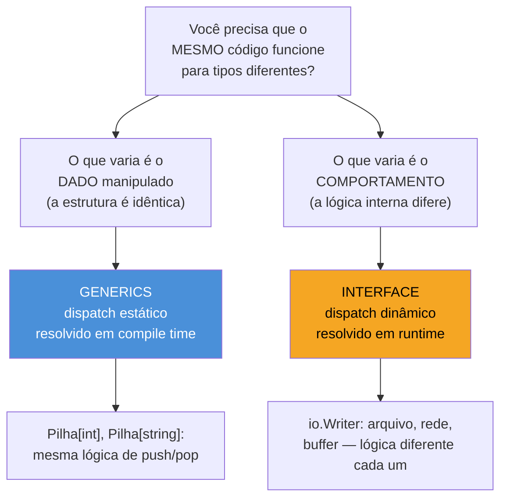
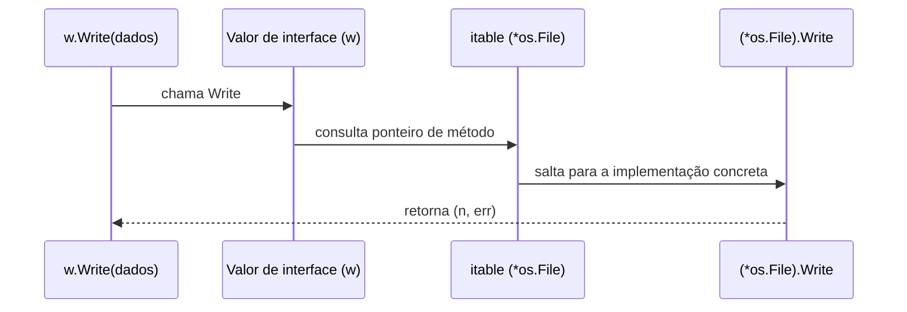

# Generics vs interfaces — quando usar cada um

> [!abstract] TL;DR
> Generics e interfaces resolvem problemas diferentes, mesmo parecendo os dois "formas de escrever código que funciona para vários tipos". **Interface** é polimorfismo de **comportamento**: várias implementações concretas, uma delas escolhida em **tempo de execução**, via uma tabela de método indireta (dispatch dinâmico). **Generics** é polimorfismo de **dados**: o mesmo algoritmo, especializado por tipo em **tempo de compilação** (dispatch estático), sem indireção nem type assertion. A régua prática: se o código vai chamar `.Metodo()` em algo que pode variar de implementação — banco de dados, logger, `io.Writer` — é interface. Se o código vai manipular *a mesma estrutura de dados* para tipos diferentes — uma pilha de `int`, uma pilha de `string` — é generics. As duas ferramentas não competem: coexistem no mesmo código, com frequência na mesma assinatura.

## O sintoma que expõe a confusão

Suponha que você precise escrever uma função `Maior` que retorna o maior de dois valores. Antes de generics (Go 1.18), a saída idiomática era `interface{}` com type assertion, ou uma função por tipo (`MaiorInt`, `MaiorFloat64`, `MaiorString`). Depois de 1.18, a tentação é resolver **tudo** com generics — inclusive problemas que nunca foram sobre dados intercambiáveis, e sim sobre comportamento intercambiável.

Veja o sintoma ao vivo. Alguém escreve isto, achando que está "modernizando" o código com generics:

```go
type Notificador[T any] interface {
    Notificar(msg T) error
}

func Enviar[T any](n Notificador[T], msg T) error {
    return n.Notificar(msg)
}
```

Compila. Funciona. E é over-engineering: `Notificador` não precisa de parâmetro de tipo nenhum, porque o problema real não é "notificar mensagens de tipos diferentes" — é "ter implementações diferentes de notificação" (e-mail, SMS, push). Isso é o caso clássico de interface simples:

```go
type Notificador interface {
    Notificar(msg string) error
}

func Enviar(n Notificador, msg string) error {
    return n.Notificar(msg)
}
```

O contrário também acontece: alguém escreve uma interface `Ordenavel` com um método `Comparar(outro Ordenavel) int` só para conseguir uma `Pilha` que funcione com `int` e `string` — quando o problema era estrutura de dados genérica o tempo todo, e a nota 04 já resolveu exatamente isso com `type Pilha[T any] struct`. A confusão nasce porque as duas ferramentas compartilham vocabulário ("funciona para vários tipos") mas resolvem eixos ortogonais do problema.

## O eixo que separa as duas: quando o tipo é resolvido



A pergunta que corta o problema ao meio: **o tipo concreto é conhecido e fixo em cada ponto de uso, ou pode mudar em runtime — inclusive vir de configuração, de plugin, de decisão de negócio?**

- Com **generics**, quando você escreve `Pilha[int]{}`, o compilador já sabe, naquele ponto do código-fonte, que é uma pilha de `int`. O tipo é resolvido estaticamente — não existe "pilha que às vezes guarda `int`, às vezes `string`, decidido em runtime". Cada instanciação (`Pilha[int]`, `Pilha[string]`) é, para efeitos de geração de código e otimização, praticamente um tipo à parte.
- Com **interface**, o valor concreto por trás de uma variável `var w io.Writer` pode ser um `*os.File` hoje e um `*bytes.Buffer` amanhã — decidido em runtime, possivelmente por uma flag de configuração ou por qual implementação foi injetada. O compilador não sabe qual é; só sabe que, seja qual for, tem um método `Write([]byte) (int, error)`.

Essa diferença de "quando o tipo é resolvido" não é detalhe de implementação — ela é a causa raiz de tudo que muda entre as duas ferramentas: performance, alocação de memória, e até o que é possível expressar.

## Como o mecanismo funciona por baixo

**Dispatch dinâmico (interface).** Um valor de interface em Go é, por baixo, um par: um ponteiro para os **dados** concretos e um ponteiro para uma **tabela de método** (*itable*) daquele tipo concreto — a tabela associa cada método da interface à implementação real. Chamar `w.Write(b)` é: consultar a itable, pegar o ponteiro de função de `Write` para o tipo concreto guardado, saltar para lá. Essa indireção — mais o fato de que valores de interface frequentemente forçam o dado concreto a escapar para a heap, porque o compilador não sabe seu tamanho em tempo de compilação — é o custo de runtime da interface.



**Dispatch estático (generics).** Quando você escreve `func Soma[T Numero](itens []T) T`, o compilador, em cada ponto de instanciação (`Soma[int](...)`, `Soma[float64](...)`), gera — conceitualmente — uma versão especializada da função para aquele tipo específico. Não há tabela para consultar em runtime; a chamada de `t1 + t2` dentro de `Soma[int]` já é literalmente uma soma de `int`, resolvida em tempo de compilação, tão direta quanto se você tivesse escrito `SomaInt` à mão.

> [!info] Detalhe de implementação: GC shape stenciling
> A implementação real do compilador Go (desde 1.18) não gera uma cópia binária completa para cada tipo instanciado — isso explodiria o tamanho do binário. Em vez disso, usa uma técnica chamada *GC shape stenciling*: tipos com o mesmo "formato" em relação ao coletor de lixo (por exemplo, todos os tipos ponteiro de 8 bytes) compartilham uma única implementação compilada, parametrizada por um dicionário de tipo passado internamente. Tipos com layout de memória diferente (`int32` vs `string` vs struct) ganham instanciações separadas. O efeito prático para quem escreve o código é o mesmo — dispatch resolvido estaticamente, sem itable — mas vale saber que "uma cópia por tipo" é simplificação, não o mecanismo literal.

A consequência mensurável: uma função genérica sobre `[]int` opera sobre `int`s de verdade, sem boxing, sem indireção de ponteiro de função, e o compilador pode inlinear a chamada como faria com qualquer função concreta. Uma função que recebe `interface{}` (ou uma interface com métodos) paga a itable e, com frequência, uma alocação na heap para o valor concreto.

## Quando generics ganham

**1. Coleções genéricas** — a razão de existir mais citada para generics, e o assunto central da nota 04. Uma `Pilha[T]`, uma `FilaPrioridade[T]`, uma `ArvoreBinaria[T]` precisam da mesma lógica interna (push, pop, balancear) para qualquer tipo de elemento. Sem generics, a única saída pré-1.18 era `interface{}` com type assertion em toda operação — perdendo checagem de tipo em compile time e pagando o custo de boxing em cada inserção.

```go
type Pilha[T any] struct {
    itens []T
}

func (p *Pilha[T]) Push(v T) {
    p.itens = append(p.itens, v)
}

func (p *Pilha[T]) Pop() (T, bool) {
    var zero T
    if len(p.itens) == 0 {
        return zero, false
    }
    v := p.itens[len(p.itens)-1]
    p.itens = p.itens[:len(p.itens)-1]
    return v, true
}
```

`Pilha[int]{}` e `Pilha[string]{}` são, cada uma, type-safe de ponta a ponta — `Pop()` de uma `Pilha[int]` devolve `int`, não `any` exigindo asserção.

**2. Algoritmos type-safe sobre tipos numéricos ou ordenáveis** — funções como soma, máximo, filtro, que fazem sentido igual para `int`, `float64`, `int32`, mas cuja lógica não depende de nenhum comportamento além de operadores embutidos (`+`, `<`). É exatamente o território de `constraints.Ordered` (nota 03) e do pacote `slices` da biblioteca padrão:

```go
type Numero interface {
    ~int | ~int32 | ~int64 | ~float32 | ~float64
}

func Soma[T Numero](itens []T) T {
    var total T
    for _, v := range itens {
        total += v
    }
    return total
}
```

Não existe versão limpa disso com interface: uma interface `Somavel` exigiria que **cada tipo numérico** (`int`, `float64`, ...) declarasse um método `Somar`, o que é impossível — você não pode adicionar métodos a `int` (regra do próprio pacote, vista no galho 2). Generics com *type constraint* é a única ferramenta que alcança esse caso.

**3. Wrappers e adaptadores que preservam o tipo concreto do chamador.** Um `Optional[T]`, um `Result[T, E]`, um `Map[K, V]` — qualquer estrutura cujo propósito é "guardar um valor de tipo `T` e devolver esse mesmo `T` de volta, sem perder informação de tipo pelo caminho". Com `interface{}`, o chamador precisaria fazer type assertion toda vez que recuperasse o valor — perdendo exatamente a garantia que a estrutura deveria oferecer.

**4. Funções utilitárias funcionais escritas à mão** — `Map`, `Filter`, `Reduce` sobre uma coleção arbitrária, quando você não quer (ou não pode, num projeto com política própria de dependências) usar as versões já prontas dos pacotes `slices`/`maps` da biblioteca padrão (galho 5). O ganho é o mesmo das coleções: a lógica de iterar e transformar é idêntica para `[]int`, `[]Usuario`, `[]string` — só o tipo de entrada e saída muda.

```go
func Map[T, R any](itens []T, f func(T) R) []R {
    resultado := make([]R, len(itens))
    for i, v := range itens {
        resultado[i] = f(v)
    }
    return resultado
}

nomes := Map([]Usuario{{Nome: "Ana"}, {Nome: "Beto"}}, func(u Usuario) string {
    return u.Nome
})
fmt.Println(nomes) // [Ana Beto]
```

Repare que `Map` usa **dois** parâmetros de tipo (`T` para entrada, `R` para saída) — diferente de todos os exemplos anteriores desta nota, que usavam só um. Isso é comum em funções de transformação: o tipo de saída não precisa ter relação nenhuma com o de entrada, e o compilador infere os dois separadamente a partir dos argumentos passados (a nota 05 detalha as regras de inferência quando dois type parameters entram em jogo).

## Quando interface ganha

**1. Comportamento polimórfico de verdade — implementações que fazem coisas diferentes.** `io.Writer` é o exemplo canônico: `*os.File`, `*bytes.Buffer`, `gzip.Writer`, `net.Conn` implementam `Write([]byte) (int, error)` com lógicas internas completamente distintas (escrever em disco, crescer um slice em memória, comprimir bytes, enviar pela rede). Não faz sentido nenhum "generics sobre implementações de Writer" — não existe tipo parametrizado aqui, existe comportamento substituível.

```go
func RegistrarLog(w io.Writer, msg string) {
    fmt.Fprintln(w, msg)
}

// mesma função, três comportamentos completamente diferentes por baixo:
RegistrarLog(os.Stdout, "iniciando")
RegistrarLog(&bytes.Buffer{}, "para teste")
RegistrarLog(conexaoDeRede, "para um serviço remoto")
```

**2. Extensibilidade por terceiros, decidida em runtime.** Um sistema de plugins, um `Repositorio` que pode ser Postgres hoje e um mock em teste amanhã, uma cadeia de `http.Handler` compostos dinamicamente — todos exigem que a implementação seja trocável **sem recompilar o código que consome a interface**, muitas vezes decidida por injeção de dependência ou configuração. Isso é, por definição, uma decisão de runtime — exatamente o que dispatch dinâmico resolve e dispatch estático (generics) não pode, porque generics são resolvidos em compile time.

**3. Interfaces pequenas e focadas em comportamento, no espírito idiomático de Go** (`io.Reader`, `sort.Interface`, `fmt.Stringer`). Nenhuma delas ganharia clareza virando genérica — o ponto delas nunca foi "processar dados de tipos diferentes com a mesma lógica", foi "aceitar qualquer coisa que saiba se comportar de um jeito específico".

**4. Testabilidade via substituição de implementação.** Um `ClienteHTTP` como interface (`type ClienteHTTP interface { Do(*http.Request) (*http.Response, error) }`) permite que testes injetem uma implementação falsa sem tocar rede nenhuma, sem precisar de nenhum framework de mocking — só um struct que implementa o mesmo método com um comportamento controlado. Isso é dispatch dinâmico funcionando a favor do design de teste: o código de produção nunca sabe, e nunca precisa saber, se está falando com `http.Client` de verdade ou com um dublê. Generics não oferece esse tipo de substituição — trocar `T` exige recompilar/reinstanciar, não injetar em runtime.

```go
type ClienteHTTP interface {
    Do(req *http.Request) (*http.Response, error)
}

type clienteFalso struct {
    resposta *http.Response
}

func (c clienteFalso) Do(req *http.Request) (*http.Response, error) {
    return c.resposta, nil
}

func BuscarDados(c ClienteHTTP, url string) (*http.Response, error) {
    req, _ := http.NewRequest("GET", url, nil)
    return c.Do(req)
}
```

Em teste, `BuscarDados(clienteFalso{resposta: &http.Response{StatusCode: 200}}, "...")` roda sem tocar rede — a mesma função de produção, com o comportamento de `Do` trocado por inteiro.

## As duas juntas na mesma assinatura

O caso mais comum na prática moderna não é "generics OU interface" — é as duas coexistindo, cada uma no seu eixo. Uma função genérica que processa uma coleção de valores que, por sua vez, satisfazem uma interface:

```go
type Validavel interface {
    Validar() error
}

func ValidarTodos[T Validavel](itens []T) error {
    for _, item := range itens {
        if err := item.Validar(); err != nil {
            return err
        }
    }
    return nil
}
```

Aqui, `T` é resolvido estaticamente (generics: `ValidarTodos[Usuario]`, `ValidarTodos[Pedido]` são especializações diferentes, sem boxing na iteração), mas dentro do laço, `item.Validar()` ainda é uma chamada de interface — porque `Validavel` é o *constraint*, e diferentes tipos `T` trazem implementações diferentes de `Validar()`. As duas ferramentas resolvendo problemas diferentes, na mesma função: generics elimina o boxing da coleção; interface expressa "qualquer tipo que saiba se validar".

## Caso de fronteira: repositório genérico sobre uma entidade com comportamento

O padrão que mais aparece em código de backend Go moderno — e que expõe bem a fusão das duas ferramentas — é um repositório CRUD genérico, parametrizado por uma entidade que precisa satisfazer um contrato mínimo de comportamento:

```go
type Entidade interface {
    ID() string
}

type Usuario struct {
    Codigo string
    Nome   string
}

func (u Usuario) ID() string { return u.Codigo }

type Repositorio[T Entidade] struct {
    dados map[string]T
}

func NovoRepositorio[T Entidade]() *Repositorio[T] {
    return &Repositorio[T]{dados: make(map[string]T)}
}

func (r *Repositorio[T]) Salvar(item T) {
    r.dados[item.ID()] = item
}

func (r *Repositorio[T]) Buscar(id string) (T, bool) {
    item, ok := r.dados[id]
    return item, ok
}

func main() {
    repo := NovoRepositorio[Usuario]()
    repo.Salvar(Usuario{Codigo: "u1", Nome: "Ana"})

    u, ok := repo.Buscar("u1")
    fmt.Println(u, ok) // {u1 Ana} true
}
```

Repare no que cada ferramenta contribui, sem sobreposição:

- **Generics** (`Repositorio[T Entidade]`) evita reescrever `RepositorioUsuario`, `RepositorioPedido`, `RepositorioProduto` com a mesma lógica de `map[string]T` copiada e colada três vezes, cada uma com type assertion manual se fosse feito com `interface{}`. `Buscar` devolve `T` de verdade — `Usuario`, não `any` exigindo asserção no chamador.
- **Interface** (`Entidade` como constraint) garante que qualquer `T` usado sabe se identificar via `ID() string` — sem essa exigência, `Salvar` não teria como decidir a chave do `map`. O constraint aqui não está limitando quais *tipos primitivos* entram (como `~int | ~float64` faria) — está exigindo um **método**, e é exatamente aí que constraint-como-interface e comportamento polimórfico se encontram dentro do mesmo mecanismo sintático.

Esse é o padrão a apontar quando alguém pergunta "generics substitui interface?" — a resposta correta, ilustrada em código real, é que um repositório genérico *depende* de uma interface pra funcionar; tirar a interface (`Entidade`) faria `item.ID()` não compilar, porque `T any` não garante método nenhum.

> [!warning] Generics não substitui interface como parâmetro de função — geralmente é o contrário do que a intuição sugere
> Um erro comum de quem acabou de aprender generics é parametrizar uma função que deveria aceitar uma interface simples: `func Processar[T Notificador](n T)` em vez de `func Processar(n Notificador)`. Se a função nunca precisa saber o tipo concreto de `T` — só chama métodos da interface — o parâmetro de tipo não adiciona nada, só complica a assinatura e obriga instanciação explícita em alguns contextos (como armazenar `T` numa slice heterogênea, que passa a exigir `any` de qualquer forma). Regra prática: só use `[T Interface]` como constraint quando a função **retorna `T`** ou manipula uma coleção de `T` preservando o tipo — se ela só consome métodos e nunca devolve `T` ao chamador, uma interface simples como parâmetro já resolve, sem parâmetro de tipo nenhum.

## Um tipo genérico também pode satisfazer uma interface

Uma pergunta natural, depois de ver as duas ferramentas lado a lado: um tipo genérico como `Pilha[T]` consegue satisfazer uma interface comum, não-genérica? Sim — sem nenhum truque especial. Uma vez que `T` é fixado por instanciação (`Pilha[int]`), o tipo resultante é um tipo concreto normal, com method set normal, e satisfação de interface funciona exatamente como sempre funcionou (galho 3):

```go
type Contavel interface {
    Tamanho() int
}

type Pilha[T any] struct {
    itens []T
}

func (p *Pilha[T]) Tamanho() int {
    return len(p.itens)
}

func Relatar(c Contavel) {
    fmt.Println("tamanho:", c.Tamanho())
}

func main() {
    p := &Pilha[string]{itens: []string{"a", "b", "c"}}
    Relatar(p) // *Pilha[string] satisfaz Contavel — tamanho: 3
}
```

`*Pilha[string]` é, para efeitos de satisfação de interface, um tipo concreto como qualquer outro — a única diferença é que seu nome completo carrega o argumento de tipo entre colchetes. `Relatar` nem precisa saber que `Pilha` é genérica; só enxerga `Contavel`. Isso mostra que as duas ferramentas não são nem mutuamente exclusivas nem hierárquicas — um tipo pode nascer genérico e, depois de instanciado, participar do sistema de interfaces normalmente, dispatch dinâmico incluído.

O que **não** existe — e vale marcar explicitamente porque a intuição de quem vem de linguagens com generics mais antigos tenta usar isso — é um método genérico "solto" dentro de um tipo não-genérico, com seu próprio parâmetro de tipo independente do tipo receiver (`func (s Servico) Processar[T any](item T)` não compila). A nota 07 detalha essa e outras lacunas do modelo de generics de Go.

## Checklist de decisão

Uma forma rápida de aplicar a régua da abertura, resumida como perguntas objetivas a fazer diante de qualquer assinatura nova:

| Pergunta | Se a resposta for sim |
|---|---|
| A lógica interna muda de implementação para implementação (arquivo vs rede vs memória)? | Interface |
| O código só chama métodos e nunca precisa devolver o tipo concreto original ao chamador? | Interface (sem parâmetro de tipo) |
| A implementação concreta é decidida em runtime (config, injeção de dependência, plugin)? | Interface |
| A mesma estrutura de dados (pilha, fila, mapa, árvore) precisa existir para vários tipos de elemento? | Generics |
| A função devolve o mesmo tipo `T` que recebeu, e perder essa informação forçaria type assertion no chamador? | Generics |
| A lógica depende só de operadores embutidos (`+`, `<`, `==`) sobre um conjunto fechado de tipos numéricos/ordenáveis? | Generics com constraint (`constraints.Ordered` ou union customizada) |
| Os elementos manipulados por uma coleção genérica também precisam de comportamento próprio (validar, se identificar, se serializar)? | As duas — generics para a coleção, interface como constraint de `T` |

Nenhuma linha dessa tabela é absoluta — é heurística, não regra de compilador. Mas cobre a maioria esmagadora dos casos reais de design de API em Go.

## Armadilhas comuns

> [!warning] "any" no lugar errado não é generics de verdade
> `func Imprimir(v any) { fmt.Println(v) }` usa `any` como o antigo `interface{}` — não há parâmetro de tipo, não há especialização, é só uma forma educada de dizer "aceito qualquer coisa e não faço nada type-safe com ela". Isso não é generics, é a mesma perda de tipo estático do pré-1.18. Diferença real: `func Imprimir[T any](v T)` declara um type parameter — o compilador sabe, em cada chamada, qual `T` foi usado, e devolveria `T` (não `any`) se a função retornasse algo.

> [!warning] Generics não elimina a necessidade de interfaces pequenas — às vezes cria uma
> É comum ver um *constraint* que é, na prática, uma interface com um único método (`type Somavel interface { ~int | ~float64 }` é diferente disso — mas `type Serializavel[T any] interface { Serializar() T }` é uma interface genuína, só que parametrizada). Constraints com union de tipos (`~int | ~float64`) e interfaces com métodos são categorias diferentes dentro do mesmo mecanismo sintático `interface{...}` — a nota 03 detalha essa dualidade.

> [!warning] Performance não é sempre a favor de generics
> Para coleções pequenas ou chamadas pouco frequentes, a diferença de performance entre dispatch estático e dinâmico raramente é perceptível — Go otimizou bastante o caminho de interface ao longo dos anos, e *escape analysis* evita boxing em vários casos comuns. Trocar uma interface simples e legível por generics "porque é mais rápido", sem medir, é otimização prematura. Meça com benchmark (`go test -bench`) antes de reescrever uma API pública em nome de performance.

## Medindo a diferença: um benchmark real

A afirmação "generics evita boxing, interface paga alocação" não deveria ficar só na teoria — é fácil de verificar com o próprio `testing.B` da biblioteca padrão. Compare duas formas de somar um slice de `int`: uma via `interface{ Somar() int }` implementada por um wrapper, outra via função genérica direta sobre `[]int`.

```go
type Inteiro struct{ v int }

func (i Inteiro) Somar() int { return i.v }

type Somavel interface {
    Somar() int
}

func SomaInterface(itens []Somavel) int {
    total := 0
    for _, item := range itens {
        total += item.Somar()
    }
    return total
}

func SomaGenerics[T ~int](itens []T) T {
    var total T
    for _, v := range itens {
        total += v
    }
    return total
}

func BenchmarkSomaInterface(b *testing.B) {
    itens := make([]Somavel, 1000)
    for i := range itens {
        itens[i] = Inteiro{v: i}
    }
    b.ResetTimer()
    for i := 0; i < b.N; i++ {
        SomaInterface(itens)
    }
}

func BenchmarkSomaGenerics(b *testing.B) {
    itens := make([]int, 1000)
    for i := range itens {
        itens[i] = i
    }
    b.ResetTimer()
    for i := 0; i < b.N; i++ {
        SomaGenerics(itens)
    }
}
```

Rodando com `go test -bench=. -benchmem`, o padrão típico observado (números variam por máquina e versão do Go, mas a *direção* é consistente) é: a versão genérica é mais rápida e aloca zero bytes por operação no laço em si, enquanth a versão via interface — mesmo com `Inteiro` sendo um valor pequeno — paga o custo da chamada indireta pela itable a cada iteração, e frequentemente força `Inteiro{v: i}` a escapar para a heap no momento de popular `[]Somavel` (porque atribuir um valor concreto a uma variável de interface, quando o compilador não consegue provar que ele não "escapa" do escopo, aciona a análise de escape a favor da heap). O ponto não é "generics sempre vence" — é que a diferença é **mensurável e sistemática**, não anedótica, e a origem dela é exatamente o mecanismo descrito na seção anterior: itable + possível alocação vs. função especializada sem indireção.

> [!info] `go test -bench` e `-benchmem` são ferramentas da toolchain padrão, sem dependência externa
> `go test -bench=BenchmarkSoma -benchmem -run=^$` roda só os benchmarks (o `-run=^$` evita rodar testes normais junto) e imprime alocações por operação (`B/op`) e número de alocações (`allocs/op`) além do tempo. É o primeiro lugar a olhar antes de decidir "generics aqui vale a pena" em código sensível a performance — nunca decida de cabeça.

## Lente cross-stack

| Vindo de... | Equivalente a "generics vs interface" |
|---|---|
| Java | `List<T>` (generics, compile-time, com type erasure em runtime) vs `interface Comparable` (dispatch dinâmico via vtable) — a mesma dualidade, mas Java apaga o tipo genérico em runtime (*type erasure*); Go mantém informação suficiente para não precisar de type assertion na saída |
| C# | `List<T>` (generics reificados, sem erasure — mais parecido com Go) vs `interface IComparable` — C# já tinha essa separação clara desde .NET 2.0, então a distinção tende a ser mais intuitiva pra quem vem de lá |
| Python | Python nunca teve essa distinção de forma estática — duck typing resolve os dois casos em runtime, sem checagem de tipo em compile time. `typing.Protocol` (parecido com interface) e `TypeVar`/generics (PEP 484) existem só para o type checker (mypy/pyright); não mudam nada em runtime, ao contrário de Go |
| TypeScript | Mais próximo de Go na superfície: `interface` estrutural (dispatch dinâmico em runtime via JS puro) vs `function map<T>(...)` genérico (apagado na compilação para JS — mais parecido com o erasure de Java do que com o dispatch estático real de Go) |

## Como explicar em inglês

> Generics and interfaces solve orthogonal problems, even though both let the same code work "for multiple types." An **interface** gives you dynamic dispatch: different concrete implementations, selected at runtime through an indirect method table (an *itable*) — the right tool whenever behavior itself varies, like `io.Writer` backed by a file, a buffer, or a network connection. **Generics** give you static dispatch: the same algorithm, specialized per type at compile time, with no indirection and no boxing — the right tool whenever the data structure is identical across types, like a `Stack[T]` that behaves the same for `int` and `string`. A quick heuristic: if the function calls a method on something whose implementation can change at runtime, reach for an interface. If it manipulates the same shape of data for different element types, reach for generics. They aren't competitors — most real Go code combines both in the same signature, generics eliminating boxing on a collection while a constraint interface expresses what each element must be able to do.

| Termo PT | Termo EN |
|---|---|
| dispatch estático | static dispatch |
| dispatch dinâmico | dynamic dispatch |
| tabela de método / itable | method table / itable |
| tipo concreto | concrete type |
| polimorfismo de dados | data polymorphism |
| polimorfismo de comportamento | behavioral polymorphism |
| boxing | boxing |
| tempo de compilação / execução | compile time / runtime |
| interface pequena e focada | small, focused interface |

## O que vem a seguir

Generics resolve muito, mas não resolve tudo — e forçar o mecanismo além dos limites que o compilador e o design da linguagem realmente suportam produz código pior do que a alternativa sem generics. A [[07 - Padrões e limites dos generics|nota 07]] fecha o galho mapeando exatamente essa fronteira: o que generics ainda não permite em Go (sem métodos genéricos "soltos", sem especialização por tipo dentro do corpo de uma função genérica), os padrões que a comunidade convergiu para contornar essas lacunas, e os sinais de que uma API foi generic-ficada sem necessidade real.

## Veja também

- [[03 - Constraints|03 — Constraints]] — a mecânica de `~int \| ~float64` e interfaces como type constraint, pré-requisito pra entender os exemplos desta nota
- [[04 - Tipos genéricos|04 — Tipos genéricos]] — `Pilha[T]` completa, retomada aqui como caso canônico de "generics ganha"
- [[07 - Padrões e limites dos generics|07 — Padrões e limites dos generics]] — próxima nota do galho
- [[03-Dominios/Tecnologia/Go/index|Trilha Go]]

## Fontes

- The Go Authors. *The Go Programming Language Specification — Interface types*. go.dev. https://go.dev/ref/spec#Interface_types (acessado em 2026-07-18)
- The Go Authors. *Type Parameters Proposal*. go.dev. https://go.dev/blog/intro-generics (acessado em 2026-07-18)
- The Go Authors. *When To Use Generics*. go.dev. https://go.dev/blog/when-generics (acessado em 2026-07-18)
- Griesemer, R. et al. *Featherweight Go* (fundamento formal + GC shape stenciling). go.dev. https://go.dev/blog/generics-implementation-dictionaries-part-2 (acessado em 2026-07-18)
- The Go Authors. *Effective Go — Interfaces*. go.dev. https://go.dev/doc/effective_go#interfaces (acessado em 2026-07-18)
- Go by Example. *Generics*. gobyexample.com. https://gobyexample.com/generics (acessado em 2026-07-18)
