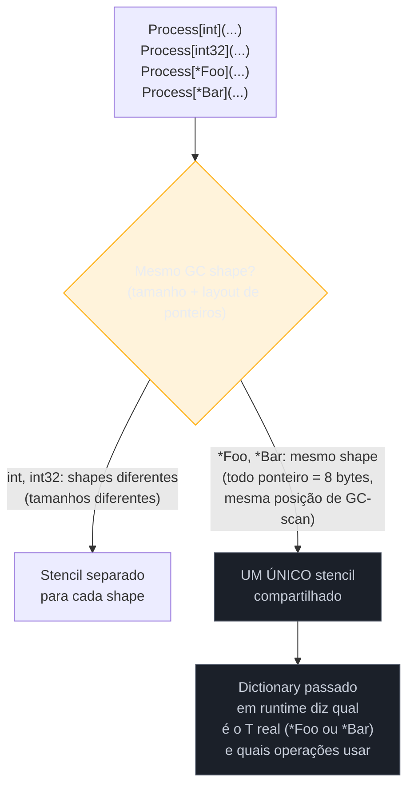

# Padrões e limites dos generics

> [!abstract] TL;DR
> Generics em Go resolvem duplicação de código sobre a *forma* dos dados — não sobre o *comportamento* de tipos específicos. Não existe especialização por tipo (não dá escrever um branch diferente para `int` vs `string` dentro de uma função genérica sem cair em type switch/asserção), e por baixo do capô o compilador usa **GC shape stenciling**: tipos com o mesmo "GC shape" (mesmo tamanho, mesmo layout de ponteiros) compartilham uma única cópia de código de máquina em runtime, coordenada por um **dictionary** implícito passado à função; só tipos com shapes diferentes ganham stencils separados. Isso é uma troca deliberada entre tempo de compilação e código gerado — nem monomorfização pura tipo Rust/C++, nem type erasure puro tipo Java. Na prática, dois pacotes da própria standard library (`slices` e `maps`, desde Go 1.21) já cobrem 90% do que a maioria dos devs vai querer fazer com generics no dia a dia — e a armadilha mais comum do galho inteiro é generalizar cedo demais, quando duas implementações concretas ainda seriam mais simples e mais claras.

## O problema que generics não resolve

Depois de seis notas construindo o mecanismo — type parameters, constraints, tipos genéricos, inferência, e o contraste com interfaces — vale fazer a pergunta inversa: o que generics **não** fazem, mesmo parecendo que deveriam?

Imagine que você quer uma função `Process` que soma números, mas formata strings de outro jeito — concatenando com vírgula em vez de somar. A tentação, vindo de linguagens com *pattern matching* sobre tipos (Rust com `match`, ou até um `overload` do C++), é escrever algo assim:

```go
type Number interface {
    ~int | ~float64
}

func Process[T Number | string](valores []T) T {
    var resultado T
    // "se T for string, concatena; se for número, soma" — não existe essa checagem em Go
    for _, v := range valores {
        resultado += v // funciona pros dois casos, mas só porque + serve pra ambos
    }
    return resultado
}
```

Esse exemplo específico até compila, porque `+` é válido tanto para números quanto para `string` — mas é sorte de sintaxe, não um mecanismo de despacho. No instante em que os dois ramos precisam de lógica genuinamente diferente — por exemplo, números somam mas strings deveriam ser ordenadas antes de concatenar — Go genérico não tem como perguntar "qual é o T concreto aqui?" dentro do corpo da função sem recorrer a um **type switch em cima de uma asserção de tipo**, que é exatamente o mecanismo dinâmico de interface que generics prometiam evitar:

```go
func Process[T any](valores []T) {
    for _, v := range valores {
        switch x := any(v).(type) {
        case int:
            fmt.Println("processando número:", x*2)
        case string:
            fmt.Println("processando string:", strings.ToUpper(x))
        default:
            fmt.Println("tipo não tratado:", x)
        }
    }
}
```

Repare no `any(v)` antes do type switch: um valor de tipo parâmetro `T` não pode ir direto para um type switch — precisa primeiro virar `any` (a antiga `interface{}`). Isso é o sinal mais claro de que você saiu do mundo dos generics estáticos e voltou para o despacho dinâmico de interface — com o custo de alocação e verificação em runtime que a [[06 - Generics vs interfaces — quando usar cada um|nota anterior]] já descreveu. Se sua função *precisa* de comportamento diferente por tipo concreto, generics não é a ferramenta — é polimorfismo de interface (cada tipo implementa seu próprio método) ou, no limite, duas funções separadas e nomeadas.

> [!warning] "Generic" não significa "genérico o suficiente para fazer qualquer coisa"
> A palavra em inglês confunde. Em C++ e algumas linguagens funcionais, templates/generics permitem *especialização* — declarar uma implementação diferente para um tipo específico, com o compilador escolhendo a melhor correspondência. Go **não tem especialização de template**. Uma função genérica só pode executar o mesmo código para todo `T` que satisfaça a constraint — o que ela pode fazer varia com as **operações** que a constraint garante (comparar, somar, indexar), nunca com "se T for isto, faça diferente".

## Union em constraint não é especialização — é interseção de operações

Um erro de leitura comum: olhar para `type Numerico interface { ~int | ~float64 }` e pensar que a função genérica ganha, de alguma forma, "dois caminhos" — um para `int`, outro para `float64`. Não ganha. Uma union numa constraint define **o conjunto de tipos permitidos**, mas o corpo da função só pode usar as operações que **todos** os tipos da união suportam em comum — geralmente só os operadores embutidos (`+`, `<`, `==`), nunca métodos que só alguns dos tipos da união têm.

```go
type ComString interface {
    ~int | ~string
}

func Dobrar[T ComString](v T) T {
    return v + v // compila: + funciona tanto para números quanto para string (concatenação)
}

func Metade[T ComString](v T) T {
    return v / 2 // NÃO compila: string não tem operador /
    // invalid operation: v / 2 (operator / not defined on string)
}
```

`Dobrar` compila porque `+` tem sentido nos dois lados da união — soma para número, concatenação para string. `Metade` não compila, porque `/` só existe no lado numérico; o compilador não vai "escolher" silenciosamente aplicar `/` só quando `T` for numérico e pular quando for `string`. A união amplia o **conjunto de tipos aceitos**, nunca o **repertório de operações disponíveis dentro do corpo** — que continua sendo a interseção, não a união, das capacidades de cada tipo membro. É esse detalhe que fecha o argumento da primeira seção: mesmo com union constraints ricas, ainda não existe um jeito de "fazer uma coisa se T for X, outra se T for Y" dentro do código genérico propriamente dito.

## Como o compilador realmente gera código: dictionaries e GC shape stenciling

A pergunta natural depois de entender a limitação é: como o compilador implementa isso por baixo? Java usa *type erasure* — o bytecode não sabe nada sobre `T` em runtime, tudo vira `Object` e leva cast. C++ usa *monomorfização* total — cada instanciação `vector<int>`, `vector<string>` gera uma cópia de código de máquina inteira e separada, especializada byte a byte para aquele tipo.

Go escolheu uma terceira via, descrita pela equipe do compilador como **dictionaries + GC shape stenciling** — um meio-termo deliberado entre as duas.



A ideia central: dois tipos concretos diferentes podem ter o **mesmo GC shape** — o mesmo tamanho em bytes e o mesmo layout de onde ficam os ponteiros (que o garbage collector precisa escanear). Todo ponteiro, seja `*Foo` ou `*Bar`, ocupa 8 bytes numa máquina de 64 bits e é, do ponto de vista do GC, "um ponteiro na posição X" — shape idêntico. Quando isso acontece, o compilador gera **uma única cópia de código de máquina** (o *stencil*) para os dois tipos, em vez de duplicar como C++ faria. O que diferencia a chamada `Process[*Foo]` de `Process[*Bar]` em runtime é um **dictionary** — uma estrutura implícita, passada como argumento extra e invisível na assinatura que você escreve, contendo os metadados de tipo e os ponteiros para as operações concretas (o método de comparação certo, o tamanho certo, etc.) que aquela instanciação específica precisa.

Já `int` e `int32` têm shapes **diferentes** (4 bytes vs 4 bytes teoricamente iguais, mas na prática o compilador trata tipos numéricos básicos com shapes próprios por tipo, não agrupados) — nesse caso o compilador emite stencils distintos, aproximando-se de monomorfização para esses casos.

> [!info] Onde essa decisão de design foi documentada
> O design foi publicado pela equipe do Go em ["Featherweight Go" / dictionaries](https://go.googlesource.com/proposal/+/refs/heads/master/design/generics-implementation-dictionaries-go1.18.md) e retomado no [blog oficial sobre a implementação de generics](https://go.dev/blog/generics-implementation-dictionaries-go1.18). A motivação declarada é evitar dois extremos ruins: explosão de binário (se cada instanciação gerasse código totalmente separado, como C++) e perda de performance em runtime (se tudo fosse *boxed* e despachado dinamicamente, como Java pré-generics ou reflection).

Na prática, isso significa: **você não controla nem precisa controlar** se uma instanciação específica gera stencil novo ou reaproveita um existente — é decisão do compilador, baseada só no shape dos tipos envolvidos. O que importa para quem escreve código é a consequência observável: uma função genérica chamada com `[int]` roda essencialmente tão rápido quanto uma versão escrita à mão para `int` (sem boxing, sem interface, sem alocação extra por chamada) — mas você não paga o custo de N binários diferentes para N tipos com o mesmo shape.

> [!question]- Isso significa que generics em Go são "de graça" em performance?
> Quase, mas não totalmente. Passar o dictionary tem um custo pequeno — uma indireção a mais em cada chamada de operação genérica, comparado a código não-genérico especializado à mão. Para a esmagadora maioria dos usos (funções utilitárias como as de `slices`/`maps`, contêineres genéricos chamados fora de hot loops críticos) esse custo é irrelevante. Só em código extremamente sensível a performance — o tipo de coisa que já justificaria profiling antes de qualquer refactor — vale medir antes de assumir que a versão genérica é indistinguível da versão especializada à mão.

### Três estratégias, três trade-offs diferentes

Vale colocar as três abordagens lado a lado, porque cada uma resolve o mesmo problema — "como executar o mesmo código-fonte para tipos diferentes" — otimizando para um eixo diferente:

| | Monomorfização (C++ templates, Rust genérico) | Type erasure (Java pré-generics reforçado, e generics Java hoje) | Dictionaries + GC shape stenciling (Go) |
|---|---|---|---|
| Código de máquina gerado | Uma cópia inteira por instanciação concreta | Uma cópia só, tudo tratado como `Object`/boxed | Uma cópia por *GC shape* distinto, não por tipo |
| Tamanho do binário | Cresce com o número de instanciações | Não cresce por causa de generics | Cresce menos que monomorfização, mais que erasure |
| Custo em runtime | Nenhum — código já especializado, sem indireção | Boxing de primitivos + cast dinâmico a cada acesso | Uma indireção via dictionary por operação genérica |
| Quando o compilador resolve o tipo | Em tempo de compilação, por instanciação | Nunca — tipo real só existe em runtime | Em tempo de compilação, por *shape* — não por tipo exato |

Go escolheu deliberadamente o meio da tabela: não paga o preço de binário inflado do C++ (onde `vector<int>`, `vector<int32>`, `vector<MeuStruct>` cada um gera stencil totalmente próprio, mesmo quando dois têm o mesmo tamanho), nem paga o preço de runtime do Java pré-generics (boxing de todo `int` em `Integer`, cast em toda leitura). O preço que Go paga em troca é uma indireção pequena e previsível — o dictionary — em vez de zero indireção ou indireção completa.

## Não reinvente slices e maps

Antes de escrever sua própria função genérica de "encontrar item em slice" ou "ordenar por chave", vale checar se a standard library já resolveu — porque, na prática, ela resolveu a maior parte dos casos triviais.

> [!info] Pacotes `slices` e `maps` — Go 1.21
> Desde a versão 1.21, a standard library ganhou dois pacotes genéricos prontos: [`slices`](https://pkg.go.dev/slices) e [`maps`](https://pkg.go.dev/maps). Eles cobrem exatamente as operações que costumavam levar devs a escrever generics do zero — e a [[05 - Type inference|nota 05]] deste galho já usou algumas delas ao explorar inferência; aqui o foco é o hábito de **checá-las primeiro**.

```go
package main

import (
    "fmt"
    "slices"
    "maps"
)

func main() {
    nums := []int{5, 2, 8, 1, 9}

    slices.Sort(nums)
    fmt.Println(nums) // [1 2 5 8 9]

    fmt.Println(slices.Contains(nums, 8))     // true
    fmt.Println(slices.Index(nums, 8))        // 3
    fmt.Println(slices.Max(nums))             // 9
    fmt.Println(slices.Min(nums))             // 1

    dobrado := slices.Clone(nums)
    fmt.Println(slices.Equal(nums, dobrado))  // true

    m := map[string]int{"a": 1, "b": 2, "c": 3}
    chaves := slices.Sorted(maps.Keys(m))
    fmt.Println(chaves) // [a b c]
}
```

Cada uma dessas chamadas — `Sort`, `Contains`, `Index`, `Max`, `Min`, `Clone`, `Equal`, `Keys` — é uma função genérica pronta, testada pela comunidade inteira, sem custo de manutenção para você. Escrever sua própria `func ContemInt(s []int, v int) bool` ou `func ContemString(s []string, v string) bool` — a duplicação clássica que a [[01 - Por que generics — o problema antes de 1.18|primeira nota do galho]] usou como motivação — hoje é trabalho desnecessário na maioria dos casos: `slices.Contains` já faz isso para qualquer tipo comparável.

```go
// Antes do Go 1.21, ou sem checar a stdlib:
func Filtrar[T any](s []T, pred func(T) bool) []T {
    var resultado []T
    for _, v := range s {
        if pred(v) {
            resultado = append(resultado, v)
        }
    }
    return resultado
}

// Depois: slices já tem equivalentes prontos para os casos comuns
pares := slices.DeleteFunc(slices.Clone(nums), func(n int) bool { return n%2 != 0 })
```

`slices.DeleteFunc` não é uma cópia 1:1 de "filtrar mantendo" — ele remove os elementos que satisfazem o predicado, então o exemplo acima simula um filtro por exclusão. O ponto não é que toda função genérica sua vira redundante — é que antes de escrever uma nova, vale os trinta segundos de checar [pkg.go.dev/slices](https://pkg.go.dev/slices) e [pkg.go.dev/maps](https://pkg.go.dev/maps): `Compact`, `Insert`, `Reverse`, `BinarySearch`, `SortFunc`, `EqualFunc`, `Keys`, `Values`, `DeleteFunc`, `Clone`, `Concat` e outras já cobrem boa parte do espaço de "generics utilitário sobre slice ou map".

## Não sobre-generalize

A armadilha mais comum de quem acabou de aprender generics não é técnica — é de julgamento: a tentação de generalizar **cedo demais**, transformando duas funções concretas e claras numa única função genérica com constraint complicada, "porque agora dá para fazer isso".

```go
// Duas funções concretas, simples, óbvias:
func SomaInts(nums []int) int {
    total := 0
    for _, n := range nums {
        total += n
    }
    return total
}

func SomaFloats(nums []float64) float64 {
    total := 0.0
    for _, n := range nums {
        total += n
    }
    return total
}
```

```go
// "Generalizado" — funciona, mas já exige que quem lê
// entenda constraints antes de entender a lógica:
type Numerico interface {
    ~int | ~int32 | ~int64 | ~float32 | ~float64
}

func Soma[T Numerico](nums []T) T {
    var total T
    for _, n := range nums {
        total += n
    }
    return total
}
```

A versão genérica não está errada — ela é, inclusive, mais ou menos o que `slices` faria se somar fosse escopo do pacote. Mas o custo real é cognitivo: quem lê `Soma[T Numerico]` precisa primeiro entender o que é `Numerico`, por que a *approximation* (`~`) está ali, e só depois consegue entender que a função soma uma lista. Comparado a `SomaInts`, que qualquer dev júnior lê em três segundos, o ganho de reuso só compensa se você **de fato** vai chamar essa função com mais de um tipo numérico no seu código real — não "algum dia, talvez".

> [!warning] Regra prática: generalize quando a duplicação DÓI, não quando ela é só possível
> A regra do YAGNI (*You Aren't Gonna Need It*) se aplica com força extra a generics em Go, porque o custo de leitura de uma constraint mal desenhada é maior que o custo de duas funções duplicadas e simples. Duas implementações concretas que fazem a mesma coisa para `int` e `float64` só merecem virar uma função genérica quando: (1) você realmente tem os dois casos de uso no código, hoje, não hipotéticos; e (2) a constraint necessária é simples o bastante para não exigir uma aula para ser entendida. Se a constraint precisa de union de cinco tipos aproximados e dois métodos custom, provavelmente a abstração certa é uma interface com método explícito — como a [[06 - Generics vs interfaces — quando usar cada um|nota anterior]] já argumentou — não generics.

Um checklist rápido, prático, para decidir se vale a pena generalizar uma duplicação real que você está olhando agora:

1. **Existem hoje, no código, pelo menos dois tipos concretos usando essa lógica?** Se só existe um tipo e você está generalizando "para o futuro", pare — isso é especulação, não duplicação.
2. **A constraint cabe numa linha sem precisar de comentário explicativo?** `[T comparable]` ou `[T ~int | ~float64]` passam nesse teste. `[T interface{ ~int | ~int8 | ~int16 | ~int32 | ~int64 | ~uint | ~uint8 } | comparable]` não passa.
3. **`slices` ou `maps` já resolvem isso?** Reconferir antes de escrever qualquer coisa nova — a seção anterior já cobriu por quê.
4. **A versão genérica ainda é legível para quem nunca viu generics em Go?** Se a resposta é "só depois de uma explicação", o ganho de reuso provavelmente não compensa o custo de onboarding.

Passar nos quatro pontos não é garantia de que generalizar é a escolha certa — mas falhar em qualquer um deles já é sinal forte de que a duplicação concreta, hoje, ainda é a opção mais simples.

## Casos práticos

**1. Checando o limite: por que não dá para "especializar" dentro de uma função genérica.**

```go
package main

import "fmt"

// Isto NÃO é especialização — é um fallback dinâmico via interface,
// não algo que o sistema de generics ofereça nativamente:
func Descrever[T any](v T) string {
    switch x := any(v).(type) {
    case int:
        return fmt.Sprintf("inteiro: %d", x)
    case string:
        return fmt.Sprintf("texto: %q", x)
    default:
        return fmt.Sprintf("valor genérico: %v", x)
    }
}

func main() {
    fmt.Println(Descrever(42))      // inteiro: 42
    fmt.Println(Descrever("oi"))    // texto: "oi"
    fmt.Println(Descrever(3.14))    // valor genérico: 3.14
}
```

**2. Usando `slices` e `maps` em vez de reimplementar utilitários — o caso comum do dia a dia:**

```go
package main

import (
    "fmt"
    "slices"
)

type Produto struct {
    Nome  string
    Preco float64
}

func main() {
    produtos := []Produto{
        {Nome: "Caneta", Preco: 2.5},
        {Nome: "Notebook", Preco: 3200.0},
        {Nome: "Borracha", Preco: 1.2},
    }

    slices.SortFunc(produtos, func(a, b Produto) int {
        if a.Preco < b.Preco {
            return -1
        }
        if a.Preco > b.Preco {
            return 1
        }
        return 0
    })

    for _, p := range produtos {
        fmt.Printf("%-10s R$%.2f\n", p.Nome, p.Preco)
    }
    // Borracha   R$1.20
    // Caneta     R$2.50
    // Notebook   R$3200.00
}
```

`slices.SortFunc` é genérico sobre `[]Produto]`, mas você não precisou escrever `type Ordenavel interface {...}` nem implementar `sort.Interface` inteiro (o jeito pré-1.21 de ordenar algo customizado) — o pacote já resolveu isso para qualquer slice de qualquer tipo, com o comparador passado como função.

**3. Onde generalizar de fato compensa — um `Set` genérico usado em múltiplos tipos concretos do mesmo código:**

```go
package main

import "fmt"

type Set[T comparable] map[T]struct{}

func NovoSet[T comparable](itens ...T) Set[T] {
    s := make(Set[T], len(itens))
    for _, item := range itens {
        s[item] = struct{}{}
    }
    return s
}

func (s Set[T]) Contem(item T) bool {
    _, ok := s[item]
    return ok
}

func main() {
    tagsAtivas := NovoSet("go", "generics", "backend")
    idsProcessados := NovoSet(101, 205, 309)

    fmt.Println(tagsAtivas.Contem("generics"))    // true
    fmt.Println(idsProcessados.Contem(999))       // false
}
```

Aqui a generalização compensa: `Set[T]` é usado de verdade com dois tipos concretos diferentes (`string` e `int`) no mesmo programa, a constraint (`comparable`) é a mínima possível — sem union complicada — e a alternativa (`SetString`, `SetInt` copiados e colados) seria duplicação real, não hipotética.

**4. Medindo o custo do dictionary com benchmark, em vez de assumir.**

Quando a dúvida "será que a versão genérica é mais lenta?" aparece de verdade — não como curiosidade, mas porque o código está num caminho quente —, a resposta certa é medir com `testing.B`, não especular:

```go
package main

import "testing"

func SomaGenerica[T int | float64](nums []T) T {
    var total T
    for _, n := range nums {
        total += n
    }
    return total
}

func SomaInt(nums []int) int {
    total := 0
    for _, n := range nums {
        total += n
    }
    return total
}

func BenchmarkSomaGenerica(b *testing.B) {
    nums := make([]int, 1000)
    for i := range nums {
        nums[i] = i
    }
    b.ResetTimer()
    for i := 0; i < b.N; i++ {
        SomaGenerica(nums)
    }
}

func BenchmarkSomaInt(b *testing.B) {
    nums := make([]int, 1000)
    for i := range nums {
        nums[i] = i
    }
    b.ResetTimer()
    for i := 0; i < b.N; i++ {
        SomaInt(nums)
    }
}
```

Rodando com `go test -bench=. -benchmem`, a diferença entre as duas costuma ser pequena o suficiente para ser irrelevante fora de loops extremamente quentes — mas "costuma" não é "é sempre": a única forma honesta de saber, para o seu caso específico, é rodar o benchmark, não confiar de olho na teoria do dictionary explicada acima.

## Armadilhas comuns

> [!warning] Confundir "genérico" com "aceita qualquer coisa e faz a coisa certa"
> Uma função `func F[T any](v T)` aceita qualquer tipo, mas **não pode fazer nada específico** com `v` além do que `any` permite (atribuir, passar adiante, comparar com `==` se comparable). Se sua função genérica termina precisando de um `switch` sobre o tipo dinâmico via `any(v).(type)`, é sinal de que generics não é a ferramenta certa para aquele problema — considere interface com método, não type parameter.

> [!warning] Escrever generics antes de checar `slices`/`maps`
> `slices.Contains`, `slices.Index`, `slices.Sort`, `slices.SortFunc`, `maps.Keys`, `maps.Values`, `maps.Clone` cobrem a maioria dos utilitários que geraram a motivação original para generics em Go (a [[01 - Por que generics — o problema antes de 1.18|nota 01]] deste galho). Reimplementar essas funções do zero é retrabalho evitável desde Go 1.21.

> [!warning] Constraint complexa demais é sinal de abstração errada, não de generics mal feitos
> Se a constraint de uma função genérica precisa de union com muitos tipos aproximados (`~int | ~int8 | ~int16 | ...`) *e* métodos customizados ao mesmo tempo, questione se o problema não é melhor resolvido com uma interface explícita com um único método bem nomeado — retomando a comparação da [[06 - Generics vs interfaces — quando usar cada um|nota 06]].

## Vindo de outra linguagem

| Vindo de | Em Go, generics é assim |
|---|---|
| **Java** | Sem type erasure — o compilador conhece o tipo real via dictionary, então não há boxing automático de primitivos nem `instanceof` mascarado; mas também não há especialização de template como em C++ |
| **C++** | Não é monomorfização total — tipos com o mesmo GC shape compartilham código de máquina (stencil), evitando a explosão de binário que templates C++ podem causar |
| **Python** | Python nunca precisou de generics para duck typing — qualquer objeto com o método certo "encaixa" em runtime; Go trocou essa flexibilidade dinâmica por checagem estática em troca de erros pegos em tempo de compilação |
| **Rust** | Rust tem `impl Trait` e especialização mais rica (via trait bounds e, em nightly, especialização real); Go é deliberadamente mais restrito — sem despacho por tipo dentro do corpo genérico |

## Como explicar em inglês

> Go generics solve duplication over data *shape*, not behavior specialization — there's no way to branch on the concrete type parameter inside a generic function without falling back to a type switch on `any`, which defeats the purpose. Under the hood, the compiler uses **dictionaries and GC shape stenciling**: types sharing the same GC shape (same size, same pointer layout) share a single compiled stencil, with an implicit dictionary argument supplying the type-specific operations at each call site — a deliberate middle ground between C++'s full monomorphization and Java's type erasure. Two standard library packages, `slices` and `maps` (Go 1.21+), already cover most everyday generic utility needs — check them before writing a custom generic helper. And the most common real-world mistake isn't a technical one: it's over-generalizing two clear, concrete functions into one generic function with a complicated constraint before the duplication is actually painful.

| Termo PT | Termo EN |
|---|---|
| especialização por tipo | type specialization |
| dictionary (de tipo) | (type) dictionary |
| GC shape stenciling | GC shape stenciling |
| monomorfização | monomorphization |
| type erasure | type erasure |
| sobre-generalizar | over-generalize |
| duplicação de código | code duplication |
| constraint | constraint |

## O que vem a seguir

Este é o fim do Galho 6 — generics deram a Go uma ferramenta de abstração sobre tipos que a linguagem passou 12 anos sem ter, e agora você sabe não só como usá-la, mas quando **não** usá-la. O próximo assunto muda de eixo inteiramente: em vez de abstrair sobre tipos, o Galho 7 — Goroutines e o scheduler entra no que talvez seja a característica mais associada a Go de fora para dentro — concorrência leve, nativa da linguagem, com um scheduler próprio que multiplexa milhares de goroutines sobre um punhado de threads do sistema operacional.

## Veja também

- [[01 - Por que generics — o problema antes de 1.18|01 — Por que generics]] — a duplicação que motivou tudo, retomada aqui como o que `slices`/`maps` hoje já resolvem
- [[05 - Type inference|05 — Type inference]] — inferência já usada nos exemplos de `slices` deste capítulo
- [[06 - Generics vs interfaces — quando usar cada um|06 — Generics vs interfaces]] — critério de escolha que fundamenta a seção de sobre-generalização
- [[03-Dominios/Tecnologia/Go/index|Trilha Go]]

## Fontes

- The Go Authors. *Type Parameters Proposal — Implementation via dictionaries*. go.googlesource.com. https://go.googlesource.com/proposal/+/refs/heads/master/design/generics-implementation-dictionaries-go1.18.md (acessado em 2026-07-18)
- The Go Blog. *All your comparable types*. go.dev. https://go.dev/blog/comparable (acessado em 2026-07-18)
- The Go Authors. *Package slices*. pkg.go.dev. https://pkg.go.dev/slices (acessado em 2026-07-18)
- The Go Authors. *Package maps*. pkg.go.dev. https://pkg.go.dev/maps (acessado em 2026-07-18)
- The Go Blog. *When To Use Generics*. go.dev. https://go.dev/blog/when-generics (acessado em 2026-07-18)
- The Go Authors. *The Go Programming Language Specification — Type parameter declarations*. go.dev. https://go.dev/ref/spec#Type_parameter_declarations (acessado em 2026-07-18)
