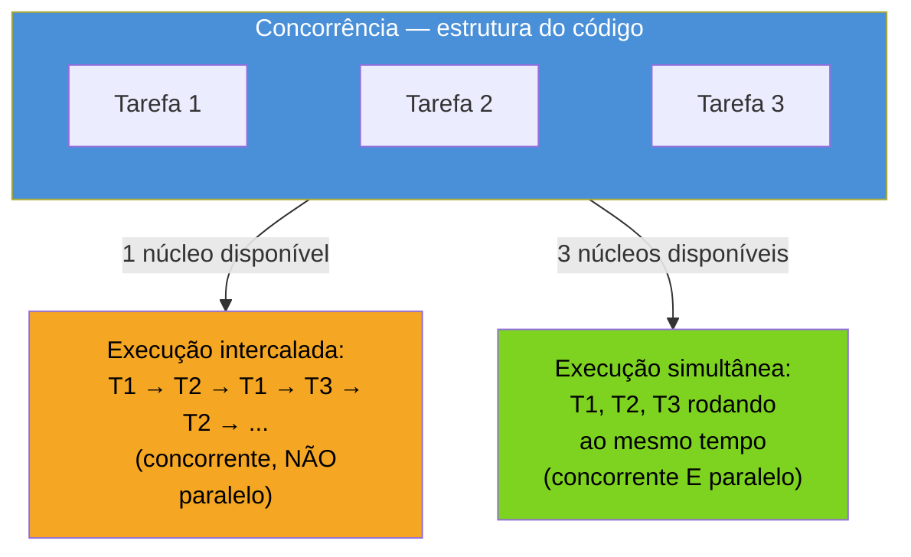
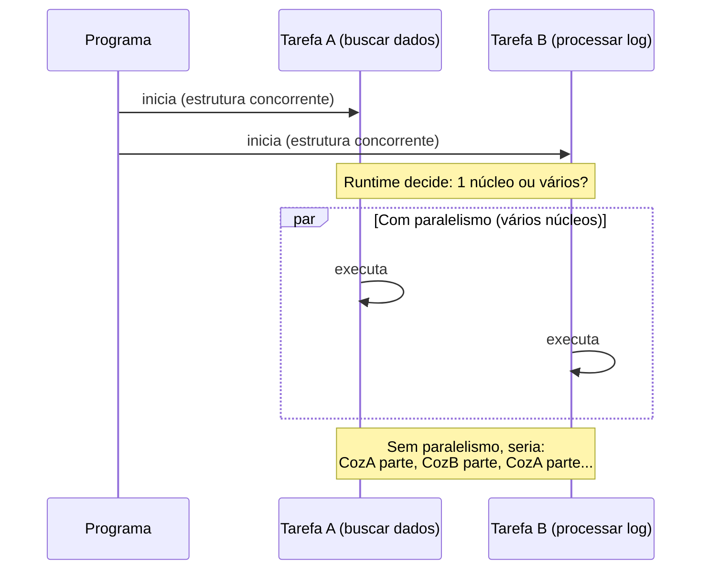

# Concorrência vs paralelismo

> [!abstract] TL;DR
> **Concorrência** é sobre *estrutura*: organizar um programa como várias tarefas independentes que progridem de forma intercalada. **Paralelismo** é sobre *execução*: rodar tarefas de fato ao mesmo tempo, em núcleos de CPU diferentes. A frase canônica é de Rob Pike, um dos criadores de Go: "concorrência é lidar com muitas coisas ao mesmo tempo; paralelismo é fazer muitas coisas ao mesmo tempo" ("Concurrency is about dealing with lots of things at once. Parallelism is about doing lots of things at once."). Um programa concorrente pode rodar em paralelo (com vários núcleos livres) ou não (num único núcleo, intercalando) — a estrutura do código não muda. Essa distinção é o alicerce mental de todo o galho: Go dá ferramentas de linguagem para *concorrência* (goroutines, channels); o *paralelismo* é uma decisão de runtime, quase sempre fora do seu controle direto.

## Um garçom, não uma linha de montagem

Imagine um único garçom cuidando de quatro mesas num restaurante. Ele não clona a si mesmo — só existe um garçom. Mas ele também não atende a mesa 1 do início ao fim antes de sequer olhar para a mesa 2. O que ele faz é: anota o pedido da mesa 1, leva à cozinha, enquanto a comida é preparada ele atende a mesa 2, serve uma bebida na mesa 3, volta para pegar o prato pronto da mesa 1, atende a mesa 4 — um fluxo constante de trocar de tarefa sempre que a tarefa atual fica bloqueada esperando algo (a cozinha, o cliente decidir o pedido, o caixa processar o pagamento).

Isso é **concorrência**: uma forma de *organizar* o trabalho em unidades independentes que se intercalam, tirando proveito dos momentos de espera de uma tarefa para avançar outra. Repare que, com um garçom só, nada acontece literalmente ao mesmo tempo — em qualquer instante, ele está fazendo exatamente uma coisa. Mas as quatro mesas progridem, todas, ao longo do tempo.

Agora imagine o mesmo restaurante com quatro garçons, um por mesa. Aí sim, em um instante qualquer, quatro coisas acontecem simultaneamente — quatro pedidos sendo anotados ao mesmo tempo, de fato. Isso é **paralelismo**: execução simultânea real, que exige recursos físicos simultâneos (quatro garçons, ou, no caso de um programa, quatro núcleos de CPU livres).

O ponto que a analogia deixa nítido: a *estrutura* do trabalho (quatro mesas, cada uma tratada como unidade independente) é a mesma nos dois cenários. O que muda é só *quantos garçons existem* para executar essa estrutura. Rob Pike formulou essa mesma ideia para software, numa palestra de 2012 que se tornou referência obrigatória em qualquer introdução a Go:

> "Concurrency is about dealing with lots of things at once. Parallelism is about doing lots of things at once." — Rob Pike, [*Concurrency is not Parallelism*](https://go.dev/blog/waza-talk)

## Por que a distinção importa de verdade

Não é jogo de palavras. A confusão entre os dois conceitos leva a decisões erradas o tempo todo — em qualquer linguagem, não só em Go:

- **"Meu programa está lento, vou paralelizar"** — se o gargalo é I/O (esperar disco, rede, banco de dados), o problema não é falta de núcleos de CPU. É estrutura: o programa está fazendo uma coisa de cada vez quando poderia estar sobrepondo esperas. A solução é *reestruturar* o código para ser concorrente — não jogar mais hardware nele.
- **"Rodei em 8 goroutines, deveria estar 8x mais rápido"** — só se a máquina tiver 8 núcleos livres *e* o trabalho for de fato paralelizável (CPU-bound, sem dependência entre as partes). Numa máquina de 1 núcleo, ou com `GOMAXPROCS=1`, 8 goroutines concorrentes ainda intercalam num garçom só — mais organizado, não mais rápido em CPU.
- **Corretude é sobre concorrência, não sobre paralelismo** — *race conditions*, deadlocks e a necessidade de sincronizar acesso a dados compartilhados existem porque o código é *concorrente* (múltiplas linhas de execução podem se intercalar de formas imprevisíveis), independente de estarem rodando em 1 núcleo ou em 32. Um bug de *race* pode acontecer até com paralelismo zero, só com a intercalação de duas goroutines num único núcleo.

Rob Pike resume a relação com uma frase que fecha o raciocínio: paralelismo é uma *possível consequência* de concorrência bem estruturada, não o objetivo em si. Um programa bem desenhado como um conjunto de tarefas concorrentes independentes ganha paralelismo de graça, sempre que o hardware oferecer núcleos livres — sem precisar reescrever nada.

O diagrama é o resumo visual do argumento inteiro: a caixa "Conc" — a estrutura em tarefas independentes — não muda. O que muda, dependendo do hardware disponível em tempo de execução, é se essas tarefas acabam intercaladas num núcleo só ou espalhadas em vários ao mesmo tempo. O mesmo código-fonte produz os dois resultados, sem alteração nenhuma.

## O modelo mental antes de qualquer código

Este galho inteiro parte de uma escolha de design que Go faz de propósito: a linguagem dá ao programador ferramentas para expressar **concorrência** — goroutines e channels — e delega a decisão de **paralelismo** para o *runtime* (o scheduler do Go, que a [[03 - O modelo GMP por cima|nota 03]] abre por dentro). Você escreve `go minhaFuncao()` para dizer "isto pode rodar de forma independente do resto"; o runtime decide, em tempo real e com base em quantos núcleos de CPU a máquina tem disponíveis (controlável via `GOMAXPROCS`), se duas goroutines vão de fato executar simultaneamente ou vão se intercalar num núcleo só.

Essa separação é o que torna Go particularmente ergonômico para concorrência: o custo de *declarar* uma tarefa concorrente é baixíssimo — uma goroutine começa com uma pilha de poucos kilobytes, muito mais barata que uma thread de sistema operacional (assunto comparativo da [[06 - Goroutines vs threads, event loop e GIL|nota 06]]) — então o hábito idiomático em Go é pensar em concorrência com naturalidade, não como otimização de último recurso. A [[02 - A goroutine — o go statement|próxima nota]] mostra a sintaxe exata que ativa esse mecanismo: uma única palavra-chave, `go`, na frente de qualquer chamada de função.

Antes de chegar lá, vale fixar o modelo mental com um exemplo sem código nenhum — só para não confundir "vai rodar ao mesmo tempo" com "está estruturado para rodar de forma independente":

O `par` do diagrama representa o que *pode* acontecer se houver núcleos livres — não o que *sempre* acontece. É exatamente essa ambiguidade controlada, resolvida pelo scheduler e não pelo programador linha a linha, que faz da concorrência em Go algo estrutural e não um detalhe de implementação espalhado pelo código.

> [!warning] "Concorrente" não significa "mais rápido"
> Reestruturar um programa em tarefas concorrentes não garante ganho de performance. Se o trabalho é puramente sequencial por natureza (cada passo depende do resultado do anterior) ou se não há núcleos livres para paralelizar, a versão concorrente pode até ficar mais lenta — o overhead de criar e coordenar goroutines existe, mesmo sendo pequeno em Go. Concorrência é uma ferramenta de *organização e aproveitamento de espera* (I/O, principalmente); paralelismo é uma ferramenta de *velocidade bruta em CPU*. Confundir os dois motivos leva a "otimizações" que só adicionam complexidade sem ganho real.

> [!question]- Quem decide se as goroutines rodam em paralelo — eu ou o Go?
> O Go, por padrão. Desde a versão 1.5 (2015), a variável `GOMAXPROCS` — que limita quantos núcleos de CPU o runtime pode usar simultaneamente para executar goroutines — vem configurada automaticamente para o número de núcleos lógicos disponíveis na máquina. Isso significa que, numa máquina de 8 núcleos, o runtime *pode* rodar até 8 goroutines em paralelo verdadeiro, sem você escrever uma linha sequer de configuração. Dá para ajustar manualmente com `runtime.GOMAXPROCS(n)` ou a variável de ambiente `GOMAXPROCS`, mas isso é ajuste fino de runtime — não faz parte de como você *estrutura* o código concorrente. A distinção de Pike continua de pé: seu programa não muda uma linha entre rodar com `GOMAXPROCS=1` e `GOMAXPROCS=8`; só o grau de paralelismo real muda.

## Por que isso vem antes de qualquer sintaxe

Pode parecer estranho passar uma nota inteira sem escrever `go func()`. É deliberado: aprender a palavra-chave `go` antes de internalizar essa distinção é o caminho mais curto para o erro mental mais comum em quem chega a Go vindo de linguagens sem concorrência leve embutida — tratar "escrevi `go minhaFuncao()`" como sinônimo de "ganhei desempenho". A [[02 - A goroutine — o go statement|próxima nota]] mostra que `go` é, na verdade, uma promessa muito mais modesta: "esta chamada pode progredir de forma independente do resto do programa". Nada nessa promessa fala sobre *quando*, em *qual núcleo*, ou *quão rápido*. Essas respostas pertencem ao scheduler — o assunto da [[03 - O modelo GMP por cima|nota 03]] — e dependem de fatores que o programador não controla linha a linha: número de núcleos, outras goroutines competindo por atenção, se a tarefa está bloqueada em I/O ou consumindo CPU.

Rob Pike ilustrou essa separação com um exemplo clássico na própria palestra de 2012: um programa que processa um conjunto de "gophers" (as tarefas) usando um número configurável de "goroutines trabalhadoras". Ele roda o *mesmo* programa, sem alterar uma linha de código, primeiro limitado a um núcleo (puramente concorrente, sem paralelismo) e depois liberado para vários núcleos (concorrente *e* paralelo) — e o ganho de velocidade aparece só na segunda execução, com hardware melhor aproveitado, não com código diferente. É a prova ao vivo de que a estrutura concorrente é uma coisa; o paralelismo obtido dela é outra, subordinada ao ambiente de execução.

## Lente cross-stack

| Vindo de... | Como o conceito aparece lá | Diferença em Go |
|---|---|---|
| **Java** | Threads de SO desde sempre; `ExecutorService`, `CompletableFuture`; desde Java 21, *virtual threads* (Project Loom) se aproximam do custo baixo das goroutines | Go teve goroutines leves desde a v1 (2012); Java só alcançou algo parecido em custo com Loom, mais de uma década depois |
| **Python** | O GIL (*Global Interpreter Lock*) impede paralelismo real de threads Python puras para código CPU-bound; `asyncio` dá concorrência via *event loop* single-threaded; `multiprocessing` é o caminho para paralelismo de fato | Go não tem GIL — goroutines podem paralelizar de verdade em múltiplos núcleos, sem processo separado. Comparação completa na [[06 - Goroutines vs threads, event loop e GIL|nota 06]] |
| **Node.js/JavaScript** | Single-threaded por padrão, concorrência via *event loop* e callbacks/`async`/`await`; paralelismo real exige *worker threads* ou processos separados | Go embute o equivalente a "múltiplos event loops cooperando com múltiplos núcleos" dentro do próprio runtime, sem você gerenciar workers manualmente |

Essa tabela é só um mapa de orientação — a [[06 - Goroutines vs threads, event loop e GIL|nota 06]] do galho aprofunda cada comparação com o rigor que ela merece.

## Como explicar em inglês

> The distinction, coined by Rob Pike, is foundational to how Go's whole concurrency model is designed: **concurrency is about dealing with lots of things at once** — structuring a program as independent tasks that can make progress out of order — while **parallelism is about doing lots of things at once** — actually executing multiple tasks simultaneously, which requires multiple CPU cores. A concurrent program may or may not run in parallel depending on available hardware; the code's structure doesn't change either way. Go gives you language-level tools for concurrency — goroutines and channels — and leaves the decision of whether (and how) that concurrency becomes parallelism to the runtime scheduler, controlled loosely via `GOMAXPROCS`. Getting this straight up front avoids a common trap: assuming that making code "concurrent" automatically makes it faster, when the real payoff of concurrency is overlapping wait time (I/O), not raw CPU throughput.

| Termo PT | Termo EN |
|---|---|
| concorrência | concurrency |
| paralelismo | parallelism |
| lidar com muitas coisas ao mesmo tempo | dealing with lots of things at once |
| fazer muitas coisas ao mesmo tempo | doing lots of things at once |
| execução intercalada | interleaved execution |
| execução simultânea | simultaneous execution |
| vinculado a I/O / limitado por CPU | I/O-bound / CPU-bound |
| escalonador / scheduler | scheduler |

## O que vem a seguir

Fixado o modelo mental — concorrência é estrutura, paralelismo é execução, e Go separa deliberadamente as duas decisões — a [[02 - A goroutine — o go statement|próxima nota]] entra no primeiro mecanismo concreto da linguagem: a *goroutine*, criada com uma única palavra-chave (`go`) na frente de qualquer chamada de função. É ali que a teoria desta nota vira sintaxe real e código que roda.

## Veja também

- [[02 - A goroutine — o go statement|02 — A goroutine — o go statement]] — próxima nota do galho
- [[03 - O modelo GMP por cima|03 — O modelo GMP por cima]] — como o scheduler decide, na prática, entre intercalar e paralelizar
- [[06 - Goroutines vs threads, event loop e GIL|06 — Goroutines vs threads, event loop e GIL]] — comparação cross-stack aprofundada
- [[03-Dominios/Tecnologia/Go/index|Trilha Go]]

## Fontes

- Pike, Rob. *Concurrency is not Parallelism* (talk "Go Concurrency Patterns", Waza 2012). go.dev. https://go.dev/blog/waza-talk (acessado em 2026-07-18)
- The Go Authors. *Effective Go — Concurrency*. go.dev. https://go.dev/doc/effective_go#concurrency (acessado em 2026-07-18)
- The Go Authors. *A Tour of Go — Concurrency*. go.dev. https://go.dev/tour/concurrency/1 (acessado em 2026-07-18)
- The Go Authors. *FAQ — Why goroutines instead of threads?*. go.dev. https://go.dev/doc/faq#goroutines (acessado em 2026-07-18)
- Go by Example. *Goroutines*. gobyexample.com. https://gobyexample.com/goroutines (acessado em 2026-07-18)
