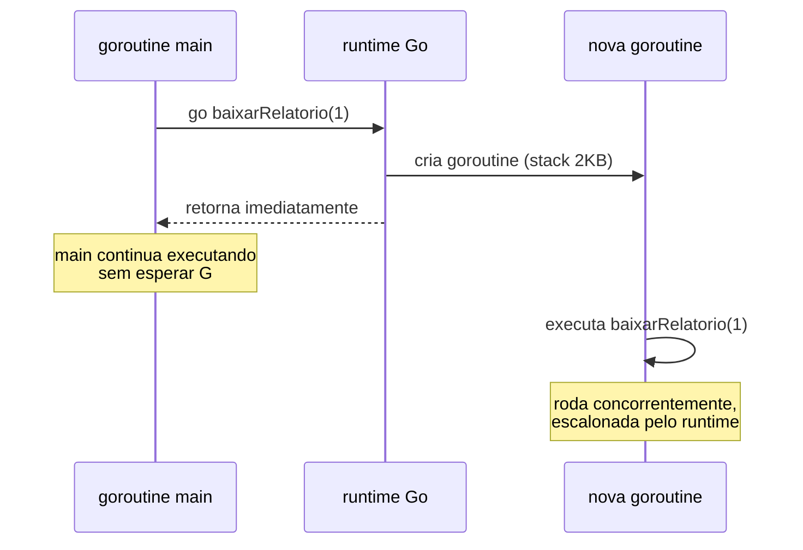
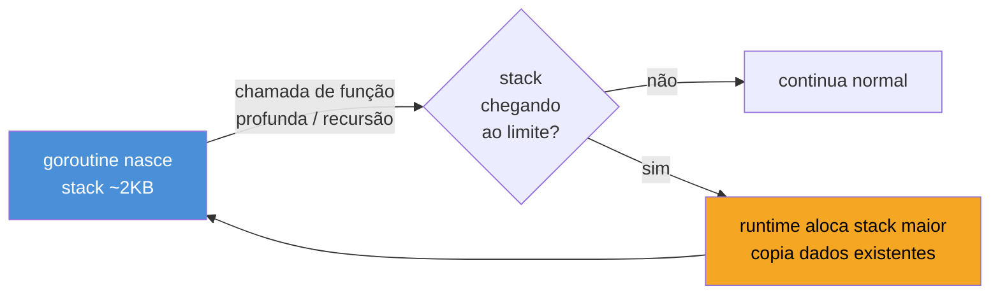
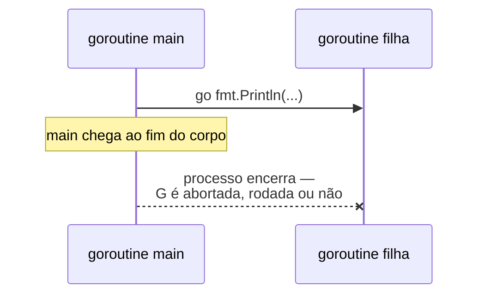

# A goroutine — o go statement

> [!abstract] TL;DR
> `go f()` transforma qualquer chamada de função numa **goroutine**: uma unidade de execução concorrente gerenciada pelo runtime do Go, não pelo sistema operacional. A palavra-chave `go` não bloqueia — dispara `f()` para rodar de forma independente e o fluxo do chamador segue em frente imediatamente. A diferença que torna isso viável em massa é o custo: uma goroutine nasce com uma stack de **2KB**, que cresce e encolhe sob demanda (contra 1-8MB fixos de uma thread de SO). É por isso que programas Go rotineiramente sobem dezenas de milhares de goroutines sem suar. Um detalhe que costuma pegar quem começa: a função `main` **também é uma goroutine** — a primeira, criada automaticamente pelo runtime — e quando ela termina, o processo inteiro morre, levando junto qualquer goroutine ainda em andamento, terminada ou não.

## O problema: uma tarefa que não pode travar as outras

Imagine uma função que baixa um relatório de um servidor lento — a chamada pode levar três segundos. Se seu programa é uma sequência de instruções, uma atrás da outra, esses três segundos são um bloqueio total: nada mais acontece enquanto a rede não responde. Numa CLI simples isso talvez seja aceitável. Num servidor web atendendo cem requisições ao mesmo tempo, é inviável — cada requisição de rede lenta congelaria as outras noventa e nove.

A saída clássica, em linguagens como Java ou Python, é abrir uma **thread do sistema operacional** para cada tarefa que pode bloquear. Funciona, mas tem um preço: cada thread do SO carrega uma stack de memória reservada de fábrica — tipicamente 1MB no Linux, podendo chegar a 8MB conforme o `ulimit` configurado — e o custo de criar/trocar de contexto entre threads passa pelo kernel, que não sabe nada sobre a lógica do seu programa. Abrir mil threads para atender mil requisições simultâneas já pesa gigabytes só de stacks reservadas, a maior parte delas ociosa.

Go ataca esse problema com uma unidade de concorrência própria, mais leve, que o runtime da linguagem gerencia sem depender do kernel para cada troca de contexto: a **goroutine**.

```go
package main

import (
	"fmt"
	"time"
)

func baixarRelatorio(id int) {
	time.Sleep(1 * time.Second) // simula I/O lento
	fmt.Println("relatório", id, "pronto")
}

func main() {
	go baixarRelatorio(1)
	go baixarRelatorio(2)
	go baixarRelatorio(3)

	fmt.Println("main segue em frente, sem esperar")
	time.Sleep(2 * time.Second) // dá tempo das goroutines terminarem
}
```

Três chamadas, três `go`, e o `main` nem piscou — a linha `fmt.Println("main segue em frente...")` roda antes de qualquer relatório ficar pronto, porque `go baixarRelatorio(n)` não bloqueia: agenda a execução e devolve o controle na hora.

## `go f()`: o que a palavra-chave realmente faz

`go` é uma **statement da linguagem**, não uma função de biblioteca — está no mesmo nível sintático de `if`, `for` ou `return`, definida na [especificação da linguagem](https://go.dev/ref/spec#Go_statements). A regra é simples de enunciar: `go` seguido de uma chamada de função (ou método, ou closure) faz essa chamada rodar como uma nova goroutine, independente da goroutine que a criou.



Dois pontos merecem destaque porque quebram intuições de quem vem de outras linguagens:

- **`go` não retorna nada que você possa usar para "esperar" a goroutine terminar.** Não há um handle, um `Thread` object, um `Future`. `go f()` é *fire-and-forget* no nível da sintaxe — se você precisa saber quando `f()` terminou, ou pegar um valor de volta, isso é responsabilidade sua, via canais ou `sync.WaitGroup` (mecanismos das próximas notas, não desta).
- **A chamada precisa ser uma chamada de função de verdade.** `go f()` funciona; `go f` (sem parênteses) não compila. Os argumentos de `f` são avaliados **imediatamente**, no momento em que o `go` statement executa — só a *execução do corpo* de `f` é que fica agendada para depois, na nova goroutine. Isso importa porque evita uma armadilha clássica: se `f` recebe uma variável de loop por valor, o valor capturado é o de *agora*, não o que a variável tiver quando a goroutine finalmente rodar.

> [!info] Loop variables por goroutine, desde Go 1.22
> Até Go 1.21, disparar `go func() { fmt.Println(i) }()` dentro de um `for i := range n` era uma armadilha manual clássica: todas as goroutines compartilhavam a *mesma* variável `i`, reciclada a cada iteração, e o valor visto lá dentro dependia de quando o scheduler decidisse rodar cada uma. Desde o [Go 1.22](https://go.dev/blog/loopvar-preview), cada iteração de `for` cria uma variável nova — o problema desaparece por padrão para código escrito com `for i := range` ou `for i := 0; i < n; i++`. A nota 07 deste galho (Magus) volta a esse tópico com o detalhe fino de quando ele ainda pode te morder.

## Por que dá para abrir milhares delas: o custo de uma goroutine

A resposta curta é: porque uma goroutine não é uma thread do sistema operacional. É uma estrutura de dados leve — o runtime chama de `g` internamente — que o **scheduler do Go**, rodando em espaço de usuário, multiplexa sobre um número pequeno de threads reais do SO. (Como esse escalonamento funciona por dentro — o modelo GMP — é o assunto completo da próxima nota deste galho; aqui importa só o efeito no custo.)

O detalhe que faz a diferença prática é a **stack**:

| | Thread do SO | Goroutine |
|---|---|---|
| Stack inicial | fixa, ~1-8MB (`ulimit -s`) | **~2KB**, alocada dinamicamente |
| Crescimento | fixo desde a criação | cresce e encolhe sob demanda, em runtime |
| Quem gerencia | kernel do SO | runtime do Go (scheduler em espaço de usuário) |
| Custo de criar | syscall, cara | alocação de struct + stack pequena, barata |
| Ordem de grandeza viável | milhares (memória e contexto do kernel viram gargalo) | **centenas de milhares**, rotineiramente |

Uma thread de SO reserva sua stack inteira no momento da criação porque o kernel não tem como saber, de antemão, quanto espaço aquela thread vai precisar — reservar pouco e estourar seria catastrófico, então o padrão é reservar generosamente. Uma goroutine faz o oposto: nasce pequena (documentação do runtime cita historicamente 2KB desde as versões antigas do Go, valor que a implementação pode ajustar mas que se mantém na ordem de poucos KB) e o runtime **detecta quando ela está perto de estourar a stack atual e realoca uma maior**, copiando os dados — um mecanismo de *segmented/growable stacks* que não existe para threads do SO, presas ao tamanho decidido na criação.



Esse crescimento sob demanda é o que torna abrir 10.000 goroutines algo rotineiro em Go — 10.000 × 2KB são só ~20MB, uma fração do que 10.000 threads de SO custariam em stacks reservadas (potencialmente dezenas de gigabytes, mesmo que a maioria nunca use quase nada da stack alocada). Some a isso que criar uma goroutine não passa por uma syscall — é trabalho interno do runtime — e trocar de contexto entre goroutines é ordens de magnitude mais barato que uma troca de contexto de thread pelo kernel.

> [!warning] Barata não é grátis
> "Milhares de goroutines" não significa "goroutines não custam nada". Cada uma ainda ocupa memória (mesmo que pouca) e ainda precisa ser escalonada. Disparar uma goroutine por item numa lista de um milhão de elementos, sem nenhum controle de quantas rodam ao mesmo tempo, ainda pode esgotar memória ou saturar o scheduler — o problema muda de escala (de "milhares" pra "impraticável"), não desaparece. Limitar concorrência com um *worker pool* continua sendo uma prática real em Go; o assunto completo — quando (não) abrir uma goroutine — é a nota 08 (Magus) deste galho.

## `main` é uma goroutine — e a primeira a morrer mata todas as outras

Aqui está o detalhe que mais surpreende quem escreve seu primeiro programa concorrente em Go e não vê nenhum output das goroutines disparadas: o runtime cria automaticamente **uma goroutine para rodar `func main()`** assim que o programa inicia. Não é uma metáfora — é literalmente como o runtime trata `main`: mais uma goroutine, só que a primeira, e com um poder especial que nenhuma outra tem.

```go
package main

import "fmt"

func main() {
	go fmt.Println("alguém está me escutando?")
	// main termina aqui, imediatamente —
	// a goroutine acima pode nem ter chegado a rodar
}
```

Rode esse programa algumas vezes: na maioria das execuções, **nada é impresso**. `main` dispara a goroutine e, na sequência, chega ao fim do seu próprio corpo — e quando a goroutine `main` termina, o processo inteiro é encerrado pelo runtime, sem esperar nenhuma outra goroutine terminar, tenha ela rodado um microssegundo ou nem começado.



Essa não é uma peculiaridade obscura — é a regra oficial da especificação: "program execution begins by initializing the main package and then invoking the function `main`. When that function invocation returns, the program exits. It does not wait for other (non-`main`) goroutines to complete." O processo Go não tem um mecanismo automático de "esperar todo mundo terminar antes de sair" — isso é responsabilidade explícita de quem escreve o programa, tipicamente com um `sync.WaitGroup` (nota do Galho 9) ou coordenação via canal (Galho 8).

> [!warning] "Não vi nada impresso" quase sempre é isso
> Se você escreveu `go algumaCoisa()` e a saída esperada simplesmente não aparece, a primeira suspeita não deveria ser "tem bug na função" — é "`main` terminou antes da goroutine rodar". É a armadilha número um de quem escreve a primeira goroutine da vida. O `time.Sleep` usado nos exemplos desta nota é um paliativo didático — nunca a solução real em código de produção, porque não há garantia nenhuma de que o sleep seja tempo suficiente (e, se for exagerado, desperdiça tempo real de execução à toa). A ferramenta certa para sincronizar sem adivinhar tempo é assunto das próximas notas.

## Casos práticos

**1. Provando o custo baixo na prática** — disparar dezenas de milhares de goroutines e observar `runtime.NumGoroutine()` contar todas elas vivas ao mesmo tempo:

```go
package main

import (
	"fmt"
	"runtime"
	"sync"
)

func main() {
	const total = 50_000
	var wg sync.WaitGroup
	wg.Add(total)

	for i := 0; i < total; i++ {
		go func() {
			defer wg.Done()
			_ = 1 + 1 // trabalho mínimo, só para existir
		}()
	}

	fmt.Println("goroutines em voo (aprox):", runtime.NumGoroutine())
	wg.Wait() // espera todas terminarem — mecanismo detalhado no Galho 9
	fmt.Println("todas as", total, "goroutines terminaram")
}
```

Cinquenta mil goroutines, cada uma com sua própria stack inicial de ~2KB, cabem tranquilamente na memória de qualquer máquina de desenvolvimento — um teste equivalente com 50.000 threads de SO reais provavelmente esgotaria os *limits* do sistema operacional antes mesmo de todas serem criadas. (O `sync.WaitGroup` usado aqui para esperar as goroutines terminarem é a ferramenta certa mencionada no callout anterior — assunto completo do Galho 9; aqui ele só evita que `main` termine antes de contar o resultado.)

**2. `main` sobrevivendo o suficiente para ver o resultado**, a correção do exemplo problemático anterior:

```go
package main

import (
	"fmt"
	"sync"
)

func main() {
	var wg sync.WaitGroup
	wg.Add(1)

	go func() {
		defer wg.Done()
		fmt.Println("agora sim, alguém está escutando")
	}()

	wg.Wait() // main espera de verdade, sem adivinhar tempo com Sleep
}
```

A diferença para o exemplo da seção anterior não é sutil: em vez de `main` seguir em frente cegamente, `wg.Wait()` bloqueia até a goroutine chamar `wg.Done()` — determinístico, sem depender de quanto tempo um `time.Sleep` arbitrário levaria para ser "suficiente".

## Como isso se compara a outros modelos que você já conhece

| Vindo de... | Modelo de concorrência | Como se compara à goroutine |
|---|---|---|
| Java | `Thread` / `ExecutorService` | Thread do SO, cara (~1MB), gerenciada pelo kernel; goroutine é ordens de magnitude mais leve e gerenciada pelo runtime Go |
| Python | `threading.Thread` | Sofre do GIL — só uma thread Python executa bytecode por vez; goroutines rodam de verdade em paralelo em múltiplos núcleos (sem GIL) |
| Node.js | *event loop* single-threaded, `async/await` | Node não abre "threads" para sua lógica — uma goroutine é mais parecida com uma *task* agendada, mas com stack própria e sem precisar reescrever tudo em `async` |
| JavaScript (Web Worker) | Worker isolado, sem memória compartilhada | Goroutines compartilham memória livremente (e por isso precisam de disciplina — canais, mutex) |

Essa tabela é só um mapa inicial — a nota 06 (Adepto) deste galho aprofunda cada comparação, inclusive o porquê técnico de threads serem caras e o efeito real do GIL do Python.

## Como explicar em inglês

> The `go` statement is Go's primitive for concurrency: `go f()` schedules `f()` to run as a new **goroutine** — a lightweight, runtime-managed unit of execution — and returns control to the caller immediately, without waiting for `f()` to finish. Unlike an OS thread, which reserves a fixed 1-8MB stack up front, a goroutine starts with a stack of roughly **2KB** that grows and shrinks on demand, which is why Go programs routinely spin up tens of thousands of goroutines without a second thought. One detail trips up almost everyone writing their first concurrent Go program: `main` itself runs as a goroutine — the first one, created automatically by the runtime — and when it returns, the whole process exits immediately, without waiting for any other goroutine to finish.

| Termo PT | Termo EN |
|---|---|
| goroutine | goroutine |
| declaração go / go statement | go statement |
| pilha de execução | stack |
| pilha que cresce sob demanda | growable stack |
| escalonador | scheduler |
| disparar (uma goroutine) | spawn |
| fire-and-forget | fire-and-forget |
| troca de contexto | context switch |
| espaço de usuário | user space |

## O que vem a seguir

Esta nota tratou a goroutine como uma caixa-preta: `go f()` cria uma, ela é barata, e o runtime cuida do resto. Mas "o runtime cuida do resto" esconde uma peça de engenharia real — como um número pequeno de threads de SO consegue escalonar centenas de milhares de goroutines sem que cada uma delas precise de uma thread própria. A [[03 - O modelo GMP por cima|nota 03]] abre essa caixa: os três atores do scheduler do Go — Goroutines, Machines (threads de SO) e Processors — e como eles se encaixam para tornar essa multiplexação possível.

## Veja também

- [[01 - Concorrência vs paralelismo|01 — Concorrência vs paralelismo]] — a distinção conceitual que esta nota pressupõe, antes de entrar no mecanismo concreto
- [[03 - O modelo GMP por cima|03 — O modelo GMP por cima]] — próxima nota: como o scheduler multiplexa goroutines sobre threads reais
- [[04 - O ciclo de vida de uma goroutine|04 — O ciclo de vida de uma goroutine]] — os estados possíveis de uma goroutine depois de criada
- [[06 - Goroutines vs threads, event loop e GIL|06 — Goroutines vs threads, event loop e GIL]] — aprofunda a tabela comparativa desta nota
- [[07 - Armadilhas — leaks e loop var|07 — Armadilhas — leaks e loop var]] — o detalhe fino da captura de variável de loop mencionado no callout de Go 1.22
- [[03-Dominios/Tecnologia/Go/index|Trilha Go]]

## Fontes

- The Go Authors. *The Go Programming Language Specification — Go statements*. go.dev. https://go.dev/ref/spec#Go_statements (acessado em 2026-07-18)
- The Go Authors. *The Go Programming Language Specification — Program initialization and execution*. go.dev. https://go.dev/ref/spec#Program_execution (acessado em 2026-07-18)
- The Go Authors. *A Tour of Go — Goroutines*. go.dev. https://go.dev/tour/concurrency/1 (acessado em 2026-07-18)
- The Go Authors. *Effective Go — Goroutines*. go.dev. https://go.dev/doc/effective_go#goroutines (acessado em 2026-07-18)
- The Go Authors. *Fixing For Loops in Go 1.22*. go.dev/blog. https://go.dev/blog/loopvar-preview (acessado em 2026-07-18)
- Go by Example. *Goroutines*. gobyexample.com. https://gobyexample.com/goroutines (acessado em 2026-07-18)
