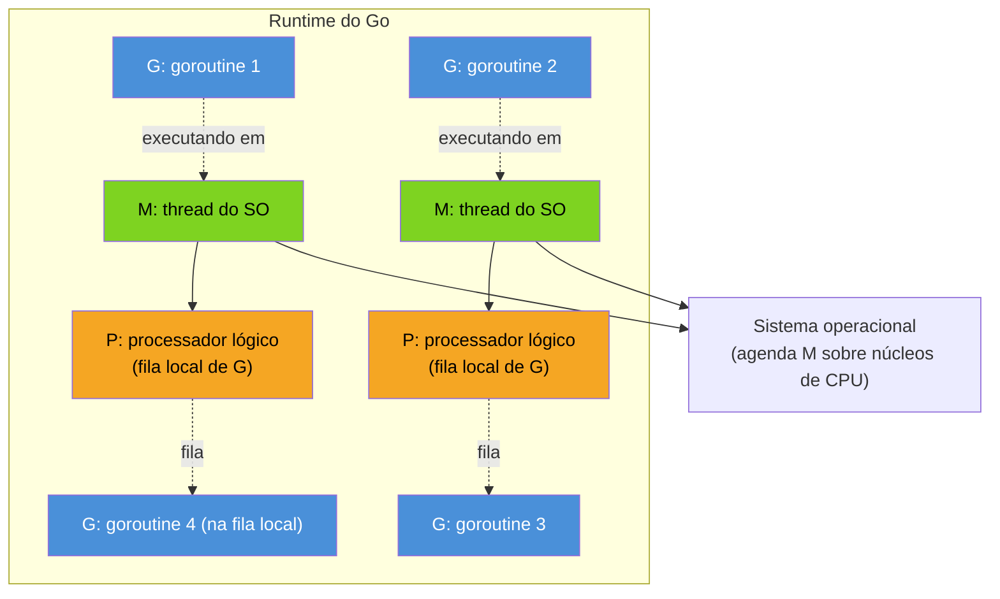
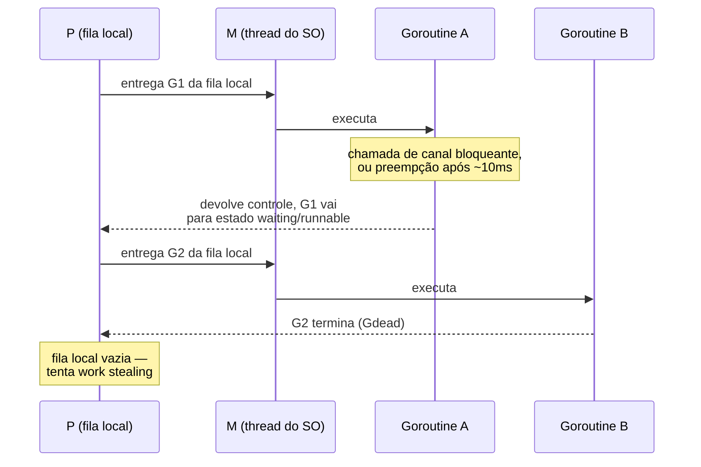
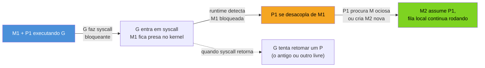

# O modelo GMP por cima

> [!abstract] TL;DR
> A nota anterior mostrou que `go f()` lança uma goroutine em microssegundos, não milissegundos. Isso só é possível porque o runtime do Go não pede uma thread do sistema operacional para cada goroutine — ele multiplexa milhares de goroutines sobre um punhado de threads, usando um scheduler próprio, cooperativo-com-preempção, escrito em Go. O modelo tem três siglas: **G** (goroutine — a unidade de trabalho), **M** (*machine*, uma thread real do SO) e **P** (*processor*, um processador lógico que serve de ponte entre G e M, com sua própria fila local de goroutines prontas). `GOMAXPROCS` controla quantos P existem — por padrão, o número de CPUs lógicas disponíveis. Quando a fila de um P esvazia, ele rouba trabalho da fila de outro P (*work stealing*), em vez de ficar ocioso. Esta nota fica na visão de topo; o mecanismo fino de preempção e as filas de execução completas são assunto do Galho 17.

## O problema que o GMP resolve

Imagine um servidor HTTP em Go atendendo 50 mil conexões simultâneas, cada uma numa goroutine própria — padrão comum e recomendado nesta linguagem, como a nota anterior já defendeu. Se o runtime mapeasse cada goroutine para uma thread do SO (modelo 1:1, o que Java fazia antes das *virtual threads* do Project Loom, e o que Node.js nunca fez por não ter threads de aplicação), o sistema operacional teria 50 mil threads para agendar. Cada uma consome alguns megabytes de stack por padrão, e trocar de contexto entre threads do SO passa pelo kernel — uma operação cara, na casa de microssegundos, multiplicada por dezenas de milhares.

Go escolhe outro caminho: um modelo **M:N**, onde M goroutines (o "muitas" da fórmula) rodam sobre N threads do SO (o "poucas"). A relação não é fixa nem 1:1 — é o scheduler do runtime que decide, a cada instante, quais goroutines ocupam quais threads. Essa decisão de design é o que permite `go f()` custar microssegundos e uma goroutine ociosa custar ~2KB de stack (a nota anterior já mediu isso), em vez de megabytes.

Para orquestrar esse mapeamento, o runtime precisa de três peças, não duas. Só G e M já dariam um scheduler M:N funcional — é o que Go tinha até a versão 1.0. Mas um scheduler M:N ingênuo, com goroutines competindo direto por acesso a uma fila global de trabalho, sofre de contenção de lock brutal sob carga: toda thread que precisa de uma goroutine nova disputa o mesmo mutex. A solução, desenhada por Dmitry Vyukov e adotada a partir do Go 1.1, foi introduzir uma terceira peça — o **P** — que dá a cada thread ativa sua própria fila local, quase sem contenção.

## As três siglas



- **G (goroutine)** — a unidade de trabalho: uma pilha própria (que cresce e encolhe, como a nota anterior detalhou), um ponto de execução, e o código que a `go` statement lançou. Existem tipicamente aos milhares; são baratas de criar e destruir porque vivem inteiramente no espaço do runtime, sem envolver o kernel.
- **M (*machine*)** — uma thread real do sistema operacional, a mesma `pthread` (Linux/macOS) ou thread nativa (Windows) que qualquer outra linguagem usaria. É a única das três peças que o SO efetivamente agenda sobre um núcleo de CPU. Uma M só executa código Go quando está associada a um P; sem P, ela fica bloqueada ou entregue a uma chamada de sistema.
- **P (*processor*, processador lógico)** — não é uma CPU física, é um recurso do runtime: um contexto de execução que uma M precisa "segurar" para rodar goroutines. Cada P carrega uma **fila local** (*run queue*) de goroutines prontas para rodar, além de recursos como o alocador de memória local (*mcache*) — outro motivo para ter P: reduzir contenção também na alocação, não só no scheduling. O número de P é controlado por `GOMAXPROCS`.

A regra central do modelo: **para uma M executar código Go, ela precisa estar de posse de um P**. Isso é o que limita o paralelismo real — quantas goroutines podem rodar código Go *simultaneamente*, em núcleos diferentes, ao mesmo tempo — ao número de P, não ao número de goroutines nem ao número de M (que pode crescer bem além de `GOMAXPROCS`, como a seção de syscalls bloqueantes mostra adiante).

> [!question]- Por que não simplesmente uma thread do SO por núcleo de CPU e ponto final — pra que o P?
> Porque nem toda M fica sempre executando código Go puro. Quando uma goroutine faz uma chamada de sistema bloqueante — ler um arquivo com uma API que não seja não-bloqueante, por exemplo — a M correspondente fica presa esperando o kernel, sem poder rodar mais nenhuma goroutine nesse meio-tempo. Se o número de M fosse travado ao número de núcleos, uma única goroutine bloqueada em I/O travaria a capacidade de processamento inteira. Separar P de M permite que o runtime **destaque o P daquela M bloqueada e entregue a outra M** — criando uma nova se precisar — para que as demais goroutines na fila continuem rodando. P é o recurso escasso e fixo (por `GOMAXPROCS`); M é elástico, criado e destruído conforme a demanda de threads bloqueadas.

## `GOMAXPROCS`: quantos P existem

`GOMAXPROCS` é o parâmetro que fixa o número de P — e, por extensão, o teto de goroutines executando **código Go em paralelo verdadeiro** em um instante qualquer. Desde o Go 1.5, o valor padrão é `runtime.NumCPU()`: o número de CPUs lógicas que o SO reporta como disponíveis para o processo (antes disso, o padrão era 1 — um detalhe histórico que ainda aparece em código antigo escrito "pra garantir", com `runtime.GOMAXPROCS(runtime.NumCPU())` explícito logo no `main`, hoje redundante).

```go
package main

import (
	"fmt"
	"runtime"
)

func main() {
	fmt.Println("GOMAXPROCS atual:", runtime.GOMAXPROCS(0))
	fmt.Println("CPUs lógicas:", runtime.NumCPU())

	// Reduzir para 1 força todas as goroutines a se revezarem
	// num único P — útil para reproduzir bugs de concorrência
	// que só aparecem sob paralelismo real, ao inverso.
	anterior := runtime.GOMAXPROCS(1)
	fmt.Println("GOMAXPROCS anterior:", anterior)
}
```

`runtime.GOMAXPROCS(0)` é o idioma para *ler* o valor atual sem alterá-lo — passar `0` significa "não mude nada, só me diga o que está configurado". Passar um número positivo muda o valor e retorna o anterior.

> [!info] `GOMAXPROCS` respeitando cgroups desde o Go 1.5, e a lacuna que sobrou até o Go 1.25
> Historicamente, `runtime.NumCPU()` refletia as CPUs da máquina física ou da VM inteira — não o limite de CPU que um *cgroup* do Kubernetes ou Docker impõe ao container. Um pod limitado a `cpu: "2"` rodando numa máquina de 32 núcleos calculava `GOMAXPROCS = 32`, criava P demais para a fatia de CPU real disponível, e sofria *throttling* sob carga. A correção veio em duas etapas: o pacote `go.uber.org/automaxprocs` (biblioteca de terceiros, adotada amplamente em produção) resolvia isso manualmente há anos; o **Go 1.25** trouxe a mesma lógica embutida no runtime — `GOMAXPROCS` agora respeita o *cpu quota* do cgroup automaticamente, sem precisar de biblioteca externa. Vale checar a versão do runtime em produção antes de assumir esse comportamento.

Mudar `GOMAXPROCS` não muda o número de goroutines possíveis — isso continua limitado só por memória, potencialmente milhões. Muda quantas delas podem estar **executando instruções de CPU ao mesmo tempo**. Uma goroutine bloqueada em `time.Sleep` ou esperando um canal não ocupa P nenhum — ela sai da fila de execução e só volta quando o evento que ela espera acontece, deixando o P livre para outra goroutine da fila.

`runtime.NumGoroutine()` e `runtime.GOMAXPROCS(0)` respondem a perguntas diferentes, e confundi-las é um erro comum de quem está lendo métricas de um serviço em produção pela primeira vez: o primeiro conta **quantas G existem no momento** (rodando, prontas ou bloqueadas — geralmente muito mais que o número de núcleos, porque a maioria está esperando I/O); o segundo diz **quantas podem rodar código Go em paralelo agora**. Um serviço saudável, sob carga de I/O pesada, costuma ter `NumGoroutine()` na casa dos milhares e `GOMAXPROCS` de um dígito — e isso é o esperado, não um sinal de problema.

## Como o scheduler multiplexa G sobre M

O ciclo básico, para uma M com um P associado: pegar a próxima G pronta da fila local do P, executá-la até ela ceder o controle (voluntária ou involuntariamente), repetir.



Uma goroutine cede o controle de várias formas, e a diferença entre elas é o que separa Go de um scheduler puramente cooperativo:

- **Voluntariamente**, em pontos que o próprio runtime instrumenta: uma chamada de canal que bloqueia (`ch <- v` ou `<-ch` sem valor pronto do outro lado), uma chamada a `time.Sleep`, uma alocação que dispara garbage collection, ou uma chamada de sistema.
- **Por preempção assíncrona**, desde o **Go 1.14**. Antes disso, uma goroutine com um laço apertado sem chamada de função nem alocação — `for { x++ }` — podia monopolizar seu M indefinidamente, porque o scheduler só conseguia interromper goroutines em pontos de checagem que o compilador inseria em chamadas de função (*safe points*). O Go 1.14 passou a usar sinais do SO (`SIGURG` no Linux) para forçar a troca mesmo dentro de laços sem chamada nenhuma — o runtime monitora goroutines rodando há mais de ~10ms e as interrompe à força. Isso fechou uma classe inteira de bugs de "uma goroutine trava o programa inteiro" que existia nas versões anteriores.

O ponto para reter: você não gerencia esse ciclo. Não existe `yield()` que o desenvolvedor Go chame manualmente no dia a dia (existe `runtime.Gosched()`, mas é raro e quase sempre desnecessário). O scheduler decide quando trocar, e as versões recentes do Go tornaram essa decisão robusta o suficiente para não depender da boa educação do código de cada goroutine.

## Syscalls bloqueantes: quando M se desacopla de P

A situação mais reveladora do papel de P aparece quando uma goroutine faz uma chamada de sistema que bloqueia de verdade — leitura de arquivo em disco sem I/O assíncrono, por exemplo (chamadas de rede não entram aqui: o runtime as trata via um poller de rede não-bloqueante interno, sem prender a M — assunto que volta com mais detalhe no Galho 17).



Quando o runtime detecta que uma M está prestes a entrar (ou já entrou) numa chamada de sistema bloqueante, ele destaca o P daquela M e o entrega a outra M — reaproveitando uma que esteja ociosa, ou criando uma nova via `clone`/`CreateThread` se não houver nenhuma disponível. Isso é o motivo pelo qual o número de M num processo Go pode facilmente superar `GOMAXPROCS` — dezenas ou centenas de threads podem existir, a maioria dormindo, esperando ou presa em syscalls, enquanto só `GOMAXPROCS` delas efetivamente seguram um P e executam código Go num dado instante.

Quando a syscall retorna, a goroutine tenta recuperar um P — o mesmo que tinha, se ainda estiver livre, ou qualquer outro disponível na lista de P ociosos. Se nenhum P estiver livre, a goroutine volta para uma fila global e espera sua vez, e a M que a executava geralmente vai para um pool de threads ociosas, disponível para a próxima syscall bloqueante que aparecer.

## A fila global: reserva além das filas locais

Além da fila local de cada P, o runtime mantém uma **fila global** — uma só, compartilhada por todos os P, protegida por um lock (o preço de contenção que a fila local existe justamente para evitar no caminho comum). Goroutines chegam à fila global em algumas situações específicas: quando uma goroutine que estava numa syscall bloqueada retorna e não encontra P livre; quando `go f()` é chamado a partir de código que não está rodando "dentro" do runtime de uma goroutine gerenciada (por exemplo, a primeira goroutine do programa, `main`, ou uma chamada vinda de código cgo); ou quando o runtime decide balancear a fila local que cresceu grande demais, movendo parte dela para a global.

O scheduler consulta a fila global com prioridade mais baixa que a fila local — mas não zero: para evitar que uma goroutine na fila global espere indefinidamente enquanto todo P só olha para sua própria fila, o runtime a checa periodicamente (a cada ~61 execuções de goroutine locais, um número escolhido deliberadamente não-redondo para evitar sincronização acidental entre P). Só depois de esgotar fila local, fila global e a tentativa de work stealing é que um P efetivamente entra em estado ocioso.

## Work stealing: nivelando a carga entre P

Com `GOMAXPROCS` P, cada um com fila própria, surge um problema óbvio de balanceamento: e se um P termina sua fila local rápido, enquanto outro está afogado em goroutines? Sem correção, esse P ficaria ocioso enquanto trabalho esperava em outra fila — desperdiçando paralelismo disponível.

A resposta é **work stealing**: um P com a fila local vazia, antes de ficar ocioso, tenta "roubar" metade das goroutines da fila de outro P escolhido aleatoriamente. Se não encontrar nada para roubar em nenhum P, ele checa a fila global (compartilhada, usada como reserva geral) e o poller de rede, e só então entra em estado ocioso de verdade.

```go
package main

import (
	"fmt"
	"runtime"
	"sync"
)

func main() {
	runtime.GOMAXPROCS(4) // 4 P — força o cenário a ficar visível

	var wg sync.WaitGroup

	// Uma goroutine que satura sua fila local com trabalho
	// desbalanceado: outras goroutines ociosas nos demais P
	// eventualmente roubam parte dessa carga.
	for i := 0; i < 1000; i++ {
		wg.Add(1)
		go func(n int) {
			defer wg.Done()
			soma := 0
			for j := 0; j < 100_000; j++ {
				soma += j
			}
			_ = soma
		}(i)
	}

	wg.Wait()
	fmt.Println("1000 goroutines concluídas via GMP + work stealing")
}
```

Não há como observar o *roubo* em si sem instrumentação do runtime — mas o resultado prático é que, mesmo com trabalho distribuído de forma desigual entre as goroutines lançadas, os 4 P tendem a terminar próximos um do outro no tempo, em vez de um P carregar o fardo todo enquanto os demais ficam ociosos.

Para de fato *ver* o scheduler em ação, sem precisar instrumentar código nenhum, o runtime aceita uma variável de ambiente que imprime um resumo periódico em stderr:

```bash
GODEBUG=schedtrace=1000 go run main.go
```

Cada linha de saída — uma a cada 1000ms, por causa de `schedtrace=1000` — mostra contadores como `gomaxprocs`, `idleprocs` (P ociosos naquele instante), `threads` (total de M vivas) e `runqueue` (tamanho da fila global). Rodar o exemplo acima com essa variável ligada deixa visível, ao vivo, o número de M crescendo além de `GOMAXPROCS` se alguma goroutine tocar I/O bloqueante, e o número de P ociosos oscilando conforme o trabalho se equilibra entre as filas — a mesma dinâmica descrita nos diagramas desta nota, só que como números reais em vez de teoria.

> [!warning] Work stealing não é grátis nem instantâneo
> Roubar trabalho envolve sincronização entre P — não é uma operação de custo zero. O scheduler só tenta roubar quando um P realmente fica sem nada para fazer, não a cada troca de goroutine; e a decisão de "quanto roubar" (metade da fila alvo) e "de quem roubar" (escolha pseudoaleatória entre os P) são heurísticas afinadas ao longo de várias versões do Go, não uma garantia matemática de balanceamento perfeito. Para a maioria do código de aplicação isso é irrelevante — é otimização que só importa em cargas de CPU muito pesadas e desbalanceadas, o tipo de cenário que o Galho 17 cobre com profiling real.

> [!warning] GMP não é mágica contra trabalho de CPU real
> Ter 100 mil goroutines não faz 100 mil coisas acontecerem em paralelo se `GOMAXPROCS` for 4 e todas as goroutines forem CPU-bound (sem I/O, sem chamadas bloqueantes). Nesse cenário, o GMP ainda ajuda — a preempção garante que nenhuma goroutine monopolize um P para sempre — mas o paralelismo real continua limitado a 4 execuções simultâneas. GMP resolve o problema de *agendamento barato de muitas unidades de trabalho*; não multiplica a capacidade de processamento da máquina. Trabalho pesado de CPU se beneficia de paralelismo real (`GOMAXPROCS` alto, poucas goroutines por núcleo); trabalho I/O-bound se beneficia de concorrência alta (muitas goroutines, a maioria bloqueada esperando, poucas de fato competindo por P).

## Lente cross-stack

| Vindo de... | Modelo de concorrência | Equivalente ao P do Go |
|---|---|---|
| **Java** (pré-Loom) | 1:1 — cada `Thread` é uma thread do SO | Não existe; o SO agenda direto. *Virtual threads* (Java 21+) reintroduzem um modelo M:N parecido, com um `ForkJoinPool` de *carrier threads* fazendo papel parecido com M |
| **Node.js** | Single-threaded, event loop + libuv para I/O | Não existe P nem M múltiplos para JS de aplicação — um único thread de execução JS; paralelismo real só via *worker threads* separadas |
| **Python** (CPython) | Threads do SO, mas serializadas pelo GIL para bytecode Python | Não existe; o GIL faz o papel de "um P só" para código Python puro, mesmo com várias threads do SO vivas — comparação que a próxima nota da trilha aprofunda |
| **Go** | M:N via GMP | P é o recurso central: fila local + contexto de execução que M precisa segurar |

A comparação mais precisa é com as *virtual threads* do Project Loom (Java 21+): ambas multiplexam muitas unidades leves de trabalho sobre poucas threads do SO, e ambas lidam com o mesmo problema de "o que fazer quando uma unidade bloqueia numa syscall". A diferença de maturidade é grande — o GMP do Go é produção desde 2012 (Go 1.1) e passou por revisões profundas (preempção assíncrona no 1.14, cgroup-aware `GOMAXPROCS` no 1.25); virtual threads é tecnologia mais nova, ainda estabilizando idiomas de uso na comunidade Java.

## Como explicar em inglês

> Go's scheduler multiplexes many lightweight **goroutines (G)** onto a small number of OS **threads (M)**, using **logical processors (P)** as the bridge between them — an M:N threading model, not the 1:1 mapping most languages use. Each P holds a local run queue of ready goroutines; the number of P is fixed by `GOMAXPROCS`, which defaults to the number of logical CPUs available (and, since Go 1.25, respects cgroup CPU quotas automatically). An M can only execute Go code while holding a P — that's the hard cap on real parallelism at any instant. When a goroutine makes a blocking syscall, the runtime detaches its P from that M and hands the P to another M, so the rest of the run queue keeps making progress; this is why a Go process can have far more M than `GOMAXPROCS`. When a P's local queue runs dry, it steals half the queue from another P chosen at random — work stealing — before going idle. Preemption has been asynchronous since Go 1.14, using OS signals to interrupt goroutines running longer than ~10ms even inside tight loops with no function calls, closing a whole class of "one goroutine hangs everything" bugs that existed in earlier versions.

| Termo PT | Termo EN |
|---|---|
| goroutine | goroutine (G) |
| thread do sistema operacional | OS thread (M / *machine*) |
| processador lógico | logical processor (P) |
| fila local de execução | local run queue |
| roubo de trabalho | work stealing |
| preempção assíncrona | asynchronous preemption |
| chamada de sistema bloqueante | blocking syscall |
| ponto seguro (de checagem) | safe point |

## O que vem a seguir

Esta nota mostrou como o runtime distribui goroutines sobre threads — mas não como uma goroutine individual nasce, passa por estados intermediários e morre. A [[04 - O ciclo de vida de uma goroutine|nota 04]] entra nesse ciclo: os estados que uma G percorre (*runnable*, *running*, *waiting*, *dead*), o que dispara cada transição, e como isso se conecta ao que o scheduler GMP acabou de mostrar por cima.

## Veja também

- [[02 - A goroutine — o go statement|02 — A goroutine — o go statement]] — como `go f()` lança a unidade de trabalho que o GMP agenda
- [[04 - O ciclo de vida de uma goroutine|04 — O ciclo de vida de uma goroutine]] — próxima nota, os estados de uma G
- [[06 - Goroutines vs threads, event loop e GIL|06 — Goroutines vs threads, event loop e GIL]] — aprofunda a comparação cross-stack introduzida aqui
- [[03-Dominios/Tecnologia/Go/index|Trilha Go]]

## Fontes

- The Go Authors. *Go's work-stealing scheduler* (blog post explicando o design GMP). go.dev. https://go.dev/blog/go-scheduler-work-stealing (acessado em 2026-07-18)
- The Go Authors. *runtime package — GOMAXPROCS*. pkg.go.dev. https://pkg.go.dev/runtime#GOMAXPROCS (acessado em 2026-07-18)
- The Go Authors. *Go 1.14 Release Notes — asynchronous preemption*. go.dev. https://go.dev/doc/go1.14 (acessado em 2026-07-18)
- The Go Authors. *Go 1.25 Release Notes — GOMAXPROCS e cgroups*. go.dev. https://go.dev/doc/go1.25 (acessado em 2026-07-18)
- The Go Authors. *A Tour of Go — Goroutines*. go.dev. https://go.dev/tour/concurrency/1 (acessado em 2026-07-18)
- Go by Example. *Goroutines*. gobyexample.com. https://gobyexample.com/goroutines (acessado em 2026-07-18)

