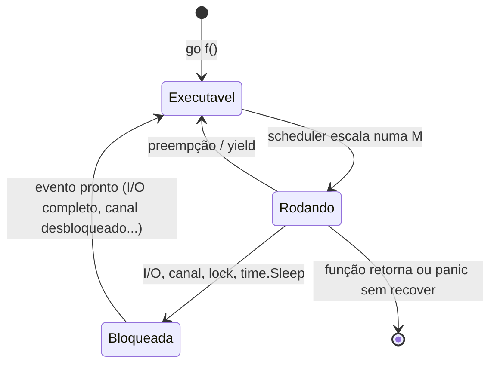

# O ciclo de vida de uma goroutine

> [!abstract] TL;DR
> Uma goroutine nasce com `go f()`, entra na fila de execução do scheduler GMP (nota anterior), e alterna entre três estados até morrer: **executável** (esperando CPU), **rodando** (numa M) e **bloqueada** (esperando I/O, canal, lock ou timer). Ela nunca é "pausada por fora" — só o próprio código dentro dela, ao tentar uma operação que não pode prosseguir, devolve o controle ao scheduler. Termina quando a função que a `go` lançou retorna, ou quando `panic` sobe sem `recover`. Não existe handle, PID ou objeto `Thread` para essa goroutine — nenhuma API do runtime devolve uma referência a ela. Se o `main` precisa saber quando ela terminou, o próprio programa tem que construir esse sinal — normalmente com um `sync.WaitGroup`, assunto do Galho 9.

## O problema que faltou resolver

A nota 02 mostrou o `go` statement disparando uma função e seguindo em frente sem esperar:

```go
func main() {
    go dizOi()
    fmt.Println("main seguiu")
}

func dizOi() {
    fmt.Println("oi")
}
```

Rode esse programa umas dez vezes e um padrão vai aparecer: às vezes `"oi"` imprime, às vezes não. `main` termina — e o processo inteiro morre com ela — antes que a goroutine `dizOi` tenha chance de rodar. É sintoma de uma pergunta que a nota 02 deixou em aberto de propósito: se `go f()` dispara e não espera, **como saber quando `f()` terminou**? Em Java, você guardaria a `Thread` retornada por `new Thread(...)` e chamaria `.join()`. Em Python, o objeto `Thread` também te dá isso de graça. Em Go, `go f()` não devolve absolutamente nada — nem um ponteiro, nem um ID, nem uma promise. Essa ausência não é uma lacuna da API; é uma escolha de design que molda todo o resto deste capítulo, e que só faz sentido depois de entender o que acontece *dentro* da goroutine entre o nascimento e a morte.

## Os três estados de uma goroutine

Por baixo do capô, o runtime rastreia cada goroutine com uma struct interna chamada `g` (a nota anterior já introduziu esse `G` do modelo GMP). Essa struct guarda, entre outras coisas, um campo de estado — e embora o runtime tenha mais granularidade internamente (`_Gidle`, `_Gdead`, `_Gcopystack`, etc.), o que importa para escrever código Go é o modelo simplificado de três estados pelos quais toda goroutine circula:



- **Executável** (*runnable*): a goroutine está pronta para rodar, esperando na fila de uma P por um "turno" numa M. É onde toda goroutine nasce, imediatamente após o `go f()`.
- **Rodando** (*running*): uma M está de fato executando as instruções da goroutine, com a P correspondente segurando o contexto de agendamento.
- **Bloqueada** (*blocked* / *waiting*): a goroutine não pode prosseguir até que algo externo aconteça — uma resposta de rede chegar, outra goroutine escrever num canal, um mutex ser liberado, um timer disparar.

A transição de **Rodando** para **Bloqueada** nunca é imposta de fora. Ninguém "pausa" uma goroutine à força a partir de outra thread do sistema operacional — é sempre a própria goroutine que, ao chamar uma função que não pode terminar agora (`<-ch`, `conn.Read(buf)`, `mu.Lock()`), devolve o controle ao runtime. Esse é o ponto que mais separa o modelo de goroutines do de threads do SO: uma thread pode ser interrompida por um timer de hardware a qualquer instrução; uma goroutine só cede voluntariamente — ainda que essa "vontade" esteja escondida dentro de uma chamada de biblioteca padrão, e não visível no seu código de aplicação.

## Bloqueio por I/O: a rede não trava a M

O caso mais comum de bloqueio, em qualquer servidor Go, é I/O — ler de uma conexão de rede, escrever num arquivo, esperar uma resposta HTTP. É aqui que o design GMP paga a conta que a nota anterior prometeu: quando uma goroutine bloqueia numa chamada de I/O de rede, o runtime **não** trava a M inteira esperando o kernel responder.

```go
func buscar(url string) (string, error) {
    resp, err := http.Get(url) // bloqueio "aparente" — mas a M é liberada
    if err != nil {
        return "", err
    }
    defer resp.Body.Close()

    corpo, err := io.ReadAll(resp.Body)
    return string(corpo), err
}
```

Por baixo, `http.Get` acaba chamando o **netpoller** — um mecanismo do runtime construído sobre `epoll` (Linux), `kqueue` (BSD/macOS) ou IOCP (Windows). Quando a goroutine tenta ler do socket e os dados ainda não chegaram, o runtime registra esse socket no netpoller, marca a goroutine como **bloqueada**, e devolve a M (e a P) para o scheduler escalar outra goroutine executável. Nenhuma thread do SO fica presa girando à toa esperando o pacote de rede chegar. Quando o kernel finalmente sinaliza que o socket está pronto, o netpoller acorda a goroutine, ela volta para **executável**, e entra na fila de novo — sem custo de criar ou destruir nenhuma thread do SO no processo inteiro.

É essa integração — bloqueio de I/O virando bloqueio *cooperativo* de goroutine, sem consumir uma M inteira — que permite rodar dezenas de milhares de goroutines fazendo I/O simultâneo com um punhado de threads de SO reais. É a peça que faltava para entender por que a nota anterior insistiu tanto na diferença entre `GOMAXPROCS` (número de Ps) e o número de threads do SO de fato usadas: I/O bloqueante em goroutine não consome uma dessas Ps.

## Bloqueio por canal: outro tipo de espera cooperativa

Bloqueio por canal segue a mesma lógica, mas o "evento externo" que destrava a goroutine não vem do kernel — vem de outra goroutine do mesmo processo:

```go
func esperar(ch chan int) {
    valor := <-ch // bloqueia até alguém escrever em ch
    fmt.Println("recebi:", valor)
}

func main() {
    ch := make(chan int)
    go esperar(ch)

    time.Sleep(100 * time.Millisecond) // dá tempo da goroutine bloquear em <-ch
    ch <- 42                            // desbloqueia esperar()
    time.Sleep(100 * time.Millisecond)  // dá tempo do Println rodar
}
```

Quando `esperar` executa `<-ch` e não há nenhum valor esperando no canal, o runtime marca essa goroutine como bloqueada — sem consumir CPU, sem *busy-waiting* — e a associa ao canal `ch`. Quando outra goroutine faz `ch <- 42`, o runtime identifica a goroutine bloqueada esperando por aquele canal específico, marca-a como executável de novo, e ela volta a competir por uma M. Channels a fundo — buffered vs unbuffered, select, fechamento — são o assunto inteiro do Galho 8; aqui importa só reconhecer o padrão: **qualquer operação de canal que não pode prosseguir de imediato é mais um gatilho de bloqueio cooperativo**, tratado pelo scheduler com o mesmo mecanismo geral de "tirar a goroutine da M, devolver a M ao pool, esperar o evento".

> [!warning] `time.Sleep` no exemplo acima é só didático
> Sincronizar duas goroutines com `time.Sleep` funciona por sorte, não por garantia — não há nenhuma promessa de que 100ms sejam suficientes em toda máquina, sob toda carga. Em código real, a sincronização correta usa os próprios canais (ex.: um canal de confirmação) ou primitivas de `sync`. O exemplo usa `Sleep` apenas para tornar visível, em texto, a ordem dos eventos — não copie esse padrão para produção.

## Reagendamento: por que uma goroutine "boa cidadã" também pode ceder o lugar

Bloqueio por I/O ou canal é *voluntário* no sentido de que a própria operação já é um ponto de parada natural. Mas o scheduler do Go também precisa lidar com o caso oposto: uma goroutine em loop apertado, sem nenhuma chamada bloqueante, que nunca "pediria" para ceder o lugar por conta própria.

```go
func loopPesado() {
    soma := 0
    for i := 0; i < 1_000_000_000; i++ {
        soma += i
    }
}
```

Antes do Go 1.14, esse tipo de loop podia monopolizar uma P indefinidamente — o scheduler só conseguia trocar de goroutine em pontos de checagem cooperativos (chamadas de função, alocações, operações de canal), e um loop sem nenhum desses pontos simplesmente não cedia. Desde o **Go 1.14**, o runtime ganhou **preempção assíncrona baseada em sinais**: o scheduler injeta um sinal no sistema operacional (`SIGURG` no Linux/macOS) que interrompe a M periodicamente, mesmo no meio de um loop apertado sem chamadas de função, e força a goroutine de volta a **executável**, dando a vez a outras.

> [!info] Preempção assíncrona é Go 1.14+
> Antes disso, cooperação dependia inteiramente de pontos de checagem no código gerado pelo compilador. Hoje, mesmo um loop matemático puro sem I/O, sem alocação, sem chamada de função, pode ser interrompido pelo scheduler — o que elimina uma classe inteira de bugs de "uma goroutine trava o programa inteiro".

De qualquer forma — seja por bloqueio voluntário (I/O, canal, lock) ou por preempção assíncrona — o efeito do lado de fora é o mesmo: a goroutine sai de **rodando**, volta para **executável**, e o scheduler escolhe a próxima da fila da P (ou rouba trabalho de outra P, como a nota anterior descreveu com *work stealing*). Nenhum desses reagendamentos preserva prioridade nem ordem — o Go não garante *fairness* estrita entre goroutines, só garante que nenhuma delas trava as demais para sempre.

## Término: como uma goroutine morre

Uma goroutine termina de duas formas:

1. **A função que a `go` lançou retorna normalmente.** Quando o corpo de `f()` chega ao fim (ou a um `return`), a goroutine sai do ciclo de estados de vez — sua struct `g` interna é reciclada pelo runtime para uma futura goroutine, num pool interno que evita realocar memória a cada `go` novo.
2. **`panic` sobe sem `recover`.** Se um `panic` dentro da goroutine não é capturado por nenhum `defer` com `recover()` *dentro da mesma goroutine*, o runtime derruba o **processo inteiro** — não só aquela goroutine. É uma diferença brusca em relação a exceções não tratadas numa thread Java (que normalmente só mata a thread) ou a uma `Promise` rejeitada em Node (que só rejeita aquela promise): em Go, um panic não recuperado em qualquer goroutine, mesmo uma secundária lançada com `go`, encerra tudo.

```go
func main() {
    go func() {
        panic("algo quebrou aqui dentro")
    }()

    time.Sleep(1 * time.Second)
    fmt.Println("esta linha nunca imprime")
}
```

Rodar esse programa produz um crash com stack trace e código de saída diferente de zero — `fmt.Println` na linha seguinte nunca executa, porque o processo já morreu. Recuperar um panic dentro de uma goroutine lançada por `go` exige um `defer recover()` **dentro dela mesma**:

```go
func executarComSeguranca(f func()) {
    go func() {
        defer func() {
            if r := recover(); r != nil {
                fmt.Println("recuperado:", r)
            }
        }()
        f()
    }()
}
```

## Sem handle, sem ID: o vazio que Go deixa de propósito

Chegou a hora de responder a pergunta da abertura. `go f()` não devolve nada — nem um `*Goroutine`, nem um inteiro identificador, nem uma `Future`. Não existe `getGoroutineID()` na API pública do runtime, e essa ausência é deliberada, não um esquecimento.

> [!warning] `runtime.Goexit()` e truques de stack trace não são um ID de goroutine
> É tecnicamente possível extrair um número interno de goroutine fazendo *parsing* de `runtime.Stack()` — um hack conhecido, usado por bibliotecas de debug e profilers. Os próprios mantenedores do Go [desaconselham depender disso](https://go.dev/doc/faq#no_goroutine_id): esse número não é estável, pode ser reciclado, e não deveria orientar nenhuma lógica de programa. Se um algoritmo depende de "saber qual goroutine é esta", o design está errado — a comunicação deveria passar por canais ou valores explícitos, não por identidade oculta de goroutine.

O motivo declarado pela equipe do Go, na [FAQ oficial](https://go.dev/doc/faq#no_goroutine_id), é evitar um padrão de abuso comum em linguagens com thread-local storage: código que usa o ID da thread atual como chave implícita de estado (como thread-locals em Java, ou `threading.local()` em Python), criando acoplamento invisível entre "qual fio de execução estou" e "que dado devo usar agora". Go prefere forçar esse estado a ser **explícito** — passado como parâmetro, carregado num `context.Context` (Galho 9), ou comunicado por canal — em vez de escondido atrás de uma identidade de goroutine que o programador precisaria rastrear manualmente.

A consequência prática: se você quer saber quando uma goroutine terminou, **você precisa construir esse sinal você mesmo**. A ferramenta mais simples é um canal dedicado:

```go
func trabalho(pronto chan<- bool) {
    fmt.Println("trabalhando...")
    time.Sleep(50 * time.Millisecond)
    fmt.Println("terminei")
    pronto <- true // sinaliza término
}

func main() {
    pronto := make(chan bool)
    go trabalho(pronto)

    <-pronto // main bloqueia aqui até a goroutine sinalizar
    fmt.Println("main sabe que trabalho() terminou")
}
```

Isso funciona bem para **uma** goroutine. Para esperar um número arbitrário delas — o caso comum em qualquer *fan-out* de trabalho — canal vira verboso rápido: seria preciso um canal por goroutine, ou um canal só com contagem manual de quantos `true` já chegaram. É exatamente esse buraco que a biblioteca padrão preenche com `sync.WaitGroup`:

```go
var wg sync.WaitGroup

for i := 0; i < 5; i++ {
    wg.Add(1)
    go func(id int) {
        defer wg.Done()
        fmt.Println("goroutine", id, "trabalhando")
    }(i)
}

wg.Wait() // bloqueia até as 5 chamarem Done()
fmt.Println("todas terminaram")
```

`WaitGroup` é só um contador atômico com um `Wait()` que bloqueia até chegar a zero — não guarda referência a nenhuma goroutine específica, só conta quantas ainda faltam terminar. Essa é a resposta idiomática de Go para "esperar N goroutines": não join por identidade, mas contagem por sinal explícito. O mecanismo completo — `Add`, `Done`, `Wait`, armadilhas de `Add` fora do loop, composição com `context.Context` para cancelamento — é o assunto do Galho 9; aqui o objetivo é só fechar o ciclo de vida: nascimento, execução, bloqueio, reagendamento, término, e a única forma real de saber que o término aconteceu.

## Casos práticos

**1. Ciclo de vida completo, visível em log**, combinando os três estados discutidos:

```go
func trabalhador(id int, ch chan int, wg *sync.WaitGroup) {
    defer wg.Done()
    fmt.Printf("goroutine %d: executável -> rodando\n", id)

    valor := <-ch // bloqueia aqui até receber
    fmt.Printf("goroutine %d: recebeu %d, terminando\n", id, valor)
}

func main() {
    var wg sync.WaitGroup
    ch := make(chan int)

    wg.Add(1)
    go trabalhador(1, ch, &wg)

    time.Sleep(10 * time.Millisecond) // garante que a goroutine já bloqueou em <-ch
    ch <- 100

    wg.Wait()
    fmt.Println("main: todas as goroutines terminaram")
}
```

**2. Panic isolado com `recover`**, evitando que uma goroutine de trabalho derrube o processo inteiro:

```go
func processarComSeguranca(itens []int, wg *sync.WaitGroup) {
    defer wg.Done()
    defer func() {
        if r := recover(); r != nil {
            fmt.Println("item causou panic, recuperado:", r)
        }
    }()

    for _, item := range itens {
        if item == 0 {
            panic("divisão por zero evitada manualmente")
        }
        fmt.Println(100 / item)
    }
}

func main() {
    var wg sync.WaitGroup
    wg.Add(1)
    go processarComSeguranca([]int{5, 2, 0, 1}, &wg)
    wg.Wait()
    fmt.Println("main seguiu normalmente")
}
```

**3. Observando o ciclo de vida de fora**, com `runtime.NumGoroutine()` — útil para depurar vazamentos (assunto pleno da nota 07, mas o instrumento vale conhecer aqui):

```go
func main() {
    fmt.Println("antes:", runtime.NumGoroutine()) // 1 (só main)

    var wg sync.WaitGroup
    for i := 0; i < 3; i++ {
        wg.Add(1)
        go func(id int) {
            defer wg.Done()
            time.Sleep(20 * time.Millisecond)
        }(i)
    }

    time.Sleep(5 * time.Millisecond)
    fmt.Println("durante:", runtime.NumGoroutine()) // 4 (main + 3 trabalhando)

    wg.Wait()
    fmt.Println("depois:", runtime.NumGoroutine()) // 1 (as 3 já terminaram e foram recicladas)
}
```

`runtime.NumGoroutine()` não identifica goroutines individuais — de novo, sem ID — mas conta quantas estão vivas neste exato instante. É a métrica mais simples para responder "estou vazando goroutines?": se esse número só cresce ao longo do tempo num programa de vida longa, alguma goroutine está ficando presa em **bloqueada** para sempre, em vez de completar o ciclo até o término.

## Armadilhas comuns

> [!warning] Esquecer de esperar a goroutine termina o programa antes dela rodar
> Sem `WaitGroup`, canal, ou qualquer outro sinal de sincronização, `main` pode retornar — e o processo inteiro morre junto — antes que qualquer goroutine lançada tenha chance de rodar. Isso não é uma race condition sutil escondida em produção: é o comportamento **padrão** de qualquer `go f()` solto no fim de `main` sem sincronização nenhuma.

> [!warning] `wg.Add(1)` dentro da goroutine, em vez de antes do `go`, é uma race
> `wg.Add` precisa acontecer **antes** do `go` que a acompanha — nunca dentro do corpo da goroutine. Se `Add` roda dentro da goroutine, existe uma janela em que `wg.Wait()` já pode ter sido chamado com o contador ainda em zero, retornando cedo demais, antes da goroutine sequer começar a contar. O padrão correto está fixado no exemplo acima: `wg.Add(1)` imediatamente antes de `go trabalhador(...)`.

> [!warning] Bloqueio "eterno" em canal sem ninguém do outro lado é deadlock, não demora
> `<-ch` numa goroutine que nunca recebe valor nenhum, porque quem escreveria em `ch` já terminou ou nunca foi lançado, não é uma espera lenta — é uma goroutine presa para sempre em **bloqueada**. Se isso acontecer com *todas* as goroutines do programa simultaneamente (inclusive `main`), o runtime detecta e aborta com `fatal error: all goroutines are asleep - deadlock!` — mas se só uma goroutine específica travar enquanto outras seguem vivas, esse vazamento passa silencioso, sem nenhum erro — assunto da nota 07 (Armadilhas — leaks e loop var).

## Vindo de outra linguagem

| Linguagem | Handle de execução | Como saber que terminou |
|---|---|---|
| Java | `Thread` (objeto com `.join()`) | `thread.join()`, `Future.get()` |
| Python | `threading.Thread` (`.join()`) | `thread.join()`, `concurrent.futures.Future` |
| JavaScript/Node | nenhum — é single-thread, callback/`Promise` | `await promise`, `Promise.all(...)` |
| Go | **nenhum** — `go f()` não devolve nada | canal dedicado ou `sync.WaitGroup.Wait()` |

O ponto que mais chama atenção nessa tabela é a linha de JavaScript: `Promise` também não é um "handle de thread" (não existe thread aqui), mas ao menos devolve um **valor** que representa o trabalho pendente, que pode ser aguardado e encadeado. Go não tem nem isso — `go f()` é uma instrução, não uma expressão que produz algo. Qualquer noção de "meu trabalho terminou" precisa ser modelada explicitamente pelo programador, com os primitivos de sincronização da biblioteca padrão.

## Como explicar em inglês

> A goroutine's lifecycle has three states: **runnable** (waiting for CPU time on some P's queue), **running** (actively executing on an M), and **blocked** (waiting on I/O, a channel operation, a lock, or a timer). Transitions out of *running* are either voluntary — the goroutine itself calls something that can't proceed yet, like a channel receive or a network read — or, since **Go 1.14**, asynchronous preemption, where the runtime signals a tight loop with no natural yield point to give up its M. Blocking I/O doesn't tie up an OS thread: the runtime's netpoller (epoll/kqueue/IOCP) parks the goroutine and frees the M for other work until the OS signals readiness. A goroutine ends when its function returns, or when a panic escapes without a matching `recover` — which, unlike an uncaught exception on a Java thread, crashes the entire process. Crucially, `go f()` returns nothing: no handle, no ID, no future. Go deliberately omits a goroutine-ID API to avoid implicit thread-local-style coupling; if code needs to know when a goroutine finished, it has to build that signal explicitly, typically with a dedicated channel or a `sync.WaitGroup`.

| Termo PT | Termo EN |
|---|---|
| executável | runnable |
| rodando | running |
| bloqueada | blocked / waiting |
| bloqueio cooperativo | cooperative blocking |
| preempção assíncrona | asynchronous preemption |
| netpoller | netpoller |
| reagendamento | rescheduling |
| término | termination |
| recuperar um panic | recover from a panic |
| grupo de espera | wait group |

## O que vem a seguir

Este capítulo mostrou goroutines vivendo isoladas — uma recebendo de um canal, outra sinalizando com `WaitGroup`. Mas o padrão idiomático de Go para fazer goroutines cooperarem de verdade vai além de só sincronizar término: é organizar o fluxo de dados inteiro em torno de canais, em vez de variáveis compartilhadas protegidas por locks. A [[05 - Comunicar em vez de compartilhar|nota 05]] entra nesse princípio central — "share memory by communicating" — e por que ele muda a forma como você desenha concorrência em Go, comparado ao modelo de memória compartilhada mais comum em Java ou C++.

## Veja também

- [[02 - A goroutine — o go statement|02 — A goroutine — o go statement]] — como uma goroutine nasce, ponto de partida deste capítulo
- [[03 - O modelo GMP por cima|03 — O modelo GMP por cima]] — G, M, P e work stealing, a maquinaria por trás dos estados descritos aqui
- [[05 - Comunicar em vez de compartilhar|05 — Comunicar em vez de compartilhar]] — próxima nota do galho
- [[07 - Armadilhas — leaks e loop var|07 — Armadilhas — leaks e loop var]] — o que acontece quando o término nunca chega
- [[03-Dominios/Tecnologia/Go/index|Trilha Go]]

## Fontes

- The Go Authors. *Go 1.14 Release Notes — Goroutines are now asynchronously preemptible*. go.dev. https://go.dev/doc/go1.14#runtime (acessado em 2026-07-18)
- The Go Authors. *Frequently Asked Questions (FAQ) — Why does Go not have a goroutine ID?*. go.dev. https://go.dev/doc/faq#no_goroutine_id (acessado em 2026-07-18)
- The Go Authors. *Package sync — WaitGroup*. pkg.go.dev. https://pkg.go.dev/sync#WaitGroup (acessado em 2026-07-18)
- The Go Authors. *Package runtime*. pkg.go.dev. https://pkg.go.dev/runtime (acessado em 2026-07-18)
- Go by Example. *Panic*. gobyexample.com. https://gobyexample.com/panic (acessado em 2026-07-18)
- Go by Example. *WaitGroups*. gobyexample.com. https://gobyexample.com/waitgroups (acessado em 2026-07-18)
