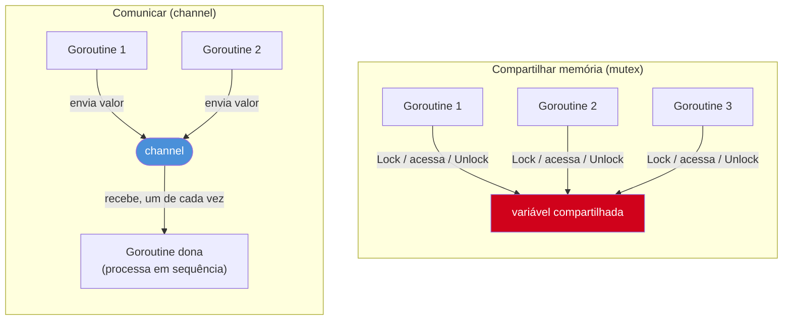
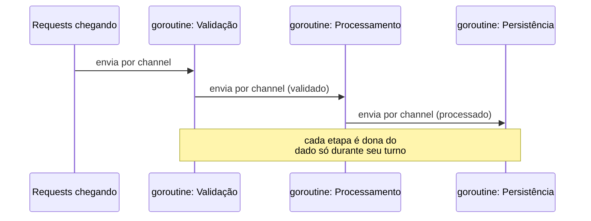

# Comunicar em vez de compartilhar

> [!abstract] TL;DR
> A frase que resume a filosofia de concorrência de Go é de Rob Pike: **"Do not communicate by sharing memory; share memory by communicating"**. Em vez de várias goroutines lerem e escreverem a mesma variável protegida por um `Mutex` (o modelo default em Java/C#/Python), Go incentiva um desenho onde **uma goroutine de cada vez é dona** de um dado, e as outras pedem esse dado — ou entregam trabalho — através de um **channel**. O dado nunca é acessado por duas goroutines ao mesmo tempo; ele *viaja* de uma para outra, e a posse muda de mãos junto com ele. Isso não elimina locks do vocabulário de Go (o pacote `sync` existe e é usado o tempo todo, especialmente pra dados simples) — é uma *preferência de design* para quando o problema tem forma de pipeline, fila de trabalho ou notificação entre partes independentes. Esta nota fica no "porquê"; o "como" — a fundo, com `chan`, `select`, buffered vs unbuffered — é o Galho 8 inteiro.

## O problema que todo mundo já teve com locks

Imagine um contador compartilhado por dez goroutines, cada uma incrementando mil vezes. Sem proteção nenhuma, isso é uma corrida de dados clássica — duas goroutines leem o mesmo valor, cada uma soma 1, e uma escrita apaga a outra. A solução que qualquer dev vindo de Java, C# ou Python já escreveu de olhos fechados é um lock:

```go
type Contador struct {
    mu    sync.Mutex
    valor int
}

func (c *Contador) Incrementa() {
    c.mu.Lock()
    defer c.mu.Unlock()
    c.valor++
}
```

Funciona. É correto, é idiomático, e o próprio Go usa esse padrão em bibliotecas-padrão inteiras — `sync.Mutex` não é um mal necessário nem um recurso "não-Go". Mas repare no que o lock exige de disciplina, silenciosamente, do resto do código: **toda** goroutine que toca `c.valor` precisa lembrar de chamar `c.mu.Lock()` antes e `c.mu.Unlock()` depois — sempre, em todo ponto de acesso, para sempre, incluindo qualquer código que alguém adicionar daqui a dois anos sem ler este arquivo com atenção. Esquecer um único `Lock()` não gera erro de compilação, nem crash imediato — gera uma corrida de dados que só aparece sob carga, em produção, na sexta à noite. É um contrato que vive na cabeça de quem escreveu o código, não no tipo do sistema.

Agora troque o cenário: em vez de compartilhar `valor` entre dez goroutines protegidas por um mutex, uma única goroutine é a **dona exclusiva** do contador. As outras nove não tocam `valor` — elas mandam uma mensagem "incrementa" por um canal, e a dona processa uma mensagem de cada vez:

```go
func gerenciarContador(incrementos <-chan struct{}, resultado chan<- int) {
    valor := 0
    for range incrementos {
        valor++
    }
    resultado <- valor
}
```

Não existe corrida de dados aqui — não porque alguém lembrou de travar um lock em todo lugar certo, mas porque **só uma goroutine em todo o programa tem acesso à variável `valor`**. As outras nove nunca a enxergam. Elas mandam mensagens; a dona processa uma de cada vez, em sequência, dentro do próprio corpo do `for range`. Não há seção crítica pra proteger porque não há acesso concorrente pra começo de conversa.

## A frase de Rob Pike

Essa mudança de desenho — de "vários acessam, um protege" para "um é dono, os outros pedem" — é exatamente o que Rob Pike, um dos criadores de Go, resumiu numa frase que hoje é citada em praticamente todo material sério sobre concorrência em Go, incluindo o [Effective Go](https://go.dev/doc/effective_go#sharing) e o [Go wiki de provérbios](https://go-proverbs.github.io/):

> **"Do not communicate by sharing memory; share memory by communicating."**

Vale desmontar essa frase com cuidado, porque ela é fácil de ler rápido e perder o ponto real. Ela não diz "não compartilhe memória" — dados *precisam* circular entre partes concorrentes de um programa, é inevitável. O que ela diz é sobre **o mecanismo de compartilhamento**. Duas rotas para o mesmo destino (informação chegando de uma goroutine a outra):

- **Compartilhar memória, e comunicar por ela** (o modelo tradicional): a variável fica num lugar fixo na memória; qualquer goroutine que precise dela acessa esse lugar diretamente, coordenando com locks pra não pisar na do vizinho. A comunicação acontece *através* da memória compartilhada.
- **Comunicar, e deixar a memória ser compartilhada como efeito colateral disso** (a inversão que Pike propõe): o dado é *enviado* de uma goroutine para outra através de um channel. A "posse" da memória se move junto com a mensagem — no instante em que o dado atravessa o canal, só a goroutine receptora tem motivo pra tocá-lo. A memória acaba sendo compartilhada ao longo do tempo (passa por várias mãos), mas nunca **ao mesmo tempo**.



No modelo da esquerda, três goroutines competem pelo mesmo endereço de memória, e o `Mutex` é o árbitro que impede colisão. No modelo da direita, três goroutines nunca tocam o mesmo endereço — elas enviam valores por um canal, e uma única goroutine processa cada valor recebido, um de cada vez, sem competição nenhuma porque não há nada pra competir.

> [!question]- Isso significa que channel é "melhor" que mutex, sempre?
> Não — e é um erro comum de quem acabou de ler a frase de Pike concluir isso. A própria comunidade Go, no [Go wiki de provérbios](https://go-proverbs.github.io/), lista essa frase ao lado de outra que a equilibra: contadores simples, caches pequenos e protecão de campos individuais de um struct costumam ser mais diretos, mais rápidos e mais legíveis com um `sync.Mutex` de poucas linhas do que com um canal e uma goroutine dedicada rodando em loop. O próprio código-fonte da standard library de Go usa `sync.Mutex` extensivamente — não é sinal de código não-idiomático. A escolha certa depende da forma do problema, que é o assunto da próxima seção.

## Por que essa preferência existe — o argumento de fundo

A vantagem de "comunicar em vez de compartilhar" não é só estética. Ela ataca uma classe inteira de bugs pela raiz, em três frentes concretas:

**1. Correção que o compilador consegue empurrar, não só a disciplina do dev.** Um `chan Pedido` no lugar certo da assinatura de uma função *documenta*, no próprio tipo, que aquela função recebe pedidos por mensagem — não que ela vai abrir mão de sincronizar sozinha um acesso a uma variável global. Não é prova formal de ausência de corrida (ainda dá pra escrever código errado com channels), mas o desenho todo empurra o código pra longe do padrão "esqueci um `Lock()`".

**2. Sem deadlock por ordem de locks.** Um dos bugs mais traiçoeiros de sistemas com múltiplos mutexes é a ordem de aquisição: goroutine A trava `mu1` e depois tenta travar `mu2`; goroutine B trava `mu2` e tenta travar `mu1` — as duas ficam esperando pra sempre. Esse problema clássico de *lock ordering* simplesmente não tem onde acontecer num desenho de pipeline com channels, porque não há dois locks concorrentes pra ordenar mal.

**3. O desenho fica mais próximo de como o problema realmente é.** Muito trabalho concorrente do mundo real tem forma de **fluxo**: um request chega, passa por validação, depois processamento, depois persistência — cada etapa feita por uma goroutine (ou um pool delas), passando o trabalho adiante. Modelar isso como "várias goroutines competindo por uma struct compartilhada, protegida por locks" força um problema sequencial-por-natureza a caber num molde de acesso concorrente. Modelar como um **pipeline de channels** — cada etapa é uma goroutine, cada seta entre etapas é um canal — deixa a estrutura do código espelhar a estrutura do problema.



Em nenhum ponto desse pipeline duas goroutines tocam o mesmo request ao mesmo tempo. O dado atravessa o pipeline, uma etapa entrega para a próxima, e a posse muda de mãos a cada `chan`. É o mesmo raciocínio do exemplo do contador, só que aplicado a um fluxo de trabalho real em vez de um número.

> [!info] Isso não é exclusividade de Go — é CSP, de 1978
> A ideia por trás de channels não nasceu com Go. Ela vem de **CSP** (*Communicating Sequential Processes*), um formalismo proposto por Tony Hoare em 1978 para descrever sistemas concorrentes como processos independentes que só interagem trocando mensagens por canais nomeados — exatamente o modelo que Go adotou como primitiva de linguagem. Go não inventou o conceito; deu a ele sintaxe de primeira classe (`chan`, `go`, `select`) e o colocou lado a lado com goroutines leves, o que tornou o estilo prático em escala que CSP, como formalismo puramente teórico, nunca teve.

## Teaser: o que é um channel, por cima

Um channel é um tipo embutido da linguagem — declarado como `chan T` para um canal que carrega valores do tipo `T` — que funciona como um cano tipado entre goroutines: uma goroutine envia com `canal <- valor`, outra recebe com `valor := <-canal`. Por padrão (canal *unbuffered*), enviar e receber são operações que **bloqueiam** até que exista, do outro lado, alguém pronto pra completar a troca — é um encontro (*rendezvous*), não uma caixa de correio.

```go
func main() {
    mensagens := make(chan string)

    go func() {
        mensagens <- "olá do outro lado"
    }()

    recebido := <-mensagens
    fmt.Println(recebido) // "olá do outro lado"
}
```

Essa linha `mensagens := make(chan string)` cria o canal; a goroutine anônima envia; a goroutine principal recebe. Sem `Mutex`, sem `valor` compartilhado em memória visível às duas — só uma mensagem que atravessa de um lado para o outro. É só um teaser: a sintaxe completa (`chan<-` só-envio, `<-chan` só-recepção, canais *buffered* com `make(chan T, N)`, fechamento com `close`, seleção entre múltiplos canais com `select`) é o conteúdo inteiro do próximo galho — aqui, o objetivo é só deixar claro **por que** channels merecem um galho inteiro, e não são só "mais uma feature de sincronização" entre várias equivalentes.

## Casos práticos

**1. Contador via mutex** (correto, idiomático, apropriado para este problema simples):

```go
type ContadorSeguro struct {
    mu    sync.Mutex
    valor int
}

func (c *ContadorSeguro) Incrementa() {
    c.mu.Lock()
    defer c.mu.Unlock()
    c.valor++
}

func (c *ContadorSeguro) Valor() int {
    c.mu.Lock()
    defer c.mu.Unlock()
    return c.valor
}

func main() {
    c := &ContadorSeguro{}
    var wg sync.WaitGroup

    for i := 0; i < 10; i++ {
        wg.Add(1)
        go func() {
            defer wg.Done()
            for j := 0; j < 1000; j++ {
                c.Incrementa()
            }
        }()
    }

    wg.Wait()
    fmt.Println(c.Valor()) // 10000
}
```

> [!info] `sync.WaitGroup`
> Usado aqui só para esperar as dez goroutines terminarem antes de ler `c.Valor()` — é assunto do Galho 9 (mecanismos de sincronização). Nesta nota, o foco é a diferença entre os dois desenhos, não os detalhes de cada primitiva.

**2. O mesmo problema, resolvido por comunicação em vez de memória compartilhada** — uma única goroutine "dona" processa incrementos recebidos por canal:

```go
func main() {
    incrementos := make(chan struct{})
    resultado := make(chan int)

    // A única goroutine que já toca "valor"
    go func() {
        valor := 0
        for range incrementos {
            valor++
        }
        resultado <- valor
    }()

    var wg sync.WaitGroup
    for i := 0; i < 10; i++ {
        wg.Add(1)
        go func() {
            defer wg.Done()
            for j := 0; j < 1000; j++ {
                incrementos <- struct{}{}
            }
        }()
    }

    wg.Wait()
    close(incrementos) // sinaliza: não vem mais nada — encerra o `for range` da dona
    fmt.Println(<-resultado) // 10000
}
```

Repare que o *resultado* — `10000` nos dois casos — é idêntico. A diferença inteira está em **onde mora a responsabilidade de evitar a corrida**: no primeiro caso, em disciplina espalhada por todo ponto de acesso a `valor` (proteger com `Lock`/`Unlock`); no segundo, concentrada num único lugar (só a goroutine dona toca `valor`, ponto final). Para um contador desse tamanho, o mutex é objetivamente mais simples — é o exemplo canônico de quando *não* vale a pena aplicar a preferência de Pike ao pé da letra. Ele está aqui para deixar o contraste visível lado a lado, não como recomendação de qual usar num contador de verdade.

> [!warning] `struct{}{}` como sinal vazio
> `chan struct{}` é um idioma comum em Go para canais que só sinalizam "algo aconteceu", sem carregar dado nenhum — `struct{}{}` é um valor do tipo vazio (zero bytes), então o canal serve de sinal puro, sem custo de payload. Aparece com frequência em canais de cancelamento e de "terminei".

**3. Ordem de locks que trava dois mutexes entre si** — o problema que motiva o argumento 2 da seção anterior, mostrado em código, para não ficar só na afirmação abstrata:

```go
var mu1, mu2 sync.Mutex

func transferir(de, para *int, valor int) {
    mu1.Lock()
    defer mu1.Unlock()
    mu2.Lock() // se outra goroutine já travou mu2 e está esperando mu1...
    defer mu2.Unlock()

    *de -= valor
    *para += valor
}

func transferirInvertido(de, para *int, valor int) {
    mu2.Lock() // ...aqui a ordem está invertida: deadlock quando as duas rodam juntas
    defer mu2.Unlock()
    mu1.Lock()
    defer mu1.Unlock()

    *de -= valor
    *para += valor
}
```

Se `transferir` e `transferirInvertido` rodarem concorrentemente, existe uma janela real em que a primeira já travou `mu1` e espera `mu2`, enquanto a segunda já travou `mu2` e espera `mu1` — nenhuma das duas nunca solta o que já tem, porque `defer Unlock()` só executa quando a função retorna, e nenhuma retorna. É *deadlock* por ordem de aquisição, um dos bugs mais difíceis de reproduzir em teste porque depende de *timing* exato entre goroutines. Um desenho de pipeline com channels — uma goroutine dona da conta de origem, outra da conta de destino, comunicando a transferência por mensagem — simplesmente não tem dois locks concorrentes para ordenar mal, porque não há lock nenhum no meio.

## Armadilhas comuns

> [!warning] "Comunicar em vez de compartilhar" não é uma regra absoluta — é uma lente
> Aplicar essa filosofia a **todo** acesso concorrente, inclusive os triviais, produz código mais verboso e mais lento do que um `sync.Mutex` de duas linhas resolveria — girar uma goroutine inteira, com seu próprio loop e canal dedicado, só para proteger um contador é over-engineering. A frase de Pike descreve uma **preferência de desenho para problemas com forma de fluxo ou posse exclusiva** (pipelines, filas de trabalho, coordenação entre partes independentes) — não uma proibição de `sync`.

> [!warning] Channel mal usado também tem corrida de dados
> Trocar `Mutex` por `chan` não é imunidade automática. Se duas goroutines ainda acessam a mesma variável fora do canal — por exemplo, lendo `valor` diretamente em vez de só através da mensagem recebida — a corrida volta a existir, só que escondida atrás de uma API que *parece* mais segura. O ganho de segurança vem do **desenho** (uma goroutine dona, acesso exclusivo), não da simples presença de um `chan` no código.

> [!warning] Channel sem receptor bloqueia para sempre — e isso é deadlock, não corrida de dados
> No exemplo 2, se `close(incrementos)` não fosse chamado, o `for range incrementos` da goroutine dona ficaria bloqueado esperando o próximo valor para sempre — e o programa travaria sem crash, sem log de erro, sem sinal nenhum além de nunca terminar. Esse é um tipo de bug completamente diferente de corrida de dados: é **deadlock**, e channels trocam um tipo de bug por outro, não eliminam bugs de concorrência como categoria.

> [!warning] Enviar um ponteiro por um channel não transfere posse automaticamente — é convenção, não garantia do compilador
> Se o valor enviado por um `chan *Pedido` for um **ponteiro**, a goroutine que enviou ainda *pode* continuar acessando o mesmo endereço de memória depois de enviar — nada no compilador impede isso. "A posse muda de mãos" é uma disciplina que o time precisa manter por convenção (parar de tocar o valor depois de enviá-lo), não uma regra que Go aplica sozinho. Enviar por **valor** (uma cópia do struct, não um ponteiro pra ele) é mais seguro exatamente por isso: elimina a possibilidade de a goroutine remetente continuar mexendo no que já devia ser posse exclusiva da receptora. Trade-off real: copiar um struct grande a cada envio tem custo — a mesma tensão de value vs pointer receiver da [[03-Dominios/Tecnologia/Go/02 - Tipos, structs e métodos/04 - Value vs pointer receiver|nota 04 do Galho 2]], reaparecendo aqui em roupagem de concorrência.

## Lente cross-stack

| Vindo de... | Modelo "default" de concorrência | Onde entra o equivalente de channel |
|---|---|---|
| Java | `synchronized`, `java.util.concurrent.locks`, `AtomicInteger` — memória compartilhada protegida por lock é o caminho mais comum | `BlockingQueue` existe e é usada em produtor-consumidor, mas é biblioteca, não sintaxe da linguagem |
| Python | `threading.Lock` (quando o GIL não resolve sozinho — Galho 6 detalha isso) | `queue.Queue` é o análogo mais próximo, também biblioteca |
| Node/JS | Concorrência real dentro de um processo é rara (single-threaded); coordenação é via `Promise`/`async-await`, não locks | Não há equivalente direto — o problema que channel resolve (dados cruzando entre execuções concorrentes de verdade) simplesmente não existe do mesmo jeito num event loop de thread única |
| C# | `lock`, `Monitor`, `SemaphoreSlim` — memória compartilhada é o default | `System.Threading.Channels` (biblioteca .NET moderna) foi *explicitamente inspirada* nos channels de Go |

A linha que mais salta aos olhos é a de C#: `System.Threading.Channels`, adicionado ao .NET a partir da versão 4.7 (2017), foi desenhado com referência direta aos channels de Go como fonte de inspiração — sinal de que a ideia de Pike, décadas depois de CSP, continuou influenciando design de linguagens de propósito geral bem depois de Go.

## Como explicar em inglês

> Go's concurrency philosophy is best summarized by Rob Pike's proverb: "Do not communicate by sharing memory; share memory by communicating." Instead of multiple goroutines reading and writing the same variable behind a mutex, Go favors a design where a single goroutine owns a piece of data, and other goroutines request work or hand off values through a **channel**. Ownership moves with the message — the data is never accessed by two goroutines at the same instant, so there's no race to guard against in the first place. This doesn't make `sync.Mutex` obsolete; Go's own standard library uses locks constantly, especially for simple, localized state. The channel-first approach shines specifically for problems shaped like a pipeline or a work queue, where the structure of the code can mirror the structure of the problem instead of forcing a sequential flow into a shared-state mold.

| Termo PT | Termo EN |
|---|---|
| compartilhar memória | share memory |
| comunicar (entre goroutines) | communicate |
| canal | channel |
| dona exclusiva (do dado) | exclusive owner |
| posse (do dado) | ownership |
| corrida de dados | data race |
| impasse / travamento mútuo | deadlock |
| processos sequenciais comunicantes | Communicating Sequential Processes (CSP) |
| encontro (canal sem buffer) | rendezvous |

## O que vem a seguir

Esta nota ficou deliberadamente no "porquê" — a filosofia por trás da preferência de Go por channels, sem entrar no "como" (sintaxe, buffering, `select`, fechamento). Antes de chegar lá, falta fechar uma peça: goroutines não são threads do sistema operacional disfarçadas, nem *green threads* de um único núcleo como o antigo modelo de coroutines. A [[06 - Goroutines vs threads, event loop e GIL|nota 06]] compara o modelo de Go lado a lado com threads do SO, o event loop de Node e o GIL do Python — o pano de fundo que faltava antes de entender por que a preferência por channels *funciona na escala* que funciona em Go.

## Veja também

- [[01 - Concorrência vs paralelismo|01 — Concorrência vs paralelismo]] — a distinção conceitual que dá sentido a "vários fluxos, coordenados sem competir"
- [[03 - O modelo GMP por cima|03 — O modelo GMP por cima]] — como o scheduler executa as goroutines que esta nota mostra comunicando entre si
- [[04 - O ciclo de vida de uma goroutine|04 — O ciclo de vida de uma goroutine]] — estados de execução, incluindo o bloqueio que acontece num envio/recepção sem par pronto
- [[06 - Goroutines vs threads, event loop e GIL|06 — Goroutines vs threads, event loop e GIL]] — próxima nota do galho
- [[03-Dominios/Tecnologia/Go/index|Trilha Go]]

## Fontes

- The Go Authors. *Effective Go — Share by communicating*. go.dev. https://go.dev/doc/effective_go#sharing (acessado em 2026-07-18)
- Go Proverbs. *Go Proverbs — Don't communicate by sharing memory, share memory by communicating*. go-proverbs.github.io. https://go-proverbs.github.io/ (acessado em 2026-07-18)
- The Go Authors. *A Tour of Go — Channels*. go.dev. https://go.dev/tour/concurrency/2 (acessado em 2026-07-18)
- Pike, Rob. *Go Concurrency Patterns* (talk, Google I/O 2012). go.dev/blog. https://go.dev/blog/io2012-videos (acessado em 2026-07-18)
- Go by Example. *Channels*. gobyexample.com. https://gobyexample.com/channels (acessado em 2026-07-18)
- pkg.go.dev. *sync package*. pkg.go.dev. https://pkg.go.dev/sync (acessado em 2026-07-18)
