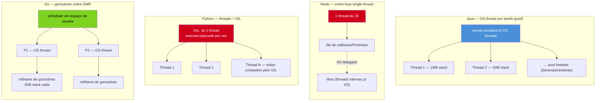
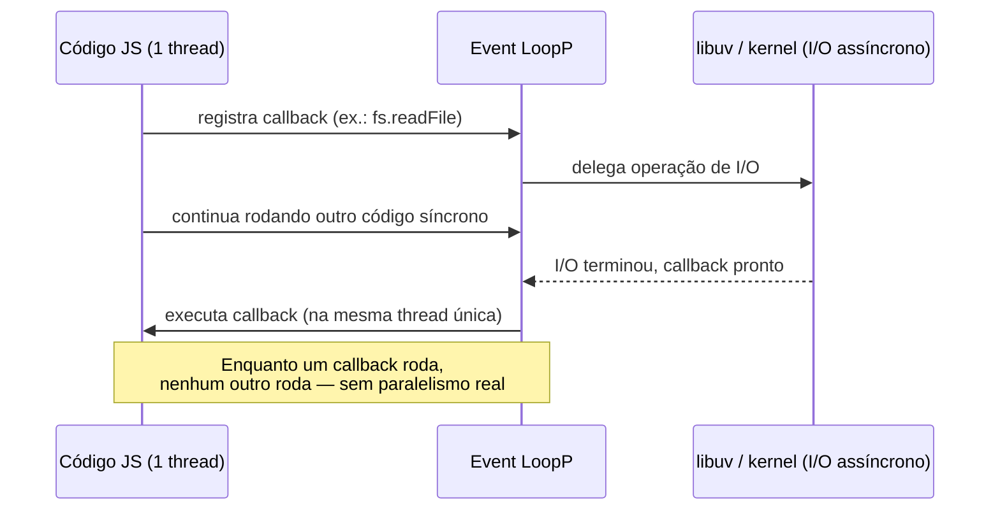
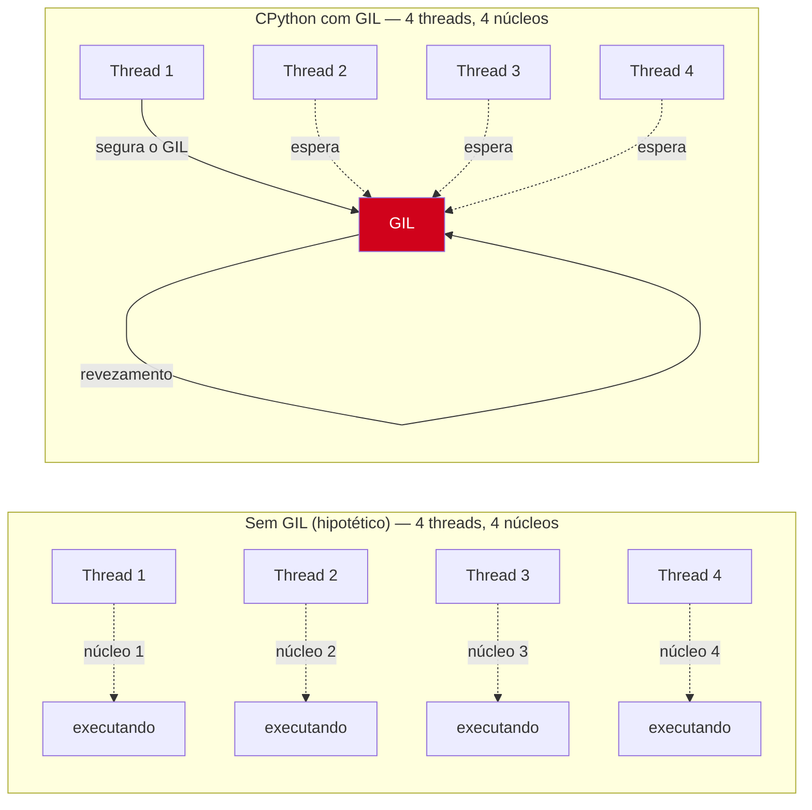

# Goroutines vs threads, event loop e GIL

> [!abstract] TL;DR
> As quatro notas anteriores deste galho descreveram a goroutine por dentro — o `go` statement, o modelo GMP, o ciclo de vida, os channels. Esta nota olha de fora: por que a mesma tarefa ("rodar 50 mil coisas ao mesmo tempo") tem soluções tão diferentes em Java (`Thread`/pool de OS threads), Node (event loop single-thread) e Python (múltiplas threads, mas travadas pelo GIL). Nenhuma das três é "errada" — cada uma resolve um trade-off diferente entre paralelismo real, custo de troca de contexto e segurança de dados compartilhados. A goroutine ocupa um ponto de design próprio: paralelismo real (como Java), custo de criação próximo de zero (como uma "thread verde"), sem travar em I/O (como o event loop) e sem lock global travando CPU-bound (diferente do Python). Entender essa diferença é o que evita dois erros de quem migra: tratar goroutine como thread do SO ("cuidado, é caro criar muitas") ou tratar como callback do Node ("preciso encadear promises").

## O mesmo problema, quatro respostas

Imagine o mesmo servidor HTTP — recebe 10 mil requisições por segundo, cada uma faz uma query no banco e devolve JSON — implementado em Java, Node, Python e Go. A pergunta de design é sempre a mesma: **como o runtime lida com 10 mil operações concorrentes sem travar tudo numa fila?** As quatro linguagens respondem de jeitos incompatíveis entre si, e a resposta molda o resto do código que você escreve.

**Java** historicamente resolve com uma OS thread por requisição (ou um pool de threads reaproveitadas). Cada `Thread` do Java é uma thread de verdade do sistema operacional — o kernel escalona ela, ela tem sua própria pilha (tipicamente 512KB–1MB), e trocar entre threads custa uma troca de contexto de kernel, algo na casa de microssegundos. Criar 10 mil delas simultaneamente é caro o bastante — em memória e em custo de escalonamento — que a prática padrão sempre foi um **pool limitado** (`ExecutorService`, tipicamente dezenas a poucas centenas de threads) processando uma fila de tarefas, não uma thread por requisição sem limite.

**Node.js** vai para o extremo oposto: **uma única thread** roda todo o JavaScript da aplicação. Não existe troca de contexto entre "tarefas" no sentido de threads do SO — existe um **event loop**, um laço que tira a próxima tarefa pronta de uma fila e executa até ela devolver o controle (normalmente ao chegar numa operação de I/O, que é delegada para libuv e volta como callback/Promise quando terminar). Isso elimina data races por completo — só uma linha de execução por vez — mas significa que qualquer trecho de JS que rode CPU-bound por muito tempo **bloqueia o processo inteiro**, inclusive todas as outras requisições em andamento.

**Python** tenta se parecer com Java — `threading.Thread`, múltiplas threads de verdade do SO — mas o CPython (a implementação de referência) trava a execução de bytecode Python com um **Global Interpreter Lock (GIL)**: só uma thread executa bytecode Python por vez, mesmo com 16 núcleos disponíveis. Threads em Python ajudam com I/O-bound (o GIL é liberado durante chamadas de I/O bloqueantes), mas não trazem paralelismo real para trabalho CPU-bound — para isso, a saída histórica é `multiprocessing` (processos separados, cada um com seu próprio GIL) ou reescrever o hot path em C/Rust.

**Go** propõe uma quarta rota: a **goroutine**, uma unidade de execução gerenciada pelo runtime do Go, não pelo kernel — o modelo GMP das notas 03 e 04 deste galho. Milhares de goroutines são multiplexadas sobre um punhado de OS threads (`GOMAXPROCS`, tipicamente = número de núcleos), com o scheduler do Go fazendo a troca entre elas em espaço de usuário, sem passar pelo kernel a cada troca. O resultado: paralelismo real (diferente do GIL), sem precisar de pool artificial limitando quantas "tarefas" rodam ao mesmo tempo (diferente do padrão histórico de Java), e sem bloquear tudo quando uma goroutine faz I/O ou até trabalho CPU pesado (diferente do event loop do Node).



Repare que só Go e (com ressalvas) Java oferecem **paralelismo real** — mais de uma instrução executando no mesmo instante, em núcleos diferentes. Node e Python, para o código que você escreve diretamente (JS puro, Python puro), oferecem **concorrência sem paralelismo**: várias tarefas progridem intercaladas, mas nunca duas ao mesmo tempo. A diferença entre concorrência e paralelismo — já trabalhada na [[01 - Concorrência vs paralelismo|nota 01]] deste galho — é exatamente o eixo que separa essas quatro estratégias.

## Goroutine vs Thread do Java: o mesmo objetivo, custo de ordem de grandeza diferente

Java e Go concordam num ponto: ambos querem paralelismo real, escalonado pelo runtime sobre múltiplos núcleos. A diferença é **quem faz o escalonamento e qual o custo da unidade**.

Uma `Thread` do Java é uma OS thread — criada com uma chamada de sistema (`clone`/`pthread_create` por baixo), com pilha alocada tipicamente entre 512KB e 1MB (configurável, mas raramente reduzida na prática por risco de stack overflow), e escalonada pelo kernel do sistema operacional. Trocar de uma `Thread` para outra é uma troca de contexto de kernel — salvar registradores, trocar tabelas de página se for entre processos, mexer em estruturas do escalonador do SO. É rápido (microssegundos), mas não é grátis, e o número de threads que um processo aguenta ter *vivas ao mesmo tempo* é limitado pela memória (pilhas) e pelo overhead de escalonamento — motivo histórico de todo pool de threads em Java existir: 10 mil `Thread` simultâneas eram, até recentemente, impraticáveis.

> [!info] Virtual Threads (Java 21+, Project Loom)
> Desde o Java 21 (LTS, setembro de 2023), a JVM ganhou **virtual threads** — unidades leves, gerenciadas pela própria JVM, multiplexadas sobre um pool pequeno de *carrier threads* (OS threads reais). É a resposta direta de Java ao mesmo problema que a goroutine resolve, e a semelhança de design não é coincidência: ambas nasceram da mesma observação — OS threads são caras demais para modelar "uma tarefa lógica" 1:1. A diferença mais visível continua sendo a pilha: virtual threads também crescem dinamicamente, mas o modelo de goroutine (pilha inicial de 2KB, crescendo em segmentos contíguos via `morestack`) é anterior e mais maduro em produção — Go faz isso desde a versão 1.4 (2014); virtual threads são GA desde 2023.

A goroutine, como as notas 03 e 04 detalharam, começa com uma pilha de **2KB** — não 512KB — e o scheduler que decide qual goroutine roda em qual OS thread (`M`) vive **dentro do runtime do Go**, em espaço de usuário, sem chamada de sistema a cada troca. É por isso que `go func(){...}()` dez mil vezes é rotina em Go (a nota 02 mostrou isso na prática), enquanto `new Thread(...).start()` dez mil vezes em Java pré-Loom era, na prática, um jeito de derrubar o processo por exaustão de memória.

| | Thread (Java, pré-Loom) | Goroutine (Go) |
|---|---|---|
| Quem escalona | Kernel do SO | Runtime do Go (scheduler M:N) |
| Pilha inicial | ~512KB–1MB, fixa | ~2KB, cresce dinamicamente |
| Custo de criação | Alto — chamada de sistema | Baixo — alocação em heap gerenciada pelo runtime |
| Troca de contexto | Kernel (mais cara) | Espaço de usuário (mais barata) |
| Quantidade prática | Centenas a poucos milhares | Centenas de milhares a milhões |
| Paralelismo real | Sim | Sim |

## Goroutine vs event loop do Node: paralelismo real vs concorrência cooperativa single-thread

Node resolve o mesmo problema de "10 mil requisições simultâneas" sem nunca criar 10 mil threads de coisa nenhuma — porque não cria threads de aplicação alguma. Todo o código JavaScript que você escreve roda numa única thread. O truque é que operações de I/O (ler um arquivo, fazer uma query, esperar uma resposta HTTP) são delegadas para fora dessa thread — para o kernel via I/O assíncrono nativo, ou para o *thread pool* interno da libuv em casos como acesso a disco — e retornam como callback (ou, hoje, como `Promise` resolvida via `async`/`await`) que entra numa fila. O **event loop** é o laço que, repetidamente, verifica se há callbacks prontos para rodar e os executa, um de cada vez, até a fila esvaziar ou o processo ser encerrado.



O ganho do modelo de Node é real: para cargas dominadas por I/O (o caso comum de APIs web que passam a maior parte do tempo esperando banco/rede), uma única thread consegue atender milhares de conexões simultâneas sem pagar custo nenhum de troca de contexto entre "tarefas" — porque não há troca de contexto de verdade, só a fila do event loop decidindo a ordem. O preço é que **qualquer código JS que rode por muito tempo sem devolver o controle bloqueia tudo**: um `for` pesado, um `JSON.parse` de payload gigante, uma regex catastrófica — todos travam o processo inteiro, inclusive requisições de outros usuários que não têm nada a ver com aquele cálculo.

A goroutine não faz essa escolha. Ela também é barata de criar e não bloqueia o processo inteiro em I/O — mas o motivo é diferente, e a garantia é mais forte. Quando uma goroutine faz uma chamada bloqueante (rede, disco, um `time.Sleep`), o runtime do Go **detecta isso e desacopla a OS thread (`M`) daquela goroutine**, liberando o `P` (processor lógico) para rodar outras goroutines em outra `M` — mecanismo explicado a fundo na nota 04. E, crucialmente, isso vale também para trabalho **CPU-bound**: um `P` com `GOMAXPROCS` > 1 continua escalonando outras goroutines em paralelo real, em outros núcleos, enquanto uma goroutine roda um loop pesado — coisa que o event loop do Node simplesmente não pode fazer, porque não tem "outro núcleo" rodando JS ao mesmo tempo.

```go
// Go: uma goroutine fazendo trabalho CPU-bound
// NÃO bloqueia as outras — GOMAXPROCS > 1 continua escalonando em paralelo
func main() {
    resultados := make(chan int, 2)

    go func() { resultados <- fibonacciLento(38) }() // CPU-bound
    go func() { resultados <- fibonacciLento(35) }() // roda em paralelo real, outro núcleo

    fmt.Println(<-resultados, <-resultados)
}

func fibonacciLento(n int) int {
    if n < 2 {
        return n
    }
    return fibonacciLento(n-1) + fibonacciLento(n-2)
}
```

```js
// Node: o equivalente ingênuo TRAVA o processo inteiro
// enquanto fibonacciLento roda, nenhuma outra requisição é atendida
function fibonacciLento(n) {
  if (n < 2) return n
  return fibonacciLento(n - 1) + fibonacciLento(n - 2)
}

app.get('/fib', (req, res) => {
  res.send(String(fibonacciLento(38))) // bloqueia o event loop inteiro
})
```

> [!info] Worker Threads (Node) existem — mas não são o padrão
> Node oferece `worker_threads` desde a versão 10 (2018) — threads de verdade, com heap isolado, para tirar trabalho CPU-bound da thread principal. É a válvula de escape de Node para o problema acima, mas é opt-in e exige comunicação explícita via `postMessage` (sem memória compartilhada direta) — o padrão de código Node segue single-thread por default, diferente de Go, onde toda goroutine já nasce elegível a rodar em paralelo sem configuração nenhuma.

## Goroutine vs threads do Python: o GIL trava CPU-bound, não I/O-bound

Python parece, à primeira vista, mais parecido com Java do que com Node: `threading.Thread` cria OS threads de verdade, escalonadas pelo kernel. A pegadinha está no **Global Interpreter Lock (GIL)** do CPython — um mutex único que garante que só uma thread executa bytecode Python por vez, não importa quantos núcleos a máquina tenha. O GIL existe por uma razão histórica sólida: simplifica o gerenciamento de memória do CPython (contagem de referências não precisa ser atômica) e mantém extensões em C simples de escrever — mas o preço é que **threads Python nunca dão paralelismo real para código Python puro CPU-bound**.



O detalhe que costuma confundir é: o GIL **é liberado** durante chamadas de I/O bloqueantes (leitura de socket, de arquivo) e durante certas operações em bibliotecas C que soltam o lock explicitamente (boa parte do NumPy, por exemplo). Por isso, `threading` em Python continua útil para cargas **I/O-bound** — várias threads esperando rede ao mesmo tempo se comportam quase como se não houvesse GIL, porque a maior parte do tempo nenhuma delas está segurando o lock. O problema aparece só em trabalho **CPU-bound** puro: somar uma lista gigante em Python com quatro threads não corre 4x mais rápido — corre quase na mesma velocidade de uma thread só, porque elas ficam se revezando pelo mesmo lock.

```python
# Python: 4 threads somando listas grandes — NÃO ganha paralelismo real
# porque o GIL serializa a execução do bytecode
import threading

def somar(lista, resultado, idx):
    resultado[idx] = sum(lista)

listas = [list(range(10_000_000)) for _ in range(4)]
resultado = [0] * 4
threads = [
    threading.Thread(target=somar, args=(listas[i], resultado, i))
    for i in range(4)
]
for t in threads: t.start()
for t in threads: t.join()
# tempo total ≈ tempo de 1 thread, não 1/4 — CPU-bound, travado pelo GIL
```

A saída histórica do Python para paralelismo real em CPU-bound é `multiprocessing` — processos separados do SO, cada um com seu próprio interpretador e seu próprio GIL, sem memória compartilhada por padrão (troca dados via serialização, `pickle`, pipes). Funciona, mas tem custo de criação de processo (bem mais caro que thread) e complica compartilhar estado.

> [!info] Free-threaded CPython (3.13+, PEP 703)
> Desde o Python 3.13 (outubro de 2024), existe uma build experimental do CPython **sem GIL** (`python3.13t`), fruto da PEP 703. Ainda não é o padrão — é opt-in, ainda tem custo de performance em código single-thread por causa do overhead de sincronização fina que substitui o lock único — mas é o primeiro movimento real de CPython em direção a paralelismo verdadeiro com threads. Go nunca teve esse problema para resolver: não existe (nem nunca existiu) um GIL no runtime do Go — cada goroutine roda com paralelismo real desde a primeira versão da linguagem, sujeita apenas às garantias explícitas de sincronização que você mesmo escreve (assunto do galho 9, com `sync`/`context`).

Note a inversão de papel: em Python, o GIL existe **para simplificar a memória compartilhada** — é o mecanismo que evita você ter que se preocupar com race conditions em contagem de referência. Em Go, a filosofia é oposta e é o lema do galho inteiro, já apresentado na nota 05 ("comunicar em vez de compartilhar"): não há lock global nenhum te protegendo por baixo dos panos — cabe a você usar channels ou `sync.Mutex` (galho 9) quando duas goroutines tocam o mesmo dado. Go troca "segurança automática, sem paralelismo real" (GIL) por "paralelismo real, segurança sob demanda" (channels/mutex).

## Tabela cross-stack

| | Go (goroutine) | Java (Thread → Virtual Thread) | Node (event loop) | Python (Thread + GIL) |
|---|---|---|---|---|
| Unidade de concorrência | Goroutine (runtime) | OS thread / virtual thread (JVM) | Callback na fila do event loop | OS thread (kernel) |
| Paralelismo real (multi-núcleo) | Sim, sempre | Sim (Thread); sim (Virtual Thread) | Não, para JS puro | Não, para Python puro (CPU-bound) |
| Custo de criar 10 mil unidades | Trivial | Caro (Thread); trivial (Virtual Thread, 21+) | N/A — não existe "criar" | Caro |
| Bloqueia tudo se uma trava em I/O? | Não | Não | Sim (na thread principal) | Não (GIL liberado em I/O) |
| Bloqueia tudo se uma trava em CPU? | Não (com GOMAXPROCS > 1) | Não | Sim | Sim (GIL, exceto free-threaded 3.13+) |
| Compartilhar dados entre unidades | Precisa de channel/mutex explícito | Precisa de lock explícito | Não precisa — single-thread | Precisa de lock, mas GIL "ajuda" em bytecode |

## Armadilhas comuns

> [!warning] "Goroutine é tipo uma Thread do Java" — só parcialmente verdade
> A semelhança (paralelismo real, escalonado pelo runtime) é real, mas o custo é ordens de grandeza diferente. Código que hesitaria antes de criar a milésima `Thread` em Java pré-Loom pode criar a milionésima goroutine sem pestanejar — desde que o padrão seja "uma goroutine por unidade de trabalho pequena", não "uma goroutine por conexão que vive para sempre acumulando estado", que é o cenário de leak coberto na próxima nota deste galho.

> [!warning] "Vou escrever Go como escrevia Node — evitar bloquear é o problema principal" — não é
> Em Node, todo o cuidado de arquitetura gira em torno de não bloquear a única thread. Em Go, bloquear uma goroutine em I/O é **barato e esperado** — o scheduler já lida com isso automaticamente (nota 04). O problema real em Go não é "bloqueei uma goroutine", é "esqueci de sincronizar acesso a um dado compartilhado entre goroutines" — um problema que Node nem tem, porque nunca há duas linhas de JS rodando ao mesmo tempo.

> [!warning] "Vou paralelizar em Python com threads e vai ficar rápido" — só se for I/O-bound
> Trocar um loop CPU-bound Python por `threading.Thread` sem entender o GIL é a armadilha clássica de quem espera o comportamento de Go ou Java. Se o gargalo é CPU, a saída em Python é `multiprocessing`, `numpy`/C extensions que soltam o GIL, ou reescrever o hot path fora do CPython puro — nunca `threading` sozinho.

## Como explicar em inglês

> Four languages, four answers to the same problem — "handle 10,000 concurrent operations without serializing everything." Java historically pools OS threads (heavy: ~1MB stacks, kernel-scheduled), though Virtual Threads (Java 21+) close much of the gap with Go. Node runs all JavaScript on a single thread and delegates I/O to an event loop — no true parallelism for JS code, and any CPU-bound work blocks the whole process. Python's threads are real OS threads, but CPython's Global Interpreter Lock (GIL) serializes bytecode execution, so threading only helps with I/O-bound work, not CPU-bound — true parallelism there needs `multiprocessing` or a free-threaded build (PEP 703, Python 3.13+). Go's goroutines sit in a fourth spot: real parallelism (unlike Node and standard Python), a startup cost close to zero (2KB stacks vs. megabyte-sized OS threads), and a scheduler that never blocks the whole program on I/O *or* CPU work. The tradeoff Go makes explicit: no lock protects shared data for you — that's on you, via channels or `sync`, not the language runtime.

| Termo PT | Termo EN |
|---|---|
| escalonador | scheduler |
| troca de contexto | context switch |
| thread do sistema operacional | OS thread |
| thread verde / leve | green thread / lightweight thread |
| laço de eventos | event loop |
| trava global do interpretador | Global Interpreter Lock (GIL) |
| ligado a I/O | I/O-bound |
| ligado a CPU | CPU-bound |
| paralelismo real | true parallelism |
| build sem GIL | free-threaded build |

## O que vem a seguir

Saber que goroutines são baratas e escalonadas com paralelismo real é ótimo — até virar desculpa para disparar `go` sem pensar no ciclo de vida de cada uma. A [[07 - Armadilhas — leaks e loop var|próxima nota]] mostra o lado sombrio dessa liberdade: goroutines que nunca terminam (leak), a clássica armadilha da variável de loop capturada por referência antes do Go 1.22, e outros jeitos de transformar "criar goroutine é barato" em "vazei memória em produção sem perceber".

## Veja também

- [[01 - Concorrência vs paralelismo|01 — Concorrência vs paralelismo]] — a distinção que separa Node/Python (concorrência sem paralelismo) de Go/Java (paralelismo real)
- [[03 - O modelo GMP por cima|03 — O modelo GMP por cima]] — o mecanismo interno que dá à goroutine seu custo baixo de criação e troca
- [[04 - O ciclo de vida de uma goroutine|04 — O ciclo de vida de uma goroutine]] — como o runtime desacopla `M` e `P` quando uma goroutine bloqueia em I/O
- [[05 - Comunicar em vez de compartilhar|05 — Comunicar em vez de compartilhar]] — por que Go não tem um GIL te protegendo por baixo
- [[07 - Armadilhas — leaks e loop var|07 — Armadilhas — leaks e loop var]] — próxima nota do galho
- [[03-Dominios/Tecnologia/Go/index|Trilha Go]]

## Fontes

- The Go Authors. *Effective Go — Goroutines*. go.dev. https://go.dev/doc/effective_go#goroutines (acessado em 2026-07-18)
- The Go Authors. *A Tour of Go — Goroutines*. go.dev. https://go.dev/tour/concurrency/1 (acessado em 2026-07-18)
- Oracle. *JEP 444: Virtual Threads*. openjdk.org. https://openjdk.org/jeps/444 (acessado em 2026-07-18)
- Node.js Foundation. *The Node.js Event Loop, Timers, and process.nextTick()*. nodejs.org. https://nodejs.org/en/learn/asynchronous-work/event-loop-timers-and-nexttick (acessado em 2026-07-18)
- Python Software Foundation. *PEP 703 — Making the Global Interpreter Lock Optional in CPython*. peps.python.org. https://peps.python.org/pep-0703/ (acessado em 2026-07-18)
- Python Software Foundation. *threading — Thread-based parallelism*. docs.python.org. https://docs.python.org/3/library/threading.html (acessado em 2026-07-18)
