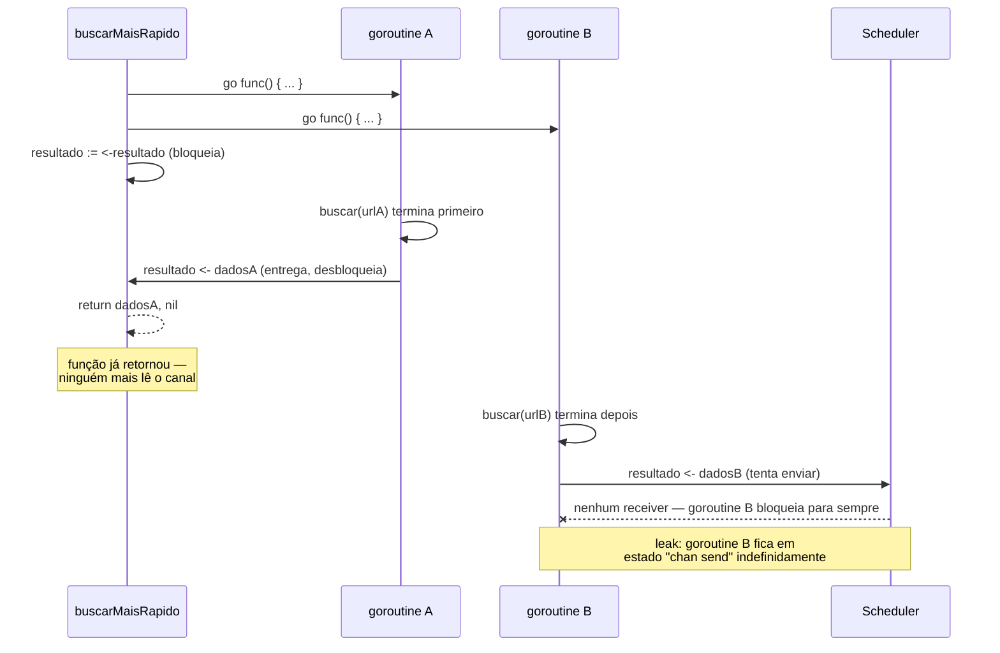
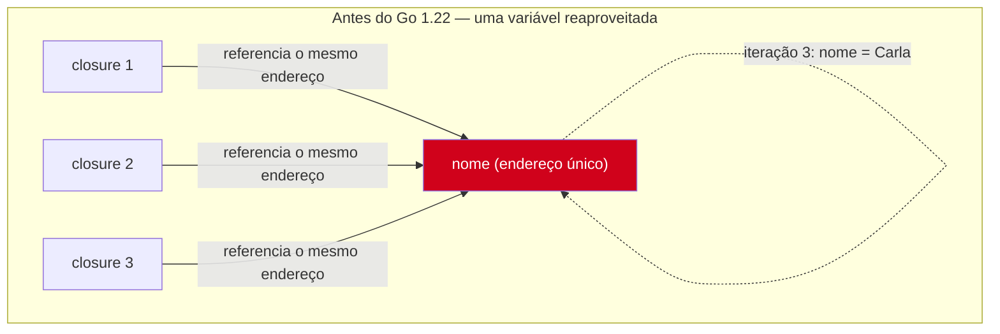
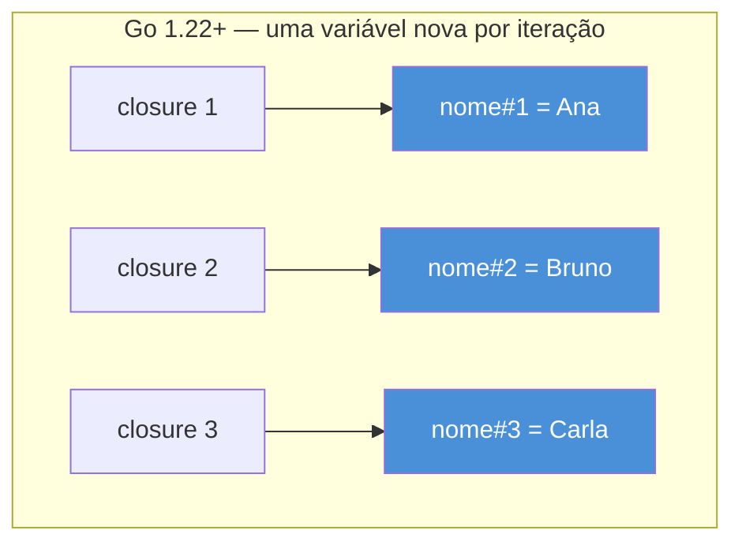

# Armadilhas — leaks e loop var

> [!abstract] TL;DR
> Uma goroutine que bloqueia para sempre — esperando um canal que ninguém mais vai escrever, ou escrevendo num canal que ninguém mais vai ler — **não morre**. Ela fica na memória, presa no scheduler, pra sempre: isso é um *goroutine leak*, e o runtime do Go não tem coletor de goroutines órfãs como tem para memória. A segunda armadilha clássica é histórica: até o **Go 1.21**, a variável de um `for i := range` era **uma única variável reaproveitada** a cada iteração — disparar `go func() { usa(i) }()` dentro do loop quase sempre capturava o valor final de `i`, não o valor da iteração em que a goroutine nasceu. O **Go 1.22** mudou a semântica da linguagem: cada iteração passou a ter sua própria cópia da variável. As duas armadilhas têm a mesma raiz — goroutine é barata de criar, mas cara de esquecer — e cobrar disciplina de fechamento (quem lê para de ler quando o produtor some, quem escreve garante que alguém vai ler) é o que separa código concorrente correto de um vazamento silencioso que só aparece em produção, sob carga, semanas depois.

## O cenário: por que um leak não dá erro nenhum

Imagine um serviço HTTP que, a cada requisição, dispara uma goroutine para buscar dados de duas fontes em paralelo e junta o resultado mais rápido:

```go
func buscarMaisRapido(ctx context.Context, urlA, urlB string) (string, error) {
    resultado := make(chan string) // canal sem buffer

    go func() {
        dados := buscar(urlA)
        resultado <- dados // bloqueia até alguém ler
    }()

    go func() {
        dados := buscar(urlB)
        resultado <- dados
    }()

    return <-resultado, nil // pega só o primeiro que chegar
}
```

Parece razoável: duas goroutines competem, a função devolve o vencedor. Mas repare no que acontece com a **perdedora**. `buscarMaisRapido` lê `resultado` uma única vez e retorna. A segunda goroutine, quando termina de buscar, tenta `resultado <- dados` — e trava ali, porque o canal não tem buffer e não existe mais ninguém do outro lado lendo. `main` já seguiu em frente havia muito tempo.

Essa goroutine não crasha. Não gera warning. Não aparece em nenhum log. Ela simplesmente **fica**, presa num `chan send`, consumindo a pilha que tinha (alguns KB, mas cresce se precisar) e ocupando uma entrada na tabela de goroutines do runtime — até o processo morrer. Se o serviço recebe 1000 requisições por minuto e cada uma vaza uma goroutine, em uma hora são 60 mil goroutines mortas-vivas acumuladas. É devagar, é silencioso, e é exatamente o tipo de bug que passa despercebido em desenvolvimento (poucas requisições, processo reiniciado toda hora) e aparece em produção como um `OOM kill` misterioso depois de dias no ar.

> [!question]- Se a goroutine trava, por que ela não é simplesmente "descartada" pelo garbage collector?
> Porque ela está **viva** do ponto de vista do GC: tem uma pilha ativa, está registrada no scheduler, e (o ponto crucial) o canal `resultado` referenciado por ela ainda tem uma referência alcançável — pelo menos a própria goroutine bloqueada a mantém viva. O GC do Go coleta **memória inalcançável**; uma goroutine bloqueada em `chan send`/`chan receive` está, por definição, esperando ser acordada — o runtime não tem como saber que ninguém jamais vai acordá-la. Não existe "goroutine órfã detectada, encerrando automaticamente". A responsabilidade de garantir que toda goroutine termine é inteiramente do programador.

## O mecanismo: goroutine bloqueada é goroutine presa

O diagrama de sequência abaixo mostra exatamente o momento em que o leak se consuma — a goroutine perdedora tentando entregar um resultado que ninguém vai buscar:



O mesmo mecanismo, generalizado: **qualquer goroutine cujo próximo passo é uma operação bloqueante (`<-ch`, `ch <-`, `mutex.Lock()`, um `select` sem `default` nem `case` disponível) fica presa se essa operação nunca for desbloqueada por outra parte do programa.** Não é um bug do canal, nem do scheduler — é a consequência direta e correta do modelo: canais sem buffer são *rendezvous points* (a nota anterior sobre comunicar em vez de compartilhar já estabeleceu isso), e um rendezvous que nunca acontece deixa um dos lados esperando eternamente.

> [!warning] `go func(){...}()` sem plano de término é uma dívida, não um detalhe
> Toda vez que você escreve `go` antes de uma chamada, a pergunta imediata deveria ser: "e como essa goroutine termina?". Se a resposta for "quando o canal que ela lê/escreve for atendido do outro lado" e você não tem certeza de que isso **sempre** acontece — inclusive nos caminhos de erro, timeout e cancelamento — você provavelmente introduziu um leak. As ferramentas para responder essa pergunta com garantia (`context`, `select` com `default`, canais com buffer dimensionado, `sync.WaitGroup`) são o assunto do Galho 9; aqui o objetivo é reconhecer o problema antes de ter as ferramentas para resolvê-lo por completo.

## Consertando o cenário: dar à goroutine perdedora uma saída

A correção mais simples para o exemplo acima é dar buffer ao canal — assim nenhuma das duas goroutines precisa de um receiver esperando para poder entregar o resultado e terminar:

```go
func buscarMaisRapido(ctx context.Context, urlA, urlB string) (string, error) {
    resultado := make(chan string, 2) // buffer para as duas — nenhuma trava ao enviar

    go func() {
        resultado <- buscar(urlA)
    }()

    go func() {
        resultado <- buscar(urlB)
    }()

    return <-resultado, nil
}
```

Com `make(chan string, 2)`, `ch <- dados` nunca bloqueia — há espaço garantido para as duas gravações, mesmo que só uma seja lida. A goroutine perdedora envia, o valor fica no buffer sem dono, e a goroutine **termina normalmente**, liberando sua pilha. O leak desaparece não porque a goroutine passou a ser "descartada" magicamente, mas porque ela deixou de ter uma operação bloqueante como último passo.

> [!info] Essa correção resolve o leak, não o descarte do valor
> O `dados` da goroutine perdedora fica parado no buffer do canal até o GC coletar o canal inteiro (quando `resultado` sai de escopo e não há mais referências). Isso é memória perdida por um tempo curto, não um leak de goroutine — a distinção importa: a goroutine em si terminou e saiu do scheduler, que é o recurso mais caro de vazar. Padrões mais completos de cancelamento (via `context.Context`, cobertos no Galho 9) evitam até esse desperdício de trabalho, cancelando a busca perdedora antes que ela termine.

## A segunda armadilha: capturar a variável do loop

A segunda cilada clássica não tem nada a ver com bloqueio — é sobre **qual valor** uma goroutine enxerga quando é criada dentro de um `for`. O exemplo canônico, que qualquer dev Go com alguns anos de estrada já foi picado por pelo menos uma vez:

```go
nomes := []string{"Ana", "Bruno", "Carla"}

for _, nome := range nomes {
    go func() {
        fmt.Println(nome)
    }()
}
```

A expectativa ingênua é ver `Ana`, `Bruno`, `Carla` impressos (em alguma ordem, já que goroutines não têm ordem garantida entre si). Em **Go 1.21 e anteriores**, o resultado real costumava ser `Carla`, `Carla`, `Carla` — ou qualquer combinação repetida, dependendo de quão rápido o scheduler processava cada goroutine em relação ao avanço do loop.

## O mecanismo: uma variável, três closures





Antes da mudança, `nome` era **uma única variável**, alocada uma vez fora do corpo do loop e reatribuída a cada iteração — a especificação da linguagem tratava a variável de controle do `for ... range` (e do `for` com três cláusulas) como pertencente ao escopo do `for` inteiro, não a cada iteração. As três closures (`go func() { fmt.Println(nome) }`) não capturavam "o valor de `nome` na iteração em que nasceram" — capturavam **a variável em si**, por referência. Como as goroutines normalmente só chegam a rodar depois que o `for` já avançou (o `go` statement devolve o controle imediatamente, a nota 02 deste galho já mostrou isso), na hora em que `fmt.Println(nome)` de fato executava, o loop quase sempre já tinha terminado e `nome` já valia `Carla` — o último valor atribuído a essa única variável.

> [!info] Go 1.22 mudou a semântica da linguagem, não uma biblioteca
> A partir do **Go 1.22** (lançado em fevereiro de 2024), a especificação passou a declarar uma **variável nova a cada iteração** para `for range` e para a variável de inicialização do `for` de três cláusulas. O código-fonte não muda uma vírgula — `for _, nome := range nomes { go func() { fmt.Println(nome) } }` já produz `Ana`, `Bruno`, `Carla` (em alguma ordem) automaticamente, contanto que o módulo declare `go 1.22` ou superior no `go.mod`. É uma das raras mudanças de **semântica** da linguagem (não só de biblioteca) na história do Go — o time justificou a quebra de compatibilidade formal porque o comportamento antigo era, segundo o próprio anúncio, "a fonte mais comum de bugs relatados por usuários de Go em produção" ligados a concorrência. Times que ainda compilam com `go 1.21` ou anterior no `go.mod` continuam vendo o comportamento antigo — a mudança é opt-in pela diretiva `go` do módulo, não retroativa por versão do toolchain.

## Casos práticos

**1. O padrão problemático, revisitado com `sync.WaitGroup`** (mecanismo completo de espera fica para o Galho 9 — aqui o `WaitGroup` só garante que o `main` espera as goroutines terminarem antes de sair, para o exemplo ser reproduzível):

```go
package main

import (
    "fmt"
    "sync"
)

func main() {
    nomes := []string{"Ana", "Bruno", "Carla"}
    var wg sync.WaitGroup

    for _, nome := range nomes {
        wg.Add(1)
        go func() {
            defer wg.Done()
            fmt.Println(nome)
        }()
    }

    wg.Wait()
    // Go >= 1.22 (go.mod com "go 1.22" ou superior): Ana, Bruno, Carla, em alguma ordem
    // Go <= 1.21: tipicamente Carla, Carla, Carla
}
```

**2. A correção manual, que continua funcionando em qualquer versão** — sombrear a variável dentro do corpo do loop, criando uma cópia local por iteração:

```go
for _, nome := range nomes {
    nome := nome // sombra: nova variável, escopo do corpo do loop
    wg.Add(1)
    go func() {
        defer wg.Done()
        fmt.Println(nome)
    }()
}
```

`nome := nome` declara uma variável nova, local ao corpo do `for`, inicializada com o valor da variável externa **no momento daquela iteração**. Cada closure passa a capturar sua própria cópia. Esse idioma — apelidado de "loop variable shadowing" — é tão comum em código Go pré-1.22 que ferramentas de lint como o `go vet` (com a análise `loopclosure`) e o `golangci-lint` sinalizavam justamente a ausência dele como erro provável.

**3. A alternativa por parâmetro**, equivalente em efeito, passando o valor como argumento da própria goroutine em vez de sombrear:

```go
for _, nome := range nomes {
    wg.Add(1)
    go func(nome string) { // nome aqui é um parâmetro novo, não a variável do loop
        defer wg.Done()
        fmt.Println(nome)
    }(nome) // valor da iteração atual, passado por cópia na chamada
}
```

Passar `nome` como argumento força a cópia no momento da chamada `(nome)` — o parâmetro da função anônima é uma variável própria, independente da variável do loop. Esse padrão funciona em qualquer versão do Go, é o mais visualmente explícito sobre a intenção ("estou congelando este valor aqui"), e continua válido — só deixou de ser *necessário* a partir do 1.22.

**4. Leak combinado com índice de loop** — um erro comum ao processar itens concorrentemente sem limitar goroutines, que mistura as duas armadilhas desta nota:

```go
func processarTodos(itens []Item, resultados chan<- Resultado) {
    for _, item := range itens {
        go func() {
            r := processar(item) // captura correta em Go >= 1.22
            resultados <- r      // leak se resultados não tiver buffer/consumidor suficiente
        }()
    }
}
```

Mesmo com a captura de `item` corrigida pelo Go 1.22, esse código ainda vaza se `resultados` for um canal sem buffer e o consumidor ler menos vezes do que o número de goroutines disparadas — por exemplo, se o consumidor parar de ler após o primeiro erro. As duas armadilhas são independentes: corrigir a captura de variável não corrige um canal mal dimensionado, e vice-versa.

## Armadilhas comuns

> [!warning] `go func()` dentro de handler HTTP sem plano de cancelamento
> Handlers HTTP que disparam goroutines de "trabalho em segundo plano" sem ligar essas goroutines ao `context.Context` da requisição (`r.Context()`) continuam rodando mesmo depois que o cliente cancela a conexão ou o `ResponseWriter` já foi descartado. Em alta escala, isso é a fonte número um de leaks em produção — cada requisição cancelada deixa uma goroutine órfã tentando escrever num canal ou aceder um recurso que ninguém mais espera. O mecanismo de cancelamento propriamente dito é o Galho 9; o hábito a criar já agora é: **toda goroutine de vida mais longa que a função que a criou precisa de um jeito explícito de ser avisada para parar.**

> [!warning] Testar loop var só no `go test` sem `-race` esconde o sintoma
> O bug de captura de loop var pré-1.22 é **não determinístico** — depende de timing entre o avanço do loop e o agendamento da goroutine pelo scheduler. Em máquinas rápidas ou com poucas iterações, o teste pode passar "por acaso" (a goroutine roda antes do loop avançar) e o bug só aparece em produção, sob carga real, com muitas iterações competindo pelo scheduler. `go vet` com a checagem `loopclosure` pega boa parte dos casos estaticamente, sem depender de sorte no timing — vale manter no CI mesmo depois de migrar para `go 1.22`, porque nem todo módulo do monorepo necessariamente já declara a versão nova.

> [!warning] Sombrear `nome := nome` dentro do `go func(){}()` errado não resolve nada
> `nome := nome` **precisa** estar no corpo do `for`, antes do `go`, não dentro da própria goroutine:
> ```go
> for _, nome := range nomes {
>     go func() {
>         nome := nome // tarde demais — já capturou a variável externa por referência
>         fmt.Println(nome)
>     }()
> }
> ```
> Aqui `nome := nome` dentro da closure copia o valor **no momento em que a goroutine roda**, não no momento da iteração — o mesmo timing problemático de antes, só que disfarçado. A cópia precisa acontecer no escopo do `for`, fora da função anônima, para capturar o valor certo antes que o loop avance.

## Lente cross-stack: o mesmo problema, sintomas diferentes

| Vindo de | Equivalente ao "leak" | Equivalente à "captura de loop var" |
|---|---|---|
| **Java** | `Thread` ou `ExecutorService` cuja task fica bloqueada em `BlockingQueue.put()`/`take()` sem consumidor/produtor — o pool nunca recicla essa thread | Lambdas em loop capturam variáveis `effectively final`; o compilador *força* uma cópia por iteração há anos — Java nunca teve esse bug, porque nunca permitiu capturar uma variável mutável de loop por referência |
| **JavaScript/Node** | `Promise` pendente que nunca resolve nem rejeita — sem `await`/`.then()` correspondente, o *handler* fica na *microtask queue* referenciado, sem nunca rodar | `var i` em `for` clássico é famoso pelo mesmo bug (todas as closures veem o `i` final); `let i` (ES6+) já cria binding por iteração — Go 1.22 é, em espírito, o `var`→`let` do Go |
| **Python** | Uma `Thread`/`asyncio.Task` bloqueada para sempre em `queue.get()` ou `await` de algo que nunca completa — o GIL nem entra em jogo aqui, é bloqueio de I/O/sincronização, não de CPU | Mesmíssimo bug histórico: `[lambda: i for i in range(3)]` captura `i` por referência de escopo de função, todas as lambdas veem o valor final — Python nunca corrigiu isso na linguagem; a correção é sempre manual (`lambda i=i: i`) |

A linha mais interessante da tabela é a de JavaScript: a mudança `var` → `let` no ES6 (2015) resolveu exatamente o mesmo bug de captura, quase dez anos antes de Go fazer o equivalente. Go chegou depois porque mudar a semântica de uma variável de loop já existente é uma mudança de compatibilidade muito mais delicada numa linguagem sem sistema de versionamento por arquivo como o `"use strict"`/módulos do JS — daí a diretiva `go 1.22` no `go.mod` funcionar como o interruptor equivalente.

## Por que rodar com foco em não vazar

As duas armadilhas desta nota parecem pontuais — um `nome := nome` esquecido, um canal sem buffer — mas apontam para o mesmo hábito de fundo que separa quem escreve Go concorrente amador de quem escreve Go concorrente de produção: **toda goroutine precisa nascer com uma resposta clara para "quando e como ela termina?"**. Não é sobre lembrar duas regras específicas (que o Go 1.22 já elimina uma delas) — é sobre tratar o `go` statement como um compromisso, não como um `fire-and-forget` grátis. `go` é uma instrução de uma linha; a goroutine que ela cria pode viver muito além do escopo onde nasceu, e nada no compilador obriga você a fechar esse ciclo.

Na prática isso significa perguntar, a cada `go func(){...}()` novo: quem consome o que essa goroutine produz? o que acontece se ninguém mais consumir? existe um caminho de cancelamento (deadline, erro em outra goroutine, shutdown do processo) que precisa alcançá-la? Essas perguntas ainda não têm ferramenta formal nesta nota — `context.Context`, `select` com `default`, e `sync.WaitGroup` usado com disciplina de cancelamento são o assunto do Galho 9 — mas o hábito de fazer a pergunta é o que evita que o leak apareça só em produção, sob carga, dias depois do deploy.

## Como explicar em inglês

> A goroutine blocked forever on a channel send or receive never gets cleaned up automatically — the Go runtime has no notion of "orphaned goroutine," so a leaked goroutine sits in memory, alive from the scheduler's perspective, for the lifetime of the process. This is the single most common concurrency bug in Go services: fire off a goroutine, forget that its channel operation might never find a counterpart, and watch goroutine count climb slowly under load. The second classic pitfall is historical: before **Go 1.22**, the loop variable in `for ... range` was a single variable reused across iterations — closures launched with `go func(){ use(i) }()` inside the loop body almost always captured the final value of `i`, not the value at the iteration where the goroutine was spawned. Go 1.22 changed the language semantics so each iteration gets its own copy of the variable, matching what `let` already did in JavaScript's ES6. Both bugs share the same root cause: goroutines are cheap to create but easy to forget, and writing correct concurrent Go means asking, for every `go` statement, exactly how and when that goroutine is guaranteed to terminate.

| Termo PT | Termo EN |
|---|---|
| vazamento de goroutine | goroutine leak |
| goroutine bloqueada | blocked goroutine |
| captura de variável de loop | loop variable capture |
| sombrear (uma variável) | shadow (a variable) |
| variável por iteração | per-iteration variable |
| canal sem buffer | unbuffered channel |
| condição de corrida | race condition |
| disparar e esquecer | fire and forget |

## O que vem a seguir

Reconhecer as duas armadilhas é a metade fácil — a outra metade é saber **quando vale a pena** disparar uma goroutine em primeiro lugar, e quando o overhead de coordenar tudo isso (canais, `WaitGroup`, cancelamento) supera o ganho de paralelismo. A [[08 - Quando (não) usar goroutines|nota 08]] fecha o galho com esse julgamento: os sinais de que concorrência resolve um problema real, e os sinais de que ela só está adicionando complexidade a um código que rodaria igual (ou mais rápido, sem contenção) de forma sequencial.

## Veja também

- [[02 - A goroutine — o go statement|02 — A goroutine, o go statement]] — por que `go` devolve o controle imediatamente, a raiz do timing por trás do bug de loop var
- [[04 - O ciclo de vida de uma goroutine|04 — O ciclo de vida de uma goroutine]] — estados de uma goroutine, incluindo o bloqueio que causa o leak
- [[05 - Comunicar em vez de compartilhar|05 — Comunicar em vez de compartilhar]] — canais com e sem buffer, base do exemplo de leak desta nota
- [[08 - Quando (não) usar goroutines|08 — Quando (não) usar goroutines]] — próxima nota do galho
- [[03-Dominios/Tecnologia/Go/index|Trilha Go]]

## Fontes

- The Go Authors. *Fixing For Loops in Go 1.22*. go.dev/blog. https://go.dev/blog/loopvar-preview (acessado em 2026-07-18)
- The Go Authors. *The Go Programming Language Specification — For statements*. go.dev. https://go.dev/ref/spec#For_statements (acessado em 2026-07-18)
- The Go Authors. *Go Concurrency Patterns: Pipelines and cancellation*. go.dev/blog. https://go.dev/blog/pipelines (acessado em 2026-07-18)
- The Go Authors. *Go Wiki: Common Mistakes*. go.dev/wiki. https://go.dev/wiki/CommonMistakes (acessado em 2026-07-18)
- Go by Example. *Goroutines*. gobyexample.com. https://gobyexample.com/goroutines (acessado em 2026-07-18)
