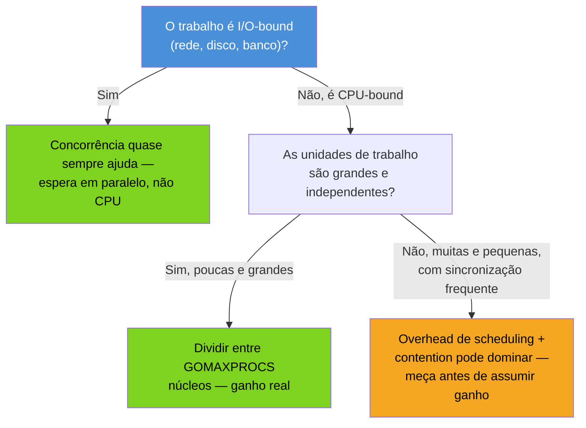
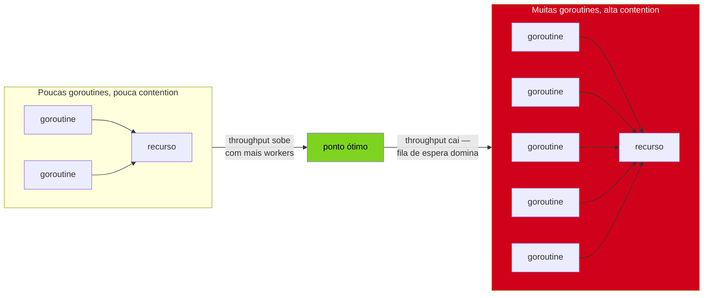

# Quando (não) usar goroutines

> [!abstract] TL;DR
> Goroutine é barata, não é **grátis**. Criar uma custa memória (stack inicial de ~2KB, que cresce) e tempo de scheduling — pouco por goroutine isolada, mas nada desprezível quando multiplicado por milhões ou quando o trabalho de cada uma é ínfimo perto do overhead de despachá-la. Concorrência só acelera trabalho que tem **paralelismo real** disponível: I/O que pode ficar esperando em paralelo, ou CPU-bound que tem núcleos livres e pouca sincronização entre as partes. Um laço CPU-bound sequencial não fica mais rápido só por ganhar `go`; contention em torno de um mutex ou canal compartilhado pode deixar a versão concorrente **mais lenta** que a serial. A régua não é intuição — é `testing.B` e `pprof` medindo antes e depois. Esta nota fecha o Galho 7 com a pergunta que devia vir antes de qualquer `go func()`: isso realmente ajuda, ou só complica?

## O cenário que engana

Imagine que você herdou uma função que processa uma lista de 10 mil números, calculando algo custoso para cada um — digamos, checar se é primo por tentativa de divisão. Sequencial, hoje:

```go
func contarPrimos(nums []int) int {
    total := 0
    for _, n := range nums {
        if ehPrimo(n) {
            total++
        }
    }
    return total
}
```

Alguém no code review comenta: "isso é embaraçosamente paralelo, por que não usa goroutines?" Parece óbvio — cada `ehPrimo(n)` é independente das outras, não compartilha estado, é candidato de manual para paralelismo. A resposta ingênua:

```go
func contarPrimosRuim(nums []int) int {
    var mu sync.Mutex
    total := 0
    var wg sync.WaitGroup

    for _, n := range nums {
        wg.Add(1)
        go func(n int) {
            defer wg.Done()
            if ehPrimo(n) {
                mu.Lock()
                total++
                mu.Unlock()
            }
        }(n)
    }
    wg.Wait()
    return total
}
```

Compila, roda, dá o resultado certo. E é bem provável que seja **mais lenta** que a versão sequencial — não "só um pouco mais rápida do que devia", mas pior. Por quê? Porque a nota trocou um trabalho barato (uma iteração de laço) por um trabalho caro (criar uma goroutine, agendá-la, e disputar um mutex) 10 mil vezes seguidas, para um `ehPrimo` que, se `n` for pequeno, termina quase instantaneamente. O overhead de orquestrar a concorrência passou a dominar o tempo total — o trabalho em si virou irrelevante perto do custo de gerenciá-lo.

Essa é a armadilha central desta nota: goroutine é barata **em termos absolutos**, comparada a uma thread de SO (a [[06 - Goroutines vs threads, event loop e GIL|nota 06]] já mostrou os números — KBs contra MBs, microssegundos contra milissegundos). Mas "mais barata que a alternativa" não é o mesmo que "grátis". Cada `go func()` ainda aloca uma stack, ainda entra numa fila do scheduler, ainda compete por um M para rodar. Multiplicado por dez mil, com um mutex disputado a cada iteração, o overhead vira o gargalo — não o cálculo de primalidade.

## O que realmente determina o ganho

Existe uma pergunta anterior a "uso goroutine ou não": **onde está o paralelismo real neste problema?** Duas famílias de trabalho se beneficiam de concorrência, por razões diferentes:

**I/O-bound.** Uma goroutine bloqueada esperando resposta de rede, disco ou banco de dados não ocupa nenhum núcleo de CPU — ela é parqueada, e o scheduler roda outra coisa no P liberado (mecanismo detalhado na [[03 - O modelo GMP por cima|nota 03]]). Aqui, lançar centenas ou milhares de goroutines para requisições HTTP concorrentes tem ganho real: o gargalo é a **latência de espera**, não o processador, e várias esperas em paralelo terminam bem antes do que em série.

**CPU-bound com pouca sincronização.** Se o trabalho é pesado de CPU e as partes são de fato independentes — sem mutex, sem canal disputado a cada micro-passo — dividir entre `GOMAXPROCS` núcleos físicos dá ganho proporcional ao número de núcleos disponíveis. Mas repare na condição: **poucos** pedaços de trabalho **grandes**, não milhares de pedaços minúsculos. É a diferença entre dividir uma imagem de 4000×3000 pixels em 8 fatias (uma por núcleo) e lançar 12 milhões de goroutines, uma por pixel.

O caso que *não* se beneficia é justamente o do exemplo acima: CPU-bound, mas com sincronização a cada unidade de trabalho (o mutex protegendo `total`) e unidades de trabalho pequenas demais para amortizar o custo de despachar cada uma. A regra informal que resume os três casos:



Essa árvore não substitui medição — é um filtro de bom senso antes de gastar tempo escrevendo (e depurando) a versão concorrente. Se a resposta cai no ramo laranja, o próximo passo não é "otimizar o código concorrente" — é perguntar se ele deveria existir.

> [!question]- "Embaraçosamente paralelo" não garante ganho, então?
> Garante que **existe** paralelismo disponível no problema — as partes não dependem umas das outras. Não garante que o **custo de explorar esse paralelismo** compense, e esse é exatamente o ponto que o exemplo de `contarPrimos` expõe. Um problema embaraçosamente paralelo com unidades de trabalho minúsculas ainda perde para a versão sequencial se o overhead de despachar cada unidade for maior que a unidade em si. A pergunta certa não é "isso é paralelizável?" — é "o paralelismo aqui é grande o bastante para pagar o próprio custo de organização?".

## Medir antes: benchmark, não intuição

A única forma confiável de responder "isso ajuda?" é medir as duas versões sob as mesmas condições, com a ferramenta que o próprio Go oferece para isso: `testing.B`.

```go
// primos_test.go
package primos

import "testing"

func gerarNums(n int) []int {
    nums := make([]int, n)
    for i := range nums {
        nums[i] = i + 2 // evita 0 e 1
    }
    return nums
}

func BenchmarkSequencial(b *testing.B) {
    nums := gerarNums(10_000)
    b.ResetTimer()
    for i := 0; i < b.N; i++ {
        contarPrimos(nums)
    }
}

func BenchmarkConcorrenteRuim(b *testing.B) {
    nums := gerarNums(10_000)
    b.ResetTimer()
    for i := 0; i < b.N; i++ {
        contarPrimosRuim(nums)
    }
}
```

```
go test -bench=. -benchmem
BenchmarkSequencial-8         120    9_812_004 ns/op       0 B/op    0 allocs/op
BenchmarkConcorrenteRuim-8     18   64_301_557 ns/op  890_112 B/op 20003 allocs/op
```

Números ilustrativos, mas a forma do resultado é real e recorrente: a versão "concorrente" não só é mais lenta em tempo — `ns/op` seis vezes pior — como aloca ordens de grandeza mais memória (`B/op`) e faz vinte mil alocações a mais por execução (uma por goroutine, mais o overhead do `WaitGroup`). O `-benchmem` existe justamente para expor esse segundo custo, que a intuição costuma ignorar: cada goroutine lançada é uma alocação de stack que o coletor de lixo eventualmente precisa varrer.

> [!info] `testing.B` e o flag `-benchmem` são parte do pacote `testing` desde as primeiras versões estáveis de Go — não é feature nova, mas segue sendo a ferramenta subutilizada de quem decide sobre concorrência "no olho".

A correção — se o trabalho realmente compensa paralelizar — não é abandonar goroutines, é **reduzir a granularidade**: dividir o trabalho em poucos blocos grandes (um por núcleo lógico, via `runtime.GOMAXPROCS(0)`), não um por item.

```go
func contarPrimosWorkerPool(nums []int) int {
    numWorkers := runtime.GOMAXPROCS(0)
    tamBloco := (len(nums) + numWorkers - 1) / numWorkers

    var wg sync.WaitGroup
    resultados := make([]int, numWorkers)

    for w := 0; w < numWorkers; w++ {
        inicio := w * tamBloco
        fim := min(inicio+tamBloco, len(nums))
        if inicio >= fim {
            continue
        }

        wg.Add(1)
        go func(idx, inicio, fim int) {
            defer wg.Done()
            local := 0
            for _, n := range nums[inicio:fim] {
                if ehPrimo(n) {
                    local++
                }
            }
            resultados[idx] = local // sem mutex — cada goroutine escreve seu próprio slot
        }(w, inicio, fim)
    }
    wg.Wait()

    total := 0
    for _, r := range resultados {
        total += r
    }
    return total
}
```

A diferença estrutural em relação à primeira versão concorrente é dupla: (1) `numWorkers` goroutines, não `len(nums)` — poucas, cada uma com trabalho substancial; (2) nenhum mutex disputado a cada iteração — cada goroutine escreve num slot próprio de `resultados`, e a soma final acontece depois de todas terminarem, sem contention. Rodando o mesmo benchmark contra essa versão:

```
BenchmarkWorkerPool-8    1050    1_143_902 ns/op    1_024 B/op    9 allocs/op
```

Agora sim: quase 9x mais rápido que o sequencial em uma máquina de 8 núcleos, com uma fração das alocações da tentativa ingênua. A lição não é "sempre use worker pool" — é que a **granularidade** do paralelismo (poucas unidades grandes vs. muitas unidades minúsculas) e a **ausência de contention** por sincronização fina são os dois fatores que decidem se `go func()` ajuda ou atrapalha, e nenhum dos dois se resolve por intuição.

> [!question]- Por que não usar `sync/atomic` em vez de mutex na primeira versão, e ver se melhora?
> Ajudaria — trocar `mu.Lock()`/`mu.Unlock()` por `atomic.Int64.Add(1)` reduz o custo de cada incremento. Mas não resolve o problema estrutural: o overhead dominante ali não é *só* o mutex, é o fato de existirem 10 mil goroutines para um trabalho que, individualmente, é pequeno demais para justificar o custo de despachar cada uma. Trocar a sincronização por uma versão mais barata melhora a constante; reduzir o número de goroutines de 10.000 para `GOMAXPROCS` muda a ordem de grandeza. Vale medir os dois, mas a granularidade costuma pesar mais que o tipo de sincronização escolhido.

## Contention: quando mais goroutines pioram tudo

O exemplo acima já mostrou uma faceta de contention — disputa por um mutex compartilhado. Vale nomear o fenômeno com precisão, porque ele aparece em formas menos óbvias do que "um mutex protegendo uma variável".

**Contention** é o tempo que goroutines gastam **esperando** por um recurso disputado — um mutex, um canal sem buffer, ou até uma linha de cache de CPU compartilhada entre núcleos (*false sharing*, quando duas goroutines em núcleos diferentes escrevem em variáveis vizinhas na memória, forçando invalidação de cache mesmo sem overlap lógico nenhum). Quanto mais goroutines competindo pelo mesmo recurso, mais tempo é gasto em espera e menos em trabalho útil — e a partir de um certo ponto, adicionar *mais* goroutines piora o throughput em vez de melhorar, porque o custo de coordenar a fila de espera cresce mais rápido que o paralelismo ganho.



Esse formato — throughput sobe, atinge um pico, depois cai conforme mais concorrência é adicionada — é conhecido informalmente como o *ponto de retorno decrescente* da concorrência. Não existe fórmula fixa para onde ele fica; depende do recurso disputado, do hardware, e do que cada goroutine faz entre uma seção crítica e outra. É por isso que a resposta certa para "quantos workers eu uso?" quase sempre é "meça com valores diferentes de `numWorkers` e veja onde o benchmark para de melhorar" — não um número cravado na cabeça.

> [!warning] `runtime.GOMAXPROCS` não é sempre "mais é melhor"
> `GOMAXPROCS` controla quantos núcleos lógicos o scheduler pode usar simultaneamente para rodar goroutines — não quantas goroutines podem existir (isso não tem limite prático imposto pelo runtime). Aumentar `GOMAXPROCS` além do número de núcleos físicos disponíveis na máquina não cria paralelismo extra — só faz o SO alternar entre mais goroutines de trabalho pelo mesmo número de núcleos reais, com custo adicional de troca de contexto. Em contêineres, isso é uma armadilha concreta: se o processo enxerga `GOMAXPROCS` = número de CPUs da máquina host, mas o `cgroup` limita a fração de CPU disponível para o contêiner, o scheduler agenda mais paralelismo do que o hardware alocado realmente sustenta — assunto que volta com profundidade no galho de produção (Galho 17).

## Casos práticos: quando vale, quando não vale

**1. I/O-bound com goroutines — ganho quase garantido.** Buscar dados de múltiplas URLs:

```go
func buscarTodas(urls []string) []string {
    resultados := make([]string, len(urls))
    var wg sync.WaitGroup

    for i, url := range urls {
        wg.Add(1)
        go func(idx int, url string) {
            defer wg.Done()
            resp, err := http.Get(url)
            if err != nil {
                resultados[idx] = "erro: " + err.Error()
                return
            }
            defer resp.Body.Close()
            resultados[idx] = resp.Status
        }(i, url)
    }
    wg.Wait()
    return resultados
}
```

Dez requisições HTTP sequenciais, cada uma levando 200ms de latência de rede, somam 2 segundos. Concorrentes, o tempo total tende ao maior tempo individual — perto de 200ms — porque a espera de cada uma sobrepõe as outras. Aqui a resposta a "vale a pena?" é quase sempre sim, sem precisar de benchmark para confirmar a intuição — a espera de rede domina qualquer overhead de scheduling.

**2. CPU-bound serial que não ganha nada com `go`.** Uma soma acumulada onde cada passo depende do anterior:

```go
func somaAcumulada(nums []int) []int {
    resultado := make([]int, len(nums))
    acumulado := 0
    for i, n := range nums {
        acumulado += n
        resultado[i] = acumulado
    }
    return resultado
}
```

Não há forma de paralelizar isso de forma direta — `resultado[i]` depende de `resultado[i-1]`. Lançar uma goroutine por posição não faz sentido nenhum: a dependência serial *é* o próprio algoritmo. (Existem algoritmos paralelos de *prefix sum* que quebram essa dependência com uma estrutura diferente, mas isso foge do escopo desta nota — o ponto é que "parece um laço, logo é paralelizável" é um raciocínio falho por si só.)

**3. CPU-bound paralelizável, mas testado antes de assumir.** Redimensionar um lote de imagens é candidato genuíno a paralelismo — cada imagem é independente, e o trabalho por imagem é grande o bastante para amortizar o overhead:

```go
func redimensionarLote(caminhos []string) error {
    numWorkers := runtime.GOMAXPROCS(0)
    jobs := make(chan string, len(caminhos))
    errs := make(chan error, len(caminhos))

    for w := 0; w < numWorkers; w++ {
        go func() {
            for caminho := range jobs {
                errs <- redimensionar(caminho) // trabalho pesado por item
            }
        }()
    }

    for _, c := range caminhos {
        jobs <- c
    }
    close(jobs)

    for range caminhos {
        if err := <-errs; err != nil {
            return err
        }
    }
    return nil
}
```

Este padrão (*worker pool* com canal de trabalho) reaparece com profundidade no próximo galho, dedicado inteiramente a channels — a versão acima usa canais no mínimo necessário para não antecipar o assunto, mas já dá o formato geral: número fixo de workers, trabalho suficientemente grande por item, sem sincronização fina disputada a cada micro-passo.

## Armadilhas comuns

> [!warning] "Paralelo" não é sinônimo de "mais rápido"
> A intuição de que "mais goroutines = mais rápido" ignora dois custos reais: o overhead de criar e agendar cada goroutine, e a contention entre elas por recursos compartilhados. Um programa com 10.000 goroutines rodando em 4 núcleos não faz 10.000 coisas ao mesmo tempo — faz, no máximo, 4 coisas de CPU ao mesmo tempo (mais quantas estiverem bloqueadas em I/O), e paga o custo de trocar entre as demais. Medir é a única forma de saber se o saldo é positivo.

> [!warning] Contention derrota o paralelismo silenciosamente
> Um programa com muitas goroutines disputando o mesmo mutex pode rodar **mais devagar** que a versão sequencial, sem nenhum erro, sem nenhum aviso — só um benchmark pior. Não há sintoma óbvio de "estou sofrendo de contention" além de medir; `go tool pprof` com perfil de bloqueio (`runtime/pprof.Lookup("mutex")` ou `go test -blockprofile`) é a ferramenta certa para confirmar a suspeita antes de reestruturar o código.

> [!warning] Benchmark sem `-benchmem` esconde metade do custo
> `ns/op` sozinho mede tempo, mas não aloca visível. Duas versões podem ter tempo parecido e uma delas pressionar o coletor de lixo dez vezes mais — isso se paga depois, em pausas de GC sob carga real, não no benchmark isolado. `-benchmem` (`B/op`, `allocs/op`) é parte do custo de decidir se vale a pena, não um detalhe opcional.

> [!warning] Não otimize um problema que ainda não apareceu
> A contrapartida de tudo isso: se o programa já é rápido o bastante para o que precisa fazer, introduzir concorrência por "parecer mais profissional" só adiciona superfície de bugs (a [[07 - Armadilhas — leaks e loop var|nota 07]] já cobriu leaks e captura de variável) sem benefício mensurável. A pergunta "vale a pena paralelizar isso?" tem que vir acompanhada de "isso é, hoje, um gargalo real?" — perfilar com `pprof` antes de assumir que sim.

## Lente cross-stack: "vou paralelizar" em cada mundo

A [[06 - Goroutines vs threads, event loop e GIL|nota 06]] já comparou o mecanismo de concorrência entre Go, Java, Node e Python. Esta nota fecha com o hábito de **medir antes**, que muda de forma conforme a plataforma, mas não de princípio:

| Vindo de | O equivalente a "meça antes" |
|---|---|
| Java | `ExecutorService` com pool mal dimensionado sofre do mesmo problema — poucas threads grandes tendem a vencer muitas threads pequenas; JMH (Java Microbenchmark Harness) é o `testing.B` do mundo Java |
| Node.js | Como o event loop já é single-threaded para JS, o risco análogo é bloquear o loop com trabalho síncrono pesado — o "overhead" lá é I/O que devia ser assíncrono e não é, não excesso de threads |
| Python | GIL limita paralelismo de CPU dentro de um processo (a nota 06 detalhou isso); "paralelizar com threads" em CPU-bound Python raramente ajuda pelo mesmo motivo estrutural — e `multiprocessing` troca o problema por overhead de IPC, que também precisa ser medido |

O padrão se repete em qualquer stack: intuição sobre concorrência erra com frequência suficiente para nunca ser a palavra final — só o benchmark decide.

## Como explicar em inglês

> A goroutine is cheap relative to an OS thread, but "cheap" is not "free": spawning one still allocates a small stack and costs scheduler time, and multiplying that by thousands of tiny units of work can make a program slower than its sequential counterpart. Concurrency pays off in two situations — I/O-bound work, where goroutines spend most of their time parked waiting rather than competing for CPU, and CPU-bound work split into few, large, mostly-independent chunks. It backfires when work units are too small to amortize scheduling overhead, or when goroutines contend heavily for a shared mutex or channel — contention can make a "parallel" version slower than serial, silently, with no error to flag it. The only reliable way to decide is `testing.B` benchmarks with `-benchmem`, comparing sequential against concurrent under the same load, and `pprof` block/mutex profiles when contention is suspected. Intuition about parallelism is wrong often enough that it should never be the final word — only measurement is.

| Termo PT | Termo EN |
|---|---|
| overhead de scheduling | scheduling overhead |
| disputa / contenção | contention |
| granularidade | granularity |
| unidade de trabalho | unit of work |
| worker pool | worker pool |
| ponto de retorno decrescente | diminishing returns |
| falso compartilhamento | false sharing |
| perfil de bloqueio | block profile |

## O que vem a seguir

Esta nota fecha o Galho 7 respondendo à pergunta que devia ter vindo desde o início: *vale a pena paralelizar isso?* O galho inteiro tratou a goroutine isolada — como criá-la, seu ciclo de vida, como ela se compara a threads, quando ela vaza, e agora quando ela sequer compensa existir. O que ficou propositalmente de fora, mencionado só de raspão nos exemplos de worker pool, é a peça que faz goroutines conversarem entre si de forma segura: **channels**. O Galho 8 — Channels e select entra a fundo nesse mecanismo — como um channel comunica valores e sincroniza timing ao mesmo tempo, buffered vs unbuffered, o `select` para lidar com múltiplos channels, e os padrões (pipeline, fan-out/fan-in) que resolvem exatamente o problema desta nota: organizar concorrência em unidades de trabalho do tamanho certo, sem contention desnecessária.

## Veja também

- [[03 - O modelo GMP por cima|03 — O modelo GMP por cima]] — por que goroutines bloqueadas em I/O não custam núcleo, base para entender por que I/O-bound se beneficia tanto de concorrência
- [[06 - Goroutines vs threads, event loop e GIL|06 — Goroutines vs threads, event loop e GIL]] — comparação de mecanismo entre Go, Java, Node e Python retomada na lente cross-stack acima
- [[07 - Armadilhas — leaks e loop var|07 — Armadilhas — leaks e loop var]] — os bugs de concorrência mal escrita; esta nota cobre o custo de concorrência bem escrita mas desnecessária
- [[03-Dominios/Tecnologia/Go/index|Trilha Go]]

## Fontes

- The Go Authors. *Profiling Go Programs*. go.dev/blog. https://go.dev/blog/pprof (acessado em 2026-07-18)
- The Go Authors. *Diagnostics — pprof and benchmarking*. go.dev/doc. https://go.dev/doc/diagnostics (acessado em 2026-07-18)
- The Go Authors. *package testing — Benchmarks*. pkg.go.dev. https://pkg.go.dev/testing#hdr-Benchmarks (acessado em 2026-07-18)
- The Go Authors. *package runtime — GOMAXPROCS*. pkg.go.dev. https://pkg.go.dev/runtime#GOMAXPROCS (acessado em 2026-07-18)
- The Go Authors. *Effective Go — Concurrency*. go.dev. https://go.dev/doc/effective_go#concurrency (acessado em 2026-07-18)
- Go by Example. *Worker Pools*. gobyexample.com. https://gobyexample.com/worker-pools (acessado em 2026-07-18)
