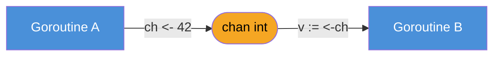
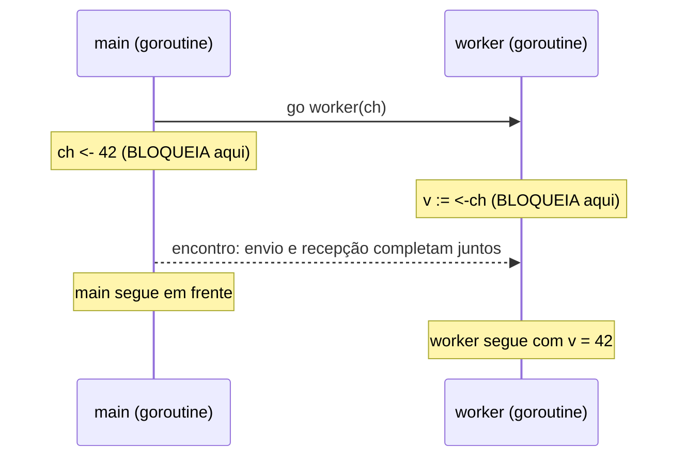

# Channels — o tubo entre goroutines

> [!abstract] TL;DR
> Um **channel** é um tipo embutido de Go — `chan T` — que serve de tubo tipado entre goroutines: `ch := make(chan T)` cria o tubo, `ch <- v` envia um valor `T` por ele, `v := <-ch` recebe. A propriedade que muda tudo, em um channel **unbuffered** (`make(chan T)`, sem capacidade): o envio **bloqueia** até que alguma goroutine esteja pronta para receber, e vice-versa. Não é fila — é **rendezvous**, ponto de encontro. As duas goroutines se sincronizam no instante exato da troca, sem precisar de lock nenhum, porque a comunicação *é* a sincronização. É o pilar do lema de Go: "share memory by communicating" — passar o dado pelo channel em vez de duas goroutines cutucarem a mesma variável ao mesmo tempo.

## O problema que o channel resolve

A [[03-Dominios/Tecnologia/Go/07 - Goroutines e o scheduler/02 - A goroutine — o go statement|nota sobre o `go` statement, no galho anterior]] mostrou como disparar uma goroutine com `go f()` — trivial, uma palavra-chave. O problema chega logo depois: como essa goroutine **devolve** um resultado para quem a disparou?

Em Java ou em Node, a resposta é familiar: um `Future`/`Promise`, ou uma variável compartilhada protegida por lock. A tentação, em Go, é reproduzir a segunda opção direto:

```go
var resultado int

func main() {
    go func() {
        resultado = calcularAlgoDemorado()
    }()

    fmt.Println(resultado) // corrida: pode rodar ANTES da goroutine terminar
}
```

Isso compila e às vezes até "funciona" — o que é pior do que falhar sempre. Não há garantia nenhuma de que a goroutine lançada com `go` termine antes do `fmt.Println` ler `resultado`. `main` e a goroutine leem/escrevem a mesma variável sem qualquer coordenação: é uma **data race** clássica, do tipo que o `-race` detector pega, mas que pode passar despercebida em produção por meses até o dia em que o timing muda.

Go oferece uma saída deliberadamente diferente de mutex-em-toda-variável-compartilhada: o **channel**. Em vez de duas goroutines brigarem pelo acesso à mesma memória, uma **envia** o valor e a outra **recebe** — a posse do dado passa de mão em mão, nunca é compartilhada ao mesmo tempo. É a citação mais repetida da comunidade Go, atribuída ao [Effective Go](https://go.dev/doc/effective_go#sharing_by_communicating) e a Rob Pike: *"Do not communicate by sharing memory; instead, share memory by communicating."*

## Criando e usando um channel

Um channel é um tipo de primeira classe em Go — assim como `map` e `slice`, precisa ser inicializado com `make` antes de usar. Um `chan int` "zero value" é `nil`, e enviar ou receber num channel `nil` bloqueia para sempre (volta na nota 08 de armadilhas).

```go
ch := make(chan int) // channel unbuffered de int

go func() {
    ch <- 42 // envia 42 pelo channel
}()

v := <-ch // recebe de ch; bloqueia até alguém enviar
fmt.Println(v) // 42
```

Três operadores, todos com a mesma seta `<-`, cuja direção muda o significado conforme a posição:

- `make(chan T)` — cria o channel, tipado para carregar valores `T`.
- `ch <- v` — **envia**: a seta aponta *para dentro* do channel.
- `v := <-ch` — **recebe**: a seta aponta *para fora* do channel, na direção da variável.



Não há sintaxe separada para "criar canal" vs "criar canal de int vs de string" — o tipo do elemento é parte do tipo do channel, `chan int` e `chan string` são tipos distintos, incompatíveis entre si, checados em tempo de compilação como qualquer outro tipo Go.

## Unbuffered: o rendezvous

O detalhe que separa Go de uma fila comum, e que costuma confundir quem chega de sistemas de mensageria (Kafka, RabbitMQ, filas em geral): `make(chan T)`, sem segundo argumento, cria um channel **unbuffered** — capacidade zero. Ele não guarda nada. Não existe um "buffer interno" com um valor esperando ser lido.

O que existe é um ponto de encontro. `ch <- v` **bloqueia** a goroutine que envia até que outra goroutine, em outro lugar, execute `<-ch` e esteja pronta para receber *naquele exato instante*. Simetricamente, `<-ch` bloqueia até que exista um `ch <- v` pronto do outro lado. As duas operações só completam **juntas** — daí o nome técnico, tomado de empréstimo da teoria de CSP (Communicating Sequential Processes, de Tony Hoare, a base formal por trás do modelo de concorrência de Go): **rendezvous**.



É esse bloqueio mútuo que resolve o problema da seção anterior sem precisar de lock nenhum:

```go
func main() {
    ch := make(chan int)

    go func() {
        resultado := calcularAlgoDemorado()
        ch <- resultado // envia — bloqueia até main receber
    }()

    v := <-ch // recebe — bloqueia até a goroutine enviar
    fmt.Println(v) // garantidamente o resultado já calculado
}
```

Não há corrida aqui. `v := <-ch` só retorna depois que `ch <- resultado` do outro lado já aconteceu — o próprio ato de comunicação garante a ordem. É diferente de "esperar a goroutine terminar" (isso seria trabalho de um `sync.WaitGroup`, fora do escopo desta nota — assunto do galho 9): é sincronizar exatamente no ponto da troca de dado, nem antes nem depois.

> [!info] Channel como *first-class value*
> `chan T` é um tipo comum em Go: pode ser guardado em variável, passado como argumento de função, retornado de função, armazenado em struct ou slice. Não existe API separada de "canal" fora do próprio sistema de tipos — `ch := make(chan int)` te dá um valor que se comporta como qualquer outro, exceto pela semântica especial de `<-`.

## Casos práticos

**1. Sinalizando conclusão sem passar dado — `chan struct{}`**, o idioma mais comum para "avise quando terminar":

```go
func main() {
    done := make(chan struct{})

    go func() {
        fmt.Println("trabalho em andamento...")
        time.Sleep(100 * time.Millisecond)
        fmt.Println("trabalho concluído")
        done <- struct{}{} // sinal, sem payload relevante
    }()

    <-done // bloqueia até o sinal chegar
    fmt.Println("main sabe que terminou")
}
```

`struct{}` — o struct vazio — ocupa zero bytes; é o tipo idiomático quando o channel serve só de sinal, não de transporte de dado. `chan bool` também funciona, mas `chan struct{}` deixa explícito na assinatura: "o valor não importa, só o instante em que ele chega importa".

**2. Pipeline mínimo de duas etapas**, uma goroutine produz, outra consome, o channel é o tubo entre elas:

```go
func gerarQuadrados(n int, saida chan<- int) {
    for i := 1; i <= n; i++ {
        saida <- i * i
    }
}

func main() {
    ch := make(chan int)

    go gerarQuadrados(5, ch)

    for i := 0; i < 5; i++ {
        fmt.Println(<-ch)
    }
    // 1, 4, 9, 16, 25 — cada valor sincroniza produtor e consumidor
}
```

> [!info] `chan<- int` na assinatura de `gerarQuadrados`
> A anotação de direção (`chan<- int` = só-envio) é assunto pleno da [[04 - Direções de channel|nota 04]] deste galho — aqui vale só notar que ela existe e que o compilador a checa: dentro de `gerarQuadrados`, tentar `<-saida` (receber) não compilaria.

**3. Duas goroutines conversando** — o encontro acontece em ambas as direções, não só goroutine-para-main:

```go
func eco(entrada, saida chan string) {
    for {
        msg := <-entrada
        saida <- strings.ToUpper(msg)
    }
}

func main() {
    entrada := make(chan string)
    saida := make(chan string)

    go eco(entrada, saida)

    entrada <- "ola"
    fmt.Println(<-saida) // OLA

    entrada <- "go"
    fmt.Println(<-saida) // GO
}
```

Cada `entrada <- msg` bloqueia até `eco` estar em `<-entrada`; cada `<-saida` em `main` bloqueia até `eco` enviar de volta. Quatro rendezvous no total, um por linha de troca — o programa inteiro avança em passos sincronizados, sem uma única variável compartilhada fora dos channels.

## Armadilhas comuns

> [!warning] Enviar ou receber num channel sem goroutine do outro lado trava para sempre
> `ch := make(chan int); ch <- 1` numa única goroutine (por exemplo, dentro de `main`, sem nenhum `go` que vá receber) produz `fatal error: all goroutines are asleep - deadlock!` — o runtime de Go detecta quando **todas** as goroutines estão bloqueadas esperando algo que nunca vai acontecer, e mata o programa. Isso não é um bug raro: é o erro mais comum de quem está aprendendo channel, porque é fácil esquecer que unbuffered exige as duas pontas prontas ao mesmo tempo.

> [!warning] Channel `nil` bloqueia para sempre, silenciosamente
> Um `var ch chan int` (sem `make`) vale `nil`. Enviar ou receber num channel `nil` bloqueia indefinidamente — mas, ao contrário do deadlock de goroutine única, isso *não* necessariamente derruba o programa inteiro se outras goroutines seguem rodando; a goroutine travada em `nil` simplesmente nunca mais acorda. É um vazamento silencioso de goroutine, não um crash explícito — mais traiçoeiro que o deadlock óbvio.

> [!warning] Unbuffered não é fila — não guarda nada para "depois"
> Quem já usou uma fila de mensageria pode assumir, por reflexo, que `ch <- v` "deposita" `v` em algum lugar e segue em frente. Num channel unbuffered, não: `ch <- v` só retorna quando alguém já está recebendo. Se você quer que o envio não bloqueie enquanto ninguém está pronto para receber, a ferramenta certa é um channel **buffered** — `make(chan T, capacidade)` — que tem semântica bem diferente e é o assunto inteiro da [[02 - Buffered vs unbuffered|próxima nota]].

## Vindo de outras linguagens

| Linguagem | Mecanismo mais próximo | Diferença chave |
|---|---|---|
| Java | `BlockingQueue`, `SynchronousQueue` | `SynchronousQueue` é o parente mais próximo — capacidade zero, rendezvous — mas é um caso especial de uma família de filas; em Go, unbuffered é o **padrão**, não a exceção |
| Python | `queue.Queue`, ou `asyncio.Queue` | Filas Python quase sempre têm buffer (mesmo que grande); simular rendezvous puro exige `maxsize=0` com semântica própria, não é o caminho natural |
| JavaScript/Node | `Promise`, `EventEmitter` | Não há tubo tipado nativo entre duas execuções concorrentes; a analogia mais próxima é resolver uma `Promise` — mas isso é 1-para-1 e não repetível como um channel |
| Rust | `std::sync::mpsc::channel` | Conceitualmente muito próximo — canal tipado, `send`/`recv` — mas o canal padrão de Rust é assíncrono (buffer ilimitado); rendezvous exige `sync_channel(0)` explicitamente |

A lição de fundo, para quem chega de qualquer uma dessas linguagens: em Go, o channel unbuffered **não é a versão "sem otimização" de uma fila** — é a ferramenta de sincronização primária, deliberadamente escolhida como padrão porque força você a pensar em handoff explícito de dado, não em fila implícita crescendo sem controle.

## Como explicar em inglês

> A **channel** in Go is a built-in, typed pipe between goroutines — created with `make(chan T)`, used to send with `ch <- v` and receive with `v := <-ch`. The property that surprises newcomers: an **unbuffered** channel (`make(chan T)`, no capacity argument) has no internal storage at all. A send blocks until some goroutine is ready to receive at that exact moment, and a receive blocks until a send is ready — the two operations complete together, a **rendezvous** in the CSP sense (Communicating Sequential Processes, Tony Hoare's formalism behind Go's concurrency model). This is the mechanism behind Go's famous motto: "Do not communicate by sharing memory; instead, share memory by communicating." Rather than two goroutines racing to read and write the same variable under a mutex, one goroutine hands a value to another through the channel — ownership transfers, it's never shared at the same instant.

| Termo PT | Termo EN |
|---|---|
| channel (canal) | channel |
| enviar | send |
| receber | receive |
| unbuffered (sem buffer) | unbuffered |
| ponto de encontro / rendezvous | rendezvous |
| bloquear | block |
| deadlock | deadlock |
| corrida de dados | data race |
| sinal (sem payload) | signal |

## O que vem a seguir

Esta nota tratou só do caso mais restrito — `make(chan T)`, sem capacidade, com bloqueio total em cada troca. A [[02 - Buffered vs unbuffered|próxima nota]] relaxa essa restrição: `make(chan T, n)` cria um channel com espaço para `n` valores em trânsito, mudando a semântica de bloqueio de forma que muda também o desenho de programas concorrentes — quando um produtor pode "adiantar trabalho" sem esperar o consumidor, e os riscos que isso introduz.

## Veja também

- [[02 - Buffered vs unbuffered|02 — Buffered vs unbuffered]] — próxima nota do galho
- [[03 - Fechando channels e o range|03 — Fechando channels e o range]] — o que acontece quando o produtor termina de vez
- [[05 - select|05 — select]] — coordenar múltiplos channels ao mesmo tempo
- [[03-Dominios/Tecnologia/Go/07 - Goroutines e o scheduler/05 - Comunicar em vez de compartilhar|Galho 7, nota 05 — Comunicar em vez de compartilhar]] — o princípio que este galho inteiro coloca em prática
- [[03-Dominios/Tecnologia/Go/index|Trilha Go]]

## Fontes

- The Go Authors. *The Go Programming Language Specification — Channel types*. go.dev. https://go.dev/ref/spec#Channel_types (acessado em 2026-07-18)
- The Go Authors. *A Tour of Go — Channels*. go.dev. https://go.dev/tour/concurrency/2 (acessado em 2026-07-18)
- The Go Authors. *Effective Go — Channels*. go.dev. https://go.dev/doc/effective_go#channels (acessado em 2026-07-18)
- The Go Authors. *Effective Go — Share by communicating*. go.dev. https://go.dev/doc/effective_go#sharing_by_communicating (acessado em 2026-07-18)
- Go by Example. *Channels*. gobyexample.com. https://gobyexample.com/channels (acessado em 2026-07-18)
- The Go Blog. *Share Memory By Communicating*. go.dev. https://go.dev/blog/codelab-share (acessado em 2026-07-18)
