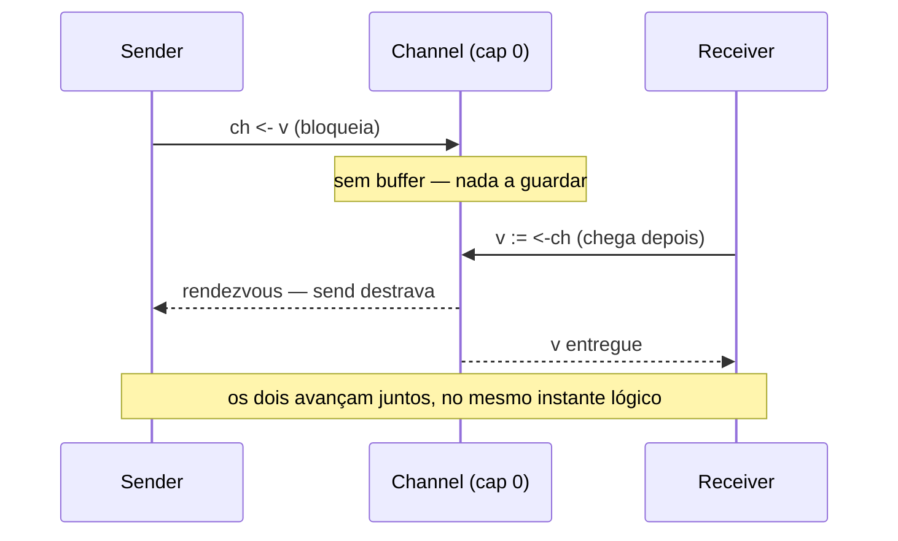
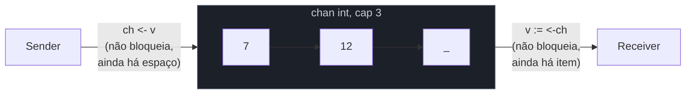

# Buffered vs unbuffered

> [!abstract] TL;DR
> `make(chan T)` cria um channel **unbuffered**: send bloqueia até que outra goroutine esteja pronta pra receber, no exato instante — é um aperto de mão síncrono. `make(chan T, n)` cria um channel **buffered** com capacidade `n`: send só bloqueia quando o buffer está **cheio** (`n` valores já dentro, ninguém consumiu ainda); receive só bloqueia quando o buffer está **vazio**. A diferença não é estilística — muda a garantia que o código carrega. Unbuffered garante que "enviei" significa "alguém já recebeu, agora, nesse ponto do tempo". Buffered troca essa garantia por folga: sender e receiver podem estar dessincronizados em até `n` mensagens antes que o bloqueio apareça. Escolher buffer errado é a origem de deadlocks sutis e de filas que crescem sem limite escondidas atrás de um número mágico.

## O problema: dois ritmos diferentes

A [[01 - Channels — o tubo entre goroutines|nota anterior]] mostrou o channel como um tubo: `ch <- v` empurra, `v := <-ch` puxa. Mas não respondeu uma pergunta que todo código real levanta cedo: **o que acontece se quem empurra é mais rápido que quem puxa?**

Imagine um produtor que gera itens numa cadência constante e um consumidor que processa cada item em, digamos, 50ms. Se o produtor tentasse simplesmente "empilhar" tudo no channel sem parar, o que deveria acontecer com o excedente? Guardar tudo indefinidamente (memória sem limite, até estourar)? Ou recusar aceitar mais até o consumidor dar conta?

Go não deixa essa decisão por conta de um comportamento implícito — ela é literal, no segundo argumento de `make`:

```go
ch1 := make(chan int)     // unbuffered — capacidade 0
ch2 := make(chan int, 5)  // buffered — capacidade 5
```

Um número. Esse número é a resposta à pergunta "quantas mensagens posso ter em trânsito, não recebidas ainda, antes que o produtor seja forçado a esperar?".

## Unbuffered: aperto de mão, não caixa de correio

Um channel unbuffered não guarda nada. Não existe um "slot" interno esperando ser preenchido. `ch <- v` só completa quando **exatamente naquele instante** existe uma goroutine executando `<-ch` pronta para receber `v`. Se não houver ninguém pronto, o sender bloqueia — literalmente pausa naquela linha — até que apareça.



A [documentação da linguagem](https://go.dev/ref/spec#Channel_types) chama isso de canal com "capacity 0", e o efeito prático é o que a comunidade Go apelida de *synchronous channel* ou **rendezvous**: send e receive são, na prática, a mesma barreira de sincronização. Nenhum dos dois lados "termina primeiro" — completam juntos.

```go
package main

import "fmt"

func main() {
    ch := make(chan string) // unbuffered

    go func() {
        fmt.Println("goroutine: prestes a enviar")
        ch <- "pronto"
        fmt.Println("goroutine: enviou (alguém já recebeu)")
    }()

    fmt.Println("main: fazendo outra coisa antes de receber...")
    msg := <-ch
    fmt.Println("main: recebeu:", msg)
}
```

A linha `fmt.Println("goroutine: enviou...")` só executa **depois** que `main` chegou em `<-ch`. É essa garantia — "o send não termina até o receive acontecer" — que faz unbuffered channels servirem como ferramenta de sincronização, não só de transporte de dado.

## Buffered: uma fila com teto

Um channel buffered carrega uma fila interna (FIFO) com capacidade fixa `n`. `ch <- v` só bloqueia se a fila já tiver `n` elementos não consumidos; caso contrário, o valor entra no buffer e o sender segue em frente **sem esperar receiver nenhum**. `<-ch` só bloqueia se a fila estiver vazia.



```go
package main

import "fmt"

func main() {
    ch := make(chan int, 3) // buffered, capacidade 3

    ch <- 1 // não bloqueia — buffer tem espaço (1/3)
    ch <- 2 // não bloqueia (2/3)
    ch <- 3 // não bloqueia (3/3) — buffer agora está cheio

    fmt.Println(len(ch), cap(ch)) // 3 3

    // ch <- 4 // bloquearia aqui: buffer cheio, ninguém consumindo ainda

    fmt.Println(<-ch) // 1 — libera um slot
    fmt.Println(<-ch) // 2
    fmt.Println(<-ch) // 3
}
```

`len(ch)` e `cap(ch)` funcionam em channels como em slices: `len` diz quantos valores estão no buffer **agora**, `cap` diz o teto configurado em `make`. Nenhum outro tipo em Go expõe essas duas funções sobre uma primitiva de concorrência — vale conferir com `go vet`/debug quando um deadlock parece envolver buffer cheio.

> [!warning] Buffer cheio bloqueia exatamente como unbuffered — a diferença é só o *quando*
> Um erro comum de quem aprendeu "buffered não bloqueia" pela metade: buffered **também bloqueia**, só que depois de `n` envios em vez de imediatamente. `make(chan int, 3)` com um quarto `ch <- v` sem nenhum receiver ativo trava a goroutine exatamente como um unbuffered channel travaria no primeiro envio. Buffer não é "channel sem bloqueio" — é "channel com bloqueio adiado".

## A régua de decisão: quando usar cada um

| | Unbuffered (`cap 0`) | Buffered (`cap n > 0`) |
|---|---|---|
| Send completa quando | receiver está pronto, agora | há espaço no buffer |
| Garantia | sincronização — "enviei" = "recebido" | desacoplamento — sender e receiver correm em ritmos diferentes até `n` de folga |
| Uso típico | handshake, sinal de "terminei" (`done := make(chan struct{})`), passar posse de um valor sem ambiguidade de timing | absorver picos de produção, limitar concorrência (semáforo — [[07 - Worker pools\|nota 07]]), evitar que um producer rápido trave à toa num consumer só um pouco mais lento |
| Risco se usado errado | nenhum inerente — é a opção mais segura por padrão | número mágico: buffer grande demais esconde acúmulo (memória, latência de fila); buffer pequeno demais não resolve o problema que motivou usar buffer |

A régua prática que a comunidade Go converge, ecoada no [Go Memory Model](https://go.dev/ref/mem) e em discussões do próprio time da linguagem: **comece unbuffered**. Um channel sem buffer é mais fácil de raciocinar — não existe "quantos itens estão em trânsito agora" para rastrear, porque a resposta é sempre zero ou um evento acontecendo. Só adicione capacidade quando houver um motivo concreto e mensurável: um produtor em rajada que não deve travar por uma folga curta de milissegundos, ou um limite deliberado de concorrência (buffer de tamanho `n` usado como semáforo, tema da nota de worker pools).

> [!info] Capacidade não é fila infinita — não é a resposta para "backpressure ilimitado"
> `make(chan T, 10000)` não é "resolver" um consumidor lento — é adiar o sintoma. Se o consumidor está genuinamente mais lento que o produtor de forma sustentada (não só em picos), nenhum buffer, por maior que seja, evita que a fila cresça sem limite eventualmente. Buffer absorve *picos* transitórios; não substitui rate limiting, backpressure de verdade, ou simplesmente ter mais consumidores.

## Caso prático: canal de sinalização (`struct{}`) — por que unbuffered aqui é a escolha certa

Um padrão extremamente comum em Go é usar um channel só para **sinalizar**, sem carregar dado nenhum — o tipo `struct{}` (zero bytes, sem payload) deixa isso explícito:

```go
package main

import "fmt"

func trabalho(done chan<- struct{}) {
    fmt.Println("trabalhando...")
    // ... trabalho real aqui ...
    done <- struct{}{} // sinaliza: terminei
}

func main() {
    done := make(chan struct{}) // unbuffered — é sinalização, não fila

    go trabalho(done)

    <-done // bloqueia até o sinal chegar
    fmt.Println("main: trabalho confirmado como concluído")
}
```

Aqui, unbuffered é deliberado: a garantia que `main` precisa é "o send só aconteceu porque eu, `main`, já estava esperando por ele" — ou seja, a confirmação é síncrona por construção. Trocar por `make(chan struct{}, 1)` não quebraria esse exemplo específico (ainda funcionaria), mas enfraqueceria a garantia sem ganho nenhum: um buffer de 1 permitiria que `trabalho` "terminasse" e o send completasse mesmo que `main` nunca chegasse a `<-done` — quebrando a intenção de que o sinal só é válido quando alguém de fato o recebeu.

## Armadilhas comuns

> [!warning] `make(chan T, 1)` "porque sim" — o buffer de tamanho 1 mais perigoso
> Um buffer de capacidade 1 costuma aparecer como remendo pra "resolver" um deadlock que apareceu com unbuffered, sem entender a causa raiz. Isso funciona só até o segundo send acontecer antes do primeiro receive — aí volta a bloquear, só que de um jeito mais difícil de reproduzir em teste, porque depende de timing. Se o deadlock original era estrutural (por exemplo, sender e receiver na mesma goroutine — ver próximo item), aumentar o buffer não resolve, só adia.

> [!warning] Send e receive do mesmo channel unbuffered na mesma goroutine trava sempre
> ```go
> ch := make(chan int)
> ch <- 1   // bloqueia esperando um receiver — mas o único receiver
> v := <-ch // está logo abaixo, e nunca é alcançado
> ```
> Isso produz `fatal error: all goroutines are asleep - deadlock!` em tempo de execução — o runtime do Go detecta quando **todas** as goroutines estão bloqueadas e aborta o programa, em vez de travar silenciosamente para sempre. Um buffer de capacidade 1 "resolveria" esse exemplo específico (o send não bloquearia), mas é sintoma de um problema de design: send e receive do mesmo par nunca deveriam estar na mesma goroutine sequencial, buffer ou não.

> [!warning] Buffer cheio + nenhum consumidor rodando é o mesmo deadlock, só adiado por `n` iterações
> Trocar `make(chan int)` por `make(chan int, 100)` num loop que envia sem nunca ter uma goroutine consumindo não elimina o deadlock — só faz o programa aguentar 100 envios antes de travar (ou, em produção, 100 itens de folga antes de a fila parar de absorver). O buffer nunca substitui ter, de fato, uma goroutine do outro lado.

## Como explicar em inglês

> `make(chan T)` creates an **unbuffered** channel — send blocks until a receiver is ready at that exact moment, a synchronous rendezvous. `make(chan T, n)` creates a **buffered** channel with capacity `n` — send only blocks once the buffer holds `n` unconsumed values; receive only blocks when the buffer is empty. The distinction isn't cosmetic: unbuffered channels guarantee "sent" means "received, right now," which makes them useful as a synchronization primitive (a `done chan struct{}` signal), not just a data pipe. Buffered channels trade that tight coupling for slack — producer and consumer can drift apart by up to `n` messages before either blocks — useful for absorbing bursts or capping concurrency (buffer-as-semaphore). The common rule of thumb in the Go community: default to unbuffered, and only add capacity for a concrete, measured reason — a buffer is never a substitute for having an actual consumer running.

| Termo PT | Termo EN |
|---|---|
| channel com buffer | buffered channel |
| channel sem buffer | unbuffered channel |
| capacidade | capacity |
| bloquear | block |
| aperto de mão / rendezvous | rendezvous / handshake |
| enfileirar | to queue |
| picos de produção | bursts |
| canal de sinalização | signaling channel |
| impasse / paralisia total | deadlock |

## O que vem a seguir

Todo exemplo até aqui assumiu que o número de valores enviados é conhecido de antemão — cada send tem um receive correspondente, contado manualmente. Isso não escala: como o receiver sabe que **não vai chegar mais nada**, sem ficar chamando `<-ch` para sempre? A [[03 - Fechando channels e o range|próxima nota]] resolve isso com `close(ch)` e o `for range` sobre channel — o mecanismo que permite consumir um channel até o fim sem contar mensagens à mão, e as armadilhas de fechar um channel na hora errada (ou duas vezes).

## Veja também

- [[01 - Channels — o tubo entre goroutines|01 — Channels — o tubo entre goroutines]] — o `chan` como tipo e a sintaxe básica de send/receive, pré-requisito direto desta nota
- [[03 - Fechando channels e o range|03 — Fechando channels e o range]] — próxima nota do galho
- [[05 - select|05 — select]] — como não bloquear indefinidamente num único channel, buffered ou não
- [[07 - Worker pools|07 — Worker pools]] — buffer usado deliberadamente como semáforo para limitar concorrência
- [[03-Dominios/Tecnologia/Go/index|Trilha Go]]

## Fontes

- The Go Authors. *The Go Programming Language Specification — Channel types*. go.dev. https://go.dev/ref/spec#Channel_types (acessado em 2026-07-18)
- The Go Authors. *A Tour of Go — Buffered Channels*. go.dev. https://go.dev/tour/concurrency/3 (acessado em 2026-07-18)
- The Go Authors. *The Go Memory Model*. go.dev. https://go.dev/ref/mem (acessado em 2026-07-18)
- Go by Example. *Channel Buffering*. gobyexample.com. https://gobyexample.com/channel-buffering (acessado em 2026-07-18)
- The Go Authors. *Effective Go — Channels*. go.dev. https://go.dev/doc/effective_go#channels (acessado em 2026-07-18)
