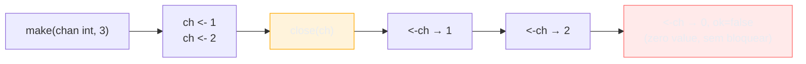
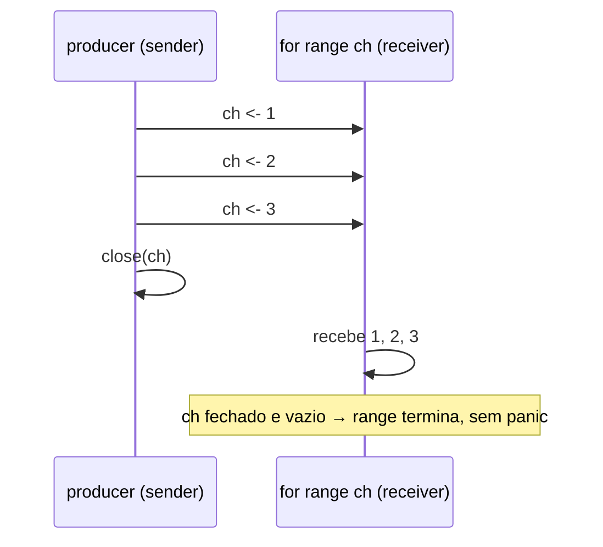

# Fechando channels e o range

> [!abstract] TL;DR
> `close(ch)` marca um channel como "não vai mais chegar nada aqui" — não destrói o channel, não libera memória imediatamente, só sinaliza fim de fluxo. Receber de um channel fechado nunca bloqueia: entrega os valores que sobraram no buffer e, depois que esvaziar, devolve o **zero value** do tipo, para sempre. Como isso é indistinguível de "recebi um zero de verdade", o form `v, ok := <-ch` existe para diferenciar — `ok == false` significa "channel fechado e vazio". `for v := range ch` usa exatamente esse mecanismo por baixo: consome até o channel fechar, sem precisar checar `ok` manualmente. E a regra de ouro que evita pânico em produção: **quem fecha é o sender**, nunca o receiver — porque só quem envia sabe quando não vai enviar mais.

## O problema: como o receiver sabe que acabou?

A nota anterior mostrou buffered channels resolvendo desacoplamento entre quem produz e quem consome. Mas ficou uma pergunta em aberto: se um worker está lendo de um channel num loop, como ele sabe quando parar?

```go
func worker(jobs chan int) {
    for {
        j := <-jobs
        fmt.Println("processando", j)
        // ... e agora? como esse for termina?
    }
}
```

A saída ingênua — mandar um valor sentinela, tipo `jobs <- -1` para dizer "acabou" — é o tipo de gambiarra que funciona até o dia em que `-1` é um job válido. Quem vem de Java conhece a mesma dor com filas: `BlockingQueue` não tem "fim" embutido, e times acabam inventando poison pills do mesmo jeito. Go resolve isso nativamente: o channel em si pode ser **fechado**, e essa informação viaja pelo próprio mecanismo de recebimento — sem precisar de um valor mágico competindo com dados reais.

## `close(ch)`: marcar o fim, não apagar o tubo

```go
ch := make(chan int, 3)
ch <- 1
ch <- 2
close(ch)
```

`close(ch)` não esvazia o channel nem libera a memória do runtime na hora — é só uma bandeira interna: "nenhum envio futuro vai acontecer aqui". Os dois valores já enfileirados (`1` e `2`) continuam lá, prontos para serem recebidos normalmente. Fechar é sobre o **futuro** do channel, não sobre o que já está dentro dele.



Duas regras de compilador/runtime que valem memorizar, porque violá-las é `panic` garantido:

- **Enviar num channel fechado gera panic** — `send on closed channel`. Não é erro silencioso, não é bloqueio: o programa quebra ali, na hora.
- **Fechar um channel já fechado gera panic** — `close of closed channel`. Fechar não é idempotente.
- **Fechar um channel `nil` gera panic** — `close of nil channel`.

> [!warning] `close` não é obrigatório
> Um channel que nunca vai ser fechado, e cujo garbage collector vai coletar quando não houver mais referência a ele, é perfeitamente válido. `close` só é necessário quando **alguém do outro lado depende de saber que acabou** — tipicamente, um `for range` ou um `select` esperando o sinal de término. Se o consumidor sabe de outra forma quantos valores esperar (por exemplo, recebe exatamente N vezes), fechar é só higiene, não requisito.

## Receber de um channel fechado: comma-ok e zero value

Aqui mora a peça central do capítulo. Depois de fechado — e depois que qualquer valor pendente no buffer for consumido — receber de um channel **nunca bloqueia** de novo. Cada `<-ch` subsequente devolve imediatamente o **zero value** do tipo do channel: `0` para `int`, `""` para `string`, `nil` para ponteiro/slice/map, e assim por diante.

```go
ch := make(chan int)
close(ch)

v := <-ch
fmt.Println(v) // 0 — zero value, não bloqueou
```

O problema óbvio: um `0` recebido depois do close é indistinguível, à primeira vista, de um `0` enviado de propósito por alguém. Para resolver essa ambiguidade, o recebimento aceita uma segunda variável de retorno — o padrão **comma-ok**, o mesmo estilo usado em type assertions (`v, ok := x.(T)`) e em lookup de map (`v, ok := m[chave]`):

```go
ch := make(chan int, 1)
ch <- 7
close(ch)

v, ok := <-ch
fmt.Println(v, ok) // 7 true — valor real, ainda não esvaziou

v, ok = <-ch
fmt.Println(v, ok) // 0 false — channel fechado e vazio
```

`ok == true` significa "veio de um envio de verdade" — pode ter sido enviado antes ou depois do close, não importa, contanto que o buffer ainda tivesse esse valor guardado. `ok == false` significa, sem ambiguidade nenhuma, "channel fechado, buffer vazio, isto é zero value sintético". É a única forma confiável de saber se um `0` é dado ou é sinal de fim.

> [!question]- E se eu receber de um channel fechado dentro de um `select`?
> O `select` (assunto da [[05 - select|nota 05]]) trata um channel fechado como um case sempre pronto — ele nunca bloqueia esse ramo, exatamente como uma recepção comum fora de `select`. Isso é útil e perigoso ao mesmo tempo: um `select` com um case de canal fechado vira, na prática, um branch que dispara em loop indefinidamente se você não tratar o `ok == false` e sair. A nota 08 (armadilhas) volta nesse cenário específico.

## `for v := range ch`: o consumo idiomático

Checar `ok` manualmente a cada iteração funciona, mas ninguém escreve assim no dia a dia. Go dá uma forma dedicada de `range` para channels que faz exatamente esse trabalho por baixo dos panos:

```go
ch := make(chan int, 3)
ch <- 1
ch <- 2
ch <- 3
close(ch)

for v := range ch {
    fmt.Println(v)
}
// 1
// 2
// 3
// o for termina sozinho quando ch fecha e esvazia
```

`for v := range ch` é, semanticamente, um açúcar para o loop com comma-ok:

```go
// equivalente ao range acima, escrito na mão:
for {
    v, ok := <-ch
    if !ok {
        break
    }
    fmt.Println(v)
}
```

A diferença prática entre os dois: `range` é mais curto, mais legível, e — crucial — **não tem como esquecer o `break`**. É a forma canônica de consumir um channel até o fim, tão idiomática quanto `for _, v := range slice` é para slices. Quem vem de Java pode pensar nele como um iterador que, em vez de `hasNext()`/`next()`, tem exatamente uma condição de parada: o channel fechar e esvaziar.



## Quem fecha: sempre o sender, nunca o receiver

Essa é a regra que separa código Go correto de código que produz panic aleatório em produção, citada quase palavra por palavra na [documentação oficial](https://go.dev/doc/effective_go#channels): "a diferença entre um canal fechado e um canal não inicializado (nil) [...] o remetente é quem deve fechar, nunca o destinatário".

O raciocínio é simples uma vez que você vê a assimetria: só quem **envia** sabe, com certeza, quando não vai enviar mais nada. Um receiver nunca tem essa informação de forma confiável — ele não pode adivinhar se um envio futuro ainda está a caminho. Se o receiver fechasse o channel, e o sender tentasse enviar depois, seria `panic: send on closed channel` — um crash motivado exatamente pela goroutine errada tomando a decisão de fechar.

```go
func producer(ch chan<- int, n int) {
    defer close(ch) // sender fecha quando termina de enviar
    for i := 0; i < n; i++ {
        ch <- i
    }
}

func consumer(ch <-chan int) {
    for v := range ch {
        fmt.Println("recebido:", v)
    }
    fmt.Println("consumer: channel fechado, saindo")
}

func main() {
    ch := make(chan int)
    go producer(ch, 5)
    consumer(ch)
}
```

> [!info] `defer close(ch)` é o idiom mais comum
> Fechar logo no `defer`, no topo da função que envia, garante que o close acontece exatamente uma vez, mesmo que a função tenha múltiplos `return` ou aborte por erro no meio do caminho — o mesmo padrão usado com `defer arquivo.Close()`. É o jeito mais seguro de nunca esquecer o close nem fechar duas vezes por acidente.

Com **múltiplos senders** no mesmo channel, a regra fica mais delicada: nenhum dos senders individuais sabe se os outros ainda vão enviar, então nenhum deles pode fechar sozinho sem risco de panic nos demais. A solução usual é um `sync.WaitGroup` coordenando os senders, e só depois que todos terminarem — numa goroutine dedicada — o channel é fechado:

```go
func fanIn(chs ...<-chan int) <-chan int {
    out := make(chan int)
    var wg sync.WaitGroup
    wg.Add(len(chs))

    for _, ch := range chs {
        go func(c <-chan int) {
            defer wg.Done()
            for v := range c {
                out <- v
            }
        }(ch)
    }

    go func() {
        wg.Wait()
        close(out) // fecha só depois que TODOS os senders terminaram
    }()

    return out
}
```

(`sync.WaitGroup` é ferramenta do Galho 9 — aqui ela só resolve o problema de "quem fecha por último". O padrão fan-in completo, com múltiplas fontes convergindo para um channel, é o assunto da [[06 - Padrões — fan-in, fan-out, pipeline|nota 06]].)

## `close` como sinalização, não só como transporte de dados

Vale um passo atrás: até agora, todo exemplo usou `close` num channel que também carrega dados (`chan int`). Mas existe um uso ainda mais comum em código Go de produção — um channel que **nunca carrega valor nenhum**, só existe para ser fechado como sinal:

```go
done := make(chan struct{})

go func() {
    trabalhoDemorado()
    close(done) // sinaliza "terminei", sem enviar dado nenhum
}()

<-done // bloqueia até done fechar; não importa QUE valor veio, só que veio
fmt.Println("trabalho concluído")
```

`struct{}` (o struct vazio) é a escolha idiomática para esse tipo de channel porque ocupa **zero bytes** — não há payload de verdade, só o evento "fechou". `<-done` recebe o zero value de `struct{}` (que é... `struct{}{}`, o próprio struct vazio) e segue em frente, porque o que importa não é o valor recebido, é o fato de o recv ter desbloqueado. Esse padrão de "channel de sinalização" é o coração de como Go implementa cancelamento cooperativo — inclusive `context.Context`, do Galho 9, usa exatamente esse mecanismo por baixo: `ctx.Done()` devolve um channel que fecha quando o contexto é cancelado, e qualquer goroutine escutando esse channel sabe, sem checar valor nenhum, que é hora de parar.

Um detalhe que reforça por que `close` é mais poderoso que enviar um valor sentinela para o mesmo fim: fechar um channel é um evento que **múltiplos receivers podem observar ao mesmo tempo**, todos recebendo o zero value simultaneamente assim que fecha. Um `ch <- sinal` comum entrega o valor para **um único** receiver — o primeiro que estiver pronto. Se você precisa avisar N goroutines de uma vez ("pare tudo agora"), fechar o channel é o único dos dois mecanismos que funciona: broadcast embutido, de graça.

## Casos práticos

**1. Worker que processa até o channel de jobs fechar**, o problema de abertura resolvido de verdade:

```go
func worker(id int, jobs <-chan int, results chan<- int) {
    for j := range jobs { // termina sozinho quando jobs fecha
        results <- j * j
    }
}

func main() {
    jobs := make(chan int, 5)
    results := make(chan int, 5)

    go worker(1, jobs, results)

    for i := 1; i <= 5; i++ {
        jobs <- i
    }
    close(jobs) // sinaliza: não vem mais job nenhum

    for i := 0; i < 5; i++ {
        fmt.Println(<-results)
    }
}
```

**2. Diferenciando "recebi zero de verdade" de "channel fechou"**, com comma-ok explícito:

```go
func somaAteFechar(ch <-chan int) int {
    total := 0
    for {
        v, ok := <-ch
        if !ok {
            return total // channel fechado e vazio: encerra
        }
        total += v // v == 0 aqui é um zero enviado de propósito, não sinal de fim
    }
}
```

**3. Channel de sinalização com `struct{}`**, cancelamento simples de uma goroutine de longa duração:

```go
func monitor(stop <-chan struct{}) {
    ticker := time.NewTicker(time.Second)
    defer ticker.Stop()

    for {
        select {
        case <-ticker.C:
            fmt.Println("verificando...")
        case <-stop:
            fmt.Println("monitor: parando")
            return
        }
    }
}

func main() {
    stop := make(chan struct{})
    go monitor(stop)

    time.Sleep(3 * time.Second)
    close(stop) // broadcast: qualquer goroutine escutando stop acorda agora
    time.Sleep(500 * time.Millisecond)
}
```

(`select` com múltiplos cases — `ticker.C` e `stop` competindo — é o mecanismo completo da [[05 - select|próxima seção do galho]]; aqui ele só ilustra o `close` como sinal.)

## Armadilhas comuns

> [!warning] Fechar um channel duas vezes é panic garantido
> `close(ch)` seguido de outro `close(ch)`, em qualquer ordem de goroutines, produz `panic: close of closed channel`. Não existe "close idempotente" embutido — se duas goroutines podem, em teoria, ambas decidir fechar o mesmo channel, alguém precisa coordenar com `sync.Once` ou centralizar o close numa única goroutine responsável.

> [!warning] Enviar depois de fechar é panic garantido
> `send on closed channel` acontece na hora do envio, não é um erro silencioso nem um bloqueio — o programa quebra ali. É por isso que a regra "só o sender fecha" importa tanto: um receiver que decide fechar por conta própria pode causar esse panic numa goroutine completamente diferente, minutos depois, tornando o bug difícil de rastrear até a causa.

> [!warning] `range` sem `close` nunca termina
> `for v := range ch` sobre um channel que nunca é fechado bloqueia para sempre depois de esvaziar o buffer — não é erro de compilação nem panic, é uma goroutine presa, um vazamento silencioso (*goroutine leak*) que só aparece em profiling ou quando a memória do processo cresce sem parar. Se um consumidor usa `range`, alguma goroutine, em algum lugar, **precisa** fechar aquele channel eventualmente.

> [!warning] Zero value recebido depois do close pode mascarar bugs
> Se seu código usa `v := <-ch` (sem `ok`) num loop que não checa fechamento, um channel fechado no meio do processamento passa a entregar `0`, `""` ou `nil` silenciosamente, para sempre — sem erro, sem panic, só dado errado sendo processado como se fosse real. Sempre que "channel pode fechar" for uma possibilidade real do fluxo, prefira `for range` ou o comma-ok explícito em vez de recv simples.

## Vindo de outras linguagens

| Vindo de... | Em Go, channel fechado é assim |
|---|---|
| Java `BlockingQueue` | Não tem "fim" embutido — times usam poison pills manuais. Go tem `close` nativo, checável via `ok` ou `range`. |
| Node.js stream | `close` de channel lembra o evento `'end'` de um readable stream — sinaliza fim, mas dados já emitidos continuam válidos. |
| Python generator | `for v := range ch` lembra iterar um generator até `StopIteration` — a diferença é que, em Go, é o **produtor** (não o consumidor) quem decide quando o "generator" acaba. |
| RabbitMQ/Kafka | Filas de mensageria não têm conceito de "fechar o tópico" no mesmo sentido — a analogia mais próxima é uma mensagem de tombstone, que é exatamente a gambiarra que `close` evita ter que inventar. |

## Como explicar em inglês

> `close(ch)` marks a channel as done — no destruction, no immediate memory release, just a flag meaning "no more sends will happen here." Receiving from a closed channel never blocks: it drains whatever is left in the buffer, then returns the type's zero value forever after. Because a real zero value and a "closed" zero value look identical, Go gives receive a second return value — `v, ok := <-ch` — where `ok == false` means "closed and empty." `for v := range ch` is sugar over exactly that comma-ok loop: it drains the channel and exits cleanly the moment it closes, no manual `ok` check needed. The rule that prevents most panics in production: **the sender closes, never the receiver** — only the sender can know for certain that no further send is coming. Closing a channel used purely as a signal (`chan struct{}`) is also Go's cheapest broadcast primitive: every goroutine blocked on that receive wakes up at once, which is exactly how `context.Context` implements cancellation under the hood.

| Termo PT | Termo EN |
|---|---|
| fechar um channel | close a channel |
| padrão comma-ok | comma-ok idiom |
| valor zero | zero value |
| vazamento de goroutine | goroutine leak |
| sinal de encerramento | done signal |
| canal de sinalização | signaling channel |
| broadcast embutido | built-in broadcast |
| coordenar o fechamento | coordinate the close |

## O que vem a seguir

Todo channel usado nesta nota — `jobs`, `results`, `done`, `stop` — foi declarado como `chan T` genérico, capaz de enviar e receber ao mesmo tempo. Mas repare nas assinaturas de `worker(jobs <-chan int, results chan<- int)`: já apareceu, sem explicação, uma seta a mais no tipo do parâmetro. A [[04 - Direções de channel|próxima nota]] formaliza exatamente isso — channels **direcionais**, que o compilador usa para impedir, em tempo de compilação, que uma função envie onde só deveria receber (ou vice-versa).

## Veja também

- [[01 - Channels — o tubo entre goroutines|01 — Channels — o tubo entre goroutines]] — make, envio, recepção e o modelo unbuffered
- [[02 - Buffered vs unbuffered|02 — Buffered vs unbuffered]] — capacidade e como ela interage com o momento do close
- [[04 - Direções de channel|04 — Direções de channel]] — próxima nota do galho
- [[05 - select|05 — select]] — como um channel fechado se comporta dentro de um `select`
- [[06 - Padrões — fan-in, fan-out, pipeline|06 — Padrões — fan-in, fan-out, pipeline]] — fan-in completo, coordenando close entre múltiplos senders
- [[03-Dominios/Tecnologia/Go/index|Trilha Go]]

## Fontes

- The Go Authors. *Effective Go — Channels*. go.dev. https://go.dev/doc/effective_go#channels (acessado em 2026-07-18)
- The Go Authors. *The Go Programming Language Specification — Close*. go.dev. https://go.dev/ref/spec#Close (acessado em 2026-07-18)
- The Go Authors. *The Go Programming Language Specification — Receive operator*. go.dev. https://go.dev/ref/spec#Receive_operator (acessado em 2026-07-18)
- The Go Authors. *A Tour of Go — Range and Close*. go.dev. https://go.dev/tour/concurrency/4 (acessado em 2026-07-18)
- Go by Example. *Closing Channels*. gobyexample.com. https://gobyexample.com/closing-channels (acessado em 2026-07-18)
- Go by Example. *Range over Channels*. gobyexample.com. https://gobyexample.com/range-over-channels (acessado em 2026-07-18)

