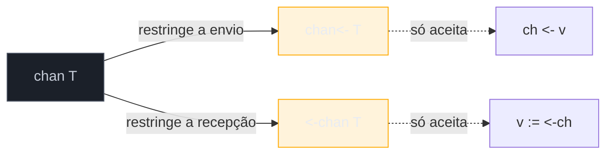
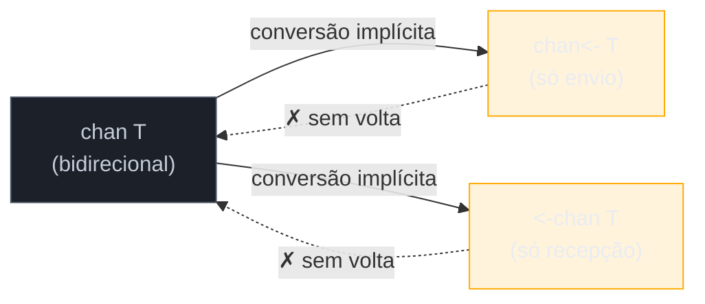

# Direções de channel

> [!abstract] TL;DR
> Um channel comum, `chan T`, serve tanto para enviar quanto para receber. Go permite restringir essa capacidade na **assinatura de uma função**: `chan<- T` aceita só envio, `<-chan T` aceita só recepção — a seta indica a direção em relação ao channel, exatamente como nos operadores `ch <- v` e `v := <-ch`. Não é um tipo novo em tempo de execução — é o **mesmo channel**, com uma visão mais estreita imposta pelo compilador no ponto onde ele é usado. `chan T` converte implicitamente para `chan<- T` ou `<-chan T` ao ser passado como argumento (nunca o contrário), então o código que cria o channel continua bidirecional; só quem recebe a versão restrita fica travado naquela direção. O ganho é documentação executável: a assinatura de uma função `func producer(out chan<- int)` já diz, sem precisar ler o corpo, "isto só envia" — e o compilador barra qualquer tentativa de receber ali, virando bug de intenção em erro de compilação.

## O problema: um channel que promete demais

Retome o worker da nota anterior — uma goroutine que produz valores e os envia por um channel, enquanto `main` consome:

```go
func worker(ch chan int) {
    for i := 0; i < 3; i++ {
        ch <- i
    }
    close(ch)
}

func main() {
    ch := make(chan int)
    go worker(ch)

    for v := range ch {
        fmt.Println(v)
    }
}
```

Funciona. Mas olhe a assinatura de `worker`: `func worker(ch chan int)`. Só lendo essa linha, não dá para saber se `worker` **envia** para `ch`, **recebe** de `ch`, ou faz as duas coisas. `chan int` é o mesmo tipo nas duas pontas — quem chama `worker` não tem garantia nenhuma, vinda do compilador, de que essa função não vai, por engano ou por refatoração descuidada, também tentar ler do channel que deveria só alimentar.

Compare com uma assinatura de função "normal". `func Dobro(n int) int` já deixa claro, pela assinatura, o que entra e o que sai — não é preciso ler o corpo para saber a forma do contrato. Um channel bidirecional na assinatura quebra essa clareza: ele é ao mesmo tempo um "parâmetro de entrada" (você lê dele) e um "parâmetro de saída" (você escreve nele), e nada na assinatura distingue qual papel a função realmente exerce.

Go resolve isso com **channels direcionais**: tipos que restringem, na assinatura, se a função só pode enviar ou só pode receber.

## A sintaxe: a seta decide a direção



Três formas de escrever o tipo de um channel de `int`, lado a lado:

| Sintaxe | Nome | Operações permitidas |
|---|---|---|
| `chan int` | bidirecional | enviar (`ch <- v`) e receber (`v := <-ch`) |
| `chan<- int` | só envio (*send-only*) | só enviar (`ch <- v`) |
| `<-int chan` — **errado** | — | a seta sempre fica colada em `chan`, nunca no tipo do elemento |
| `<-chan int` | só recepção (*receive-only*) | só receber (`v := <-ch`) |

A regra mnemônica: a seta `<-` aponta na mesma direção do operador que ela habilita. Em `chan<- T`, a seta sai do `chan` — é a mesma forma visual de `ch <- v`, envio. Em `<-chan T`, a seta entra no `chan` vinda da esquerda — a mesma forma visual de `<-ch`, recepção. Não é coincidência de design: a [especificação da linguagem](https://go.dev/ref/spec#Channel_types) define os três tipos de channel exatamente com essa notação, reaproveitando o mesmo símbolo `<-` que já é usado nos operadores de envio e recepção.

## Reescrevendo o worker com direção explícita

```go
func worker(out chan<- int) {
    for i := 0; i < 3; i++ {
        out <- i // OK — out só permite envio
    }
    close(out) // close também é permitido num chan<- T
}

func consumer(in <-chan int) {
    for v := range in { // OK — in só permite recepção
        fmt.Println(v)
    }
}

func main() {
    ch := make(chan int) // ch continua bidirecional aqui
    go worker(ch)         // conversão implícita: chan int -> chan<- int
    consumer(ch)           // conversão implícita: chan int -> <-chan int
}
```

Repare no que aconteceu em `main`: `ch` foi declarado como `chan int` comum — `make` nunca cria diretamente um channel direcional, só o tipo completo `chan T`. A restrição aparece no **ponto de uso**: ao passar `ch` para `worker`, o compilador converte implicitamente `chan int` para `chan<- int`, porque `worker` pediu exatamente isso na assinatura. O mesmo `ch`, passado para `consumer`, converte implicitamente para `<-chan int`.

> [!info] Não é um tipo novo em tempo de execução — é uma visão mais estreita do mesmo channel
> Em tempo de execução, existe um único channel — a mesma struct interna do runtime, a mesma fila (se buffered), o mesmo mecanismo de bloqueio. `chan<- int` e `<-chan int` não criam cópias nem *wrappers*: são apenas o **tipo estático** com o qual o compilador enxerga aquele valor naquele escopo. Fora de `worker`, `ch` continua sendo `chan int` de verdade, com as duas operações liberadas — a restrição vale só dentro do corpo de `worker`, onde o parâmetro se chama `out` e tem tipo `chan<- int`.

Se `worker` tentasse receber de `out` — `v := <-out` — o compilador recusa antes mesmo de rodar: `invalid operation: cannot receive from send-only channel out`. É exatamente o bug de intenção do exemplo anterior (uma função que deveria só enviar, mas por engano também lê) virando **erro de compilação**, não bug descoberto em produção.

## A conversão é uma via de mão única

A conversão implícita só acontece em uma direção: de `chan T` (bidirecional) para `chan<- T` ou `<-chan T` (restrito). O caminho contrário não existe — uma vez que uma função recebeu `<-chan T`, não há como "promover" esse valor de volta a `chan T` dentro daquele escopo, nem para `chan<- T`:

```go
func consumer(in <-chan int) {
    // out := in // não compila: cannot use in (variable of type <-chan int) as chan<- int
    v := <-in // única operação liberada
    fmt.Println(v)
}
```



Essa assimetria é proposital: a garantia que a direção oferece só vale enquanto for impossível "escapar" dela. Se fosse possível reconverter `<-chan T` de volta para `chan T` dentro da própria função, a restrição da assinatura seria só um obstáculo cosmético — qualquer código poderia contorná-la com um cast. Go fecha essa porta: uma vez restrito, o valor permanece restrito até sair de cena.

## Por que isso importa: documentação que o compilador aplica

O ganho central de channels direcionais não é técnico — nenhum programa fica mais rápido ou consome menos memória por causa deles. O ganho é de **design de API**, no mesmo espírito de marcar um parâmetro como `const` em C++ ou `readonly` em C#/TypeScript: a assinatura vira contrato, e o contrato é verificado automaticamente, sem depender de comentário ou disciplina do time.

Esse padrão aparece o tempo todo em código Go de produção — funções que constroem um channel e devolvem só a metade relevante para quem chama:

```go
// gerador devolve um <-chan int: quem recebe só pode ler dele,
// nunca fechar nem enviar por engano.
func gerador(n int) <-chan int {
    ch := make(chan int) // aqui dentro, ch é bidirecional
    go func() {
        defer close(ch)
        for i := 0; i < n; i++ {
            ch <- i * i
        }
    }()
    return ch // convertido implicitamente para <-chan int no retorno
}

func main() {
    for v := range gerador(5) {
        fmt.Println(v) // 0 1 4 9 16
    }
}
```

`gerador` é dona do channel — só ela pode enviar e só ela decide fechar, dentro da goroutine que lançou. Quem chama `gerador` recebe `<-chan int`: só pode ler, nunca fechar o channel de outra goroutine por engano (o que causaria um `panic: close of closed channel` se duas partes disputassem essa responsabilidade) nem enviar valores que a goroutine produtora não espera receber de volta. É o mesmo raciocínio de **ownership** que aparece em pipelines — a nota 06 do galho constrói cadeias inteiras de goroutines em cima exatamente desse padrão, encadeando `gerador → filtro → consumidor` com cada elo devolvendo um `<-chan T` só de leitura para o próximo.

## Casos práticos

**1. `select` combinado com channels direcionais** — útil quando uma função espera de um lado e envia para o outro, tudo com tipos que impedem trocar as pontas por engano:

```go
func merge(a, b <-chan int, out chan<- int) {
    defer close(out)
    for a != nil || b != nil {
        select {
        case v, ok := <-a:
            if !ok {
                a = nil
                continue
            }
            out <- v
        case v, ok := <-b:
            if !ok {
                b = nil
                continue
            }
            out <- v
        }
    }
}

func main() {
    a, b := make(chan int), make(chan int)
    out := make(chan int)

    go func() { defer close(a); for i := 0; i < 3; i++ { a <- i } }()
    go func() { defer close(b); for i := 10; i < 13; i++ { b <- i } }()
    go merge(a, b, out)

    for v := range out {
        fmt.Println(v)
    }
}
```

`merge` recebe `a` e `b` como `<-chan int` (só lê de cada um) e `out` como `chan<- int` (só escreve nele). A assinatura já deixa claro, antes de ler uma linha do corpo, qual é o papel de cada channel — `select`, o assunto completo da próxima nota, ainda funciona normalmente com channels direcionais, porque `case v := <-a` continua sendo uma operação de recepção válida sobre `<-chan int`.

**2. Direção como documentação em bibliotecas** — a própria biblioteca padrão usa esse padrão. `time.After` devolve `<-chan Time`:

```go
select {
case t := <-time.After(2 * time.Second):
    fmt.Println("timeout em", t)
}
```

Ninguém precisa consultar a documentação de `time.After` para saber que não é possível enviar para o channel devolvido — a própria assinatura, `func After(d Duration) <-chan Time`, já barra isso em tempo de compilação. Tentar `time.After(2 * time.Second) <- time.Now()` nem compila.

## Armadilhas comuns

> [!warning] Fechar um channel só-de-recepção não compila — e é exatamente o ponto
> `close(in)` onde `in` é `<-chan T` produz `invalid operation: cannot close receive-only channel in`. Não é limitação incômoda — é a garantia de que só quem tem a metade de envio (`chan<- T` ou `chan T` completo) pode decidir fechar o channel. Fechar é, junto com enviar, responsabilidade de quem produz; misturar essa responsabilidade em quem só consome é a receita para o `panic: close of closed channel` quando duas goroutines acham, cada uma, que são donas do fechamento.

> [!warning] `make` nunca cria um channel já direcional
> `make(chan<- int)` compila — mas produz um channel que **nenhum código consegue receber**, porque o valor devolvido por `make` já nasce restrito a envio. É quase sempre um erro de digitação: o padrão correto é `make(chan int)` seguido da conversão implícita no ponto de passagem para uma função, nunca `make` com seta.

> [!warning] Direção é checagem de compilador, não de runtime — não proteja contra código malicioso
> A restrição de direção existe para pegar erro de **intenção** dentro da sua própria base de código — a mesma goroutine que criou o channel como `chan T` sempre pode, se quiser, ignorar a direção e usar a variável original sem restrição, porque a conversão não apaga o channel de verdade por baixo. Não é um mecanismo de segurança contra código adversário (como seria `private` em outra linguagem); é ergonomia de API para evitar deslizes acidentais.

## Vindo de outras linguagens

| Vem de... | Analogia aproximada | Onde a analogia quebra |
|---|---|---|
| Java/Kotlin | `Consumer<T>` vs `Supplier<T>` como parâmetro de método | Em Go a restrição é sobre o **canal de comunicação**, não sobre uma função — e é verificada estruturalmente pelo compilador, sem interface a implementar |
| TypeScript | `readonly` em array/propriedade (`readonly T[]`) | `readonly` só impede mutação da referência que você tem; `<-chan T` impede uma **classe inteira de operação** (enviar), não só escrita de campo |
| Rust | `&T` vs `&mut T` (empréstimo imutável vs mutável) | Rust aplica isso ao **dado**; Go aplica ao **canal de comunicação**, e não existe checagem de posse (borrow checker) por trás — é convenção reforçada pelo tipo, não análise de lifetime |

A analogia mais próxima, de longe, é `readonly`/`const` em parâmetro de função: um jeito de a assinatura prometer "eu não vou fazer X com isto", verificado estaticamente. A diferença é que channels direcionais restringem uma *operação de comunicação* (enviar/receber), não uma *mutação de dado* — categorias vizinhas, mas não idênticas.

## Como explicar em inglês

> Go lets a function signature restrict what it can do with a channel: `chan<- T` is **send-only**, `<-chan T` is **receive-only**, and plain `chan T` allows both. The arrow in the type mirrors the arrow in the operator it permits — `chan<- T` looks like `ch <- v` (send), `<-chan T` looks like `<-ch` (receive). This isn't a separate runtime type; it's the same underlying channel, viewed through a narrower static type at the point where it's passed. Conversion only goes one way — from bidirectional to restricted, implicitly, whenever you pass `chan T` to a parameter typed `chan<- T` or `<-chan T` — never back. The value is compiler-enforced documentation: a function signature like `func worker(out chan<- int)` tells you, without reading the body, that this function only sends — and any attempt to receive from `out` inside that function fails to compile, turning an intent bug into a build error.

| Termo PT | Termo EN |
|---|---|
| channel direcional | directional channel |
| só envio | send-only |
| só recepção | receive-only |
| channel bidirecional | bidirectional channel |
| conversão implícita | implicit conversion |
| posse do channel | channel ownership |
| documentação executável | compiler-enforced documentation |

## O que vem a seguir

Toda esta nota tratou de channels isolados — um de cada vez, com direção fixa. A próxima peça do galho é `select`: a construção que espera em **vários** channels ao mesmo tempo, prossegue com o primeiro que estiver pronto, e é a base de padrões como timeout, cancelamento e multiplexação — inclusive o `merge` que apareceu aqui como teaser. A [[05 - select|nota 05]] entra nesse mecanismo a fundo.

## Veja também

- [[01 - Channels — o tubo entre goroutines|01 — Channels — o tubo entre goroutines]] — os operadores `ch <- v` e `v := <-ch` que dão sentido às setas de direção
- [[02 - Buffered vs unbuffered|02 — Buffered vs unbuffered]] — capacidade do channel, ortogonal à direção
- [[03 - Fechando channels e o range|03 — Fechando channels e o range]] — `close` e por que só quem envia deveria fechar
- [[05 - select|05 — select]] — próxima nota do galho
- [[06 - Padrões — fan-in, fan-out, pipeline|06 — Padrões — fan-in, fan-out, pipeline]] — pipelines inteiros construídos em cima de channels direcionais
- [[03-Dominios/Tecnologia/Go/index|Trilha Go]]

## Fontes

- The Go Authors. *The Go Programming Language Specification — Channel types*. go.dev. https://go.dev/ref/spec#Channel_types (acessado em 2026-07-18)
- The Go Authors. *A Tour of Go — Channels*. go.dev. https://go.dev/tour/concurrency/2 (acessado em 2026-07-18)
- The Go Authors. *Effective Go — Channels*. go.dev. https://go.dev/doc/effective_go#channels (acessado em 2026-07-18)
- Go by Example. *Channel Directions*. gobyexample.com. https://gobyexample.com/channel-directions (acessado em 2026-07-18)
- pkg.go.dev. *Package time — func After*. pkg.go.dev. https://pkg.go.dev/time#After (acessado em 2026-07-18)
