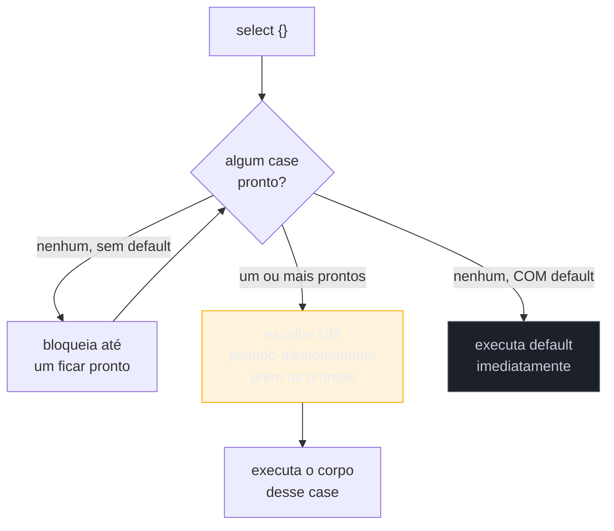
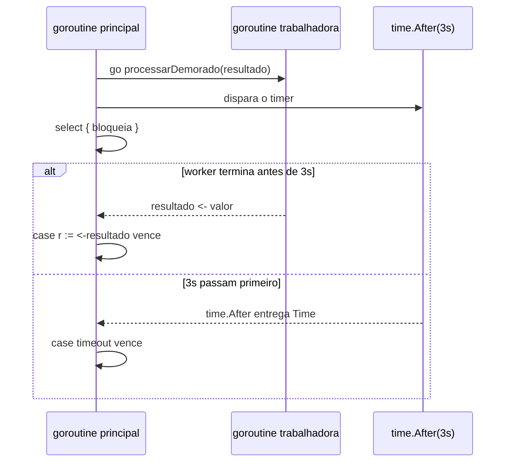

# select

> [!abstract] TL;DR
> `select` é o `switch` dos channels: bloqueia até que **um** entre vários `case` de comunicação (send ou receive) esteja pronto, e executa só esse. Se mais de um estiver pronto ao mesmo tempo, a escolha é **pseudo-aleatória** — nunca assuma ordem de prioridade entre os `case`. Um `default` transforma o `select` inteiro em não-bloqueante: se nada estiver pronto agora, cai no `default` e segue em frente. Combinado com `time.After`, `select` também implementa timeout — "espera a resposta do channel, mas no máximo N segundos". É o mecanismo central por trás de quase todo padrão de concorrência avançado em Go, do próximo capítulo em diante.

## O problema: esperar em mais de um channel ao mesmo tempo

As notas anteriores deste galho trataram sempre de **um** channel por vez: enviar, receber, fechar, dar `range`. Mas um programa concorrente raramente lida com uma fonte só de eventos. Imagine um servidor que processa pedidos vindos de dois channels diferentes — um para pedidos normais, outro para pedidos urgentes — e você quer atender qualquer um dos dois assim que ele tiver algo, sem preferência fixa por nenhum:

```go
pedidos := make(chan string)
urgentes := make(chan string)

// como espero nos dois ao mesmo tempo?
```

Com o que você já sabe, a única saída seria um receive bloqueante — `p := <-pedidos` — mas isso trava o programa inteiro esperando *só* `pedidos`, ignorando `urgentes` até que `pedidos` produza algo. Rodar os dois receives em goroutines separadas resolve parcialmente, mas complica a lógica de "atenda o primeiro que chegar e descarte a espera pelo outro". É exatamente esse buraco que `select` preenche: uma forma de dizer "espere em qualquer um destes channels, e reaja ao primeiro que estiver pronto".

## A anatomia do select

A sintaxe lembra um `switch`, mas cada `case` não compara valores — declara uma **operação de comunicação** (um receive ou um send):

```go
select {
case msg := <-pedidos:
    fmt.Println("pedido normal:", msg)
case msg := <-urgentes:
    fmt.Println("pedido urgente:", msg)
}
```



`select` avalia todos os `case` ao mesmo tempo — não em ordem, de cima para baixo, como um `switch` comum faria com suas comparações. Se **nenhum** estiver pronto, o `select` bloqueia a goroutine inteira até que pelo menos um fique disponível. Se **um** estiver pronto, executa esse. Se **vários** estiverem prontos simultaneamente — por exemplo, tanto `pedidos` quanto `urgentes` já têm valor esperando — o runtime escolhe **um deles ao acaso**, com distribuição uniforme, segundo a [especificação da linguagem](https://go.dev/ref/spec#Select_statements): "if one or more of the communications can proceed, a single one that can proceed is chosen via a uniform pseudo-random selection".

> [!warning] Não existe prioridade entre case — nem pela ordem em que aparecem
> Quem vem de uma linguagem com `switch`/`match` ordenado tende a assumir, por reflexo, que o primeiro `case` do código tem precedência. Em `select`, isso é falso: a ordem textual dos `case` não influencia em nada a escolha quando múltiplos estão prontos. Se você precisa de prioridade real entre dois channels (atender sempre `urgentes` antes de `pedidos` quando ambos estiverem prontos), a saída comum é um `select` aninhado — primeiro um `select` só com `urgentes` e `default`, e só se cair no `default` tentar o `select` com os dois. Não é elegante, mas é o jeito idiomático de simular prioridade onde a linguagem não oferece uma primitiva pronta para isso.

## default: o select não-bloqueante

Sem `default`, `select` sempre bloqueia se nada estiver pronto — igual a um receive comum em channel vazio. Adicionar um `case default` muda esse comportamento por completo: se nenhum `case` de comunicação estiver pronto **no instante em que o `select` é avaliado**, o `default` roda imediatamente, e o `select` nunca bloqueia.

```go
select {
case msg := <-canal:
    fmt.Println("recebido:", msg)
default:
    fmt.Println("nada pronto agora, seguindo em frente")
}
```

> [!info] Contexto de versão
> `select` e `default` existem desde a primeira versão pública de Go (2009) — não são novidade recente. O que muda ao longo das versões é o ecossistema ao redor (`context`, `time.After`, canais tipados com generics desde Go 1.18), não o `select` em si.

Esse padrão serve para **checagem oportunista**: "veja se tem algo pronto agora; se não tiver, não espere, faça outra coisa". É comum em loops que fazem trabalho útil enquanto ficam de olho num channel de cancelamento:

```go
func trabalhar(cancelar <-chan struct{}) {
    for i := 0; ; i++ {
        select {
        case <-cancelar:
            fmt.Println("cancelado no passo", i)
            return
        default:
            // sem default aqui, o select acima bloquearia
            // esperando cancelar — com default, só espia e segue
        }
        fazPassoDeTrabalho(i)
    }
}
```

> [!warning] default dentro de um loop apertado pode virar busy-wait
> Um `select` com `default` dentro de um `for` sem nenhuma pausa gira em círculo consumindo CPU o tempo todo, checando o channel repetidamente sem nunca ceder a vez de fato. Se a checagem não tem outro trabalho útil para fazer entre uma tentativa e outra, prefira um `select` **sem** `default` — deixe a goroutine bloquear de verdade e o scheduler cuidar do resto. `default` só compensa quando existe trabalho real para fazer no meio das tentativas, como no exemplo acima.

## Timeout com time.After

O uso mais citado de `select` fora de `default` é implementar timeout: "espere a resposta deste channel, mas desista depois de N segundos". `time.After(d)` devolve um `<-chan Time` que recebe exatamente um valor depois que a duração `d` passa — e nada antes disso:

```go
resultado := make(chan string)
go processarDemorado(resultado)

select {
case r := <-resultado:
    fmt.Println("resultado:", r)
case <-time.After(3 * time.Second):
    fmt.Println("timeout: desistindo depois de 3s")
}
```



Os dois `case` competem: qual channel entrega um valor primeiro vence a corrida. Se `processarDemorado` termina em 1 segundo, o `case r := <-resultado` dispara e o timer de `time.After` simplesmente nunca é lido de novo — a goroutine interna do timer entrega seu valor num channel que ninguém mais olha, e é descartada pelo garbage collector depois que o timer dispara. Se `processarDemorado` trava ou demora mais que 3 segundos, o `case` do timeout vence, e o programa segue sem esperar o worker — ainda que o worker, por trás, continue rodando (isso é uma armadilha separada, abordada abaixo).

> [!warning] time.After dentro de um loop vaza memória
> Cada chamada a `time.After` cria um novo timer interno que só é liberado quando dispara. Um padrão comum e problemático é chamar `time.After` dentro de um `select` que roda em loop:
> ```go
> for {
>     select {
>     case msg := <-canal:
>         processar(msg)
>     case <-time.After(5 * time.Second):
>         fmt.Println("timeout")
>     }
> }
> ```
> Se `canal` recebe mensagens com frequência maior que 5 segundos, cada iteração cria um timer novo que nunca chega a disparar — e o antigo, se ainda pendente, só é coletado quando expira. Em loops de longa duração isso acumula timers. A correção idiomática é criar o `time.Timer` **uma vez**, fora do loop, com `time.NewTimer`, e chamar `Reset` explicitamente a cada iteração — ou, quando o timeout é fixo e não precisa reiniciar, usar `context.WithTimeout` (assunto do galho 9) em vez de montar o timeout manualmente com `select`.

## select vazio e select com send

Dois casos de borda que valem menção rápida porque aparecem — raramente, mas aparecem — em código real:

**`select {}` sem nenhum case** bloqueia para sempre — a goroutine trava ali de forma permanente. É usado, por exemplo, na `func main()` de um servidor que só existe para manter goroutines em background rodando, sem nenhum trabalho síncrono a fazer depois de disparar os workers.

**`case` de send** funciona do mesmo jeito que `case` de receive, só que a operação testada é um envio: `case canal <- valor:`. Isso é pronto quando existe espaço no channel (buffer livre, ou um receiver já esperando do outro lado) — útil para "tente enviar, mas não trave se ninguém estiver pronto para receber":

```go
select {
case saida <- resultado:
    // enviado com sucesso
default:
    // ninguém pronto para receber agora — descarta ou loga
    fmt.Println("saida cheio, descartando resultado")
}
```

## Casos práticos

**1. Multiplexando duas fontes de trabalho**, retomando o cenário de abertura:

```go
func atender(pedidos, urgentes <-chan string, done <-chan struct{}) {
    for {
        select {
        case p := <-urgentes:
            fmt.Println("URGENTE:", p)
        case p := <-pedidos:
            fmt.Println("normal:", p)
        case <-done:
            fmt.Println("encerrando atendimento")
            return
        }
    }
}
```

Repare que `urgentes` aparece primeiro no código, mas isso **não** garante prioridade — é só legibilidade. Se os dois channels tiverem pedidos prontos ao mesmo tempo, a escolha é aleatória entre os dois, como a seção de armadilhas já deixou claro.

**2. Timeout em requisição com contexto de cancelamento manual** (sem usar `context` ainda, propositalmente, para focar só no mecanismo de `select`):

```go
func buscar(url string) (string, error) {
    resultado := make(chan string, 1)
    erro := make(chan error, 1)

    go func() {
        dados, err := chamarAPI(url)
        if err != nil {
            erro <- err
            return
        }
        resultado <- dados
    }()

    select {
    case r := <-resultado:
        return r, nil
    case err := <-erro:
        return "", err
    case <-time.After(2 * time.Second):
        return "", fmt.Errorf("timeout ao buscar %s", url)
    }
}
```

> [!info] Buffer 1 nos channels internos
> `resultado` e `erro` são criados com capacidade 1 — um buffered channel, assunto da [[02 - Buffered vs unbuffered|nota 02]]. Isso importa aqui: se o timeout vencer a corrida, a goroutine interna ainda vai tentar enviar em `resultado` ou `erro` mais tarde. Sem buffer, esse send bloquearia para sempre (ninguém mais vai ler esses channels) — uma goroutine vazada silenciosamente. Com buffer 1, o send completa mesmo sem receiver, e a goroutine termina normalmente.

**3. Checagem não-bloqueante de cancelamento dentro de um worker**:

```go
func worker(id int, jobs <-chan int, cancelar <-chan struct{}) {
    for {
        select {
        case <-cancelar:
            fmt.Printf("worker %d: cancelado\n", id)
            return
        case job, ok := <-jobs:
            if !ok {
                fmt.Printf("worker %d: jobs fechado, encerrando\n", id)
                return
            }
            fmt.Printf("worker %d: processando job %d\n", id, job)
        }
    }
}
```

Este padrão — `select` entre o channel de trabalho e um channel de cancelamento — é o esqueleto que o próximo capítulo (worker pools) usa para desligar workers de forma limpa.

## Armadilhas comuns

> [!warning] select com um único case não é mais rápido que um receive direto
> `select { case v := <-c: ... }` sem `default` e sem outro `case` se comporta identicamente a `v := <-c`. Não há ganho de performance nem de clareza em usar `select` quando você só tem um channel — reserve `select` para quando de fato existem múltiplas fontes de comunicação concorrendo.

> [!warning] Goroutine vazada quando o timeout vence mas o worker continua rodando
> No exemplo 2 acima, se o timeout dispara antes de `chamarAPI` terminar, a função `buscar` retorna — mas a goroutine que chama `chamarAPI` continua executando em background até terminar sozinha. Ela não é "cancelada" pelo `select` perder a corrida; só para de ser *observada*. Isso é aceitável quando a chamada tem seu próprio timeout de rede e eventualmente termina, mas é uma fonte comum de vazamento de goroutine quando a chamada pode travar indefinidamente. A solução correta — propagar cancelamento de verdade para dentro da goroutine — é o assunto de `context.Context` no galho 9.

> [!warning] Canal nil dentro de um select nunca fica pronto
> Um `case` cujo channel é `nil` (não inicializado, ou zerado deliberadamente) nunca é escolhido — nem para enviar, nem para receber, ele simplesmente fica parado para sempre naquele `select`. Isso parece um bug, mas é um recurso: setar uma variável de channel para `nil` é uma forma idiomática de **desativar** um `case` dinamicamente, útil em loops de `select` que precisam parar de ouvir um channel específico sem desligar o `select` inteiro. O próximo capítulo (fan-in/fan-out) usa esse truque para "aposentar" channels de entrada que já fecharam, dentro de um `select` que continua ouvindo os demais.

## Vindo de outras linguagens

| Linguagem | Mecanismo equivalente | Diferença principal |
|---|---|---|
| Java | `Selector` de NIO, ou simplesmente múltiplas threads bloqueantes | Java não tem `select` na linguagem; multiplexar I/O bloqueante exige NIO explícito ou uma thread por fonte |
| Python | `asyncio.wait([...], return_when=FIRST_COMPLETED)` | Python resolve isso no nível de coroutines assíncronas (`await`), não como statement da linguagem |
| JavaScript/Node | `Promise.race([...])` | Mesmo espírito — primeira promise que resolve "vence" — mas Promise não tem `default` nem se repete implicitamente num loop como `select` costuma aparecer em Go |

`select` sendo *keyword* da linguagem, e não uma função de biblioteca, é uma escolha de design que o coloca ao lado de `if`/`for`/`switch` — reflexo de quanto a comunicação por channel é central no modelo de concorrência de Go, e não um acréscimo posterior via biblioteca.

## Como explicar em inglês

> `select` is Go's `switch` for channel operations: it blocks until one of several `case` clauses — each a send or receive on a channel — is ready, then runs that one. When multiple cases are ready simultaneously, Go picks **uniformly at random** among them; the order the cases appear in source has no effect on priority. Adding a `default` case makes the whole `select` non-blocking: if nothing is ready right now, `default` runs immediately instead of waiting. Combined with `time.After`, `select` implements timeouts — "wait for this channel, but give up after N seconds" — by racing the real channel against a timer channel. A `select` with a single case and no `default` is just a plain receive in disguise; the construct only earns its keep when genuinely multiplexing more than one communication.

| Termo PT | Termo EN |
|---|---|
| multiplexar channels | multiplex channels |
| não-bloqueante | non-blocking |
| escolha pseudo-aleatória | pseudo-random selection |
| timeout | timeout |
| desistir / abortar por timeout | time out |
| canal de cancelamento | cancellation channel |
| vazamento de goroutine | goroutine leak |
| corrida entre channels | race between channels |

## O que vem a seguir

`select` sozinho já resolve timeout e checagem não-bloqueante — mas o ganho maior aparece quando ele vira a peça central de **padrões** de composição entre goroutines: juntar várias fontes num único channel de saída (fan-in), espalhar trabalho entre vários consumidores (fan-out), e encadear estágios de processamento (pipeline). A [[06 - Padrões — fan-in, fan-out, pipeline|nota 06]] usa exatamente o `select` com canal `nil` desta nota — a técnica de "aposentar" um case dinamicamente — para implementar fan-in de forma limpa.

## Veja também

- [[01 - Channels — o tubo entre goroutines|01 — Channels — o tubo entre goroutines]] — mecânica básica de send/receive que o select multiplexa
- [[02 - Buffered vs unbuffered|02 — Buffered vs unbuffered]] — buffer usado nos channels internos do exemplo 2
- [[03 - Fechando channels e o range|03 — Fechando channels e o range]] — o `ok` de `v, ok := <-c` também aparece dentro de um case de select
- [[06 - Padrões — fan-in, fan-out, pipeline|06 — Padrões — fan-in, fan-out, pipeline]] — próxima nota do galho
- [[08 - Armadilhas de channels|08 — Armadilhas de channels]] — catálogo mais amplo de vazamentos e deadlocks envolvendo select
- [[03-Dominios/Tecnologia/Go/index|Trilha Go]]

## Fontes

- The Go Authors. *The Go Programming Language Specification — Select statements*. go.dev. https://go.dev/ref/spec#Select_statements (acessado em 2026-07-18)
- The Go Authors. *A Tour of Go — Select*. go.dev. https://go.dev/tour/concurrency/5 (acessado em 2026-07-18)
- The Go Authors. *A Tour of Go — Select Default*. go.dev. https://go.dev/tour/concurrency/6 (acessado em 2026-07-18)
- Go by Example. *Select*. gobyexample.com. https://gobyexample.com/select (acessado em 2026-07-18)
- Go by Example. *Timeouts*. gobyexample.com. https://gobyexample.com/timeouts (acessado em 2026-07-18)
- pkg.go.dev. *Package time — func After*. pkg.go.dev. https://pkg.go.dev/time#After (acessado em 2026-07-18)
