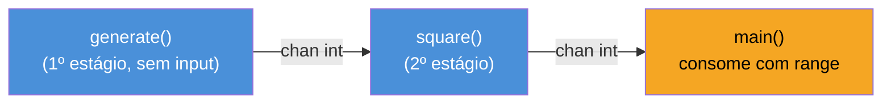
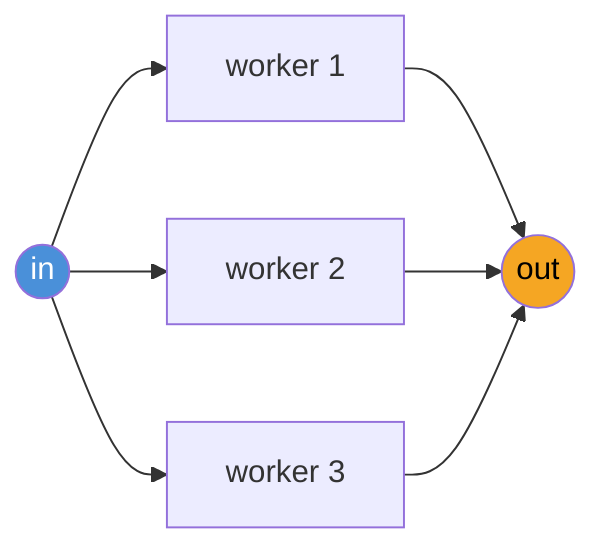
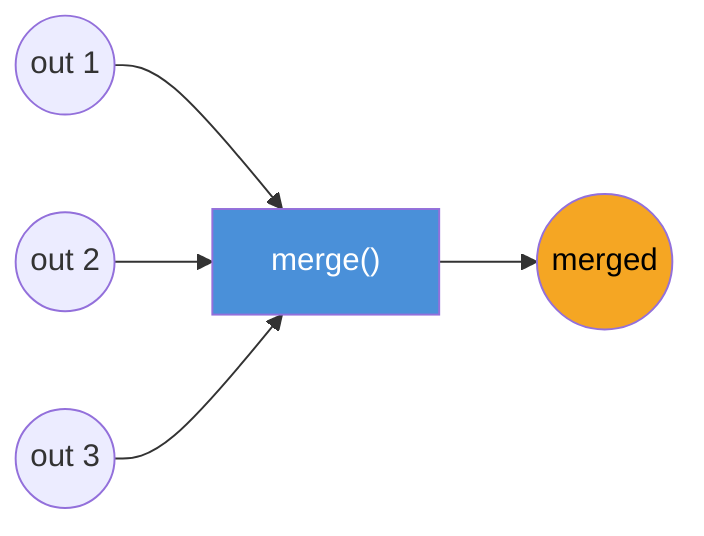
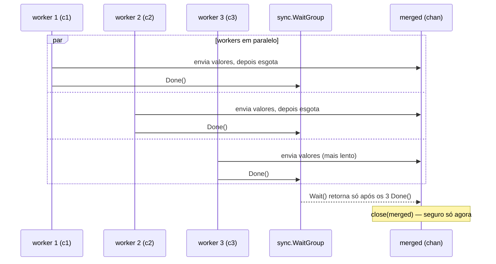

# Padrões — fan-in, fan-out, pipeline

> [!abstract] TL;DR
> Um **pipeline** em Go é uma sequência de estágios conectados por channels, onde cada estágio é uma goroutine que recebe de um channel de entrada e envia para um channel de saída. **Fan-out** é distribuir o trabalho de um único estágio entre várias goroutines lendo do mesmo channel — usado quando esse estágio é a parte lenta do pipeline e precisa de paralelismo. **Fan-in** é o inverso: juntar vários channels de saída em um único channel, tipicamente com `sync.WaitGroup` para saber quando fechar o channel combinado. Os três padrões não são bibliotecas nem sintaxe especial — são *composições* de goroutine + channel + `range` + `close`, e por isso é o próprio [Go blog](https://go.dev/blog/pipelines) que os documenta como "Go Concurrency Patterns", não a especificação da linguagem. A regra de ouro que sustenta tudo: **quem escreve num channel é responsável por fechá-lo**, nunca quem lê.

## O problema: processar uma pilha grande de coisas, rápido

Imagine que você precisa redimensionar dez mil imagens. A versão ingênua é um laço sequencial: lê a imagem, redimensiona, salva, repete. Funciona, mas usa uma CPU só enquanto a máquina pode ter oito, dezesseis, trinta e duas. A versão "joga tudo em goroutines" — uma goroutine por imagem, sem controle nenhum — também funciona até a máquina esgotar memória ou file descriptors com dez mil leituras de arquivo simultâneas.

O que falta é uma forma de expressar *o formato do trabalho*: ele tem estágios (ler → redimensionar → salvar), alguns estágios são mais lentos que outros (redimensionar custa mais CPU que ler ou salvar), e o grau de paralelismo devia ser uma escolha deliberada, não um acidente de "quantas goroutines o `for` disparou". É exatamente isso que pipeline, fan-out e fan-in resolvem — e eles resolvem compondo peças que você já viu nas notas anteriores deste galho: channels como tubo (nota 01), `close` e `range` (nota 03), `select` (nota 05). Não há mecanismo novo aqui — há um jeito de *arranjar* o que já existe.

## Pipeline: estágios conectados por channels

Um estágio de pipeline é uma função com um formato reconhecível: recebe um channel de entrada (ou nenhum, no primeiro estágio), devolve um channel de saída, e roda uma goroutine internamente que lê de um lado e escreve no outro.



O exemplo canônico do próprio Go blog — gerar números e elevar ao quadrado — mostra a forma mínima:

```go
// generate é o primeiro estágio: não recebe channel, só produz.
func generate(nums ...int) <-chan int {
    out := make(chan int)
    go func() {
        defer close(out) // quem escreve, fecha
        for _, n := range nums {
            out <- n
        }
    }()
    return out
}

// square é um estágio do meio: recebe de in, produz em out.
func square(in <-chan int) <-chan int {
    out := make(chan int)
    go func() {
        defer close(out)
        for n := range in { // range consome até in fechar — ver nota 03
            out <- n * n
        }
    }()
    return out
}

func main() {
    // compor os estágios é encadear chamadas de função
    c := generate(2, 3, 4)
    out := square(c)

    for v := range out {
        fmt.Println(v) // 4, 9, 16
    }
}
```

Repare no que a composição `square(generate(2, 3, 4))` significa de verdade: são **duas goroutines** rodando concorrentemente, uma produzindo e outra consumindo através do channel `c`, sincronizadas só pelo próprio ato de enviar/receber num channel unbuffered — nenhum mutex, nenhum `sync.WaitGroup` nesse trecho. `main` é um terceiro consumidor, do resultado final. Cada estágio devolve um channel de **direção restrita** `<-chan int` (nota 04 deste galho) — quem chama `square` só pode ler dali, o que documenta na assinatura que aquele estágio é dono de escrever e fechar seu próprio canal de saída.

> [!info] Tipagem genérica em pipelines (Go 1.18+)
> Os exemplos aqui usam `int` fixo para clareza, mas o mesmo padrão generaliza direto com *generics*: `func stage[T, U any](in <-chan T, f func(T) U) <-chan U` é uma forma comum de escrever um estágio de transformação reutilizável para qualquer tipo, sem duplicar a função para cada par de tipos.

A regra que faz esse encadeamento não vazar goroutines: **cada estágio fecha o channel que ele produz, assim que termina de escrever nele** (o `defer close(out)`). Isso é o que permite ao próximo estágio — e ao `main`, no fim — usar `range` e saber, sem consultar mais nada, quando parar de esperar por valores.

## Fan-out: distribuir o trabalho de um estágio

No pipeline acima, `square` roda numa única goroutine. Se elevar ao quadrado fosse uma operação cara (imagine substituir por "redimensionar uma imagem de 50MB"), essa única goroutine vira o gargalo — o resto do pipeline fica esperando por ela. **Fan-out** é a resposta: em vez de uma goroutine lendo de `in`, várias goroutines leem do *mesmo* channel `in`, competindo pelos valores.



Um channel Go, por definição (nota 01), entrega cada valor enviado a **exatamente um** receptor — não é broadcast. Então "várias goroutines lendo do mesmo channel" já é, de graça, uma distribuição de carga: cada valor vai para a primeira goroutine que estiver livre para recebê-lo, sem precisar de fila própria nem de round-robin manual.

```go
func square(in <-chan int) <-chan int {
    out := make(chan int)
    go func() {
        defer close(out)
        for n := range in {
            out <- n * n
        }
    }()
    return out
}

// fanOut cria n goroutines lendo do mesmo channel de entrada,
// cada uma produzindo seu próprio channel de saída.
func fanOut(in <-chan int, n int) []<-chan int {
    outs := make([]<-chan int, n)
    for i := 0; i < n; i++ {
        outs[i] = square(in) // n workers competindo por valores de in
    }
    return outs
}
```

`fanOut` devolve **n channels separados**, um por worker — não um channel único. Isso é deliberado: cada `square(in)` já cria sua própria goroutine e seu próprio `out`, fechado quando `in` esgota para aquele worker. O resultado de fan-out é sempre "múltiplos produtores, múltiplos channels" — e é exatamente esse formato que o próximo padrão, fan-in, espera receber.

> [!warning] Fan-out sem limite não é fan-out — é só "spawnar goroutines"
> Chamar `fanOut(in, 3)` cria exatamente 3 workers, um número escolhido. O erro comum é confundir fan-out com "uma goroutine por item" (`for item := range items { go process(item) }`), que não distribui nada — apenas cria concorrência sem teto, revivendo o problema das dez mil imagens da abertura. Fan-out de verdade fixa o grau de paralelismo (`n`) e deixa os `n` workers competirem pelo *mesmo* channel de entrada. Quando o objetivo é justamente um número fixo e persistente de workers consumindo uma fila de tarefas — não um pipeline com estágios — o padrão dedicado é o *worker pool*, assunto da [[07 - Worker pools|próxima nota]].

> [!question]- Que número escolher para `n`? Por que não "quanto mais, melhor"?
> Depende de qual recurso o estágio consome. Se o trabalho é *CPU-bound* (como redimensionar imagem, calcular hash, comprimir dados), mais goroutines que `runtime.NumCPU()` não aumentam throughput — todas competem pelos mesmos núcleos, e o scheduler do Go (Galho 7) só consegue rodar `GOMAXPROCS` delas de fato em paralelo a qualquer instante; o resto fica na fila de *runnable*. Nesse caso, `n := runtime.NumCPU()` é um ponto de partida razoável. Se o trabalho é *I/O-bound* (chamada de rede, leitura de disco lenta), a goroutine passa a maior parte do tempo bloqueada esperando I/O, não usando CPU — aí `n` pode ser bem maior que o número de núcleos, porque o custo real não é CPU, é quantas conexões/arquivos simultâneos o sistema aguenta. Medir com benchmark real (`go test -bench`) bate qualquer regra de bolso.

## Fan-in: juntar vários channels em um só

Depois do fan-out, você tem `n` channels de saída — mas quem consome o resultado final normalmente quer ler de **um** channel, não gerenciar `n` `range`s separados. **Fan-in** faz essa junção: uma goroutine por channel de entrada, todas escrevendo no mesmo channel de saída combinado.



O detalhe que faz fan-in não ser trivial: `merged` só pode ser fechado depois que **todos** os channels de entrada terminarem — mas cada um termina em momento diferente, imprevisível. É exatamente o problema que `sync.WaitGroup` resolve: uma goroutine por channel de entrada incrementa o grupo, escreve tudo que recebe em `merged`, e avisa `wg.Done()` ao esgotar. Uma goroutine extra espera o grupo inteiro (`wg.Wait()`) e só então fecha `merged`.

```go
func fanIn(cs ...<-chan int) <-chan int {
    merged := make(chan int)
    var wg sync.WaitGroup
    wg.Add(len(cs))

    for _, c := range cs {
        go func(c <-chan int) {
            defer wg.Done()
            for n := range c {
                merged <- n
            }
        }(c)
    }

    // goroutine dedicada: espera todo mundo terminar, só então fecha merged
    go func() {
        wg.Wait()
        close(merged)
    }()

    return merged
}
```

> [!info] Loop variable por goroutine — comportamento mudou no Go 1.22
> A captura `c` como parâmetro da closure (`func(c <-chan int) { ... }(c)`) era **obrigatória** em versões pré-1.22 para evitar que todas as goroutines compartilhassem a mesma variável de loop. Desde o [Go 1.22](https://go.dev/blog/loopvar-preview), cada iteração de `for` cria uma variável nova, então `go func() { for n := range c { ... } }()` sem o parâmetro extra já é seguro. O código acima usa a forma explícita porque funciona em qualquer versão do Go — é o estilo que você ainda vai encontrar na maior parte do código e da documentação existente, incluindo o próprio Go blog.

Juntando os três padrões — pipeline, fan-out, fan-in — no exemplo original de gerar e elevar ao quadrado, agora com paralelismo real no estágio caro:

```go
func main() {
    in := generate(2, 3, 4, 5, 6, 7, 8, 9)

    // fan-out: 3 workers competem por valores de in
    c1 := square(in)
    c2 := square(in)
    c3 := square(in)

    // fan-in: junta os 3 channels de saída em um só
    for v := range fanIn(c1, c2, c3) {
        fmt.Println(v)
    }
}
```

A ordem de saída **não é garantida** — `2*2` pode aparecer depois de `9*9`, dependendo de qual worker pegou qual valor e terminou primeiro. Isso é uma troca deliberada: ganhar paralelismo custa a ordenação determinística. Se a ordem importa, fan-out/fan-in não é o padrão certo sem uma etapa extra de reordenação (por índice, por exemplo) — fora do escopo desta nota.

O diagrama de sequência abaixo mostra a mecânica temporal do `fanIn` do exemplo — por que `merged` só fecha depois que o **último** worker termina, não o primeiro:



## Erros dentro do pipeline: um channel a mais, não um `if err != nil` a menos

Um detalhe que o exemplo didático (gerar/elevar ao quadrado) esconde por simplicidade: estágios reais falham. Ler um arquivo pode dar erro de I/O; chamar uma API pode dar timeout. Go não tem exceção para "atravessar" um channel — um valor que passa por `out <- n` é só um valor, sem canal paralelo embutido para erro. A solução idiomática é literal: um **segundo channel**, dedicado a erros, correndo ao lado do channel de dados.

```go
type Resultado struct {
    Valor int
    Err   error
}

func squareComErro(in <-chan int) <-chan Resultado {
    out := make(chan Resultado)
    go func() {
        defer close(out)
        for n := range in {
            if n < 0 {
                out <- Resultado{Err: fmt.Errorf("valor negativo: %d", n)}
                continue // não interrompe o pipeline por um item ruim
            }
            out <- Resultado{Valor: n * n}
        }
    }()
    return out
}

func main() {
    in := generate(2, -3, 4)
    for r := range squareComErro(in) {
        if r.Err != nil {
            log.Println("erro:", r.Err) // log/slog também serve aqui, ver nota irmã
            continue
        }
        fmt.Println(r.Valor)
    }
}
```

Embrulhar valor e erro numa única struct (`Resultado`) — em vez de dois channels separados, um `chan int` e um `chan error` — evita um problema sutil: com dois channels distintos, não há garantia de que o consumidor leia o erro *do mesmo item* que gerou aquele erro, porque as duas leituras (`select` entre dois channels, por exemplo) não têm correlação implícita de ordem. Um único channel carregando o par valor/erro mantém a correlação trivial, sem depender de `select` para decidir qual channel ler primeiro.

## Buffer entre estágios: folga contra backpressure

Todo channel criado nos exemplos acima é **unbuffered** (`make(chan int)`) — cada `out <- n` bloqueia até alguém do outro lado receber. Isso significa que um estágio lento propaga a lentidão para trás por todo o pipeline: se `square` está ocupado, `generate` fica parado em `out <- n` esperando espaço, mesmo tendo mais valores prontos para produzir. Esse efeito cascata — a nota 02 deste galho já nomeou — chama-se *backpressure*, e em pipelines ele é o comportamento **correto por padrão**: ninguém acumula uma fila descontrolada de trabalho não processado na memória.

Dar um buffer pequeno a um channel de pipeline (`make(chan int, 4)`, por exemplo) não elimina a backpressure — só adia: os primeiros 4 valores enfileiram sem bloquear o produtor, permitindo alguma sobreposição entre estágios (enquanto `square` processa o item 1, `generate` já está preparando o item 5). É uma otimização de throughput, não uma mudança de comportamento — o buffer só reduz o número de vezes que goroutines ficam esperando umas pelas outras nas transições entre estágios, e só ajuda de fato se o custo de gerar/consumir tiver variância (picos e vales), não em carga perfeitamente uniforme.

> [!warning] Buffer grande demais não é "mais rápido" — é só memória represada mais tarde
> Um buffer de tamanho 10.000 entre estágios de um pipeline não faz o pipeline processar mais rápido — só permite que até 10.000 itens fiquem "prontos, mas não processados" na memória antes que a backpressure volte a agir. Se o estágio seguinte nunca alcança a taxa de produção do anterior, esse buffer enche de qualquer forma, e o comportamento volta a ser bloqueante — só que depois de já ter consumido memória proporcional ao tamanho do buffer. Dimensionar o buffer exige saber a variância real da carga, não um número redondo escolhido por hábito.

## Armadilhas comuns

> [!warning] Fechar um channel de leitura, ou fechar duas vezes
> A regra "quem escreve, fecha" (nota 03) fica mais fácil de violar em pipelines porque há mais peças em jogo. Se dois estágios diferentes tentam fechar o mesmo channel — ou se o consumidor de um estágio, por engano, chama `close(in)` — o programa entra em `panic: close of closed channel` ou `panic: close of nil channel`. Numa cadeia de estágios, cada `out` tem exatamente **um** dono: a goroutine que o criou com `make`.

> [!warning] Fan-in sem `WaitGroup` fecha cedo demais ou nunca fecha
> A tentação de simplificar `fanIn` fechando `merged` assim que o *primeiro* channel de entrada esgota derruba o padrão inteiro: os demais workers ainda tentando `merged <- n` bloqueiam para sempre num channel fechado (`panic: send on closed channel`, na verdade — pior que travar). O `sync.WaitGroup` existe precisamente para sincronizar "todos os produtores terminaram" antes de fechar o canal combinado; não há atalho seguro sem ele (ou sem um mecanismo equivalente).

> [!warning] Goroutine vazada quando o consumidor desiste antes do fim
> Se `main` para de ler de `fanIn(...)` no meio (um `break` antecipado, por exemplo), os estágios anteriores continuam tentando `out <- n` para sempre — ninguém mais está do outro lado para receber, então cada goroutine trava permanentemente num send, e nunca é coletada pelo garbage collector. É o cenário clássico de *goroutine leak*. A correção — um channel `done` adicional, ou (a forma moderna e preferida) um `context.Context` propagado por todos os estágios para sinalizar cancelamento — pertence ao Galho 9, sobre concorrência avançada; aqui vale reconhecer o risco: pipeline sem plano de cancelamento é pipeline que vaza sob desistência antecipada.

## Caso prático completo: contar palavras em vários arquivos

Juntando pipeline, fan-out e fan-in num cenário mais próximo de código real: contar o total de palavras numa lista de arquivos, paralelizando a leitura (I/O-bound, pode ter mais goroutines que núcleos) e agregando os totais no fim.

```go
// primeiro estágio: emite os caminhos, sem processar nada ainda
func paths(arquivos ...string) <-chan string {
    out := make(chan string)
    go func() {
        defer close(out)
        for _, p := range arquivos {
            out <- p
        }
    }()
    return out
}

// estágio custoso: lê o arquivo inteiro e conta palavras — fan-out se paga aqui
func contarPalavras(in <-chan string) <-chan int {
    out := make(chan int)
    go func() {
        defer close(out)
        for caminho := range in {
            conteudo, err := os.ReadFile(caminho)
            if err != nil {
                log.Printf("erro lendo %s: %v", caminho, err)
                continue
            }
            out <- len(strings.Fields(string(conteudo)))
        }
    }()
    return out
}

func fanIn(cs ...<-chan int) <-chan int {
    merged := make(chan int)
    var wg sync.WaitGroup
    wg.Add(len(cs))
    for _, c := range cs {
        go func(c <-chan int) {
            defer wg.Done()
            for n := range c {
                merged <- n
            }
        }(c)
    }
    go func() {
        wg.Wait()
        close(merged)
    }()
    return merged
}

func main() {
    arquivos := []string{"a.txt", "b.txt", "c.txt", "d.txt", "e.txt"}

    in := paths(arquivos...)

    // fan-out: 3 leitores em paralelo — I/O-bound, mais que NumCPU é razoável aqui
    c1 := contarPalavras(in)
    c2 := contarPalavras(in)
    c3 := contarPalavras(in)

    total := 0
    for n := range fanIn(c1, c2, c3) { // consumo final: agregação simples
        total += n
    }

    fmt.Println("total de palavras:", total)
}
```

Esse exemplo mostra a composição completa dos três padrões trabalhando juntos: `paths` é o pipeline de um estágio só produzindo trabalho; `contarPalavras` recebe fan-out porque ler+processar arquivo é a parte lenta; `fanIn` junta os três fluxos de resultado para uma agregação sequencial simples (`total += n`) — sem precisar de mutex, porque só a goroutine `main` toca em `total`, depois que os valores já chegaram por um channel.

## Vindo de outra stack

| Vindo de... | Conceito equivalente | Diferença que importa |
|---|---|---|
| Java | `Stream.parallel()`, `ExecutorService` + `CompletableFuture` | Java tem *frameworks* para isso (`ForkJoinPool`, streams paralelos); Go compõe à mão com channel + goroutine — mais verboso, mas sem *black box* de agendamento por baixo |
| Node.js | Worker threads + `Promise.all` para "fan-in" de resultados | Node paraleliza via processos/threads separados (JS é single-threaded); Go paraleliza goroutines na mesma memória compartilhada, então a comunicação é por channel, não por serialização entre processos |
| Python | `concurrent.futures.ThreadPoolExecutor` / `multiprocessing.Pool.map` | O GIL limita paralelismo real de CPU em threads Python; `multiprocessing` contorna isso com processos separados. Goroutines em Go paralelizam de verdade em múltiplos cores dentro do mesmo processo (nota do Galho 7 sobre o scheduler GMP) |

A lente ajuda a situar o vocabulário, mas os três padrões (pipeline/fan-out/fan-in) não têm nome fixo consagrado nessas outras stacks da mesma forma que em Go — aqui eles têm nome porque a linguagem oferece o material bruto (channel + goroutine) exato para construí-los à mão, e a comunidade convergiu em nomear a receita.

## Como explicar em inglês

> A **pipeline** in Go is a chain of stages connected by channels, where each stage is a goroutine reading from an input channel and writing to an output channel — composition is just nested function calls like `square(generate(nums...))`. **Fan-out** distributes one stage's work across multiple goroutines reading from the *same* input channel, useful when that stage is the bottleneck; because a channel delivers each value to exactly one receiver, concurrent readers already load-balance for free. **Fan-in** does the reverse: one goroutine per input channel forwards values into a single merged output channel, with a `sync.WaitGroup` tracking when every input has drained so the merged channel can be closed safely — closing too early panics senders, and skipping the WaitGroup either closes prematurely or never closes at all. The one rule holding the whole pattern together: whoever creates and writes to a channel owns closing it, never the reader.

| Termo PT | Termo EN |
|---|---|
| estágio (de pipeline) | stage |
| distribuir (leitura concorrente) | fan-out |
| juntar (channels em um) | fan-in |
| canal combinado / mesclado | merged channel |
| grupo de espera | wait group |
| vazamento de goroutine | goroutine leak |
| cancelamento | cancellation |
| grau de paralelismo | degree of parallelism |

## O que vem a seguir

Fan-out, aqui, criou um número fixo de workers *para um pipeline específico* — cada `square(in)` é uma goroutine de vida curta, atrelada àquele estágio. A [[07 - Worker pools|próxima nota]] generaliza a mesma ideia para um cenário mais comum em produção: um pool **persistente** de N workers consumindo de uma fila de tarefas arbitrárias, com controle explícito de quantos workers existem, como distribuir resultados, e como encerrar o pool de forma limpa — o padrão que a maioria dos servidores Go usa para limitar concorrência sob carga.

## Veja também

- [[01 - Channels — o tubo entre goroutines|01 — Channels — o tubo entre goroutines]] — o mecanismo de base que sustenta todo padrão desta nota
- [[02 - Buffered vs unbuffered|02 — Buffered vs unbuffered]] — backpressure e o efeito de dar (ou não) buffer entre estágios
- [[03 - Fechando channels e o range|03 — Fechando channels e o range]] — a regra "quem escreve, fecha" e o `range` usado em cada estágio
- [[04 - Direções de channel|04 — Direções de channel]] — `<-chan T` nas assinaturas de estágio, documentando quem só lê e quem só escreve
- [[05 - select|05 — select]] — combina com pipelines quando um estágio precisa esperar por mais de um channel ou por cancelamento
- [[07 - Worker pools|07 — Worker pools]] — próxima nota do galho
- [[03-Dominios/Tecnologia/Go/index|Trilha Go]]

## Fontes

- Ajmani, Sameer. *Go Concurrency Patterns: Pipelines and cancellation*. The Go Blog. https://go.dev/blog/pipelines (acessado em 2026-07-18)
- The Go Authors. *A Tour of Go — Channels*. go.dev. https://go.dev/tour/concurrency/2 (acessado em 2026-07-18)
- The Go Authors. *Package sync — WaitGroup*. pkg.go.dev. https://pkg.go.dev/sync#WaitGroup (acessado em 2026-07-18)
- The Go Authors. *Fixing For Loop Scoping in Go 1.22*. The Go Blog. https://go.dev/blog/loopvar-preview (acessado em 2026-07-18)
- Go by Example. *Worker Pools*. gobyexample.com. https://gobyexample.com/worker-pools (acessado em 2026-07-18)
