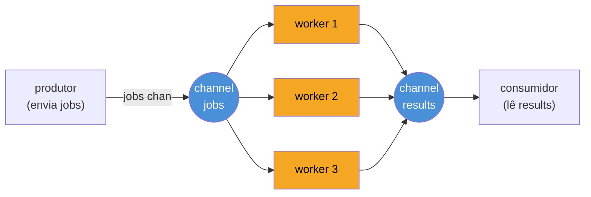
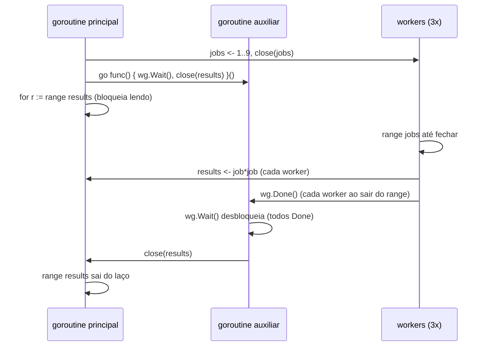

# Worker pools

> [!abstract] TL;DR
> **Worker pool** é N goroutines fixas lendo do **mesmo** channel de jobs — em vez de disparar uma goroutine por tarefa (que explode com milhões de itens), você limita a concorrência a um número que sua máquina, seu banco ou sua API upstream aguenta. O padrão canônico usa três peças: um channel `jobs` (entrada), um channel `results` (saída) e um `sync.WaitGroup` para saber quando os workers terminaram — junto com a disciplina de fechar `jobs` quando acabar de enviar e fechar `results` só depois que todo worker sair. É provavelmente o padrão de concorrência mais usado em produção em Go: rate limiting de chamadas HTTP, processamento de fila, ingestão de arquivos — qualquer coisa em que o volume de trabalho é imprevisível mas os recursos por trás (conexões, CPU, memória) não são.

## O problema que motiva o padrão

Imagine que você recebeu 100 mil URLs para baixar e processar. A tentação natural, depois de aprender goroutines, é disparar uma por item:

```go
for _, url := range urls {
    go baixar(url) // 100 mil goroutines simultâneas — cuidado
}
```

Compila, roda, e é exatamente o tipo de código que passa no `go vet` mas explode em produção. Cada goroutine, sozinha, é barata — mas 100 mil delas tentando abrir 100 mil conexões HTTP ao mesmo tempo derrubam o servidor remoto, esgotam file descriptors, e fazem o scheduler do runtime (o assunto do [[03-Dominios/Tecnologia/Go/07 - Goroutines e o scheduler/index|Galho 7]]) gastar mais tempo trocando de contexto entre goroutines do que executando trabalho de fato.

O problema não é concorrência — é concorrência **sem limite**. Você quer processar as 100 mil URLs concorrentemente, mas com um teto: no máximo, digamos, 10 downloads simultâneos. É exatamente o problema que um pool de threads resolve em Java (`ExecutorService` com `newFixedThreadPool(10)`) ou um pool de workers resolve em Node (`worker_threads` com fila) — só que em Go a solução não usa uma classe de pool pronta da biblioteca padrão. Usa a primitiva mais básica que a linguagem já te deu: o channel, como visto na [[01 - Channels — o tubo entre goroutines|nota 01]] deste galho.

## O mecanismo: N goroutines, um channel

A ideia central é simples de enunciar: em vez de uma goroutine por item de trabalho, você cria um número **fixo** de goroutines — os *workers* — e todas elas leem do **mesmo** channel `jobs`. Quem envia trabalho não escolhe qual worker vai processar; o próprio channel distribui, porque (como a [[03 - Fechando channels e o range|nota 03]] já estabeleceu) várias goroutines fazendo `range` no mesmo channel competem pelos valores — cada valor vai para exatamente uma delas.



O número de workers passa a ser o seu dial de concorrência — três workers processam no máximo três jobs ao mesmo tempo, não importa quantos milhares de jobs estejam esperando na fila. É a mesma ideia de um channel **buffered** (nota 02) atuando como fila de trabalho, mas agora com consumidores múltiplos do lado de saída em vez de um só.

## Anatomia passo a passo

O esqueleto tem quatro decisões, nesta ordem:

1. **Criar os channels** `jobs` e `results`, tipicamente buffered para não travar o produtor enquanto os workers ainda não começaram a consumir.
2. **Lançar N goroutines worker**, cada uma fazendo `range` em `jobs` até o channel fechar, escrevendo o resultado em `results`.
3. **Enviar o trabalho** no channel `jobs`, e **fechar `jobs`** quando acabar — sinal de "não vem mais nada", que o `range` de cada worker usa para sair do laço (mecanismo da nota 03).
4. **Esperar todos os workers terminarem** (via `sync.WaitGroup`) antes de fechar `results` — fechar `results` cedo demais, com um worker ainda tentando escrever nele, causa panic de "send on closed channel".

```go
func workerPool(jobs <-chan int, results chan<- int, id int, wg *sync.WaitGroup) {
    defer wg.Done()
    for job := range jobs {
        results <- processar(job, id)
    }
}
```

> [!info] Direções de channel reforçadas aqui
> Repare que a assinatura usa `<-chan int` para `jobs` (só leitura, dentro do worker) e `chan<- int` para `results` (só escrita) — o mesmo mecanismo de [[04 - Direções de channel|direções de channel]] visto na nota anterior deste galho. O compilador impede, dentro dessa função, qualquer tentativa acidental de escrever em `jobs` ou ler de `results`.

## Caso prático completo

Um worker pool de verdade, com produtor, workers e consumidor, processando uma lista de números (o "trabalho" aqui é só elevar ao quadrado — o ponto é o esqueleto, não a tarefa):

```go
package main

import (
    "fmt"
    "sync"
    "time"
)

func worker(id int, jobs <-chan int, results chan<- int, wg *sync.WaitGroup) {
    defer wg.Done()
    for job := range jobs {
        time.Sleep(50 * time.Millisecond) // simula trabalho custoso
        results <- job * job
        fmt.Printf("worker %d processou %d\n", id, job)
    }
}

func main() {
    const numWorkers = 3
    jobs := make(chan int, 100)
    results := make(chan int, 100)

    var wg sync.WaitGroup

    // 1. lança os workers
    for w := 1; w <= numWorkers; w++ {
        wg.Add(1)
        go worker(w, jobs, results, &wg)
    }

    // 2. envia o trabalho
    for j := 1; j <= 9; j++ {
        jobs <- j
    }
    close(jobs) // sinaliza: não vem mais nada

    // 3. fecha results só depois que todo worker terminar
    go func() {
        wg.Wait()
        close(results)
    }()

    // 4. consome os resultados
    total := 0
    for r := range results {
        total += r
    }
    fmt.Println("soma dos quadrados:", total)
}
```

Nove jobs, três workers — cada worker processa em média três jobs, mas a distribuição exata depende de quem terminou primeiro e voltou a pedir mais trabalho ao channel. É esse rebalanceamento automático, sem coordenação explícita, que faz o padrão valer a pena: se um job demora mais que os outros, o worker que pegou ele fica ocupado enquanto os demais continuam consumindo a fila — nenhum worker fica ocioso enquanto há trabalho esperando.

> [!info] `range` sobre channel fechado — Go 1.23 e o `for range` sobre func iterators
> O `for job := range jobs` usado aqui é o `range` sobre channel padrão desde sempre — nada novo. Vale mencionar que a partir do Go 1.23, `range` também aceita **func iterators** (`range-over-func`), um mecanismo diferente para iterar sobre sequências customizadas; não é o caso deste padrão, mas se você ver `range` sobre algo que não é slice/map/channel/int em código recente, é provavelmente isso.

### Por que o `go func() { wg.Wait(); close(results) }()` roda em goroutine separada

Esse detalhe costuma passar despercebido na primeira leitura, mas é a peça que evita deadlock. Se você chamasse `wg.Wait()` direto na goroutine principal, **antes** do laço `for r := range results`, o programa travaria: `wg.Wait()` bloqueia até todos os workers chamarem `Done()`, mas os workers estão bloqueados tentando escrever em `results` — e ninguém está lendo `results` ainda, porque a goroutine principal está presa em `wg.Wait()`. Deadlock circular clássico.

A solução: rodar o `wg.Wait()` numa goroutine à parte, que fica livre para bloquear enquanto a goroutine principal já começa a consumir `results` com o `range`. Assim que o último worker termina e chama `wg.Done()`, o `wg.Wait()` da goroutine auxiliar desbloqueia, `close(results)` executa, e o `range results` na goroutine principal sai do laço naturalmente.



## Limitando concorrência sem canal de resultados

Nem todo worker pool precisa devolver resultado — às vezes o trabalho é só efeito colateral (gravar em disco, enviar um webhook, escrever num banco). Nesses casos, o padrão simplifica: sem `results`, só `jobs` e `WaitGroup`.

```go
func main() {
    const numWorkers = 5
    jobs := make(chan string, 100)
    var wg sync.WaitGroup

    for w := 1; w <= numWorkers; w++ {
        wg.Add(1)
        go func(id int) {
            defer wg.Done()
            for url := range jobs {
                baixarEProcessar(url) // efeito colateral, sem retorno pelo channel
            }
        }(w)
    }

    for _, url := range listaDeURLs {
        jobs <- url
    }
    close(jobs)

    wg.Wait() // agora pode ser síncrono — não há results pra travar
    fmt.Println("todos os downloads terminaram")
}
```

> [!info] Loop variable capturado corretamente (Go 1.22+)
> Repare em `go func(id int) { ... }(w)` — o valor de `w` é passado como argumento, então cada goroutine recebe sua própria cópia, técnica que sempre foi necessária antes do Go 1.22. A partir do **Go 1.22**, a variável de laço (`w` em `for w := 1; w <= numWorkers; w++`) já é recriada a cada iteração, então `go func() { usa(w) }()` sem parâmetro também funcionaria corretamente em código novo — mas passar como argumento continua sendo a forma mais explícita e portável entre versões, e é o estilo que você vai ver na maior parte do código Go já publicado.

Aqui, sem `results`, `wg.Wait()` pode rodar direto na goroutine principal, síncrono — não há o risco de deadlock da seção anterior, porque não existe channel de saída esperando ser lido.

## Propagando erros de dentro do worker

Os exemplos até aqui assumem que `processar` nunca falha. Na prática, cada job pode dar erro — uma URL que não responde, uma linha malformada — e o padrão precisa de um jeito de reportar isso sem derrubar o pool inteiro. A saída mais direta é fazer `results` carregar um struct com valor **e** erro juntos, em vez de só o valor:

```go
type Resultado struct {
    Job   int
    Valor int
    Err   error
}

func worker(id int, jobs <-chan int, results chan<- Resultado, wg *sync.WaitGroup) {
    defer wg.Done()
    for job := range jobs {
        v, err := processarComErro(job)
        results <- Resultado{Job: job, Valor: v, Err: err}
    }
}

func main() {
    // ... mesmo setup de jobs, workers, wg ...

    var falhas int
    for r := range results {
        if r.Err != nil {
            fmt.Printf("job %d falhou: %v\n", r.Job, r.Err)
            falhas++
            continue
        }
        fmt.Printf("job %d = %d\n", r.Job, r.Valor)
    }
    fmt.Println("total de falhas:", falhas)
}
```

O ponto central: **um job com erro não interrompe os demais**. Cada worker continua consumindo `jobs` normalmente; o erro só vira dado dentro do `Resultado`, tratado pelo consumidor no momento em que ele já esperava processar cada item de qualquer forma. É a diferença entre "erro como valor" (idiomático em Go, como a nota sobre tratamento de erros do galho de fundamentos já estabeleceu) e "erro como exceção que aborta tudo" — comportamento que outras linguagens dão de graça e que, em Go, você continua tendo que desenhar explicitamente mesmo dentro de um worker pool.

> [!info] Quando o objetivo é abortar tudo no primeiro erro
> Às vezes você *quer* que o primeiro erro cancele o resto — por exemplo, se os jobs restantes ficaram inúteis assim que um falhou. Esse caso pede `context.Context` para sinalizar cancelamento a todos os workers de uma vez, mecanismo do Galho 9; dentro deste galho, a ferramenta disponível seria um `select` (nota 05) escutando tanto `jobs` quanto um channel de cancelamento dentro do laço do worker — mais canivete do que solução pronta.

## Escolhendo o tamanho do pool

Não existe um número mágico — depende do que o worker está limitado por (*bound by*):

| Tipo de trabalho | Guia de tamanho |
|---|---|
| CPU-bound (cálculo puro) | próximo de `runtime.NumCPU()` — mais que isso só aumenta troca de contexto |
| I/O-bound (rede, disco, banco) | bem maior que `NumCPU()` — workers passam a maior parte do tempo bloqueados esperando I/O, não competindo por CPU |
| Limitado por recurso externo (rate limit de API, pool de conexões de banco) | teto definido pelo recurso externo, não pela sua máquina — 10 workers porque a API upstream aceita 10 conexões simultâneas, por exemplo |

Um erro comum é copiar `runtime.NumCPU()` para todo pool, inclusive os I/O-bound — isso sub-utiliza a concorrência disponível quando o gargalo real é rede, não CPU.

## Armadilhas comuns

> [!warning] Fechar `results` antes de todos os workers terminarem
> Se você chamar `close(results)` sem esperar `wg.Wait()` primeiro, algum worker que ainda esteja no meio de `results <- valor` gera `panic: send on closed channel`. A ordem é sempre: todos os workers terminam → **então** `results` fecha. É exatamente o papel do `sync.WaitGroup` neste padrão.

> [!warning] Esquecer de fechar `jobs`
> Se `jobs` nunca fecha, o `range jobs` dentro de cada worker nunca sai do laço — os workers ficam bloqueados para sempre esperando o próximo valor, o programa nunca termina, e `wg.Wait()` trava. É o mesmo goroutine leak visto na [[01 - Channels — o tubo entre goroutines|nota 01]], só que multiplicado por N workers.

> [!warning] `wg.Wait()` bloqueando a goroutine que também lê `results`
> Já visto na seção principal, mas vale repetir como armadilha isolada: `wg.Wait()` e o consumo de `results` não podem rodar na mesma goroutine sequencial se `results` é buffered/unbuffered e os workers dependem de alguém ler dele para não travar. A saída é sempre isolar `wg.Wait(); close(results)` numa goroutine própria.

> [!warning] Buffer de `jobs` pequeno demais trava o produtor sem necessidade
> Se `jobs` é unbuffered (ou com buffer pequeno) e o produtor tenta enviar tudo de uma vez antes de qualquer worker começar a consumir, o produtor bloqueia a cada envio até um worker liberar espaço — não é um bug, mas se o objetivo é "disparar tudo rápido e deixar os workers processarem depois", um buffer dimensionado para o volume esperado evita essa espera artificial.

## Lente cross-stack

Quem já lidou com pool de concorrência em outra linguagem reconhece a forma, mesmo com peças diferentes por baixo:

| Linguagem | Mecanismo equivalente |
|---|---|
| Java | `ExecutorService` com `Executors.newFixedThreadPool(n)` + `submit`/`Future` |
| Python | `concurrent.futures.ThreadPoolExecutor(max_workers=n)` ou `multiprocessing.Pool` |
| Node.js | `worker_threads` com fila manual, ou bibliotecas como `p-limit` para promises |
| Go | goroutines + channel `jobs` compartilhado — sem classe de pool, montado à mão com as primitivas da linguagem |

A diferença mais marcante para quem vem de Java ou Python: essas linguagens oferecem uma **abstração pronta** (a classe do pool, com fila interna e API de submissão). Go não tem — o "pool" é um padrão de código que você escreve com goroutines e channels, não um tipo da biblioteca padrão que você instancia. Isso é deliberado: dá mais controle (você decide exatamente como distribuir trabalho, agregar resultado, tratar erro) ao custo de escrever mais linhas do zero a cada vez — o que também é o motivo de bibliotecas de terceiros como `golang.org/x/sync/errgroup` existirem, para cobrir o caso comum sem repetir o esqueleto manualmente.

## Como explicar em inglês

> A **worker pool** in Go is a fixed number of goroutines all reading from the same `jobs` channel, instead of spawning one goroutine per unit of work — the channel naturally load-balances items across whichever worker is free next. The canonical shape has three moving parts: a `jobs` channel for input, a `results` channel for output, and a `sync.WaitGroup` to know when every worker has finished. The ordering matters: close `jobs` once you're done sending (so each worker's `range` loop can exit), then wait for all workers to call `Done()` before closing `results` — closing it too early causes a `send on closed channel` panic in whichever worker is still writing. Because waiting on the `WaitGroup` and draining `results` can't safely happen sequentially in the same goroutine, the close-and-wait step typically runs in its own small goroutine. Sizing the pool depends on what the work is bound by: CPU-bound work wants a pool close to `runtime.NumCPU()`, while I/O-bound work — network calls, database queries — benefits from a much larger pool, since workers spend most of their time blocked waiting rather than competing for CPU.

| Termo PT | Termo EN |
|---|---|
| pool de workers | worker pool |
| channel de trabalho | jobs channel |
| channel de resultados | results channel |
| limitar concorrência | bound / limit concurrency |
| vazamento de goroutine | goroutine leak |
| trabalho limitado por CPU | CPU-bound work |
| trabalho limitado por I/O | I/O-bound work |
| dimensionar o pool | size the pool |

## O que vem a seguir

O worker pool desta nota assumiu, por simplicidade, que nada dá errado — nenhum job trava para sempre, nenhum worker entra em pânico, nenhum produtor esquece de fechar `jobs`. A [[08 - Armadilhas de channels|próxima nota]] cataloga sistematicamente o que acontece quando essas suposições falham: deadlocks clássicos, goroutine leaks, panics de "send on closed channel" e "close of closed channel", e como detectar e evitar cada um — o fechamento natural deste galho antes de o Galho 9 introduzir `context.Context`, `Mutex` e `atomic` como ferramentas complementares (não substitutas) de channels para coordenação.

## Veja também

- [[01 - Channels — o tubo entre goroutines|01 — Channels — o tubo entre goroutines]] — o mecanismo de envio/recebimento por trás de `jobs` e `results`
- [[02 - Buffered vs unbuffered|02 — Buffered vs unbuffered]] — por que `jobs` costuma ser buffered neste padrão
- [[03 - Fechando channels e o range|03 — Fechando channels e o range]] — o `range jobs` que cada worker usa para saber quando parar
- [[04 - Direções de channel|04 — Direções de channel]] — `<-chan int` e `chan<- int` na assinatura de `worker`
- [[06 - Padrões — fan-in, fan-out, pipeline|06 — Padrões — fan-in, fan-out, pipeline]] — worker pool é, estruturalmente, um fan-out seguido de fan-in
- [[08 - Armadilhas de channels|08 — Armadilhas de channels]] — próxima nota do galho
- [[03-Dominios/Tecnologia/Go/index|Trilha Go]]

## Fontes

- The Go Authors. *A Tour of Go — Worker pools (gopl.io style example)*. go.dev. https://go.dev/tour/concurrency/1 (acessado em 2026-07-18)
- Go by Example. *Worker Pools*. gobyexample.com. https://gobyexample.com/worker-pools
- Go by Example. *WaitGroups*. gobyexample.com. https://gobyexample.com/waitgroups
- The Go Authors. *sync package — WaitGroup*. pkg.go.dev. https://pkg.go.dev/sync#WaitGroup (acessado em 2026-07-18)
- The Go Authors. *Go 1.22 Release Notes — for loop variable scoping*. go.dev. https://go.dev/doc/go1.22#language (acessado em 2026-07-18)
- golang.org/x/sync. *errgroup package*. pkg.go.dev. https://pkg.go.dev/golang.org/x/sync/errgroup (acessado em 2026-07-18)
