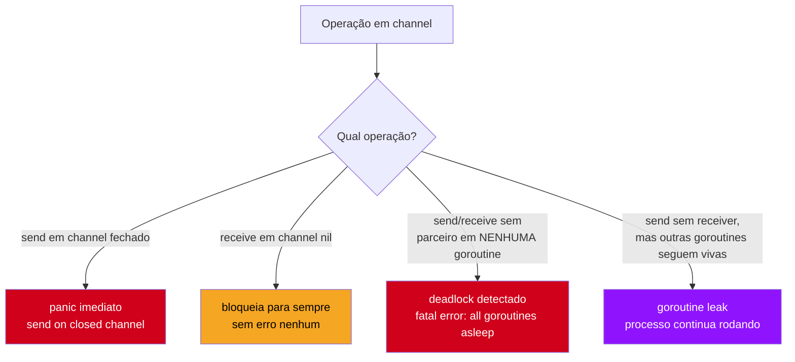
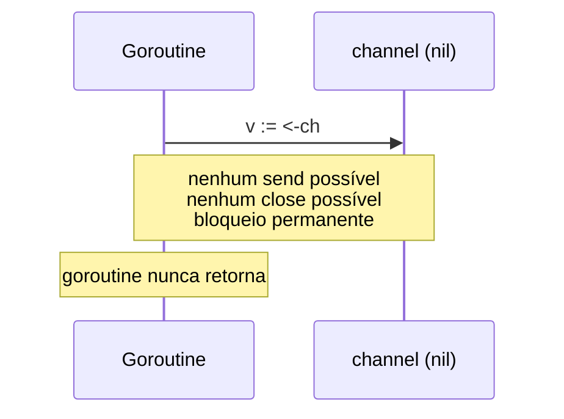
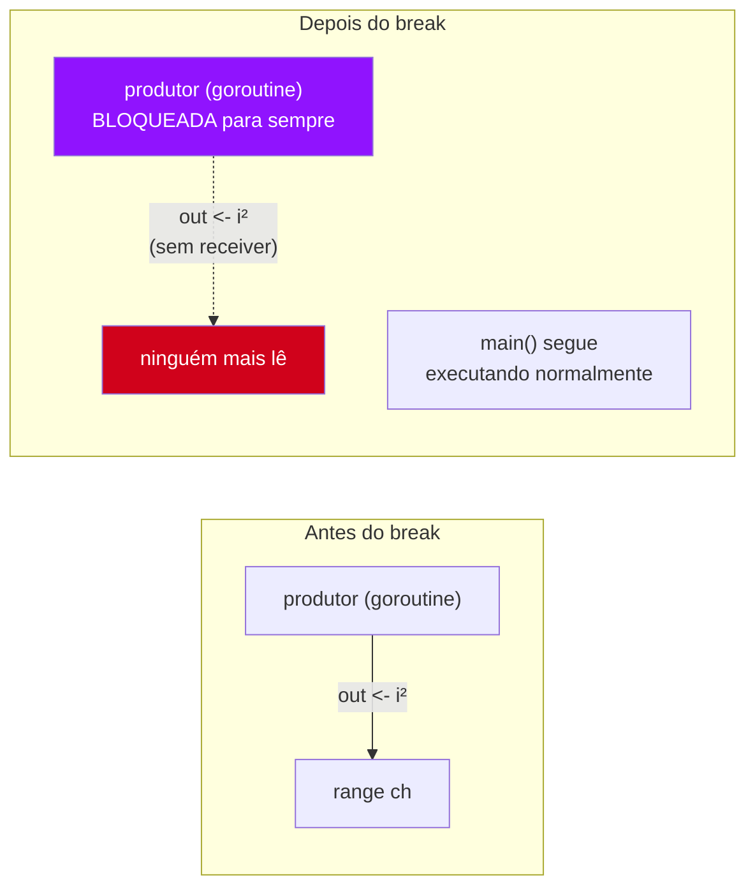
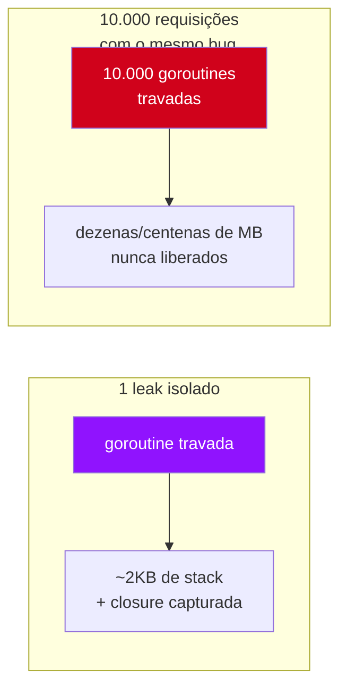

# Armadilhas de channels

> [!abstract] TL;DR
> Channel é um mecanismo simples com quatro formas específicas de derrubar um programa Go, e o compilador não avisa nenhuma delas — todas só aparecem em runtime, e algumas nem isso. **Send em channel fechado** dá `panic` imediato. **Receive de canal `nil`** não dá erro nenhum: bloqueia a goroutine para sempre, silenciosamente. **Deadlock** — quando toda goroutine do programa está bloqueada esperando algo que nunca vai acontecer — o runtime detecta e mata o processo com `fatal error: all goroutines are asleep`. E o mais traiçoeiro dos quatro, **goroutine leak** por channel sem receiver, não mata nada: a goroutine trava para sempre, consumindo memória, e o programa continua rodando como se nada tivesse acontecido — até a produção acumular milhares delas e o processo ficar sem RAM. As quatro têm a mesma raiz: channel é uma promessa de comunicação, e a promessa quebrada se manifesta de formas muito diferentes dependendo de qual lado da conversa falhou.

## Um bug que não aparece nos testes

Imagina este cenário: você escreve uma função que dispara uma goroutine para calcular algo em paralelo, manda o resultado por um channel, e segue em frente:

```go
func calcular(n int) <-chan int {
    resultado := make(chan int)
    go func() {
        resultado <- n * n
    }()
    return resultado
}

func main() {
    ch := calcular(7)
    fmt.Println(<-ch) // 49 — funciona
}
```

Roda liso, passa no teste, vai pro code review sem levantar suspeita. Agora troque uma linha: e se, em algum caminho de erro, `main` decidir *não* ler o resultado?

```go
func main() {
    ch := calcular(7)
    if algumaCondicaoDeErro() {
        return // nunca lê ch!
    }
    fmt.Println(<-ch)
}
```

O programa não trava, não dá panic, não imprime nada de estranho — só encerra `main` mais cedo. Mas a goroutine que criou `resultado <- n * n` continua viva, presa para sempre num `chan send` que ninguém vai receber. Ela não aparece em nenhum teste unitário. Não aparece num `go vet` padrão. É invisível até você rodar `pprof` em produção meses depois e descobrir 40 mil goroutines zumbis comendo memória.

Esse é o fio condutor desta nota: channels não têm garbage collection de "conversa abandonada". Cada ponta que não aparece — send sem receiver, receive de canal fechado sem checar, close duplicado, canal `nil` esquecido — quebra de um jeito diferente, e cada quebra merece ser reconhecida de cara.

## As quatro armadilhas, de relance



As quatro se dividem em dois grupos por severidade: **panic/deadlock** (C e E) o runtime detecta e você fica sabendo na hora, geralmente em desenvolvimento ou nos primeiros segundos de produção. **Bloqueio silencioso e leak** (D e F) são os perigosos de verdade — o programa continua de pé, e o problema só aparece como degradação lenta, difícil de reproduzir e ainda mais difícil de linkar à causa raiz.

## Armadilha 1: send em channel fechado

A [[03 - Fechando channels e o range|nota 03]] já estabeleceu a regra "quem produz fecha, nunca quem consome". Violar essa regra do lado do send é a armadilha mais direta das quatro:

```go
ch := make(chan int)
close(ch)
ch <- 1 // panic: send on closed channel
```

```go
package main

func main() {
    ch := make(chan int, 1)
    close(ch)
    ch <- 1 // panic: send on closed channel
}
```

Não tem meio-termo: qualquer send — buffered ou unbuffered, canal cheio ou vazio — para um channel já fechado dispara `panic` **imediato e incondicional**. A [especificação da linguagem](https://go.dev/ref/spec#Send_statements) é explícita: "A send on a closed channel proceeds by causing a run-time panic." Não é um erro que você recupera com `if err != nil` — é `panic`, que derruba a goroutine inteira (e o processo, se não houver `recover`).

O padrão mais comum que produz esse bug é duas goroutines competindo pelo mesmo `close`:

```go
func produtor(ch chan<- int, done <-chan struct{}) {
    for i := 0; ; i++ {
        select {
        case ch <- i:
        case <-done:
            close(ch) // produtor decide fechar aqui...
            return
        }
    }
}

func outroProdutor(ch chan<- int) {
    // ...mas se outra goroutine também manda pra ch depois do close, panic
    ch <- 99
}
```

> [!warning] Fechar duas vezes também é panic
> `close(ch)` chamado uma segunda vez no mesmo channel — mesmo sem nenhum send envolvido — produz `panic: close of closed channel`. A regra "só o produtor fecha, e só uma vez" não é estilo, é sobrevivência: com múltiplos produtores, nenhum indivíduo sabe com certeza se é o último a terminar, então fechar vira responsabilidade coletiva mal definida. A solução idiomática usa `sync.WaitGroup` para contar produtores e fechar só quando todos terminaram — mecanismo do [[03-Dominios/Tecnologia/Go/09 - Sincronização e context/03 - WaitGroup e Once|Galho 9]].

Receber de um channel fechado, em contraste, **nunca dá panic** — devolve o zero value imediatamente, sem bloquear (é o mecanismo do `v, ok := <-ch` da nota 03). A assimetria é proposital: fechar um channel é um sinal de "acabou", e sinais de "acabou" devem poder ser lidos por qualquer número de goroutines, quantas vezes quiserem — mas *produzir* depois de dizer "acabou" é uma contradição lógica, e o runtime trata como erro de programação.

## Armadilha 2: receive de channel nil

Esta é a mais sutil das quatro porque não parece um bug óbvio — parece só uma variável não inicializada:

```go
var ch chan int // zero value de channel é nil, não um channel vazio
v := <-ch        // bloqueia para sempre — sem panic, sem erro, sem timeout
```

Diferente de `nil` em outras linguagens (`NullPointerException` em Java, `TypeError` em Python ao tentar iterar `None`), operar num channel `nil` em Go **não é erro de tipo nem panic** — ambos send e receive num channel `nil` simplesmente bloqueiam para sempre. A goroutine que tenta fica presa, esperando um parceiro que matematicamente nunca vai aparecer, porque não existe operação alguma capaz de "acordar" um `chan send`/`chan receive` num `nil`.



O cenário real onde isso pega alguém de surpresa é um struct com campo de channel não inicializado:

```go
type Worker struct {
    Jobs chan int // esquecido de inicializar com make()
}

func main() {
    w := Worker{} // w.Jobs é nil — ninguém percebeu
    w.Jobs <- 5    // bloqueia para sempre, sem erro nenhum
}
```

`w := Worker{}` compila sem reclamar — struct literal vazio é totalmente válido em Go, e `chan int` tem zero value `nil` como qualquer outro tipo de referência (slice, map, ponteiro). Não existe aviso de compilador dizendo "esse campo channel nunca foi inicializado com `make`"; o programa só trava na primeira operação sobre ele.

> [!info] `nil` em `select` é uma feature, não só um bug
> Ainda que receive/send num channel `nil` isolado seja quase sempre engano, dentro de um `select` (nota 05) um `case` com channel `nil` é **desativado permanentemente** — o `select` nunca escolhe esse `case`, sempre. Esse comportamento é usado deliberadamente em padrões avançados: zerar (`ch = nil`) um dos channels de um `select` depois de consumi-lo uma vez, para "desligar" aquele branch sem precisar reestruturar o `select` inteiro. Fora desse contexto controlado, porém, um channel `nil` inesperado é praticamente sempre bug — não confunda o uso deliberado com o esquecimento acidental.

## Armadilha 3: deadlock

Deadlock em Go, no sentido estrito detectado pelo runtime, é quando **toda** goroutine do programa está bloqueada ao mesmo tempo — nenhuma tem como progredir, nenhuma tem como acordar as outras. O runtime tem um detector embutido para esse caso específico e mata o processo:

```go
func main() {
    ch := make(chan int) // unbuffered
    ch <- 1               // ninguém vai receber — só existe esta goroutine
}
```

```
fatal error: all goroutines are asleep - deadlock!

goroutine 1 [chan send]:
main.main()
        /tmp/main.go:5 +0x25
exit status 2
```

Repare na diferença crucial com a Armadilha 2: aqui não é um bloqueio silencioso — é `fatal error`, processo morto na hora, com stack trace apontando exatamente a linha travada. O runtime consegue detectar porque, nesse programa, **não há mais nenhuma goroutine viva** capaz de desbloquear a que está travada — é uma propriedade global do programa inteiro, verificável pelo scheduler.

```go
func main() {
    ch := make(chan int)
    <-ch // deadlock: nada nunca vai mandar pra ch
}
```

O mesmo padrão, com receive em vez de send, produz `fatal error` idêntico. E acontece mesmo com buffer, se o buffer também esgota:

```go
func main() {
    ch := make(chan int, 2)
    ch <- 1
    ch <- 2
    ch <- 3 // buffer cheio, ninguém consome — deadlock
}
```

Deadlock também acontece com duas goroutines se esperando **mutuamente**, sem que nenhuma das duas esteja sozinha — o padrão clássico de troca cruzada:

```go
func main() {
    a := make(chan int)
    b := make(chan int)

    go func() {
        <-a  // espera receber de a...
        b <- 1 // ...antes de mandar pra b
    }()

    <-b  // main espera receber de b...
    a <- 1 // ...mas só manda pra a DEPOIS dessa linha, que nunca executa
}
```

`main` bloqueia em `<-b` esperando a goroutine mandar algo; a goroutine bloqueia em `<-a` esperando `main` mandar algo — mas `main` só chega no `a <- 1` depois de desbloquear de `<-b`, e nunca desbloqueia. As duas ficam presas uma na outra, e como não sobra nenhuma terceira goroutine para desempatar, o runtime detecta e mata o processo com o mesmo `fatal error: all goroutines are asleep - deadlock!` — só que agora o stack trace lista **duas** goroutines travadas, cada uma numa linha diferente, uma esperando a outra.

> [!warning] O detector de deadlock só enxerga o programa TODO parado — não um caso isolado
> Se **qualquer outra** goroutine do programa ainda está rodando (mesmo presa noutro lugar não relacionado, ou só dormindo num `time.Sleep` longo), o detector de deadlock **não dispara** — porque, tecnicamente, não é verdade que "todas" as goroutines estão dormindo. Nesse caso, a goroutine travada vira exatamente a Armadilha 4: um leak silencioso, sem `fatal error` nenhum, porque tecnicamente o programa como um todo ainda está "progredindo" (em outra goroutine qualquer). Isso explica por que deadlocks em programas de um único fluxo são fáceis de pegar em teste, e o mesmo padrão de bug num servidor com centenas de goroutines simultâneas vira leak invisível — dá pra sentir a ironia: o mesmo defeito de código, dependendo só de quantas outras goroutines estão vivas no momento, produz `fatal error` óbvio ou silêncio absoluto.

## Armadilha 4: goroutine leak por channel sem receiver

Esta é a mais perigosa das quatro porque **não existe sintoma imediato**. É a generalização do cenário de abertura desta nota: uma goroutine bloqueada num `ch <- valor` (ou num `<-ch`) que nunca vai encontrar parceiro, mas que o runtime não classifica como deadlock porque outras goroutines do programa seguem vivas e rodando normalmente.

```go
func gerar(n int) <-chan int {
    out := make(chan int)
    go func() {
        for i := 0; i < n; i++ {
            out <- i * i // sem buffer — bloqueia até alguém ler
        }
        close(out)
    }()
    return out
}

func main() {
    ch := gerar(1_000_000)
    for v := range ch {
        if v > 100 {
            break // sai do range antes de esgotar o channel!
        }
        fmt.Println(v)
    }
    // a goroutine de gerar() ficou travada em "out <- i*i"
    // para sempre — ninguém mais vai ler ch
}
```

`break` no meio de um `range` sobre channel é um padrão comum e legítimo — mas se a goroutine produtora do outro lado ainda tem itens para mandar (e o channel é unbuffered ou o buffer já encheu), ela fica presa no próximo `out <- i*i` esperando um receiver que o `break` acabou de eliminar. `main()` segue rodando — a goroutine vazada não derruba nada, não aparece em erro nenhum, só continua ali, ocupando sua stack (mínimo 2KB, crescendo conforme necessário) e mantendo vivo tudo que ela referencia via closure.



Em produção, esse padrão se acumula: cada requisição HTTP que dispara um `gerar()` e sai cedo demais deixa uma goroutine zumbi para trás. Depois de horas ou dias, `pprof` mostra dezenas de milhares de goroutines em `chan send`, e a memória do processo cresce sem nenhum vazamento óbvio de heap — porque o vazamento é de *goroutines*, não de objetos soltos.

> [!warning] `context.Context` existe em boa parte por causa desta armadilha
> A forma idiomática de evitar esse leak é dar ao produtor um jeito de saber que ninguém mais está ouvindo — geralmente um `select` com um segundo `case` escutando um `done` channel ou um `ctx.Done()`, para que o `out <- valor` nunca fique bloqueado sem alternativa. Esse padrão completo — cancelamento propagado, channel `Done()`, e por que ele resolve exatamente esta armadilha — é o assunto central do [[03-Dominios/Tecnologia/Go/09 - Sincronização e context/06 - context.Context — deadline, cancel, values|Galho 9]]. Os padrões fan-in/fan-out da [[06 - Padrões — fan-in, fan-out, pipeline|nota 06]] e os worker pools da [[07 - Worker pools|nota 07]] já usam channel de cancelamento nos exemplos, mas o mecanismo formal — `context` como parâmetro convencional de função Go — só é tratado a fundo no próximo galho.

## Padrão seguro: fechar sem risco de close duplicado

Voltando à Armadilha 1 — quando múltiplas goroutines *poderiam* querer fechar o mesmo channel, a solução idiomática não é uma variável booleana manual (`fechado := false; if !fechado {...}` — não é atômico, tem *race condition* própria) nem um `recover()` disfarçando o panic. É `sync.Once`, que garante execução única de uma função independente de quantas goroutines chamem `Do` concorrentemente:

```go
type Broadcaster struct {
    ch   chan struct{}
    once sync.Once
}

func NovoBroadcaster() *Broadcaster {
    return &Broadcaster{ch: make(chan struct{})}
}

// Fechar pode ser chamado de N goroutines diferentes, com segurança:
func (b *Broadcaster) Fechar() {
    b.once.Do(func() {
        close(b.ch)
    })
}

func (b *Broadcaster) Feito() <-chan struct{} {
    return b.ch
}
```

```go
func main() {
    b := NovoBroadcaster()

    for i := 0; i < 5; i++ {
        go func(id int) {
            b.Fechar() // chamado 5 vezes, concorrentemente — só a primeira executa close
            fmt.Println("goroutine", id, "chamou Fechar")
        }(i)
    }

    <-b.Feito() // desbloqueia assim que QUALQUER uma delas executar o close real
    fmt.Println("desbloqueado")
}
```

`sync.Once.Do` serializa as chamadas concorrentes e garante que o `close(b.ch)` interno rode **exatamente uma vez**, não importa quantas goroutines cheguem em `Fechar()` ao mesmo tempo — elimina de vez a corrida "quem fecha por último" que produz a Armadilha 1 em código com múltiplos produtores. `sync.Once` é do pacote `sync`, que o [[03-Dominios/Tecnologia/Go/09 - Sincronização e context/03 - WaitGroup e Once|Galho 9]] cobre por completo — aqui ele já aparece como ferramenta pronta para resolver um problema concreto deste galho.

## Diagnosticando: quatro sintomas, quatro causas

| Armadilha | Sintoma observável | Quando aparece |
|---|---|---|
| Send em channel fechado | `panic: send on closed channel` | Imediato, na linha exata do send |
| Receive de channel `nil` | Bloqueio silencioso, sem erro | Só percebido por timeout externo ou `pprof` |
| Deadlock (programa todo parado) | `fatal error: all goroutines are asleep - deadlock!` | Imediato, com stack trace de todas as goroutines travadas |
| Leak (uma goroutine parada, resto vivo) | Nenhum — programa segue rodando | Só percebido por `pprof`, métricas de memória, ou `runtime.NumGoroutine()` crescendo |

`go run -race` detecta *data races*, não estas quatro armadilhas — são categorias diferentes de bug. Para deadlock e panic, o próprio runtime avisa sem ferramenta extra. Para `nil` channel e leak, a ferramenta certa é observabilidade em runtime: `runtime.NumGoroutine()` numa métrica exportada, ou um `pprof` de goroutine (`go tool pprof http://localhost:6060/debug/pprof/goroutine`) mostrando centenas de goroutines empilhadas na mesma linha de código — esse padrão, muitas goroutines idênticas presas no mesmo `chan send`, é a assinatura clássica de leak.

Em teste automatizado, o jeito mais barato de flagrar um leak antes que ele chegue à produção é comparar a contagem de goroutines antes e depois do teste rodar:

```go
func TestSemLeak(t *testing.T) {
    antes := runtime.NumGoroutine()

    ch := gerar(1000)
    for v := range ch {
        if v > 100 {
            break
        }
    }

    time.Sleep(50 * time.Millisecond) // dá tempo do scheduler assentar
    depois := runtime.NumGoroutine()

    if depois > antes {
        t.Errorf("vazou goroutine: antes=%d depois=%d", antes, depois)
    }
}
```

> [!info] Pacotes de terceiros automatizam esse padrão
> `runtime.NumGoroutine()` com `time.Sleep` manual é frágil (depende de timing) — em código de produção, a comunidade usa bibliotecas como `go.uber.org/goleak`, que faz a mesma checagem de forma mais robusta, tipicamente chamada uma vez em `TestMain` para cobrir o pacote inteiro. Não é biblioteca padrão do Go, mas é praticamente onipresente em bases de código concorrentes maduras — vale a menção mesmo sem link fixo no `pkg.go.dev`, porque o padrão que ela automatiza é exatamente o mostrado acima.

> [!question]- Por que Go não detecta leak de goroutine automaticamente, já que detecta deadlock?
> Porque são propriedades matematicamente diferentes. Deadlock ("todas as goroutines estão bloqueadas, simultaneamente, agora") é uma pergunta que o scheduler consegue responder olhando o estado global do processo num instante — é decidível em tempo de execução. "Esta goroutine específica nunca mais vai ser desbloqueada" é, em geral, indecidível — provar isso exigiria análise estática equivalente ao problema da parada. O runtime não tenta resolver o indecidível; delega o diagnóstico para ferramentas de observabilidade (pprof, métricas) que detectam o *sintoma* (contagem de goroutines crescendo sem limite) em vez da causa formal.

## O custo real de um leak acumulado

Vale quantificar por que um leak que "não trava nada" ainda é grave. Cada goroutine parada carrega, no mínimo, sua stack — que começa pequena (2KB desde as primeiras versões do Go, crescendo dinamicamente conforme a necessidade) — mas o custo de verdade raramente é a stack em si. É o que a goroutine **mantém vivo via closure**: se `gerar(n)` capturou uma conexão de banco, um buffer grande, ou uma referência a uma struct de request HTTP inteira, tudo isso fica preso na memória enquanto a goroutine não morre — porque o garbage collector não pode coletar nada que uma goroutine viva ainda referencia, mesmo que essa goroutine nunca mais vá fazer progresso algum.



Um serviço HTTP que atende 10 mil requisições por hora, com uma taxa de vazamento de até 1% (uma em cada cem requisições saindo cedo do `range` sem drenar o channel do lado produtor), acumula 100 goroutines vazadas por hora — 2.400 por dia. Multiplicado pelo que cada uma carrega via closure, é um padrão de crescimento de memória que parece "vazamento de memória" nas métricas, mas cuja causa raiz é 100% relacionada a channel, não a alocação direta. É exatamente o tipo de bug que só o `pprof` de goroutine — não o `pprof` de heap — expõe com clareza, porque o sintoma no heap é indireto.

> [!warning] `select` com `default` pode mascarar o problema, não resolvê-lo
> Trocar `ch <- valor` por `select { case ch <- valor: default: }` (não bloqueante, visto na nota 05) evita o bloqueio — mas se o objetivo era garantir que o valor chegasse, agora ele é silenciosamente descartado sempre que não há receiver pronto. Isso troca "goroutine leak visível via `pprof`" por "perda de dado invisível", o que costuma ser pior: nenhuma métrica de contagem de goroutines vai apontar o problema, porque não sobra goroutine nenhuma travada — só dados que sumiram sem log, sem erro, sem rastro. `default` em `select` resolve bloqueio quando descartar é aceitável (contadores, métricas best-effort); não é substituto de cancelamento propagado quando o dado importa.

## Lente cross-stack: o que cada erro "seria" na sua linguagem de origem

| Vem de... | O equivalente mais próximo |
|---|---|
| Java | `panic` de send em channel fechado ≈ `IllegalStateException` ao escrever numa `BlockingQueue` fechada — mas em Java a exceção é opcional dependendo da implementação; em Go é sempre panic, sem exceção. |
| Python | `nil` channel bloqueando para sempre não tem análogo direto — mais perto de um `asyncio.Queue()` nunca populada, mas Python ao menos lançaria `TimeoutError` com `asyncio.wait_for`; Go não tem timeout embutido, você tem que construir com `select` + `time.After`. |
| Node.js | Goroutine leak lembra um `EventEmitter` com listener nunca removido — memória presa por uma referência viva que ninguém mais aciona — mas em Node isso é vazamento de *objeto*; em Go é vazamento de uma *stack de execução inteira*, mais caro. |
| Java (threads) | Deadlock clássico de threads Java (dois locks em ordem cruzada) tem uma "assinatura" parecida — processo travado — mas o JVM não tem detector automático como o Go runtime; você descobre com `jstack`, manualmente. |

Nenhuma dessas comparações é perfeita — channel não é queue, nem thread, nem `EventEmitter` — mas ajudam a ancorar a intuição: "promessa de comunicação quebrada" tem primos em toda linguagem concorrente, só que Go torna a promessa (e a quebra) muito mais visível na sintaxe.

## Como explicar em inglês

> Go channels fail in four distinct ways, and none of them are caught at compile time. Sending on a **closed channel panics immediately** — `panic: send on closed channel` — because closing signals "no more values," and sending after that is a contradiction the runtime refuses to allow; receiving from a closed channel, by contrast, never panics, it just returns the zero value. Operating on a **`nil` channel** — typically an uninitialized struct field — blocks forever with no error at all, which is the sneakiest failure mode because nothing crashes. A **deadlock**, where every goroutine in the program is asleep with no way to wake each other up, is the one case the runtime actively detects, killing the process with `fatal error: all goroutines are asleep - deadlock!` and a full stack trace. But if even one other goroutine is still running, the same blocked-forever situation becomes a **goroutine leak** instead: no crash, no error, just a goroutine parked on a channel send or receive forever, quietly consuming a stack and whatever it closes over — the kind of bug that only shows up in production as `pprof` goroutine counts climbing without bound. The fix for leaks is almost always giving the blocked side an escape hatch via `select` plus a cancellation signal, which is exactly what `context.Context` exists for.

| Termo PT | Termo EN |
|---|---|
| send em channel fechado | send on a closed channel |
| receive de channel nulo | receive on a nil channel |
| impasse / travamento total | deadlock |
| vazamento de goroutine | goroutine leak |
| detector de deadlock | deadlock detector |
| canal sem receptor | channel with no receiver |
| sinal de cancelamento | cancellation signal |
| rastro de pilha | stack trace |

## O que vem a seguir

As quatro armadilhas desta nota têm uma linha de fuga comum: dar a cada goroutine bloqueada um jeito de desistir, em vez de esperar para sempre. Isso exige dois mecanismos que este galho ainda não cobriu — um jeito de sincronizar acesso a estado compartilhado sem passar tudo por channel (`sync.Mutex`, `sync.WaitGroup`, os pacotes `sync/atomic`) e um jeito padronizado de propagar cancelamento e deadline através de uma árvore inteira de goroutines (`context.Context`). O [[03-Dominios/Tecnologia/Go/09 - Sincronização e context/03 - WaitGroup e Once|Galho 9 — Sincronização e context]] começa exatamente onde este termina: o `sync.WaitGroup` que resolve o "quem fecha por último" da Armadilha 1, e o `context.Context` que resolve a Armadilha 4 de forma sistemática, em vez de channel `done` artesanal.

## Veja também

- [[01 - Channels — o tubo entre goroutines|01 — Channels — o tubo entre goroutines]] — o mecanismo básico cujas quebras esta nota cataloga
- [[03 - Fechando channels e o range|03 — Fechando channels e o range]] — a regra "quem produz fecha" cuja violação é a Armadilha 1
- [[05 - select|05 — select]] — o `case` com channel `nil` desativado, mencionado no callout da Armadilha 2
- [[06 - Padrões — fan-in, fan-out, pipeline|06 — Padrões — fan-in, fan-out, pipeline]] — pipelines onde um estágio abandonado sem cancelamento produz exatamente a Armadilha 4
- [[07 - Worker pools|07 — Worker pools]] — pool de workers como fonte comum de leak se o `done` channel for esquecido
- [[03-Dominios/Tecnologia/Go/index|Trilha Go]]

## Fontes

- The Go Authors. *The Go Programming Language Specification — Send statements*. go.dev. https://go.dev/ref/spec#Send_statements (acessado em 2026-07-18)
- The Go Authors. *The Go Programming Language Specification — Close*. go.dev. https://go.dev/ref/spec#Close (acessado em 2026-07-18)
- The Go Authors. *Effective Go — Channels*. go.dev. https://go.dev/doc/effective_go#channels (acessado em 2026-07-18)
- The Go Authors. *Go Blog — Go Concurrency Patterns: Pipelines and cancellation*. go.dev. https://go.dev/blog/pipelines (acessado em 2026-07-18)
- The Go Authors. *A Tour of Go — Select*. go.dev. https://go.dev/tour/concurrency/5 (acessado em 2026-07-18)
- Go by Example. *Non-Blocking Channel Operations*. gobyexample.com. https://gobyexample.com/non-blocking-channel-operations (acessado em 2026-07-18)
