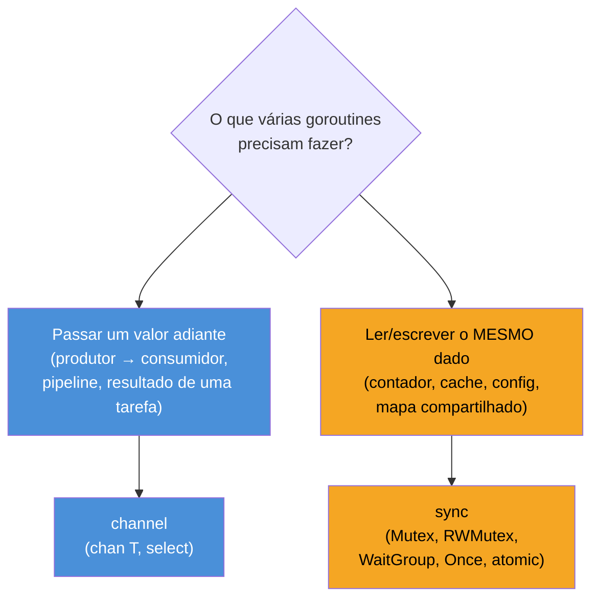

# Quando channels não bastam — o pacote sync

> [!abstract] TL;DR
> O mantra "Don't communicate by sharing memory; share memory by communicating" resume a filosofia de channels, mas **não é uma proibição** — é uma preferência de estilo para quando dados *fluem* entre goroutines. Quando o problema é outro — várias goroutines lendo e escrevendo o **mesmo** contador, cache ou mapa, sem nenhum dado "passando adiante" — forçar isso num channel produz código artificial e mais lento. Para memória genuinamente compartilhada, Go oferece o pacote `sync`: primitivas de baixo nível (`Mutex`, `RWMutex`, `WaitGroup`, `Once`, `atomic`) que protegem acesso concorrente sem simular comunicação onde não há mensagem nenhuma. Este galho existe porque a trilha até aqui tratou channels como *a* ferramenta de concorrência em Go — esta nota é o ponto de virada: channels e `sync` são complementares, não uma hierarquia onde um é "mais idiomático" que o outro.

## O contador que não devia virar um channel

Imagine um servidor HTTP simples contando quantas requisições já atendeu. Cem goroutines de handler, todas incrementando o mesmo número:

```go
type Contador struct {
    total int
}

func (c *Contador) Incrementa() {
    c.total++ // RACE CONDITION — várias goroutines escrevendo ao mesmo tempo
}
```

`c.total++` parece uma operação atômica olhando o código-fonte, mas não é — vira três passos na máquina: ler `total`, somar 1, escrever de volta. Se duas goroutines executam esses três passos entrelaçados, um incremento se perde. Rode isso com `go run -race` sob carga e o race detector (assunto da [[05 - O race detector|nota 05]] deste galho) acusa o problema imediatamente.

A trilha até agora ensinou "use um channel" como resposta padrão a qualquer coordenação entre goroutines. Então a tentação é escrever algo como uma goroutine dedicada, dona exclusiva do contador, recebendo incrementos por channel:

```go
func gerenciadorDeContador(incrementos <-chan int, pedeValor <-chan chan int) {
    total := 0
    for {
        select {
        case delta := <-incrementos:
            total += delta
        case resp := <-pedeValor:
            resp <- total
        }
    }
}
```

Isso funciona — é tecnicamente correto, e é exatamente o padrão que o mantra do Go recomenda. Mas pare e pergunte: **o que está "fluindo" aqui?** Não há um pipeline, não há um produtor passando itens de trabalho para um consumidor processar. Há só cem goroutines querendo fazer a mesma operação — somar 1 — na mesma variável. Modelar isso como comunicação exige inventar dois channels, uma goroutine dedicada rodando para sempre, e um protocolo de pergunta-resposta só para ler o valor atual. É mais código, mais uma goroutine para vazar se algo der errado, e mais lento — cada leitura vira uma troca de mensagens em vez de um acesso direto protegido por um cadeado.

> [!question]- Mas o mantra "share memory by communicating" não diz pra evitar exatamente isso?
> O mantra é uma citação do próprio Rob Pike, num talk de 2012 — e a frase completa, no [Effective Go](https://go.dev/doc/effective_go#sharing), é mais nuançada do que a versão curta sugere: channels são a ferramenta certa quando o valor em si está sendo *transferido* de uma goroutine para outra (um item de trabalho, um resultado, um evento). Quando o valor não é transferido — ele só é **acessado por várias partes ao mesmo tempo**, como um contador ou um cache compartilhado — a documentação oficial do próprio Go (o pacote `sync`) existe precisamente para esse caso. Não é contradição; é reconhecer que "comunicação" é a metáfora certa para uns problemas e errada para outros.

## O critério: dado fluindo vs. estado compartilhado



O teste prático: se você consegue desenhar setas de "quem produz" para "quem consome" um valor, é candidato a channel. Se a resposta é "todo mundo lê e escreve a mesma coisa, sem ordem de produção", é candidato a `sync`. Nenhum dos dois lados é "mais Go" que o outro — a [documentação da linguagem](https://go.dev/doc/effective_go#sharing) trata ambos como ferramentas de primeira classe, não como um caminho idiomático e um caminho de fuga.

Vale notar que isso não é peculiaridade do Go: é a mesma distinção que outras runtimes fazem, só que quase sempre com um único mecanismo cobrindo os dois casos. `synchronized` em Java, ou um `Lock` em Python (`threading.Lock`), fazem o papel do `Mutex` de Go — proteger uma seção crítica de memória compartilhada. Node.js contorna a questão inteira porque seu event loop é single-threaded: não existem duas threads JS escrevendo na mesma variável ao mesmo tempo, então a categoria "memória compartilhada com corrida" simplesmente não se aplica (o preço é que uma tarefa CPU-bound bloqueia o loop inteiro). Go é incomum por oferecer **dois** mecanismos de primeira classe lado a lado — channel e `sync` — e esperar que você escolha pelo formato do problema, não por hábito.

## O pacote sync: peças que aparecem no galho inteiro

`sync` é um pacote da standard library, sem nenhuma mágica de runtime além do que qualquer outra biblioteca poderia implementar — mas é tão fundamental que compiladores e o próprio race detector conhecem suas garantias. As próximas notas deste galho detalham cada peça; aqui vai o mapa:

| Tipo | Para que serve | Nota |
|---|---|---|
| `sync.Mutex` | Exclusão mútua — só uma goroutine por vez numa seção crítica | [[02 - Mutex e RWMutex\|nota 02]] |
| `sync.RWMutex` | Como `Mutex`, mas permite N leitores simultâneos ou 1 escritor | [[02 - Mutex e RWMutex\|nota 02]] |
| `sync.WaitGroup` | Espera um grupo de goroutines terminar | [[03 - WaitGroup e Once\|nota 03]] |
| `sync.Once` | Garante que um bloco de código rode exatamente uma vez | [[03 - WaitGroup e Once\|nota 03]] |
| `sync/atomic` | Operações atômicas em inteiros/ponteiros, sem lock explícito | [[04 - atomic e sync-atomic\|nota 04]] |

Um teaser rápido de `Mutex`, só para fechar o exemplo do contador com a ferramenta certa — os detalhes de por que `Lock`/`Unlock` funcionam e as armadilhas de deadlock ficam para a próxima nota:

```go
import "sync"

type Contador struct {
    mu    sync.Mutex
    total int
}

func (c *Contador) Incrementa() {
    c.mu.Lock()
    defer c.mu.Unlock()
    c.total++
}

func (c *Contador) Valor() int {
    c.mu.Lock()
    defer c.mu.Unlock()
    return c.total
}
```

Comparado ao gerenciador-por-channel de mais cedo: nenhuma goroutine extra rodando para sempre, nenhum protocolo de pergunta-resposta — só um cadeado (`mu`) protegendo os dois pontos de acesso a `total`. Menos código, e mais direto ao que o problema realmente é: memória compartilhada, protegida.

> [!info] `sync.Mutex` como zero value já funciona
> Repare que `Contador{}` não precisa de construtor nenhum para o campo `mu` — o *zero value* de `sync.Mutex` já é um mutex destravado, pronto para uso. Isso é deliberado: a [documentação do pacote](https://pkg.go.dev/sync#Mutex) garante que "the zero value for a Mutex is an unlocked mutex". Nada de `sync.NewMutex()`.

## Casos onde memória compartilhada é a modelagem certa

Três exemplos concretos, além do contador, para calibrar o instinto:

**1. Cache em memória compartilhado entre requisições HTTP** — um mapa `map[string]Resultado` que várias goroutines de handler consultam e, ocasionalmente, atualizam. Não há produtor/consumidor: qualquer handler pode ler, qualquer handler pode escrever, e todos enxergam o mesmo mapa.

```go
type Cache struct {
    mu    sync.RWMutex
    dados map[string]string
}

func (c *Cache) Get(chave string) (string, bool) {
    c.mu.RLock()
    defer c.mu.RUnlock()
    v, ok := c.dados[chave]
    return v, ok
}
```

**2. Configuração recarregada em background** — uma goroutine relê um arquivo de config a cada minuto e atualiza uma struct compartilhada; N goroutines de request leem essa struct a qualquer momento. De novo: não há mensagem sendo passada de "quem gerou a config" para "quem processa a config" no sentido de pipeline — é um valor compartilhado que muda e é lido por muitos.

**3. Inicialização preguiçosa e única de um recurso caro** — uma conexão de banco, um cliente HTTP configurado, um cache pré-populado — que qualquer uma entre N goroutines pode disparar a criação, mas só a primeira deve efetivamente criar. Isso não é nem "fluxo" nem "leitura repetida" — é um caso de coordenação de *uma vez só*, o que a [[03 - WaitGroup e Once|nota 03]] cobre com `sync.Once`.

> [!warning] Map nativo do Go não é seguro para concorrência
> `map[string]string` comum, sem proteção, entra em pânico (`fatal error: concurrent map read and map write`) se lido e escrito por goroutines diferentes ao mesmo tempo — e esse pânico **não é opcional nem recuperável com `recover`**, o runtime aborta o processo de propósito. Duas saídas: envolver o map com `sync.RWMutex` (como no exemplo do Cache acima) ou usar [`sync.Map`](https://pkg.go.dev/sync#Map), um tipo especializado para poucos casos de uso específicos (chaves estáveis, muita leitura e pouca escrita) — a documentação do próprio pacote recomenda `Mutex`/`RWMutex` como padrão e `sync.Map` só quando o perfil de acesso justificar.

## Lente cross-stack

| Vem de... | Em Go, o equivalente conceitual |
|---|---|
| Java `synchronized` / `ReentrantLock` | `sync.Mutex` — seção crítica explícita, `Lock()`/`Unlock()` em vez de bloco `synchronized` |
| Java `java.util.concurrent.atomic.AtomicInteger` | `sync/atomic` — operações atômicas sem lock explícito ([[04 - atomic e sync-atomic\|nota 04]]) |
| Python `threading.Lock` | `sync.Mutex` — mesmíssimo papel, sintaxe de `Lock()`/`Unlock()` em vez de `with lock:` |
| Python GIL ("só uma thread Python roda bytecode por vez") | Não existe equivalente — goroutines rodam de fato em paralelo sobre múltiplos núcleos; não há rede de segurança implícita |
| Node.js single-threaded event loop | Não existe equivalente — Go tem *threads de verdade* rodando concorrentemente; corrida de dados é um risco real, não hipotético |

O ponto mais importante da tabela é a última linha ao contrário: quem vem de Node tende a subestimar o risco de corrida, porque simplesmente nunca precisou pensar nisso. Em Go, com goroutines rodando em paralelo sobre múltiplos núcleos de verdade, essa vigilância deixa de ser opcional — é por isso que este galho inteiro existe, e por que a [[05 - O race detector|nota 05]] trata o `-race` como ferramenta de uso rotineiro, não só de depuração de emergência.

## Como explicar em inglês

> Go's concurrency motto — "don't communicate by sharing memory, share memory by communicating" — is a style preference for problems where a value genuinely flows from one goroutine to another, not a blanket rule against shared state. When the actual shape of the problem is several goroutines reading and writing the *same* piece of data — a counter, a cache, a config struct — with no producer/consumer relationship at all, forcing it through a channel means inventing an owner goroutine and a request/response protocol just to read a value. The `sync` package is Go's answer for that case: `Mutex` and `RWMutex` for mutual exclusion, `WaitGroup` for waiting on a group of goroutines, `Once` for exactly-once initialization, and `sync/atomic` for lock-free atomic operations. Neither channels nor `sync` is "more idiomatic" than the other — the standard library documentation presents both as first-class tools, and the right choice depends on whether data is flowing or state is shared.

| Termo PT | Termo EN |
|---|---|
| memória compartilhada | shared memory |
| condição de corrida | race condition |
| exclusão mútua | mutual exclusion |
| seção crítica | critical section |
| cadeado / trava | lock |
| destravar / travar | unlock / lock |
| valor zero | zero value |
| inicialização preguiçosa | lazy initialization |

## O que vem a seguir

O contador desta nota usou `sync.Mutex` só de relance, com `Lock`/`Unlock`/`defer` sem explicar por que essa combinação é a forma canônica, nem o que acontece quando dois mutexes se travam mutuamente (deadlock), nem quando `RWMutex` compensa a complexidade extra em troca de mais paralelismo de leitura. A [[02 - Mutex e RWMutex|nota 02]] entra nesse mecanismo a fundo — inclusive nas armadilhas mais comuns de quem começa a usar locks em Go.

## Veja também

- [[02 - Mutex e RWMutex|02 — Mutex e RWMutex]] — próxima nota do galho, mecanismo completo de exclusão mútua
- [[03 - WaitGroup e Once|03 — WaitGroup e Once]] — coordenação de conclusão e inicialização única
- [[04 - atomic e sync-atomic|04 — atomic e sync/atomic]] — operações atômicas sem lock explícito
- [[05 - O race detector|05 — O race detector]] — a ferramenta que confirma (ou desmente) que a proteção está correta
- [[03-Dominios/Tecnologia/Go/index|Trilha Go]]

## Fontes

- The Go Authors. *Effective Go — Share by communicating*. go.dev. https://go.dev/doc/effective_go#sharing (acessado em 2026-07-18)
- The Go Authors. *Package sync*. pkg.go.dev. https://pkg.go.dev/sync (acessado em 2026-07-18)
- The Go Authors. *Package sync — type Mutex*. pkg.go.dev. https://pkg.go.dev/sync#Mutex (acessado em 2026-07-18)
- The Go Authors. *Package sync — type Map*. pkg.go.dev. https://pkg.go.dev/sync#Map (acessado em 2026-07-18)
- The Go Blog. *Share Memory By Communicating*. go.dev. https://go.dev/blog/codelab-share (acessado em 2026-07-18)
- Go by Example. *Mutexes*. gobyexample.com. https://gobyexample.com/mutexes (acessado em 2026-07-18)
