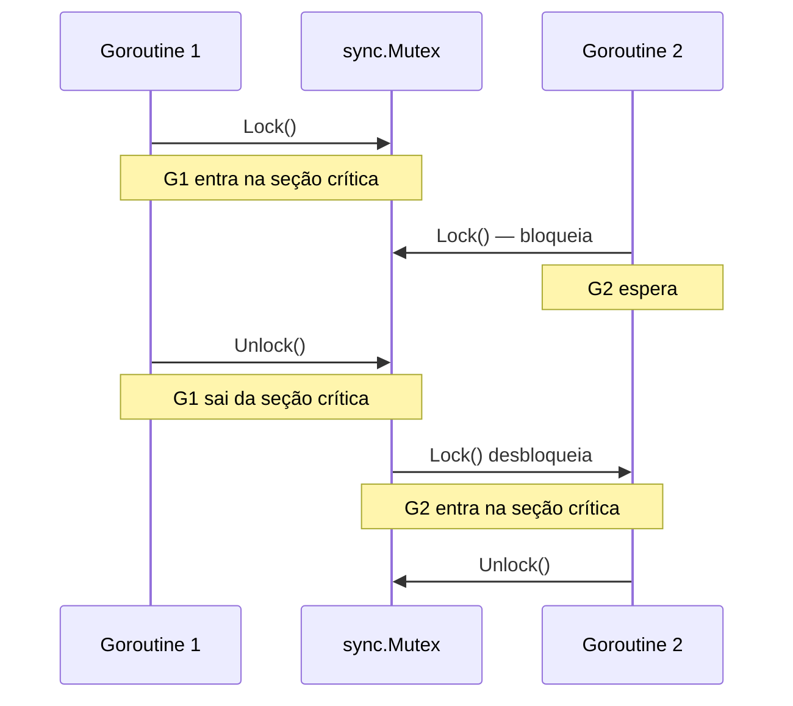
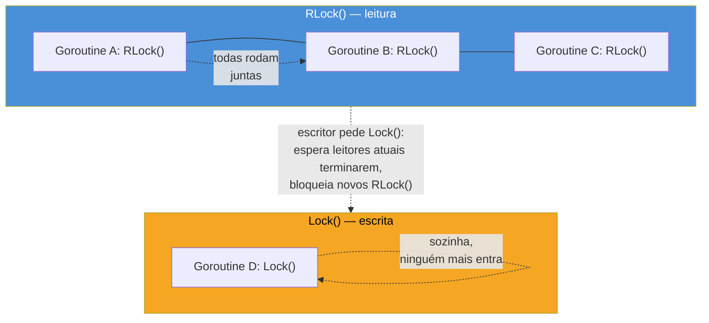

# Mutex e RWMutex

> [!abstract] TL;DR
> `sync.Mutex` protege uma **seção crítica** — um trecho de código que mexe em memória compartilhada — garantindo que só uma goroutine execute ali por vez: `mu.Lock()` antes, `mu.Unlock()` depois, quase sempre com `defer mu.Unlock()` logo após o `Lock()`. `sync.RWMutex` relaxa essa exclusão para o caso comum de "muita leitura, pouca escrita": `RLock()`/`RUnlock()` permitem **múltiplos leitores simultâneos**, enquanto `Lock()`/`Unlock()` continuam exigindo exclusão total para escrita. O caso de uso canônico dos dois é o mesmo: proteger um `map` compartilhado, que em Go não é seguro para concorrência — ler e escrever nele de goroutines diferentes sem sincronização é *race condition*, e o runtime pode até detectar e crashar em `fatal error: concurrent map read and map write`. Mutex não é exclusividade de Go — é o mesmo `synchronized`/`Lock` de sempre — mas em Go ele é um valor comum, embutido por composição, sem sintaxe de linguagem dedicada.

## O problema: dois leitores, uma gaveta, sem combinado

Imagine uma gaveta de escritório com uma única lista de tarefas dentro. Duas pessoas trabalham na mesma sala. Ambas decidem, ao mesmo tempo, "vou anotar uma tarefa nova": abrem a gaveta, pegam a lista, escrevem, devolvem. Se as duas abrirem a gaveta ao mesmo tempo, uma escrita pode sobrescrever a outra — a tarefa de uma delas simplesmente some, sem erro, sem aviso.

É exatamente isso que acontece quando duas goroutines mexem no mesmo `map` Go ao mesmo tempo:

```go
contadores := make(map[string]int)

// goroutine 1
contadores["cliques"]++

// goroutine 2, ao mesmo tempo
contadores["cliques"]++
```

`map` em Go não tem trava interna nenhuma — é uma estrutura de dados comum, tão insegura para acesso concorrente quanto um `int` comum. Se as duas goroutines rodarem essa linha "ao mesmo tempo" (sem nenhuma ordenação garantida entre elas), o resultado pode ser incremento perdido — ou, pior, o runtime do Go detecta a colisão de leitura/escrita simultânea no mapa e derruba o processo inteiro com `fatal error: concurrent map read and map write`, que **não é recuperável com `recover()`** — é um crash de runtime, não um panic comum.

A solução clássica, presente em praticamente toda linguagem com threads — Java tem `synchronized`, Python tem `threading.Lock`, C tem `pthread_mutex_t` — é dar à gaveta uma **fechadura**: só quem está de posse da chave pode abrir. Em Go, essa fechadura é o tipo `sync.Mutex`.

## Anatomia do Mutex



`sync.Mutex` é um struct comum, do pacote `sync`, com dois métodos que importam para este capítulo: `Lock()` e `Unlock()`. A regra é simples de enunciar e fácil de esquecer sob pressão:

- `Lock()` — pede a posse exclusiva do mutex. Se nenhuma outra goroutine estiver de posse, `Lock()` retorna imediatamente e a goroutine chamadora "tem a chave". Se outra goroutine já estiver de posse, `Lock()` **bloqueia** — a goroutine chamadora fica parada ali até a chave ser liberada.
- `Unlock()` — libera a chave. A partir daí, uma das goroutines que estava bloqueada em `Lock()` (não há garantia de qual, nem de ordem) pode prosseguir.

O trecho de código entre `Lock()` e `Unlock()` é a **seção crítica** — o código que mexe em estado compartilhado e por isso precisa de exclusão mútua (daí o nome *mutex*, contração de *mutual exclusion*). Proteger um `map` compartilhado, incrementar um contador, ler-e-escrever um campo de struct que várias goroutines tocam: tudo isso é seção crítica.

```go
type ContadorSeguro struct {
    mu    sync.Mutex
    valor int
}

func (c *ContadorSeguro) Incrementa() {
    c.mu.Lock()
    c.valor++
    c.mu.Unlock()
}
```

Repare que o `Mutex` vive **dentro** do struct que ele protege, como mais um campo — não é uma classe wrapper externa nem um decorator. É a forma idiomática em Go: o mutex mora ao lado dos dados que guarda, e a convenção (não imposta pelo compilador, mas seguida à risca) é declará-lo **logo acima dos campos que ele protege**, para deixar explícito, na leitura do struct, o que está sob proteção.

> [!question]- Por que `ContadorSeguro` tem receiver ponteiro (`*ContadorSeguro`)?
> Porque `sync.Mutex` **não pode ser copiado** depois de usado — copiar um mutex com estado (travado ou não) duplica esse estado de forma inconsistente, e o `go vet` (embutido no `go build`/`go test`) já sinaliza isso como erro: `copylocks`. Se `Incrementa` tivesse *value receiver*, cada chamada operaria sobre uma **cópia** do struct, com uma cópia do mutex — a exclusão mútua deixaria de valer, silenciosamente. Qualquer struct que embuta um `sync.Mutex` (ou `sync.RWMutex`, `sync.WaitGroup` etc.) deve sempre ser usado por ponteiro a partir do primeiro uso. Isso conecta direto com a [[04 - Value vs pointer receiver|nota 04 do Galho 2]]: aqui não é escolha de estilo, é regra rígida do pacote `sync`.

## `defer mu.Unlock()`: destravar mesmo se algo der errado

O exemplo anterior usou `Unlock()` explícito no fim da função — funciona, mas é frágil. Se a função crescer e ganhar um `return` antecipado, ou um `panic`, no meio da seção crítica, o `Unlock()` no fim nunca é alcançado: o mutex fica travado para sempre, e qualquer outra goroutine que tente `Lock()` bloqueia eternamente — um *deadlock* silencioso.

A prática idiomática em Go é travar e, na linha seguinte, já agendar o destravamento com `defer`:

```go
func (c *ContadorSeguro) Incrementa() {
    c.mu.Lock()
    defer c.mu.Unlock()

    c.valor++
}
```

`defer` garante que `Unlock()` roda quando a função retorna — não importa se o retorno foi normal, por `return` antecipado, ou por `panic` se propagando. `Lock()` seguido imediatamente de `defer Unlock()` é um dos padrões mais repetidos em código Go concorrente; ver as duas linhas juntas, sempre nessa ordem, é praticamente uma assinatura visual de "aqui começa uma seção crítica".

> [!warning] `defer Unlock()` custa uma fração de nanossegundo a mais que `Unlock()` direto
> A diferença é irrelevante na esmagadora maioria do código — mas em loops muito quentes (milhões de iterações por segundo, em código de infraestrutura de baixíssima latência), o overhead do `defer` pode aparecer em profiling. Nesses casos raros, `Unlock()` explícito nos pontos de saída é uma otimização válida — mas é otimização prematura se aplicada por padrão. Comece com `defer`; meça antes de trocar.

## `RWMutex`: quando ler é mais comum que escrever

`sync.Mutex` trata toda operação como igualmente perigosa: mesmo duas goroutines que só querem **ler** o valor, sem alterar nada, são serializadas — uma espera a outra, mesmo que nenhuma das duas fosse causar problema nenhuma para a outra. Isso é desperdício em um padrão de acesso extremamente comum: um cache, uma configuração, um mapa de contadores que é lido o tempo todo e escrito raramente.

`sync.RWMutex` — *read-write mutex* — distingue os dois casos:



- `RLock()` / `RUnlock()` — trava de **leitura**. Múltiplas goroutines podem ter um `RLock()` ativo ao mesmo tempo, desde que nenhuma escrita esteja em andamento (nem pendente — ver a nota sobre starvation abaixo).
- `Lock()` / `Unlock()` — trava de **escrita**, exatamente como no `Mutex` comum: exclusiva, ninguém mais (nem leitor, nem escritor) entra enquanto ela está ativa.

```go
type Cache struct {
    mu    sync.RWMutex
    dados map[string]string
}

func (c *Cache) Get(chave string) (string, bool) {
    c.mu.RLock()
    defer c.mu.RUnlock()

    valor, ok := c.dados[chave]
    return valor, ok
}

func (c *Cache) Set(chave, valor string) {
    c.mu.Lock()
    defer c.mu.Unlock()

    c.dados[chave] = valor
}
```

`Get` usa `RLock` — várias goroutines podem chamar `Get` ao mesmo tempo sem se bloquear mutuamente. `Set` usa `Lock` — enquanto uma escrita acontece, nenhum `Get` nem outro `Set` consegue prosseguir. Isso é o `RWMutex` cumprindo exatamente a promessa: paralelismo total entre leitores, exclusão total quando há escrita.

> [!warning] `RWMutex` não é sempre mais rápido que `Mutex`
> `RWMutex` tem overhead de contabilidade maior que `Mutex` simples — ele precisa rastrear quantos leitores estão ativos. Se a carga de trabalho tem escrita frequente (perto de 50/50 com leitura, ou mais escrita que leitura), `RWMutex` pode ser **mais lento** que `Mutex` puro, porque o custo extra de gerência não compensa um paralelismo de leitura que raramente acontece. A regra prática: use `RWMutex` quando leitura é claramente dominante (ordens de grandeza mais leituras que escritas) — não por padrão. Na dúvida, comece com `Mutex` simples e só troque para `RWMutex` se o profiling mostrar contenção de leitura.

## Caso prático completo: protegendo um map compartilhado

Juntando os dois mecanismos num exemplo só, um contador de visitas por página, acessado por várias goroutines simulando requisições concorrentes:

```go
package main

import (
    "fmt"
    "sync"
)

type ContadorDeVisitas struct {
    mu       sync.RWMutex
    visitas  map[string]int
}

func NovoContadorDeVisitas() *ContadorDeVisitas {
    return &ContadorDeVisitas{
        visitas: make(map[string]int),
    }
}

func (c *ContadorDeVisitas) Registra(pagina string) {
    c.mu.Lock()
    defer c.mu.Unlock()

    c.visitas[pagina]++
}

func (c *ContadorDeVisitas) Total(pagina string) int {
    c.mu.RLock()
    defer c.mu.RUnlock()

    return c.visitas[pagina]
}

func main() {
    c := NovoContadorDeVisitas()

    var wg sync.WaitGroup
    paginas := []string{"/home", "/sobre", "/home", "/contato", "/home"}

    for _, p := range paginas {
        wg.Add(1)
        go func(pagina string) {
            defer wg.Done()
            c.Registra(pagina)
        }(p)
    }

    wg.Wait()

    fmt.Println("/home:", c.Total("/home")) // 3
}
```

> [!info] `sync.WaitGroup` aparece só como coadjuvante aqui
> Este exemplo usa `sync.WaitGroup` (`wg.Add`/`wg.Done`/`wg.Wait`) apenas para esperar as goroutines terminarem antes de ler o resultado em `main` — sem isso, `main` poderia ler `c.Total` antes de todas as goroutines registrarem suas visitas. `WaitGroup` é assunto completo da [[03 - WaitGroup e Once|próxima nota]]; aqui ele só sustenta o exemplo.

Sem o `sync.RWMutex` (ou `sync.Mutex`) protegendo `visitas`, esse mesmo código roda 5 goroutines escrevendo no mesmo `map` sem coordenação nenhuma — e tem chance real de crashar com `fatal error: concurrent map read and map write`, ou de simplesmente perder incrementos silenciosamente. O `go run -race` (o *race detector*, assunto da [[05 - O race detector|nota 05]]) pega esse tipo de bug de forma determinística, mesmo quando ele não crasha por sorte.

## Armadilhas comuns

> [!warning] Esquecer o `Unlock()` — deadlock silencioso
> Se `Lock()` roda mas `Unlock()` nunca é alcançado (`return` antecipado antes do `Unlock()`, `panic` não tratado), o mutex fica travado para sempre. Qualquer goroutine futura que chame `Lock()` no mesmo mutex bloqueia indefinidamente, sem erro nenhum no console — o programa simplesmente para de progredir naquele ponto. `defer mu.Unlock()` logo após `Lock()` elimina essa classe de bug quase por completo.

> [!warning] `Lock()` duplo na mesma goroutine — deadlock imediato
> `sync.Mutex` em Go **não é reentrante** (diferente de `synchronized` em Java, que permite a mesma thread readquirir a trava que ela mesma já tem). Se uma goroutine chama `Lock()` e, dentro da seção crítica, chama outra função que também tenta `Lock()` no mesmo mutex, ela trava esperando a si mesma — deadlock garantido, sem exceção nem timeout. A saída é sempre reestruturar: extrair uma versão "interna" da função que assume o lock já adquirido, e só chamar `Lock()`/`Unlock()` na função pública.

> [!warning] Copiar um struct que contém `Mutex`
> Passar `ContadorSeguro` por valor (em vez de ponteiro) para uma função, ou atribuí-lo a outra variável, copia o `sync.Mutex` embutido — e o `go vet` sinaliza isso (`copylocks`). Sempre use ponteiro a partir do momento em que o struct tem um mutex como campo; isso vale para qualquer tipo do pacote `sync` (`Mutex`, `RWMutex`, `WaitGroup`, `Once`).

> [!warning] `RLock()` não impede um segundo `RLock()` de virar deadlock em recursão
> Chamar `RLock()` e, dentro da seção de leitura, chamar de novo `RLock()` no mesmo `RWMutex` (por exemplo, uma função de leitura que chama outra função de leitura do mesmo tipo) pode parecer inofensivo — "são dois leitores, não deveriam poder coexistir?" — mas se **outro escritor estiver esperando** entre as duas chamadas de `RLock()`, o Go prioriza esse escritor pendente para evitar *starvation* (leitores infinitos impedindo escrita para sempre), e o segundo `RLock()` da mesma goroutine bloqueia esperando o escritor, que por sua vez espera o primeiro `RLock()` (da mesma goroutine) liberar. Resultado: deadlock. A regra prática: nunca chame `RLock()`/`Lock()` recursivamente na mesma goroutine, mesmo que pareça seguro à primeira vista.

## Vindo de outra linguagem

| Origem | Em Go |
|---|---|
| Java `synchronized` (bloco ou método) | `sync.Mutex` explícito — sem sintaxe de linguagem, é um valor comum com `Lock()`/`Unlock()` |
| Java `ReentrantReadWriteLock` | `sync.RWMutex` — mesma ideia, mas **não reentrante** |
| Python `threading.Lock()` / `with lock:` | `sync.Mutex` + `defer mu.Unlock()` cumpre o mesmo papel do `with` (garantir liberação) |
| Node.js/JS single-threaded (raramente precisa de lock) | Go tem paralelismo real de goroutines em múltiplos cores — `Mutex` é necessidade genuína, não formalidade |
| C `pthread_mutex_t` | `sync.Mutex` é conceitualmente igual, mas sem `pthread_mutex_init`/`destroy` — o zero value já é um mutex destravado e pronto para uso |

O detalhe mais importante para quem chega de Java ou Python: em Go, não existe uma trava "automática" amarrada a um objeto (como o `this` implícito de `synchronized`) — o mutex é sempre um campo explícito, visível na declaração do struct, e a disciplina de `Lock`/`Unlock` é 100% manual (com `defer` como rede de segurança, não como garantia embutida na linguagem).

## Como explicar em inglês

> `sync.Mutex` protects a **critical section** — code that touches shared memory — by letting only one goroutine hold the lock at a time: call `Lock()` before, `Unlock()` after, almost always paired with `defer mu.Unlock()` right after acquiring the lock, so the lock releases even on an early return or panic. `sync.RWMutex` relaxes this for read-heavy workloads: `RLock()`/`RUnlock()` let multiple readers proceed concurrently, while `Lock()`/`Unlock()` still require full exclusivity for writers. The textbook use case for both is a shared `map` — Go's built-in map type has no internal locking, so concurrent reads and writes from different goroutines are a data race, and the runtime may crash outright with `fatal error: concurrent map read and map write`. One hard rule trips up newcomers from Java: Go's `Mutex` is **not reentrant** — a goroutine that calls `Lock()` twice, even indirectly through a nested function call, deadlocks against itself.

| Termo PT | Termo EN |
|---|---|
| seção crítica | critical section |
| trava / cadeado | lock |
| exclusão mútua | mutual exclusion |
| leitor / escritor | reader / writer |
| condição de corrida | race condition |
| inanição (de leitor/escritor) | starvation |
| impasse | deadlock |
| reentrante | reentrant |

## O que vem a seguir

`Mutex` e `RWMutex` resolvem "proteger dados compartilhados", mas deixam em aberto um problema vizinho e igualmente comum: como uma goroutine **espera** um grupo de outras terminarem, sem compartilhar memória nenhuma — só sincronizar no tempo? É o papel de `sync.WaitGroup`, que já apareceu de relance no exemplo desta nota, e de `sync.Once`, para inicialização que deve rodar exatamente uma vez mesmo sob concorrência. A [[03 - WaitGroup e Once|próxima nota]] cobre os dois.

## Veja também

- [[01 - Quando channels não bastam — o pacote sync|01 — Quando channels não bastam — o pacote sync]] — por que este galho existe ao lado de channels
- [[03 - WaitGroup e Once|03 — WaitGroup e Once]] — próxima nota do galho
- [[05 - O race detector|05 — O race detector]] — a ferramenta que pega, de forma determinística, os bugs que este capítulo descreve
- [[03-Dominios/Tecnologia/Go/02 - Tipos, structs e métodos/04 - Value vs pointer receiver|Galho 2, nota 04]] — por que structs com mutex sempre usam receiver ponteiro
- [[03-Dominios/Tecnologia/Go/index|Trilha Go]]

## Fontes

- The Go Authors. *sync package documentation*. pkg.go.dev. https://pkg.go.dev/sync (acessado em 2026-07-18)
- The Go Authors. *sync package — Mutex*. pkg.go.dev. https://pkg.go.dev/sync#Mutex (acessado em 2026-07-18)
- The Go Authors. *sync package — RWMutex*. pkg.go.dev. https://pkg.go.dev/sync#RWMutex (acessado em 2026-07-18)
- The Go Authors. *Effective Go — Concurrency*. go.dev. https://go.dev/doc/effective_go#concurrency (acessado em 2026-07-18)
- Go by Example. *Mutexes*. gobyexample.com. https://gobyexample.com/mutexes (acessado em 2026-07-18)
- The Go Authors. *The Go Memory Model*. go.dev. https://go.dev/ref/mem (acessado em 2026-07-18)
