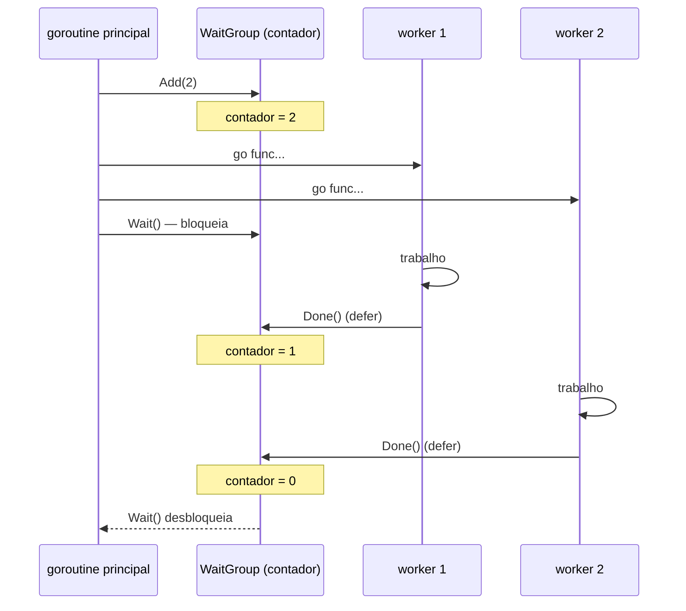
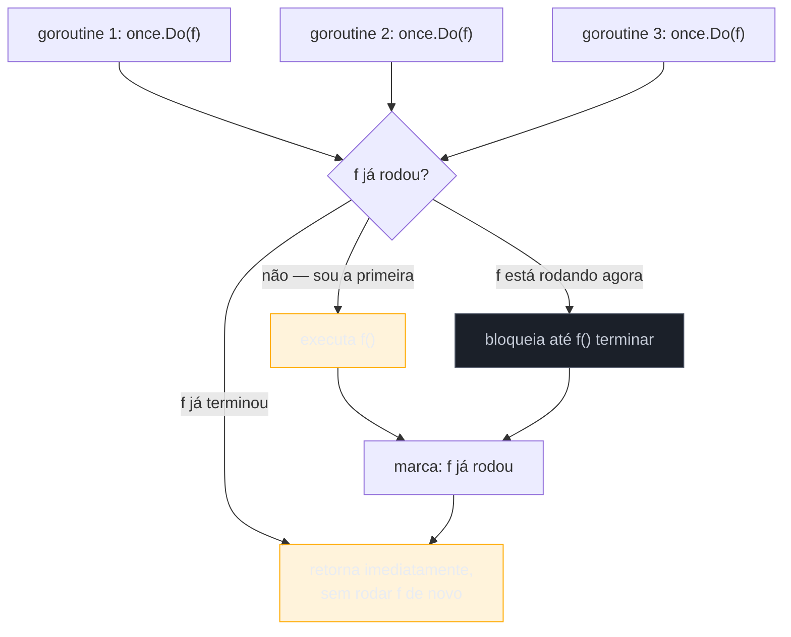

# WaitGroup e Once

> [!abstract] TL;DR
> `sync.WaitGroup` resolve um problema que `Mutex` não resolve: esperar que **N goroutines terminem**, sem saber de antemão quantas nem quando. O padrão é sempre o mesmo trio — `Add(n)` antes de disparar, `Done()` (via `defer`) dentro de cada goroutine, `Wait()` no ponto que precisa bloquear até o fim. `sync.Once` resolve um problema vizinho, mas diferente: garantir que um bloco de inicialização rode **exatamente uma vez**, mesmo com dezenas de goroutines tentando executá-lo ao mesmo tempo — `once.Do(f)` executa `f` só na primeira chamada vencedora e bloqueia as demais até `f` terminar. Os dois tipos são zero-value-ready (nada de construtor), leves, e cobrem os dois padrões de coordenação mais comuns do dia a dia Go: "espere todo mundo acabar" e "faça isso só uma vez".

## O problema que o Mutex não resolve

A nota anterior deste galho resolveu exclusão mútua: várias goroutines disputando o mesmo dado, `Mutex` garantindo que só uma mexa por vez. Mas existe um problema de coordenação completamente diferente, que aparece o tempo todo em código real: você dispara um número de goroutines — digamos, uma por arquivo de um lote, ou uma por requisição a um serviço externo — e precisa saber quando **todas** terminaram, antes de seguir em frente.

Um `Mutex` não ajuda aqui. Trancar e destrancar um lock não tem noção de "quantas goroutines ainda faltam" — ele só sabe "alguém está dentro da seção crítica agora ou não". O problema de "espere N tarefas concorrentes acabarem" pede um contador que várias goroutines incrementam e decrementam com segurança, e um jeito de bloquear até esse contador chegar a zero.

Dá pra simular isso com um channel — um `done := make(chan struct{})` por goroutine, e um laço recebendo de cada um — e é exatamente assim que muita gente resolve o problema antes de conhecer `sync.WaitGroup`. Funciona, mas empurra pra você a responsabilidade de gerenciar N channels manualmente. `sync.WaitGroup` empacota esse padrão inteiro atrás de três métodos.

## O trio Add / Done / Wait

```go
var wg sync.WaitGroup

for i := 0; i < 5; i++ {
    wg.Add(1)
    go func(id int) {
        defer wg.Done()
        fmt.Println("worker", id, "rodando")
    }(i)
}

wg.Wait()
fmt.Println("todos os workers terminaram")
```

Três operações, sempre nesta forma:

- **`Add(n)`** — soma `n` a um contador interno. Chamado **antes** de disparar a goroutine correspondente, nunca de dentro dela — mais sobre isso na seção de armadilhas.
- **`Done()`** — equivalente a `Add(-1)`. Chamado dentro da goroutine, tipicamente com `defer` logo na primeira linha, garantindo que rode mesmo se o corpo da goroutine sofrer panic.
- **`Wait()`** — bloqueia a goroutine chamadora até o contador voltar a zero. Pode ser chamado de qualquer goroutine, inclusive a que disparou as outras — é o `wg.Wait()` na goroutine principal que segura `main` até os cinco workers terminarem, no exemplo acima.



O contador nunca pode ficar negativo — se `Done()` é chamado mais vezes do que `Add()` somou, `WaitGroup` entra em panic com `sync: negative WaitGroup counter`. É uma proteção deliberada: um contador negativo indicaria um bug de contabilidade que, silenciosamente, faria `Wait()` destravar antes da hora.

> [!question]- Por que `WaitGroup` não guarda os resultados das goroutines, só o "terminou ou não"?
> Porque não é o trabalho dela. `WaitGroup` é puramente um contador de sincronização — não tem noção de "resultado", "erro" ou "valor de retorno" de goroutine nenhuma. Se você precisa coletar N resultados, o padrão idiomático combina `WaitGroup` com um channel bufferizado (cada worker manda seu resultado pro channel antes de `Done()`) ou, mais raro, variáveis compartilhadas protegidas por `Mutex`. `errgroup.Group` (pacote `golang.org/x/sync/errgroup`, fora da stdlib) é a evolução natural quando você também precisa propagar o **primeiro erro** de um grupo de goroutines — combina o papel de `WaitGroup` com cancelamento via `context` (nota 06 deste galho), mas fica fora do escopo desta nota por não ser stdlib.

## Zero value pronto para uso

`sync.WaitGroup{}` — ou simplesmente `var wg sync.WaitGroup` — já nasce utilizável, sem `New()` nem inicialização explícita. É a mesma filosofia de `sync.Mutex`: o valor zero de Go tem significado útil por padrão (contador em zero, nenhuma goroutine pendente), então a stdlib evita forçar um construtor onde o zero value já resolve.

```go
type Coletor struct {
    wg sync.WaitGroup
    // outros campos...
}

func (c *Coletor) Processar(itens []string) {
    for _, item := range itens {
        c.wg.Add(1)
        go func(it string) {
            defer c.wg.Done()
            processar(it)
        }(item)
    }
    c.wg.Wait()
}
```

Embutir um `sync.WaitGroup` como campo de struct — sem ponteiro, sem inicialização no construtor — é padrão comum exatamente por causa do zero value. A única regra que acompanha esse padrão, igual ao `Mutex`, é: nunca copiar um valor que contém `WaitGroup` depois do primeiro uso (mais na seção de armadilhas).

## sync.Once: init único sob concorrência

`sync.WaitGroup` resolve "espere todos". `sync.Once` resolve um problema vizinho: garantir que uma função rode **exatamente uma vez**, mesmo chamada por goroutines diferentes ao mesmo tempo, sem duplicar trabalho nem correr risco de duas goroutines inicializando o mesmo recurso em paralelo.

```go
var (
    config     *Config
    configOnce sync.Once
)

func GetConfig() *Config {
    configOnce.Do(func() {
        fmt.Println("carregando config — só uma vez")
        config = carregarConfigDoDisco()
    })
    return config
}
```

Chame `GetConfig()` de cem goroutines simultâneas: só a primeira chamada a `configOnce.Do` de fato executa a função passada; as noventa e nove restantes **bloqueiam** até essa primeira execução terminar, e então retornam sem rodar a função de novo. Depois que a primeira execução termina, qualquer chamada futura a `Do` — mesmo anos de execução do programa depois — retorna na hora, sem tentar rodar a função outra vez.



O caso de uso canônico é inicialização preguiçosa (*lazy init*) de um recurso caro e compartilhado — uma conexão de banco, um cliente HTTP configurado, uma tabela de lookup calculada uma vez — em código que pode ser chamado concorrentemente antes de qualquer garantia de que a inicialização já rodou.

> [!info] `sync.OnceFunc`, `sync.OnceValue` e `sync.OnceValues` (Go 1.21+)
> A partir do Go 1.21, a stdlib oferece três funções genéricas que empacotam o padrão `Once.Do` em uma forma mais direta, sem precisar declarar a variável `Once` à parte: `sync.OnceFunc(f func()) func()` devolve uma função que roda `f` só na primeira chamada; `sync.OnceValue[T](f func() T) func() T` faz o mesmo mas memoiza e devolve um valor; `sync.OnceValues[T1, T2]` faz o mesmo com dois valores de retorno (útil para `(valor, erro)`). O exemplo de `GetConfig` acima poderia virar `var GetConfig = sync.OnceValue(carregarConfigDoDisco)` — mais compacto, sem variável `Once` separada. As duas formas coexistem na stdlib atual; `Once.Do` continua sendo a peça fundamental por baixo de todas as três.

## Casos práticos

**1. Fan-out de trabalho com coleta de resultados via channel**, combinando `WaitGroup` (esperar todos) com um channel bufferizado (coletar resultado de cada um):

```go
package main

import (
	"fmt"
	"sync"
)

func baixar(url string) string {
	return fmt.Sprintf("conteúdo de %s", url)
}

func main() {
	urls := []string{
		"https://exemplo.com/a",
		"https://exemplo.com/b",
		"https://exemplo.com/c",
	}

	resultados := make(chan string, len(urls))
	var wg sync.WaitGroup

	for _, url := range urls {
		wg.Add(1)
		go func(u string) {
			defer wg.Done()
			resultados <- baixar(u)
		}(url)
	}

	// goroutine separada fecha o channel assim que todos terminam,
	// permitindo o `range` abaixo terminar sozinho em vez de travar
	go func() {
		wg.Wait()
		close(resultados)
	}()

	for r := range resultados {
		fmt.Println(r)
	}
}
```

> [!info] Loop variable per-iteration desde Go 1.22
> Este código captura `url` via parâmetro (`func(u string) {...}(url)`), que sempre foi a forma segura em qualquer versão de Go. A partir do Go 1.22, a variável de laço (`for _, url := range urls`) passa a ser recriada a cada iteração — então `go func() { resultados <- baixar(url) }()` sem parâmetro também ficaria seguro em código compilado com `go 1.22` ou superior no `go.mod`. Vale continuar usando o parâmetro explícito em código que precisa compilar contra versões mais antigas, ou quando a clareza de "isto está sendo capturado de propósito" importa mais que economizar um argumento.

**2. `sync.Once` protegendo inicialização de um singleton compartilhado**:

```go
package main

import (
	"fmt"
	"sync"
)

type Cliente struct {
	baseURL string
}

var (
	clienteCompartilhado *Cliente
	clienteOnce          sync.Once
)

func ObterCliente() *Cliente {
	clienteOnce.Do(func() {
		fmt.Println("inicializando cliente HTTP...")
		clienteCompartilhado = &Cliente{baseURL: "https://api.exemplo.com"}
	})
	return clienteCompartilhado
}

func main() {
	var wg sync.WaitGroup
	for i := 0; i < 5; i++ {
		wg.Add(1)
		go func(id int) {
			defer wg.Done()
			c := ObterCliente()
			fmt.Println("goroutine", id, "usa cliente com baseURL", c.baseURL)
		}(i)
	}
	wg.Wait()
	// "inicializando cliente HTTP..." aparece só uma vez, não cinco
}
```

**3. `WaitGroup` embutido em struct, coordenando um pool de workers com trabalho de tamanho conhecido**:

```go
package main

import (
	"fmt"
	"sync"
)

type Processador struct {
	wg sync.WaitGroup
}

func (p *Processador) ProcessarLote(itens []int) []int {
	resultado := make([]int, len(itens))

	for i, item := range itens {
		p.wg.Add(1)
		go func(idx, val int) {
			defer p.wg.Done()
			resultado[idx] = val * val // cada goroutine escreve em índice próprio — sem disputa
		}(i, item)
	}

	p.wg.Wait()
	return resultado
}

func main() {
	p := &Processador{}
	fmt.Println(p.ProcessarLote([]int{1, 2, 3, 4, 5})) // [1 4 9 16 25]
}
```

Repare que, no caso 3, não há `Mutex` nenhum — cada goroutine escreve num índice **próprio** e exclusivo de `resultado`, então não existe seção crítica compartilhada. `WaitGroup` só coordena "espere todo mundo escrever seu índice antes de eu ler o slice inteiro"; a ausência de disputa entre índices distintos é o que dispensa `Mutex` aqui — se duas goroutines escrevessem no mesmo índice, a história seria outra.

## Armadilhas comuns

> [!warning] `Add()` depois de disparar a goroutine é uma corrida
> `Add(1)` **precisa** acontecer antes do `go func() {...}()` correspondente, na goroutine que dispara — nunca dentro da goroutine nova. Se `Add` roda dentro da goroutine (`go func() { wg.Add(1); ...; wg.Done() }()`), existe uma janela de corrida real: `Wait()`, chamado logo depois do laço de disparo, pode observar o contador ainda em zero — porque a goroutine nova nem chegou a rodar seu `Add(1)` — e destravar cedo demais, antes de qualquer goroutine ter de fato começado.

> [!warning] Copiar um `WaitGroup` depois do primeiro uso quebra a contagem
> `sync.WaitGroup` contém estado interno que não pode ser copiado com segurança depois de usado — igual ao `Mutex` da nota anterior. Passar um `WaitGroup` por valor para uma função, ou copiar uma struct que o contém, cria uma segunda cópia do contador desincronizada da primeira. `go vet` pega isso (`WaitGroup passed by value`) na maioria dos casos óbvios. Regra prática: sempre passe `*sync.WaitGroup`, nunca `sync.WaitGroup`, como parâmetro.

> [!warning] `Done()` sem `defer` não sobrevive a panic
> Se o corpo da goroutine sofre panic antes de chegar na linha com `wg.Done()`, e `Done()` não estava em `defer`, o contador nunca decrementa — e `Wait()` trava para sempre, esperando um `Done()` que nunca vem. Colocar `defer wg.Done()` como primeira linha da goroutine garante que ela roda mesmo em caminho de panic (embora o panic em si ainda derrube o programa se não houver `recover` — assunto do galho de erros).

> [!warning] `once.Do` reentrante trava
> Se a função passada para `once.Do` chama `once.Do` de novo, no mesmo `Once`, o programa **deadlocka** — a segunda chamada bloqueia esperando a primeira terminar, mas a primeira está esperando a segunda retornar. `sync.Once` não detecta nem previne esse caso; ele só existe se o próprio código de inicialização, direta ou indiretamente, reentra no mesmo `Once`.

## Vindo de outra linguagem

| Vindo de... | Em Go |
|---|---|
| Java `CountDownLatch` | `WaitGroup` cobre o mesmo caso de uso ("espere N eventos"), mas com uma API menor: `Add`/`Done`/`Wait` em vez de `new CountDownLatch(n)` + `countDown()` + `await()`. `WaitGroup` também permite `Add` incremental (somar mais trabalho depois), o que `CountDownLatch` não permite — o contador dele é fixo na criação. |
| Java `ExecutorService.invokeAll` / Kotlin `awaitAll` | Não há equivalente direto de "pool gerenciado" na stdlib — `WaitGroup` + goroutines soltas assume o papel, com o dev controlando manualmente o disparo. |
| Python `threading.Event` usado como barreira | Mais próximo de `WaitGroup` do que parece à primeira vista, mas `Event` sinaliza um booleano (setado/não setado), enquanto `WaitGroup` conta — o paralelo mais direto de Python é combinar `threading.Barrier` (esperar N threads) com o padrão. |
| Java/Kotlin `class Singleton { static { ... } }` (static initializer) ou double-checked locking | `sync.Once` é exatamente esse padrão, mas explícito e sem a complexidade histórica do double-checked locking em Java pré-`volatile` correto. Não há equivalente de "static block roda uma vez por classe" automático em Go — `Once` precisa ser declarado e chamado deliberadamente. |
| Python `functools.lru_cache` sobre função sem argumento | Comportamento parecido ao de `sync.OnceValue` (Go 1.21+) — memoiza o resultado de uma chamada sem parâmetro — mas `lru_cache` não é, por padrão, thread-safe sob o GIL de forma explícita documentada para todo caso; `Once`/`OnceValue` são desenhados desde o início para concorrência real. |

## Como explicar em inglês

> `sync.WaitGroup` coordinates "wait for N goroutines to finish": call `Add(n)` before launching, `Done()` (usually deferred) inside each goroutine, and `Wait()` wherever you need to block until the counter reaches zero. It's a lighter-weight, more flexible cousin of Java's `CountDownLatch` — no fixed count at creation, and `Add` can be called incrementally. `sync.Once` solves a different problem: running an initializer exactly once under concurrent access. `once.Do(f)` runs `f` only on the first winning call and blocks every other concurrent caller until that first call returns — the same intent as a Java static initializer or double-checked locking, but explicit and race-free by construction. Since Go 1.21, `sync.OnceFunc`, `sync.OnceValue`, and `sync.OnceValues` wrap the same pattern into a single function value, useful for lazy-initializing a package-level singleton without a separate `Once` variable. Both types are zero-value-ready — no constructor needed — but neither is safe to copy after first use; always pass a pointer.

| Termo PT | Termo EN |
|---|---|
| contador de espera | wait counter |
| disparar goroutine | launch a goroutine |
| inicialização preguiçosa | lazy initialization |
| execução única | single execution / run-once |
| corrida (de dados/lógica) | race |
| travar para sempre | deadlock / hang forever |
| chamada reentrante | reentrant call |
| valor zero pronto para uso | zero-value-ready |

## O que vem a seguir

`WaitGroup` e `Once` coordenam **conclusão** — esperar o fim de um grupo de goroutines, ou garantir que algo rode uma vez. Mas nenhum dos dois ajuda quando o que se precisa é atualizar um contador simples, um flag booleano, ou um ponteiro compartilhado entre goroutines **sem** pagar o custo de um `Mutex` inteiro. A [[04 - atomic e sync-atomic|nota 04]] entra no pacote `sync/atomic`: operações indivisíveis de baixo nível — `Add`, `Load`, `Store`, `CompareAndSwap` — para os casos em que um `Mutex` seria overkill para proteger uma única variável.

## Veja também

- [[01 - Quando channels não bastam — o pacote sync|01 — Quando channels não bastam — o pacote sync]] — panorama do pacote `sync` e quando preferi-lo a channels
- [[02 - Mutex e RWMutex|02 — Mutex e RWMutex]] — exclusão mútua, o problema complementar ao de coordenação de conclusão resolvido aqui
- [[04 - atomic e sync-atomic|04 — atomic e sync/atomic]] — próxima nota do galho
- [[06 - context.Context — deadline, cancel, values|06 — context.Context]] — mecanismo de cancelamento que combina com `WaitGroup` em pipelines mais complexos
- [[03-Dominios/Tecnologia/Go/index|Trilha Go]]

## Fontes

- The Go Authors. *Package sync — WaitGroup*. pkg.go.dev. https://pkg.go.dev/sync#WaitGroup (acessado em 2026-07-18)
- The Go Authors. *Package sync — Once*. pkg.go.dev. https://pkg.go.dev/sync#Once (acessado em 2026-07-18)
- The Go Authors. *Package sync — OnceFunc, OnceValue, OnceValues*. pkg.go.dev. https://pkg.go.dev/sync#OnceFunc (acessado em 2026-07-18)
- Go by Example. *WaitGroups*. gobyexample.com. https://gobyexample.com/waitgroups (acessado em 2026-07-18)
- The Go Authors. *Go 1.22 Release Notes — Loop variables per iteration*. go.dev. https://go.dev/doc/go1.22#language (acessado em 2026-07-18)
- The Go Authors. *Go 1.21 Release Notes — sync package*. go.dev. https://go.dev/doc/go1.21#sync (acessado em 2026-07-18)
