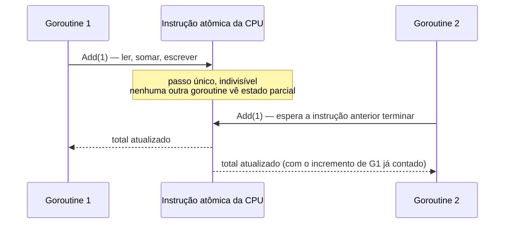
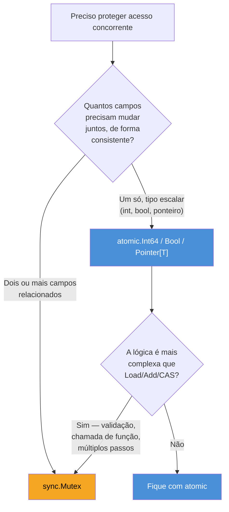

# atomic e sync/atomic

> [!abstract] TL;DR
> `sync/atomic` oferece operações **lock-free** — `Add`, `Load`, `Store`, `CompareAndSwap` — que a CPU executa como instrução única e indivisível, sem passar por `Lock`/`Unlock`. Desde Go 1.19, o pacote ganhou tipos dedicados (`atomic.Int64`, `atomic.Bool`, `atomic.Value`, etc.) que embrulham essas operações em métodos, eliminando o antigo risco de usar `int64` cru com alinhamento de memória errado. Atomic vence mutex quando a seção crítica é **um único valor escalar** e a operação cabe numa instrução de CPU — um contador, uma flag, um ponteiro trocado atomicamente. No instante em que a lógica precisa coordenar **dois ou mais campos** de forma consistente, atomic para de servir e `sync.Mutex` volta a ser a ferramenta certa.

## O contador que trava sem travar

Imagine um contador de requisições compartilhado por cem goroutines, incrementado a cada request:

```go
type Contador struct {
    mu    sync.Mutex
    total int64
}

func (c *Contador) Inc() {
    c.mu.Lock()
    c.total++
    c.mu.Unlock()
}
```

Funciona, e a nota anterior já mostrou por quê: `total++` não é atômico — é ler, somar, escrever, três passos que duas goroutines podem intercalar e perder um incremento. O mutex resolve isso serializando o acesso.

Mas pare para olhar o tamanho do problema que o mutex está resolvendo aqui. A "seção crítica" inteira é uma soma de inteiro. Não há decisão condicional, não há dois campos que precisam mudar juntos, não há chamada de função dentro do lock. É o cenário mais simples possível — e ainda assim você paga o custo completo de um mutex: chamada de função, possível handoff pro scheduler se houver contenção, gerenciamento de fila de goroutines esperando.

A CPU moderna já resolve "somar um número sem race" na própria instrução de hardware — é a instrução `LOCK XADD` em x86, ou `LDADD`/`CAS` em ARM. O pacote `sync/atomic` é a porta de entrada do Go pra essas instruções:

```go
type Contador struct {
    total atomic.Int64
}

func (c *Contador) Inc() {
    c.total.Add(1)
}

func (c *Contador) Valor() int64 {
    return c.total.Load()
}
```

Sem `Lock`, sem `Unlock`, sem struct de mutex embutida. `Add(1)` é uma única chamada que o compilador traduz numa instrução atômica de CPU — a goroutine nunca bloqueia, nunca entra numa fila de espera do runtime. É concorrência resolvida no nível de hardware, não no nível de agendamento de goroutines.

## O que "atômico" quer dizer aqui

> [!question]- Atômico não é só "rápido"? Por que não usar sempre?
> "Atômico", no sentido técnico do termo (do grego *átomos*, indivisível), significa que a operação acontece como um único passo indivisível do ponto de vista de qualquer outra goroutine observando a memória — não existe um estado intermediário visível onde a soma "já começou mas não terminou". É uma garantia mais estreita que a de um mutex: o mutex protege **qualquer código** que você colocar entre `Lock` e `Unlock`; uma operação atômica protege **uma leitura-modificação-escrita específica de um valor escalar**, e nada além disso. É rápido justamente porque é estreito — não dá pra generalizar pra proteger dois campos relacionados sem reintroduzir a race entre eles.



A diferença central para um mutex: o mutex é implementado com uma fila de espera gerenciada pelo runtime do Go — uma goroutine bloqueada pode ser suspensa e o scheduler roda outra no lugar dela. Uma operação atômica não bloqueia no sentido de suspender a goroutine — na pior das hipóteses, ela espera alguns ciclos de CPU até a instrução anterior liberar o barramento de memória, o que é ordens de magnitude mais barato que um handoff de scheduler.

## Os tipos atômicos desde 1.19

> [!info] Tipos atômicos dedicados — Go 1.19
> Antes de 1.19, `sync/atomic` só oferecia funções soltas operando sobre ponteiros: `atomic.AddInt64(&total, 1)`, `atomic.LoadInt64(&total)`. Isso exigia que o campo `total int64` estivesse **alinhado corretamente em memória** — em arquiteturas 32 bits, um `int64` não alinhado a 8 bytes causava pânico em runtime ao usar essas funções, um bug clássico de código que colocava o campo atômico no meio de um struct sem cuidado com a ordem dos campos. Go 1.19 introduziu tipos wrapper — `atomic.Int32`, `atomic.Int64`, `atomic.Uint32`, `atomic.Uint64`, `atomic.Bool`, `atomic.Value`, `atomic.Pointer[T]` — que garantem o alinhamento internamente e expõem a operação como método, não como função que recebe ponteiro.

```go
var (
    total   atomic.Int64
    ativo   atomic.Bool
    versao  atomic.Value
    cliente atomic.Pointer[Cliente]
)

total.Store(0)
total.Add(10)
fmt.Println(total.Load()) // 10

ativo.Store(true)
fmt.Println(ativo.Load()) // true

cliente.Store(&Cliente{Nome: "Ana"})
c := cliente.Load() // *Cliente, ou nil se nunca setado
```

`atomic.Pointer[T]` merece nota à parte: é genérico (Go 1.18+) e substitui o antigo `atomic.Value` para o caso comum de "trocar um ponteiro inteiro atomicamente" — um padrão usado, por exemplo, para trocar uma configuração inteira em produção sem lock: uma goroutine monta a nova config, `Store` troca o ponteiro de uma vez, e todo leitor que faz `Load` sempre vê uma config completa e consistente, nunca um estado parcial de "metade da config antiga, metade da nova".

| Tipo | Zero value útil? | Operações principais |
|---|---|---|
| `atomic.Int64` / `atomic.Int32` | sim, começa em 0 | `Load`, `Store`, `Add`, `Swap`, `CompareAndSwap` |
| `atomic.Bool` | sim, começa em `false` | `Load`, `Store`, `Swap`, `CompareAndSwap` |
| `atomic.Pointer[T]` | sim, começa em `nil` | `Load`, `Store`, `Swap`, `CompareAndSwap` |
| `atomic.Value` | sim, mas primeiro `Store` fixa o tipo aceito | `Load`, `Store`, `Swap`, `CompareAndSwap` |

Todos os tipos são structs pequenas com um campo interno e nenhum método exportado além dos citados — copiar um valor `atomic.Int64` depois de usado é um erro (o `go vet` detecta), assim como acontece com `sync.Mutex`: ambos carregam estado que não pode ser duplicado.

## CompareAndSwap: a peça que sustenta o resto

`CompareAndSwap` (CAS) é a operação mais fundamental do pacote — as outras (`Add`, `Swap`) podem, em tese, ser construídas em cima dela. A ideia: "troque o valor por um novo, **mas só se** ele ainda for igual ao que eu esperava; me diga se a troca aconteceu."

```go
var versaoAtual atomic.Int64

func atualizarVersao(nova int64) bool {
    antiga := versaoAtual.Load()
    if nova <= antiga {
        return false // não regride versão
    }
    return versaoAtual.CompareAndSwap(antiga, nova)
}
```

Se `versaoAtual` mudou entre o `Load` e o `CompareAndSwap` — outra goroutine já atualizou antes — o CAS falha silenciosamente (retorna `false`) em vez de sobrescrever um valor mais novo com um mais velho baseado em informação obsoleta. É o mecanismo por trás de qualquer estrutura de dados "lock-free" de verdade: um laço de retry que tenta o CAS, e se falhar, relê o valor atual e tenta de novo:

```go
func incrementarComRetry(v *atomic.Int64) int64 {
    for {
        antigo := v.Load()
        novo := antigo + 1
        if v.CompareAndSwap(antigo, novo) {
            return novo
        }
        // outra goroutine mexeu no valor entre o Load e o CompareAndSwap — tenta de novo
    }
}
```

Esse padrão — ler, calcular, tentar trocar, repetir se falhar — é o que "lock-free" quer dizer na prática: nenhuma goroutine jamais *bloqueia* esperando outra liberar um lock; na pior hipótese, ela recalcula e tenta de novo. `Add(1)` já faz exatamente esse laço internamente pra você, o que é a razão de preferir sempre os métodos prontos (`Add`, `Swap`) a reimplementar CAS manualmente quando a operação é simples o bastante para caber neles.

## Quando atomic vence mutex — e quando perde



O critério prático não é "qual é mais rápido" isoladamente — atomic quase sempre ganha em benchmark puro de um único valor — mas **o que a seção crítica precisa proteger**:

- **Atomic serve** quando a invariante é sobre um valor só: um contador, uma flag `pronto bool`, um ponteiro pra configuração atual, um ID sequencial. `Add`, `Load`, `Store`, `CompareAndSwap` cobrem esses casos sem exigir mais raciocínio que "essa variável precisa ser lida/escrita sem race".
- **Mutex é obrigatório** quando a invariante liga dois ou mais campos: um saldo bancário e um histórico de transações que precisam mudar juntos; um mapa que precisa ser lido e escrito de forma consistente (para isso, aliás, existe `sync.Map`, especializado nesse caso — fora do escopo desta nota); qualquer struct onde "metade atualizada, metade não" corromperia a lógica.

> [!warning] Atomic em dois campos separados não resolve a race entre eles
> Trocar `mu.Lock(); x++; y++; mu.Unlock()` por `x.Add(1); y.Add(1)` (dois `atomic.Int64` separados) parece uma otimização óbvia — e introduz uma race sutil: entre o `Add` em `x` e o `Add` em `y`, outra goroutine pode ler um estado onde `x` já mudou mas `y` ainda não. Se `x` e `y` precisam estar sempre consistentes entre si (por exemplo, um "total" e uma "média" derivada dele), atomic por campo não garante isso — só o mutex, cobrindo os dois `++` na mesma seção crítica, garante.

> [!warning] `go vet` pega cópia de valor atomic, mas só se você rodar
> Como `sync.Mutex`, os tipos `atomic.*` não podem ser copiados depois de usados — copiar um `atomic.Int64` já incrementado produz uma segunda variável com o mesmo valor, mas as duas param de compartilhar estado. `go vet ./...` detecta esse erro estaticamente (regra `copylocks`), mas só roda se você chamar — `go build` sozinho não pega. Vale mais a pena incluir `go vet` no pipeline de CI do que confiar em lembrar de rodar manualmente.

## Casos práticos

**1. Flag de "pronto" sem mutex**, o exemplo mais comum de `atomic.Bool` — sinalizar entre goroutines sem canal nem lock:

```go
var pronto atomic.Bool

func worker() {
    // ... inicialização pesada ...
    pronto.Store(true)
}

func checarStatus() {
    for !pronto.Load() {
        time.Sleep(10 * time.Millisecond)
    }
    fmt.Println("worker pronto")
}
```

> [!info] Prefira `sync.Once` ou canal quando o padrão for espera bloqueante
> O laço `for !pronto.Load()` acima é *polling* — gasta CPU verificando repetidamente. Para "espere até estar pronto" sem polling, um canal fechado (`close(ch)`) ou `sync.WaitGroup` (nota 03 deste galho) é a ferramenta certa: a goroutine que espera bloqueia de verdade, sem consumir CPU, até o sinal chegar. `atomic.Bool` serve melhor pra flags **consultadas ocasionalmente** dentro de um loop que já existe por outro motivo — não para coordenar início/fim de trabalho.

**2. Contador de requisições em um servidor HTTP**, o caso de abertura, completo:

```go
type Metricas struct {
    requisicoes atomic.Int64
    erros       atomic.Int64
}

func (m *Metricas) Middleware(next http.Handler) http.Handler {
    return http.HandlerFunc(func(w http.ResponseWriter, r *http.Request) {
        m.requisicoes.Add(1)
        next.ServeHTTP(w, r)
    })
}

func (m *Metricas) RegistrarErro() {
    m.erros.Add(1)
}

func (m *Metricas) Snapshot() (total, erros int64) {
    return m.requisicoes.Load(), m.erros.Load()
}
```

Cada campo é independente — não há invariante ligando `requisicoes` e `erros` entre si (um pode crescer sem o outro), então dois `atomic.Int64` separados são corretos aqui, ao contrário do warning acima sobre campos relacionados.

**3. Troca atômica de configuração**, usando `atomic.Pointer[T]` (Go 1.19+, genérico):

```go
type Config struct {
    Timeout time.Duration
    MaxConn int
}

var configAtual atomic.Pointer[Config]

func init() {
    configAtual.Store(&Config{Timeout: 5 * time.Second, MaxConn: 100})
}

func RecarregarConfig(nova *Config) {
    configAtual.Store(nova) // troca inteira, atômica — nunca um leitor vê "metade nova"
}

func LerConfig() *Config {
    return configAtual.Load()
}
```

Qualquer goroutine que chama `LerConfig()` no meio de um `RecarregarConfig()` recebe ou o ponteiro antigo completo ou o novo completo — nunca um `Config` com `Timeout` novo e `MaxConn` antigo, porque a troca é do ponteiro inteiro numa instrução só, não campo a campo.

**4. CAS explícito para implementar um "trava uma vez só" simples** (sem usar `sync.Once`, só para ilustrar o mecanismo):

```go
var iniciado atomic.Bool

func TentarIniciar() bool {
    return iniciado.CompareAndSwap(false, true)
}

func main() {
    var wg sync.WaitGroup
    for i := 0; i < 10; i++ {
        wg.Add(1)
        go func(id int) {
            defer wg.Done()
            if TentarIniciar() {
                fmt.Println("goroutine", id, "venceu a corrida de inicialização")
            }
        }(i)
    }
    wg.Wait()
}
```

Só a goroutine cujo `CompareAndSwap(false, true)` encontra o valor ainda em `false` consegue trocar — todas as outras chegam depois, encontram `true`, e o CAS falha. Exatamente uma goroutine imprime a mensagem, garantido pela atomicidade da comparação-e-troca, sem mutex nenhum. (Na prática, `sync.Once` — nota 03 — resolve esse caso específico com API mais clara; este exemplo existe só para mostrar o CAS nu.)

## Lente cross-stack

| Vindo de | Em Go é assim |
|---|---|
| Java | `java.util.concurrent.atomic.AtomicLong`/`AtomicBoolean`/`AtomicReference` são quase um decalque direto de `atomic.Int64`/`Bool`/`Pointer[T]` — mesma API (`get`, `set`, `incrementAndGet`, `compareAndSet`), mesma justificativa de uso |
| Python | GIL torna a maioria das operações "atômicas de fato" em CPython, então `sync/atomic` não tem equivalente popular no dia a dia — o custo que Go paga em coordenação explícita, Python paga em paralelismo real limitado pelo GIL |
| Node/JS | single-threaded no event loop, então race condition clássica de contador simplesmente não existe; `Atomics` (para `SharedArrayBuffer` entre Web Workers) é o parente mais próximo, mas raro no código de aplicação comum |
| C/C++ | `<stdatomic.h>` e `std::atomic<T>` do C++11 são o modelo mental mais próximo — mesma ideia de instrução de CPU indivisível, mesmo vocabulário de CAS e *memory ordering* |

## Como explicar em inglês

> `sync/atomic` provides lock-free operations — `Add`, `Load`, `Store`, `CompareAndSwap` — that map directly to single, indivisible CPU instructions, bypassing the goroutine scheduler entirely. Since Go 1.19, the package exposes dedicated wrapper types (`atomic.Int64`, `atomic.Bool`, `atomic.Pointer[T]`, and friends) instead of raw functions operating on pointers, which also eliminates the old 32-bit alignment footgun. Atomic operations win over `sync.Mutex` exactly when the critical section is a single scalar value — a counter, a flag, a swapped pointer — because the CPU can guarantee atomicity without ever blocking a goroutine. The moment the invariant spans two or more related fields, atomic per-field stops being correct — a mutex covering both fields together is the only way to keep them consistent with each other.

| Termo PT | Termo EN |
|---|---|
| operação atômica | atomic operation |
| lock-free | lock-free |
| comparar-e-trocar | compare-and-swap (CAS) |
| alinhamento de memória | memory alignment |
| tipo escalar | scalar type |
| seção crítica | critical section |
| laço de retry | retry loop |
| troca de ponteiro | pointer swap |

## O que vem a seguir

Escrever concorrência com mutex e atomic é fácil de fazer *parecer* certo — o código compila, passa nos testes, e ainda assim esconde uma race condition que só aparece sob carga ou numa arquitetura de CPU mais permissiva. A [[05 - O race detector|próxima nota]] mostra a ferramenta que o Go dá para caçar exatamente esse tipo de bug antes de produção: o *race detector*, ativado com `go run -race`, que instrumenta cada acesso a memória compartilhada e aponta o par exato de goroutines em conflito.

## Veja também

- [[01 - Quando channels não bastam — o pacote sync|01 — Quando channels não bastam — o pacote sync]] — panorama do pacote `sync` como um todo, onde `atomic` se encaixa como a ferramenta mais leve
- [[02 - Mutex e RWMutex|02 — Mutex e RWMutex]] — a alternativa quando a seção crítica cobre mais que um valor escalar
- [[03 - WaitGroup e Once|03 — WaitGroup e Once]] — `sync.Once` como a API idiomática para o padrão "só uma vez", ilustrado aqui com CAS nu
- [[05 - O race detector|05 — O race detector]] — próxima nota do galho
- [[03-Dominios/Tecnologia/Go/index|Trilha Go]]

## Fontes

- The Go Authors. *Package sync/atomic*. pkg.go.dev. https://pkg.go.dev/sync/atomic (acessado em 2026-07-18)
- The Go Authors. *Go 1.19 Release Notes — Minor changes to the library*. go.dev. https://go.dev/doc/go1.19#atomic_types (acessado em 2026-07-18)
- The Go Authors. *The Go Memory Model*. go.dev. https://go.dev/ref/mem (acessado em 2026-07-18)
- The Go Authors. *Package sync*. pkg.go.dev. https://pkg.go.dev/sync (acessado em 2026-07-18)
- Go by Example. *Atomic Counters*. gobyexample.com. https://gobyexample.com/atomic-counters (acessado em 2026-07-18)
