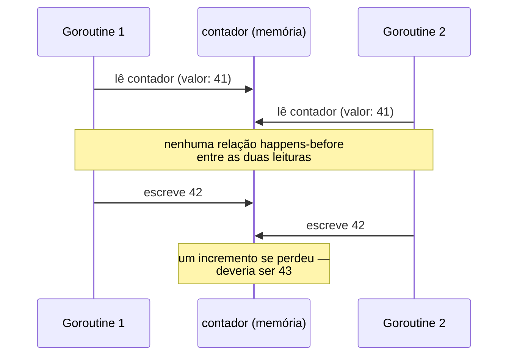
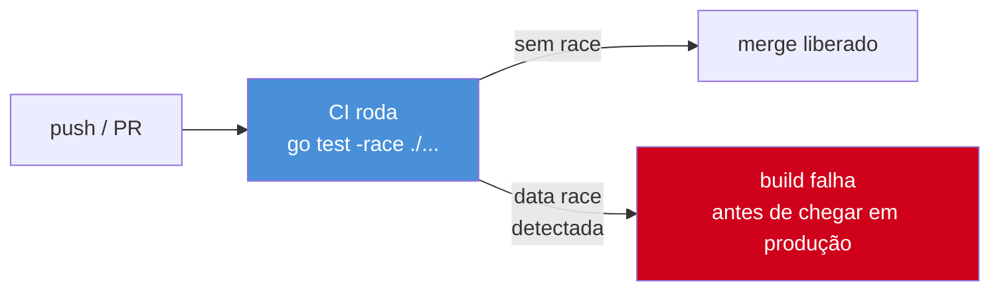

# O race detector

> [!abstract] TL;DR
> `go run -race` e `go test -race` ligam o **race detector** — uma instrumentação em tempo de execução, baseada no algoritmo ThreadSanitizer, que observa todo acesso a memória compartilhada e todo evento de sincronização (`Lock`, `Unlock`, envio/recebimento em channel) durante a execução real do programa. Se dois acessos concorrentes à mesma variável — pelo menos um deles escrita — acontecem sem uma relação de "aconteceu antes" (*happens-before*) estabelecida entre eles, o detector aponta o *stack trace* exato das duas goroutines envolvidas. Ele não analisa código estaticamente e não prova ausência de race — só pega o que **de fato rodou** naquela execução, com overhead de ~2-20x em CPU e memória, por isso nunca vai para produção. Roda no CI, em todo `go test`, como rede de segurança contra o tipo de bug que passa despercebido em code review e só aparece meses depois, em produção, sob carga.

## O bug que compila, passa nos testes e mesmo assim está errado

Imagine um contador simples, incrementado por várias goroutines:

```go
package main

import (
	"fmt"
	"sync"
)

func main() {
	contador := 0
	var wg sync.WaitGroup

	for i := 0; i < 1000; i++ {
		wg.Add(1)
		go func() {
			defer wg.Done()
			contador++ // leitura + escrita, sem proteção
		}()
	}

	wg.Wait()
	fmt.Println(contador)
}
```

Esse programa compila sem erro nenhum. Roda sem *panic*. E na maioria das execuções, imprime algum número perto de 1000 — às vezes exatamente 1000, o que é ainda pior, porque dá falsa sensação de que está tudo certo. Rode de novo, e o número pode sair diferente: 987, 994, 1000, 976. Nenhum crash, nenhuma mensagem de erro — só um resultado silenciosamente errado, que muda a cada execução.

O motivo é que `contador++` não é uma operação atômica. É três passos — ler o valor, somar 1, escrever de volta — e nada impede que duas goroutines leiam o mesmo valor antigo antes que qualquer uma escreva o novo, perdendo um incremento. Isso é uma **data race**: duas goroutines acessando a mesma posição de memória concorrentemente, sem sincronização entre elas, com pelo menos um dos acessos sendo escrita.

Esse é exatamente o tipo de bug contra o qual testes convencionais não protegem. `go test` roda o programa, ele produz *algum* resultado, os *asserts* passam ou falham dependendo do agendamento do *scheduler* naquela execução específica — e o *scheduler* do Go, como visto no [[03-Dominios/Tecnologia/Go/07 - Goroutines e o scheduler/02 - A goroutine — o go statement|Galho 7]], não dá nenhuma garantia de ordem entre goroutines. Rodar o teste 100 vezes seguidas pode passar as 100 — e o bug continuar lá, à espera da máquina certa, da carga certa, do dia de produção errado para aparecer.

> [!question]- Por que `sync.WaitGroup` não evita a race aqui?
> `WaitGroup` sincroniza um evento — "espere até que todas as goroutines terminem" — não protege o acesso a `contador` *durante* a execução das goroutines. `wg.Wait()` estabelece um *happens-before* entre "todo `Done()`" e "o `Wait()` retorna", mas não entre os `contador++` de goroutines diferentes rodando ao mesmo tempo. Ele resolve "quando terminar" e é exatamente o assunto da [[03 - WaitGroup e Once|nota 03]]; a race aqui é sobre "quem acessa o quê enquanto ainda está rodando" — problema diferente, que pede `sync.Mutex` ([[02 - Mutex e RWMutex|nota 02]]) ou `sync/atomic` ([[04 - atomic e sync-atomic|nota 04]]).

## O que o race detector realmente detecta

O nome sugere "detecta condição de corrida" em sentido amplo, mas vale precisar o termo: existem **race conditions** (bugs de ordem/timing em geral, incluindo coisas como duas goroutines competindo por quem processa um pedido primeiro — nem sempre um bug) e **data races** (acesso concorrente e desprotegido à mesma memória — sempre um bug em Go). O race detector do Go mira exclusivamente o segundo tipo, e o faz com uma definição precisa, herdada do modelo de memória do Go: uma data race ocorre quando dois acessos à mesma variável acontecem concorrentemente, pelo menos um é escrita, e não existe uma relação de sincronização que force um a acontecer antes do outro.



O detector não faz essa análise olhando o código-fonte. Ele instrumenta o binário: toda instrução que lê ou escreve memória compartilhada, e todo evento de sincronização (`mutex.Lock()`, `mutex.Unlock()`, envio e recebimento em channel, `atomic.*`, `wg.Done()`, `wg.Wait()`), vira uma chamada para a *runtime* do detector, que mantém um relógio lógico por goroutine (uma variante do algoritmo *vector clock*) e verifica, a cada acesso, se existe um caminho de sincronização que ordene esse acesso em relação aos anteriores na mesma posição de memória. Se não existir — e um dos dois for escrita — ele reporta.

Essa técnica é baseada no **ThreadSanitizer** (TSan), a mesma tecnologia usada em C/C++/Rust via Clang/LLVM; o time do Go adaptou o algoritmo para o runtime e o modelo de memória do Go. É por isso que o overhead é alto: cada acesso a memória compartilhada passa por essa contabilidade extra.

> [!warning] O detector só vê o que rodou — não é análise estática
> Se a data race só acontece sob uma condição de corrida rara (um `if` que depende de timing, uma goroutine que só dispara sob carga específica), e essa condição não ocorreu durante a execução instrumentada, o detector **não acusa nada** — porque ele não analisa o código, só observa a execução real. Um `go test -race` limpo não é prova de ausência de race; é evidência de que, nas execuções que rodaram (idealmente com boa cobertura de caminhos concorrentes), nenhuma foi flagrada. Rodar com `-count=N` repetindo o teste várias vezes, ou usar `t.Parallel()` para forçar mais entrelaçamento entre goroutines, aumenta a chance de expor races que dependem de timing específico.

## Ligando o detector: `-race`

A flag `-race` liga a instrumentação em qualquer subcomando do `go` que compila e roda código: `go test -race`, `go run -race`, `go build -race` (o binário resultante já sai instrumentado). O uso mais comum, de longe, é em teste:

```bash
go test -race ./...
```

Vamos rodar o exemplo do contador com a flag ligada:

```go
package main

import (
	"fmt"
	"sync"
)

func incrementar(contador *int, wg *sync.WaitGroup) {
	defer wg.Done()
	*contador++
}

func main() {
	contador := 0
	var wg sync.WaitGroup

	for i := 0; i < 100; i++ {
		wg.Add(1)
		go incrementar(&contador, &wg)
	}

	wg.Wait()
	fmt.Println(contador)
}
```

```
$ go run -race main.go
==================
WARNING: DATA RACE
Write at 0x00c000012028 by goroutine 8:
  main.incrementar()
      /home/dev/main.go:11 +0x44

Previous write at 0x00c000012028 by goroutine 7:
  main.incrementar()
      /home/dev/main.go:11 +0x44

Goroutine 8 (running) created at:
  main.main()
      /home/dev/main.go:18 +0x88

Goroutine 7 (finished) created at:
  main.main()
      /home/dev/main.go:18 +0x88
==================
Found 1 data race(s)
exit status 66
```

Esse relatório não é ruído genérico de "algo deu errado" — é cirúrgico: mostra a linha exata (`main.go:11`) onde cada uma das duas goroutines conflitantes acessou a memória, o *stack trace* de onde cada goroutine foi criada, e o tipo de acesso (`Write`, `Previous write`, ou `Previous read`). Compare com o esforço de achar o mesmo bug manualmente, revisando código ou adicionando `print` em pontos aleatórios torcendo para reproduzir o timing exato — é a diferença entre um GPS e tentar adivinhar o caminho pela paisagem.

> [!info] `-race` exige CGO habilitado e não roda em toda plataforma
> O race detector depende da *runtime* do TSan, escrita em C++, então exige `CGO_ENABLED=1` (o padrão na maioria dos ambientes de desenvolvimento locais, mas nem sempre em builds minimalistas ou imagens `FROM scratch`). Está disponível nas plataformas mais comuns — `linux/amd64`, `linux/arm64`, `darwin/amd64`, `darwin/arm64`, `windows/amd64`, entre outras listadas na [documentação oficial](https://go.dev/doc/articles/race_detector) — mas não em toda combinação de SO/arquitetura que o Go compila normalmente.

## Consertando a race

A correção mais direta para o exemplo acima é proteger o acesso com `sync.Mutex` ([[02 - Mutex e RWMutex|nota 02]]):

```go
func incrementar(contador *int, mu *sync.Mutex, wg *sync.WaitGroup) {
	defer wg.Done()
	mu.Lock()
	*contador++
	mu.Unlock()
}
```

Ou, para esse caso específico de contador numérico, `sync/atomic` ([[04 - atomic e sync-atomic|nota 04]]) é mais leve:

```go
func incrementar(contador *atomic.Int64, wg *sync.WaitGroup) {
	defer wg.Done()
	contador.Add(1)
}
```

Rodando `go test -race` de novo depois da correção, o relatório desaparece — porque agora existe uma relação *happens-before* explícita (o `Lock`/`Unlock`, ou a operação atômica) entre os acessos concorrentes, e o detector consegue provar a ordenação.

## O caso clássico: map compartilhado

Se a data race com um `int` já é sutil, o caso mais comum em código Go real é outro: um `map` acessado por múltiplas goroutines sem proteção. Diferente do `int++`, esse caso costuma dar um sinal barulhento — mas só *às vezes*, o que é enganoso:

```go
cache := make(map[string]int)

var wg sync.WaitGroup
for i := 0; i < 50; i++ {
	wg.Add(1)
	go func(n int) {
		defer wg.Done()
		cache[fmt.Sprintf("chave-%d", n)] = n // escrita concorrente no mesmo map
	}(i)
}
wg.Wait()
```

Sem `-race`, esse programa às vezes roda liso, às vezes explode com `fatal error: concurrent map writes` — um erro fatal do próprio runtime, não recuperável com `recover()`, porque o Go detecta *internamente* certas formas de corrupção de map em tempo de execução (não é o race detector — é uma checagem interna, sempre ativa, independente de `-race`). O problema é que essa checagem interna só pega parte dos casos: leitura concorrente com escrita, por exemplo, pode corromper o map silenciosamente sem disparar o `fatal error`. Com `-race`, o detector aponta a leitura e a escrita conflitantes deterministicamente, com stack trace de ambas, muito antes de a corrupção silenciosa se manifestar como bug incompreensível em produção. A correção passa por `sync.Mutex`/`sync.RWMutex` protegendo o map, ou por `sync.Map` — o tipo especializado da biblioteca padrão para esse padrão específico de acesso concorrente.

> [!question]- `go vet` não pega isso primeiro, antes mesmo de rodar?
> Não — `go vet` é análise estática: examina a árvore sintática do código sem executá-lo, e pega classes de erro estruturais (`Printf` com argumentos incompatíveis, `Lock` copiado por valor, *struct tags* malformadas). Uma data race depende do **comportamento em tempo de execução** — qual goroutine roda quando, em que ordem o scheduler intercala as instruções — informação que simplesmente não existe antes do programa rodar. É por isso que `go vet` e o race detector são complementares, não substitutos um do outro: `go vet` (e `golangci-lint`, que o inclui) roda em segundos sobre o código-fonte; `-race` precisa executar o programa de fato, com os caminhos concorrentes exercitados.

## Armadilhas comuns

> [!warning] Rodar `-race` só localmente, "de vez em quando", não substitui o CI
> É tentador tratar `-race` como ferramenta de depuração pontual — ligar quando já se desconfia de um bug de concorrência, desligar no dia a dia por causa da lentidão. O problema é que a maioria das data races não avisa antes de aparecer; ninguém "desconfia" com antecedência do pacote que vai falhar. Rodar `-race` sob demanda pega só os bugs que alguém já suspeitava; rodar em todo `go test` do CI pega os que ninguém viu vir — que são, estatisticamente, a maioria.

> [!warning] `-race` mais que dobra o tempo de execução dos testes — planeje o CI para isso
> Overhead de 2-20x não é hipérbole: uma suíte de testes que roda em 30 segundos sem `-race` pode passar de 2 minutos com a flag ligada, e o consumo de memória cresce proporcionalmente. Em monorepos grandes, isso costuma significar rodar `-race` em um job de CI separado e paralelo ao job "rápido" (lint, `go vet`, testes sem `-race`), em vez de sequencialmente — para não inflar o tempo até o feedback de PRs simples.

> [!warning] Corrigir a race silenciando o sintoma, não a causa
> Um erro comum sob pressão de prazo é "resolver" o `WARNING: DATA RACE` adicionando um `time.Sleep` estratégico que, empiricamente, faz o warning sumir — sem entender por quê. Isso não elimina a race; só reduz a probabilidade de as duas goroutines colidirem naquela janela de tempo específica, tornando o bug ainda mais raro e mais difícil de reproduzir depois. A correção correta é sempre estabelecer uma relação *happens-before* real — mutex, channel, `atomic` — nunca torcer o timing.

## Por que rodar sempre no CI

Um race detectado localmente, numa máquina de desenvolvimento, já é sorte — a race pode não se manifestar de novo em 50 execuções seguidas no seu laptop e aparecer sob a carga real de produção, com dezenas de goroutines competindo de verdade. A prática que a comunidade Go convergiu, e que ferramentas como o próprio módulo de testes do Go tornam trivial de adotar, é: **todo `go test` que roda no CI usa `-race`**, sem exceção para pacotes que "provavelmente não têm concorrência" — porque descobrir que um pacote *tem* concorrência escondida é justamente o valor do detector.



O custo de rodar com `-race` no CI é aceitável mesmo com o overhead de 2-20x: os testes ficam mais lentos, mas ainda terminam em segundos ou poucos minutos — um preço trivial comparado ao custo de um bug de concorrência descoberto em produção, sob carga, sem stack trace nenhum apontando a causa. A observabilidade de goroutines em produção (detectar leaks, inspecionar o que está rodando via `pprof`) é assunto de outro galho, mais à frente na trilha — o race detector não substitui isso; ele é a linha de defesa **antes** do deploy, pega o bug enquanto ainda é barato corrigir.

> [!warning] `-race` nunca vai para o binário de produção
> Além do overhead de CPU/memória, a instrumentação também aumenta o consumo de memória por goroutine (o detector mantém metadados de sincronização por goroutine e por região de memória acessada), o que pode esgotar recursos rapidamente sob carga real. `-race` é ferramenta de desenvolvimento e CI — teste, `go run` local, no máximo um ambiente de staging dedicado a caçar races sob tráfego sintético. Nunca compile o binário de produção com `-race` ligado.

## Vindo de outras linguagens

| Linguagem | Ferramenta equivalente |
|---|---|
| C / C++ | ThreadSanitizer (TSan) direto via Clang/GCC — a mesma tecnologia por baixo do detector do Go |
| Java | Nenhuma ferramenta embutida equivalente; `jcstress` e analisadores estáticos (FindBugs/SpotBugs) cobrem parte do problema, sem a mesma integração nativa com `go test` |
| Python | GIL torna data races clássicas raras em CPython puro (mas não em código que usa `multiprocessing` ou C extensions) |
| Node.js | Single-threaded no event loop; races de dado só aparecem em `worker_threads` com `SharedArrayBuffer`, sem detector embutido |

A combinação "detector embutido na toolchain padrão + flag de uma letra + integração direta com `go test`" é incomum fora do mundo Go — a maioria das linguagens deixa essa responsabilidade para ferramentas de terceiros, configuradas à parte.

## Como explicar em inglês

> Go's race detector, enabled with the `-race` flag on `go test`, `go run`, or `go build`, is a runtime instrumentation based on ThreadSanitizer (TSan) that tracks every memory access and every synchronization event while the program actually executes. It flags a **data race** whenever two goroutines access the same memory location concurrently, at least one of them a write, with no happens-before relationship establishing an order between them — and it reports the exact source lines and goroutine stack traces involved. It's not static analysis: it only catches races that actually occur during the instrumented run, so a clean `-race` pass isn't proof of correctness, just evidence for the paths exercised. The overhead — roughly 2-20x in CPU and memory — rules it out for production binaries, but its cost in CI is trivial next to the cost of a concurrency bug surfacing under real production load. The convention in idiomatic Go is to run every `go test` in CI with `-race`, no exceptions.

| Termo PT | Termo EN |
|---|---|
| detector de corrida | race detector |
| condição de corrida em dado | data race |
| condição de corrida (geral) | race condition |
| relação de precedência | happens-before relationship |
| instrumentação em tempo de execução | runtime instrumentation |
| vazamento de goroutine | goroutine leak |
| sobrecarga de desempenho | performance overhead |

## O que vem a seguir

O race detector pega o sintoma — acesso concorrente desprotegido — mas não resolve, por si só, o problema mais amplo de **como coordenar cancelamento e prazos** entre goroutines que dependem umas das outras. A [[06 - context.Context — deadline, cancel, values|nota 06]] introduz `context.Context`: o mecanismo padrão do Go para propagar prazos, cancelamento e valores de escopo de requisição através de uma árvore de goroutines — peça essencial para qualquer sistema concorrente de produção, e pré-requisito direto dos padrões de cancelamento e timeout que fecham este galho.

## Veja também

- [[02 - Mutex e RWMutex|02 — Mutex e RWMutex]] — a correção mais comum para a data race exposta pelo detector
- [[03 - WaitGroup e Once|03 — WaitGroup e Once]] — por que `WaitGroup` sozinho não evita races de dado
- [[04 - atomic e sync-atomic|04 — atomic e sync/atomic]] — alternativa leve ao mutex para contadores e flags
- [[06 - context.Context — deadline, cancel, values|06 — context.Context — deadline, cancel, values]] — próxima nota do galho
- [[03-Dominios/Tecnologia/Go/07 - Goroutines e o scheduler/02 - A goroutine — o go statement|Galho 7, nota 01]] — por que o scheduler não garante ordem entre goroutines
- [[03-Dominios/Tecnologia/Go/index|Trilha Go]]

## Fontes

- The Go Authors. *Data Race Detector*. go.dev. https://go.dev/doc/articles/race_detector (acessado em 2026-07-18)
- The Go Authors. *The Go Memory Model*. go.dev. https://go.dev/ref/mem (acessado em 2026-07-18)
- The Go Authors. *Introducing the Go Race Detector*. go.dev/blog. https://go.dev/blog/race-detector (acessado em 2026-07-18)
- Go Command Documentation. *go help testflag* (flag -race). pkg.go.dev. https://pkg.go.dev/cmd/go#hdr-Testing_flags (acessado em 2026-07-18)
- Serebryany, Konstantin & Iskhodzhanov, Timur. *ThreadSanitizer — data race detection in practice*. LLVM/Clang documentation. https://clang.llvm.org/docs/ThreadSanitizer.html (acessado em 2026-07-18)
