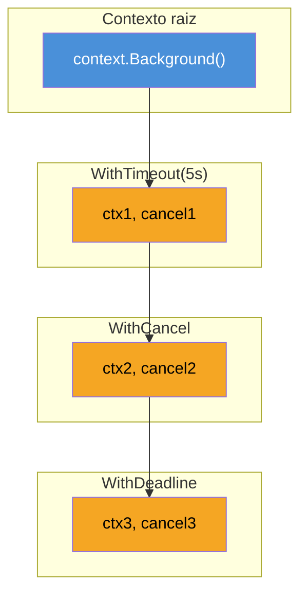
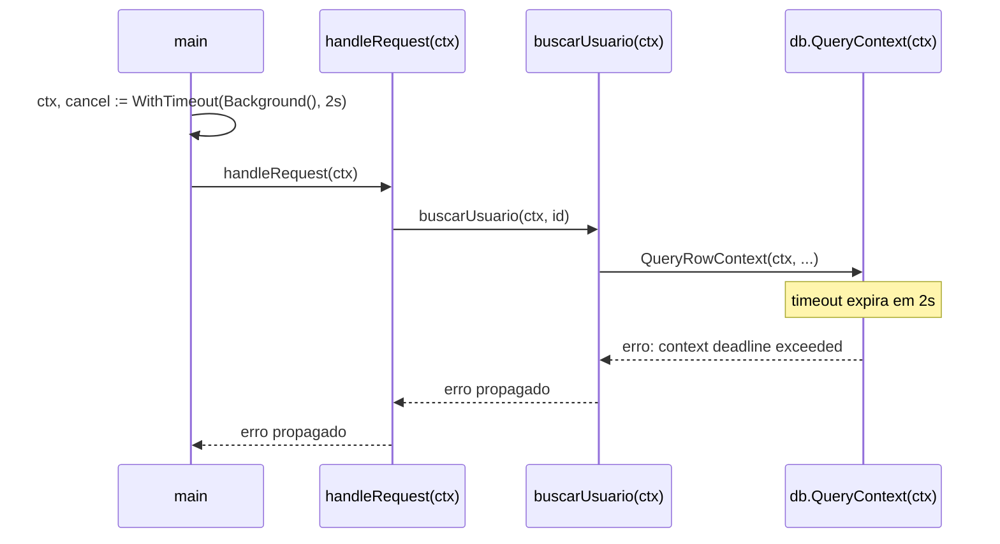

# context.Context — deadline, cancel, values

> [!abstract] TL;DR
> `context.Context` é a **espinha dorsal de cancelamento** de Go: um valor imutável, passado explicitamente como primeiro parâmetro (`ctx context.Context`) por toda a call chain, que carrega um sinal de "pare o que estiver fazendo" — por cancelamento manual (`WithCancel`), por tempo relativo (`WithTimeout`) ou por instante absoluto (`WithDeadline`). O sinal chega via um channel, `ctx.Done()`, que fecha quando é hora de parar; `ctx.Err()` diz por quê. Cada `With*` retorna um contexto **filho** e uma função `cancel` que o chamador raiz é responsável por invocar (`defer cancel()`), sob pena de vazar recursos. `context.Value` existe para dados de escopo de requisição (trace ID, usuário autenticado) — não para parâmetros de função disfarçados. A propagação é sempre em árvore: cancelar um pai cancela todos os filhos, nunca o contrário.

## O problema que o context resolve

Imagine uma requisição HTTP que dispara uma consulta ao banco, que por sua vez chama um serviço externo, que por sua vez lê um arquivo. Quatro camadas de chamadas, cada uma potencialmente lenta. Agora: o usuário fecha a aba do navegador no meio do caminho. O que acontece com o trabalho em andamento nas quatro camadas?

Sem nenhum mecanismo dedicado, a resposta é: nada. As goroutines continuam rodando até terminar sozinhas — a query no banco completa, o serviço externo responde, o arquivo é lido — e só então alguém descobre, tarde demais, que o resultado não tinha mais para onde ir. Isso não é só desperdício de CPU: é a receita clássica do **goroutine leak** — uma goroutine bloqueada numa operação (I/O, canal, mutex) que nunca vai ser lida nem cancelada, e que o garbage collector do Go **não recolhe**, porque ainda está referenciada e tecnicamente "viva". Empilhe milhares dessas por hora de tráfego e o processo esgota memória e file descriptors até cair.

O que falta é um jeito de propagar, através de camadas de chamadas que nem se conhecem diretamente, uma pergunta simples: "ainda vale a pena continuar?". É exatamente esse o papel do `context.Context` — não é uma feature de HTTP, nem de banco de dados; é um mecanismo genérico de sinalização que qualquer código concorrente pode consultar.

> [!question]- Por que não resolver isso com um `bool` compartilhado ou uma flag global?
> Porque cancelamento em Go raramente é uma árvore de um nível só. Uma requisição HTTP pode disparar três chamadas concorrentes, cada uma com seu próprio timeout mais curto que o da requisição-mãe; cancelar a requisição precisa cancelar as três de uma vez, mas cada timeout individual também precisa expirar de forma independente. Uma flag `bool` compartilhada não modela hierarquia nem múltiplas causas de cancelamento (timeout vs cancelamento manual vs deadline absoluto) — e não é segura para leitura/escrita concorrente sem sincronização extra, que o `context` já resolve internamente com um channel.

## O mecanismo: um channel que fecha

No coração de todo `context.Context` está um método, `Done() <-chan struct{}`, que devolve um channel **somente leitura**. Esse channel não recebe nenhum valor — ele simplesmente **fecha** quando é hora de parar. Lembre da nota sobre channels: um receive num channel fechado retorna imediatamente, com o valor zero. É esse comportamento que faz `ctx.Done()` funcionar como broadcast de cancelamento para um número arbitrário de goroutines ouvindo ao mesmo tempo — todas recebem o "fechou" no mesmo instante, sem coordenação extra.



Cancelar `ctx1` (o timeout de 5s expirando, por exemplo) propaga automaticamente para `ctx2` e `ctx3` — todos os descendentes fecham junto. O caminho inverso não existe: cancelar `ctx3` nunca afeta `ctx1` ou `ctx2`. É uma árvore de propagação estritamente de pai para filho, e é essa garantia que torna seguro passar contextos por dezenas de camadas sem se preocupar com quem cancela o quê.

A interface completa, do pacote `context`, tem quatro métodos:

```go
type Context interface {
    Deadline() (deadline time.Time, ok bool)
    Done() <-chan struct{}
    Err() error
    Value(key any) any
}
```

`Deadline` diz quando (se houver) o contexto expira sozinho. `Done` é o channel de sinalização. `Err` diz **por que** `Done()` fechou — `context.Canceled` (alguém chamou `cancel()`) ou `context.DeadlineExceeded` (o tempo estourou); enquanto o contexto ainda está ativo, `Err()` retorna `nil`. `Value` é o mecanismo de dados de escopo — tratado à parte, mais adiante, porque merece parcimônia.

## As quatro fábricas de contexto

Todo contexto nasce de um pai. No topo da árvore, dois pontos de partida sem pai nenhum:

```go
ctx := context.Background() // raiz de verdade — usada em main, testes, top-level de servidor
ctx := context.TODO()       // raiz provisória — "ainda não decidi qual contexto usar aqui"
```

`context.TODO()` existe como marcador honesto: você está escrevendo código que precisa de um `ctx` mas ainda não tem um pai real disponível — sinaliza pra você mesmo (e para quem revisar) que ali é candidato a receber um contexto de verdade depois. Fora isso, comporta-se de forma idêntica a `Background()`.

A partir de um contexto existente, três funções derivam filhos com cancelamento:

**`WithCancel`** — cancelamento manual, sem prazo embutido:

```go
ctx, cancel := context.WithCancel(context.Background())
defer cancel()

go trabalhar(ctx)

// em algum ponto, decide que não precisa mais do resultado:
cancel()
```

**`WithTimeout`** — cancela sozinho depois de uma duração relativa:

```go
ctx, cancel := context.WithTimeout(context.Background(), 3*time.Second)
defer cancel()
```

**`WithDeadline`** — cancela sozinho num instante absoluto do relógio:

```go
prazo := time.Now().Add(3 * time.Second)
ctx, cancel := context.WithDeadline(context.Background(), prazo)
defer cancel()
```

`WithTimeout` é, internamente, só `WithDeadline(parent, time.Now().Add(d))` — um atalho para o caso comum de "daqui a X". `WithDeadline` é a forma certa quando o prazo é um instante conhecido de antemão — por exemplo, "essa operação precisa terminar até as 14:00, não importa quando começou".

> [!warning] `cancel()` sempre precisa ser chamado — mesmo quando o contexto expira sozinho
> As três funções `With*` retornam uma função `cancel` e essa função **precisa** ser chamada, mesmo se o timeout ou deadline já vai expirar sozinho. `defer cancel()` logo após a criação é o padrão idiomático — não é otimização, é correção. Sem isso, o contexto pai mantém uma referência ao contexto filho até ele expirar naturalmente (ou para sempre, no caso de `WithCancel` sem timeout), e essa referência impede o garbage collector de liberar a memória associada — um vazamento de recursos silencioso que só aparece sob carga, quando milhares de contextos acumulados começam a pesar.

## Propagação pela call chain

A convenção — não é imposta pelo compilador, mas é seguida com rigidez quase religiosa em todo código Go idiomático — é que `ctx context.Context` seja o **primeiro parâmetro** de qualquer função que faça I/O, chame outra função que possa bloquear, ou dispare uma goroutine:

```go
func buscarUsuario(ctx context.Context, id int) (*Usuario, error) {
    return db.QueryRowContext(ctx, "SELECT ... WHERE id = ?", id).Scan(...)
}

func processarPedido(ctx context.Context, pedidoID int) error {
    usuario, err := buscarUsuario(ctx, pedidoID)
    if err != nil {
        return err
    }
    return notificar(ctx, usuario)
}
```

Repare que `processarPedido` não cria contexto nenhum — ele só **recebe** um e **repassa** para tudo que chama. Essa é a regra de ouro: contextos fluem de cima para baixo na call chain, sempre como parâmetro explícito, nunca guardados num struct de longa duração nem numa variável global. A [documentação oficial do pacote](https://pkg.go.dev/context) é explícita sobre isso: "Do not store Contexts inside a struct type; instead, pass a Context explicitly to each function that needs it."



O timeout criado em `main` propaga, sem nenhum código adicional em `handleRequest` ou `buscarUsuario` além de repassar `ctx`, até a chamada mais profunda que efetivamente consulta o banco. `database/sql` já entende `context.Context` nativamente — `QueryContext`, `ExecContext`, `QueryRowContext` — e cancela a query em andamento quando o contexto expira, em vez de deixar a goroutine bloqueada esperando o driver responder.

## Consumindo `ctx.Done()` dentro de uma goroutine

Criar e propagar o contexto é metade do trabalho — a outra metade é o código que efetivamente **escuta** o cancelamento. O padrão canônico é um `select` com dois casos: o trabalho normal e `ctx.Done()`:

```go
func trabalhar(ctx context.Context, resultados chan<- int) {
    for i := 0; ; i++ {
        select {
        case <-ctx.Done():
            fmt.Println("cancelado:", ctx.Err())
            return
        case resultados <- i:
            time.Sleep(100 * time.Millisecond)
        }
    }
}
```

Sem o `case <-ctx.Done()`, essa goroutine rodaria para sempre (ou até `resultados` ser fechado de um jeito que causasse panic) — é exatamente o goroutine leak descrito na abertura, agora com nome e mecanismo. O `select` garante que, no instante em que `Done()` fecha, a goroutine tem uma saída pronta e não precisa esperar a próxima iteração do trabalho "de verdade" para notar.

```go
func operacaoLenta(ctx context.Context) (string, error) {
    resultado := make(chan string, 1)

    go func() {
        time.Sleep(2 * time.Second) // simula trabalho real
        resultado <- "pronto"
    }()

    select {
    case r := <-resultado:
        return r, nil
    case <-ctx.Done():
        return "", ctx.Err()
    }
}
```

Este segundo exemplo mostra o padrão mais comum na prática: uma goroutine faz o trabalho de verdade e escreve num channel quando termina; a função que a disparou faz um `select` entre esse resultado e `ctx.Done()`, e retorna o que chegar primeiro. Se o contexto expirar antes do trabalho terminar, a função retorna — mas repare que a goroutine interna **continua rodando** até completar o `time.Sleep`; ela só não tem mais ninguém lendo `resultado`, porque o channel tem buffer 1. Isso não é um leak (a goroutine termina sozinha), mas é trabalho desperdiçado — a versão robusta passaria `ctx` também para dentro da goroutine, para que ela mesma pudesse abortar cedo.

## Values: com parcimônia

`context.WithValue` anexa um par chave-valor a um contexto, criando um filho que responde a `Value(chave)` com o valor associado — e delega para o pai qualquer chave que não reconheça:

```go
type chaveContexto string

const chaveRequestID chaveContexto = "requestID"

ctx := context.WithValue(context.Background(), chaveRequestID, "req-42")

func logar(ctx context.Context, msg string) {
    id, _ := ctx.Value(chaveRequestID).(string)
    fmt.Printf("[%s] %s\n", id, msg)
}
```

A [documentação do pacote](https://pkg.go.dev/context) é enfática: "Use context Values only for request-scoped data that transits processes and API boundaries, not for passing optional parameters to functions." A distinção prática é: se um parâmetro afeta o **resultado** de uma chamada (um filtro, um limite, um ID que a função usa para decidir o que fazer), ele deveria ser um parâmetro normal, explícito na assinatura — não um valor escondido no contexto. Se é um dado que **atravessa** a chamada sem que a função precise necessariamente conhecê-lo — um trace ID de observabilidade, o usuário autenticado extraído de um middleware HTTP, um deadline de auditoria — aí `context.Value` se justifica, porque forçar cada função intermediária a receber e repassar esse parâmetro manualmente poluiria toda assinatura da call chain sem ganho real.

> [!warning] Chave de string crua colide entre pacotes — sempre use um tipo próprio
> `context.WithValue(ctx, "userID", 42)` usa uma `string` literal como chave. Se outro pacote também usar a string `"userID"` como chave de contexto — coisa fácil de acontecer sem coordenação — os dois colidem silenciosamente, sem erro de compilação nem panic: um sobrescreve o valor do outro. A correção idiomática é declarar um tipo próprio, não exportado, só para chaves de contexto (`type chaveContexto string`, como no exemplo acima) — isso torna as chaves do seu pacote inconfundíveis com as de qualquer outro, porque o tipo `chaveContexto` só existe ali. `go vet` inclusive alerta (`should not use basic type string as key in context.WithValue`) quando detecta o uso de tipo embutido como chave.

> [!warning] `context.Value` não é DI, não é estado global disfarçado
> É tentador usar `context.Value` para "injetar" dependências — uma conexão de banco, um logger configurado, um cliente HTTP — em vez de passá-las como parâmetros de struct ou função. Resista: isso transforma dependências explícitas em busca dinâmica por chave, perde checagem de tipo em compile-time (`Value` retorna `any`), e torna o código difícil de testar, porque as dependências reais ficam escondidas dentro de um contexto opaco em vez de aparecerem na assinatura. Se algo é uma dependência de verdade — algo sem o qual a função não funciona — é parâmetro ou campo de struct, não valor de contexto.

## Vindo de outras linguagens

| Linguagem | Mecanismo equivalente | Diferença chave |
|---|---|---|
| Java | `CompletableFuture.cancel()`, `Thread.interrupt()` | Interrupção é cooperativa mas não propaga automaticamente por uma árvore de chamadas; cada camada precisa checar `Thread.interrupted()` manualmente |
| Python (asyncio) | `asyncio.CancelledError` lançado dentro da task | Cancelamento vira uma exceção que percorre o call stack via `try/except`; `context.Context` do Go é um valor consultado, não uma exceção lançada |
| Node.js | `AbortController` / `AbortSignal` | É o mais próximo em espírito — um objeto passado explicitamente, com `signal.aborted` e evento `abort` — mas `AbortSignal` não carrega values como `context.Value`, e a árvore de propagação de cancelamento pai→filho não é embutida do mesmo jeito |

A comparação mais honesta é com `AbortSignal` do Node: ambos são passados explicitamente pela cadeia de chamadas, ambos expõem um jeito de "escutar" o cancelamento. A diferença central é que `context.Context` empacota três coisas numa interface só (cancelamento, deadline, e dados de escopo) e formaliza a propagação em árvore como parte do contrato da linguagem — não é uma convenção de biblioteca, é o padrão que toda a standard library de Go (net/http, database/sql, os/exec) já espera receber.

## Armadilhas comuns

> [!warning] Guardar `ctx` num struct de longa duração
> `ctx` vive o tempo da operação que o criou — uma requisição, uma chamada. Guardá-lo num campo de struct que sobrevive além disso (um `Server{ctx: ctx}` criado uma vez no `main` e reutilizado para toda requisição) mistura o tempo de vida errado: o contexto de uma requisição específica vaza para outras, ou o contexto do servidor nunca reflete o cancelamento individual de cada chamada. A convenção é: `ctx` é parâmetro, não campo.

> [!warning] Passar `nil` em vez de `context.Background()`
> Toda função que espera `context.Context` espera um valor não-nulo — chamar `ctx.Done()` num `context.Context` nil causa panic. Se não há contexto real disponível, `context.Background()` ou `context.TODO()` são os valores corretos, nunca `nil`.

> [!warning] Esquecer que `ctx.Done()` fechado não interrompe código já em execução
> Fechar `Done()` é um **sinal**, não uma interrupção forçada. Se o código dentro de uma goroutine não tem nenhum `select` checando `ctx.Done()` — por exemplo, está bloqueado numa chamada de biblioteca que não aceita contexto, ou está no meio de um loop CPU-bound sem checagem — ele simplesmente não vai parar. Cancelamento em Go é sempre cooperativo: quem escreve o código dentro da goroutine precisa checar o sinal ativamente, em pontos razoáveis do fluxo.

## Como explicar em inglês

> `context.Context` is Go's mechanism for propagating cancellation, deadlines, and request-scoped values across a call chain — always passed explicitly as the first parameter, `ctx context.Context`, never stored in a struct for later use. `Done()` returns a channel that closes when it's time to stop; any number of goroutines can select on it simultaneously, since a close broadcasts to all readers at once. `WithCancel`, `WithTimeout`, and `WithDeadline` each derive a child context from a parent and return a `cancel` function that the caller must invoke — typically via `defer cancel()` — even when the context is expected to expire on its own, because skipping it leaks the parent's reference to the child. Cancellation always flows down the tree: canceling a parent cancels every descendant, never the reverse. `context.Value` exists for data that crosses API boundaries without affecting a call's outcome — a trace ID, an authenticated user — not as a substitute for explicit function parameters or dependency injection.

| Termo PT | Termo EN |
|---|---|
| cancelamento | cancellation |
| prazo / instante absoluto | deadline |
| duração relativa | timeout |
| contexto pai / contexto filho | parent context / child context |
| propagação em árvore | tree propagation |
| vazamento de goroutine | goroutine leak |
| dados de escopo de requisição | request-scoped data |
| cancelamento cooperativo | cooperative cancellation |

## O que vem a seguir

Esta nota cobriu o mecanismo cru: como criar, propagar e escutar um `context.Context`. A [[07 - Padrões de cancelamento e timeout|nota 07]] vai além do mecanismo isolado e monta os **padrões** que aparecem repetidamente em código Go de produção: como compor timeouts de múltiplas camadas sem que um sobrescreva o outro por engano, como cancelar um grupo de goroutines relacionadas de uma vez (`errgroup`), e como detectar e evitar goroutine leaks de forma sistemática — não caso a caso, como fizemos aqui.

## Veja também

- [[01 - Quando channels não bastam — o pacote sync|01 — Quando channels não bastam — o pacote sync]] — o pacote `sync` como alternativa/complemento ao `context` para coordenação
- [[03 - WaitGroup e Once|03 — WaitGroup e Once]] — outra forma de esperar goroutines terminarem, sem envolver cancelamento
- [[07 - Padrões de cancelamento e timeout|07 — Padrões de cancelamento e timeout]] — próxima nota do galho
- [[03-Dominios/Tecnologia/Go/index|Trilha Go]]

## Fontes

- The Go Authors. *Package context*. pkg.go.dev. https://pkg.go.dev/context (acessado em 2026-07-18)
- The Go Authors. *Go Concurrency Patterns: Context*. go.dev/blog. https://go.dev/blog/context (acessado em 2026-07-18)
- The Go Authors. *Go Concurrency Patterns: Pipelines and cancellation*. go.dev/blog. https://go.dev/blog/pipelines (acessado em 2026-07-18)
- The Go Authors. *Effective Go — Concurrency*. go.dev. https://go.dev/doc/effective_go#concurrency (acessado em 2026-07-18)
- Go by Example. *Context*. gobyexample.com. https://gobyexample.com/context (acessado em 2026-07-18)
