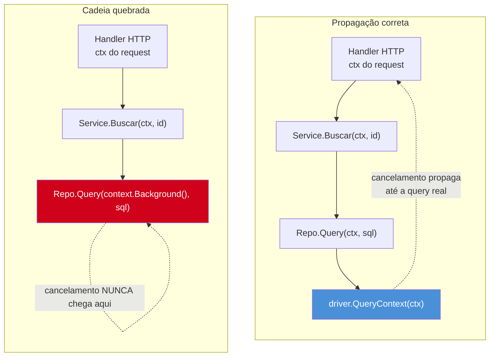
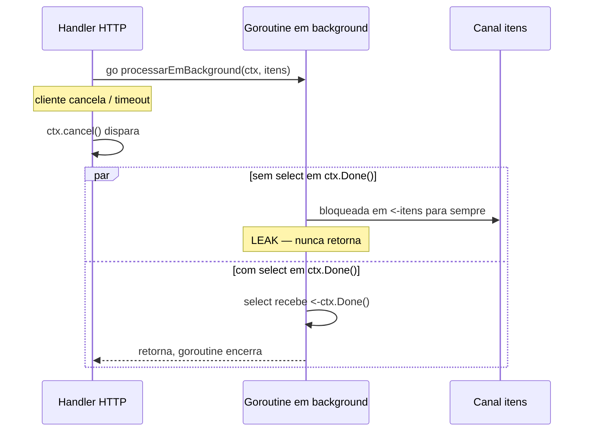
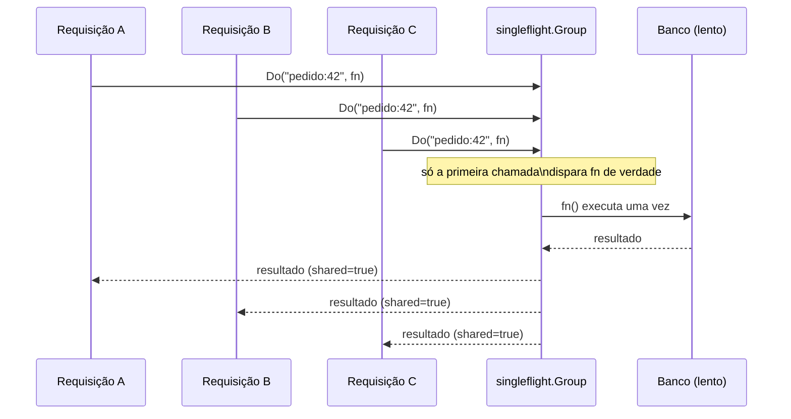
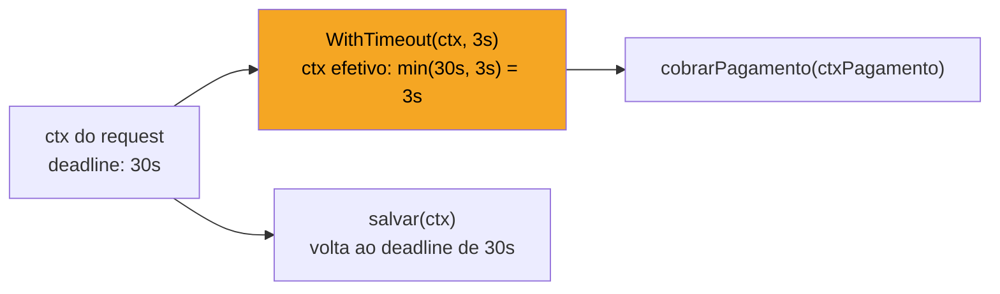

# Padrões de cancelamento e timeout

> [!abstract] TL;DR
> A nota anterior mostrou o mecanismo de `context.Context` — `WithCancel`, `WithTimeout`, `Done()`. Esta nota mostra os **padrões** de uso que separam código Go idiomático de código que vaza goroutine em produção: (1) propagar o `ctx` recebido até a raiz de toda chamada bloqueante, nunca criar um `context.Background()` no meio da pilha; (2) toda goroutine que pode bloquear precisa de uma saída via `ctx.Done()` no `select`, ou ela vive para sempre; (3) `singleflight` resolve o *cache stampede* — N requisições simultâneas pela mesma chave batendo no banco ao mesmo tempo — colapsando-as em uma única execução; (4) timeout de operação é `context.WithTimeout` aplicado no ponto certo, não um `time.Sleep` de esperança. O fio condutor: em Go, cancelamento não é exceção nem sinal — é um valor (`ctx.Done()`, um canal) que você precisa *ouvir ativamente* em cada `select`.

## O cenário que expõe o problema

Imagine um handler HTTP que processa um upload: lê o arquivo, chama um serviço de validação externo, grava no banco, dispara uma notificação assíncrona. O cliente cancela a requisição no meio do caminho — fecha a aba, a conexão cai, o timeout do load balancer estoura. O que acontece com o trabalho que já estava em andamento?

Em uma linguagem com exceções e stack unwinding automático (Java, Python), a resposta costuma ser "depende do runtime": uma `InterruptedException` pode ou não propagar, uma thread pode ou não perceber que ninguém mais espera o resultado. Em Go, a resposta é dolorosamente honesta: **nada acontece, a menos que você tenha escrito código para que aconteça**. Uma goroutine bloqueada em `db.QueryContext(ctx, ...)` para automaticamente quando `ctx` cancela — porque o driver de banco *implementa* esse contrato. Mas uma goroutine bloqueada em `<-canalQualquer` sem um `case <-ctx.Done()` ao lado simplesmente **não sabe** que ninguém mais quer o resultado dela. Ela continua rodando, para sempre, consumindo memória e — se estiver segurando um lock — bloqueando outras goroutines também.

Isso não é teórico. É a causa mais comum de *goroutine leak* em serviços Go de produção: uma goroutine de "fire and forget" lançada dentro de um handler, sem `ctx`, que nunca recebe sinal de que o request-pai já terminou.

## Regra 1 — propagar o `ctx` do topo até toda chamada bloqueante

A convenção estabelecida na nota anterior — `ctx` é sempre o primeiro parâmetro, nunca guardado em struct — só cumpre sua função se for **seguida até o fim da cadeia de chamadas**. A armadilha mais comum é parar de propagar no meio: uma função recebe `ctx`, mas ao chamar uma dependência interna usa `context.Background()` "porque é mais rápido de escrever agora".

```go
// ERRADO — quebra a cadeia de cancelamento
func BuscarPedido(ctx context.Context, id string) (*Pedido, error) {
    // ctx chega aqui, mas...
    return buscarNoBanco(context.Background(), id) // ...morre aqui
}

// CERTO — o mesmo ctx atravessa toda a chamada
func BuscarPedido(ctx context.Context, id string) (*Pedido, error) {
    return buscarNoBanco(ctx, id)
}
```



O teste mental é simples: se você está prestes a escrever `context.Background()` ou `context.TODO()` em qualquer lugar que não seja o ponto de entrada do processo (`main`, o início de um handler HTTP, o worker que consome de uma fila), pare — quase certamente existe um `ctx` de verdade subindo pela pilha de chamadas que você deveria estar usando.

> [!info] `context.TODO()` como marcador temporário
> `context.TODO()` (desde Go 1.7, junto com `context.Context`) não é um "Background mais educado" — é um marcador deliberado para "esta função ainda não recebe `ctx`, mas deveria". Ferramentas de análise estática (`go vet`, linters como `contextcheck`) sabem procurar por `TODO()` remanescente em código que já deveria ter sido migrado. Usar `TODO()` em vez de `Background()` durante uma refatoração incremental documenta a dívida no próprio código.

## Regra 2 — prevenir goroutine leak com `ctx.Done()`

Toda goroutine lançada com `go func() {...}()` que pode bloquear — em um canal, em I/O, em um `select` — precisa de uma via de saída amarrada ao `ctx` de quem a lançou. Sem isso, a goroutine sobrevive ao chamador indefinidamente.

O padrão mínimo é um `select` com dois cases: o trabalho normal, e `<-ctx.Done()` como saída de emergência.

```go
func processarEmBackground(ctx context.Context, itens <-chan Item) {
    for {
        select {
        case item, ok := <-itens:
            if !ok {
                return // canal fechado, trabalho terminou normalmente
            }
            processar(item)
        case <-ctx.Done():
            // o chamador desistiu — sai sem processar o resto
            log.Printf("processamento cancelado: %v", ctx.Err())
            return
        }
    }
}
```

Sem o segundo `case`, se `itens` nunca fechar e nunca receber outro valor, essa goroutine fica bloqueada em `<-itens` para sempre — mesmo que o handler HTTP que a lançou já tenha respondido ao cliente há muito tempo. Ela não aparece em nenhum log de erro. Ela só aparece, meses depois, como um número de goroutines que só cresce — visível em `runtime.NumGoroutine()` ou num dump de `pprof` (ferramenta do galho 16, aqui o foco é o mecanismo que *evita* precisar dele).



Um segundo padrão de leak, mais sutil: **enviar** para um canal sem saída de cancelamento no lado do envio. Se uma goroutine produz um resultado e tenta `resultado <- valor` num canal sem buffer, mas o único consumidor já desistiu (timeout, ou o chamador retornou mais cedo), o envio bloqueia para sempre — a menos que o envio também esteja dentro de um `select` com `ctx.Done()`:

```go
func calcular(ctx context.Context, resultado chan<- int) {
    valor := trabalhoLento()
    select {
    case resultado <- valor:
        // consumidor ainda está esperando, entrega normal
    case <-ctx.Done():
        // consumidor desistiu — descarta o valor em vez de travar aqui
    }
}
```

> [!warning] `go func() {...}()` sem `ctx` nenhum é a origem mais comum de leak
> O padrão perigoso é o "fire and forget" dentro de um handler: `go enviarEmailDeConfirmacao(pedido)`. Se essa função faz uma chamada de rede que pode demorar (SMTP fora do ar, DNS lento) e não recebe nenhum `ctx`, ela roda até o request-pai já ter esquecido dela — e se isso acontece a cada request, o número de goroutines presas cresce sem limite até o processo cair por falta de memória. A correção quase sempre é: passar um `ctx` derivado (com timeout próprio, se a tarefa deve sobreviver ao request — ver a seção seguinte) e garantir que a função tem uma via de saída por `ctx.Done()`.

### Detectando o leak antes de produção

O jeito mais confiável de pegar goroutine leak não é ler código com atenção — é fazer o teste **provar** que nenhuma goroutine sobrevive além do esperado. `go.uber.org/goleak`, mantido pela Uber, se tornou o padrão de fato da comunidade para isso: ele tira uma "foto" das goroutines vivas no fim de um teste e falha se sobrar alguma que não deveria estar lá (descontando as internas do runtime e do próprio framework de teste).

```go
func TestMain(m *testing.M) {
    goleak.VerifyTestMain(m)
}

func TestProcessarEmBackground(t *testing.T) {
    defer goleak.VerifyNone(t)

    ctx, cancel := context.WithCancel(context.Background())
    itens := make(chan Item)

    go processarEmBackground(ctx, itens)
    cancel() // se o select não tiver case <-ctx.Done(), este teste falha
}
```

Sem esse tipo de verificação automatizada, um leak como o da Regra 2 costuma passar despercebido em code review — o código *parece* correto, compila, passa nos testes funcionais — e só aparece em produção como memória crescendo lentamente ao longo de dias.

## `singleflight` — resolvendo o cache stampede

Cenário concreto: um endpoint de API cacheia o resultado de uma consulta cara (agregação de relatório, chamada a um serviço externo lento) por 60 segundos. O cache expira. No mesmo instante, 200 requisições concorrentes chegam pedindo a mesma chave. Sem proteção, as 200 batem no banco ao mesmo tempo, competindo pelo mesmo trabalho redundante — o chamado *cache stampede* (ou *thundering herd*).

A saída ingênua — um `sync.Mutex` global protegendo o recálculo — serializa até requisições para chaves *diferentes*, o que é pior que o problema original. O que se quer é: **deduplicar por chave**, deixando requisições concorrentes por chaves diferentes rodarem em paralelo, mas colapsando N chamadas concorrentes pela *mesma* chave numa única execução.

É exatamente isso que `golang.org/x/sync/singleflight` faz. Não é `sync` da standard library — é um pacote da coleção `x/sync`, mantida pelo próprio time do Go mas versionada fora do compilador (mesmo lugar de `errgroup` e `semaphore`).



`Group.Do(chave, fn)` recebe uma chave e uma função. Se já existe uma chamada em andamento para essa chave, a nova chamada **não executa `fn`** — apenas espera o resultado da chamada já em voo e o recebe também. O terceiro valor de retorno, `shared bool`, diz se o resultado foi compartilhado com outras chamadas concorrentes ou se veio de uma execução exclusiva.

```go
import "golang.org/x/sync/singleflight"

var grupo singleflight.Group

func BuscarRelatorio(ctx context.Context, chave string) (*Relatorio, error) {
    resultado, err, compartilhado := grupo.Do(chave, func() (interface{}, error) {
        return consultarBancoLento(ctx, chave)
    })
    if err != nil {
        return nil, err
    }
    if compartilhado {
        log.Printf("resultado de %q veio de chamada compartilhada", chave)
    }
    return resultado.(*Relatorio), nil
}
```

> [!info] Generics em `singleflight` — cheque a versão
> A assinatura de `Do` na versão clássica de `golang.org/x/sync/singleflight` retorna `interface{}`, exigindo type assertion como no exemplo acima (compatível com qualquer Go moderno). Módulos que já adotaram generics (Go 1.18+) em pacotes-irmãos costumam expor variantes tipadas — vale checar a documentação do pacote em [pkg.go.dev](https://pkg.go.dev/golang.org/x/sync/singleflight) antes de assumir a assinatura, porque a API evolui entre versões do módulo `x/sync`.

Um detalhe que costuma pegar quem integra `singleflight` com `ctx` pela primeira vez: `Do` não aceita `ctx` como parâmetro — a deduplicação é por chave, não por request. Isso significa que se a **primeira** requisição que disparou a chamada cancelar o próprio `ctx`, ela pode derrubar o resultado para as outras que ainda esperam, dependendo de como `fn` trata o cancelamento internamente. A prática recomendada é usar, dentro de `fn`, um `ctx` próprio — geralmente `context.Background()` com um timeout independente do request que disparou a chamada, exatamente porque o trabalho *deve* sobreviver ao cancelamento de qualquer requisição individual e servir todas as que esperam.

```go
func BuscarRelatorio(ctx context.Context, chave string) (*Relatorio, error) {
    resultado, err, _ := grupo.Do(chave, func() (interface{}, error) {
        // ctx independente: o trabalho compartilhado não deve morrer
        // só porque a requisição que o disparou foi cancelada.
        ctxInterno, cancel := context.WithTimeout(context.Background(), 5*time.Second)
        defer cancel()
        return consultarBancoLento(ctxInterno, chave)
    })
    if err != nil {
        return nil, err
    }
    return resultado.(*Relatorio), nil
}
```

Essa é uma das poucas situações legítimas em Go de criar `context.Background()` fora do ponto de entrada do processo — porque a semântica desejada é deliberadamente "este trabalho não pertence a nenhuma requisição individual".

> [!warning] `singleflight` não é cache — é deduplicação de trabalho em voo
> `Group.Do` só colapsa chamadas que estão **concorrentemente em andamento** para a mesma chave. Depois que `fn` retorna, a próxima chamada com a mesma chave dispara `fn` de novo — não há memorização de resultado passado. `singleflight` resolve o *stampede* no instante da expiração do cache; a camada de cache em si (TTL, invalidação, armazenamento) continua sendo responsabilidade de outra peça, tipicamente um `sync.Map`, Redis, ou o próprio galho 10 de comunicação entre sistemas.

## Timeout de operações — aplicando `WithTimeout` no ponto certo

A nota anterior mostrou a mecânica de `context.WithTimeout`. O padrão que importa aqui é **onde** aplicar o timeout — porque timeout aninhado em camadas erradas produz comportamento sutilmente errado.

A regra prática: o timeout deve envolver **a operação que se quer limitar**, não o chamador dela nem uma escala arbitrária maior. Um erro comum é colocar o timeout no nível errado da pilha — por exemplo, um timeout de 30 segundos no handler HTTP inteiro, quando na verdade só a chamada a um serviço externo específico deveria ter esse limite, deixando o resto do processamento (que é rápido e local) sem margem se o externo consumir o orçamento todo.

```go
func ProcessarPedido(ctx context.Context, pedido Pedido) error {
    // A validação local é rápida — não precisa de timeout próprio,
    // herda o ctx do chamador sem modificação.
    if err := validar(pedido); err != nil {
        return err
    }

    // A chamada ao serviço de pagamento externo é o ponto que pode travar —
    // aqui, e só aqui, aplicamos um timeout dedicado.
    ctxPagamento, cancel := context.WithTimeout(ctx, 3*time.Second)
    defer cancel()
    if err := cobrarPagamento(ctxPagamento, pedido); err != nil {
        return fmt.Errorf("cobrança falhou: %w", err)
    }

    return salvar(ctx, pedido) // volta ao ctx original, sem o timeout de pagamento
}
```

`context.WithTimeout(ctx, 3*time.Second)` deriva um novo `ctx` que cancela no **menor** dos dois prazos: 3 segundos a partir de agora, ou o deadline que `ctx` (o pai) já carregava, o que vier primeiro. Isso é automático — não precisa ser calculado manualmente — e é a razão pela qual encadear `WithTimeout` em várias camadas é seguro: cada camada só consegue *apertar* o prazo, nunca alargá-lo além do que o pai já permitia.



> [!warning] `time.Sleep` para "dar tempo" não é timeout
> Um antipadrão recorrente é tentar limitar quanto tempo esperar por algo com `time.Sleep(3 * time.Second)` seguido de checar um valor manualmente, ou usar um `time.Timer` solto sem integrar com `ctx.Done()`. Isso não cancela o trabalho que já está em andamento — só o abandona sem avisar ninguém, deixando exatamente o goroutine leak da Regra 2. `context.WithTimeout` é o único padrão que consegue as duas coisas ao mesmo tempo: sinalizar "pare" para quem está fazendo o trabalho, e devolver o controle para quem está esperando.

> [!info] `context.WithTimeoutCause` — Go 1.21
> Desde Go 1.21, `context.WithTimeoutCause(ctx, duracao, causa)` permite anexar um erro customizado ao cancelamento, recuperável depois via `context.Cause(ctx)`. Em vez de só saber que o `ctx` expirou (`context.DeadlineExceeded` genérico), o código que trata o erro pode distinguir *por que* — útil quando várias camadas de timeout se sobrepõem e o diagnóstico "qual delas estourou primeiro" importa.

## Caso prático — os três padrões juntos

Um handler realista costuma precisar dos três padrões ao mesmo tempo. Considere um endpoint que serve um relatório caro, cacheado, e que dispara uma auditoria em background sem travar a resposta ao cliente:

```go
type ServicoRelatorio struct {
    grupo singleflight.Group
}

func (s *ServicoRelatorio) Handler(w http.ResponseWriter, r *http.Request) {
    ctx := r.Context() // ctx do request — já cancela sozinho se o cliente desconectar
    if ctx.Err() != nil {
        return // cliente já desconectou antes de começarmos qualquer trabalho
    }

    chave := r.URL.Query().Get("id")

    // singleflight colapsa consultas concorrentes pela mesma chave
    dado, err, compartilhado := s.grupo.Do(chave, func() (interface{}, error) {
        // ctx próprio: o trabalho compartilhado sobrevive ao cancelamento
        // de qualquer requisição individual que o disparou.
        ctxTrabalho, cancelTrabalho := context.WithTimeout(context.Background(), 4*time.Second)
        defer cancelTrabalho()
        return montarRelatorio(ctxTrabalho, chave)
    })
    if err != nil {
        http.Error(w, "falha ao gerar relatório", http.StatusInternalServerError)
        return
    }

    // auditoria em background — NÃO usa o ctx do request, que já pode
    // ter sido cancelado no momento em que a resposta é escrita.
    go registrarAuditoria(context.Background(), chave, compartilhado)

    json.NewEncoder(w).Encode(dado)
}

func registrarAuditoria(ctx context.Context, chave string, cacheado bool) {
    ctx, cancel := context.WithTimeout(ctx, 2*time.Second)
    defer cancel()

    select {
    case <-tempoDeGravar(ctx, chave, cacheado):
        // gravação concluída dentro do prazo
    case <-ctx.Done():
        log.Printf("auditoria de %q descartada: %v", chave, ctx.Err())
    }
}
```

Repare na escolha deliberada em `registrarAuditoria`: ela recebe `context.Background()`, não o `ctx` do request, porque a auditoria **deve** rodar mesmo que o cliente já tenha recebido a resposta e a conexão HTTP tenha sido encerrada — mas ainda assim carrega seu próprio timeout de 2 segundos, para nunca virar uma goroutine eterna caso a gravação trave. É a combinação das três regras: propagação onde faz sentido propagar, um `ctx` independente onde o trabalho precisa sobreviver ao chamador, e um `select` com `ctx.Done()` garantindo que mesmo esse `ctx` independente tem uma saída.

## Lente cross-stack

| Vindo de... | O padrão equivalente | A diferença em Go |
|---|---|---|
| Java | `CompletableFuture.orTimeout()`, `ExecutorService.shutdown()` + `awaitTermination` | Go não tem um "pool gerenciado" que sabe interromper tarefas sozinho — cada goroutine precisa checar `ctx.Done()` explicitamente; não existe `Thread.interrupt()` cooperativo automático |
| Python (asyncio) | `asyncio.wait_for(coro, timeout=3)`, cancelamento via `Task.cancel()` | `asyncio` lança `CancelledError` *dentro* da coroutine no próximo `await`; Go nunca interrompe a goroutine à força — o `select` com `ctx.Done()` é sempre um retorno voluntário, cooperativo |
| Node.js | `AbortController` + `AbortSignal`, passado explicitamente para `fetch` e APIs que aceitam `{ signal }` | É o parente mais próximo conceitualmente — `AbortSignal` e `ctx.Done()` são ambos "um canal/evento que você precisa ouvir manualmente"; a diferença é que em Go a convenção de passar isso é uma regra de linguagem (primeiro parâmetro), enquanto em Node é opcional por API |

## Como explicar em inglês

> Cancellation in Go is cooperative, not preemptive: a goroutine only stops when it actively checks `ctx.Done()` in a `select` statement — nothing interrupts it from the outside. This makes two disciplines mandatory in production code: propagate the request's `ctx` through every call in the chain down to the actual blocking operation (never spin up a fresh `context.Background()` mid-stack), and give every `go func(){}()` that can block a `case <-ctx.Done()` exit, or it leaks forever once its caller has moved on. For deduplicating concurrent work — the classic cache-stampede problem, where a cache expires and hundreds of requests hit the database for the same key at once — `golang.org/x/sync/singleflight` collapses concurrent calls sharing a key into a single execution, returning the same result to every caller. For bounding how long an operation is allowed to run, `context.WithTimeout` should wrap the specific operation that needs the limit, not an arbitrary outer scope — nested timeouts always take the tighter of parent and child deadlines automatically, so layering them is safe.

| Termo PT | Termo EN |
|---|---|
| vazamento de goroutine | goroutine leak |
| avalanche de cache / estouro de manada | cache stampede / thundering herd |
| voo único / deduplicação de chamadas | singleflight |
| cancelamento cooperativo | cooperative cancellation |
| propagação de contexto | context propagation |
| prazo / tempo limite | deadline / timeout |
| chamada em andamento | in-flight call |
| tarefa órfã | orphaned task |

## O que vem a seguir

Cancelamento e timeout resolvem o problema de **quando parar**. A nota seguinte olha para o problema irmão: **como organizar** o trabalho concorrente em si — os formatos recorrentes que a comunidade Go convergiu para pipelines, fan-out/fan-in, worker pools e o padrão *done channel*. A [[08 - Padrões de concorrência idiomáticos|nota 08]] fecha o galho reunindo esses formatos, todos construídos sobre o vocabulário desta nota e das anteriores — channels, `select`, `ctx.Done()`.

## Veja também

- [[06 - context.Context — deadline, cancel, values|06 — context.Context — deadline, cancel, values]] — mecanismo de `WithCancel`/`WithTimeout`/`Done()` retomado aqui em forma de padrões
- [[01 - Quando channels não bastam — o pacote sync|01 — Quando channels não bastam — o pacote sync]] — abertura do galho, o vocabulário de `select` e canais usado nesta nota
- [[08 - Padrões de concorrência idiomáticos|08 — Padrões de concorrência idiomáticos]] — próxima nota do galho
- [[03-Dominios/Tecnologia/Go/index|Trilha Go]]

## Fontes

- The Go Authors. *Package context*. pkg.go.dev. https://pkg.go.dev/context (acessado em 2026-07-18)
- The Go Authors. *Package singleflight*. pkg.go.dev. https://pkg.go.dev/golang.org/x/sync/singleflight (acessado em 2026-07-18)
- The Go Blog. *Go Concurrency Patterns: Context*. go.dev/blog. https://go.dev/blog/context (acessado em 2026-07-18)
- The Go Authors. *Go 1.21 Release Notes — context package*. go.dev. https://go.dev/doc/go1.21#contextpkgcontext (acessado em 2026-07-18)
- Go by Example. *Timeouts*. gobyexample.com. https://gobyexample.com/timeouts (acessado em 2026-07-18)
- The Go Authors. *A Tour of Go — Select*. go.dev. https://go.dev/tour/concurrency/5 (acessado em 2026-07-18)
- Uber Go. *Package goleak*. pkg.go.dev. https://pkg.go.dev/go.uber.org/goleak (acessado em 2026-07-18)

