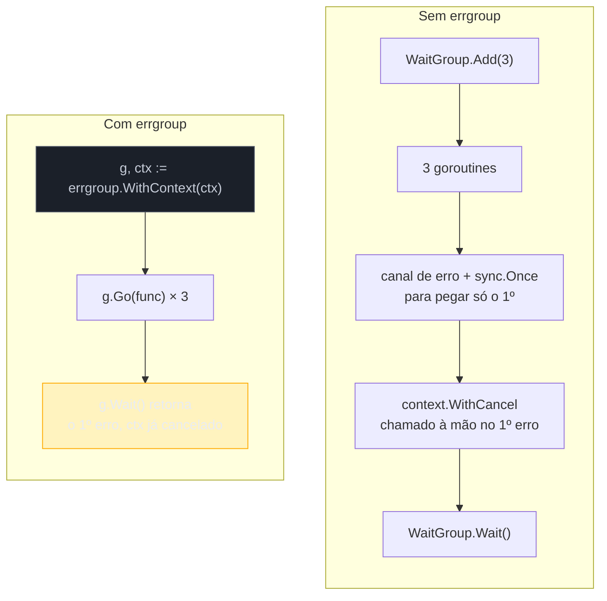
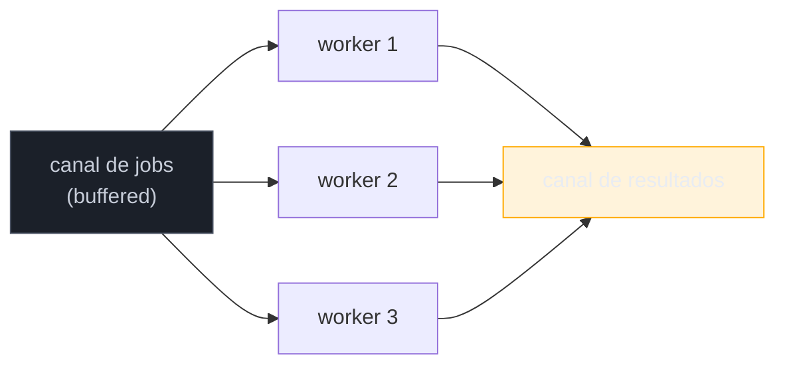
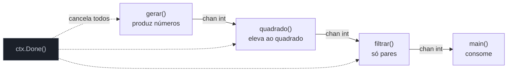

# Padrões de concorrência idiomáticos

> [!abstract] TL;DR
> `errgroup.Group` (pacote `golang.org/x/sync/errgroup`) resolve o problema que a [[07 - Padrões de cancelamento e timeout|nota 07]] deixou em aberto: disparar N goroutines, coletar o **primeiro erro** de qualquer uma delas, cancelar as demais via `context` e esperar todas terminarem — tudo com `WaitGroup` + `sync.Once` + canal de erro manuais substituídos por três chamadas de método. **Concorrência limitada** (bounded concurrency) evita que "disparar uma goroutine por item" vire uma fork bomb quando a lista tem 50 mil itens — um semáforo (canal com buffer, ou `errgroup.SetLimit`) trava o paralelismo num teto sensato. **Pipeline com cancelamento** encadeia estágios via canais, cada um lendo do canal do estágio anterior e escrevendo no do próximo, com o `context` — não um canal `done` dedicado — propagando "pare tudo" por toda a cadeia. Esta nota fecha o galho juntando os três num exemplo de produção: buscar URLs concorrentemente, limitado, com timeout e erro agregado.

## O problema que sobra depois do WaitGroup manual

A [[03 - WaitGroup e Once|nota 03]] ensinou o `WaitGroup` para esperar N goroutines terminarem. Funciona bem quando você só quer saber "todas acabaram" — mas e se uma delas falhar? `WaitGroup` não tem conceito de erro. Se três goroutines buscam três URLs e a segunda recebe um 500, o `WaitGroup.Wait()` não sabe disso: ele só conta `Add`/`Done`. Você precisa, à mão, de um canal de erros, um `sync.Once` para pegar só o primeiro, e um `context.WithCancel` para avisar as outras duas que já podem desistir.

Isso é exatamente o código que a comunidade Go escreveu tantas vezes que a equipe de ferramentas experimentais publicou um pacote para parar de reescrevê-lo: `golang.org/x/sync/errgroup`. Não é standard library — é um módulo sob o guarda-chuva `golang.org/x/`, mantido pelo próprio time do Go, e citado no [blog oficial](https://go.dev/blog/pipelines) e em código de produção do próprio Google. Na prática, tratado como "quase standard": qualquer projeto Go maduro que dispara goroutines concorrentes com necessidade de erro agregado o importa.



## errgroup na prática

`errgroup.Group` tem três operações essenciais. `errgroup.WithContext(ctx)` cria o grupo **e** devolve um `context` derivado — cancelado automaticamente assim que a primeira goroutine retornar um erro não-nulo. `g.Go(func() error)` dispara uma goroutine gerenciada pelo grupo. `g.Wait() error` bloqueia até todas terminarem e devolve o **primeiro** erro não-nulo (ou `nil` se todas tiverem sucesso) — sem precisar de canal, `sync.Once` nem `select` manual.

```go
import (
    "context"
    "fmt"
    "net/http"

    "golang.org/x/sync/errgroup"
)

func buscarTodas(ctx context.Context, urls []string) error {
    g, ctx := errgroup.WithContext(ctx) // ctx derivado, cancela no 1º erro

    for _, url := range urls {
        url := url // Go < 1.22 precisaria disso; ver callout abaixo
        g.Go(func() error {
            req, err := http.NewRequestWithContext(ctx, http.MethodGet, url, nil)
            if err != nil {
                return err
            }
            resp, err := http.DefaultClient.Do(req)
            if err != nil {
                return fmt.Errorf("buscar %s: %w", url, err)
            }
            defer resp.Body.Close()
            if resp.StatusCode != http.StatusOK {
                return fmt.Errorf("buscar %s: status %d", url, resp.StatusCode)
            }
            return nil
        })
    }

    return g.Wait() // primeiro erro de qualquer goroutine, ou nil
}
```

> [!info] Loop variable — Go 1.22+
> Antes do Go 1.22, cada iteração de `for _, url := range urls` reutilizava a **mesma variável** `url` — capturá-la direto na closure de `g.Go` faria todas as goroutines lerem o valor da última iteração (bug clássico). A linha `url := url` (sombrear a variável dentro do loop) era o remédio padrão. A partir da [Go 1.22](https://go.dev/blog/loopvar-preview), cada iteração do `for` ganha sua **própria** variável — o sombreamento vira redundante. Código legado ainda faz `url := url` por hábito ou por precisar compilar contra `go.mod` mais antigo; se seu `go.mod` já declara `go 1.22` ou superior, pode remover.

Se `g.Wait()` devolve erro, `ctx` já foi cancelado — qualquer goroutine restante que respeite `ctx.Done()` (como `http.NewRequestWithContext` respeita, via o `http.Client` checando o contexto da requisição) já está encerrando. Não é preciso chamar `cancel()` manualmente: o `context` de `errgroup.WithContext` se cancela sozinho quando a primeira goroutine falha, e o `defer cancel()` que normalmente acompanha um `context.WithCancel` (nota 06) é interno ao pacote — a API do `errgroup` não expõe (nem exige) essa função de cancelamento pra você.

> [!warning] `g.Wait()` só devolve o PRIMEIRO erro — os outros somem
> Se três goroutines falham simultaneamente, `g.Wait()` devolve o erro da primeira a retornar — as outras duas são descartadas silenciosamente. Isso é aceitável na maioria dos casos ("já sei que algo deu errado, não preciso da lista completa"), mas se o requisito for **agregar todos os erros** (relatório de quais URLs falharam, por exemplo), `errgroup` não é a ferramenta certa — volte a um canal de erros coletando tudo, ou use um `[]error` protegido por mutex dentro de cada goroutine, sem depender do retorno de `g.Wait()`.

## Concorrência limitada: o semáforo

O exemplo acima dispara uma goroutine por URL — ótimo para 3 URLs, perigoso para 3.000. Cada goroutine abre uma conexão HTTP; sem limite, você satura o servidor remoto, esgota file descriptors locais, ou estoura limites de conexões simultâneas do próprio SO. **Concorrência limitada** (bounded concurrency) resolve isso: um teto no número de goroutines ativas ao mesmo tempo, mesmo que o trabalho total seja muito maior.

O padrão clássico usa um canal com buffer como **semáforo** — um token por vaga disponível:

```go
func buscarLimitado(ctx context.Context, urls []string, limite int) error {
    g, ctx := errgroup.WithContext(ctx)
    sem := make(chan struct{}, limite) // buffer = nº máximo de goroutines simultâneas

    for _, url := range urls {
        g.Go(func() error {
            sem <- struct{}{}        // adquire vaga (bloqueia se o buffer estiver cheio)
            defer func() { <-sem }() // libera vaga ao terminar

            req, err := http.NewRequestWithContext(ctx, http.MethodGet, url, nil)
            if err != nil {
                return err
            }
            resp, err := http.DefaultClient.Do(req)
            if err != nil {
                return err
            }
            defer resp.Body.Close()
            return nil
        })
    }

    return g.Wait()
}
```

`sem <- struct{}{}` só prossegue se houver espaço no buffer de `limite` posições; quando cheio, a goroutine bloqueia até alguma outra liberar via `<-sem` no `defer`. `struct{}` (struct vazia) é a escolha idiomática para o tipo do canal-semáforo porque não ocupa memória de payload — o canal serve só como contador de vagas, o valor em si é irrelevante.

> [!info] `errgroup.Group.SetLimit` — desde x/sync v0.3.0 (2023)
> Versões mais recentes de `errgroup` (a partir de `v0.3.0`, publicada em maio de 2023) expõem `g.SetLimit(n)` — chamado antes de qualquer `g.Go` — que faz o próprio grupo aplicar o limite, sem você gerenciar canal-semáforo à mão:
> ```go
> g, ctx := errgroup.WithContext(ctx)
> g.SetLimit(limite) // chamadas extras a g.Go bloqueiam até haver vaga
> for _, url := range urls {
>     g.Go(func() error { /* ... */ return nil })
> }
> return g.Wait()
> ```
> Mais conciso que o semáforo manual, e o padrão recomendado hoje quando o único requisito é "N por vez". O semáforo manual continua valendo a pena quando o limite precisa ser compartilhado entre múltiplos `errgroup.Group` diferentes, ou quando parte do código não usa `errgroup` de jeito nenhum.

Outra forma comum do mesmo princípio é o **worker pool**: N goroutines fixas lendo de um canal de trabalho compartilhado, em vez de uma goroutine por item lutando por um semáforo.



```go
func workerPool(ctx context.Context, jobs <-chan string, nWorkers int) <-chan error {
    results := make(chan error)
    var wg sync.WaitGroup

    for i := 0; i < nWorkers; i++ {
        wg.Add(1)
        go func() {
            defer wg.Done()
            for job := range jobs { // termina quando 'jobs' fecha
                select {
                case <-ctx.Done():
                    return
                case results <- processar(ctx, job):
                }
            }
        }()
    }

    go func() {
        wg.Wait()
        close(results)
    }()

    return results
}
```

A diferença estrutural entre semáforo e worker pool: o semáforo dispara N goroutines por item, limitando **quantas rodam ao mesmo tempo**; o worker pool dispara exatamente `nWorkers` goroutines de longa duração, que **consomem** itens de um canal até ele fechar. Para volumes muito grandes (milhões de itens), worker pool evita o custo de criar e destruir uma goroutine por item — mas para volumes moderados, o semáforo com `errgroup` é mais simples de ler e depurar.

## Pipeline com cancelamento

Um **pipeline** encadeia estágios de processamento via canais: o estágio A produz valores, o estágio B lê o que A produz e produz algo novo, o estágio C consome o que B produz. É o mesmo modelo mental de um pipe de shell (`cat arquivo | grep termo | wc -l`), só que cada `|` é um canal Go e cada comando é uma goroutine. O [blog oficial do Go sobre pipelines](https://go.dev/blog/pipelines) formaliza esse padrão e é a referência canônica.



O problema que o pipeline "ingênuo" (sem cancelamento) tem: se o consumidor final (`main`) parar de ler antes do produtor terminar de gerar — porque achou o que precisava, ou porque algo deu errado adiante — o estágio gerador fica bloqueado para sempre tentando escrever num canal que ninguém mais lê. Isso é uma **goroutine leak**: a goroutine nunca termina, nunca é coletada pelo GC (ela está "viva", só presa em `send` bloqueado), e o processo acumula uma a cada pipeline abandonado.

A solução idiomática, coerente com a [[07 - Padrões de cancelamento e timeout|nota 07]], é fazer **todo** estágio observar `ctx.Done()` num `select` ao lado de cada operação de canal — nunca um `send`/`receive` isolado sem alternativa de saída:

```go
func gerar(ctx context.Context, nums ...int) <-chan int {
    out := make(chan int)
    go func() {
        defer close(out)
        for _, n := range nums {
            select {
            case out <- n:
            case <-ctx.Done():
                return // aborta o resto da geração
            }
        }
    }()
    return out
}

func quadrado(ctx context.Context, in <-chan int) <-chan int {
    out := make(chan int)
    go func() {
        defer close(out)
        for n := range in { // termina quando 'in' fecha (upstream abortou ou terminou)
            select {
            case out <- n * n:
            case <-ctx.Done():
                return
            }
        }
    }()
    return out
}

func filtrarPares(ctx context.Context, in <-chan int) <-chan int {
    out := make(chan int)
    go func() {
        defer close(out)
        for n := range in {
            if n%2 != 0 {
                continue
            }
            select {
            case out <- n:
            case <-ctx.Done():
                return
            }
        }
    }()
    return out
}
```

Cada estágio segue o mesmo esqueleto: `defer close(out)` garante que fechar o canal de saída propaga "acabou" para o próximo estágio (que sai do `for range` automaticamente); o `select` em todo envio garante que, se o consumidor desistir (via `ctx` cancelado), o estágio não fica preso num `send` sem ninguém do outro lado. `close(out)` em cascata, mais `ctx.Done()` em paralelo, são os dois mecanismos que junto fecham o pipeline inteiro — nunca um sozinho seria suficiente: `close` sem `ctx` não ajuda se o bloqueio é no meio da cadeia; `ctx` sem `close` deixaria o consumidor esperando um canal que nunca fecha.

```go
func main() {
    ctx, cancel := context.WithTimeout(context.Background(), 2*time.Second)
    defer cancel()

    nums := gerar(ctx, 1, 2, 3, 4, 5, 6)
    sq := quadrado(ctx, nums)
    pares := filtrarPares(ctx, sq)

    for v := range pares {
        fmt.Println(v) // 4, 16, 36
    }
}
```

> [!warning] Um canal sem estágio que o observe é um vazamento silencioso
> Se você cancela o `ctx` no meio de uma leitura em `main`, mas um dos estágios intermediários faz `out <- valor` sem `select`/`ctx.Done()` como alternativa, aquela goroutine trava para sempre — não aparece erro, não trava o programa (que continua rodando outras goroutines), só acumula memória e contagem de goroutines ao longo do tempo. É o tipo de vazamento que só aparece em produção, sob carga real e execução longa — `pprof` (assunto do galho de observabilidade) é a ferramenta que expõe isso depois do fato; o hábito de sempre incluir `ctx.Done()` em todo `select` de canal é a prevenção.

## Juntando tudo: exemplo de produção

O cenário: buscar o conteúdo de N URLs, no máximo `limite` concorrentes, com timeout global, parando tudo no primeiro erro e devolvendo os resultados bem-sucedidos até aquele ponto.

```go
package main

import (
    "context"
    "fmt"
    "io"
    "net/http"
    "time"

    "golang.org/x/sync/errgroup"
)

type Resultado struct {
    URL   string
    Bytes int
}

func buscarConcorrente(ctx context.Context, urls []string, limite int) ([]Resultado, error) {
    ctx, cancel := context.WithTimeout(ctx, 10*time.Second)
    defer cancel()

    g, ctx := errgroup.WithContext(ctx)
    g.SetLimit(limite)

    resultados := make([]Resultado, len(urls))

    for i, url := range urls {
        g.Go(func() error {
            req, err := http.NewRequestWithContext(ctx, http.MethodGet, url, nil)
            if err != nil {
                return fmt.Errorf("montar requisição para %s: %w", url, err)
            }

            resp, err := http.DefaultClient.Do(req)
            if err != nil {
                return fmt.Errorf("buscar %s: %w", url, err)
            }
            defer resp.Body.Close()

            corpo, err := io.ReadAll(resp.Body)
            if err != nil {
                return fmt.Errorf("ler corpo de %s: %w", url, err)
            }

            resultados[i] = Resultado{URL: url, Bytes: len(corpo)}
            return nil
        })
    }

    if err := g.Wait(); err != nil {
        return nil, fmt.Errorf("buscarConcorrente: %w", err)
    }
    return resultados, nil
}

func main() {
    urls := []string{
        "https://go.dev",
        "https://pkg.go.dev",
        "https://go.dev/blog",
    }

    resultados, err := buscarConcorrente(context.Background(), urls, 2)
    if err != nil {
        fmt.Println("erro:", err)
        return
    }
    for _, r := range resultados {
        fmt.Printf("%s: %d bytes\n", r.URL, r.Bytes)
    }
}
```

Cada peça vista nesta nota (e no galho inteiro) aparece aqui com um papel: `context.WithTimeout` (nota 06/07) limita o tempo total; `errgroup.WithContext` + `SetLimit` (esta nota) coordena goroutines, erro agregado e teto de concorrência; `resultados[i] = ...` escrever num índice pré-alocado — em vez de um canal de resultados — evita qualquer necessidade de mutex, porque cada goroutine só toca sua própria posição do slice (nenhuma leitura ou escrita concorrente na mesma posição de memória, então não há *data race* — o [[05 - O race detector|race detector]] confirmaria isso). É o tipo de decisão que só fica óbvia depois de já ter passado pelos padrões manuais mais verbosos das notas anteriores do galho.

## Armadilhas comuns

> [!warning] `g.SetLimit` depois do primeiro `g.Go` entra em pânico
> `SetLimit` precisa ser chamado **antes** de qualquer `g.Go`. Chamá-lo depois — por exemplo, dentro de um laço que já disparou algumas goroutines — produz `panic: errgroup: modify limit while goroutines are still running`. Trate `SetLimit` como parte da configuração inicial do grupo, sempre na linha logo após `errgroup.WithContext`, nunca condicional ou tardio.

> [!warning] `context.Background()` dentro de uma goroutine do grupo quebra o cancelamento
> É tentador, dentro do `func() error` passado a `g.Go`, usar `context.Background()` em vez do `ctx` derivado de `errgroup.WithContext` — principalmente em código copiado de outro lugar. Fazer isso desconecta aquela goroutine do mecanismo de cancelamento inteiro: ela nunca vai saber que uma irmã falhou, nunca respeita o timeout externo, e continua rodando (e, pior, pode continuar escrevendo em recursos que o resto do programa já considera fechados) mesmo depois de `g.Wait()` retornar. A regra é simples e absoluta: toda chamada bloqueante dentro de uma goroutine de `errgroup` usa o `ctx` que veio de `errgroup.WithContext`, nunca um `context` novo e desconectado.

> [!warning] Slice compartilhado sem índice fixo POR goroutine ainda é data race
> O exemplo de produção desta nota evita mutex porque cada goroutine escreve em `resultados[i]` — um índice **exclusivo**, calculado fora da goroutine, nunca recalculado nem compartilhado. Trocar isso por `resultados = append(resultados, r)` dentro de cada goroutine reintroduz a race: `append` pode realocar o slice inteiro, e duas goroutines lendo/escrevendo o mesmo header de slice (ponteiro, len, cap) ao mesmo tempo é exatamente o cenário que o [[05 - O race detector|race detector]] existe para pegar. Slice pré-alocado com índice fixo é seguro; slice crescendo via `append` dentro de goroutines concorrentes não é, mutex ou não.

## Vindo de outras linguagens

| Conceito | Java | Node.js | Python | Go |
|---|---|---|---|---|
| Erro agregado + cancelamento em grupo | `ExecutorService` + `Future.get()` em loop, ou `StructuredTaskScope` (JEP 505, preview) | `Promise.all` rejeita no 1º erro; `AbortController` propaga cancelamento | `asyncio.TaskGroup` (3.11+) cancela irmãs no 1º erro | `errgroup.Group` |
| Limitar concorrência | `Executors.newFixedThreadPool(n)` | `p-limit` (biblioteca externa) ou fila manual | `asyncio.Semaphore(n)` | canal-semáforo ou `g.SetLimit(n)` |
| Pipeline de estágios | `Stream` (mas não concorrente por padrão) | `stream.pipeline` (Node streams) | geradores encadeados, ou `asyncio.Queue` entre tasks | canais encadeados, cancelamento via `context` |

O paralelo mais próximo de `errgroup` é o `StructuredTaskScope` do Java (JEP 505, ainda em preview nas versões recentes do JDK) e o `asyncio.TaskGroup` do Python 3.11+: ambos nasceram da mesma dor — "disparei N tarefas, uma falhou, quero cancelar as outras e propagar só o primeiro erro" — décadas depois do Go ter estabilizado esse padrão como idiomático desde antes de `errgroup` existir formalmente (o padrão manual com `WaitGroup` + canal de erro já era comum).

## Como explicar em inglês

> `errgroup.Group` — from `golang.org/x/sync/errgroup`, not the standard library, but treated as near-standard in production Go — solves "fan out N goroutines, collect the first error, cancel the rest, wait for all to finish" in three calls: `errgroup.WithContext(ctx)` creates the group and a context that auto-cancels on first error; `g.Go(func() error)` launches a managed goroutine; `g.Wait() error` blocks and returns the first non-nil error. Bounded concurrency caps how many goroutines run simultaneously — either a buffered channel used as a semaphore, or the built-in `g.SetLimit(n)` available since `x/sync` v0.3.0. A pipeline chains processing stages through channels; the idiomatic cancellation pattern has every stage select on `ctx.Done()` alongside every channel send, so an abandoned consumer doesn't leave upstream goroutines leaked forever — closing channels alone isn't enough if the block happens mid-chain.

| Termo PT | Termo EN |
|---|---|
| concorrência limitada | bounded concurrency |
| semáforo (canal) | semaphore (channel) |
| worker pool | worker pool |
| vazamento de goroutine | goroutine leak |
| erro agregado | aggregated error |
| primeiro erro vence | first error wins |
| pipeline de estágios | staged pipeline |
| cancelar em cascata | cascading cancellation |

## O que vem a seguir

Este é o fim do Galho 9 — `sync`, `context`, `errgroup` e os padrões que os combinam já formam um vocabulário completo de concorrência de produção em Go. O próximo galho muda de plano inteiramente: o **Galho 10 — HTTP e frameworks web** parte do `context.Context` que esta nota tratou como mecanismo puro e mostra seu uso mais comum na prática — o contexto de uma requisição HTTP, propagado automaticamente por `net/http` a cada handler, carregando deadline, cancelamento e valores de request ao longo de toda a cadeia de middlewares.

## Veja também

- [[01 - Quando channels não bastam — o pacote sync|01 — Quando channels não bastam — o pacote sync]] — abertura do galho, `sync.Mutex` como alternativa a canal
- [[03 - WaitGroup e Once|03 — WaitGroup e Once]] — o `WaitGroup` manual que `errgroup` substitui
- [[05 - O race detector|05 — O race detector]] — confirma que `resultados[i] = ...` no exemplo final não tem data race
- [[06 - context.Context — deadline, cancel, values|06 — context.Context — deadline, cancel, values]] — mecanismo de `context` usado em toda esta nota
- [[07 - Padrões de cancelamento e timeout|07 — Padrões de cancelamento e timeout]] — `select` com `ctx.Done()`, base direta do pipeline aqui
- [[03-Dominios/Tecnologia/Go/index|Trilha Go]]

## Fontes

- The Go Authors. *Package errgroup*. pkg.go.dev. https://pkg.go.dev/golang.org/x/sync/errgroup (acessado em 2026-07-18)
- Sameer Ajmani. *Go Concurrency Patterns: Pipelines and cancellation*. go.dev/blog. https://go.dev/blog/pipelines (acessado em 2026-07-18)
- The Go Authors. *Go 1.22 Release Notes — for loop variable scoping*. go.dev. https://go.dev/blog/loopvar-preview (acessado em 2026-07-18)
- The Go Authors. *The Go Programming Language Specification*. go.dev. https://go.dev/ref/spec (acessado em 2026-07-18)
- Go by Example. *Worker Pools*. gobyexample.com. https://gobyexample.com/worker-pools (acessado em 2026-07-18)
- Go by Example. *Rate Limiting*. gobyexample.com. https://gobyexample.com/rate-limiting (acessado em 2026-07-18)

