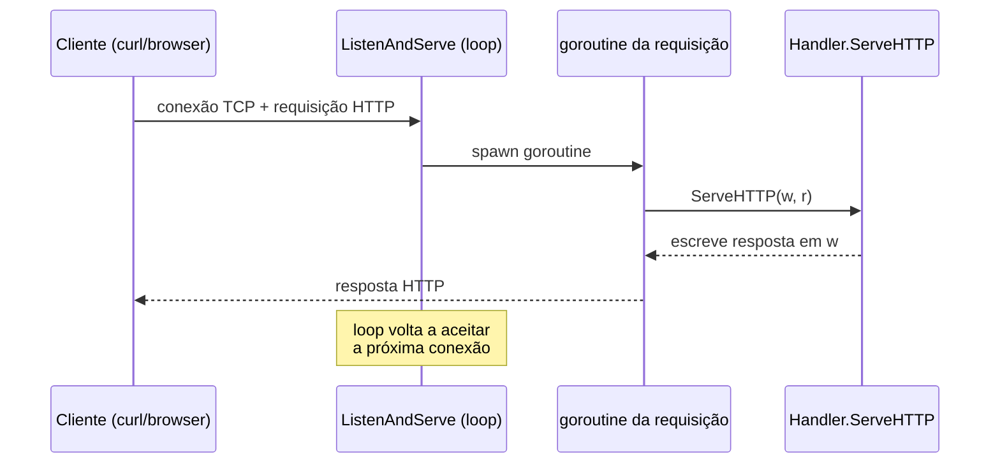
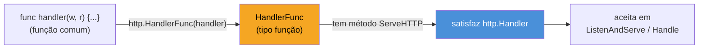

# O servidor HTTP da stdlib

> [!abstract] TL;DR
> `net/http` já é um servidor HTTP de produção sem framework nenhum. `http.ListenAndServe(":8080", handler)` abre a porta e serve requisições; o segundo argumento é qualquer valor que satisfaça a interface `http.Handler` — um único método, `ServeHTTP(w http.ResponseWriter, r *http.Request)`. `http.HandlerFunc` é um adaptador que transforma uma função comum `func(w, r)` num `Handler` de verdade, sem precisar declarar um tipo e um método só para isso. Não existe "registrar rota" mágico por trás de decorators ou anotações: é interface + composição, os mesmos mecanismos que o resto de Go usa em todo lugar. Frameworks como Gin, Chi e Echo (nota 05) não substituem isso — são construídos em cima, adicionando roteamento mais expressivo e conveniências.

## O cenário: um endpoint sem framework nenhum

Imagine que alguém pede "sobe uma API rapidinho, só um endpoint de health check". Em Node você reflexivamente pensa `npm install express`. Em Python, `pip install flask`. Em Java, provavelmente Spring Boot inteiro entra na dependência antes mesmo de você escrever a primeira rota.

Em Go, a pergunta "qual framework eu preciso?" tem uma resposta legítima: nenhum. A biblioteca padrão já resolve HTTP — não como MVP capenga que "serve pra prototipar", mas como servidor de produção real, usado por empresas grandes (o próprio time do Go recomenda `net/http` puro para muitos casos). Isso não é um detalhe de curiosidade: é a razão pela qual esta nota existe antes de qualquer framework aparecer no galho. Entender `net/http` primeiro é o que permite, mais adiante, enxergar exatamente o que Gin ou Chi estão adicionando — e o que não estão.

Um servidor mínimo, de verdade, cabe em poucas linhas:

```go
package main

import (
    "fmt"
    "log"
    "net/http"
)

func handler(w http.ResponseWriter, r *http.Request) {
    fmt.Fprintln(w, "Hello, Go!")
}

func main() {
    http.HandleFunc("/", handler)
    log.Fatal(http.ListenAndServe(":8080", nil))
}
```

Compile, rode, e `curl localhost:8080/` já responde. Sem `npm install`, sem `pip install`, sem dependência externa nenhuma — tudo isso é biblioteca padrão. É esse fato que justifica ler `net/http` antes de qualquer framework: os frameworks do galho inteiro (nota 05 em diante) são construídos *sobre* essas mesmas peças, não em substituição a elas.

## `ListenAndServe`: o loop que aceita conexões

`http.ListenAndServe(addr string, handler Handler) error` faz três coisas em sequência: abre um socket TCP no endereço `addr`, entra num loop infinito aceitando conexões, e para cada requisição chama `handler.ServeHTTP(w, r)` — numa goroutine nova, por requisição. Essa última parte é fácil de passar batido e vale nomear: **cada requisição HTTP em Go roda na sua própria goroutine**, criada automaticamente pelo servidor. Você não escreve `go` nenhum para isso — é o modelo de concorrência da stdlib, de graça.



`ListenAndServe` só retorna quando algo dá errado — porta ocupada, permissão negada, ou o servidor é encerrado (assunto de `Shutdown`, aprofundado na nota 08 sobre produção). É por isso que o padrão idiomático é `log.Fatal(http.ListenAndServe(...))`: o retorno normal dessa chamada é sempre um erro, então logar e sair é a reação correta.

O segundo argumento de `ListenAndServe` é `nil` no exemplo acima — e isso tem um significado específico: quando `handler` é `nil`, o servidor usa o `DefaultServeMux`, um roteador global embutido no pacote (`http.HandleFunc("/", handler)` registrou a rota nele, por trás das cenas). A nota 02 detalha o `ServeMux` — roteamento por padrão de path, e a revisão que o Go 1.22 trouxe para ele. Por ora, o que importa é que `nil` **não** significa "sem handler" — significa "use o roteador padrão do pacote".

> [!warning] `DefaultServeMux` é global e compartilhado entre pacotes
> Qualquer código no seu binário — inclusive uma dependência importada só para outro fim — pode chamar `http.HandleFunc` e registrar rota no mesmo `DefaultServeMux` que você está usando. Em serviços de produção, a prática recomendada é criar seu próprio `http.NewServeMux()` explícito e passá-lo como segundo argumento de `ListenAndServe`, em vez de depender do mux global implícito. A nota 02 retoma isso com o roteador dedicado.

## `http.Handler`: a interface de um único método

O segundo argumento de `ListenAndServe` não precisa ser uma função — precisa ser qualquer valor que satisfaça a interface `http.Handler`:

```go
type Handler interface {
    ServeHTTP(ResponseWriter, *Request)
}
```

Um método, dois parâmetros: `ResponseWriter` (para onde a resposta é escrita) e `*Request` (o que veio do cliente). É a interface inteira. Não há `GetRequest()`, não há `Init()`, não há ciclo de vida — só "dado um request, escreva uma resposta". Qualquer tipo do seu pacote que declare esse método vira, automaticamente, um handler válido (satisfação implícita de interface — Galho 3, se você já passou por lá).

Isso significa que um `Handler` pode ser um struct com estado próprio, não só uma função solta:

```go
type ContadorHandler struct {
    total int
}

func (c *ContadorHandler) ServeHTTP(w http.ResponseWriter, r *http.Request) {
    c.total++
    fmt.Fprintf(w, "requisição número %d\n", c.total)
}

func main() {
    h := &ContadorHandler{}
    http.Handle("/contador", h)
    log.Fatal(http.ListenAndServe(":8080", nil))
}
```

`ContadorHandler` carrega estado (`total`) entre requisições — algo que uma função solta não faria sem uma variável de pacote. É o mesmo padrão que aparece com bancos de dados, loggers ou configuração: um handler-struct guarda as dependências como campos e as usa dentro de `ServeHTTP`. A nota 04 (Middleware) constrói bastante em cima exatamente dessa capacidade.

## `http.HandlerFunc`: função vira handler sem declarar struct nenhum

Escrever um struct e um método `ServeHTTP` só para servir `"Hello, Go!"` seria burocracia demais para o caso comum. Por isso a stdlib expõe um adaptador:

```go
type HandlerFunc func(ResponseWriter, *Request)

func (f HandlerFunc) ServeHTTP(w ResponseWriter, r *Request) {
    f(w, r)
}
```

Repare no truque: `HandlerFunc` é um **tipo função nomeado** — a mesma técnica que a nota 02 do Galho 2 (Tipos nomeados e tipos definidos) já cobriu, só que aplicada a `func(...)` em vez de `float64` ou `struct`. E, como qualquer tipo nomeado do pacote, `HandlerFunc` pode ter métodos — inclusive `ServeHTTP`, que simplesmente chama `f` a si mesma. O resultado: qualquer função com a assinatura `func(w, r)`, convertida para `HandlerFunc`, passa a satisfazer `Handler`.



É isso que `http.HandleFunc("/", handler)` faz por trás dos panos: converte `handler` (uma função comum) em `HandlerFunc`, e registra esse valor — que já é um `Handler` de verdade — no mux. Os dois caminhos coexistem na API:

| | Assinatura registrada | O que aceita |
|---|---|---|
| `http.Handle(path, h)` | `h Handler` | qualquer valor com `ServeHTTP` — struct, `HandlerFunc`, etc. |
| `http.HandleFunc(path, f)` | `f func(w, r)` | função comum — convertida internamente para `HandlerFunc` |

> [!info] Go 1.22: `ServeMux` ganhou métodos HTTP e wildcards no path
> Até o Go 1.21, o `ServeMux` só casava por prefixo de path — `"/usuarios/"` casava qualquer coisa começando assim, sem diferenciar `GET` de `POST` nem capturar `{id}`. O Go 1.22 revisou o `ServeMux` para aceitar padrões como `"GET /usuarios/{id}"`, com `r.PathValue("id")` para ler o valor capturado — reduzindo bastante a razão histórica para "preciso de framework só para rotear". A nota 02 (Roteamento) detalha essa sintaxe nova.

## Casos práticos

**1. Múltiplos endpoints com `HandlerFunc`**, cada um lendo algo do `*Request`:

```go
package main

import (
    "encoding/json"
    "fmt"
    "log"
    "net/http"
)

func health(w http.ResponseWriter, r *http.Request) {
    w.WriteHeader(http.StatusOK)
    fmt.Fprintln(w, "ok")
}

func saudacao(w http.ResponseWriter, r *http.Request) {
    nome := r.URL.Query().Get("nome")
    if nome == "" {
        nome = "mundo"
    }
    w.Header().Set("Content-Type", "application/json")
    json.NewEncoder(w).Encode(map[string]string{
        "mensagem": fmt.Sprintf("Olá, %s!", nome),
    })
}

func main() {
    http.HandleFunc("/health", health)
    http.HandleFunc("/saudacao", saudacao)

    log.Println("servindo em :8080")
    log.Fatal(http.ListenAndServe(":8080", nil))
}
```

`curl localhost:8080/saudacao?nome=Josenaldo` responde `{"mensagem":"Olá, Josenaldo!"}`. Nenhuma dependência externa — `encoding/json`, `net/http` e `log` são tudo stdlib.

**2. Handler-struct com dependência injetada** — o padrão que escala para serviços reais, onde o handler precisa de um logger, um cliente de banco, ou configuração:

```go
type ServidorApp struct {
    logger *log.Logger
    versao string
}

func (s *ServidorApp) ServeHTTP(w http.ResponseWriter, r *http.Request) {
    s.logger.Printf("requisição: %s %s", r.Method, r.URL.Path)
    fmt.Fprintf(w, "versão %s\n", s.versao)
}

func main() {
    app := &ServidorApp{
        logger: log.Default(),
        versao: "1.0.0",
    }
    log.Fatal(http.ListenAndServe(":8080", app))
}
```

Aqui `app` inteiro é o `Handler` passado para `ListenAndServe` — sem `DefaultServeMux`, sem `HandleFunc`. Um único handler cuidando de tudo é incomum em serviços reais com múltiplas rotas (a nota 02 mostra o roteamento apropriado), mas o exemplo isola o que importa: `*ServidorApp` satisfaz `Handler` só por ter `ServeHTTP`, e carrega estado (`logger`, `versao`) como qualquer struct comum.

## Armadilhas comuns

> [!warning] Esquecer de escrever no `ResponseWriter` não gera erro — gera silêncio
> Se `ServeHTTP` retorna sem chamar `w.Write` (direto ou via `fmt.Fprintln`/`json.Encode`), o cliente recebe uma resposta `200 OK` vazia — sem panic, sem erro visível no log. É um bug silencioso comum em handler que tem um `if` sem `else` cobrindo todos os caminhos.

> [!warning] `w.WriteHeader` precisa vir antes de qualquer `Write`
> O status code só pode ser definido uma vez, e precisa ser a primeira coisa escrita na resposta. Chamar `w.Write(...)` antes de `w.WriteHeader(404)` já "trava" o status em `200` (o primeiro `Write` envia um `WriteHeader(200)` implícito) — a chamada explícita seguinte é ignorada, e o Go emite um aviso em `stderr` (`http: superfluous response.WriteHeader call`).

> [!warning] `ListenAndServe` sem timeouts é um risco em produção — mas não é assunto desta nota
> O exemplo mínimo desta nota (`http.ListenAndServe(":8080", nil)`) não define nenhum timeout de leitura/escrita, o que deixa o servidor vulnerável a conexões lentas segurando recursos (*Slowloris*). A configuração de `http.Server{}` com timeouts explícitos, limites de payload e graceful shutdown é o assunto inteiro da nota 08 (Servindo em produção) — não repita isso aqui, mas não escreva `net/http` "de verdade" em produção sem passar por aquela nota antes.

## Vindo de outra stack

| Vindo de | Reflexo | Em Go |
|---|---|---|
| Node/Express | `app.get('/x', (req, res) => ...)` | `http.HandleFunc("/x", func(w, r){...})` — sem framework, é a própria stdlib |
| Python/Flask | `@app.route('/x')` decorator | Nenhum decorator: registro explícito via chamada de função (`HandleFunc`) |
| Java/Spring | `@RestController` + DI container gerenciando o ciclo de vida | Handler-struct comum (caso prático 2) — sem container, dependências são campos passados na criação |
| Java/Servlet | `HttpServlet.doGet/doPost` — múltiplos métodos por verbo | Um único `ServeHTTP`; diferenciar por verbo é responsabilidade do roteador (nota 02) ou do próprio handler |

A comparação mais precisa não é com um framework de outra linguagem — é com o *servlet* de Java: ambos são "uma interface mínima que recebe request e escreve response", sem magia de anotação por baixo. A diferença é que `net/http` já inclui o servidor embutido; Java historicamente precisa de um container servlet (Tomcat, Jetty) separado para rodar o mesmo contrato.

## Como explicar em inglês

> Go's standard library ships a production-grade HTTP server out of the box — `http.ListenAndServe(addr, handler)` opens a TCP listener and spawns a goroutine per incoming request, calling `handler.ServeHTTP(w, r)` for each one. The `Handler` interface is deliberately tiny: a single method, `ServeHTTP(ResponseWriter, *Request)`. Anything with that method — a struct holding a database client, a logger, whatever state you need — satisfies `Handler` implicitly, no `implements` keyword required. For the common case of a plain function, `http.HandlerFunc` is an adapter: a named function type whose own `ServeHTTP` method just calls itself, letting `func(w, r)` slot in anywhere a `Handler` is expected. There's no decorator magic and no annotation scanning — routing and dispatch are ordinary Go values and interfaces, which is exactly what frameworks like Gin or Chi build on top of, not around.

| Termo PT | Termo EN |
|---|---|
| manipulador / handler | handler |
| escritor de resposta | response writer |
| requisição | request |
| roteador padrão | default mux / `DefaultServeMux` |
| goroutine por requisição | per-request goroutine |
| tipo função nomeado | named function type |
| encerramento gracioso | graceful shutdown |

## O que vem a seguir

Esta nota tratou de servir **um** handler, ou no máximo alguns registrados direto no `DefaultServeMux` via `HandleFunc`. Isso não escala para uma API real com dezenas de rotas, verbos diferentes e parâmetros de path. A [[02 - Roteamento|nota 02]] entra no `ServeMux` a fundo — incluindo a revisão do Go 1.22 com wildcards e métodos HTTP — antes de o galho chegar aos frameworks que resolvem roteamento de forma ainda mais expressiva.

## Veja também

- [[02 - Roteamento|02 — Roteamento]] — próxima nota do galho, `ServeMux` e wildcards de path (Go 1.22)
- [[05 - Frameworks — Gin, Chi, Echo|05 — Frameworks — Gin, Chi, Echo]] — o que esses frameworks adicionam sobre `net/http` puro
- [[08 - Servindo em produção — timeouts e limites|08 — Servindo em produção — timeouts e limites]] — `http.Server{}` com timeouts, limites de payload e graceful shutdown
- [[03-Dominios/Tecnologia/Go/index|Trilha Go]]

## Fontes

- The Go Authors. *Package net/http*. pkg.go.dev. https://pkg.go.dev/net/http (acessado em 2026-07-18)
- The Go Authors. *Writing Web Applications*. go.dev. https://go.dev/doc/articles/wiki/ (acessado em 2026-07-18)
- The Go Authors. *Go 1.22 Release Notes — Enhanced routing patterns*. go.dev. https://go.dev/doc/go1.22#net/http (acessado em 2026-07-18)
- Go by Example. *HTTP Servers*. gobyexample.com. https://gobyexample.com/http-servers (acessado em 2026-07-18)
- The Go Authors. *Effective Go — Interfaces and other types*. go.dev. https://go.dev/doc/effective_go#interfaces_and_types (acessado em 2026-07-18)
