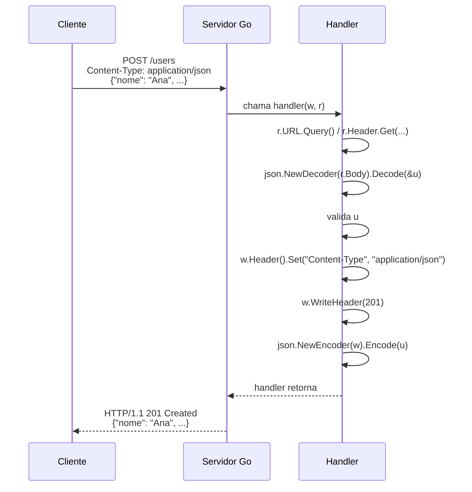

# Request e Response

> [!abstract] TL;DR
> Todo handler em Go recebe dois valores — `http.ResponseWriter` e `*http.Request` — e é neles que mora toda a conversa HTTP. **Ler** a requisição é sempre olhar campos e métodos já populados: `r.URL.Query()` para query string, `r.Header.Get(...)` para cabeçalhos, `json.NewDecoder(r.Body).Decode(&v)` para body JSON. **Escrever** a resposta é o inverso, e a ordem importa: cabeçalhos primeiro (`w.Header().Set`), depois status (`w.WriteHeader`), só então o corpo (`json.NewEncoder(w).Encode` ou `w.Write`) — porque `ResponseWriter` é um **stream**, não um objeto que você monta e envia no final. Não existe *auto-serialização* como em frameworks de outras linguagens: cada byte que sai pela rede passou por uma chamada explícita sua. `http.Error` cobre o caso comum de erro com uma linha só.

## O contrato que todo handler recebe

A nota anterior mostrou como registrar um handler no `ServeMux`. Mas o que exatamente esse handler recebe na mão, e o que ele pode fazer com isso?

```go
func handler(w http.ResponseWriter, r *http.Request) {
    // aqui dentro, tudo que existe é w e r
}
```

`r *http.Request` é a requisição já decodificada pelo servidor: método, URL, headers, body — tudo pronto para leitura. `w http.ResponseWriter` é o inverso: uma interface pela qual você **escreve** a resposta, byte a byte, sem nenhum objeto intermediário do tipo "monte a resposta e retorne".

Pense em `w` como um microfone ao vivo, não como um documento que você edita e salva. Assim que você chama `w.Write` (ou qualquer coisa que escreva nele, como `json.NewEncoder(w).Encode`), os bytes já estão indo para a rede — não há "desfazer" depois. Isso explica por que a ordem das chamadas em `w` é rígida, ao contrário de preencher campos de um struct em qualquer ordem: cabeçalhos precisam ser decididos **antes** do primeiro byte do corpo, porque HTTP manda os headers antes do body na conexão real.

## Lendo a requisição

### Query string

`r.URL` é um `*url.URL` já parseado. `r.URL.Query()` devolve um `url.Values` — na prática, um `map[string][]string`, porque uma query string pode repetir a mesma chave (`?tag=go&tag=web`):

```go
func buscarHandler(w http.ResponseWriter, r *http.Request) {
    q := r.URL.Query()
    termo := q.Get("q")        // primeiro valor de "q", ou "" se ausente
    tags := q["tag"]           // todos os valores repetidos de "tag"

    limite := 20
    if v := q.Get("limit"); v != "" {
        if n, err := strconv.Atoi(v); err == nil {
            limite = n
        }
    }

    fmt.Fprintf(w, "busca: %q, tags: %v, limite: %d", termo, tags, limite)
}
```

`Get` sempre devolve `string` — não há conversão automática para `int` ou `bool`. Quem vem de frameworks com *query param binding* automático (Spring, FastAPI) estranha o passo extra de `strconv.Atoi`, mas o ganho é que nunca existe mágica escondida validando tipos por trás das costas: o que o handler não converte explicitamente, fica string.

### Path parameters

Path parameters vêm do roteador — no `http.ServeMux` moderno (Go 1.22+), via `r.PathValue`:

> [!info] `r.PathValue` — Go 1.22+
> Antes do Go 1.22, o `ServeMux` da stdlib não suportava padrões como `/users/{id}` — era preciso um roteador de terceiros (assunto da [[05 - Frameworks — Gin, Chi, Echo|nota 05]]) só para isso. Desde 1.22, `mux.HandleFunc("GET /users/{id}", handler)` registra o padrão, e `r.PathValue("id")` lê o valor capturado dentro do handler — sem dependência externa.

```go
mux.HandleFunc("GET /users/{id}", func(w http.ResponseWriter, r *http.Request) {
    id := r.PathValue("id")
    fmt.Fprintf(w, "usuário: %s", id)
})
```

### Headers

`r.Header` é um `http.Header` (também um `map[string][]string` por baixo). `Get` normaliza o nome do cabeçalho automaticamente — `r.Header.Get("content-type")` e `r.Header.Get("Content-Type")` são equivalentes:

```go
func headerHandler(w http.ResponseWriter, r *http.Request) {
    ct := r.Header.Get("Content-Type")
    auth := r.Header.Get("Authorization")

    if ct != "application/json" {
        http.Error(w, "esperava application/json", http.StatusUnsupportedMediaType)
        return
    }

    fmt.Fprintf(w, "auth header presente: %v", auth != "")
}
```

> [!warning] `Authorization` aqui é só leitura de header — não é autenticação
> Ler `r.Header.Get("Authorization")` não valida token nenhum, é só string. Implementar validação de JWT/OAuth de verdade é assunto da trilha [[03-Dominios/Engenharia/Auth e Identidade/index|Auth e Identidade]] — este galho fica no transporte HTTP puro.

### Body: decodificando JSON

O corpo da requisição é `r.Body`, um `io.ReadCloser` — um stream de bytes, não uma string pronta. Para JSON, o padrão idiomático é `json.NewDecoder(r.Body).Decode(&v)`, que lê e decodifica em um único passo, sem carregar o body inteiro numa `[]byte` intermediária:

```go
type NovoUsuario struct {
    Nome  string `json:"nome"`
    Email string `json:"email"`
    Idade int    `json:"idade"`
}

func criarUsuarioHandler(w http.ResponseWriter, r *http.Request) {
    var u NovoUsuario
    if err := json.NewDecoder(r.Body).Decode(&u); err != nil {
        http.Error(w, "JSON inválido: "+err.Error(), http.StatusBadRequest)
        return
    }

    if u.Nome == "" || u.Email == "" {
        http.Error(w, "nome e email são obrigatórios", http.StatusUnprocessableEntity)
        return
    }

    // ... persistir u ...

    responderJSON(w, http.StatusCreated, u)
}
```

`Decode` lê `r.Body` até encontrar um valor JSON completo — não é preciso (nem recomendado) chamar `r.Body.Close()` manualmente em handlers HTTP comuns: o servidor da stdlib fecha o body automaticamente depois que o handler retorna. A exceção é código que faz *requisições de saída* com `http.Client`, onde `resp.Body.Close()` é obrigação sua — assunto da [[07 - Clientes HTTP|nota 07]].



> [!warning] `Decode` não valida schema, só sintaxe JSON
> `json.Decode` aceita `{"nome": "Ana"}` sem reclamar mesmo que `Email` fique como `""` (zero value). Campo ausente no JSON não é erro de decodificação — é um valor zero silencioso. Validação de negócio (campos obrigatórios, formatos, ranges) é sempre um passo manual depois do `Decode`, como no exemplo acima. Bibliotecas como `go-playground/validator` automatizam esse passo, mas não fazem parte da stdlib.

> [!question]- Por que `Decode(r.Body)` em vez de `json.Unmarshal(bytes, &v)`?
> As duas funções fazem a mesma coisa no fim — popular um struct a partir de JSON —, mas partem de entradas diferentes. `json.Unmarshal` recebe uma `[]byte` já completa na memória: para usá-la com uma requisição, seria preciso primeiro `io.ReadAll(r.Body)` para materializar o body inteiro, e só depois desserializar. `json.NewDecoder(r.Body).Decode(&v)` pula esse passo intermediário: lê direto do stream `r.Body` e desserializa incrementalmente, sem alocar um buffer do tamanho do body inteiro. Para bodies grandes, a diferença de alocação é real; para bodies pequenos (o caso comum de APIs REST), a escolha é mais estilística — mas `Decode` é o padrão idiomático em handlers HTTP justamente porque `r.Body` já chega como stream, sem motivo para materializá-lo à toa.

## Escrevendo a resposta

### Status e corpo em JSON

A stdlib não tem um `res.json(...)` de uma chamada só como Express — é composto de três passos, e a ordem é obrigatória:

```go
func responderJSON(w http.ResponseWriter, status int, dados any) {
    w.Header().Set("Content-Type", "application/json")
    w.WriteHeader(status)
    json.NewEncoder(w).Encode(dados)
}
```

1. **`w.Header().Set(...)`** — sempre antes de `WriteHeader`. Depois que os headers "saem pela porta", não dá mais para adicionar ou trocar nenhum.
2. **`w.WriteHeader(status)`** — envia a linha de status HTTP (`HTTP/1.1 201 Created`) junto com os headers acumulados até aqui. Chamado no máximo uma vez por resposta.
3. **`json.NewEncoder(w).Encode(dados)`** (ou `w.Write([]byte(...))`) — escreve o corpo, direto no stream de saída.

> [!warning] Esquecer `w.WriteHeader` não é erro — é 200 por padrão, silenciosamente
> Se o handler nunca chama `WriteHeader` e só escreve o corpo com `w.Write` ou `Encode`, Go injeta automaticamente `200 OK` no primeiro byte escrito. Isso é conveniente para o caminho feliz, mas é uma armadilha comum: um handler que decide retornar `404` mas esquece de chamar `w.WriteHeader(404)` antes de escrever o corpo manda `200 OK` com um corpo de erro — o cliente vê sucesso onde havia falha.

> [!warning] Chamar `w.WriteHeader` duas vezes gera um warning silencioso em runtime
> `http: superfluous response.WriteHeader call` aparece nos logs do servidor (não trava a aplicação) quando o handler chama `WriteHeader` mais de uma vez — normalmente sintoma de dois caminhos de erro que não têm `return` depois do primeiro. Sempre `return` logo após escrever uma resposta de erro.

### `http.Error` — o atalho para o caso comum

Para respostas de erro simples — status + mensagem de texto — a stdlib já embute o padrão inteiro numa função:

```go
func http.Error(w ResponseWriter, error string, code int)
```

`http.Error(w, "usuário não encontrado", http.StatusNotFound)` faz três coisas de uma vez: seta `Content-Type: text/plain; charset=utf-8`, chama `w.WriteHeader(404)`, e escreve a mensagem com uma quebra de linha no final. É o equivalente do `responderJSON` acima, só que para texto puro — por isso raramente vale escrever esse boilerplate à mão para erros:

```go
func buscarUsuarioHandler(w http.ResponseWriter, r *http.Request) {
    id := r.PathValue("id")
    u, ok := repositorio.Buscar(id)
    if !ok {
        http.Error(w, "usuário não encontrado", http.StatusNotFound)
        return
    }
    responderJSON(w, http.StatusOK, u)
}
```

Se a API precisa que **todo** corpo de erro também seja JSON (comum em APIs REST — assunto da [[06 - REST idiomático em Go|nota 06]]), `http.Error` não serve, porque ele sempre escreve texto puro. Nesse caso, o padrão é uma função de erro própria, espelhando `responderJSON`:

```go
type ErroAPI struct {
    Mensagem string `json:"erro"`
}

func responderErro(w http.ResponseWriter, status int, mensagem string) {
    responderJSON(w, status, ErroAPI{Mensagem: mensagem})
}
```

### `w.Write` vs `fmt.Fprintf` vs `json.Encoder` — todos são `io.Writer`

`http.ResponseWriter` embute `io.Writer` no seu conjunto de métodos — por isso qualquer função Go que sabe escrever num `io.Writer` genérico funciona direto em `w`, sem adaptador nenhum:

```go
w.Write([]byte("texto cru"))              // io.Writer.Write direto
fmt.Fprintf(w, "olá, %s", nome)           // fmt formata e escreve em w
json.NewEncoder(w).Encode(dados)          // json codifica e escreve em w, em stream
```

As três formas escrevem no mesmo stream de saída — a diferença é só quem monta os bytes antes de escrever. `json.NewEncoder(w).Encode` é preferível a `json.Marshal` seguido de `w.Write` pelo mesmo motivo que `Decode` é preferível a `Unmarshal` na leitura: evita materializar o JSON inteiro numa `[]byte` intermediária antes de mandar para a rede.

## Caso prático completo

Juntando leitura e escrita num handler só, um endpoint que recebe um usuário via JSON, valida, e responde de acordo:

```go
package main

import (
    "encoding/json"
    "net/http"
    "strconv"
)

type NovoUsuario struct {
    Nome  string `json:"nome"`
    Email string `json:"email"`
    Idade int    `json:"idade"`
}

func responderJSON(w http.ResponseWriter, status int, dados any) {
    w.Header().Set("Content-Type", "application/json")
    w.WriteHeader(status)
    json.NewEncoder(w).Encode(dados)
}

func criarUsuarioHandler(w http.ResponseWriter, r *http.Request) {
    var u NovoUsuario
    if err := json.NewDecoder(r.Body).Decode(&u); err != nil {
        http.Error(w, "JSON inválido: "+err.Error(), http.StatusBadRequest)
        return
    }
    if u.Nome == "" || u.Email == "" {
        http.Error(w, "nome e email são obrigatórios", http.StatusUnprocessableEntity)
        return
    }

    // query string opcional: ?notificar=true
    notificar := r.URL.Query().Get("notificar") == "true"
    _ = notificar // usado por algum serviço de notificação real, aqui só ilustrativo

    responderJSON(w, http.StatusCreated, u)
}

func main() {
    mux := http.NewServeMux()
    mux.HandleFunc("POST /users", criarUsuarioHandler)
    http.ListenAndServe(":8080", mux)
}
```

Rodando `curl -X POST localhost:8080/users -d '{"nome":"Ana","email":"ana@x.com","idade":30}'`, a resposta é `201 Created` com o JSON de volta. Removendo `email` do corpo, a resposta vira `422 Unprocessable Entity` com `{"erro": ...}` — se você trocar `http.Error` por `responderErro` — ou texto puro, se deixar `http.Error` como está.

## Armadilhas comuns

> [!warning] `r.Body` só pode ser lido uma vez
> `r.Body` é um stream — depois de `Decode` (ou qualquer leitura), ele está exaurido. Chamar `Decode` de novo, ou tentar ler `r.Body` outra vez num middleware seguinte, devolve `EOF` ou um struct vazio, não um erro óbvio. Se múltiplas camadas (por exemplo, um middleware de log que quer inspecionar o body) precisam ler o mesmo corpo, é preciso ler para um `[]byte` com `io.ReadAll` e reatribuir `r.Body = io.NopCloser(bytes.NewReader(dados))` para quem vem depois.

> [!warning] Body sem limite de tamanho é vetor de negação de serviço
> `json.NewDecoder(r.Body).Decode(&v)` lê o body inteiro sem limite nenhum por padrão — um cliente malicioso pode mandar gigabytes num único POST. `http.MaxBytesReader(w, r.Body, limite)` (ou `r.Body = http.MaxBytesReader(...)`) impõe um teto e faz o `Decode` falhar cedo quando ultrapassado. Isso entra no rol maior de proteção do servidor em produção — timeouts, limites de conexão, `ReadHeaderTimeout` — assunto completo da [[08 - Servindo em produção — timeouts e limites|nota 08]].

> [!warning] Esquecer `Content-Type` na resposta não quebra, mas confunde clientes
> Se `w.Header().Set("Content-Type", "application/json")` for omitido, Go tenta adivinhar o tipo pelos primeiros bytes escritos (via `http.DetectContentType`), o que costuma funcionar para JSON mas não é garantia — e alguns clientes HTTP rigorosos rejeitam corpo sem `Content-Type` explícito. Sempre declare.

## Lente cross-stack

| Vindo de | Ler query/header | Decodificar body | Escrever resposta |
|---|---|---|---|
| **Java (Spring)** | `@RequestParam`, `@RequestHeader` — binding automático por anotação | `@RequestBody` desserializa via Jackson, automático | `return ResponseEntity.status(201).body(obj)` — um objeto, a serialização é escondida |
| **Node (Express)** | `req.query`, `req.headers` — já parseados como objeto JS | `req.body` (com `express.json()` como middleware) | `res.status(201).json(obj)` — uma chamada encadeada |
| **Python (FastAPI)** | parâmetros de função com type hints — binding automático | corpo desserializado direto em modelo Pydantic | `return obj` — FastAPI serializa e seta status pelo decorator |
| **Go** | `r.URL.Query().Get(...)`, `r.Header.Get(...)` — string crua, sem binding | `json.NewDecoder(r.Body).Decode(&v)` — explícito | `w.Header()`, `w.WriteHeader()`, `json.NewEncoder(w).Encode()` — três passos, nesta ordem |

O padrão em Go não é pior — é mais explícito e mais barato em alocação (streaming em vez de buffer intermediário), ao custo de escrever esse "boilerplate" de três linhas você mesmo, ou envolvê-lo numa função helper como `responderJSON` acima. Frameworks como Gin, tema da [[05 - Frameworks — Gin, Chi, Echo|próxima nota]], reintroduzem parte dessa conveniência (`c.JSON(201, obj)`) por cima da mesma stdlib.

## Como explicar em inglês

> In Go, every handler receives an `http.ResponseWriter` and an `*http.Request`, and all request/response handling happens through them explicitly — there's no automatic serialization layer. Reading a request means calling into already-parsed fields: `r.URL.Query()` for query parameters, `r.Header.Get(...)` for headers, and `json.NewDecoder(r.Body).Decode(&v)` to stream-decode a JSON body. Writing a response is a strict three-step sequence — set headers, call `w.WriteHeader(status)`, then write the body — because `ResponseWriter` is a stream: once bytes go out, headers can no longer change. Forgetting `WriteHeader` silently defaults to `200 OK`, which is a common source of bugs when an error path forgets to set its status explicitly. `http.Error` is the one-line shortcut for plain-text error responses.

| Termo PT | Termo EN |
|---|---|
| corpo da requisição | request body |
| decodificar | decode |
| codificar / serializar | encode |
| cabeçalho | header |
| query string | query string |
| escrever no stream de resposta | write to the response stream |
| status code | status code |
| body exaurido / já consumido | body drained / already consumed |

## O que vem a seguir

Handlers individuais fazem sentido lidos um a um — mas repetir "logar a requisição", "checar autenticação" e "recuperar de panics" dentro de cada handler não escala. A [[04 - Middleware|próxima nota]] mostra como envolver `http.Handler` em camadas reutilizáveis, aplicadas uma vez e compartilhadas por todas as rotas.

## Veja também

- [[01 - O servidor HTTP da stdlib|01 — O servidor HTTP da stdlib]] — `http.ResponseWriter` e `*http.Request` introduzidos pela primeira vez
- [[02 - Roteamento|02 — Roteamento]] — `r.PathValue` e os padrões de rota do `ServeMux` moderno
- [[04 - Middleware|04 — Middleware]] — próxima nota do galho
- [[06 - REST idiomático em Go|06 — REST idiomático em Go]] — convenções de status code e formato de erro em JSON aplicadas de forma consistente
- [[07 - Clientes HTTP|07 — Clientes HTTP]] — o lado inverso: fazer requisições e fechar `resp.Body`
- [[08 - Servindo em produção — timeouts e limites|08 — Servindo em produção — timeouts e limites]] — `MaxBytesReader` e limites de tamanho de body em profundidade
- [[03-Dominios/Tecnologia/Go/index|Trilha Go]]

## Fontes

- The Go Authors. *Package net/http*. pkg.go.dev. https://pkg.go.dev/net/http (acessado em 2026-07-18)
- The Go Authors. *Package encoding/json*. pkg.go.dev. https://pkg.go.dev/encoding/json (acessado em 2026-07-18)
- The Go Authors. *JSON and Go*. go.dev/blog. https://go.dev/blog/json (acessado em 2026-07-18)
- Go by Example. *JSON*. gobyexample.com. https://gobyexample.com/json (acessado em 2026-07-18)
- Go by Example. *HTTP Servers*. gobyexample.com. https://gobyexample.com/http-servers (acessado em 2026-07-18)
- The Go Authors. *Go 1.22 Release Notes — Enhanced routing patterns*. go.dev. https://go.dev/doc/go1.22#enhanced_routing_patterns (acessado em 2026-07-18)
