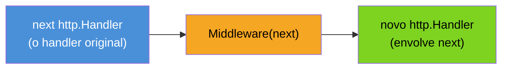
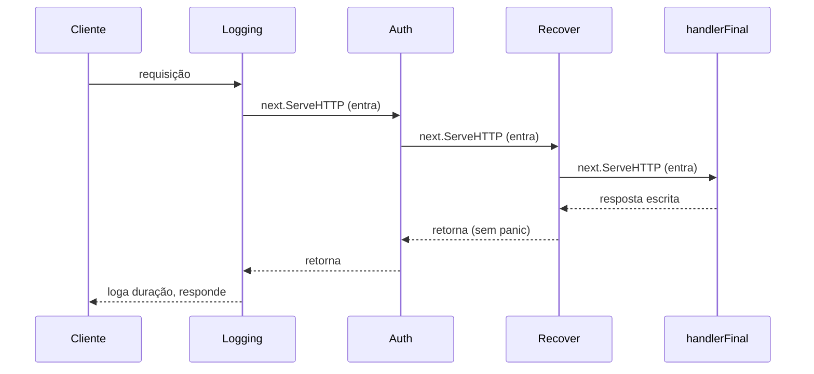
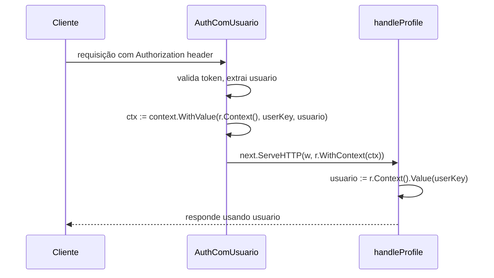

# Middleware

> [!abstract] TL;DR
> Um **middleware** em Go, sem framework nenhum, é só uma função com a assinatura `func(http.Handler) http.Handler`: recebe um handler, devolve outro handler que faz algo antes e/ou depois de chamar o original. Não é decorator escondido nem AOP declarativo — é composição de funções pura, do mesmo jeito que qualquer `func(func) func` em Go. Encadear vários middlewares (logging, auth, recover) é aninhar chamadas — `logging(auth(recover(handlerFinal)))` — e a ordem do encadeamento define a ordem de execução, de fora para dentro na entrada e de dentro para fora na saída. Para passar dados de um middleware para o handler seguinte (usuário autenticado, request ID), a ferramenta certa é `context.Context` com chaves tipadas — nunca uma chave `string` crua, que colide silenciosamente entre pacotes.

## O cenário: toda rota precisa logar, autenticar e não derrubar o servidor

A nota anterior mostrou como ler um `http.Request` e escrever um `http.ResponseWriter`. Mas imagine uma API real com dez rotas — `/users`, `/orders`, `/products`, e por aí vai. Toda rota, sem exceção, precisa:

1. Logar método, path e duração da requisição.
2. Verificar se existe um token válido no header `Authorization`, antes de deixar o handler rodar.
3. Recuperar de um `panic` dentro do handler, para que um bug numa rota não derrube o processo inteiro.

A saída ingênua é colar essas três coisas no início de cada handler:

```go
func handleUsers(w http.ResponseWriter, r *http.Request) {
    start := time.Now()
    log.Printf("%s %s", r.Method, r.URL.Path)

    token := r.Header.Get("Authorization")
    if token == "" {
        http.Error(w, "unauthorized", http.StatusUnauthorized)
        return
    }

    defer func() {
        if err := recover(); err != nil {
            http.Error(w, "internal error", http.StatusInternalServerError)
        }
    }()

    // ... lógica de verdade de /users, finalmente

    log.Printf("levou %v", time.Since(start))
}
```

Dez rotas, dez cópias desse bloco. Muda uma regra de log — muda em dez lugares. É o problema clássico que frameworks como Express (Node) ou Flask (Python) resolvem com *middleware*: uma camada que envolve o handler e roda esse código repetido uma vez só, num lugar central. A pergunta que interessa aqui é: como Go resolve isso sem framework nenhum, usando só o que `net/http` já oferece?

## O mecanismo: `func(http.Handler) http.Handler`

Um middleware em Go é uma função com um formato bem específico — recebe um `http.Handler` e devolve outro `http.Handler`:

```go
func Middleware(next http.Handler) http.Handler {
    return http.HandlerFunc(func(w http.ResponseWriter, r *http.Request) {
        // código ANTES de chamar next
        next.ServeHTTP(w, r)
        // código DEPOIS de chamar next
    })
}
```

Não há truque nenhum aqui além do que a nota 01 já estabeleceu: `http.Handler` é uma interface de um método (`ServeHTTP(w, r)`), e `http.HandlerFunc` é o adaptador que transforma uma função `func(w, r)` comum nesse tipo. Um middleware pega o handler "de dentro" (`next`, o que roda depois), fecha ele numa clausura, e devolve um handler novo que decide **quando** — e **se** — chamar `next.ServeHTTP(w, r)`.



Um exemplo concreto, resolvendo só o log:

```go
func Logging(next http.Handler) http.Handler {
    return http.HandlerFunc(func(w http.ResponseWriter, r *http.Request) {
        start := time.Now()
        next.ServeHTTP(w, r)
        log.Printf("%s %s levou %v", r.Method, r.URL.Path, time.Since(start))
    })
}
```

`Logging` não sabe nada sobre `/users` nem sobre nenhuma rota específica — ele só sabe que existe um `next` a chamar, e que quer medir o tempo em volta dessa chamada. Isso é o que o torna reutilizável: dá para aplicar `Logging` em qualquer handler, de qualquer rota, sem reescrever a lógica de tempo em lugar nenhum.

Quem vem de Python reconhece o formato: é exatamente um *decorator*, só que sem a sintaxe `@` — em Go, você aplica a função manualmente, `Logging(handlerFinal)`, em vez de anotar a declaração do handler.

> [!question]- Por que retornar `http.HandlerFunc(func(...) {...})` e não uma função crua?
> Porque `http.Handler` é uma **interface**, e uma função `func(w, r)` sozinha não satisfaz interface nenhuma — Go não converte automaticamente. `http.HandlerFunc` é um tipo definido (`type HandlerFunc func(http.ResponseWriter, *http.Request)`) que implementa `ServeHTTP` chamando a si mesmo; envolver a clausura nele é o que faz o compilador aceitar o retorno como `http.Handler`. Sem esse envoltório, `return func(w, r) {...}` não compila contra a assinatura `func(http.Handler) http.Handler`.

## Encadeando middlewares

Um middleware sozinho já ajuda, mas o ganho de verdade aparece quando você empilha vários — logging, depois auth, depois recover — todos envolvendo o mesmo handler final. Como cada middleware é `func(http.Handler) http.Handler`, encadear é só **compor funções**, aninhando uma chamada dentro da outra:

```go
handler := Logging(Auth(Recover(handlerFinal)))
```



A leitura da ordem exige atenção: `Logging(Auth(Recover(handlerFinal)))` executa **de fora para dentro** na entrada — primeiro o código de `Logging` antes de `next.ServeHTTP`, depois o de `Auth` antes de `next.ServeHTTP`, depois o de `Recover`, e só então `handlerFinal` roda. Na saída, a ordem inverte: **de dentro para fora** — o código depois de `next.ServeHTTP` em `Recover` roda primeiro, depois o de `Auth`, depois o de `Logging`. É exatamente o comportamento de uma pilha, e é o mesmo raciocínio que você já usa com `defer` dentro de uma função — só que aqui a "pilha" é montada em tempo de composição, não em tempo de execução.

Isso importa na prática: se `Recover` estiver **fora** de `Auth` na cadeia (`Recover(Auth(handlerFinal))`), um `panic` dentro de `Auth` também é capturado. Se estiver **dentro** (como no exemplo acima), um `panic` em `Auth` escapa sem ser recuperado. A ordem do encadeamento não é só estilo — muda o que cada middleware consegue enxergar.

### `Chain`: uma função para não empilhar parênteses à mão

Encadear manualmente funciona, mas com quatro ou cinco middlewares o aninhamento de parênteses fica difícil de ler. Uma função `Chain` — helper comum em código Go idiomático, sem precisar de framework — resolve isso com um loop simples:

```go
type Middleware func(http.Handler) http.Handler

func Chain(h http.Handler, mws ...Middleware) http.Handler {
    for i := len(mws) - 1; i >= 0; i-- {
        h = mws[i](h)
    }
    return h
}
```

```go
handler := Chain(handlerFinal, Logging, Auth, Recover)
// equivalente a Logging(Auth(Recover(handlerFinal)))
```

O loop percorre a lista de trás para frente porque cada `mws[i](h)` precisa envolver o handler já composto pelas iterações anteriores — o último middleware da lista (`Recover`) é o primeiro a envolver `handlerFinal`, e o primeiro da lista (`Logging`) acaba sendo a camada mais externa. `Chain(handlerFinal, Logging, Auth, Recover)` lê na ordem natural — "aplica Logging, depois Auth, depois Recover" — sem o leitor precisar desenrolar parênteses aninhados de dentro para fora.

## Casos práticos

**1. `Recover` — middleware que impede um `panic` de derrubar o servidor inteiro:**

```go
func Recover(next http.Handler) http.Handler {
    return http.HandlerFunc(func(w http.ResponseWriter, r *http.Request) {
        defer func() {
            if err := recover(); err != nil {
                log.Printf("panic recuperado: %v", err)
                http.Error(w, "internal server error", http.StatusInternalServerError)
            }
        }()
        next.ServeHTTP(w, r)
    })
}
```

> [!info] Isso não é opcional em produção
> Sem um middleware de `recover`, um `panic` não tratado dentro de um handler mata a goroutine daquela requisição — e, dependendo de onde o panic acontece, pode derrubar o processo inteiro do servidor. `net/http` já recupera panics na goroutine de cada requisição por padrão (desde as versões antigas da stdlib), mas sem logar nada de útil nem controlar o formato da resposta de erro. Um middleware de `Recover` próprio garante que toda falha vira um log estruturado e uma resposta HTTP previsível, em vez de uma conexão simplesmente fechada sem explicação.

**2. `Auth` — validação de um token simples antes de deixar a requisição passar:**

```go
func Auth(next http.Handler) http.Handler {
    return http.HandlerFunc(func(w http.ResponseWriter, r *http.Request) {
        token := r.Header.Get("Authorization")
        if token == "" || !tokenValido(token) {
            http.Error(w, "unauthorized", http.StatusUnauthorized)
            return // não chama next.ServeHTTP — a cadeia para aqui
        }
        next.ServeHTTP(w, r)
    })
}
```

O `return` sem chamar `next.ServeHTTP` é o ponto central: um middleware não é obrigado a deixar a requisição avançar. `Auth` decide, sozinho, se `handlerFinal` (e qualquer middleware mais interno) chega a rodar.

**3. Passando dados entre middleware e handler via `context.Context`:**

O `Auth` do exemplo anterior sabe se o token é válido — mas não entrega *quem* é o usuário autenticado para o handler seguinte. A ferramenta certa para isso, em Go, não é uma variável global nem um campo extra no `Request` — é `context.Context`, já presente em todo `*http.Request` via `r.Context()`.

```go
type contextKey int

const userKey contextKey = iota

func AuthComUsuario(next http.Handler) http.Handler {
    return http.HandlerFunc(func(w http.ResponseWriter, r *http.Request) {
        token := r.Header.Get("Authorization")
        usuario, err := validarEExtrairUsuario(token)
        if err != nil {
            http.Error(w, "unauthorized", http.StatusUnauthorized)
            return
        }

        ctx := context.WithValue(r.Context(), userKey, usuario)
        next.ServeHTTP(w, r.WithContext(ctx))
    })
}

func handleProfile(w http.ResponseWriter, r *http.Request) {
    usuario, ok := r.Context().Value(userKey).(string)
    if !ok {
        http.Error(w, "usuário não encontrado no contexto", http.StatusInternalServerError)
        return
    }
    fmt.Fprintf(w, "perfil de %s", usuario)
}
```

Duas peças merecem atenção aqui. Primeiro, `r.WithContext(ctx)` — `*http.Request` é imutável no sentido de que você não altera o contexto de um request existente; `WithContext` devolve uma **cópia** do request com o novo contexto, e é essa cópia que precisa ser passada para `next.ServeHTTP`, nunca o `r` original. Segundo, a chave usada em `context.WithValue` é do tipo `contextKey` (um `int` nomeado), não uma `string` crua — é o assunto da próxima seção.



## Por que chave tipada, e não `string`

`context.WithValue(ctx, "user", usuario)` compila e funciona — até o dia em que outro pacote, sem saber do seu código, também usa a chave `"user"` para guardar algo completamente diferente no mesmo contexto. Como `string` é um tipo comparável e sem namespace nenhum, duas chaves `"user"` vindas de pacotes diferentes são **a mesma chave** do ponto de vista de `context.Context` — uma sobrescreve silenciosamente a outra, sem erro de compilação nem panic em tempo de execução. É um bug de colisão que só aparece em produção, difícil de reproduzir.

A [documentação oficial do pacote `context`](https://pkg.go.dev/context#WithValue) recomenda explicitamente evitar esse risco: definir um tipo próprio e não-exportado para a chave (`type contextKey int`, como no exemplo acima), de forma que nenhum outro pacote — nem mesmo um que também declare `type contextKey int` — consiga colidir por acidente, porque tipos definidos em pacotes diferentes são tipos diferentes mesmo com o mesmo nome e o mesmo underlying type.

| | Chave `string` | Chave tipada (`type contextKey int`) |
|---|---|---|
| Risco de colisão entre pacotes | Alto — mesma string, mesma chave | Nenhum — tipo é local ao pacote que a declarou |
| Erro em tempo de compilação se usar chave errada | Não | Não (o valor ainda é `any`) |
| Recomendação oficial | Evitar | [Padrão documentado](https://pkg.go.dev/context#WithValue) |

> [!warning] `context.Context` não é lugar para todo tipo de estado
> A documentação do pacote é explícita: valores de contexto devem carregar dados de **escopo de requisição** (o usuário autenticado, um request ID, um trace ID) — não parâmetros opcionais de função nem estado de negócio que deveria estar em argumentos explícitos. Se você se pega guardando meia dúzia de valores distintos num único `context.Context` para "economizar" parâmetros, é sinal de que uma struct de configuração passada explicitamente resolveria melhor — e de forma bem mais fácil de rastrear lendo a assinatura da função.

## Armadilhas comuns

> [!warning] Esquecer de chamar `next.ServeHTTP` — a requisição trava
> Se um middleware não chama `next.ServeHTTP(w, r)` em nenhum caminho do código, a cadeia simplesmente para ali: o cliente fica esperando uma resposta que nunca é escrita (até o timeout do servidor, se houver — nota 08). É um bug fácil de cometer ao escrever um middleware condicional: todo `return` antecipado precisa ou escrever uma resposta de erro (`http.Error`), ou deixar claro que a intenção era mesmo interromper ali.

> [!warning] Chamar `next.ServeHTTP` mais de uma vez
> `http.ResponseWriter` não tem trava contra escrita dupla de forma alguma — chamar `next.ServeHTTP(w, r)` duas vezes no mesmo middleware roda o handler duas vezes, o que normalmente produz um erro de "superfluous response.WriteHeader call" nos logs (o segundo `WriteHeader`/corpo é ignorado ou gera aviso) e, em handlers com efeito colateral (grava no banco, por exemplo), duplica esse efeito.

> [!warning] Modificar `r` diretamente em vez de usar `r.WithContext`
> `*http.Request` tem campos exportados, e é tentador tentar "adicionar um campo" via alguma gambiarra de struct embutida. A forma correta e suportada de anexar dados de escopo de requisição é sempre via contexto — `ctx := context.WithValue(r.Context(), chave, valor)` seguido de `r = r.WithContext(ctx)` (ou passando o novo `r` adiante) — nunca mutação direta de um request compartilhado.

## Vindo de outra stack

| Linguagem | Como middleware costuma aparecer |
|---|---|
| Node (Express) | `app.use((req, res, next) => { ...; next(); })` — `next()` chamado explicitamente, parecido em espírito com `next.ServeHTTP` |
| Python (Flask/Django) | Decorators (`@app.before_request`) ou classes de middleware com métodos de ciclo de vida fixos |
| Java (Spring) | `Filter`/`HandlerInterceptor`, com métodos como `preHandle`/`postHandle` definidos pela interface do framework |

A diferença estrutural que vale reter: em Go, um middleware não implementa uma interface de framework com métodos de ciclo de vida pré-definidos — é uma função comum, `func(http.Handler) http.Handler`, e a composição (`Logging(Auth(Recover(h)))`) é só chamada de função aninhada. Não há hook especial nem contrato imposto por biblioteca nenhuma; é o mesmo mecanismo de fechamento de função que você já usa em qualquer outra parte do Go.

## Como explicar em inglês

> A middleware in Go is just a function shaped `func(http.Handler) http.Handler`: it takes a handler and returns a new one that wraps it, running code before and/or after calling the original via `next.ServeHTTP(w, r)`. There's no framework magic or annotation-driven AOP behind it — it's plain function composition, the same closure mechanics Go uses everywhere else. Chaining several middlewares (logging, auth, recover) means nesting calls — `Logging(Auth(Recover(handler)))` — and that nesting order determines execution order: outermost-in on the way in, innermost-out on the way back, exactly like a stack. To pass request-scoped data from a middleware to a downstream handler — an authenticated user, a request ID — the idiomatic tool is `context.Context`, attached via `r.WithContext(ctx)` and read back with `r.Context().Value(key)`. The key should always be an unexported, custom-typed constant, never a raw string, to avoid silent collisions between packages that happen to pick the same string key.

| Termo PT | Termo EN |
|---|---|
| middleware | middleware |
| encadear middlewares | chain middlewares |
| interromper a cadeia | short-circuit the chain |
| chave de contexto tipada | typed context key |
| dados de escopo de requisição | request-scoped data |
| recuperar de um panic | recover from a panic |
| clausura / função de fechamento | closure |

## O que vem a seguir

Escrever `Logging`, `Auth` e `Recover` à mão, e encadeá-los com uma função `Chain` própria, funciona — mas é exatamente o tipo de código repetitivo (registrar middleware por rota, aplicar em grupos de rotas, compor com roteamento) que frameworks como Gin, Chi e Echo padronizam com uma API própria. A [[05 - Frameworks — Gin, Chi, Echo|nota 05]] mostra como cada um desses frameworks representa middleware — e, principalmente, o que muda (e o que não muda) em relação ao `func(http.Handler) http.Handler` puro visto aqui.

## Veja também

- [[01 - O servidor HTTP da stdlib|01 — O servidor HTTP da stdlib]] — `http.Handler`, `http.HandlerFunc` e o modelo de goroutine por requisição, base deste capítulo
- [[02 - Roteamento|02 — Roteamento]] — onde os handlers que o middleware envolve são registrados
- [[03 - Request e Response|03 — Request e Response]] — `*http.Request` e `http.ResponseWriter`, manipulados aqui dentro do middleware
- [[05 - Frameworks — Gin, Chi, Echo|05 — Frameworks — Gin, Chi, Echo]] — próxima nota do galho
- [[08 - Servindo em produção — timeouts e limites|08 — Servindo em produção — timeouts e limites]] — o que acontece quando um middleware trava e a requisição nunca chega ao timeout do servidor
- [[03-Dominios/Tecnologia/Go/index|Trilha Go]]

## Fontes

- The Go Authors. *Package context*. pkg.go.dev. https://pkg.go.dev/context (acessado em 2026-07-18)
- The Go Authors. *Package net/http*. pkg.go.dev. https://pkg.go.dev/net/http (acessado em 2026-07-18)
- The Go Blog. *Go Concurrency Patterns: Context*. go.dev. https://go.dev/blog/context (acessado em 2026-07-18)
- Go by Example. *Closures*. gobyexample.com. https://gobyexample.com/closures (acessado em 2026-07-18)
- The Go Authors. *Effective Go — Defer, Panic, and Recover*. go.dev. https://go.dev/doc/effective_go#recover (acessado em 2026-07-18)
