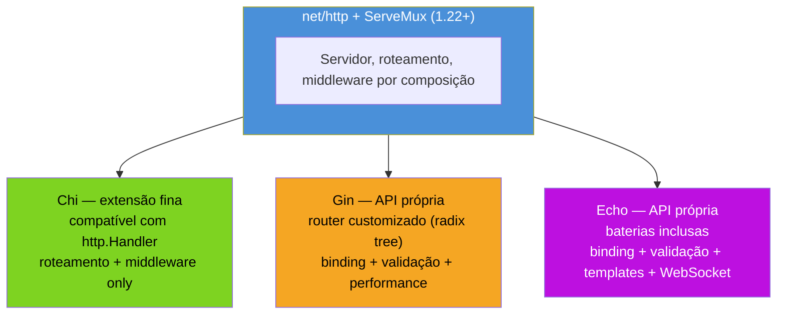

# Frameworks — Gin, Chi, Echo

> [!abstract] TL;DR
> A stdlib de Go — `net/http` mais o `ServeMux` do Go 1.22 — já dá servidor, roteamento com wildcards, middleware por composição e parsing de JSON. Isso resolve boa parte dos projetos. Um framework entra quando o *volume* de código repetitivo passa a doer: binding automático de JSON/query/path pra struct, validação declarativa, grupos de rotas com prefixo e middleware compartilhado, renderização de templates, tratamento uniforme de erro. Os três nomes que dominam o ecossistema — **Gin** (performático, API enxuta, o mais popular), **Chi** (idiomático, compatível com `net/http`, quase uma extensão da stdlib), **Echo** (completo, "baterias inclusas", API mais rica) — atacam o mesmo problema com filosofias diferentes. Nenhum é obrigatório: a maioria dos serviços Go em produção roda `net/http` puro ou Chi, não Gin nem Echo.

## Quando `net/http` deixa de bastar

Volte ao exemplo mais simples que a trilha já mostrou: um handler que lê um `id` da URL, decodifica um corpo JSON, valida os campos e responde. Com `net/http` puro:

```go
func criarUsuario(w http.ResponseWriter, r *http.Request) {
    var req struct {
        Nome  string `json:"nome"`
        Email string `json:"email"`
    }
    if err := json.NewDecoder(r.Body).Decode(&req); err != nil {
        http.Error(w, "corpo inválido", http.StatusBadRequest)
        return
    }
    if req.Nome == "" {
        http.Error(w, "nome é obrigatório", http.StatusBadRequest)
        return
    }
    if !strings.Contains(req.Email, "@") {
        http.Error(w, "email inválido", http.StatusBadRequest)
        return
    }
    // ... persistir ...
    w.Header().Set("Content-Type", "application/json")
    w.WriteHeader(http.StatusCreated)
    json.NewEncoder(w).Encode(req)
}
```

Isso funciona. Mas multiplique por trinta endpoints, cada um com o próprio decode-valida-responde manual, e o padrão vira ruído: o mesmo bloco de sete linhas repetido, com variações mínimas, espalhado pelo pacote inteiro. Não é um problema de capacidade da stdlib — `net/http` consegue fazer tudo isso — é um problema de **quantidade de código boilerplate por endpoint**. É exatamente aí que um framework se paga: ele não adiciona capacidade nova, adiciona uma camada de conveniência sobre a mesma capacidade.

```go
type CriarUsuarioReq struct {
    Nome  string `json:"nome" binding:"required"`
    Email string `json:"email" binding:"required,email"`
}

func criarUsuario(c *gin.Context) {
    var req CriarUsuarioReq
    if err := c.ShouldBindJSON(&req); err != nil {
        c.JSON(http.StatusBadRequest, gin.H{"erro": err.Error()})
        return
    }
    // ... persistir ...
    c.JSON(http.StatusCreated, req)
}
```

Decode, validação de presença e validação de formato de e-mail viraram uma linha de struct tag mais uma chamada. O comportamento é o mesmo; o volume de código caiu.

> [!question]- Se a stdlib já resolve, por que o ecossistema Go tem tantos frameworks?
> Porque "resolve" não é o mesmo que "resolve sem repetição". A filosofia da comunidade Go — deixar a stdlib pequena e composável, empurrar convenções pra bibliotecas — significa que binding, validação declarativa e agrupamento de rotas nunca vão entrar em `net/http` como fizeram em Spring (Java) ou Express (Node). Frameworks preenchem esse vácuo deliberado. A pergunta não é "a stdlib é fraca?" — é "meu projeto tem volume suficiente de endpoints repetitivos pra justificar a dependência extra e o *lock-in* de API que ela traz?".

## As três filosofias



A diferença mais importante entre os três não é performance — é **quão longe cada um se afasta da assinatura `http.Handler`** que a stdlib define. Isso muda o custo de troca e o quanto do seu código fica acoplado ao framework.

### Chi — idiomático, compatível com `net/http`

Chi (`github.com/go-chi/chi`) não introduz um tipo de contexto próprio. Handlers em Chi têm exatamente a assinatura `func(http.ResponseWriter, *http.Request)` — a mesma que você já usa com `net/http` puro. O que Chi adiciona é um roteador mais expressivo (parâmetros nomeados, sub-roteadores montáveis, grupos com middleware) e um conjunto de middlewares prontos, mas tudo empilhado sobre a interface padrão:

```go
r := chi.NewRouter()
r.Use(middleware.Logger)
r.Use(middleware.Recoverer)

r.Route("/usuarios", func(r chi.Router) {
    r.Get("/", listarUsuarios)
    r.Post("/", criarUsuario)
    r.Route("/{id}", func(r chi.Router) {
        r.Get("/", buscarUsuario)
        r.Put("/", atualizarUsuario)
    })
})

http.ListenAndServe(":8080", r)
```

```go
func buscarUsuario(w http.ResponseWriter, r *http.Request) {
    id := chi.URLParam(r, "id")
    // handler continua sendo http.Handler puro — nada de tipo Context custom
    fmt.Fprintf(w, "usuário %s", id)
}
```

Repare que `chi.NewRouter()` retorna algo que satisfaz `http.Handler` — dá pra passar direto pra `http.ListenAndServe`, misturar rotas Chi com `http.ServeMux` da stdlib, ou até trocar Chi por outro roteador sem reescrever handler nenhum, porque a assinatura nunca mudou. Chi não faz binding automático de JSON nem validação — isso fica por sua conta (ou de uma lib de validação separada, como `go-playground/validator`, usada isoladamente). A proposta é: **só roteamento e middleware**, resolvidos melhor que o `ServeMux` da stdlib pré-1.22, sem trazer o resto.

### Gin — performático, API enxuta

Gin (`github.com/gin-gonic/gin`) troca a assinatura de handler pela sua própria: `func(c *gin.Context)`. O `gin.Context` empacota request, response writer, parâmetros de rota e os helpers de binding/resposta num único objeto passado a cada handler. Por baixo, o roteador de Gin usa uma *radix tree* (compressed trie) — a mesma família de estrutura de dados que o `httprouter` popularizou — otimizada para casar padrões de rota rapidamente mesmo com milhares de rotas registradas, o que dá a Gin fama de ser um dos roteadores HTTP mais rápidos do ecossistema Go em benchmarks públicos.

```go
r := gin.Default() // já vem com Logger + Recovery embutidos

r.GET("/usuarios/:id", func(c *gin.Context) {
    id := c.Param("id")
    c.JSON(http.StatusOK, gin.H{"id": id})
})

grupo := r.Group("/api/v1")
grupo.Use(authMiddleware)
{
    grupo.POST("/usuarios", criarUsuario)
}

r.Run(":8080") // atalho para http.ListenAndServe
```

O `gin.Context` é o preço da conveniência: `c.JSON`, `c.ShouldBindJSON`, `c.Param`, `c.Query` cobrem em uma chamada o que, na stdlib, exigiria `json.NewEncoder`, `json.NewDecoder`, parsing manual de `r.URL.Query()`. A contrapartida é que um handler Gin não é mais um `http.Handler` — ele só roda dentro do router de Gin, e migrar pra outro framework depois significa reescrever a assinatura de cada handler.

### Echo — completo, "baterias inclusas"

Echo (`github.com/labstack/echo`) segue a mesma linha de API própria que Gin — `func(c echo.Context) error`, com um detalhe que muda o fluxo de controle: handlers Echo **retornam `error`** em vez de escrever a resposta e sair por `return` nu. Isso empurra tratamento de erro pra um middleware central (`HTTPErrorHandler`), em vez de cada handler decidir como formatar seu próprio erro.

```go
e := echo.New()
e.Use(middleware.Logger())
e.Use(middleware.Recover())

e.GET("/usuarios/:id", func(c echo.Context) error {
    id := c.Param("id")
    return c.JSON(http.StatusOK, map[string]string{"id": id})
})

e.POST("/usuarios", func(c echo.Context) error {
    var req CriarUsuarioReq
    if err := c.Bind(&req); err != nil {
        return echo.NewHTTPError(http.StatusBadRequest, err.Error())
    }
    if err := c.Validate(&req); err != nil {
        return err
    }
    return c.JSON(http.StatusCreated, req)
})

e.Logger.Fatal(e.Start(":8080"))
```

Echo cobre, nativamente ou via pacotes irmãos oficiais, uma superfície maior que Gin: renderização de templates HTML, WebSocket, HTTP/2, TLS automático via Let's Encrypt, um sistema de *data binder* mais flexível (binding de header, form, query e path de forma uniforme). É o framework "mais próximo de um Express/Rails" do ecossistema Go — mais peça pronta, mais opinião embutida, mais superfície de API pra aprender.

## Comparação

| | Chi | Gin | Echo |
|---|---|---|---|
| Assinatura de handler | `http.Handler` padrão | `func(*gin.Context)` | `func(echo.Context) error` |
| Compatível com `net/http` sem adaptação | sim | não (precisa de adapter) | não (precisa de adapter) |
| Roteador | trie sobre `net/http` | radix tree própria, focado em performance | radix tree própria |
| Binding + validação | não incluso (compõe com lib externa) | incluso (`binding` tags) | incluso (`Validator` plugável) |
| Templates/WebSocket/TLS automático | não | parcial (via middlewares de terceiros) | incluso |
| Curva de adoção | baixa — quase stdlib | baixa-média — API pequena, bem documentada | média — mais conceitos (Context, error handler) |
| Filosofia | "stdlib, só que melhor roteada" | "rápido e enxuto" | "tudo incluso" |

> [!info] Nenhum dos três é "o padrão" de Go
> Diferente de Java com Spring ou Node com Express, o ecossistema Go não convergiu pra um framework dominante — e boa parte disso é intencional: a stdlib já cobre o suficiente pra muitos serviços nunca precisarem de nenhum dos três. É comum ver equipes experientes escolherem Chi justamente por ele **não** ser um framework de verdade — é um roteador fino que preserva a portabilidade de handlers `net/http` puros, o que reduz o custo de trocar de ideia depois.

## Casos práticos

**1. Middleware compartilhado em Chi**, reaproveitando o padrão de composição que a stdlib já ensina (ver [[04 - Middleware|nota 04]]):

```go
func authMiddleware(next http.Handler) http.Handler {
    return http.HandlerFunc(func(w http.ResponseWriter, r *http.Request) {
        token := r.Header.Get("Authorization")
        if token == "" {
            http.Error(w, "não autenticado", http.StatusUnauthorized)
            return
        }
        next.ServeHTTP(w, r)
    })
}

r := chi.NewRouter()
r.Group(func(r chi.Router) {
    r.Use(authMiddleware) // middleware.Func padrão, mesmo tipo da stdlib
    r.Get("/perfil", verPerfil)
})
```

Repare que `authMiddleware` é idêntico a um middleware `net/http` puro — nenhuma dependência de Chi na assinatura. Isso é o que "compatível com stdlib" significa na prática.

**2. Grupo de rotas com validação em Gin**:

```go
type LoginReq struct {
    Email string `json:"email" binding:"required,email"`
    Senha string `json:"senha" binding:"required,min=8"`
}

func login(c *gin.Context) {
    var req LoginReq
    if err := c.ShouldBindJSON(&req); err != nil {
        c.JSON(http.StatusBadRequest, gin.H{"erro": err.Error()})
        return
    }
    c.JSON(http.StatusOK, gin.H{"token": "..."})
}

func main() {
    r := gin.Default()
    api := r.Group("/api")
    api.POST("/login", login)
    r.Run(":8080")
}
```

`binding:"required,email"` e `binding:"required,min=8"` usam `go-playground/validator` por baixo — a mesma lib que Echo usa quando você registra um `Validator` customizado, o que mostra que o binding "de framework" costuma ser, na verdade, uma integração com uma lib de validação independente.

**3. Tratamento central de erro em Echo**, aproveitando o `error` de retorno:

```go
e := echo.New()
e.HTTPErrorHandler = func(err error, c echo.Context) {
    code := http.StatusInternalServerError
    if he, ok := err.(*echo.HTTPError); ok {
        code = he.Code
    }
    c.JSON(code, map[string]string{"erro": err.Error()})
}

e.GET("/usuarios/:id", func(c echo.Context) error {
    id := c.Param("id")
    if id == "" {
        return echo.NewHTTPError(http.StatusBadRequest, "id é obrigatório")
    }
    return c.JSON(http.StatusOK, map[string]string{"id": id})
})
```

Todo handler que retorna erro passa por esse único ponto — cada handler não precisa decidir o formato de resposta de erro, só sinalizar que algo deu errado.

**4. O mesmo endpoint nos três, lado a lado**, pra tornar tangível o que muda além da sintaxe — buscar um item por `id` e responder 404 se não existir:

```go
// Chi — handler é http.Handler puro
func buscarItemChi(w http.ResponseWriter, r *http.Request) {
    id := chi.URLParam(r, "id")
    item, ok := repositorio.Buscar(id)
    if !ok {
        http.Error(w, "não encontrado", http.StatusNotFound)
        return
    }
    w.Header().Set("Content-Type", "application/json")
    json.NewEncoder(w).Encode(item)
}
```

```go
// Gin — handler recebe *gin.Context
func buscarItemGin(c *gin.Context) {
    id := c.Param("id")
    item, ok := repositorio.Buscar(id)
    if !ok {
        c.JSON(http.StatusNotFound, gin.H{"erro": "não encontrado"})
        return
    }
    c.JSON(http.StatusOK, item)
}
```

```go
// Echo — handler retorna error, tratado pelo HTTPErrorHandler central
func buscarItemEcho(c echo.Context) error {
    id := c.Param("id")
    item, ok := repositorio.Buscar(id)
    if !ok {
        return echo.NewHTTPError(http.StatusNotFound, "não encontrado")
    }
    return c.JSON(http.StatusOK, item)
}
```

As três versões fazem exatamente a mesma coisa. O que difere é onde o `return` early aparece (todos os três, na verdade — Go não tem exceção, então até Echo precisa de `return` explícito no erro), quem serializa a resposta (`json.NewEncoder` manual vs `c.JSON` embutido), e o tipo da própria função. Nenhuma das três é "mais correta" — são três pontos diferentes na curva conveniência-vs-acoplamento.

## Armadilhas comuns

> [!warning] Trocar de framework depois de escrever handlers acoplados custa caro
> `func(c *gin.Context)` e `func(c echo.Context) error` não são intercambiáveis nem compatíveis com `http.Handler` sem um adapter. Escolher Gin ou Echo cedo demais, sem necessidade real, significa que uma migração futura pra stdlib pura (ou pra Chi) exige reescrever a assinatura de cada handler — não é troca de import, é refactor. Se o projeto ainda é pequeno e o volume de endpoints não dói, começar com `net/http` + `ServeMux` (Go 1.22+) ou Chi adia essa decisão sem custo.

> [!warning] "Mais rápido" em benchmark isolado raramente é o gargalo real
> Benchmarks de roteador (Gin vs Echo vs Chi vs stdlib) medem nanosegundos de *matching* de rota. Em produção, banco de dados, chamadas de rede e serialização dominam a latência por ordens de grandeza — a escolha de framework quase nunca é o gargalo de performance de um serviço HTTP real. Escolher Gin "porque é o mais rápido" sem medir onde o tempo realmente vai é otimização prematura.

> [!warning] Validação declarativa (`binding:"..."`) esconde a lógica de negócio real
> Tags de validação resolvem checagens sintáticas (`required`, `email`, `min=8`) muito bem, mas regras de negócio (e-mail já cadastrado, senha reutilizada, permissão do usuário) não cabem em struct tag. É comum ver times tentarem forçar toda validação pra dentro de tags e acabarem com regras de negócio meio-escondidas em validadores customizados difíceis de testar isoladamente — vale manter regra de negócio em código explícito, fora da camada de binding.

## Lente cross-stack

| Vindo de... | Framework equivalente | Diferença que pega quem migra |
|---|---|---|
| Java (Spring) | Spring MVC/WebFlux | Nenhum dos três Go tem injeção de dependência embutida nem anotações — composição explícita de handlers e middleware faz esse papel |
| Node (Express) | Express.js | Echo é o mais parecido em filosofia; mas nenhum framework Go tem callback assíncrono estilo `(req, res, next) => {}` — Go usa goroutines e retorno síncrono |
| Python (Flask/FastAPI) | FastAPI | FastAPI gera OpenAPI e valida via type hints nativamente; em Go isso exige lib adicional (ex.: `swaggo` para Gin) — não vem de graça |

## Como explicar em inglês

> Go's standard library — `net/http` plus the 1.22 `ServeMux` — already covers routing with path parameters, middleware via handler composition, and JSON encoding. A framework becomes worth it when the *volume* of repetitive boilerplate per endpoint — JSON/query/path binding into structs, declarative validation, route grouping with shared middleware — starts to hurt. The three dominant names take different approaches: **Chi** stays closest to the standard library, keeping the exact `http.Handler` signature and adding only a better router and prebuilt middlewares; **Gin** introduces its own `*gin.Context` type, trades stdlib compatibility for a fast radix-tree router and built-in binding/validation; **Echo** goes furthest, with handlers returning `error` for centralized error handling and batteries-included support for templates, WebSocket, and automatic TLS. None of the three is Go's "default" framework — plenty of production services run on plain `net/http` or Chi precisely because staying close to `http.Handler` keeps the option to migrate away cheap.

| Termo PT | Termo EN |
|---|---|
| roteador | router |
| vinculação/binding | binding |
| validação declarativa | declarative validation |
| grupo de rotas | route group |
| middleware compartilhado | shared middleware |
| árvore radix | radix tree |
| tratamento central de erro | centralized error handling |
| compatibilidade com a stdlib | standard library compatibility |

## O que vem a seguir

Framework ou stdlib pura, o problema seguinte é o mesmo: como estruturar um serviço HTTP que segue as convenções REST de verdade — recursos, verbos, códigos de status, versionamento — em vez de só rotas soltas que "funcionam". A [[06 - REST idiomático em Go|nota 06]] entra nesse desenho, com ou sem framework por baixo.

## Veja também

- [[01 - O servidor HTTP da stdlib|01 — O servidor HTTP da stdlib]] — `net/http` puro, a base que todo framework aqui compõe por cima
- [[02 - Roteamento|02 — Roteamento]] — `ServeMux` do Go 1.22, o roteador que Chi e os outros substituem ou estendem
- [[03 - Request e Response|03 — Request e Response]] — decode/encode manual de JSON, o que `ShouldBindJSON`/`Bind` automatizam
- [[04 - Middleware|04 — Middleware]] — o padrão de composição que Chi preserva e Gin/Echo reimplementam com API própria
- [[06 - REST idiomático em Go|06 — REST idiomático em Go]] — próxima nota do galho
- [[03-Dominios/Tecnologia/Go/index|Trilha Go]]

## Fontes

- Gin-gonic. *Gin Web Framework — documentação*. github.com. https://github.com/gin-gonic/gin (acessado em 2026-07-18)
- Go Chi. *chi — lightweight, idiomatic and composable router*. github.com. https://github.com/go-chi/chi (acessado em 2026-07-18)
- LabStack. *Echo — High performance, minimalist Go web framework*. echo.labstack.com. https://echo.labstack.com (acessado em 2026-07-18)
- The Go Authors. *net/http package documentation*. pkg.go.dev. https://pkg.go.dev/net/http (acessado em 2026-07-18)
- go-playground. *validator — Go Struct and Field validation*. github.com. https://github.com/go-playground/validator (acessado em 2026-07-18)
