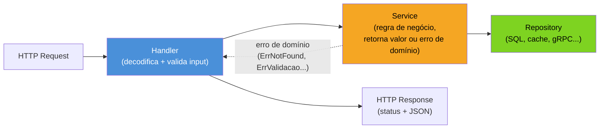
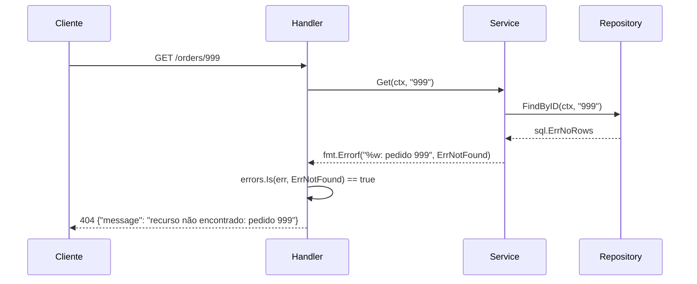

# REST idiomático em Go

> [!abstract] TL;DR
> Um handler HTTP em Go idiomático faz três coisas, nessa ordem, e nada além: **decodifica e valida** o input, **chama o service** com dados já limpos, **traduz o resultado** (valor ou erro) para status HTTP e corpo JSON. A parte que costuma sair errada é a terceira: erro de domínio (`ErrNotFound`, `ErrValidacao`) não é `error` genérico de infraestrutura — precisa de um mapeamento explícito para `404`, `400`, `409` etc., porque Go não tem exceções para carregar esse contexto sozinhas. O padrão que resolve isso — sentinel errors + `errors.Is`/`errors.As` + uma função central `writeError` — é o que separa um handler de 15 linhas fácil de testar de um `switch` gigante repetido em cada rota.

## O handler que sabe demais

Imagine este cenário: você tem uma API REST de pedidos. O primeiro handler que qualquer pessoa escreve, sem pensar em arquitetura, se parece com isto:

```go
func handleGetOrder(w http.ResponseWriter, r *http.Request) {
    id := r.PathValue("id")

    row := db.QueryRow("SELECT id, customer, total, status FROM orders WHERE id = ?", id)

    var o Order
    err := row.Scan(&o.ID, &o.Customer, &o.Total, &o.Status)
    if err == sql.ErrNoRows {
        http.Error(w, "order not found", http.StatusNotFound)
        return
    }
    if err != nil {
        http.Error(w, "internal error", http.StatusInternalServerError)
        return
    }

    w.Header().Set("Content-Type", "application/json")
    json.NewEncoder(w).Encode(o)
}
```

Funciona para uma rota. O problema aparece na décima rota: cada handler repete a mesma dança de "decodificar SQL, checar erro, escrever status, serializar JSON" — e o handler sabe demais sobre *como* buscar o pedido (SQL cru, ali dentro). Se amanhã o pedido vier de um cache, ou de outro microsserviço via gRPC, cada um dos dez handlers precisa mudar. Pior: a lógica de "que erro vira que status HTTP" está espalhada, e a primeira pessoa que esquecer o `if err == sql.ErrNoRows` devolve `500` para um simples "não encontrado" — informação errada para quem consome a API.

A pergunta que este capítulo responde: como estruturar handlers para que cada um seja **fino** (decodifica, delega, traduz) e a lógica de negócio — incluindo "o que significa esse erro" — viva num lugar só, testável sem servidor HTTP nenhum?

## Três camadas, uma responsabilidade cada



A ideia central é separar **transporte** (HTTP: parsing de path/query/body, status codes, `Content-Type`) de **domínio** (regras de negócio, que não sabem — e não deveriam saber — que existe um `http.ResponseWriter` no mundo). O handler é a fronteira: converte HTTP em chamada de service, e converte o retorno do service de volta em HTTP. O service devolve `(Order, error)` sem ideia nenhuma de status code; quem decide "esse erro vira 404" é o handler, numa função central, não em cada rota.

Essa separação não é burocracia — é o que permite testar `OrderService.Get` com um `go test` comum, sem subir servidor, sem `httptest`, sem simular request nenhuma.

## Estruturando handlers por recurso

A convenção que mais se vê em Go idiomático — sem framework nenhum, só `net/http` — é um `struct` por recurso, com o service como dependência injetada e um método por operação:

```go
type OrderHandler struct {
    service *OrderService
}

func NewOrderHandler(s *OrderService) *OrderHandler {
    return &OrderHandler{service: s}
}

func (h *OrderHandler) RegisterRoutes(mux *http.ServeMux) {
    mux.HandleFunc("GET /orders/{id}", h.Get)
    mux.HandleFunc("POST /orders", h.Create)
    mux.HandleFunc("PATCH /orders/{id}/status", h.UpdateStatus)
}
```

> [!info] `mux.HandleFunc("GET /orders/{id}", ...)` — ServeMux 1.22+
> O padrão `"MÉTODO /caminho/{param}"` no `http.ServeMux` da stdlib só existe a partir do Go 1.22 (a nota 02 — Roteamento cobriu isso a fundo). Antes disso, era preciso um roteador externo (Gin, Chi) só para roteamento por método + path params. Este capítulo assume 1.22+; se seu código roda em versão anterior, os exemplos migram quase 1:1 para Chi trocando `mux.HandleFunc` por `r.Get`/`r.Post`.

O ganho de agrupar por `struct`: cada recurso (`Order`, `Customer`, `Product`) vira um arquivo (`order_handler.go`), com suas próprias dependências (`service`, talvez um `logger`) injetadas uma vez no construtor — nada de variável global `var db *sql.DB` compartilhada por handlers soltos. Isso também deixa o roteamento auto-documentado: `RegisterRoutes` lista, num lugar só, todas as rotas daquele recurso.

Cada método do handler segue o mesmo esqueleto de três passos:

```go
func (h *OrderHandler) Get(w http.ResponseWriter, r *http.Request) {
    id := r.PathValue("id") // 1. extrai/decodifica input

    order, err := h.service.Get(r.Context(), id) // 2. delega ao service
    if err != nil {
        writeError(w, err) // 3. traduz erro para HTTP
        return
    }

    writeJSON(w, http.StatusOK, order) // 3. traduz sucesso para HTTP
}
```

Quinze linhas, sem SQL, sem `if err == sql.ErrNoRows` espalhado. `writeError` e `writeJSON` são funções auxiliares do pacote, reaproveitadas por todos os handlers — não métodos do `OrderHandler`, porque não dependem de estado nenhum específico do recurso.

## Validação de input

Todo dado que entra por HTTP — path, query string, corpo JSON — é, por definição, não confiável: veio de fora do processo, e nada garante que o cliente mandou o que a API espera. A validação acontece **no handler**, antes de qualquer chamada ao service, porque é ali que o formato bruto (JSON, string de path) ainda está disponível para produzir uma mensagem de erro útil.

```go
type CreateOrderRequest struct {
    Customer string  `json:"customer"`
    Total    float64 `json:"total"`
}

func (r CreateOrderRequest) Validate() error {
    if r.Customer == "" {
        return fmt.Errorf("%w: customer é obrigatório", ErrValidacao)
    }
    if r.Total <= 0 {
        return fmt.Errorf("%w: total precisa ser positivo", ErrValidacao)
    }
    return nil
}

func (h *OrderHandler) Create(w http.ResponseWriter, r *http.Request) {
    var req CreateOrderRequest
    if err := json.NewDecoder(r.Body).Decode(&req); err != nil {
        writeError(w, fmt.Errorf("%w: JSON inválido", ErrValidacao))
        return
    }
    if err := req.Validate(); err != nil {
        writeError(w, err)
        return
    }

    order, err := h.service.Create(r.Context(), req.Customer, req.Total)
    if err != nil {
        writeError(w, err)
        return
    }

    writeJSON(w, http.StatusCreated, order)
}
```

Dois pontos merecem atenção. Primeiro, o `Decode` malformado (JSON quebrado, tipo errado) já é, ele mesmo, um erro de validação — trate-o como tal, com `400`, não como erro interno. Segundo, `Validate()` retorna erro **embrulhando** um sentinel (`ErrValidacao`) com `%w` — é esse embrulho, via `errors.Is`, que permite ao `writeError` decidir o status sem um `switch` gigante de strings de mensagem. A próxima seção detalha exatamente esse mecanismo.

> [!warning] Validação em struct não substitui validação de negócio
> `req.Total <= 0` é validação de **formato** — pertence ao handler, porque não depende de nada além do request. Mas "esse cliente já tem 3 pedidos em aberto, não pode criar um quarto" é uma regra de **negócio**, que só o service pode checar (ele tem acesso ao repositório). Misturar as duas no handler é o erro mais comum de quem tenta ser rigoroso demais cedo: o handler acaba com queries dentro de si, voltando ao problema da seção de abertura.

Para APIs maiores, vale considerar uma biblioteca de validação por tags (como `go-playground/validator`) em vez de um método `Validate()` manual por struct — mas o princípio não muda: a validação roda no handler, antes do service, e devolve `400` com uma mensagem específica por campo.

## Mapeando erros de domínio para status HTTP

Aqui está a peça que costuma faltar em exemplos de "hello world" REST em Go: como o `error` genérico da linguagem carrega informação suficiente para virar um status HTTP correto. A resposta é **sentinel errors** — valores `error` exportados que servem de marcador — combinados com `errors.Is`:

```go
var (
    ErrNotFound  = errors.New("recurso não encontrado")
    ErrValidacao = errors.New("dado inválido")
    ErrConflito  = errors.New("conflito de estado")
)

type ErroAPI struct {
    Status  int    `json:"-"`
    Message string `json:"message"`
}

func (e *ErroAPI) Error() string { return e.Message }

func writeError(w http.ResponseWriter, err error) {
    var status int
    switch {
    case errors.Is(err, ErrNotFound):
        status = http.StatusNotFound
    case errors.Is(err, ErrValidacao):
        status = http.StatusBadRequest
    case errors.Is(err, ErrConflito):
        status = http.StatusConflict
    default:
        status = http.StatusInternalServerError
        slog.Error("erro interno não mapeado", "err", err)
    }

    writeJSON(w, status, ErroAPI{Message: err.Error()})
}

func writeJSON(w http.ResponseWriter, status int, v any) {
    w.Header().Set("Content-Type", "application/json")
    w.WriteHeader(status)
    json.NewEncoder(w).Encode(v)
}
```

> [!info] `log/slog` — biblioteca padrão desde Go 1.21
> `slog.Error` é o pacote de logging estruturado que entrou na stdlib no Go 1.21, substituindo o hábito de cada projeto escolher uma biblioteca de log diferente. Vale notar o detalhe deliberado acima: o `default` do `switch` — erro não mapeado, presumivelmente um bug ou falha de infraestrutura — é logado no servidor, mas a mensagem que volta ao cliente é genérica (`err.Error()`, que nesse ramo é uma mensagem interna qualquer). Em produção, prefira nunca vazar mensagem de erro interno bruta ao cliente; a nota 08 volta a esse cuidado.

No service, o erro de domínio é produzido embrulhando o sentinel certo:

```go
func (s *OrderService) Get(ctx context.Context, id string) (Order, error) {
    order, err := s.repo.FindByID(ctx, id)
    if errors.Is(err, sql.ErrNoRows) {
        return Order{}, fmt.Errorf("%w: pedido %s", ErrNotFound, id)
    }
    if err != nil {
        return Order{}, fmt.Errorf("buscar pedido %s: %w", id, err)
    }
    return order, nil
}
```

`fmt.Errorf("%w: pedido %s", ErrNotFound, id)` faz duas coisas ao mesmo tempo: produz uma mensagem legível ("recurso não encontrado: pedido 42") e preserva a cadeia de `errors.Is` — `errors.Is(err, ErrNotFound)` continua `true` mesmo com a mensagem customizada, porque `%w` embrulha o erro original em vez de só formatar uma string. É esse contrato — sentinel + `%w` + `errors.Is` no handler — que elimina a necessidade de o handler conhecer detalhe nenhum de como o repositório falhou.



> [!question]- Por que sentinel errors e não um pacote de erros customizados tipo Java (`OrderNotFoundException extends RuntimeException`)?
> Dá para fazer os dois de forma equivalente com `errors.As` em vez de `errors.Is`, definindo um tipo (`type NotFoundError struct { Resource string }`) em vez de um valor sentinel. A escolha entre os dois é estilística: sentinels (`errors.Is`) são mais simples quando não há dado extra a carregar; tipos custom (`errors.As`) valem a pena quando o erro precisa carregar campos (`Resource string`, `ID string`) que o handler vai querer ler para montar a resposta. Nada aqui é exceção no sentido de Java — não há *stack unwinding* automático; `error` continua sendo um valor comum, retornado explicitamente em cada nível da pilha de chamadas, e é exatamente por isso que o embrulho com `%w` precisa ser feito à mão em cada camada que relança o erro.

## O handler enxuto que delega ao service

Juntando as três seções anteriores, o padrão completo de um recurso REST fica assim — e vale notar o quanto o handler *não* faz:

```go
type OrderService struct {
    repo OrderRepository
}

type OrderRepository interface {
    FindByID(ctx context.Context, id string) (Order, error)
    Save(ctx context.Context, o Order) error
}

func (s *OrderService) Create(ctx context.Context, customer string, total float64) (Order, error) {
    order := Order{
        ID:       uuid.NewString(),
        Customer: customer,
        Total:    total,
        Status:   "pending",
    }
    if err := s.repo.Save(ctx, order); err != nil {
        return Order{}, fmt.Errorf("salvar pedido: %w", err)
    }
    return order, nil
}

// Handler completo: decodifica, delega, traduz — nada mais.
func (h *OrderHandler) Create(w http.ResponseWriter, r *http.Request) {
    var req CreateOrderRequest
    if err := json.NewDecoder(r.Body).Decode(&req); err != nil {
        writeError(w, fmt.Errorf("%w: JSON inválido", ErrValidacao))
        return
    }
    if err := req.Validate(); err != nil {
        writeError(w, err)
        return
    }

    order, err := h.service.Create(r.Context(), req.Customer, req.Total)
    if err != nil {
        writeError(w, err)
        return
    }

    writeJSON(w, http.StatusCreated, order)
}
```

`OrderRepository` é uma interface — não porque "toda dependência deve ser uma interface" (regra de dogma de outras linguagens), mas porque isso é o que permite testar `OrderService.Create` com um repositório fake em memória, sem banco de dados nenhum, e testar `OrderHandler.Create` com um `OrderService` fake, sem repositório nenhum. Cada camada testa só a própria responsabilidade — decodificação/validação no handler, regra de negócio no service — sem `httptest.NewServer` até o teste de integração de ponta a ponta.

> [!warning] Handler que chama `s.repo` direto, pulando o service
> Um erro comum sob pressão de prazo é o handler receber o `repo` e chamar `h.repo.FindByID` direto, "só dessa vez, é rota simples". Isso quebra a fronteira: a próxima regra de negócio que precisar entrar nessa rota (cache, autorização por dono do recurso, auditoria) não tem onde morar — ou volta pro handler, ou alguém precisa refatorar sob pressão. Handler enxuto vale a disciplina mesmo em rotas triviais.

## Lente cross-stack

| Vindo de... | Em Go, é assim |
|---|---|
| Java/Spring — `@ExceptionHandler` global captura exceções lançadas em qualquer camada | Não há captura automática: cada função que pode falhar retorna `error` explicitamente, e cada camada decide relançar (`%w`) ou tratar; `writeError` é o "exception handler", mas chamado manualmente no fim do handler, não interceptando `panic` |
| Node/Express — `try/catch` em torno de `await service.get()`, middleware de erro central via `next(err)` | Sem exceções: o "catch" é `if err != nil` logo após a chamada; o "middleware de erro central" é a função `writeError`, chamada explicitamente, não injetada no pipeline |
| Python/FastAPI — `HTTPException(status_code=404, detail=...)` lançada dentro do endpoint | Go não lança nada; o erro de domínio (`ErrNotFound`) é só um valor retornado, e o handler o traduz para status com `errors.Is` — a "exceção HTTP" nunca existe como conceito, só o mapeamento explícito |

O padrão sentinel + `errors.Is` é, na prática, a forma de Go reproduzir sem exceções o que `HTTPException`/`@ExceptionHandler` fazem com exceções: erro de domínio carrega semântica, uma camada de borda traduz essa semântica para o protocolo de transporte.

## Como explicar em inglês

> An idiomatic Go handler does exactly three things: decode and validate the request, call the service layer, and translate the result — success or error — into an HTTP response. The part that trips people up coming from exception-based languages is error mapping: Go has no exceptions to carry HTTP semantics automatically, so domain errors are plain `error` values wrapped around package-level sentinels (`ErrNotFound`, `ErrValidation`) using `fmt.Errorf("%w: ...", ErrNotFound)`. A single `writeError` function then uses `errors.Is` to map each sentinel to a status code, so no individual handler needs a switch statement of its own. Handlers stay thin by design: they never touch the database directly — that's the repository's job, reached through the service, which is itself defined as an interface so both layers can be unit-tested without spinning up an HTTP server.

| Termo PT | Termo EN |
|---|---|
| erro sentinela | sentinel error |
| embrulhar erro | wrap error |
| tradução de erro | error mapping |
| handler enxuto | thin handler |
| camada de serviço | service layer |
| validação de input | input validation |
| corpo da requisição | request body |
| interface de repositório | repository interface |

## O que vem a seguir

Este capítulo tratou o service e o repositório como dependências já resolvidas — mas nada foi dito sobre como o servidor Go **chama** outros serviços, seja para compor uma resposta a partir de uma API externa, seja para consumir a própria API REST que acabamos de estruturar a partir de outro programa Go. A [[07 - Clientes HTTP|nota 07]] cobre o lado cliente: `http.Client`, timeouts, reuso de conexão e os cuidados que fazem a diferença entre um client HTTP que escala e um que vaza *goroutines*.

## Veja também

- [[02 - Roteamento|02 — Roteamento]] — `http.ServeMux` e o padrão `"MÉTODO /caminho/{param}"` usado em `RegisterRoutes` aqui
- [[03 - Request e Response|03 — Request e Response]] — decodificação de body e escrita de resposta, retomadas nas funções `writeJSON`/`writeError`
- [[04 - Middleware|04 — Middleware]] — onde ficaria autenticação/logging que envolve os handlers desta nota, sem entrar no corpo deles
- [[05 - Frameworks — Gin, Chi, Echo|05 — Frameworks — Gin, Chi, Echo]] — o mesmo padrão handler→service→repository aplicado com um framework em vez do `net/http` puro
- [[07 - Clientes HTTP|07 — Clientes HTTP]] — próxima nota do galho
- [[03-Dominios/Tecnologia/Go/index|Trilha Go]]

Autenticação e autorização de rotas (quem pode chamar `POST /orders`) ficam fora do escopo deste capítulo — a trilha Auth e Identidade cobre OAuth 2.1, JWT e middlewares de autorização a fundo.

## Fontes

- The Go Authors. *A Tour of Go — Errors*. go.dev. https://go.dev/tour/methods/19 (acessado em 2026-07-18)
- The Go Authors. *Working with Errors in Go 1.13*. go.dev/blog. https://go.dev/blog/go1.13-errors (acessado em 2026-07-18)
- The Go Authors. *net/http package documentation*. pkg.go.dev. https://pkg.go.dev/net/http (acessado em 2026-07-18)
- The Go Authors. *log/slog package documentation*. pkg.go.dev. https://pkg.go.dev/log/slog (acessado em 2026-07-18)
- The Go Authors. *Routing Enhancements for Go 1.22*. go.dev/blog. https://go.dev/blog/routing-enhancements (acessado em 2026-07-18)
- Go by Example. *JSON*. gobyexample.com. https://gobyexample.com/json (acessado em 2026-07-18)
