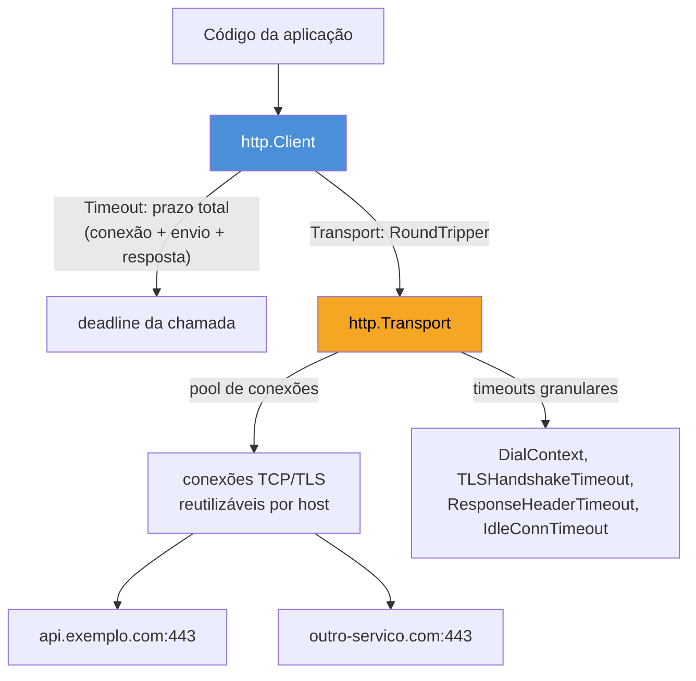
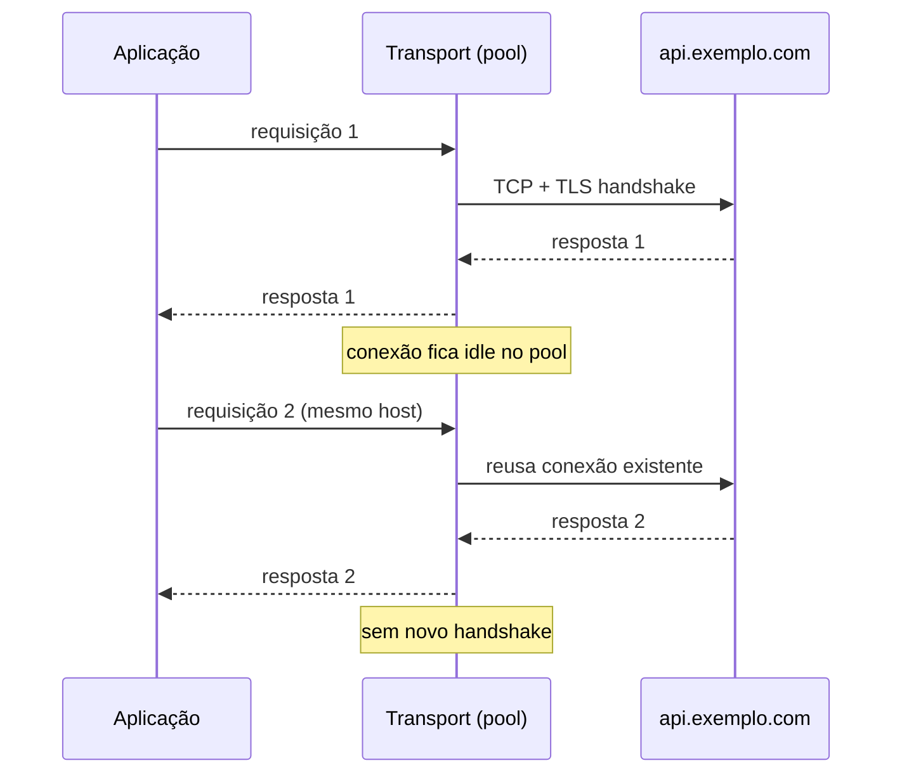
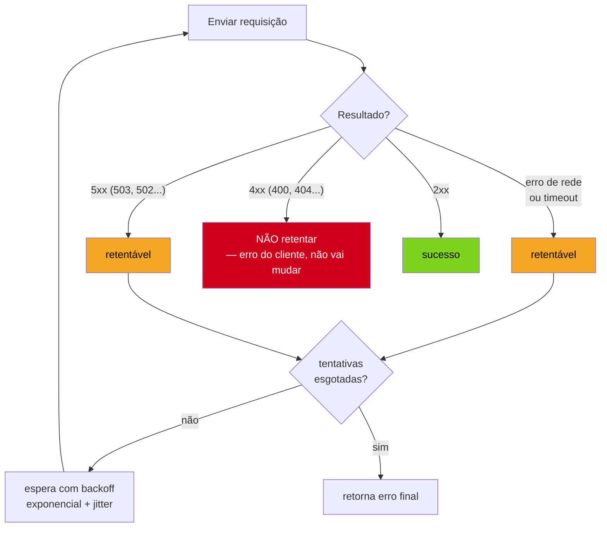

# Clientes HTTP

> [!abstract] TL;DR
> `http.Client` é o cliente HTTP da stdlib — e `http.DefaultClient` (o zero-value que `http.Get` usa por baixo) **não tem timeout nenhum**: uma conexão que trava do outro lado trava sua goroutine para sempre. Regra de produção número um: **sempre** configure `Client.Timeout` (prazo total da chamada) ou, melhor ainda, `context.Context` com deadline por requisição. Regra número dois: **reuse o `*http.Client`** — ele carrega um `Transport` que faz *connection pooling* (mantém conexões TCP/TLS vivas para reaproveitar), e criar um `Client` novo a cada chamada joga esse cache fora, forçando handshake TLS do zero toda vez. Regra número três: a stdlib **não faz retry sozinha** — timeout, erro de rede ou 5xx transitório é responsabilidade sua, com backoff exponencial e cuidado redobrado para não retentar operações não-idempotentes.

## O cliente que trava para sempre

Imagine este código, que parece inofensivo:

```go
resp, err := http.Get("https://api.exemplo.com/pedidos")
if err != nil {
    log.Fatal(err)
}
defer resp.Body.Close()
```

`http.Get` é um atalho de pacote — por baixo, chama `http.DefaultClient.Get(url)`, e `http.DefaultClient` é literalmente `&http.Client{}`, um struct zerado. Zero campos configurados significa **zero timeout**. Se o servidor do outro lado aceitar a conexão TCP e simplesmente nunca responder — um firewall silencioso, um servidor travado, uma rota de rede que engole pacotes — essa goroutine fica bloqueada em `http.Get` para sempre. Não existe prazo, não existe cancelamento automático, não existe nada que a resgate.

Em um serviço com goroutine por requisição (o padrão de qualquer servidor HTTP em Go, visto na [[01 - O servidor HTTP da stdlib|nota 01]] deste galho), isso é uma fuga de recurso silenciosa: cada chamada travada consome uma goroutine (leve, mas não grátis) e, pior, mantém aberta uma conexão de saída. Sob carga, dezenas dessas chamadas penduradas esgotam o pool de conexões disponíveis e o serviço para de conseguir fazer *qualquer* chamada HTTP nova — um efeito cascata clássico, e a causa raiz é sempre a mesma linha esquecida: nenhum timeout configurado.

> [!warning] `http.DefaultClient` e `http.Get`/`http.Post` não têm lugar em produção
> Todo atalho de pacote (`http.Get`, `http.Post`, `http.Head`, `http.PostForm`) usa `http.DefaultClient` por baixo — que é `&http.Client{}` sem timeout. Ótimo para um script de uma linha ou um exemplo do Tour of Go; **nunca** para código que roda em produção contra um serviço de terceiros. A primeira coisa que qualquer revisão de código Go deveria pegar é `http.Get(` aparecendo fora de teste ou protótipo.

## Anatomia do `http.Client`

```go
type Client struct {
    Transport     RoundTripper  // como a requisição é enviada — pooling, TLS, proxy
    CheckRedirect func(req *Request, via []*Request) error
    Jar           CookieJar
    Timeout       time.Duration // prazo TOTAL: conexão + envio + resposta + redirects
}
```

Quatro campos, e os dois que importam para esta nota são `Transport` e `Timeout` — o resto (`CheckRedirect`, `Jar`) resolve políticas de redirecionamento e cookies, fora do escopo aqui.



`Client.Timeout` é o prazo **fim a fim**: da chamada de `Do`/`Get` até o corpo da resposta terminar de ser lido, incluindo qualquer redirecionamento seguido no caminho. `Transport` é a peça que faz o trabalho pesado por baixo — abrir conexões, negociar TLS, manter um pool para reaproveitar — e tem seus próprios timeouts, mais granulares, que a [documentação de `net/http`](https://pkg.go.dev/net/http#Transport) descreve campo a campo.

## Timeout: sempre configurar, de duas formas complementares

**Forma 1 — `Client.Timeout`**, o jeito mais simples, prazo único para a chamada inteira:

```go
client := &http.Client{
    Timeout: 10 * time.Second,
}

resp, err := client.Get("https://api.exemplo.com/pedidos")
if err != nil {
    // aqui cai timeout, erro de DNS, conexão recusada, etc — todos como error
    return fmt.Errorf("chamando api de pedidos: %w", err)
}
defer resp.Body.Close()
```

Se a chamada inteira — resolver DNS, conectar, negociar TLS, enviar a requisição, esperar o cabeçalho de resposta, ler o corpo — passar de 10 segundos, `client.Get` retorna um `error` cujo `Unwrap` chega a um `context.DeadlineExceeded`. Simples, direto, e já resolve o problema do `http.DefaultClient` sem prazo.

**Forma 2 — `context.Context` por requisição**, mais flexível porque o prazo pode variar por chamada, e porque o cancelamento se propaga (se o handler que originou a chamada for cancelado — cliente desconectou, request pai expirou —, a chamada HTTP downstream também é cancelada):

```go
func buscarPedido(ctx context.Context, client *http.Client, id string) (*Pedido, error) {
    ctx, cancel := context.WithTimeout(ctx, 5*time.Second)
    defer cancel()

    url := fmt.Sprintf("https://api.exemplo.com/pedidos/%s", id)
    req, err := http.NewRequestWithContext(ctx, http.MethodGet, url, nil)
    if err != nil {
        return nil, fmt.Errorf("montando request: %w", err)
    }

    resp, err := client.Do(req)
    if err != nil {
        return nil, fmt.Errorf("chamando api de pedidos: %w", err)
    }
    defer resp.Body.Close()

    if resp.StatusCode != http.StatusOK {
        return nil, fmt.Errorf("api de pedidos respondeu %d", resp.StatusCode)
    }

    var pedido Pedido
    if err := json.NewDecoder(resp.Body).Decode(&pedido); err != nil {
        return nil, fmt.Errorf("decodificando resposta: %w", err)
    }
    return &pedido, nil
}
```

Repare que `client` aqui **ainda tem** um `Timeout` configurado como cinto de segurança — as duas formas não são mutuamente exclusivas. Na prática, o padrão maduro é: `Client.Timeout` como teto absoluto (nunca deixe uma chamada passar de, digamos, 30s, aconteça o que acontecer), e `context.WithTimeout` por chamada para prazos mais apertados e específicos do caso de uso (um endpoint de autocomplete pode ter 300ms, um relatório pesado pode ter 20s — o mesmo `Client` serve os dois, com contextos diferentes).

> [!warning] `Client.Timeout` não cancela a conexão TCP subjacente instantaneamente em todo cenário
> O prazo interrompe a leitura/escrita e retorna erro para o seu código, mas o comportamento exato de fechamento da conexão depende do estado em que ela estava. Isso raramente importa na prática — o `Transport` cuida de descartar conexões problemáticas —, mas é o tipo de detalhe que separa "timeout configurado" de "entendo o que o timeout garante". Se o requisito for cancelamento cooperativo e propagável (por exemplo, abortar uma chamada porque o cliente upstream desistiu), `context.Context` é a ferramenta certa, não `Client.Timeout` sozinho.

## Reuso de conexão: por que `Transport` existe

Toda chamada HTTPS paga dois custos de estabelecimento antes de trocar um byte de dado: o *3-way handshake* do TCP e, por cima, o *handshake* do TLS (troca de certificados, negociação de cifra). Para um endpoint em outro continente, isso facilmente soma 100-300ms — **antes** da requisição em si sair. Se seu código cria uma conexão nova a cada chamada, esse custo se repete toda vez.

`http.Transport` resolve isso mantendo um **pool de conexões idle** por host: depois que uma resposta termina de ser lida, a conexão TCP/TLS não é fechada — fica parqueada, pronta para a próxima requisição ao mesmo host reaproveitar sem handshake nenhum. É a mesma ideia de *connection pooling* de um driver de banco de dados, aplicada a HTTP.



Os campos que controlam esse pool, em `http.Transport`:

```go
transport := &http.Transport{
    MaxIdleConns:        100,              // total de conexões idle no pool
    MaxIdleConnsPerHost:  10,              // idle por host — default da stdlib é só 2!
    MaxConnsPerHost:      0,               // 0 = sem limite de conexões simultâneas por host
    IdleConnTimeout:      90 * time.Second, // quanto tempo uma conexão idle fica no pool
    DialContext: (&net.Dialer{
        Timeout:   5 * time.Second, // timeout de estabelecer a conexão TCP
        KeepAlive: 30 * time.Second,
    }).DialContext,
    TLSHandshakeTimeout:   5 * time.Second,
    ResponseHeaderTimeout: 5 * time.Second, // tempo até o primeiro byte do cabeçalho de resposta
    ExpectContinueTimeout: 1 * time.Second,
}

client := &http.Client{
    Transport: transport,
    Timeout:   10 * time.Second, // teto absoluto, por cima dos timeouts granulares
}
```

> [!info] `MaxIdleConnsPerHost` default é só 2
> O `http.DefaultTransport` (usado quando `Client.Transport` fica `nil`) tem `MaxIdleConnsPerHost: 2` — suficiente para tráfego baixo, mas um gargalo real em serviços que fazem muitas chamadas concorrentes ao mesmo host downstream (um serviço interno de alto tráfego, por exemplo). Se seu serviço bate um mesmo host com concorrência alta, subir esse número (10, 50, o que o perfil de tráfego pedir) evita reabrir conexão o tempo todo mesmo com o `Transport` configurado.

O erro mais comum que **anula** esse pooling inteiro: criar um `*http.Client` novo a cada chamada, em vez de reutilizar uma instância compartilhada.

```go
// ERRADO — descarta o pool de conexões a cada chamada
func buscarPedido(id string) (*Pedido, error) {
    client := &http.Client{Timeout: 10 * time.Second} // novo Transport implícito a cada chamada
    resp, err := client.Get("https://api.exemplo.com/pedidos/" + id)
    // ...
}

// CERTO — um Client por processo (ou por dependência injetada), reusado em toda chamada
var apiClient = &http.Client{
    Timeout:   10 * time.Second,
    Transport: transport, // o Transport configurado acima
}

func buscarPedido(id string) (*Pedido, error) {
    resp, err := apiClient.Get("https://api.exemplo.com/pedidos/" + id)
    // ...
}
```

`http.Client` é **seguro para uso concorrente** — a própria [documentação](https://pkg.go.dev/net/http#Client) garante isso — então a prática correta é criar um `Client` (com seu `Transport` configurado) uma vez, geralmente no `main` ou na construção de um struct de dependências, e passá-lo adiante para quem precisar fazer chamadas HTTP. Nunca `&http.Client{}` dentro de uma função chamada em loop ou por requisição.

> [!warning] Esquecer de fechar (ou drenar) `resp.Body` também quebra o reuso
> O pool só recicla a conexão de volta se o corpo da resposta for **lido até o fim e fechado**. `defer resp.Body.Close()` fecha, mas se você parar de ler o corpo no meio (por exemplo, decidiu que só precisava do cabeçalho e nunca chamou `io.ReadAll` nem `json.Decode`), o `Transport` não consegue reaproveitar aquela conexão com segurança — ela é descartada em vez de voltar ao pool. Se realmente não precisar do corpo, ainda assim é boa prática `io.Copy(io.Discard, resp.Body)` antes do close, para drenar e permitir o reuso.

## Retries: a stdlib não faz isso por você

`http.Client.Do` retorna, na melhor das hipóteses, uma resposta com qualquer `StatusCode` — inclusive 500, 502, 503 — como sucesso do ponto de vista do Go (`err == nil`). `err != nil` só acontece para falhas de **transporte**: timeout, DNS que não resolve, conexão recusada, TLS que falha. Ou seja: nem erro de rede nem 5xx acionam retry algum sozinhos — é 100% responsabilidade do seu código decidir o quê retentar e como.



Uma implementação mínima, mas real, de retry com backoff exponencial:

```go
func fazerComRetry(ctx context.Context, client *http.Client, req *http.Request, maxTentativas int) (*http.Response, error) {
    var ultimoErro error

    for tentativa := 0; tentativa < maxTentativas; tentativa++ {
        if tentativa > 0 {
            espera := time.Duration(1<<uint(tentativa-1)) * 200 * time.Millisecond // 200ms, 400ms, 800ms...
            select {
            case <-time.After(espera):
            case <-ctx.Done():
                return nil, ctx.Err()
            }
        }

        // clona o request — o corpo original pode já ter sido consumido na tentativa anterior
        tentativaReq := req.Clone(ctx)

        resp, err := client.Do(tentativaReq)
        if err != nil {
            ultimoErro = err
            continue // erro de transporte — vale tentar de novo
        }

        if resp.StatusCode < 500 {
            return resp, nil // sucesso ou erro do cliente (4xx) — não retenta
        }

        resp.Body.Close() // descarta o corpo do 5xx antes de tentar de novo
        ultimoErro = fmt.Errorf("resposta %d", resp.StatusCode)
    }

    return nil, fmt.Errorf("falhou após %d tentativas: %w", maxTentativas, ultimoErro)
}
```

Dois detalhes fáceis de errar nessa implementação, e que valem atenção redobrada:

1. **`req.Clone(ctx)`** — se o request original tem `Body` (um `POST`/`PUT` com payload), o corpo é um `io.ReadCloser` que já foi **consumido** na primeira tentativa. Reenviar o mesmo `*http.Request` sem clonar (ou sem reconstruir o `Body` a partir de um `bytes.Reader`/`GetBody`) manda um corpo vazio na segunda tentativa. `Request.Clone` cuida disso corretamente quando `GetBody` está setado — o que `http.NewRequestWithContext` já faz automaticamente para corpos simples como `bytes.Reader` ou `strings.Reader`.
2. **Idempotência** — retentar um `GET` é sempre seguro. Retentar um `POST` que cria um recurso (`POST /pedidos`) **não é**: se a primeira tentativa criou o pedido no servidor mas a resposta se perdeu por timeout, uma segunda tentativa pode criar um pedido duplicado. A regra prática: só automatize retry para métodos idempotentes (`GET`, `PUT`, `DELETE`) ou para operações que o servidor já protege com uma chave de idempotência (um header `Idempotency-Key` que o servidor usa para deduplicar).

> [!warning] Nunca retente 4xx
> Um `400 Bad Request` ou `404 Not Found` não vai virar sucesso na segunda tentativa — o problema é a requisição em si, não uma falha transitória de rede. Retentar 4xx só multiplica carga inútil no serviço downstream (e, em cenário de erro em massa, pode ser a gota d'água que derruba um serviço já combalido). Só `5xx` e falhas de transporte (timeout, conexão recusada, DNS) são candidatos a retry.

> [!info] Para produção real, considere uma lib de retry em vez de reinventar
> A implementação acima é didática e funcional, mas bibliotecas maduras como [`hashicorp/go-retryablehttp`](https://pkg.go.dev/github.com/hashicorp/go-retryablehttp) já resolvem *jitter* (variação aleatória no backoff, para evitar que múltiplos clientes retentem todos no mesmo instante — o efeito *thundering herd*), respeito ao header `Retry-After`, e circuit breaking em bibliotecas vizinhas. Entender o mecanismo manualmente (como fizemos aqui) é o que permite avaliar essas bibliotecas com critério, não decorar a API de uma delas sem saber o que ela resolve por baixo.

## Casos práticos

**1. Cliente de produção completo**, juntando timeout, transport configurado e reuso:

```go
package cliente

import (
    "net"
    "net/http"
    "time"
)

// NovoClienteAPI monta um *http.Client pronto para produção — reuso, timeouts,
// pool de conexões configurado. Deve ser criado UMA vez e compartilhado.
func NovoClienteAPI() *http.Client {
    transport := &http.Transport{
        MaxIdleConns:        100,
        MaxIdleConnsPerHost:  20,
        IdleConnTimeout:      90 * time.Second,
        DialContext: (&net.Dialer{
            Timeout:   5 * time.Second,
            KeepAlive: 30 * time.Second,
        }).DialContext,
        TLSHandshakeTimeout:   5 * time.Second,
        ResponseHeaderTimeout: 5 * time.Second,
    }

    return &http.Client{
        Transport: transport,
        Timeout:   15 * time.Second,
    }
}
```

**2. Injetando o cliente como dependência**, em vez de referência global — mais testável, porque um teste pode injetar um `*http.Client` apontando para um `httptest.Server` local:

```go
type ServicoDePedidos struct {
    client  *http.Client
    baseURL string
}

func NovoServicoDePedidos(client *http.Client, baseURL string) *ServicoDePedidos {
    return &ServicoDePedidos{client: client, baseURL: baseURL}
}

func (s *ServicoDePedidos) Buscar(ctx context.Context, id string) (*Pedido, error) {
    url := fmt.Sprintf("%s/pedidos/%s", s.baseURL, id)
    req, err := http.NewRequestWithContext(ctx, http.MethodGet, url, nil)
    if err != nil {
        return nil, err
    }

    resp, err := s.client.Do(req)
    if err != nil {
        return nil, fmt.Errorf("buscando pedido %s: %w", id, err)
    }
    defer resp.Body.Close()

    if resp.StatusCode != http.StatusOK {
        return nil, fmt.Errorf("api retornou %d para pedido %s", resp.StatusCode, id)
    }

    var pedido Pedido
    if err := json.NewDecoder(resp.Body).Decode(&pedido); err != nil {
        return nil, fmt.Errorf("decodificando pedido %s: %w", id, err)
    }
    return &pedido, nil
}
```

**3. POST com corpo JSON**, timeout via contexto e leitura correta da resposta de erro:

```go
func (s *ServicoDePedidos) Criar(ctx context.Context, novo NovoPedido) (*Pedido, error) {
    ctx, cancel := context.WithTimeout(ctx, 5*time.Second)
    defer cancel()

    corpo, err := json.Marshal(novo)
    if err != nil {
        return nil, fmt.Errorf("codificando pedido: %w", err)
    }

    req, err := http.NewRequestWithContext(ctx, http.MethodPost, s.baseURL+"/pedidos", bytes.NewReader(corpo))
    if err != nil {
        return nil, err
    }
    req.Header.Set("Content-Type", "application/json")

    resp, err := s.client.Do(req)
    if err != nil {
        return nil, fmt.Errorf("criando pedido: %w", err)
    }
    defer resp.Body.Close()

    if resp.StatusCode != http.StatusCreated {
        corpoErro, _ := io.ReadAll(io.LimitReader(resp.Body, 4096)) // limita leitura de corpo de erro
        return nil, fmt.Errorf("api retornou %d: %s", resp.StatusCode, corpoErro)
    }

    var pedido Pedido
    if err := json.NewDecoder(resp.Body).Decode(&pedido); err != nil {
        return nil, fmt.Errorf("decodificando resposta: %w", err)
    }
    return &pedido, nil
}
```

`bytes.NewReader(corpo)` (em vez de `bytes.NewBuffer`) é o detalhe que faz `req.GetBody` funcionar automaticamente — importante se esse request depois passar por uma função de retry como a da seção anterior.

## Armadilhas comuns

> [!warning] `resp.Body` não fechado vaza conexões (e, no limite, file descriptors)
> Todo `resp, err := client.Do(req)` bem-sucedido (`err == nil`) **precisa** de `defer resp.Body.Close()`, mesmo que você não vá ler o corpo. Esquecer isso, chamada após chamada, esgota o pool de conexões (elas nunca voltam a ficar idle disponíveis) e eventualmente os file descriptors do processo — um dos vazamentos de recurso mais comuns em código Go que faz muitas chamadas HTTP.

> [!warning] Reaproveitar `*http.Request` entre goroutines concorrentes
> Um `*http.Request` não é seguro para reuso concorrente sem `Clone` — se duas goroutines compartilharem o mesmo `*http.Request` (por exemplo, um "template" de request reaproveitado ingenuamente para paralelizar chamadas), elas competem por mutar `Header` e consumir `Body` ao mesmo tempo. O `*http.Client`, sim, é seguro para concorrência — o `*http.Request` individual, não.

> [!warning] Corpo de erro sem limite de tamanho
> Ler `resp.Body` inteiro com `io.ReadAll` sem limite, ao tratar um erro, confia cegamente que o servidor downstream vai devolver um corpo pequeno. Um serviço com bug (ou malicioso) devolvendo um corpo de gigabytes em uma resposta de erro pode inflar a memória do seu processo. `io.LimitReader(resp.Body, N)` (como no exemplo acima) é a defesa simples.

## Lente cross-stack

| Vindo de | Em Go, o equivalente é |
|---|---|
| Java `RestTemplate`/`WebClient` (Spring) — bean único, configurado com `ConnectionPool` e `readTimeout` | `*http.Client` único, com `Transport` configurado, injetado como dependência — mesma filosofia, sintaxe mais explícita |
| Java `HttpClient` (java.net.http, JDK 11+) — builder com `.connectTimeout()` | `http.Transport{DialContext: ...}` — mais granular, sem builder fluente |
| Python `requests.Session()` — reusa conexões via *connection pooling* interno | `*http.Client` reusado — mesma ideia; `requests` sem `Session()` (chamadas soltas `requests.get`) tem o mesmo problema de `http.DefaultClient` |
| Node `axios.create({ timeout, httpAgent })` — instância configurada e reusada | `*http.Client` + `http.Transport` — `httpAgent`/`keepAlive` do Node mapeia quase 1:1 para `Transport.MaxIdleConnsPerHost`/`IdleConnTimeout` |
| Retry automático de `axios-retry` ou Resilience4j (Java) | Não existe na stdlib — implementação manual (como aqui) ou lib como `go-retryablehttp` |

A ideia central é a mesma em todo ecossistema maduro: **um cliente HTTP configurado e reusado**, nunca instanciado por chamada. A diferença é que Go não esconde isso atrás de um framework — o `Transport` é um struct comum, com campos que você lê e entende, não uma configuração de builder mágico.

## Como explicar em inglês

> Go's `http.Client` has no default timeout — the zero-value client used by package-level shortcuts like `http.Get` will hang forever on a stalled connection, so setting `Client.Timeout` (or, better, a per-request `context.Context` deadline) is non-negotiable in production code. The second rule is reuse: `*http.Client` wraps an `http.Transport` that pools idle TCP/TLS connections per host, and creating a fresh client per call throws that pool away, paying a full handshake every time. A `Client` should be constructed once — usually injected as a dependency — and shared across every call, since it's safe for concurrent use. Third, the standard library does not retry anything on your behalf: a 5xx status or a transport-level error (timeout, connection refused, DNS failure) is just a value your code has to inspect and act on — with exponential backoff, and never retrying non-idempotent operations like a plain `POST` without an idempotency key.

| Termo PT | Termo EN |
|---|---|
| pool de conexões | connection pool |
| reuso de conexão | connection reuse |
| aperto de mão / negociação | handshake |
| conexão ociosa | idle connection |
| nova tentativa | retry |
| espera com backoff exponencial | exponential backoff |
| variação aleatória (anti-thundering-herd) | jitter |
| idempotente | idempotent |
| prazo / limite de tempo | deadline / timeout |
| drenar o corpo da resposta | drain the response body |

## O que vem a seguir

Configurar bem o **cliente** que sai do seu serviço é metade da equação de produção — a outra metade é o **servidor** que recebe chamadas de fora, com sua própria superfície de timeouts (`ReadTimeout`, `WriteTimeout`, `IdleTimeout` do `http.Server`) e limites contra abuso (tamanho máximo de corpo, número de conexões). A [[08 - Servindo em produção — timeouts e limites|nota 08]] fecha o galho olhando esse outro lado — o que configurar no servidor antes de expô-lo à internet, incluindo os cuidados que faltam aqui para o encerramento gracioso (assunto aprofundado no Galho 18, sobre operação e deploy).

## Veja também

- [[01 - O servidor HTTP da stdlib|01 — O servidor HTTP da stdlib]] — o lado servidor de `net/http`, ponto de partida do galho
- [[04 - Middleware|04 — Middleware]] — onde entra lógica de log/retry no lado servidor, para contraste com o retry do lado cliente visto aqui
- [[06 - REST idiomático em Go|06 — REST idiomático em Go]] — os handlers que um cliente como este normalmente consome do outro lado
- [[08 - Servindo em produção — timeouts e limites|08 — Servindo em produção — timeouts e limites]] — próxima nota do galho, o espelho do lado servidor
- [[03-Dominios/Tecnologia/Go/index|Trilha Go]]

## Fontes

- The Go Authors. *Package net/http — Client*. pkg.go.dev. https://pkg.go.dev/net/http#Client (acessado em 2026-07-18)
- The Go Authors. *Package net/http — Transport*. pkg.go.dev. https://pkg.go.dev/net/http#Transport (acessado em 2026-07-18)
- The Go Authors. *Package context*. pkg.go.dev. https://pkg.go.dev/context (acessado em 2026-07-18)
- The Go Authors. *Go Blog — Context*. go.dev/blog. https://go.dev/blog/context (acessado em 2026-07-18)
- Go by Example. *HTTP Clients*. gobyexample.com. https://gobyexample.com/http-clients (acessado em 2026-07-18)
- HashiCorp. *go-retryablehttp*. pkg.go.dev. https://pkg.go.dev/github.com/hashicorp/go-retryablehttp (acessado em 2026-07-18)
