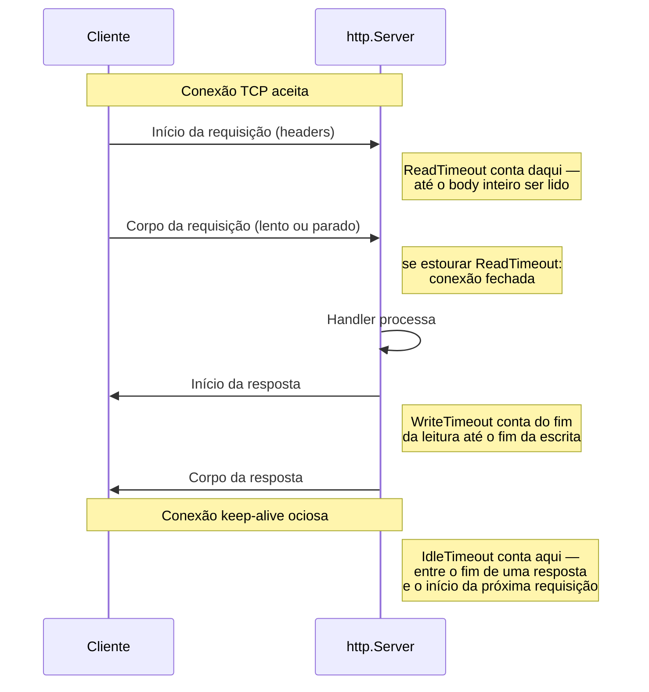
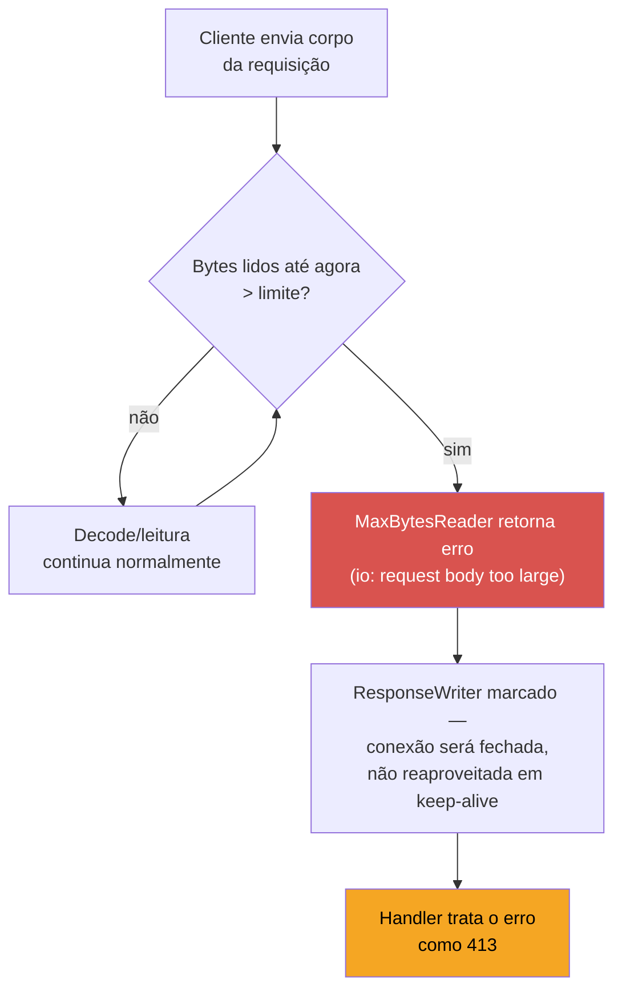

# Servindo em produção — timeouts e limites

> [!abstract] TL;DR
> `http.ListenAndServe(":8080", handler)` — o atalho que a nota 01 usou pra tirar o servidor do chão — não tem timeout nenhum. Um cliente que abre conexão e nunca manda o corpo da requisição, ou nunca lê a resposta, prende essa goroutine (e o socket) indefinidamente: é a base do ataque **Slowloris**, e também acontece sem malícia nenhuma com clientes móveis em rede ruim. A defesa é configurar `http.Server{ReadTimeout, WriteTimeout, IdleTimeout, MaxHeaderBytes}` explicitamente, e limitar o tamanho do body com `http.MaxBytesReader`. Nenhum desses campos tem valor padrão sensato — `Server{}` zerado equivale a "sem limite" em todos eles. Esta nota fecha o galho com o mínimo que separa um servidor de brinquedo de um que aguenta tráfego real; graceful shutdown — o outro pilar de produção — fica para o Galho 18.

## O ataque que nasce de um `ListenAndServe` esquecido

Imagine o servidor REST que a nota 06 construiu, rodando exposto na internet com o atalho mais simples possível:

```go
http.ListenAndServe(":8080", router)
```

Funciona perfeitamente nos testes. Em produção, alguém abre uma conexão TCP com o servidor e manda o primeiro byte do cabeçalho HTTP — e só isso. Nenhum `\r\n\r\n` que feche os headers, nenhum corpo. A goroutine que a stdlib alocou pra atender essa conexão (nota 01: uma goroutine por conexão aceita) fica parada, bloqueada num `Read` que nunca completa, esperando o resto de uma requisição que nunca chega.

Uma conexão assim não custa quase nada. Mas um atacante abre milhares delas ao mesmo tempo — cada uma consumindo uma goroutine e um file descriptor, nenhuma nunca terminando. É o ataque **Slowloris**, batizado em 2009 pela ferramenta que o popularizou: não precisa de banda, não precisa de volume de dados, só precisa manter conexões vivas e lentas o bastante pra esgotar os recursos do servidor antes que algum limite de sistema operacional intervenha. Servidores clássicos como o Apache em modo *prefork* (um processo do SO por conexão) eram particularmente vulneráveis, porque o custo por conexão presa era alto; o modelo de goroutines do Go é mais barato por conexão, mas "mais barato" não é "grátis" — milhares de goroutines presas ainda competem por memória, por file descriptors, e eventualmente por tempo de scheduler.

E o pior: nem precisa ser um ataque. Um app mobile em 3G instável, um proxy corporativo mal configurado, um cliente com bug que trava no meio do upload — todos produzem exatamente o mesmo padrão observável no servidor, sem intenção maliciosa nenhuma. Do ponto de vista do `http.Server`, uma conexão lenta por acidente e uma conexão lenta por ataque são indistinguíveis; a defesa que resolve uma resolve a outra.

`http.Server{}` sem configuração não se defende de nenhum dos dois casos porque, por design, ele não assume nada sobre quanto tempo uma requisição "deveria" levar — a stdlib atende tanto um microsserviço interno de baixa latência quanto um servidor que aceita upload de vídeos de 2 GB, e esses dois cenários têm expectativas de tempo completamente diferentes. Dar um valor padrão "razoável" seria, na prática, errar para um dos dois. Cabe a quem configura o servidor decidir isso — a stdlib se recusa a adivinhar.

## Quanto custa uma conexão presa, em números

Vale colocar peso concreto atrás da palavra "esgotar recursos", porque sem número a ameaça soa abstrata. Cada goroutine no Go começa com uma stack pequena (a partir de 2 KiB, crescendo sob demanda — a nota sobre goroutines, no Galho 7, cobre o mecanismo) — então mil goroutines presas custam alguns megabytes de stack, não é isso que derruba o processo primeiro. O gargalo real costuma ser outro: cada conexão aceita também consome um **file descriptor** do sistema operacional, e o limite padrão de descritores abertos por processo em muitas distribuições Linux é 1024 (`ulimit -n`). Um Slowloris com pouco mais de mil conexões simultâneas já é suficiente para bater nesse teto — depois disso, `accept()` começa a falhar, e o servidor para de aceitar conexões **novas**, inclusive as legítimas. Não é preciso derrubar o processo para causar indisponibilidade; basta esgotar um recurso do SO que ele depende.

Isso reforça por que timeout é defesa estrutural, não só cosmética: sem `ReadTimeout`, o número de conexões presas cresce sem limite enquanto o ataque (ou a instabilidade de rede) continuar; com `ReadTimeout` configurado, cada conexão presa tem vida útil máxima garantida — o pior caso deixa de ser "sem limite" e passa a ser "tantas conexões simultâneas quanto o atacante conseguir abrir dentro da janela de timeout", um número finito e defensável com outras camadas (rate limiting por IP, firewall, WAF).

## Os quatro campos que faltam no atalho

`http.ListenAndServe` é só um wrapper de conveniência em cima de `http.Server` — a nota 01 já mostrou isso. A versão de produção nunca usa o atalho; monta o `Server` explicitamente:

```go
srv := &http.Server{
    Addr:           ":8080",
    Handler:        router,
    ReadTimeout:    5 * time.Second,
    WriteTimeout:   10 * time.Second,
    IdleTimeout:    120 * time.Second,
    MaxHeaderBytes: 1 << 20, // 1 MiB
}
log.Fatal(srv.ListenAndServe())
```

Cada campo cobre uma fase diferente do ciclo de vida de uma conexão HTTP:



- **`ReadTimeout`** — prazo máximo entre o servidor aceitar a conexão e terminar de ler a requisição inteira (headers + body). Se o cliente for lento demais mandando dados, a conexão é fechada e a goroutine liberada. É a defesa direta contra Slowloris no lado da leitura.
- **`WriteTimeout`** — prazo máximo para escrever a resposta, contado a partir do fim da leitura da requisição. Protege contra clientes que abrem a conexão, mandam a requisição normalmente, e depois nunca leem a resposta (o TCP send buffer enche e o `Write` do servidor bloqueia).
- **`IdleTimeout`** — só entra em jogo com conexões keep-alive: quanto tempo uma conexão pode ficar aberta e ociosa entre o fim de uma resposta e o início da próxima requisição, antes do servidor derrubá-la. Sem isso, um cliente pode manter milhares de conexões keep-alive abertas "por via das dúvidas", nunca as fechando.
- **`MaxHeaderBytes`** — tamanho máximo, em bytes, que o servidor aceita para os headers de uma requisição (linha de request + todos os headers). O padrão da stdlib, quando o campo fica zerado, é `DefaultMaxHeaderBytes` (1 MiB) — generoso o bastante para a maioria dos casos, mas vale declarar explicitamente quando o servidor aceita headers grandes por design (tokens JWT enormes em `Authorization`, por exemplo) ou quando se quer um teto mais apertado.

> [!question]- `IdleTimeout` também vale para conexões HTTP/2?
> Sim, com uma nuance: em HTTP/2, uma única conexão TCP multiplexa várias requisições simultâneas (a nota 03 deste galho toca em `Request`/`Response`, mas não entra em HTTP/2 a fundo — vale registrar aqui que o modelo muda). `IdleTimeout` continua contando o tempo em que a conexão como um todo fica sem nenhum stream ativo — não se aplica por-stream. Na prática, isso significa que uma conexão HTTP/2 com tráfego intermitente mas nunca totalmente parada não estoura `IdleTimeout`, mesmo que streams individuais fiquem quietos por um tempo — o campo protege contra a conexão inteira ficando ociosa, não contra qualquer lentidão pontual dentro dela.

> [!info] `ReadHeaderTimeout`, mais granular que `ReadTimeout`
> Existe um quinto campo, `ReadHeaderTimeout`, que limita só a fase de leitura dos **headers** — antes do body. Em requisições com upload de arquivo grande, um `ReadTimeout` único obriga a escolher entre "tempo curto o bastante pra barrar headers lentos" e "tempo longo o bastante pra não cortar o upload no meio". `ReadHeaderTimeout` separa as duas fases: headers precisam chegar rápido, o body pode ter seu próprio prazo (ou nenhum, se o limite de tamanho do body já resolver o risco). Quando presente, ele tem prioridade sobre a fase de headers do `ReadTimeout`.

> [!warning] Nenhum desses campos tem valor padrão seguro
> `http.Server{Addr: ":8080", Handler: router}` sem mais nada equivale a `ReadTimeout: 0`, `WriteTimeout: 0`, `IdleTimeout: 0` — **zero significa sem limite**, não "um limite razoável". A [documentação oficial](https://pkg.go.dev/net/http#Server) é explícita: esses campos existem justamente porque a stdlib se recusa a adivinhar um valor. É responsabilidade de quem configura o servidor escolher números adequados à carga esperada — não existe "vem seguro por padrão" aqui.

| Campo | Zero-value significa | Ponto de partida comum |
|---|---|---|
| `ReadTimeout` | sem limite de leitura | 5-10s para APIs JSON; minutos para upload |
| `WriteTimeout` | sem limite de escrita | 10-30s; maior se a resposta envolve streaming |
| `IdleTimeout` | sem limite de ociosidade em keep-alive | 60-120s |
| `MaxHeaderBytes` | `DefaultMaxHeaderBytes` (1 MiB) — este é o único que já vem com um piso | manter o default, salvo necessidade específica |

Os números da coluna "ponto de partida comum" não são uma tabela mágica a copiar sem pensar — são o intervalo que se vê repetido em código de produção real, servindo de âncora para calibrar contra o próprio tráfego (latência de banco, tamanho médio de payload, se há upload). Medir a latência p99 real do handler antes de fixar `WriteTimeout` evita cortar requisições legítimas que só são um pouco mais lentas que a média.

> [!question]- Por que não usar sempre um número bem alto, tipo 5 minutos, e nunca se preocupar?
> Porque isso devolve exatamente o problema que os timeouts existem para resolver: um atacante Slowloris consegue manter a conexão viva por menos que 5 minutos sem esforço nenhum, então um timeout "de segurança" alto não protege de fato. O valor certo é o menor que ainda acomoda o tráfego legítimo mais lento — não o maior que "nunca vai incomodar ninguém". Um `ReadTimeout` de 5 minutos numa API que responde em 200ms na prática não está protegendo nada; só está adiando o problema.

## Limitando o tamanho do body

Timeouts protegem contra conexões *lentas*. Mas um cliente pode ser rápido e ainda assim malicioso: mandar 50 GB de corpo em poucos segundos, numa rede boa, tentando estourar a memória do servidor se o handler ler o body inteiro para um `[]byte` ou fazer `json.Decode` direto num `io.Reader` sem limite.

`http.MaxBytesReader` resolve isso envolvendo o `http.Request.Body` num reader que aborta com erro assim que o limite é ultrapassado:

```go
const maxBodySize = 1 << 20 // 1 MiB

func criarPedido(w http.ResponseWriter, r *http.Request) {
    r.Body = http.MaxBytesReader(w, r.Body, maxBodySize)

    var pedido Pedido
    if err := json.NewDecoder(r.Body).Decode(&pedido); err != nil {
        http.Error(w, "corpo inválido ou grande demais", http.StatusRequestEntityTooLarge)
        return
    }

    // ... processa pedido
}
```

`MaxBytesReader` precisa do `http.ResponseWriter` como primeiro argumento porque, ao detectar que o limite foi excedido, ele fecha a conexão em vez de deixar o servidor continuar lendo bytes que serão descartados — é uma proteção ativa, não passiva. O `Decode` que estoura o limite retorna um erro que dá pra tratar como `413 Request Entity Too Large`.

> [!warning] `MaxBytesReader` protege o body — não headers nem query string
> O limite de headers é `MaxHeaderBytes`, separado. A query string vem embutida na linha de request, então também cai sob `MaxHeaderBytes` — não sob `MaxBytesReader`. Os dois limites cobrem partes diferentes da requisição e precisam ser configurados os dois, não um no lugar do outro.



`MaxBytesReader` não espera o body inteiro chegar para então medir o tamanho — ele conta bytes conforme lê, e aborta assim que o total ultrapassa o limite, no meio da leitura. É por isso que ele intercepta um upload de 50 GB depois de gastar só `maxBodySize` bytes de esforço, não os 50 GB inteiros: o desperdício de banda e memória fica limitado ao próprio teto configurado.

> [!question]- E se eu esquecer de setar `r.Body = http.MaxBytesReader(...)` em algum handler?
> Esse handler específico fica sem limite de body — `MaxBytesReader` não é global, é por request, aplicado explicitamente em cada handler (ou via middleware, como no caso prático 3 adiante). Não existe um "modo produção" que ative isso para todos os handlers de uma vez sem que alguém escreva o código. Esquecer é um erro silencioso: nada quebra em desenvolvimento, o risco só aparece sob payload hostil em produção — motivo a mais para tratar limite de body como parte do middleware padrão de toda rota que aceita `POST`/`PUT`/`PATCH`, e não como opt-in caso a caso.

## `http.TimeoutHandler`: timeout por rota, não por conexão

`ReadTimeout`/`WriteTimeout` protegem a *conexão* inteira, mas às vezes o problema não é um cliente lento — é o próprio handler que demora demais processando (uma consulta cara, uma chamada a um serviço externo que não responde). Para isso, a stdlib oferece `http.TimeoutHandler`, que envolve um handler e devolve `503 Service Unavailable` se ele não terminar dentro do prazo — sem depender de timeout de conexão nenhum:

```go
handler := http.TimeoutHandler(
    http.HandlerFunc(handleRelatorioPesado),
    3*time.Second,
    `{"erro":"tempo esgotado gerando o relatório"}`,
)

mux.Handle("GET /relatorios/pesado", handler)
```

A diferença estrutural em relação a `ReadTimeout`/`WriteTimeout` importa: `TimeoutHandler` mede o tempo do **handler**, não da conexão TCP como um todo, e produz uma resposta HTTP válida (o corpo customizado, com `503`) em vez de simplesmente fechar a conexão. É a ferramenta certa quando o risco não é o cliente ser lento, mas o backend (banco, serviço externo, cálculo pesado) ser lento — o cenário que o segundo callout de armadilhas, mais adiante, descreve em detalhe.

> [!warning] `TimeoutHandler` não cancela a goroutine do handler original
> Quando o prazo estoura, `TimeoutHandler` escreve a resposta de erro e retorna para o cliente — mas a goroutine que estava executando `handleRelatorioPesado` **continua rodando em segundo plano** até terminar sozinha ou até o processo morrer. Ela só é interrompida de fato se o handler observar `r.Context().Done()` internamente (o `TimeoutHandler` cancela o contexto da requisição ao estourar o prazo) e parar o trabalho por conta própria. Sem esse cuidado, `TimeoutHandler` melhora a experiência do cliente — que já não fica esperando — mas não economiza recurso nenhum do servidor: o mesmo problema de fundo do segundo `[!warning]` da seção de armadilhas.

## Casos práticos

**1. Servidor de produção completo**, juntando os quatro campos e o limite de body num único `main`:

```go
package main

import (
    "encoding/json"
    "log/slog"
    "net/http"
    "time"
)

const maxBodySize = 1 << 20 // 1 MiB

func handleCriarPedido(w http.ResponseWriter, r *http.Request) {
    r.Body = http.MaxBytesReader(w, r.Body, maxBodySize)

    var pedido struct {
        Item string `json:"item"`
    }
    if err := json.NewDecoder(r.Body).Decode(&pedido); err != nil {
        http.Error(w, "corpo inválido ou grande demais", http.StatusRequestEntityTooLarge)
        return
    }

    w.WriteHeader(http.StatusCreated)
    json.NewEncoder(w).Encode(pedido)
}

func main() {
    mux := http.NewServeMux()
    mux.HandleFunc("POST /pedidos", handleCriarPedido)

    srv := &http.Server{
        Addr:           ":8080",
        Handler:        mux,
        ReadTimeout:    5 * time.Second,
        WriteTimeout:   10 * time.Second,
        IdleTimeout:    120 * time.Second,
        MaxHeaderBytes: 1 << 20,
    }

    slog.Info("servidor no ar", "addr", srv.Addr)
    if err := srv.ListenAndServe(); err != nil {
        slog.Error("servidor caiu", "erro", err)
    }
}
```

> [!info] `mux.HandleFunc("POST /pedidos", ...)` — roteamento por método, Go 1.22+
> A sintaxe `"POST /pedidos"` no `ServeMux` da stdlib (roteamento por método + wildcards de path) só existe a partir do Go 1.22 — a nota 02 deste galho cobre o roteador novo em detalhe.

**2. `ReadHeaderTimeout` separado de `ReadTimeout`**, para o cenário de upload:

```go
srv := &http.Server{
    Addr:              ":8080",
    Handler:           router,
    ReadHeaderTimeout: 3 * time.Second,  // headers precisam chegar rápido
    ReadTimeout:       2 * time.Minute,  // upload de arquivo pode demorar mais
    WriteTimeout:      30 * time.Second,
    IdleTimeout:        90 * time.Second,
}
```

**3. Limite de body diferente por rota**, quando algumas rotas legitimamente aceitam payloads maiores (upload de imagem, por exemplo) e outras não:

```go
func limitarBody(max int64) func(http.Handler) http.Handler {
    return func(next http.Handler) http.Handler {
        return http.HandlerFunc(func(w http.ResponseWriter, r *http.Request) {
            r.Body = http.MaxBytesReader(w, r.Body, max)
            next.ServeHTTP(w, r)
        })
    }
}

mux.Handle("POST /pedidos", limitarBody(1<<20)(handleCriarPedido))      // 1 MiB
mux.Handle("POST /uploads", limitarBody(20<<20)(handleUploadImagem))    // 20 MiB
```

Esse middleware é o mesmo padrão de composição de handlers que a nota 04 estabeleceu — só que aqui o middleware protege recursos do servidor, não só adiciona comportamento de request/response.

**4. Verificando o timeout com `httptest`**, para não confiar de olho na configuração — um teste que prova que o limite de body realmente corta um payload grande demais:

```go
package main

import (
    "bytes"
    "net/http"
    "net/http/httptest"
    "strings"
    "testing"
)

func TestCriarPedido_BodyGrandeDemaisRetorna413(t *testing.T) {
    corpoGigante := strings.Repeat("a", maxBodySize+1)
    req := httptest.NewRequest(http.MethodPost, "/pedidos", bytes.NewBufferString(corpoGigante))
    rec := httptest.NewRecorder()

    handleCriarPedido(rec, req)

    if rec.Code != http.StatusRequestEntityTooLarge {
        t.Fatalf("esperava 413, recebeu %d", rec.Code)
    }
}
```

`httptest.NewRequest`/`NewRecorder` simulam a requisição e capturam a resposta sem abrir socket nenhum — o mesmo par de utilitários usado para testar handlers na nota 06, agora provando que o limite configurado é respeitado de fato, não só documentado num comentário.

**5. Servidor com TLS**, porque em produção o `http.Server` quase sempre serve HTTPS diretamente ou atrás de um terminador de TLS — os mesmos campos de timeout se aplicam, com uma nuance: `ReadTimeout` começa a contar **depois** do handshake TLS terminar, não antes, então um handshake lento não é coberto por ele (é coberto por limites do próprio SO/kernel ou de um proxy na frente):

```go
srv := &http.Server{
    Addr:           ":8443",
    Handler:        router,
    ReadTimeout:    5 * time.Second,
    WriteTimeout:   10 * time.Second,
    IdleTimeout:    120 * time.Second,
    MaxHeaderBytes: 1 << 20,
    TLSConfig: &tls.Config{
        MinVersion: tls.VersionTLS12,
    },
}

log.Fatal(srv.ListenAndServeTLS("cert.pem", "key.pem"))
```

`ListenAndServeTLS` é o equivalente de `ListenAndServe` para HTTPS — recebe o caminho do certificado e da chave privada, e os mesmos quatro campos de timeout continuam valendo exatamente como no servidor HTTP puro. `TLSConfig.MinVersion` aqui é bônus de segurança fora do escopo desta nota (autenticação/TLS avançado pertence à trilha de Auth e Identidade), mas aparece porque é comum configurar os dois — timeout e versão mínima de TLS — no mesmo lugar, ao montar o `Server` de produção.

## Armadilhas comuns

> [!warning] `WriteTimeout` conta a partir do começo da leitura, não do começo da escrita
> É um detalhe fácil de errar ao dimensionar o valor: `WriteTimeout` não começa a contar quando o handler chama `w.Write` pela primeira vez — começa quando a conexão foi aceita, cobrindo leitura da requisição *e* escrita da resposta juntas (na prática, "do início ao fim da troca"). Um handler que demora para processar (consulta lenta ao banco, por exemplo) consome esse mesmo orçamento de tempo antes mesmo de começar a escrever. Se o processamento é naturalmente lento, o timeout precisa contemplar isso — ou o processamento pesado deve rodar fora do caminho síncrono da requisição.

> [!warning] Timeout de servidor não é timeout de contexto do handler
> `ReadTimeout`/`WriteTimeout` fecham a *conexão* de fora — não cancelam automaticamente o `context.Context` da requisição nem interrompem uma query de banco em andamento dentro do handler. Um handler preso numa query de 30 segundos, com `WriteTimeout: 10s`, faz o cliente ver a conexão cair aos 10s — mas a goroutine do handler continua rodando até a query terminar, a não ser que o próprio handler observe `r.Context().Done()` (assunto do Galho 9, sobre `context`) e aborte o trabalho. Timeout de servidor e cancelamento de contexto resolvem problemas parecidos em camadas diferentes — configurar um sem o outro deixa uma lacuna: o cliente para de esperar, mas o trabalho continua consumindo recursos no servidor até a query natural terminar sozinha.

> [!warning] `srv.ListenAndServe()` nunca retorna sozinho de forma limpa
> `ListenAndServe` bloqueia até o servidor parar — e quando para "sozinho", é porque algo deu errado (`err != nil`). Um `Ctrl+C` no processo, hoje, mata as conexões abruptamente: não há como o servidor terminar requisições em andamento antes de sair. Isso funciona para desenvolvimento local, mas em produção derruba requisições no meio, sem chance de responder ao cliente. Isso é exatamente o que graceful shutdown resolve — teaser da próxima seção.

> [!warning] Atrás de um proxy reverso, `ReadTimeout` ainda importa
> É tentador achar que, com nginx ou um load balancer na frente, o `http.Server` do Go fica isento de configurar timeouts próprios — "o proxy já filtra tráfego malicioso antes de chegar aqui". Na prática, o proxy reduz a exposição direta à internet, mas a conexão entre o proxy e o processo Go continua sendo uma conexão HTTP comum, sujeita aos mesmos problemas: um proxy mal configurado, um serviço interno lento, ou um bug no próprio proxy podem produzir conexões penduradas do mesmo jeito. Defesa em profundidade significa configurar os dois — proxy e `http.Server` — não escolher um dos dois.

> [!warning] Testar timeout localmente com `curl` normal não prova nada
> `curl http://localhost:8080/pedidos` sempre manda o body inteiro de uma vez, então nunca aciona `ReadTimeout` — testar a configuração exige simular lentidão de verdade. `curl` tem uma flag para isso, `--limit-rate`, que throttla a taxa de envio (`curl --limit-rate 10 -d @arquivo.json ...`), útil para confirmar que o timeout realmente derruba uma conexão lenta antes de confiar cegamente na configuração.

## Diagnosticando na prática: quantas conexões estão presas agora?

Configurar os timeouts é a defesa preventiva. Mas em produção também vale saber **observar** o sintoma antes de o problema virar incidente — descobrir que o servidor está com milhares de goroutines penduradas não deveria depender de esperar o `accept()` começar a falhar. A stdlib expõe isso de graça: importar `net/http/pprof` (só pelo efeito colateral do `import`) registra endpoints de diagnóstico no `DefaultServeMux`, incluindo a contagem de goroutines ativas em tempo real:

```go
import (
    _ "net/http/pprof" // registra /debug/pprof/* no DefaultServeMux
)

func main() {
    go func() {
        log.Println(http.ListenAndServe("localhost:6060", nil))
    }()

    // ... o resto do servidor de produção continua no seu próprio mux/porta
}
```

Com isso no ar, `curl http://localhost:6060/debug/pprof/goroutine?debug=1` lista quantas goroutines existem e onde cada uma está bloqueada — se um Slowloris estiver em andamento, a saída mostra centenas ou milhares de goroutines paradas exatamente no ponto de leitura do body, uma assinatura fácil de reconhecer. É diagnóstico, não prevenção: os timeouts configurados nas seções anteriores continuam sendo a defesa; `pprof` é a lanterna para confirmar que a defesa está (ou não) segurando.

> [!warning] Nunca exponha `/debug/pprof` na porta pública
> O exemplo acima liga o servidor de diagnóstico em `localhost:6060` — uma porta separada, deliberadamente amarrada a `localhost`, nunca na mesma porta nem no mesmo `Handler` que atende tráfego externo. `pprof` expõe informação interna (stack traces, uso de memória, até um profiler de CPU sob demanda) que não deveria ser alcançável por qualquer cliente da internet — um erro de configuração comum é registrar `net/http/pprof` no mesmo mux que já está exposto publicamente, sem perceber que o `import _` sozinho já registra os handlers no `DefaultServeMux` global.

## Checklist de fechamento do galho

Antes de considerar um `http.Server` "pronto para produção" no sentido estrito coberto por esta nota — sem contar graceful shutdown, que fica para o Galho 18 — vale conferir:

- [ ] `ReadTimeout`, `WriteTimeout` e `IdleTimeout` configurados com valores calibrados contra o tráfego real (não copiados de um exemplo sem pensar)
- [ ] `MaxHeaderBytes` revisado se o servidor aceita headers incomuns (tokens grandes, cookies volumosos)
- [ ] `http.MaxBytesReader` aplicado — direto ou via middleware — em toda rota que aceita body
- [ ] Handlers que dependem de recursos externos lentos (banco, APIs de terceiros) observam `r.Context()` para não continuar trabalhando depois que o cliente já desistiu
- [ ] Se há operação isoladamente pesada, considerado `http.TimeoutHandler` nela, não só o timeout global de conexão

## Teaser: graceful shutdown

Timeouts e limites protegem o servidor *enquanto ele está no ar*. Mas o momento de **desligar** o servidor tem seu próprio problema: como parar de aceitar conexões novas, mas deixar as requisições já em andamento terminarem antes do processo morrer? A resposta é `srv.Shutdown(ctx)` — um método que fecha o listener, espera as conexões ativas até um timeout, e só então retorna. É peça central de qualquer deploy que não pode simplesmente matar o processo (rolling deploy, `SIGTERM` de Kubernetes, scale-down). Esse mecanismo — junto com sinais do SO, `signal.NotifyContext` e a integração com orquestradores — é o assunto completo do Galho 18, mais adiante na trilha.

## Lente cross-stack: quem já configurou isso antes

| Vindo de | Em Go é assim |
|---|---|
| Node.js (`http.Server`) | `server.timeout`, `server.headersTimeout`, `server.requestTimeout` cobrem papéis parecidos — Node também não vinha com defesa contra Slowloris habilitada por padrão em versões antigas; `headersTimeout` chegou tarde (Node 11.3) justamente por esse motivo |
| Java (Tomcat/Spring Boot embarcado) | `server.tomcat.connection-timeout`, `server.tomcat.max-swallow-size` no `application.properties` — Tomcat historicamente já vinha com timeouts padrão mais conservadores que o `http.Server{}` cru do Go, o que engana quem assume que "todo servidor de produção já vem protegido" |
| Python (Django/Flask atrás de WSGI) | Django e Flask puros não servem tráfego real sozinhos — rodam atrás de Gunicorn/uWSGI, e é lá que ficam `timeout`, `graceful-timeout`, `limit-request-line`. O paralelo mais próximo de configurar o `http.Server` do Go é configurar os *workers* do Gunicorn, não o framework web em si |
| nginx/Apache na frente | `client_body_timeout`, `client_header_timeout`, `client_max_body_size` no nginx fazem exatamente o mesmo papel — um proxy reverso na frente do servidor Go às vezes cobre parte disso, mas não dispensa configurar o `http.Server` também: defesa em profundidade, não substituição |
| Gin/Echo/Chi (frameworks deste galho) | Nenhum dos três substitui essa configuração — todos rodam **sobre** um `http.Server`, então `srv.ReadTimeout` etc. continuam sendo setados exatamente como aqui, passando o `*gin.Engine`/`echo.Echo`/`chi.Mux` como `Handler`. Timeout de framework (quando existe, como middlewares de timeout do Echo) atua na camada do handler, não substitui o timeout de conexão da camada do `net/http` |

A observação que atravessa todas as linguagens e frameworks: nenhum runtime HTTP popular assume timeouts sensatos por padrão para código escrito à mão — a defesa é sempre configuração explícita, em algum nível da pilha, e frameworks web (Gin, Echo, Express, Flask) não eliminam a necessidade de configurar a camada de baixo nível por baixo deles.

## Como explicar em inglês

> A bare `http.ListenAndServe` has no timeouts at all — a slow or stalled client can hold a goroutine and a socket open indefinitely, which is the mechanism behind a Slowloris attack and also happens innocently with flaky mobile connections. Production code always builds an explicit `http.Server{ReadTimeout, WriteTimeout, IdleTimeout, MaxHeaderBytes}` instead of using the shortcut, because every one of those fields defaults to zero — meaning **unlimited**, not "sensible default." `ReadTimeout` and `WriteTimeout` bound how long the connection can take to read the request and write the response; `IdleTimeout` bounds how long a keep-alive connection can sit idle between requests; `MaxHeaderBytes` caps header size. Separately, `http.MaxBytesReader` caps the size of the request body itself, aborting the read (and closing the connection) once a client sends more than expected. None of this covers clean shutdown — stopping the listener while letting in-flight requests finish — which is what `Server.Shutdown` handles, a topic on its own.

| Termo PT | Termo EN |
|---|---|
| tempo limite | timeout |
| conexão ociosa | idle connection |
| conexão persistente | keep-alive connection |
| corpo da requisição | request body |
| desligamento gracioso | graceful shutdown |
| limite de tamanho | size limit |
| ataque de exaustão de conexões | connection exhaustion attack |

## O que vem a seguir

Esta nota fecha o Galho 10 — do zero em `net/http` até um servidor com timeouts e limites de produção. Mas um servidor endurecido contra ataque ainda guarda dados em memória, sem persistência nenhuma: os `Pedido`s da nota 06 desaparecem no restart. O **Galho 11 — Persistência** entra exatamente aí: `database/sql`, drivers, connection pooling, migrations — como um handler Go conversa com um banco de verdade, de forma que sobrevive ao processo reiniciar.

## Veja também

- [[01 - O servidor HTTP da stdlib]] — `http.Server` e `ListenAndServe` introduzidos, sem timeouts ainda
- [[04 - Middleware]] — composição de handlers, reaproveitada aqui para limitar body por rota
- [[06 - REST idiomático em Go]] — o servidor de pedidos que esta nota torna pronto para produção
- [[07 - Clientes HTTP]] — o mesmo cuidado com timeout, do lado do cliente HTTP
- [[03-Dominios/Tecnologia/Go/index|Trilha Go]]

## Fontes

- The Go Authors. *net/http package documentation — type Server*. pkg.go.dev. https://pkg.go.dev/net/http#Server (acessado em 2026-07-18)
- The Go Authors. *net/http package documentation — MaxBytesReader*. pkg.go.dev. https://pkg.go.dev/net/http#MaxBytesReader (acessado em 2026-07-18)
- Cloudflare. *What is a Slowloris DDoS attack?*. cloudflare.com. https://www.cloudflare.com/learning/ddos/ddos-attack-tools/slowloris/ (acessado em 2026-07-18)
- The Go Blog. *Package net/http, the ServeMux, and enhanced routing patterns*. go.dev. https://go.dev/blog/routing-enhancements (acessado em 2026-07-18)
- The Go Authors. *net/http package documentation — ListenAndServe*. pkg.go.dev. https://pkg.go.dev/net/http#ListenAndServe (acessado em 2026-07-18)
- The Go Authors. *net/http/pprof package documentation*. pkg.go.dev. https://pkg.go.dev/net/http/pprof (acessado em 2026-07-18)
