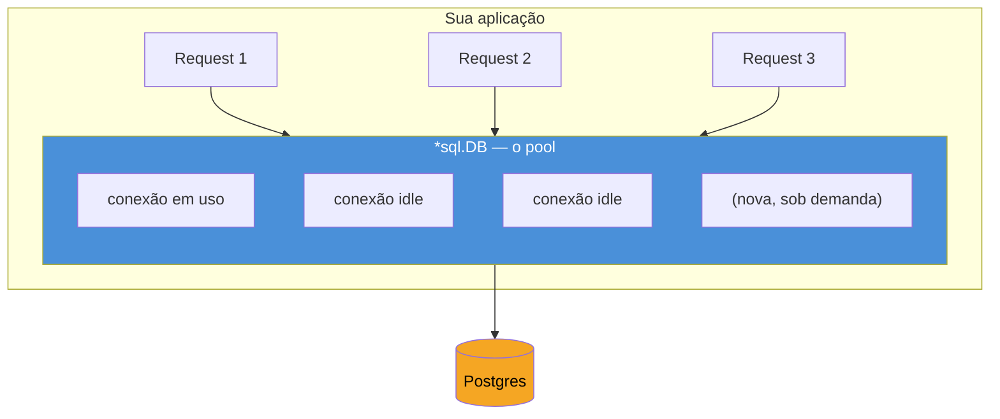
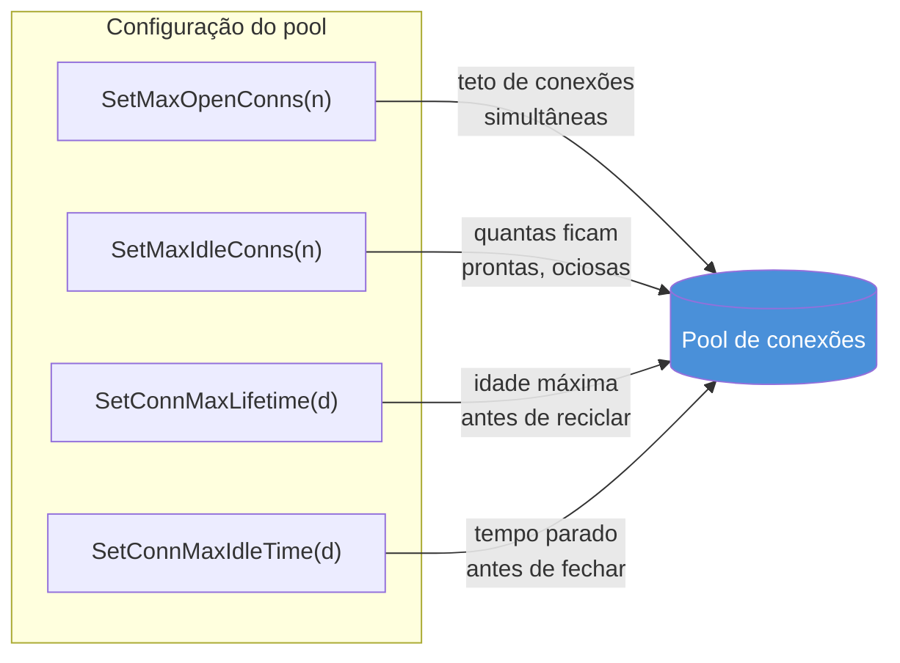

# Connection pool

> [!abstract] TL;DR
> `*sql.DB` não é uma conexão — é um **pool** gerenciado pelo driver de `database/sql`. Quatro métodos controlam esse pool: `SetMaxOpenConns` (teto de conexões simultâneas, abertas + em uso), `SetMaxIdleConns` (quantas ficam mortas de prontidão), `SetConnMaxLifetime` (idade máxima antes de reciclar) e `SetConnMaxIdleTime` (tempo parado antes de fechar). Sem configurar nada, o pool tem `MaxOpenConns` ilimitado e `MaxIdleConns` = 2 — uma combinação que tanto esgota o Postgres sob carga quanto reabre conexão a cada request em baixa carga. `db.Stats()` expõe o estado do pool em tempo real, e é a base pra decidir os quatro números certos em vez de chutar.

## O problema que o pool resolve

Imagine que cada request HTTP no seu serviço Go precisasse abrir uma conexão TCP nova com o Postgres, fazer o handshake, autenticar, rodar a query, e só depois fechar. Numa API que atende 500 requests por segundo, isso significa 500 handshakes por segundo — cada um custando alguns milissegundos que nada têm a ver com a query em si. O banco de dados também sofre: cada conexão nova consome memória e um processo backend no Postgres, e abrir/fechar centenas por segundo é trabalho puro de overhead.

A resposta padrão em qualquer stack madura é **connection pooling**: manter um conjunto de conexões já abertas e autenticadas, emprestá-las para quem precisa, e devolvê-las ao pool assim que a query termina — em vez de destruir e recriar. Em Java isso é o HikariCP (ou o pool do JPA/Spring); em Node, o `pg.Pool` do driver `pg`; em Python, o `QueuePool` do SQLAlchemy. A diferença em Go é que o pool não é uma biblioteca terceira: ele **já vem embutido** em `*sql.DB`, como a [[01 - database-sql — o contrato|nota 01]] já adiantou. Só que "vem embutido" não é a mesma coisa que "vem configurado direito" — e é aí que este capítulo entra.

## `*sql.DB` já é um pool, não uma conexão

A confusão mais comum de quem chega em Go vindo de outra stack é tratar o valor devolvido por `sql.Open` como se fosse uma conexão única — chamando `Close()` depois de cada query, como faria com um `Connection` do JDBC:

```go
db, err := sql.Open("pgx", dsn)
if err != nil {
    log.Fatal(err)
}
// db NÃO é uma conexão. É um pool.
```

`sql.Open` nem sequer abre uma conexão de verdade — ele só valida os argumentos e prepara a struct `*sql.DB`. A primeira conexão real só acontece na primeira query, ou quando você chama `db.Ping()` explicitamente. A partir daí, `*sql.DB` gerencia um **conjunto** de conexões subjacentes ao banco, abrindo novas sob demanda e reaproveitando as que já existem — tudo isso de forma transparente, escondida atrás de cada `db.QueryContext`, `db.ExecContext` ou `db.Begin`.



`*sql.DB` é seguro para uso concorrente — projetado, segundo a [documentação oficial do pacote](https://pkg.go.dev/database/sql#DB), para ser criado **uma vez** e compartilhado por goroutines à vontade, tipicamente como um valor global ou injetado via struct de dependências. Chamar `sql.Open` a cada request, ou fazer `db.Close()` depois de cada query, destrói o propósito inteiro do pool — e é a armadilha número um de quem só copiou um exemplo de tutorial sem ler a letra miúda.

> [!warning] `db.Close()` é para o desligamento da aplicação, não para o fim de uma query
> `Close()` fecha o pool inteiro — todas as conexões, abertas ou idle — e o `*sql.DB` fica inutilizável depois disso. O lugar certo é um `defer db.Close()` logo após `sql.Open` no `main()`, ou dentro da lógica de graceful shutdown. Chamar `Close()` (ou recriar `db` a cada request) força o programa a reabrir conexão do zero sempre, anulando qualquer ganho de pooling.

## Os quatro botões do pool

`*sql.DB` expõe quatro métodos de configuração — nenhum deles obrigatório, mas os padrões implícitos raramente são o que você quer em produção.



### `SetMaxOpenConns` — o teto

```go
db.SetMaxOpenConns(25)
```

Limita quantas conexões o pool pode ter **abertas ao mesmo tempo**, contando tanto as em uso quanto as ociosas. É o número mais importante dos quatro, porque protege o banco: cada conexão Postgres consome um processo backend (por padrão, Postgres aceita `max_connections = 100` no total, compartilhado entre *todas* as aplicações que falam com ele). Se seu serviço roda com 10 réplicas e cada uma abre conexões ilimitadas sob pico de carga, é fácil estourar o limite do banco e derrubar não só seu serviço, mas qualquer outro cliente conectado ao mesmo Postgres.

O valor padrão, quando você nunca chama `SetMaxOpenConns`, é **zero — que significa ilimitado**, não zero conexões. Esse é o detalhe que mais surpreende: não configurar nada não é uma escolha conservadora, é a escolha mais arriscada de todas.

### `SetMaxIdleConns` — o estoque de prontidão

```go
db.SetMaxIdleConns(25)
```

Controla quantas conexões o pool mantém **abertas e ociosas** (idle) mesmo sem query em andamento, prontas para a próxima requisição sem pagar o custo de handshake de novo. O padrão é **2** — baixíssimo para qualquer aplicação com tráfego real. Com `MaxIdleConns = 2` e um serviço que processa dezenas de requests concorrentes, o pool fica constantemente fechando conexões que acabaram de ser usadas (porque excedem o teto de idle) e reabrindo pouco depois — desperdiçando exatamente o trabalho que o pool existe para evitar.

A recomendação da própria documentação, e prática comum na comunidade, é manter `MaxIdleConns` igual ou próximo de `MaxOpenConns`. Se o teto de conexões abertas é 25, faz pouco sentido permitir só 2 ociosas — as outras 23, quando o tráfego cai, vão ser abertas e fechadas repetidamente.

> [!warning] `MaxIdleConns` maior que `MaxOpenConns` é silenciosamente ajustado para baixo
> Se você chamar `SetMaxIdleConns(50)` depois de `SetMaxOpenConns(25)`, o driver reduz o idle automaticamente para não ultrapassar o teto de abertas — sem erro, sem log. Vale a pena configurar os dois juntos e checar `db.Stats()` depois pra confirmar o efeito real, em vez de assumir que os números pedidos foram os aplicados.

### `SetConnMaxLifetime` — a idade máxima

```go
db.SetConnMaxLifetime(30 * time.Minute)
```

Define por quanto tempo uma conexão pode viver antes de ser fechada e recriada, **mesmo que continue em uso saudável**. Parece contraintuitivo — por que destruir uma conexão que funciona? — mas resolve um problema real de infraestrutura: load balancers e proxies de banco (PgBouncer, AWS RDS Proxy, um Postgres atrás de um failover) às vezes fecham conexões do lado do servidor sem avisar o cliente, ou redistribuem tráfego de forma que uma conexão velha demais aponta pra um nó que já não é mais o líder. Reciclar conexões periodicamente também ajuda a distribuir carga de forma mais uniforme quando o cluster do banco muda de topologia (rebalanceamento, scaling horizontal do lado do banco).

O padrão é **zero, que significa sem limite de vida** — uma conexão pode, em teoria, viver para sempre. Um valor comum em produção fica entre 5 e 30 minutos, dependendo de quão dinâmica é a infraestrutura de banco por trás.

### `SetConnMaxIdleTime` — o tempo parado

```go
db.SetConnMaxIdleTime(5 * time.Minute)
```

Adicionado no Go 1.15, fecha conexões que ficaram **ociosas por tempo demais**, mesmo sem violar `MaxIdleConns`. A diferença para `ConnMaxLifetime` é sutil mas importante: `ConnMaxLifetime` conta a partir de quando a conexão foi *criada*, independente de uso; `ConnMaxIdleTime` conta a partir de quando a conexão *parou de ser usada*. Uma conexão que está sendo usada constantemente pode viver além do `ConnMaxIdleTime` sem problema — o relógio do idle só corre enquanto ela está parada no pool.

Isso importa em serviços com tráfego irregular: um pico de manhã abre 25 conexões, o tráfego cai à noite, e sem `ConnMaxIdleTime` essas 25 conexões continuam abertas e ociosas indefinidamente, consumindo recursos do banco à toa até o próximo pico. Com `ConnMaxIdleTime` configurado, o pool as fecha depois de alguns minutos paradas, e reabre sob demanda quando o tráfego volta.

## Uma configuração de referência

```go
package main

import (
    "database/sql"
    "time"

    _ "github.com/jackc/pgx/v5/stdlib"
)

func newDB(dsn string) (*sql.DB, error) {
    db, err := sql.Open("pgx", dsn)
    if err != nil {
        return nil, err
    }

    db.SetMaxOpenConns(25)
    db.SetMaxIdleConns(25)
    db.SetConnMaxLifetime(30 * time.Minute)
    db.SetConnMaxIdleTime(5 * time.Minute)

    return db, nil
}
```

Não existe um número mágico universal — 25 é um ponto de partida razoável para um serviço de porte médio, não uma lei. O número certo depende de quantas réplicas do serviço rodam simultaneamente (cada uma com seu próprio pool!) e de quantas conexões o banco de fato aguenta: se o Postgres tem `max_connections = 100` e você roda 10 réplicas, `MaxOpenConns = 25` por réplica já estoura o limite total (250 > 100) — o teto precisa ser dividido pensando no cluster inteiro, não numa instância isolada.

> [!info] `SetConnMaxIdleTime` é Go 1.15+
> Os outros três métodos (`SetMaxOpenConns`, `SetMaxIdleConns`, `SetConnMaxLifetime`) existem desde versões bem mais antigas do `database/sql`. `SetConnMaxIdleTime` é o mais novo dos quatro — qualquer Go moderno (1.23+) o tem disponível, mas vale saber a origem se você ler código legado que só usa os outros três.

## `db.Stats()` — observando o pool

Chutar os quatro números sem visibilidade do que está acontecendo é receita pra tuning ruim. `db.Stats()` devolve uma struct `sql.DBStats` com o estado do pool no instante da chamada:

```go
stats := db.Stats()

fmt.Printf("MaxOpenConnections: %d\n", stats.MaxOpenConnections)
fmt.Printf("OpenConnections:    %d\n", stats.OpenConnections)
fmt.Printf("InUse:              %d\n", stats.InUse)
fmt.Printf("Idle:               %d\n", stats.Idle)
fmt.Printf("WaitCount:          %d\n", stats.WaitCount)
fmt.Printf("WaitDuration:       %s\n", stats.WaitDuration)
fmt.Printf("MaxIdleClosed:      %d\n", stats.MaxIdleClosed)
fmt.Printf("MaxLifetimeClosed:  %d\n", stats.MaxLifetimeClosed)
```

Os campos que mais importam pra diagnosticar um pool mal ajustado, segundo a [documentação de `sql.DBStats`](https://pkg.go.dev/database/sql#DBStats):

- **`WaitCount`** e **`WaitDuration`** — quantas vezes uma goroutine precisou *esperar* por uma conexão livre, e quanto tempo total foi gasto esperando. `WaitCount` subindo de forma constante é o sinal mais direto de que `MaxOpenConns` está baixo demais para a carga real — o pool está saturado e requests estão na fila.
- **`InUse`** próximo de `MaxOpenConns`, de forma sustentada — outro sinal de saturação, mesmo antes de `WaitCount` começar a crescer.
- **`MaxIdleClosed`** — quantas conexões foram fechadas por excederem `MaxIdleConns`. Um número alto e crescente sugere que `MaxIdleConns` está baixo demais e o pool está fazendo churn (abrindo e fechando) sem necessidade.
- **`MaxLifetimeClosed`** — conexões fechadas por atingirem `ConnMaxLifetime`. Esperado em qualquer taxa razoável; um número anormalmente alto pode indicar `ConnMaxLifetime` configurado curto demais para a carga.

A forma mais comum de aproveitar isso em produção é expor `db.Stats()` como métricas Prometheus — cada campo vira um gauge ou counter, coletado periodicamente e visualizado num dashboard ao lado de latência e taxa de erro do serviço. Isso permite ver o pool crescer sob carga em tempo real, em vez de descobrir saturação só quando queries começam a estourar timeout.

```go
func exportPoolMetrics(db *sql.DB) {
    ticker := time.NewTicker(15 * time.Second)
    defer ticker.Stop()

    for range ticker.C {
        stats := db.Stats()
        dbOpenConnections.Set(float64(stats.OpenConnections))
        dbInUse.Set(float64(stats.InUse))
        dbIdle.Set(float64(stats.Idle))
        dbWaitCount.Add(float64(stats.WaitCount))
        dbWaitDuration.Add(stats.WaitDuration.Seconds())
    }
}
```

(`dbOpenConnections`, `dbInUse` etc. seriam gauges/counters do cliente Prometheus para Go — `prometheus/client_golang` — declarados fora desse trecho; o padrão de expor métricas de aplicação como HTTP endpoint `/metrics` é assunto do galho de Operação, não deste capítulo.)

## Armadilhas comuns

> [!warning] `MaxOpenConns` ilimitado sob pico de carga derruba o banco, não só o serviço
> Sem `SetMaxOpenConns`, um pico de tráfego pode fazer `*sql.DB` abrir centenas de conexões simultâneas — e como cada conexão consome um processo backend no Postgres, é fácil esgotar `max_connections` do banco inteiro, derrubando não só seu serviço, mas qualquer outra aplicação conectada ao mesmo cluster. Configurar um teto explícito não é otimização prematura — é proteção básica de um recurso compartilhado.

> [!warning] `MaxIdleConns` padrão (2) causa churn silencioso de conexões
> Com o padrão de 2 conexões idle, um serviço com tráfego moderado passa a maior parte do tempo fechando conexões recém-usadas e reabrindo pouco depois — o oposto do que pooling deveria entregar. O sintoma costuma aparecer como latência p99 elevada sem erro nenhum, porque o custo extra é handshake, não falha.

> [!warning] Réplicas multiplicam o pool — pense no cluster, não na instância
> `MaxOpenConns = 25` configurado em cada uma de 10 réplicas de um serviço soma até 250 conexões possíveis contra o banco, não 25. Se o Postgres (ou o PgBouncer na frente dele) tem um teto de `max_connections` mais baixo que isso, o número por réplica precisa ser dividido pensando no total de instâncias rodando, especialmente sob autoscaling onde o número de réplicas varia.

## Vindo de outra stack

| Conceito | Java (HikariCP) | Node (`pg.Pool`) | Go (`*sql.DB`) |
|---|---|---|---|
| Objeto do pool | `HikariDataSource` | `new Pool({...})` | `*sql.DB` (retornado por `sql.Open`) |
| Teto de conexões | `maximumPoolSize` | `max` | `SetMaxOpenConns` |
| Mínimo/idle | `minimumIdle` | `min` | `SetMaxIdleConns` |
| Tempo de vida máximo | `maxLifetime` | (não nativo, requer lógica própria) | `SetConnMaxLifetime` |
| Tempo ocioso máximo | `idleTimeout` | `idleTimeoutMillis` | `SetConnMaxIdleTime` |
| Métricas do pool | JMX / Micrometer | eventos do `Pool` | `db.Stats()` |

A diferença estrutural mais relevante: em Java e Node, o pool é uma **biblioteca separada** do driver — você escolhe HikariCP entre várias opções, ou configura `pg.Pool` manualmente por cima do driver `pg`. Em Go, o pool é parte do próprio pacote padrão `database/sql`, e qualquer driver compatível (`pgx`, `lib/pq`, o driver de MySQL) herda esse comportamento de graça — não há escolha de biblioteca de pooling a fazer, só os quatro parâmetros a ajustar.

## Como explicar em inglês

> `*sql.DB` in Go isn't a single connection — it's a **connection pool**, managed transparently by the standard library. Four methods tune it: `SetMaxOpenConns` caps how many connections can be open at once (open plus in-use), protecting the database from being overwhelmed; `SetMaxIdleConns` controls how many stay warm and ready between requests; `SetConnMaxLifetime` forces connections to be recycled after a fixed age, which helps with load balancers and failover; and `SetConnMaxIdleTime` closes connections that have sat unused too long. The dangerous default is that `MaxOpenConns` is unlimited out of the box, while `MaxIdleConns` defaults to just 2 — a combination that starves the database under load and thrashes connections under moderate traffic. `db.Stats()` exposes live pool state — `WaitCount` and `WaitDuration` in particular are the clearest signal that `MaxOpenConns` is too low for the actual traffic.

| Termo PT | Termo EN |
|---|---|
| pool de conexões | connection pool |
| conexão ociosa | idle connection |
| conexão em uso | in-use connection |
| tempo de vida (da conexão) | connection lifetime |
| saturação do pool | pool exhaustion / pool saturation |
| reciclar conexão | recycle connection |
| esgotar o banco | exhaust the database |
| churn de conexões | connection churn |

## O que vem a seguir

Configurar o pool responde "quantas conexões, por quanto tempo" — mas não diz nada sobre como usar cada conexão emprestada para de fato ler dados do banco e trazê-los pro seu código Go como valores tipados. A [[03 - Query, Scan e o mapeamento manual|nota 03]] pega daqui: como `db.QueryContext` devolve linhas, como `rows.Scan` mapeia colunas pra variáveis Go campo a campo, e as armadilhas de esquecer `rows.Close()` ou de scanear na ordem errada — problema totalmente diferente de gerenciar o pool, mas que só faz sentido depois que o pool já está configurado.

## Veja também

- [[01 - database-sql — o contrato|01 — database/sql — o contrato]] — a interface `*sql.DB` retomada aqui, e por que `sql.Open` não abre conexão de verdade
- [[03 - Query, Scan e o mapeamento manual|03 — Query, Scan e o mapeamento manual]] — próxima nota do galho
- [[04 - pgx — o driver Postgres avançado|04 — pgx — o driver Postgres avançado]] — driver usado nos exemplos deste capítulo
- [[08 - Transações e o padrão repository|08 — Transações e o padrão repository]] — como transações tomam uma conexão emprestada do pool por toda a sua duração
- [[03-Dominios/Tecnologia/Go/index|Trilha Go]]

## Fontes

- The Go Authors. *Package database/sql*. pkg.go.dev. https://pkg.go.dev/database/sql (acessado em 2026-07-18)
- The Go Authors. *database/sql tutorial — Managing connections*. go.dev/doc. https://go.dev/doc/database/manage-connections (acessado em 2026-07-18)
- The Go Authors. *sql.DBStats*. pkg.go.dev. https://pkg.go.dev/database/sql#DBStats (acessado em 2026-07-18)
- The Go Authors. *Go 1.15 Release Notes — database/sql*. go.dev. https://go.dev/doc/go1.15#database-sql (acessado em 2026-07-18)
- Go by Example. *Sql Databases* — visão geral de uso de `database/sql` no ecossistema Go. gobyexample.com. https://gobyexample.com/sql-databases (acessado em 2026-07-18)
