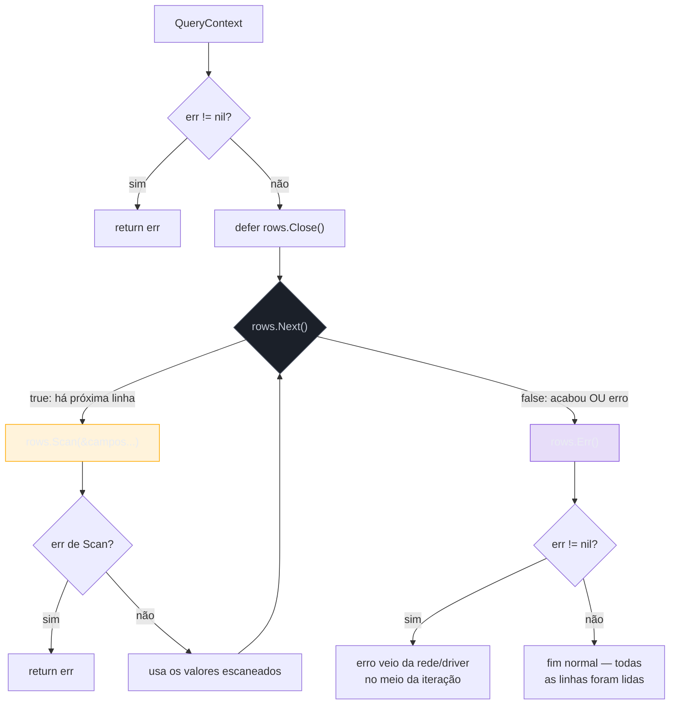

# Query, Scan e o mapeamento manual

> [!abstract] TL;DR
> `QueryContext` devolve um `*sql.Rows` — um cursor aberto sobre a rede, não uma lista pronta. O padrão é sempre o mesmo: `defer rows.Close()`, depois `for rows.Next() { rows.Scan(&campo1, &campo2, ...) }`, e por fim checar `rows.Err()`. Cada chamada a `Scan` copia os valores da linha atual para os endereços passados — na ordem exata das colunas do `SELECT`, sem nome, sem reflection automática. Coluna que pode ser `NULL` no banco quebra um `Scan(&string)` em runtime; o antídoto são os tipos `sql.NullString`, `sql.NullInt64` e primos, ou os tipos genéricos `sql.Null[T]` desde Go 1.22. Não existe ORM por baixo do capô do `database/sql` — o mapeamento struct↔linha é você quem escreve, campo a campo, e é exatamente esse trabalho manual que as notas seguintes (sqlc, GORM) tentam automatizar de formas diferentes.

## O cursor que ninguém pediu para fechar

A nota anterior deixou o pool configurado — `MaxOpenConns`, `MaxIdleConns`, tudo ajustado. Agora vem a pergunta óbvia: como eu efetivamente leio dados?

A tentação de quem vem de um ORM é esperar algo como `db.Find(&users)` — chama um método, recebe uma slice pronta, pronto. O `database/sql` não trabalha assim. Ele devolve um **cursor**:

```go
rows, err := db.QueryContext(ctx, "SELECT id, name, email FROM users WHERE active = $1", true)
if err != nil {
    return nil, err
}
defer rows.Close()
```

`rows` não contém as linhas. Contém uma conexão de rede ainda aberta com o Postgres, no meio de uma transferência de dados que ainda não terminou. Pense numa chamada de vídeo em andamento, não num arquivo já baixado: enquanto `rows` estiver "vivo", a conexão do pool que ele usa está **emprestada** — presa, indisponível para qualquer outra query do seu programa, mesmo que você já tenha lido tudo que precisava.

Isso muda a pergunta "por que preciso fechar `rows`?" de detalhe de limpeza para requisito de correção: enquanto você não fecha (ou drena até o fim, o que fecha implicitamente), aquela conexão não volta para o pool. Num servidor com `MaxOpenConns: 25` e tráfego concorrente, esquecer `rows.Close()` em um caminho de código é a receita clássica para o pool esgotar sob carga — sintoma que só aparece em produção, sob concorrência real, nunca no teste local com uma requisição por vez.

> [!warning] `defer rows.Close()` é seguro mesmo depois de drenar tudo
> Chamar `Close()` numa `*sql.Rows` já totalmente consumida (ou já fechada por erro) não tem efeito nocivo — o método é idempotente. Não existe motivo para *não* colocar o `defer` logo depois do `err == nil` checado. A única forma de vazar conexão de verdade é **não chamar `Close()` em nenhum branch** — inclusive nos de erro no meio do loop.

## O ciclo `Next` / `Scan` / `Err`



Três chamadas, três papéis distintos, que costumam ser confundidos por quem vem de APIs que devolvem uma lista pronta (`ResultSet` do JDBC tem um formato parecido, mas Hibernate/JPA escondem esse laço; em Python, `cursor.fetchall()` do `psycopg2` já entrega tudo materializado):

- **`rows.Next() bool`** — avança o cursor para a próxima linha e devolve `true` se existe uma. Quando devolve `false`, pode significar duas coisas diferentes: acabaram as linhas (caso normal) **ou** um erro de rede/driver interrompeu a leitura no meio. `Next()` nunca conta qual dos dois foi — é papel do passo seguinte.
- **`rows.Scan(dest ...any) error`** — copia os valores da linha *atual* para os ponteiros passados, na ordem das colunas do `SELECT`. Errar a ordem, o tipo, ou a contagem de argumentos produz erro em runtime, não em compile-time: `Scan` usa `reflect` internamente para descobrir o tipo de cada `dest` e fazer a conversão.
- **`rows.Err() error`** — depois que o loop `for rows.Next()` termina, é obrigatório checar `rows.Err()`. Se ele não for `nil`, o loop não terminou porque as linhas acabaram — terminou porque a conexão caiu, o context expirou, ou o driver reportou algum problema no meio da iteração. Pular esse check é o jeito mais comum de "engolir" um erro real e devolver dados incompletos como se fossem completos.

```go
type User struct {
    ID    int64
    Name  string
    Email string
}

func listActiveUsers(ctx context.Context, db *sql.DB) ([]User, error) {
    rows, err := db.QueryContext(ctx, "SELECT id, name, email FROM users WHERE active = $1", true)
    if err != nil {
        return nil, fmt.Errorf("query users: %w", err)
    }
    defer rows.Close()

    var users []User
    for rows.Next() {
        var u User
        if err := rows.Scan(&u.ID, &u.Name, &u.Email); err != nil {
            return nil, fmt.Errorf("scan user: %w", err)
        }
        users = append(users, u)
    }
    if err := rows.Err(); err != nil {
        return nil, fmt.Errorf("iterate users: %w", err)
    }
    return users, nil
}
```

Repare no que **não** existe aqui: nenhuma tag de struct dizendo qual campo corresponde a qual coluna, nenhuma reflection que casa `id` com `ID` por nome. `Scan(&u.ID, &u.Name, &u.Email)` funciona porque a ordem dos ponteiros bate, campo a campo, com a ordem das colunas no `SELECT id, name, email`. Se alguém reordenar o `SELECT` para `SELECT email, id, name` sem atualizar o `Scan`, o código continua compilando — e passa a preencher `ID` com o e-mail e `Name` com o id, silenciosamente, até alguém notar que o app está gravando lixo.

> [!warning] `Scan` não valida nomes de coluna — só posição
> `database/sql` não sabe que a segunda coluna do `SELECT` se chama `name`. Ele só sabe que é a segunda, e que o segundo argumento de `Scan` é `&u.Name`. Mudar a ordem das colunas na query sem mudar a ordem do `Scan` na mesma revisão é o bug mais comum e mais silencioso deste padrão — não gera erro de compilação nem de runtime, só dado errado.

## `QueryRowContext` para uma linha só

Quando a query devolve no máximo uma linha — busca por chave primária, por exemplo — `QueryRowContext` evita o laço inteiro:

```go
func getUserByID(ctx context.Context, db *sql.DB, id int64) (User, error) {
    var u User
    err := db.QueryRowContext(ctx, "SELECT id, name, email FROM users WHERE id = $1", id).
        Scan(&u.ID, &u.Name, &u.Email)
    if errors.Is(err, sql.ErrNoRows) {
        return User{}, fmt.Errorf("user %d not found: %w", id, err)
    }
    if err != nil {
        return User{}, fmt.Errorf("get user %d: %w", id, err)
    }
    return u, nil
}
```

`QueryRowContext` nunca devolve `error` diretamente — devolve um `*sql.Row`, e o erro só aparece quando você chama `.Scan(...)` nele. Isso é deliberado: encadear `QueryRowContext(...).Scan(...)` numa linha só é o padrão idiomático para consultas de uma linha, e o `Close()` da conexão subjacente já acontece dentro de `Scan` — não há `rows.Close()` para lembrar aqui.

O caso "nenhuma linha encontrada" não é um erro de conexão nem de sintaxe SQL — é `sql.ErrNoRows`, um valor sentinela exportado pelo pacote, comparável com `errors.Is`. Tratar "não encontrado" como caso de negócio normal (não como falha de infraestrutura) é o que separa um `404` limpo de um `500` genérico na camada acima.

## NULL: o buraco que `Scan` não perdoa

SQL tem um terceiro estado que Go, por padrão, não tem: uma coluna `NULL` não é zero, não é string vazia — é *ausência* de valor. Um `email VARCHAR NULL` que não foi preenchido chega do banco como `NULL`, e tentar fazer `Scan(&u.Email)` direto em uma `string` comum produz erro em runtime:

```go
var email string
err := rows.Scan(&id, &name, &email)
// err: sql: Scan error on column index 2, name "email":
//      converting NULL to string is unsupported
```

O pacote `database/sql` resolve isso com uma família de tipos "nullable" — cada um empacota o valor primitivo junto com uma flag `Valid bool`:

```go
type User struct {
    ID    int64
    Name  string
    Email sql.NullString
}

func getUser(ctx context.Context, db *sql.DB, id int64) (User, error) {
    var u User
    err := db.QueryRowContext(ctx, "SELECT id, name, email FROM users WHERE id = $1", id).
        Scan(&u.ID, &u.Name, &u.Email)
    if err != nil {
        return User{}, err
    }
    return u, nil
}

func printEmail(u User) {
    if u.Email.Valid {
        fmt.Println(u.Email.String)
    } else {
        fmt.Println("(sem e-mail cadastrado)")
    }
}
```

`sql.NullString` tem dois campos: `String string` e `Valid bool`. `Scan` preenche `Valid: false` (e `String` zerado) quando a coluna vem `NULL`, e `Valid: true` com o valor real caso contrário. O pacote inclui `sql.NullInt64`, `sql.NullFloat64`, `sql.NullBool`, `sql.NullTime` — um tipo por primitivo comum que pode ser nulo.

> [!info] `sql.Null[T]` genérico — Go 1.22
> Desde a versão 1.22, o pacote ganhou `sql.Null[T any]`, um tipo genérico único que substitui a família inteira: `sql.Null[string]`, `sql.Null[int64]`, `sql.Null[time.Time]`, até `sql.Null[MeuTipoCustom]` desde que `MeuTipoCustom` implemente `Scanner`/`Valuer`. Continua com os mesmos dois campos, agora genéricos: `V T` e `Valid bool`. Bases de código mais novas tendem a preferir `sql.Null[T]` por não precisar de um tipo `NullX` dedicado para cada tipo custom — mas `sql.NullString` e companhia continuam plenamente suportados e onipresentes em código legado.

```go
// Equivalente com o tipo genérico (Go 1.22+):
type User struct {
    ID    int64
    Name  string
    Email sql.Null[string]
}
```

Ignorar essa realidade e escanear direto para `string`/`int64`/`time.Time` "porque a coluna nunca deveria ser NULL na teoria" é apostar que o schema nunca vai divergir do código — aposta que schemas de produção, com anos de migrations acumuladas, raramente pagam.

> [!warning] `Valid: false` não é o mesmo que erro
> `Scan` bem-sucedido com `Valid: false` **não** é uma falha — é o resultado correto e esperado quando a coluna é `NULL`. O erro só acontece quando você tenta escanear um `NULL` para um tipo que não sabe representar ausência (`string`, `int64` crus). Confundir os dois leva a código que trata todo `NULL` do banco como bug de dados, quando muitas vezes é o dado correto (endereço opcional vazio, telefone não informado).

## Sem ORM, sem mágica — por design

Vale nomear o que fica implícito até aqui: `database/sql` **não tenta** mapear struct para tabela automaticamente. Não há tag `db:"email"` lida por reflection em tempo de execução como em bibliotecas de outras linguagens (JPA/Hibernate em Java, SQLAlchemy em Python, Sequelize/Prisma em Node). Cada `Scan` é uma lista explícita de ponteiros, escrita à mão, na ordem exata do `SELECT`.

Isso é uma escolha de design, não uma lacuna a ser preenchida cedo demais. A vantagem: zero mágica escondida — o que a query devolve é exatamente o que o `Scan` recebe, sem uma camada de reflection decidindo por baixo dos panos como converter cada coluna. O custo: repetição. Toda struct que representa uma linha de tabela ganha, cedo ou tarde, uma função `scanUser(rows *sql.Rows) (User, error)` ou parecida, reescrita a cada nova query com um `SELECT` ligeiramente diferente.

```go
func scanUser(row interface{ Scan(...any) error }) (User, error) {
    var u User
    err := row.Scan(&u.ID, &u.Name, &u.Email)
    return u, err
}
```

> [!question]- Por que Go não tem um `Scan(&u)` que preenche a struct inteira sozinho, por reflection?
> Poderia ter — bibliotecas de terceiros como `sqlx` (extensão popular sobre `database/sql`) oferecem exatamente isso, com `db.Get(&u, query, args...)` lendo tags `db:"..."` via reflection. O `database/sql` da standard library, porém, segue a filosofia geral de Go de manter a API mínima e explícita, deixando esse tipo de conveniência para o ecossistema decidir se vale o custo de reflection e "magia" implícita. As próximas duas notas — sqlc (nota 05) e GORM (nota 06) — são exatamente as duas respostas mais populares do ecossistema para esse "custo do mapeamento manual", cada uma com uma filosofia bem diferente: geração de código versus reflection em runtime.

## Lente cross-stack

| Vindo de | Em Go, o equivalente é |
|---|---|
| Java + JDBC cru (`ResultSet`) | Praticamente idêntico — `rs.next()`/`rs.getString(i)` vira `rows.Next()`/`rows.Scan(&s)`, mesma filosofia de cursor manual |
| Java + Hibernate/JPA | Não existe por padrão — o "mapeamento automático por reflection + tags" fica para o GORM (nota 06), que é opcional e explícito |
| Python + `psycopg2` cru | `cursor.fetchall()` materializa tudo de uma vez; `rows.Next()`/`Scan` em Go é mais parecido com `cursor.fetchone()` em laço |
| Python + SQLAlchemy ORM | Sem equivalente na standard library — comparável ao GORM, não ao `database/sql` |
| Node + `pg` (node-postgres) | `result.rows` já vem como array de objetos JS soltos; Go exige o `Scan` explícito por linha, sem essa conveniência dinâmica |

## Como explicar em inglês

> `database/sql` returns a live cursor from `QueryContext` — a `*sql.Rows` still holding an open connection from the pool — not a materialized list. The idiom is always `defer rows.Close()`, then `for rows.Next() { rows.Scan(&field1, &field2, ...) }`, followed by a mandatory `rows.Err()` check after the loop, since `Next()` returning `false` can mean either "done" or "an error interrupted iteration." `Scan` maps values positionally, by column order in the `SELECT` — not by name — so reordering columns without updating the `Scan` call compiles fine and silently corrupts data. NULL columns can't be scanned into a bare `string` or `int64`; the fix is `sql.NullString` and its siblings, or the generic `sql.Null[T]` introduced in Go 1.22. There's no reflection-based struct mapping here by design — every `Scan` call is explicit, which is exactly the manual cost that sqlc and GORM, covered next, each try to remove in very different ways.

| Termo PT | Termo EN |
|---|---|
| cursor / conjunto de resultados | rows / result set |
| escanear (uma linha) | scan (a row) |
| mapeamento manual | manual mapping |
| coluna anulável | nullable column |
| valor sentinela | sentinel value |
| esgotar o pool | exhaust the pool |
| mapeamento posicional | positional mapping |

## O que vem a seguir

O `Scan` linha a linha resolve o essencial, mas expõe o teto do driver genérico `database/sql`: sem `COPY`, sem tipos nativos do Postgres como arrays e JSONB de primeira classe, sem pipelining. A [[04 - pgx — o driver Postgres avançado|nota 04]] entra no `pgx`, o driver que a comunidade Go usa quando o alvo é especificamente Postgres e o `database/sql` genérico começa a faltar recurso.

## Veja também

- [[01 - database-sql — o contrato|01 — database/sql — o contrato]] — a interface `*sql.DB` e o modelo de driver que este capítulo pressupõe
- [[02 - Connection pool|02 — Connection pool]] — por que `rows.Close()` importa: a conexão emprestada por `rows` vem exatamente desse pool
- [[04 - pgx — o driver Postgres avançado|04 — pgx — o driver Postgres avançado]] — próxima nota do galho
- [[05 - sqlc — SQL type-safe por codegen|05 — sqlc — SQL type-safe por codegen]] — automatiza o `Scan` manual descrito aqui via geração de código
- [[06 - GORM — o ORM|06 — GORM — o ORM]] — automatiza o mesmo problema via reflection em runtime, filosofia oposta ao sqlc
- [[03-Dominios/Tecnologia/Go/index|Trilha Go]]

## Fontes

- The Go Authors. *Package database/sql*. pkg.go.dev. https://pkg.go.dev/database/sql (acessado em 2026-07-18)
- The Go Authors. *database/sql tutorial — Retrieving result sets*. go.dev/wiki. https://go.dev/wiki/SQLInterface (acessado em 2026-07-18)
- Go by Example. *SQL Databases*. gobyexample.com. https://gobyexample.com/sql-databases (acessado em 2026-07-18)
- The Go Blog. *Go 1.22 Release Notes — database/sql*. go.dev/doc. https://go.dev/doc/go1.22 (acessado em 2026-07-18)
- The Go Authors. *Package database/sql — type Rows*. pkg.go.dev. https://pkg.go.dev/database/sql#Rows (acessado em 2026-07-18)
