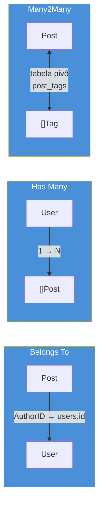
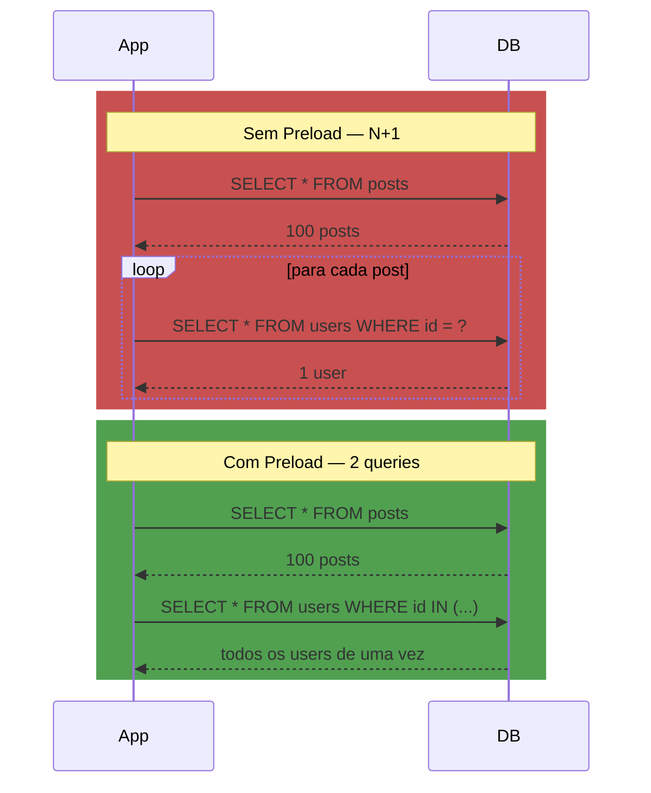

# GORM — o ORM

> [!abstract] TL;DR
> **GORM** é o ORM dominante do ecossistema Go: você declara `type User struct {...}` com tags `gorm:"..."`, chama `db.Create(&user)` ou `db.First(&user, 1)`, e a lib gera o SQL, faz o scan e resolve associações (`belongs to`, `has many`, `many2many`) sozinha via reflection. O ganho é velocidade de desenvolvimento em CRUD repetitivo — o custo é **N+1 queries por padrão**: carregar uma lista de posts e, para cada um, acessar `post.Author` sem `Preload("Author")` dispara uma query adicional por post. GORM resolve isso com `.Preload()` (query separada, batelada) ou `.Joins()` (um único `JOIN`). O trade-off maior, porém, não é sintaxe — é que Go, ao contrário de Java/Python, não tem tradição cultural de ORM: a maioria dos times sênior usa `database/sql`/`pgx` cru ou [[05 - sqlc — SQL type-safe por codegen|sqlc]] para o caminho quente, e reserva GORM para CRUD administrativo, protótipos e domínios onde a query é sempre simples.

## O cenário: CRUD que cansa de ser escrito à mão

Depois de ver [[03 - Query, Scan e o mapeamento manual|Query, Scan e o mapeamento manual]], você já sabe o preço de `database/sql` puro: cada tabela nova significa escrever `INSERT`, um `SELECT` com `rows.Scan(&a, &b, &c, ...)` campo a campo, um `UPDATE`, um `DELETE` — e repetir tudo de novo na próxima tabela. Para um serviço com 20 tabelas majoritariamente CRUD (um painel admin, um backoffice, um MVP que precisa sair rápido), isso é muito boilerplate para muito pouco risco: a query é sempre "pegue esse registro pelo ID" ou "insira esse struct".

É exatamente esse ponto de dor que o ORM (*Object-Relational Mapper*) ataca. Em vez de escrever SQL à mão, você declara o formato dos seus dados como structs Go, e a biblioteca infere o SQL a partir disso:

```go
type User struct {
    ID    uint
    Name  string
    Email string
}

var user User
db.First(&user, 1)               // SELECT * FROM users WHERE id = 1 LIMIT 1
db.Create(&User{Name: "Ana"})    // INSERT INTO users (name) VALUES ('Ana')
```

Nenhum SQL visível, nenhum `Scan` manual. Quem vem de Java (Hibernate/JPA) ou Python (Django ORM, SQLAlchemy) reconhece o padrão de cara — é o mesmo contrato: modele o dado, deixe a lib gerar a query. **GORM** é a implementação dominante desse padrão em Go, e é sobre ela que esta nota trata: quando ela ajuda de verdade, como ela modela associações, e — o ponto que mais gera bug de produção — como ela lida (ou falha em lidar) com N+1 queries.

## Onde um ORM ajuda — e onde atrapalha

A pergunta certa não é "GORM é bom ou ruim" — é "esse código é CRUD repetitivo ou é uma query que precisa de controle fino". GORM ganha claramente quando:

- O domínio é majoritariamente **CRUD simples**: criar, ler por ID, atualizar campos, deletar. Painéis administrativos, ferramentas internas, protótipos.
- O time quer **velocidade de desenvolvimento** acima de controle total sobre o SQL gerado, e a query não é hot path de performance crítica.
- Migrações de schema em desenvolvimento se beneficiam de `AutoMigrate` (assunto completo da [[07 - Migrations|próxima nota]]) para iterar rápido sem escrever DDL manual a cada mudança de struct.

GORM atrapalha quando:

- A query é complexa (agregações, `WITH` recursivo, janelas analíticas) — expressar isso via API fluente de ORM costuma ficar mais confuso que o SQL puro que ela tentaria gerar.
- Performance é crítica e você precisa controlar exatamente quantas queries disparam, em que ordem, com qual plano de execução — reflection e geração dinâmica de SQL colocam uma camada de opacidade entre você e o banco.
- O time já tem SQL bem escrito e quer apenas *type safety* sem abrir mão de controle — aí o caminho é [[05 - sqlc — SQL type-safe por codegen|sqlc]], que gera código Go a partir de SQL real, na direção oposta de GORM (que gera SQL a partir de structs Go).

> [!info] GORM não é "o jeito Go" de fazer persistência
> Diferente de Java, onde JPA/Hibernate é praticamente padrão de mercado para aplicações CRUD, e de Python, onde Django ORM vem embutido no framework, a comunidade Go **não tem consenso** sobre ORM. `database/sql` cru, `pgx`, `sqlc` e GORM coexistem como escolhas legítimas e concorrentes — a decisão depende do formato da query, não de convenção da linguagem.

## Models: structs com tags `gorm`

Um model GORM é um struct comum, anotado com tags de struct (o mesmo mecanismo de `encoding/json`, coberto na nota de struct tags do Galho 2) que dizem ao GORM como mapear cada campo para uma coluna:

```go
type User struct {
    ID        uint      `gorm:"primaryKey"`
    Name      string    `gorm:"size:100;not null"`
    Email     string    `gorm:"uniqueIndex"`
    CreatedAt time.Time
    UpdatedAt time.Time
}
```

`CreatedAt` e `UpdatedAt`, com esses nomes exatos, são um caso especial: o GORM os popula automaticamente em `Create`/`Save`, sem precisar de tag — é convenção sobre configuração, herdada diretamente do estilo Rails/ActiveRecord que inspirou o design da lib. Se o struct embutir `gorm.Model` em vez de declarar `ID`/`CreatedAt`/`UpdatedAt` manualmente, ganha também `DeletedAt` — habilitando *soft delete* (a linha não é apagada, só marcada como deletada) de graça:

```go
type Post struct {
    gorm.Model        // ID, CreatedAt, UpdatedAt, DeletedAt
    Title      string
    Body       string
    AuthorID   uint
}
```

## Associações: belongs to, has many, many2many

O ponto onde GORM entrega mais valor sobre `database/sql` cru é modelar relacionamentos entre tabelas — o SQL manual para isso é tedioso o suficiente para justificar a mágica.



```go
type User struct {
    ID    uint
    Name  string
    Posts []Post // has many — um User tem vários Post
}

type Post struct {
    ID       uint
    Title    string
    AuthorID uint // foreign key — convenção: <Tipo>ID
    Author   User // belongs to — um Post pertence a um User
}

type Tag struct {
    ID    uint
    Name  string
    Posts []Post `gorm:"many2many:post_tags;"` // many2many via tabela pivô
}
```

GORM infere a foreign key pelo nome — `AuthorID` num struct `Post` que tem campo `Author User` é reconhecido automaticamente como `belongs to`, sem precisar de tag adicional, seguindo a mesma convenção sobre configuração do Rails. Para `many2many`, a tag declara o nome da tabela pivô (`post_tags`), que o GORM cria e gerencia sozinho via `AutoMigrate`.

## O problema real: N+1 queries

Aqui está a armadilha que todo dev Go encontra na primeira vez que usa GORM em produção — e que a comunidade Go, vinda majoritariamente de código explícito, costuma achar particularmente traiçoeira. Carregar uma lista de posts e depois acessar o autor de cada um **não** carrega os autores junto por padrão:

```go
var posts []Post
db.Find(&posts) // 1 query: SELECT * FROM posts

for _, p := range posts {
    fmt.Println(p.Author.Name) // Author está zerado! Não foi carregado.
}
```

Esse código nem sequer dá erro — só imprime nomes vazios, porque `Author` é um `User{}` zerado. O padrão N+1 aparece quando você corrige isso do jeito ingênuo, buscando o autor um a um dentro do laço:

```go
var posts []Post
db.Find(&posts) // 1 query

for i := range posts {
    db.First(&posts[i].Author, posts[i].AuthorID) // +1 query POR post
}
```

Para 100 posts, isso é **101 queries**: 1 para a lista, mais 100 — uma por autor. É o mesmo problema de N+1 que aparece em qualquer ORM de qualquer linguagem (Hibernate, Django ORM, Prisma todos têm essa armadilha) — não é bug do GORM, é a consequência natural de *lazy loading* implícito combinado com um laço que acessa uma associação não carregada.



### A correção: `Preload`

`.Preload()` diz ao GORM, de forma explícita, para carregar a associação junto — mas via uma **segunda query em lote** (`WHERE id IN (...)`), não via `JOIN`:

```go
var posts []Post
db.Preload("Author").Find(&posts)
// query 1: SELECT * FROM posts
// query 2: SELECT * FROM users WHERE id IN (1, 2, 3, ...) -- todos os AuthorID de uma vez

for _, p := range posts {
    fmt.Println(p.Author.Name) // populado corretamente
}
```

Duas queries, não 101 — independente de quantos posts existam. `Preload` aceita string literal (`"Author"`) para o caso simples, e uma função de refinamento para filtrar a associação:

```go
db.Preload("Posts", func(db *gorm.DB) *gorm.DB {
    return db.Order("posts.created_at DESC").Limit(5)
}).Find(&users) // últimos 5 posts de cada user, não todos
```

Preloads aninhados usam ponto — `db.Preload("Posts.Tags").Find(&users)` carrega users, os posts de cada um, e as tags de cada post, em três queries em lote (não em cascata multiplicativa).

> [!info] `Joins` é a alternativa de uma query só
> `db.Joins("Author").Find(&posts)` faz o mesmo trabalho de `Preload` com um único `JOIN` SQL em vez de duas queries separadas. É mais eficiente em rede quando o volume é pequeno, mas duplica dados de `User` para cada `Post` na linha resultante (efeito clássico de `JOIN` um-para-muitos) — para relações `has many`, `Preload` costuma ser a escolha mais previsível.

> [!warning] `Preload` não é automático — cada consulta que atravessa associação precisa declarar explicitamente
> Esquecer `.Preload("Author")` numa nova rota do handler não gera erro de compilação nem de runtime — só campos zerados silenciosos, ou, pior, N+1 silencioso se o código tentar "corrigir" com uma busca dentro do laço. Isso é o oposto do costume de quem vem de um ORM que resolve lazy loading via proxy (Hibernate faz isso, gerando uma query por acesso ao campo, de forma ainda mais invisível). Revisar todo `.Find`/`.First` que popula um struct com campos de associação, perguntando "essa associação vai ser acessada depois? Tem `Preload`?", é hábito que compensa.

O N+1 em si — o padrão geral, fora do contexto GORM — é um problema cross-stack: aparece em qualquer camada que busca uma coleção e depois itera acessando dados relacionados sem antecipar o carregamento, do REST ao GraphQL. Vale revisar como ele é discutido em termos gerais de arquitetura de sistemas, fora do escopo específico desta nota sobre Go.

## Os custos reais do ORM em Go

Ganhar velocidade de escrita tem preço, e em Go esse preço aparece de formas específicas:

- **Reflection em todo lugar.** GORM usa `reflect` pesadamente para mapear structs para colunas em runtime — isso é mais lento que `Scan` explícito ([[03 - Query, Scan e o mapeamento manual|nota 03]]) ou código gerado por [[05 - sqlc — SQL type-safe por codegen|sqlc]], e o erro de mapeamento (tag errada, tipo incompatível) só aparece em runtime, não em tempo de compilação — contradizendo a filosofia "errado não compila" que domina o resto do ecossistema Go.
- **SQL escondido.** Debugar "por que essa rota está lenta" exige ativar o modo debug do GORM (`db.Debug()`) pra ver o SQL de fato gerado — com `database/sql` ou `pgx`, o SQL já está ali, escrito, visível no código.
- **Convenção implícita como fonte de bug.** A inferência de foreign key por nome de campo (`AuthorID` → `Author`) funciona até que o nome não siga a convenção exatamente, e o erro resultante é "associação não carregada", sem mensagem clara de por quê.
- **Curva de eficiência inversa em queries complexas.** Uma agregação com múltiplos `JOIN`, `GROUP BY` e subquery muitas vezes fica **mais difícil** de expressar via API fluente do GORM do que escrever o SQL direto — nesse ponto, `db.Raw("...")` (SQL cru dentro do GORM) ou abandonar o ORM para aquela query específica costuma ser a saída mais limpa.

## Quando NÃO usar GORM

- Query performance-crítica em hot path (serviço de alto QPS, latência sub-milissegundo importa): o overhead de reflection e a opacidade do SQL gerado atrapalham mais do que ajudam — prefira `pgx` ([[04 - pgx — o driver Postgres avançado|nota 04]]) ou sqlc.
- Query complexa (agregações, CTEs, window functions): SQL escrito à mão, com [[05 - sqlc — SQL type-safe por codegen|sqlc]] gerando os tipos Go a partir dele, dá controle total sem abrir mão de type safety.
- Time que já domina SQL e quer *apenas* eliminar o boilerplate de `Scan` sem pagar o preço de reflection: sqlc é o ponto exato desse meio-termo — SQL real, código gerado, sem runtime de ORM.
- Qualquer caso onde entender "quantas queries essa função dispara" precisa ser óbvio lendo o código, não descoberto em produção com `db.Debug()` ligado.

## Cross-stack: vindo de outro ORM

| Origem | Equivalente conceitual | Diferença que pega |
|---|---|---|
| Java (Hibernate/JPA) | `@OneToMany`, `@ManyToOne` | GORM não tem *lazy loading* via proxy transparente — sem `Preload` explícito, o campo fica zerado, não dispara query "escondida" no primeiro acesso (mais previsível, mas exige disciplina manual) |
| Python (Django ORM) | `ForeignKey`, `select_related`/`prefetch_related` | `Preload` do GORM ≈ `prefetch_related` do Django — ambos fazem query separada em lote; `Joins` do GORM ≈ `select_related` |
| Node (Prisma) | `include: { author: true }` | Prisma exige `include` explícito por padrão (parecido com a filosofia do GORM) — mas gera tipos TypeScript a partir do schema, algo que GORM não faz para Go (sqlc é o mais próximo disso no ecossistema Go) |

## Como explicar em inglês

> GORM is Go's dominant ORM: you declare models as plain structs with `gorm` struct tags, and it generates SQL via reflection, handling associations like `belongs to`, `has many`, and `many2many` automatically. The trade-off that catches every team the first time is **N+1 queries**: loading a list and then accessing an association field per item — without an explicit `.Preload("Association")` call — triggers one extra query per row, or worse, silently zeroed fields if you forget to reload it manually. `Preload` fixes this with a single batched `WHERE id IN (...)` query; `Joins` does it with one SQL join instead. Unlike Java or Python, Go has no cultural default toward ORMs — many senior teams reserve GORM for CRUD-heavy admin tooling and prototypes, reaching for `pgx` or `sqlc` whenever query control or hot-path performance matters more than development speed.

| Termo PT | Termo EN |
|---|---|
| carregamento antecipado | eager loading |
| carregamento preguiçoso | lazy loading |
| associação | association |
| chave estrangeira | foreign key |
| tabela pivô | pivot table / join table |
| exclusão lógica | soft delete |
| consulta em lote | batched query |

## O que vem a seguir

`AutoMigrate`, mencionado de passagem aqui como conveniência de desenvolvimento, não é uma ferramenta de produção — usar `AutoMigrate` direto em produção é uma das formas mais rápidas de perder controle sobre o schema do banco. A [[07 - Migrations|próxima nota]] entra na disciplina real de versionar schema: migrations explícitas, `up`/`down`, e por que "deixar o ORM inferir o schema" e "gerenciar mudanças de schema em produção com segurança" são dois problemas completamente diferentes.

## Veja também

- [[01 - database-sql — o contrato|01 — database/sql — o contrato]] — o contrato que GORM implementa por baixo
- [[03 - Query, Scan e o mapeamento manual|03 — Query, Scan e o mapeamento manual]] — o trabalho manual que GORM automatiza via reflection
- [[04 - pgx — o driver Postgres avançado|04 — pgx — o driver Postgres avançado]] — a alternativa de baixo nível quando performance importa mais que conveniência
- [[05 - sqlc — SQL type-safe por codegen|05 — sqlc — SQL type-safe por codegen]] — meio-termo entre SQL cru e ORM: SQL real, tipos gerados, sem reflection
- [[07 - Migrations|07 — Migrations]] — próxima nota do galho
- [[03-Dominios/Tecnologia/Go/index|Trilha Go]]

## Fontes

- GORM. *Declaring Models*. gorm.io. https://gorm.io/docs/models.html (acessado em 2026-07-18)
- GORM. *Associations*. gorm.io. https://gorm.io/docs/associations.html (acessado em 2026-07-18)
- GORM. *Preloading (Eager Loading)*. gorm.io. https://gorm.io/docs/preload.html (acessado em 2026-07-18)
- GORM. *Belongs To*. gorm.io. https://gorm.io/docs/belongs_to.html (acessado em 2026-07-18)
- GORM. *Has Many*. gorm.io. https://gorm.io/docs/has_many.html (acessado em 2026-07-18)
- GORM. *Many To Many*. gorm.io. https://gorm.io/docs/many_to_many.html (acessado em 2026-07-18)
