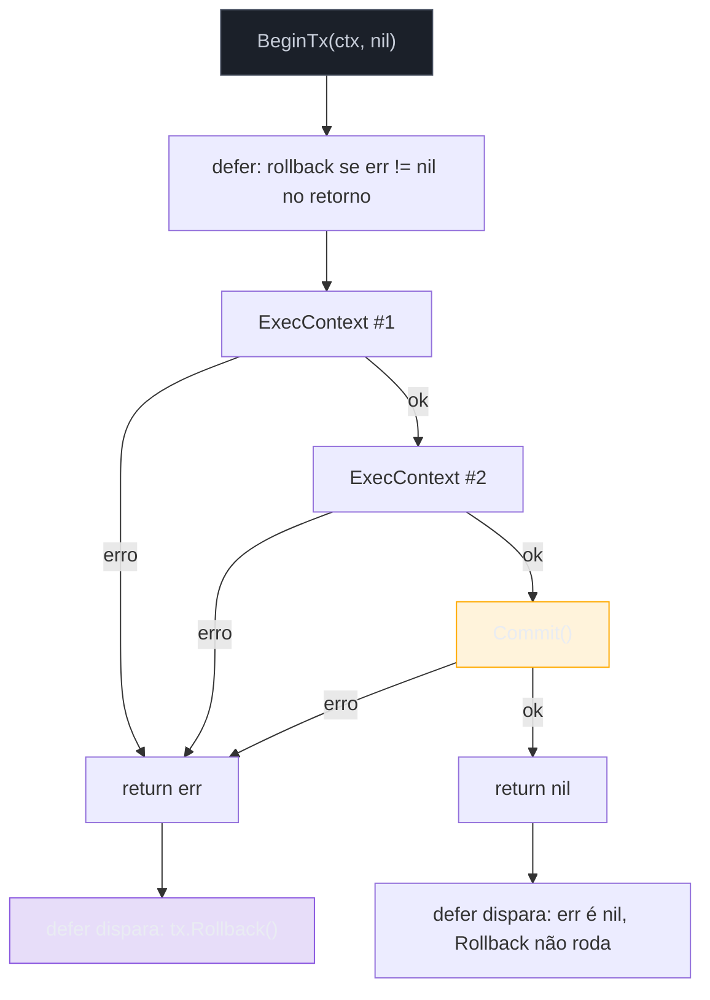
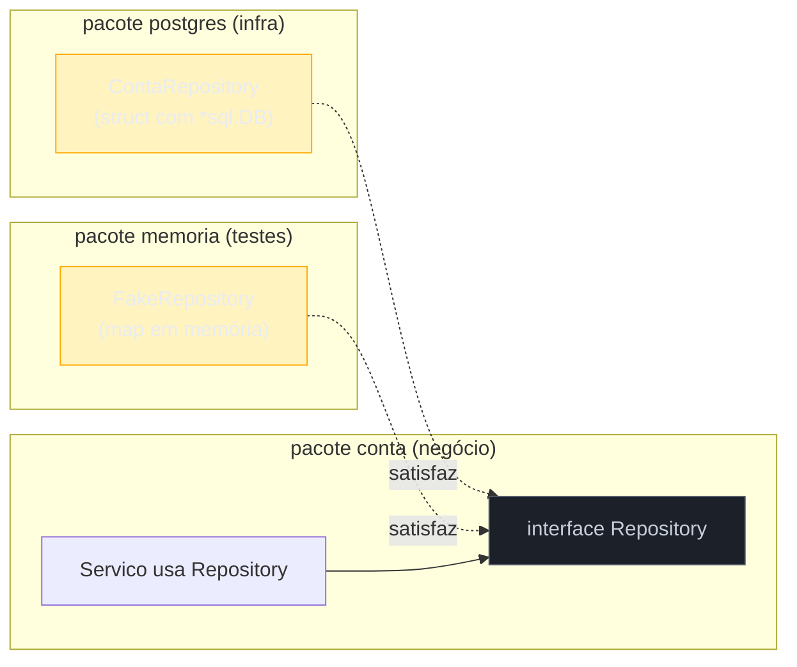

# Transações e o padrão repository

> [!abstract] TL;DR
> Uma transação em `database/sql` é um `*sql.Tx` obtido com `db.BeginTx(ctx, opts)`; todo o SQL da operação passa a rodar em cima desse `*sql.Tx`, nunca mais direto no `*sql.DB`. Ela termina com `Commit()` ou `Rollback()` — nunca os dois — e o idioma canônico é `defer` com uma flag de "já commitei" para decidir o rollback só quando algo deu errado no meio do caminho. `BeginTx` recebe `context.Context`: se o contexto for cancelado (timeout do request, cliente desconectou), a transação aborta sozinha. O **repository pattern** em Go não é uma classe abstrata nem uma hierarquia — é uma `interface` pequena, definida no pacote que *consome* a persistência (não no pacote que a implementa), o que separa lógica de negócio do SQL concreto e torna tudo testável com um fake, sem subir banco nenhum.

## O problema: duas escritas, uma falha no meio

Imagine uma transferência bancária. Debitar de uma conta, creditar em outra. Duas instruções `UPDATE`, duas chamadas a `db.ExecContext`:

```go
db.ExecContext(ctx, "UPDATE contas SET saldo = saldo - $1 WHERE id = $2", valor, contaOrigem)
db.ExecContext(ctx, "UPDATE contas SET saldo = saldo + $1 WHERE id = $2", valor, contaDestino)
```

Funciona no caminho feliz. Mas o processo cai entre as duas linhas — falta de energia, `panic`, deploy no meio, conexão de rede cortada — e o dinheiro simplesmente desaparece: debitado da origem, nunca creditado no destino. Cada `ExecContext` nessa versão é uma transação implícita própria, isolada da outra. O banco não sabe que as duas chamadas deveriam ser tratadas como uma coisa só.

É exatamente o problema que transação resolve: fazer o banco tratar um grupo de operações como **atômico** — ou as duas acontecem, ou nenhuma acontece. Isso não é peculiaridade de Go; é a garantia clássica de qualquer SGBD relacional (o "A" de ACID). O que muda de linguagem para linguagem é só a API que expõe esse mecanismo. Em Go, `database/sql` expõe transação através de um tipo dedicado: `*sql.Tx`.

## `BeginTx`: abrindo a transação com contexto

`db.Begin()` existe desde sempre no pacote, mas a nota 01 já estabeleceu que todo método do galho a partir daqui usa a variante `...Context`. Para transação não é diferente — `BeginTx` é a forma idiomática desde que `context.Context` chegou ao pacote:

```go
tx, err := db.BeginTx(ctx, nil)
if err != nil {
    return fmt.Errorf("begin tx: %w", err)
}
```

O segundo argumento é `*sql.TxOptions`, com dois campos: `Isolation sql.IsolationLevel` (nível de isolamento — `nil`/zero-value usa o padrão do driver, geralmente `READ COMMITTED` no Postgres) e `ReadOnly bool` (uma dica de otimização para o driver — transações somente-leitura podem evitar locks desnecessários em alguns bancos). Passar `nil` é o caso comum: usa o padrão do driver.

Quando o nível padrão não é suficiente — por exemplo, uma operação financeira que não pode tolerar *anomalias* de leitura concorrente — dá para pedir um nível mais forte explicitamente:

```go
tx, err := db.BeginTx(ctx, &sql.TxOptions{
    Isolation: sql.LevelSerializable,
    ReadOnly:  false,
})
```

`database/sql` define as constantes de `sql.IsolationLevel` (`LevelDefault`, `LevelReadUncommitted`, `LevelReadCommitted`, `LevelWriteCommitted`, `LevelRepeatableRead`, `LevelSnapshot`, `LevelSerializable`, `LevelLinearizable`) como um vocabulário comum entre drivers — mas **nem todo driver suporta todos os níveis**. O `pgx`/`lib/pq` do Postgres, por exemplo, não distingue `ReadUncommitted` de `ReadCommitted` (o Postgres nunca implementou o primeiro de verdade) e pode retornar erro se você pedir `Linearizable`. A tabela de compatibilidade de cada nível é responsabilidade do driver, não da biblioteca padrão — vale checar a documentação do driver específico (`pgx`, coberto na nota 04) antes de depender de um nível não-padrão em produção.

> [!warning] `database/sql` não tem savepoints nativos
> Bancos como Postgres suportam `SAVEPOINT`/`ROLLBACK TO SAVEPOINT` para desfazer só uma parte de uma transação maior, sem abortar tudo. `database/sql` não expõe isso como método — não há `tx.Savepoint()` no pacote padrão. Para usar savepoints é preciso emitir o SQL bruto (`tx.ExecContext(ctx, "SAVEPOINT meu_ponto")`) e gerenciar manualmente o nome e o momento do rollback parcial, ou recorrer a uma API de driver mais rica como o `pgx` (nota 04), que oferece suporte de mais alto nível a transações aninhadas via `pgx.Tx.Begin()` dentro de outra transação.

`tx` é do tipo `*sql.Tx` — e a partir daqui, **todo** SQL desta operação roda através dele, nunca mais direto em `db`:

```go
_, err = tx.ExecContext(ctx, "UPDATE contas SET saldo = saldo - $1 WHERE id = $2", valor, contaOrigem)
_, err = tx.ExecContext(ctx, "UPDATE contas SET saldo = saldo + $1 WHERE id = $2", valor, contaDestino)
```

`*sql.Tx` tem a mesma superfície de API que `*sql.DB` para leitura e escrita — `ExecContext`, `QueryContext`, `QueryRowContext` — porque ambos satisfazem, na prática, a mesma forma de uso (não há uma interface formal compartilhada no pacote, mas os métodos têm assinatura idêntica). O detalhe que realmente importa: `*sql.Tx` já está "amarrado" a **uma única conexão** do pool, retirada dele no momento do `BeginTx` e devolvida só quando a transação termina. É por isso que misturar `db.ExecContext` com `tx.ExecContext` na mesma operação é um erro sutil — a chamada em `db` pode pegar outra conexão do pool, fora da transação, e rodar como uma operação isolada, quebrando a atomicidade sem gerar erro nenhum de compilação ou execução.

> [!warning] Chamar `db.Query`/`db.Exec` por engano dentro de uma transação não gera erro — gera bug silencioso
> Uma vez que você tem `tx`, todo acesso a dados daquela operação passa por `tx`. Se um dos passos usar `db` por descuido, aquele passo roda fora da transação, numa conexão diferente — commit ou rollback de `tx` não o afeta. Não há aviso do compilador nem do banco: o SQL executa normalmente, só que sem a garantia de atomicidade que você pensava ter.

## `defer` com Commit/Rollback: o idioma canônico

A pergunta natural é: se `tx.ExecContext` retorna erro, quem desfaz o que já rodou? A resposta é `tx.Rollback()` — e o padrão consagrado na comunidade Go, replicado em praticamente todo código de produção que usa `database/sql`, é abrir a transação e imediatamente agendar um `defer` que decide, no fim da função, se deve reverter ou já não há nada a reverter:

```go
func transferir(ctx context.Context, db *sql.DB, origem, destino int, valor float64) (err error) {
    tx, err := db.BeginTx(ctx, nil)
    if err != nil {
        return fmt.Errorf("begin tx: %w", err)
    }
    defer func() {
        if err != nil {
            tx.Rollback()
        }
    }()

    if _, err = tx.ExecContext(ctx, "UPDATE contas SET saldo = saldo - $1 WHERE id = $2", valor, origem); err != nil {
        return fmt.Errorf("debitar origem: %w", err)
    }
    if _, err = tx.ExecContext(ctx, "UPDATE contas SET saldo = saldo + $1 WHERE id = $2", valor, destino); err != nil {
        return fmt.Errorf("creditar destino: %w", err)
    }

    return tx.Commit()
}
```

Repare em três detalhes de desenho que não são acidentais:

1. **`err error` é um retorno nomeado.** O `defer` lê a variável `err` no momento em que a função retorna — por isso ela precisa estar nomeada, não declarada localmente com `:=` dentro do corpo. Se algum `return fmt.Errorf(...)` acontecer, `err` já está setado quando o `defer` roda.
2. **`tx.Rollback()` depois de um `Commit()` bem-sucedido não é chamado** — porque a função só chega em `return tx.Commit()` no fim, e o `defer` já rodou por cima do valor final de `err`. Se `Commit()` for bem-sucedido, `err` é `nil` (o valor de retorno de `tx.Commit()` é atribuído a `err`, o nomeado), e o `if err != nil` dentro do `defer` não dispara.
3. **Chamar `Rollback()` numa transação já commitada retorna `sql.ErrTxDone`, mas o valor de retorno do `Rollback` dentro do `defer` está sendo ignorado de propósito.** Isso é seguro: `Rollback` depois de `Commit` é um no-op do ponto de vista de efeito no banco (o commit já aconteceu, não há nada a desfazer), e o pacote foi desenhado para tolerar essa chamada redundante sem pânico.



> [!info] `Tx.Commit`/`Tx.Rollback` liberam a conexão de volta ao pool
> A conexão que `BeginTx` reservou do pool (nota 02 do galho) só volta a ficar disponível para outras goroutines depois que `Commit` ou `Rollback` rodam. Uma transação aberta e nunca fechada — por exemplo, um `err` que causa `return` antes do `defer` ser registrado, ou um `panic` não recuperado antes do `BeginTx` — vaza uma conexão do pool inteiro. É outro motivo para o `defer` vir logo depois do `BeginTx` bem-sucedido, sem nada entre os dois que possa `panic`ar.

## Transação com context: cancelamento propaga sozinho

O `ctx` passado a `BeginTx` não é só burocracia de assinatura — ele é vigiado durante toda a vida da transação. Se o contexto for cancelado (o `http.Request` do cliente foi encerrado, um `context.WithTimeout` estourou) **enquanto a transação está aberta**, o `database/sql` chama rollback automaticamente e qualquer chamada subsequente em `tx` retorna erro:

```go
ctx, cancel := context.WithTimeout(context.Background(), 3*time.Second)
defer cancel()

tx, err := db.BeginTx(ctx, nil)
// se ctx expirar antes do Commit, a transação é revertida
// automaticamente pelo pacote — chamadas seguintes em tx falham
```

Isso resolve um problema real de robustez: sem isso, um cliente HTTP que desiste no meio de uma operação longa deixaria uma transação pendurada, segurando locks no banco, até algum timeout manual explícito derrubá-la. Com `ctx` propagado desde o handler HTTP (padrão que a nota 01 já estabeleceu), o cancelamento do request cancela a transação em cascata, sem código extra.

> [!warning] Cancelar `ctx` não substitui `defer tx.Rollback()` — os dois cuidam de coisas diferentes
> O cancelamento de `ctx` cobre o caso "o chamador desistiu". O `defer` cobre o caso "a própria lógica de negócio encontrou um erro e precisa desfazer". São gatilhos distintos — ambos precisam estar presentes.

## Blindando o `defer` contra `panic`

O `defer` do exemplo anterior cobre erro retornado normalmente, mas não cobre `panic` — se `tx.ExecContext` ou qualquer código no meio do caminho entrar em pânico (índice fora do slice, nil pointer, o que for), a função retorna sem nunca passar pelo `return`, e a variável `err` nomeada pode continuar `nil` mesmo com a transação abandonada a meio caminho. A versão robusta de produção recupera o `panic` dentro do próprio `defer`, converte em `Rollback` e opcionalmente relança:

```go
func transferir(ctx context.Context, db *sql.DB, origem, destino int, valor float64) (err error) {
    tx, err := db.BeginTx(ctx, nil)
    if err != nil {
        return fmt.Errorf("begin tx: %w", err)
    }
    defer func() {
        if p := recover(); p != nil {
            tx.Rollback()
            panic(p) // relança depois de garantir o rollback
        } else if err != nil {
            tx.Rollback()
        }
    }()

    // ... mesmas duas chamadas de antes ...

    return tx.Commit()
}
```

`recover()` só tem efeito quando chamado diretamente dentro de uma função `defer`ida — é por isso que a checagem de `panic` precisa estar nesse mesmo `defer`, e não em uma função auxiliar chamada por ele. O padrão "recover, rollback, re-panic" evita duas falhas simultâneas: a transação nunca fica pendurada segurando uma conexão do pool, e o `panic` original ainda se propaga para quem sabe tratá-lo (por exemplo, um middleware HTTP que recupera pânicos e responde 500).

> [!info] `recover()` dentro de `defer` — mecanismo geral, não específico de banco
> Esse padrão de `recover` dentro de `defer` é o mecanismo padrão de Go para "cleanup garantido mesmo sob pânico" — o mesmo usado para fechar arquivos, liberar locks ou reverter qualquer recurso adquirido. Nada aqui é exclusivo de `*sql.Tx`; é só a aplicação do idioma geral ao caso de uma transação de banco.

## O repository idiom em Go: interface na borda

Em linguagens com herança e frameworks de DI pesados, "repository pattern" costuma vir com uma classe base abstrata, um `IRepository<T>` genérico, e um container de injeção de dependência resolvendo tudo por reflection. Em Go, o padrão sobrevive, mas o *shape* muda por causa de uma regra que já apareceu antes na trilha (Galho 3, satisfação implícita de interface): **você define a interface no pacote que consome, não no pacote que implementa**.

Isso significa que o pacote de domínio/negócio declara a interface que ele precisa — não o pacote de banco de dados declarando "eu implemento isso":

```go
// pacote "conta" — regra de negócio, não sabe nada de SQL
package conta

import "context"

type Repository interface {
    BuscarPorID(ctx context.Context, id int) (*Conta, error)
    Salvar(ctx context.Context, c *Conta) error
}

type Conta struct {
    ID     int
    Saldo  float64
}

type Servico struct {
    repo Repository
}

func NovoServico(repo Repository) *Servico {
    return &Servico{repo: repo}
}

func (s *Servico) Depositar(ctx context.Context, id int, valor float64) error {
    c, err := s.repo.BuscarPorID(ctx, id)
    if err != nil {
        return fmt.Errorf("buscar conta: %w", err)
    }
    c.Saldo += valor
    return s.repo.Salvar(ctx, c)
}
```

```go
// pacote "postgres" — implementação concreta, importa database/sql
package postgres

import (
    "context"
    "database/sql"
    "fmt"

    "meuapp/conta"
)

type ContaRepository struct {
    db *sql.DB
}

func NovoContaRepository(db *sql.DB) *ContaRepository {
    return &ContaRepository{db: db}
}

func (r *ContaRepository) BuscarPorID(ctx context.Context, id int) (*conta.Conta, error) {
    var c conta.Conta
    err := r.db.QueryRowContext(ctx, "SELECT id, saldo FROM contas WHERE id = $1", id).
        Scan(&c.ID, &c.Saldo)
    if err != nil {
        return nil, fmt.Errorf("buscar conta %d: %w", id, err)
    }
    return &c, nil
}

func (r *ContaRepository) Salvar(ctx context.Context, c *conta.Conta) error {
    _, err := r.db.ExecContext(ctx, "UPDATE contas SET saldo = $1 WHERE id = $2", c.Saldo, c.ID)
    if err != nil {
        return fmt.Errorf("salvar conta %d: %w", c.ID, err)
    }
    return nil
}
```

`postgres.ContaRepository` não precisa de nenhuma declaração explícita de "eu implemento `conta.Repository`" — ele simplesmente tem os métodos com a assinatura certa, e o compilador aceita passá-lo onde `conta.Repository` é esperado, no `NovoServico`. É a mesma satisfação implícita de sempre, aplicada à camada de persistência.

Ainda assim, é comum — e recomendado pelo próprio [Effective Go](https://go.dev/doc/effective_go#blank_implements) — adicionar uma linha de asserção de tipo em tempo de compilação no pacote `postgres`, só para pegar cedo o caso em que alguém altera a assinatura de um método e quebra a satisfação sem perceber:

```go
var _ conta.Repository = (*ContaRepository)(nil)
```

Essa linha não faz nada em tempo de execução — `_` descarta o valor — mas força o compilador a verificar, na hora da build, que `*ContaRepository` de fato satisfaz `conta.Repository`. Sem ela, um método renomeado por engano só quebraria a satisfação de interface no ponto de uso (`NovoServico(repo)`), possivelmente longe do arquivo do repository e com uma mensagem de erro mais confusa.



Essa inversão — a interface pertence a quem consome, não a quem implementa — é o que a comunidade Go chama de "aceite interfaces, retorne structs concretos" (*accept interfaces, return structs*, do [Go Proverbs](https://go-proverbs.github.io/) de Rob Pike). `NovoServico` aceita `Repository` (interface, pequena, definida por ele mesmo); `NovoContaRepository` retorna `*ContaRepository` (struct concreto, sem interface nenhuma na assinatura de retorno). Quem decide que interface aquele struct precisa satisfazer é sempre o lado que consome.

> [!info] Interfaces pequenas, no ponto de uso — não um `Repository` genérico de 20 métodos
> É tentador desenhar uma interface `Repository[T]` genérica (usando generics, disponível desde Go 1.18) com `Create`, `Read`, `Update`, `Delete`, `List`, tentando reaproveitar entre todos os tipos de domínio. Isso empurra Go de volta para o molde de ORM genérico que a nota 06 já discutiu com ressalvas. O idioma da comunidade — reforçado pelo [Effective Go](https://go.dev/doc/effective_go#interfaces) — é o oposto: cada consumidor declara a interface **mínima** que ele precisa (`BuscarPorID` e `Salvar`, neste exemplo — nem `Deletar` nem `Listar`, porque o `Servico` de depósito não usa nenhum dos dois). Menos métodos na interface, mais fácil de satisfazer com um fake em teste.

## Testabilidade: fake sem subir banco nenhum

A recompensa direta de definir `Repository` como interface pequena no pacote de negócio é testar `Servico` sem tocar em SQL, driver ou container Docker nenhum:

```go
package conta

import (
    "context"
    "errors"
    "testing"
)

type fakeRepository struct {
    contas map[int]*Conta
}

func (f *fakeRepository) BuscarPorID(ctx context.Context, id int) (*Conta, error) {
    c, ok := f.contas[id]
    if !ok {
        return nil, errors.New("conta não encontrada")
    }
    return c, nil
}

func (f *fakeRepository) Salvar(ctx context.Context, c *Conta) error {
    f.contas[c.ID] = c
    return nil
}

func TestDepositar(t *testing.T) {
    repo := &fakeRepository{contas: map[int]*Conta{
        1: {ID: 1, Saldo: 100},
    }}
    servico := NovoServico(repo)

    err := servico.Depositar(context.Background(), 1, 50)
    if err != nil {
        t.Fatalf("Depositar retornou erro: %v", err)
    }

    if repo.contas[1].Saldo != 150 {
        t.Errorf("saldo esperado 150, obtido %v", repo.contas[1].Saldo)
    }
}
```

`fakeRepository` satisfaz `conta.Repository` do mesmo jeito implícito que `postgres.ContaRepository` satisfaz — nenhuma declaração explícita de "eu implemento X" em lugar nenhum. O teste roda em memória, em milissegundos, sem `docker compose up`, sem migration, sem depender de estado de um banco real entre execuções. É o mesmo argumento de testabilidade que já apareceu na nota 07 sobre migrations rodando em CI — só que aqui aplicado à lógica de negócio que fica **acima** do banco, não ao schema em si.

Testar o caminho de erro é igualmente barato — sem transação real, sem precisar forçar uma falha de rede ou de constraint no banco de verdade:

```go
type fakeRepositoryComFalha struct {
    fakeRepository
}

func (f *fakeRepositoryComFalha) Salvar(ctx context.Context, c *Conta) error {
    return errors.New("disco cheio") // simula falha de persistência
}

func TestDepositar_ErroAoSalvar(t *testing.T) {
    repo := &fakeRepositoryComFalha{
        fakeRepository{contas: map[int]*Conta{1: {ID: 1, Saldo: 100}}},
    }
    servico := NovoServico(repo)

    err := servico.Depositar(context.Background(), 1, 50)
    if err == nil {
        t.Fatal("esperava erro, obtido nil")
    }
}
```

Reproduzir "o banco falhou no meio da operação" contra um banco real de teste exige truques frágeis — matar a conexão no timing certo, injetar uma constraint que sempre viola. Contra o fake, é só um método que retorna `error` — o mesmo custo de qualquer outro teste de unidade em Go.

> [!warning] Repository que expõe `*sql.Tx` no método vaza a implementação para o consumidor
> Um erro comum ao tentar dar suporte a transações multi-repository é mudar a interface para `BuscarPorID(ctx context.Context, tx *sql.Tx, id int)`. Isso força **todo** consumidor — inclusive `fakeRepository` em teste — a lidar com `*sql.Tx`, mesmo quando não há SQL nenhum de verdade ali. A alternativa idiomática é o repository expor um método de mais alto nível para orquestrar a transação, sem vazar o tipo concreto do driver para quem consome:
>
> ```go
> // ainda no pacote conta — a interface de negócio nunca menciona sql.Tx
> type UnidadeDeTrabalho interface {
>     ComTransacao(ctx context.Context, fn func(Repository) error) error
> }
> ```
>
> No pacote `postgres`, a implementação concreta abre a `tx` com `BeginTx`, constrói uma segunda instância de `ContaRepository` amarrada a essa `tx` (em vez de a `db`), e chama `fn` passando essa instância — o `defer` de rollback/commit descrito nas seções anteriores mora exatamente aqui, escondido atrás da interface. O `fakeRepository` de teste implementa `ComTransacao` chamando `fn(f)` diretamente, sem transação nenhuma por trás — porque em memória não há nada para reverter.

## Lente cross-stack

| Vindo de... | Em Go |
|---|---|
| Java + Spring `@Transactional` | Não existe anotação declarativa — `BeginTx`/`Commit`/`Rollback` são chamadas explícitas, com `defer` fazendo o papel do "rollback automático em exceção" |
| Java `interface Repository<T, ID> extends JpaRepository<...>` | Sem hierarquia genérica de repositório — cada domínio declara sua própria interface pequena, só com os métodos que usa |
| Python SQLAlchemy `Session` + `with session.begin():` | Papel equivalente ao `defer` + flag de erro, mas via context manager (`__exit__` decide commit/rollback pela presença de exceção) |
| Node/TypeORM `queryRunner.startTransaction()` | Mesma forma imperativa de `BeginTx`; `try/catch/finally` no lugar do `defer` |
| Qualquer linguagem com mocking framework (Mockito, unittest.mock) | Fakes escritos à mão em vez de mock gerado por reflection — Go prefere um `struct` simples implementando a interface a uma biblioteca de mock dinâmico |

## Como explicar em inglês

> A transaction in `database/sql` starts with `db.BeginTx(ctx, opts)`, which returns a `*sql.Tx` — every subsequent query for that operation must go through `tx`, never back through `db`, or it silently escapes the transaction on a different pooled connection. The canonical Go idiom pairs `BeginTx` with a `defer` that inspects a named `err` return value: if `err` is non-nil when the function returns, the deferred closure calls `tx.Rollback()`; otherwise the function's own `return tx.Commit()` is the last word, and the deferred `Rollback()` becomes a safe no-op. Because `BeginTx` takes a `context.Context`, cancelling that context — a client disconnect, a timeout — aborts the transaction automatically, without extra code. The **repository pattern** in Go inverts the usual OO convention: the interface is declared by the *consuming* package (the business-logic side), not by the package that implements it against a concrete database. That keeps the interface small — only the methods the consumer actually calls — and makes it trivial to substitute a hand-written in-memory fake in tests, with zero database, zero mocking framework, and zero reflection involved.

| Termo PT | Termo EN |
|---|---|
| transação | transaction |
| confirmar (a transação) | commit |
| reverter / desfazer | rollback |
| nível de isolamento | isolation level |
| conexão do pool | pooled connection |
| interface na borda (do consumidor) | interface at the consumer boundary |
| dublê de teste / fake escrito à mão | hand-written test double / fake |
| vazar a implementação | leak the implementation |

## O que vem a seguir

Esta é a última nota do Galho 11 — Persistência. O galho cobriu o contrato `database/sql`, connection pool, mapeamento manual, o driver avançado `pgx`, codegen com `sqlc`, o ORM `GORM`, migrations e, agora, transações e o padrão repository amarrando tudo em código testável. O próximo galho muda de eixo: em vez de persistir dados dentro de um processo, o **Galho 12 — gRPC e protobuf** trata de como dois processos Go (ou um processo Go e um serviço em qualquer outra linguagem) conversam entre si de forma tipada e eficiente — a mesma disciplina de contrato explícito que `database/sql` aplica ao banco, agora aplicada à rede.

## Veja também

- [[01 - database-sql — o contrato|01 — database/sql — o contrato]] — `*sql.DB`, `ExecContext`/`QueryRowContext`, base de tudo usado aqui
- [[02 - Connection pool|02 — Connection pool]] — de onde vem a conexão que `BeginTx` reserva para a transação
- [[03 - Query, Scan e o mapeamento manual|03 — Query, Scan e o mapeamento manual]] — `Scan` usado dentro do repository de exemplo
- [[07 - Migrations|07 — Migrations]] — mesma disciplina de testabilidade em CI, aplicada ao schema em vez da lógica de negócio
- [[03-Dominios/Tecnologia/Go/index|Trilha Go]]

## Fontes

- The Go Authors. *Package database/sql — Tx*. pkg.go.dev. https://pkg.go.dev/database/sql#Tx (acessado em 2026-07-18)
- The Go Authors. *Package database/sql — DB.BeginTx*. pkg.go.dev. https://pkg.go.dev/database/sql#DB.BeginTx (acessado em 2026-07-18)
- The Go Authors. *Package context*. pkg.go.dev. https://pkg.go.dev/context (acessado em 2026-07-18)
- The Go Authors. *Effective Go — Interfaces*. go.dev. https://go.dev/doc/effective_go#interfaces (acessado em 2026-07-18)
- Go by Example. *Interfaces*. gobyexample.com. https://gobyexample.com/interfaces (acessado em 2026-07-18)
- The Go Authors. *The Go Programming Language Specification — Interface types*. go.dev. https://go.dev/ref/spec#Interface_types (acessado em 2026-07-18)
